# Using the Animation Browser and UKX Animation Packages

*Document Summary: A comprehensive reference for the Animation Browser and importing .UKX packages.**Document Changelog: Last updated by Michiel Hendriks for version 3323. Previously updated by Tom Lin (DemiurgeStudios?) for updating and division from tutorial section. Original authors - Tom Lin (DemiurgeStudios?), Erik de Neve ([EpicGames](https://udn.epicgames.com/Main/EpicGames)).*

* [Using the Animation Browser and UKX Animation Packages](#using-the-animation-browser-and-ukx-animation-packages) 
  + [Introduction](#introduction)
  + [Browser Layout](#browser-layout)
  + [Toolbar Buttons](#toolbar-buttons)
    - [Import Buttons](#import-buttons)
      * [Import Skeletal Mesh](#import-skeletal-mesh)
      * [Import Skeletal Animation](#import-skeletal-animation)
      * [Import Additional Animation Data](#import-additional-animation-data)
      * [Link Animation to Mesh](#link-animation-to-mesh)
    - [View Buttons](#view-buttons)
      * [Animation Set Information](#animation-set-information)
      * [View Bounds](#view-bounds)
      * [View Bones](#view-bones)
      * [View Bone Names](#view-bone-names)
      * [View Reference Pose](#view-reference-pose)
      * [View Influences](#view-influences)
      * [Toggle Raw Offset Display](#toggle-raw-offset-display)
      * [View Wireframe](#view-wireframe)
    - [Mesh Properties Buttons](#mesh-properties-buttons)
      * [Copy Mesh Properties](#copy-mesh-properties)
      * [Paste Mesh Properties](#paste-mesh-properties)
    - [Level of Detail Buttons](#level-of-detail-buttons)
      * [Cycle Through LOD Mesh Levels](#cycle-through-lod-mesh-levels)
      * [Import a Single LOD Mesh](#import-a-single-lod-mesh)
      * [Redigest LOD Levels](#redigest-lod-levels)
      * [Recompress Animation Data](#recompress-animation-data)
      * [Forced Synchronous In-Level Animation](#forced-synchronous-in-level-animation)
  + [Tabbed Properties](#tabbed-properties)
    - [Mesh Tab](#mesh-tab)
      * [Animation](#animation)
      * [Attach](#attach)
        + [Attach Fields](#attach-fields)
        + [Script-based Attach Tag](#script-based-attach-tag)
      * [Collision](#collision)
        + [CollisionBoxes](#collisionboxes)
        + [CollisionSpheres](#collisionspheres)
      * [Imposter](#imposter)
      * [LOD](#lod)
        + [LOD\_Strength](#lod-strength)
        + [LOD Levels](#lod-levels)
          - [DistanceFactor](#distancefactor)
          - [Hysteresis](#hysteresis)
          - [MaxInfluences](#maxinfluences)
          - [RedigestSwitch](#redigestswitch)
          - [ReductionFactor](#reductionfactor)
          - [Rigidize](#rigidize)
        + [Importing a Single LOD Mesh](#importing-a-single-lod-mesh)
      * [Mesh](#mesh)
        + [MaxVisBound & MinVisBound](#maxvisbound-minvisbound)
        + [Rotation](#rotation)
        + [Scale](#scale)
        + [Translation](#translation)
        + [VisSphereCenter](#visspherecenter)
        + [VisSphereRadius](#vissphereradius)
      * [Redigest](#redigest)
      * [Skin](#skin)
    - [Animation Set](#animation-set)
      * [GlobalCompression](#globalcompression)
        + [Earlier versions (pre 3323)](#earlier-versions-pre-3323))
      * [CompressionMethod](#compressionmethod)
      * [Recompression Notes](#recompression-notes)
    - [Sequence](#sequence)
      * [Groups](#groups)
      * [SequenceProperties](#sequenceproperties)
    - [Notify](#notify)
    - [Prefs](#prefs)
  + [Miscellaneous](#miscellaneous)
    - [Animation sequences and sorting controls](#animation-sequences-and-sorting-controls)
    - [Animation playback controls](#animation-playback-controls)
  + [Pull Down Menu](#pull-down-menu)
    - [File](#file)
    - [View](#view)
    - [Edit](#edit)
    - [Mesh](#mesh)
    - [Animation](#animation)
  + [UKX package management](#ukx-package-management)
  + [Notes and known issues](#notes-and-known-issues)

## Introduction

This document will function as a reference, explaining the features and interface of the animation browser. For an introductory tutorial on how to use the browser, see the [AnimBrowserTutorial](AnimBrowserTutorial.md) doc.The bulk of the functionality needed to bring (skeletal) mesh animation data into the Unreal Engine is built into the 'Animation Browser' window inside the Editor. The (\*UKX) animation package, the end product, holds binary, digested data in a format loadable at runtime by the engine or editor. Using UKX packages, you can import meshes and animations directly from .PSA and .PSK binary files, assign materials, and have the meshes animate in the editor.In most cases, the animation browser will be the preferred method for linking animations and meshes. It is much more user friendly than the previous script-based system.
The script-based art-path of linking in animation and mesh data using script #exec commands into packages is largely obsolete, but still supported. For a few types of resources it may still remain the preferred art pathway (see also "Important Notes" below).

## Browser Layout

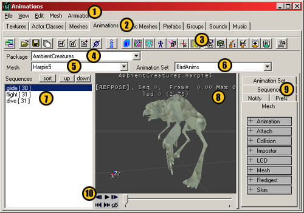

* 1: [Pull down Menus](#pull-down-menu). These duplicate the functionality of the buttons, and sometimes extend them.
* 2: Browser tabs. *Animations* should be selected, of course.
* 3: [The toolbar buttons](#toolbar-buttons). The more heavily used functions have places here.
* 4: Package name.
* 5: Mesh name.
* 6: Animation set name.
* 7: [Animation sequences and sorting controls.](#animation-sequences-and-sorting-)
* 8: The model viewport
* 9: [Model properties tabs](#tabbed-properties).
* 10: [Animation playback controls](#animation-playback-controls)

## Toolbar Buttons


### Import Buttons

#### Import Skeletal Mesh


Use this button to import .PSK files into the browser. .PSKs hold model and rigging information. The functionality of this button is also duplicated in the top pull-down menus under *File*.

#### Import Skeletal Animation

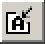

This will import .PSA files into the browser. A .PSA holds animation information. The functionality of this button is also duplicated in the top pull-down menus under *File*.

#### Import Additional Animation Data

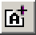

Use this button to append new animations from a .PSA into an already extant list of animations. The functionality of this button is also duplicated in the top pull-down menus under *File*.

#### Link Animation to Mesh

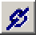

This button will link together a mesh and a set of animations. This step is very important, as your mesh will remain immobile until it is told which animations to hook to. The functionality of this button is also duplicated in the top pull-down menus under *Edit*.

### View Buttons

#### Animation Set Information

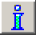

This will bring up a window that has lots of nitty-gritty details about the model. The list includes information such as LOD size, facecount, vertex count, joint number, influences, etc. The functionality of this button is also duplicated in the top pull-down menus under *View*.

#### View Bounds

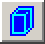

This will show the view visibility bounding box. The visibility boundaries for skeletal meshes are static relative to the mesh's zero-point, and don't depend on any animations.
This bounding box determines visibility. If any part of this box is visible ( if any part of it falls in the view frustrum, and is not totally occluded by the anti-portals etcetera ), then the render code for its mesh will be executed. It has no bearing whatsoever on collision.
It is possible to change the size of the bounding box in the mesh properties. Go
[here](#maxvisbound-minvisbound) to see how.

#### View Bones

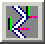

This will turn off the mesh and show the bone structure, instead. Three different views are possible with repeated presses.

* Mesh
* Bones
* Mesh with bones

#### View Bone Names

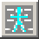

This toggles the names of individual bones on/off in the viewport. Note that this button must be used in conjunction with the `View Bones' button. If the viewport is showing only the bones or the `mesh with bones' views, then the bone names will also appear. If the mesh is drawn without bones, then the bone names will also not be shown.

#### View Reference Pose

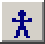

This will pop the mesh into the reference pose ( the default pose that resided in the PSK). Can be toggled on/off. A few strange behaviors are associated with this button.

* If this is toggled on, then note that playing an animation will **not** break the model out of the reference pose. It will un-toggle the reference pose button off, however.
* If this is toggled on, and then a new animation is chosen from the animation list, then the new animation will be in its animated, non-reference pose. If the toggle is turned `off,' then the animation will snap to the reference pose (as if the button was `on').
* If this is toggled on, and the `frame forward' or `frame backward' buttons are pressed (animation playback buttons) then the model will snap out of the reference pose.

If you'd like to `reset' the reference pose button to it's normal state (up off, down on) then simply hit the `play animation' button a few times.

#### View Influences

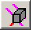

View normals and influences. Small color-coded normal vectors originate at each vertex, where the coloring signifies the number of bone influences acting on that vertex as follows:

* green - single influence
* red - two
* pink - three
* light blue - four
* white - five or higher

If you ever see light blue or white normals, then your model is using too many influences. In the rigging setup (in your 3D modeling package), the maximum number of bone influences should be set to a maximum of three. While it is possible to use more than three, the more influences a vertex has, the slower it will render.The software skinning code limits the number of influences per bone to 7. Hardware skinning (PS2, Xbox) will be 3-4. To be safe, limit your meshes to a maximum of 3 influences, to avoid cross-platform issues.

#### Toggle Raw Offset Display

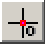

View at original mesh-space offset. Draws the mesh without any additional translation (see Mesh properties) Specially useful since (at least in UT) the desired mesh-displacement is such that its 'middle' sits at zero-Z - which is a UnrealEngine? specific gameplay code convention, not a renderer issue.

#### View Wireframe

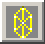

This lets you view the mesh in wireframe mode.

### Mesh Properties Buttons

The Mesh Properties are located in the right tabbed section of the animation browser. For more about the Mesh Properties section, go [here](#mesh-tab).

#### Copy Mesh Properties

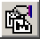

This button will let you copy all of the mesh properties in the tabbed properties section.

#### Paste Mesh Properties

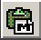

This button will let you paste all of the mesh properties in the tabbed properties section.

### Level of Detail Buttons

It's possible to set levels of detail, depending on distance from the camera. To see more information about setting LOD levels, go [here](#lod).

#### Cycle Through LOD Mesh Levels


This button will cycle through all the levels of mesh detail. There can be a maximum of eight levels

#### Import a Single LOD Mesh

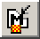

This allows you to import a .PSK as a static LOD level, which gives much finer control over the appearance of a simplified mesh. Creating these simplified meshes is more time intensive, of course, and so the advantage of a better looking simple mesh must be weighed against the cost.

#### Redigest LOD Levels


This button forces the engine to re-evaluate your LOD settings when you change them.

#### Recompress Animation Data

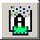

*In version 3323 this button is no longer available, see [Animation Set](#animationset) section for more information about this.*If you've made changes to your animations in the browser that might make them smaller, you'll want to hit this button. You have the option of recompressing an entire set at a time, or individual animations. It will perform a task based on which tab is open in the tabbed properties section, `Animation Set' or `Sequence,' so make sure the right one is picked.It is important to keep in mind that any compression performed on the data with this button is a one-way process - if you over-compressed and need to go back to the original raw animation, you'll need to re-import the .PSA source data - so, be sure to always backup .PSA data files - and of course the 3DS Max or Maya files from which they were created.You'll receive one of two confirmation windows:

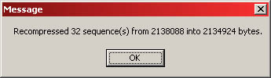

or

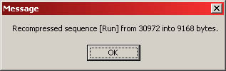

#### Forced Synchronous In-Level Animation


Animation of skeletal meshes can now be previewed in the editor, to check lighting or placement in relation to animation, if actors displaying them have been placed in a level. It's fairly easy to do, but there are a number of steps along the way that you'll have to keep in mind.*This example uses content in the 3323 code drop.*1. First of all, open a level in UnrealEd. Turn on the realtime preview button.


2. Next, go back to the browser window and open the actor browser tab. For testing purposes, we need to first drop in any existing skeletal actor mesh. Find *\*Pawn* and open up that category. Under *\*UnrealPawn* select \*xPawn.

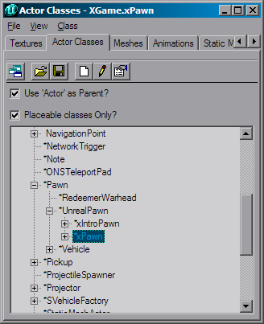

3. Go back to the animation browser. Select the animated mesh and the sequence that you want to test out in the level.4. Go back to your level and bring up the right-click menu. You should see an option like, "Add xPawn Here." Add the trooper into the level.

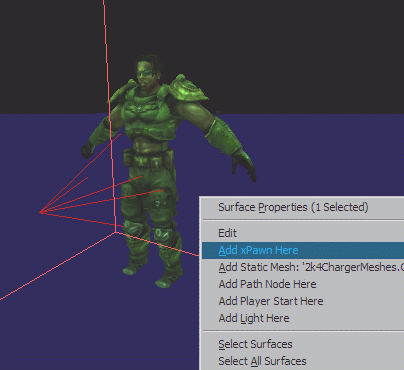

5. Once the trooper is in the world, right-click on it and bring up its actor properties. Under the section *Display* there is a field *Mesh*. It should show a packagename and a meshname. Now, if you have already selected the mesh you want to test out, just click the field and hit the `Use" button.

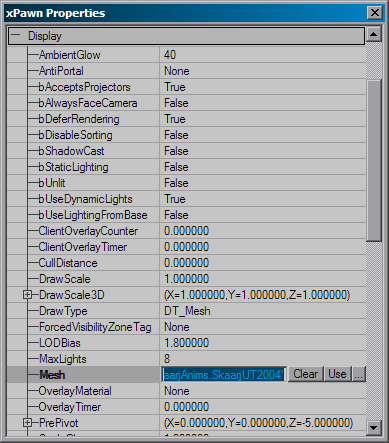

6. Your mesh should have updated to reflect the new mesh. Now, go back to the animation browser. Finally, you can hit the "Forced Synchronous In-Level Animation" button. Now any instance of the browser's active mesh in the level will move in sync with the animbrowser's mesh. You can use the scrub bar from the animation browser, loop the animation, select different sequences, etc.

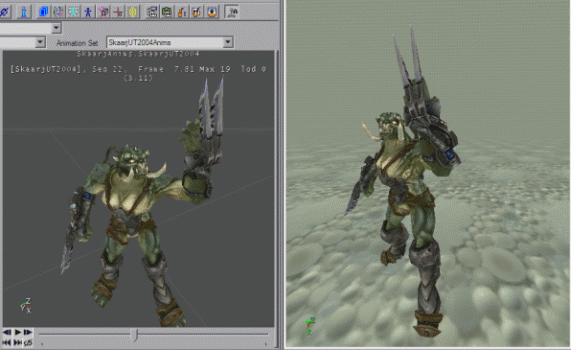

Note that the "Forced Synchronous In-Level Animation" button needs to be re-clicked if you change the mesh you're previewing or place new actors with a mesh you want to animate in the level, because that's how the editor is spurred to search for any instances of the mesh in the level an forces them to animate in sync with the current browser mesh.

## Tabbed Properties

### Mesh Tab

This is the largest tab by far. The properties exposed here allow adjustment the mesh properties that used to depend on many "#exec MESH" type commands, including adjustment of scale, rotation, visibility bounding box and the assignment of materials. You'll probably be spending most of your time in this tab.

#### Animation

There is only one field in this category. It simply shows which animation set is linked to the mesh as the default. In theory, you can change it with the "Use" button attached to the field. In practice, you can type in the Animation Set name.

#### Attach

This allows in-editor creation and semi-visual adjustment of the 'AttachName' sockets, - visual, as in type-in-new-numbers and see stuff move - the creation of which used to be restricted to the #exec script commands.
In this 'Attach' section there is an interactive array of 'Sockets'. The array is inline-editable (like the LOD levels, for example), to manage a variable number of sockets by inserting, adding, or deleting individual ones and adjusting their properties.

##### Attach Fields

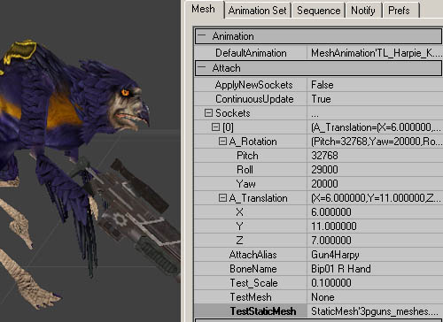

There are quite a few fields to fill out. We'll take them in order.

* **ApplyNewSockets:** This is really the last option in this section you should be looking at. This is a single-shot 'apply-all-changes' button which when set to true will copy the changes you have made back into the mesh data (and it instantly reverts to false again.)
* **ContinuousUpdate:** To see specific test-attachments change position and scale interactively, you'll need to set this to `True.'
* **A\_Rotation:** These values change the rotation of your mesh. Remember that these values need to be given in Unreal Units (URUs), where 90� = 16384 URUs and 180� = 32786 URUs.
* **A\_Translation:** These values change the placement of your mesh. Unless you are working at a really gigantic scale, the numbers you'll use in these fields should be much more reasonable than in A\_Rotation.
* **AttachAlias:** This is the name you will use to refer to this attachment location. For example, "weaponbone." In script (example given below), this would correspond to the `TAG.'
* **BoneName:** This is simply the name of the bone that you will have this attach point take as its parent (click the "view bones" and "view bone names" buttons to see which one you want). As you can see in the image, this model uses the bone *Bip01 R Hand* for the weapon bone. **IMPORTANT NOTE:** If your bone names have spaces in them, as is customary for character studio, then when you type in the bone name you will need to use quotes surrounding your bone name. For example, *"Bip01 R Hand"* and not simply *Bip01 R Hand*.
* **Test\_Scale:** This is how large the attached mesh will appear in the preview window. This is an optional field. This will not get saved.
* **TestMesh:** Selecting a skeletal 3rd person mesh for positioning is a little trickier, because the 'use current' button comes up with the player mesh itself (doh!) so you'll need to type (or copy/paste) the full object name in the TestMesh box (i..e. SkeletalMesh'XWeapons\_rc.MinigunHandMesh'). This is an optional field. This will not get saved.
* **TestStaticMesh:** This field indicates which static mesh you will be prototyping the attachment with. You can change this by going to the static mesh browser, selecting an appropriate mesh, and coming back to this field and hitting the `Use' button. If TestStaticMesh and TestMesh are both `on,' TestMesh will take precedence. This is an optional field. This will not get saved.

##### Script-based Attach Tag

This is how the script-based attach tag looks:#exec MESH ATTACHNAME MESH=WarriorMesh BONE="right\_wrist\_2" TAG="weaponbone" YAW=-64.0 PITCH=00.0 ROLL=128.0 X=0 Y=0 Z=0The first four properties are the same ones as in the above script command, and are all that gets saved for/defines each 'socket'.
For visual feedback, the optional temporary TestScale, TestMesh and TestStaticMesh can be used. These will be erased as soon as you select some other mesh, since they're only meant to help adjust the sockets and never saved with the actual mesh in the UKX.

#### Collision

This category allows you to add collision information that can be used by Karma. Note that you will need to go to the `View' menu, and choose `Collision' to see the collision hulls.

##### CollisionBoxes

* BoneName: Put the name of the bone you want to make a collision box around. Remember that due to character studio naming, you'll have to use quotations around bones with spaces in their names. ("Bip01 R Hand')
* Offset: Translates the location of the collision box.
* Radii: These are the values for the dimensions of the box.

##### CollisionSpheres

* BoneName: Put the name of the bone you want to make a collision box around. Remember that due to character studio naming, you'll have to use quotations around bones with spaces in their names. ("Bip01 R Hand')
* Offset: Translates the location of the collision sphere.
* Radius: This is the value for the sphere size.

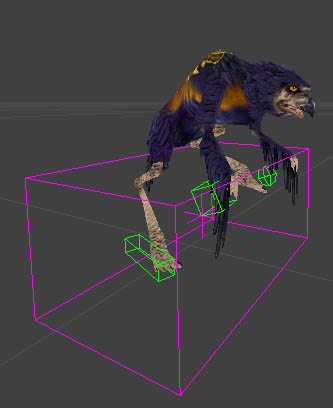

This image shows the collision hulls that can be added in this section. The green wireframes are the hulls themselves, while the purple wireframe encompasses all the hulls on a mesh.

#### Imposter

Imposter is the last step in the LOD system. Before you read this section, you may want to familiarize yourself with the workings of the LOD, in the section below.

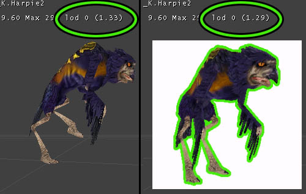

Imposter takes the mesh LOD one step further, and allows artists to swap in an image to stand in for meshes. If you are using Imposter, you'll find that it appears after the distance from the camera falls below the DistanceFactor (see image) that is set in the last LOD level. This number is set in the field, *Mesh > LOD > LODLevels > (LOD Level number) > DistanceFactor*. In the above image, the DistanceFactor is set to 1.3; when the number is above (closer) 1.3, the mesh appears. When it falls below (further away), the Imposter kicks in.
There are a few values you need to fill in to use Imposter correctly:

* bImposterPresent: This is set to false by default. This must be turned to `True' to use Imposter.
* ImpColor: There are four fields in this, all set by default to 0. Set them all to 255.
* ImpDrawMode: This has two possible values, IDM\_Normal (default) and IDM\_Fading.
* ImpLightMode: There are 3 choices, ILM\_Unlit, ILM\_Pseudoshaded and ILM\_Uniform.

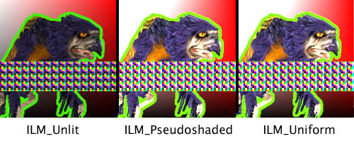

* ImpSpaceMode: This controls how the texture will appear to the user as they walk around it. There are 4 options:

  \*ISM\_Sprite
  :   The Impostor will always face the camera.

  \*ISM\_Fixed
  :   The Imposter will not rotate to face the camera.

  \*ISM\_PivotVertical
  :   The Imposter will rotate along the Y-axis to face the camera. (walking left and right around it)

  \*ISM\_PivotHorizontal
  :   The Imposter will rotate along the X-Axis to face the camera (above and below)

* RelativeLocation: This allows you to move the Imposter from its centerpoint
* RelativeRotation: This allows you to rotate the Imposter.
* Scale3D: This allows you to alter the size of the Imposter.
* SpriteMaterial: This is the field that lets you choose which texture to use for the Imposter. You'll need to navigate between the texture and animation browsers, and hit the associated `Use' button in the field.

#### LOD

##### LOD\_Strength

This is an overall factor to scale the internal distance-detail factor; it is displayed in real time at the end of the status line in the view window.

##### LOD Levels

The smooth vertex-collapse level-of-detail rendering code has been replaced with a static LOD scheme, which gives the artist more control and is ultimately much faster for the same amount of displayed detail than the older, variable-level-of-detail code.The new scheme is backward compatible with existing .UKXs, and uses the collapse data already precomputed inside the .UKX mesh data to generate four static levels of detail, which can be adjusted by artists to find the right trade-off between speed and detail. You can add a variable number of levels of detail - the maximum is 8.The levels-of-detail will kick in when you move away from the model in the central view window, just as it does in the game. This allows quick interactive adjustment of the detail meshes. Alternatively, you can use the `Cycle Through the LOD Mesh Levels' button. The active level of detail is shown in the viewport as 'lod n', - when you force the level of detail (using the orange cycle-LOD button with the little squares ) you'll see it in upper case like 'LOD [n]'.

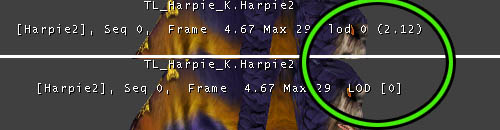

###### DistanceFactor

This number tells the engine when to start using the next detail level. Lower numbers indicate that the model must be farther away before the next LOD level will activate.This value will be compared against an internal factor calculated from a combination of the mesh size, screen resolution and actor distance. Whenever the number displayed in the viewport status header next to the non-forced 'lod n' indicator reaches the DistanceFactor value, the **next** LOD level will take effect. (see picture above)

###### Hysteresis

This value gives a range around the DistanceFactor within which the
level of detail will be 'sticky' and not change. Any reasonably small value ( like 0.01 ) will help eliminate potential flicker that would otherwise occur when a mesh happens to sit at the exact boundary of two LODs, distance-wise.Hysteresis and DistanceFactor can be edited and take effect immediately. The remaining three variables in each LOD however determine how to rebuild the individual LOD levels whenever the 'redigest LOD levels' button is pressed.

###### MaxInfluences

Limit to the maximum number of bones influencing (deforming) each vertex during animation. Since most of the the CPU's work on skinning a mesh is proportional with the number of influences rather than the number of vertices, limiting this is a good way to gain performance without sacrificing too much detail.The maximum amount that the (PC) rendering code supports is 7 influences per vertex, but 3 is a more reasonable upper limit for the model at full detail.

###### RedigestSwitch

Indicates whether to rebuild this particular LOD level when the LOD re-digest button is pressed. If you are changing the ReductionFactor values, you'll want this set to `True', then use the `Redigest LOD Levels' button. If you are importing a simplified user-designed LOD mesh, you'll set this to `False.' (use the `Import a Single LOD Mesh' button)If you try to redigest your LOD levels without changing this value to `True,' it will throw out all the levels (and changes) that you haven't told it to hang onto.**\* Note on performance and triangle coherence \***Skeletal mesh triangles are reordered on import for optimal coherence.
Note that if you made a UKX with a pre-927 version and haven't touched the skeletal meshes in it, the backward-compatible load-time conversion in 927 and later skips the face sorting step to avoid long delays. Pressing the animbrowser's re-digest button, or re-importing the PSK, will do a fresh triangle sort for the current mesh.

###### ReductionFactor

An approximate value between 0 and 1, indicating how many vertices to collapse. 1 forces full detail, so the smaller the number the fewer the vertices that will be preserved.

###### Rigidize


With the release of UnrealEd 3.0, you have the option of automatically converting parts of your skeletal mesh to 'rigid parts' - sections of a mesh that are influenced only by a single bone. These parts - as far as the hardware is concerned - can be rendered like static meshes, in that they are uploaded to graphics memory once, without a CPU-intensive multi-bone skin blending step. When suitable meshes are converted in the right way, this can give very significant rendering speedups. This is a per-LOD-level option, and disabled by default. In wireframe mode, all rigid parts show up as red, while software skinned polygons remain yellow.To enable it, in a LOD-level's "rigidize" subsection, first specify the following parameters (see screenshot):

* MaxRigidParts: The maximum number of rigid parts allowed. If there are too many parts, try increasing the MinPartFaces requirement rather than limiting MaxRigidParts.
* MeldSize: This is not used. Ignore this option.
* MeshSectionMethod: this can be set to :
  + MSM\_SmoothOnly : Smooth (software transformed) sections only - this is the default method.
  + MSM\_RigidOnly : Only draw rigid parts, throw away anything that can't be rigidized.
  + MSM\_Mixed : Convert suitable mesh parts to rigid and draw remaining sections using software skinning.
  + MSM\_SinglePiece : Freeze all as a single static piece just as in the refpose. Useful to optimize really far-away LOD levels.
  + MSM\_ForcedRigid : This option currently does not work. Ignore it.
* MinPartFaces: The required minimum number of faces in the rigid parts to be extracted. Regions smaller than this are assumed to be not worth the separate hardware calls.

After setting these parameters, press the mesh-redigest button once to redigest all LOD levels; rigid parts will be created automatically. Lock the viewer into the specific LOD level you're tweaking with the LOD-cycle-button, and check the 'I'nfo button after each redigest to see how much smooth and rigid sections you've ended up with; you can keep tweaking the parameters and redigesting until you're happy with the results.Note that since they are part of the automatic LOD redigest code, rigid parts can be assigned and removed as an afterthought.Some things to keep in mind when evaluating the trade-off between rigid parts and smooth skinning:

* Mixing rigid and smooth parts implies automatic duplication of any vertices which are shared by both types of polygons. This means that borders between rigid and smooth parts are more expensive to keep track of, so try to limit the number of
* Large numbers of rigid parts - cause lots of low-level calls to the hardware ( one extra transform matrix and primitive-drawing call for each section ) which defeats the purpose of using them as a speedup. In many cases it is worth it letting large numbers of small parts that are only linked to a single bone, get handled by the software skinning instead, while only a small number of higher-poly parts are converted to rigid sections.

##### Importing a Single LOD Mesh

Instead of using the Unreal-generated levels of detail for your individual LOD levels, you have the option of creating your own simpler models, exporting .PSK data for each of those simplified meshes, and importing them in place of the standard levels. You may have noticed that the simplification process for LOD often creates malproportioned models and stretched textures, and this is a way to gain the increased performance while maintaining better control of appearance.Note that this is a prime opportunity to use the rigidize functions in LOD.The import process is fairly standard, with one very sneaky bump. Just follow these steps:

1. Verify that you have a LOD level that you can put a LOD mesh into. If not, create one.
2. Cycle through the LOD Mesh levels with the [LOD Cycle](#cycle-through-lod-mesh-levels) button, until you get to your desired level. **Note** that you can see which level you are viewing in the viewport, and that you want the `LOD #' indication to be capitalized. See [this image](#lod-levels) for clarification.
3. Click on the [Import a Single LOD Mesh button](#import-a-single-lod-mesh). You'll receive a window prompting you to choose a .PSK file. Select your prepared, simplified mesh.
4. You're done. You should see your new mesh in the browser window. Below, you can see an example, along with some animation set info.

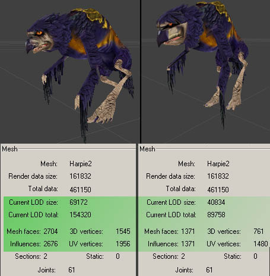

#### Mesh

Lots of important values are stored in this category. Bounding boxes, mesh scale and mesh orientation can all be changed in here.

##### MaxVisBound & MinVisBound

These values determine the vertices that are used to define the mesh visibility bounding box. The visibility boundaries for skeletal meshes are static relative to the mesh's zero-point, and don't depend on any animations.If any part of this box is visible ( if any part of it falls in the view frustrum, and is not totally occluded by the anti-portals etcetera ), then the render code for its mesh will be executed. It has no bearing whatsoever on collision.

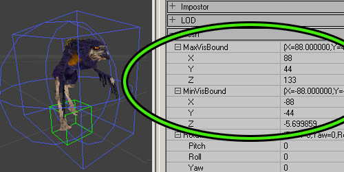

You'll want to make this as conservative as possible, otherwise characters that are not visible may waste a lot of resources, for example large bounding boxes can poke down through floors causing them to get rendered in vain as they get completely overwritten,
or z-buffered away by the scenery again in the same frame. If for certain animations a hand, spike or whatever (or conceivably an attached weapon) pokes through the boundaries occasionally, it isn't a big deal since the cases where only that part of a mesh determines the visibility check outcome are usually rare (e.g. it would have to be just that part poking around the edge of a doorway at that exact moment in its animation. )

##### Rotation

This simply changes what your mesh orientation will be by default. 3D Studio Max users may want to take note of this, as the viewpoints in Max aren't the same as in Unrealed, which leads to improperly facing models. Yaw is the value that controls the Z-axis rotation.
Remember that the rotation amount is given in Unreal Units (URUs), where 90� = 16384 URUs and 180� = 32786 URUs.

##### Scale

This is pretty self explanatory. Default is 1.0, which equals 100%.

##### Translation

If your character isn't centered correctly, you can change those values in here.

##### VisSphereCenter

This is related to the MaxVisBound and MinVisBound. This set of numbers determines where the center of the sphere will be located.

##### VisSphereRadius

This determines the radius of the aforementioned sphere.

#### Redigest

There is only one field in this section, LODStyle. This is very, very technical. It is used to alter how the LOD is being generated. A full explanation of this is beyond the scope of this document.

#### Skin

This section has a list of all the different material IDs used in your mesh.While you do have to import and create textures packages separately, the linkup is automatic at mesh import time if the materials in Max or Maya had names that match materials present in the editor. These are the names as can be seen in the X\_ModelInfo log file, and they are matched to any textures - regardless of that texture's package- or group name.
The double-underscore naming convention allows you to specify the materialname tags that are recommended to order the skins ( skin00, skin01, alpha, etc.) without confusing the texture match-up - the editor will only look at the part before the double underscore.
So, a material named bodyarmor\_\_skin00\_translucent will be linked up
at PSK-import time to a material named bodyarmor, if that material
is present in the editor at that time (i.e., anywhere in the texture browser.)Materials are assigned by going to the Texture browser and selecting the desired skin material to make it the 'current' material, then pressing 'use current' in the appropriate slot. If desired for skin-linkup work, the Animation and/or Texture browser window can be undocked to put them side by side. For a more complete explanation of the process, see the [AnimBrowserTutorial](AnimBrowserTutorial.md#Texture_Assignment) document.

### Animation Set

Lossless compression is performed on the raw animation on importing of animations animations (v3323 and later only).In version 3323 you can only set the GlobalCompression value. In the 2226 codedrop (and earlier) CompressionMethod can also be set.

#### GlobalCompression

This defines the compression ratio before additional lossy compression is applied to the animation. Which means that if this value is 0.8 and the lossless compression only compressed to 80% of the original memory size additional additional lossy compression is applied. Usualy this setting has no effect above the value of 0.3 .

##### Earlier versions (pre 3323)

This controls how much compression is applied to animations on import of .PSA files. The default is 1.0, which means that there is no compression at all. You may find it easier to think of it as 100% true to the original animation, whereas .25 is only 25% the quality of the original.This is a very quick and dirty way of trimming some fat associated with the animations, but it is of somewhat limited utility. If this number is set too low, then animations will be truncated or they may develop artifacts that detract from the motion. Be sure that your animations all work well with your chosen GlobalCompression value before you commit to it.Keep in mind that this number is not retroactive; meaning that if you change the value, it will not affect all of your existing animations in the .UKX, only those you import or re-import with the changed value from your .PSA file.There is a way to use this value without having to re-import your data: if you set this value, then use the


*Recompress Animation Data* button from the toolbar, it will recompress all of your animation data to the specified level.

#### CompressionMethod

Within *Compression*, there are two fields. The first, CompressionMethod, has three options.

* ACM\_Raw: Raw and Classic currently are identical in function.
* ACM\_Classic: The standard animation compression.
* ACM\_Quantized16bit: Allows for recompression of already compressed animation data (originally compressed with ACM\_Classic/Raw).

#### Recompression Notes

To use the ACM\_Quantized16bit compression, simply select it and then use the *Recompress Animation Data* button from the toolbar.When compressed by using ACM\_Classic, your animations will receive the size and quality reduction (through culling of keys) specified in GlobalCompression. As a new final step, compress once more with the CompressionMethod set to ACM\_Quantized16bit. This will store the information in more memory-efficient arrays, resulting in a smaller memory footprint for your .UKX files. Once this is done, it is permanent, and further attempts to compress it with ACM\_Classic will **not** work.There is a slight loss in quality when you use the ACM\_Quantized16bit compression. Wobbly feet may happen, for example. To combat this, the decision to convert to Quantized16bit can be made on a per-animation sequence basis.The GlobalCompression value does not affect the performance of the ACM\_Quantized16bit option.It is possible to use only the ACM\_Quantized16bit instead of first using ACM\_Raw/Classic, if you don't want to cull any keys.

### Sequence

Not many options can be changed in this tab, but some very important ones live in here.

#### Groups

#### SequenceProperties

* Compression: This number is almost identical to the GlobalCompression field in the *Animation Set* tab, the difference being that this number controls the compression level for individual animations. Use the *Recompress Animation Data* button from the toolbar to recompress the data to the specified level.
* Rate: This shows the current amount of frames of the selected animation that are playing per second. You can change this on a per-animation basis.
* SequenceName: This is the name of the individual animations. You can rename the animations here.

### Notify

It's possible to add notifies to your .UKX in the browser now. There is already a doc that explains how to add these to your animations. See [AnimNotifies](AnimNotifies.md) for a complete tutorial.

### Prefs

This tab has no function. Ignore it.

## Miscellaneous

These are pretty straightforward, for a change. But in the interest of completeness:

### Animation sequences and sorting controls

This is the area where your animation list appears. If you want to reorder the animations, select one and then click the *up* or *down* buttons.

### Animation playback controls

This is also very intuitive. Play your animations with these controls, or use the slider bar to scrub through an animation. There is one button that is a toggle, the *loop* button. If your animation isn't playing, make sure that it is linked to your mesh with the [link button](#link-animation-to-mesh).

## Pull Down Menu

This section will point out replicated functions and hidden options that do not appear in the buttons/tabs of the browser.

### File

These functions are all replicated in [toolbar buttons](#toolbar-buttons).

* Mesh Import
* Animation Import
* Animation Append
* Mesh LOD Import

### View

These functions are all replicated in the [view buttons](#toolbar-buttons) section of this doc.

* Animation Set Info
* Bones
* Influences
* Bounds
* Wireframe
* RefPose
* Raw Offset
* Bone Names
* Sync Level Actors: This button replicates the function of the [forced synchronous in-level animation button](#forced-synchronous-in-level-anim). Note that this will not toggle the button to the `On' state.

These functions do not have toolbar buttons.

* Backface: The default mesh rendering mode in the editor does not perform any back-face culling, in contrast to the actual in-engine rendering. However, you may well need to determine whether certain character is properly set up (e.g. with double-sided rendering specifically enabled for certain flat and/or alpha-translucent parts. This appears to be broken.
* Collision: toggles on and off to show collision, if any exists.
* Karma: Allows you to view the Karma collision hulls. To see how to make Collision hulls in the .UKX browser, go [here](#collision).
* Refresh: simply refreshes the browser windows. This may or may not work exactly as advertised.

### Edit

Only the first option has a button on the toolbar.

* Linkup Anim and Mesh: Use [this button](#link-animation-to-mesh).
* Unlink Anim and Mesh : Removes the animation as the default animation.
* Load Entire Package : Some packages may only be partially loaded when you're editing them. If the data you're working with is part of an on-disk .UKX package, be sure to click the 'load all' button before you save out the updated package, to avoid losing mesh and animation objects in the process.
* Apply: This button is vague - will be researched and explained later.
* Undo: This appears to be broken.
* Copy Karma Properties to Clipboard: This will copy the KInertiaTensor and the KCOMOffset values to the clipboard. You can see them by pasting into a text document.

### Mesh

* Mesh Properties : This simply opens up the *Mesh* property tab.
* Copy Mesh Properties: Copies all the Mesh properties. Mesh properties which include the bounding box- and rotation/scaling, can be copied/pasted among meshes from different packages.
* Paste Mesh Properties: Pastes the copied properties.
* Rename Mesh: Brings up a little dialog that lets you rename and regroup the mesh.
* Delete Mesh: This is pretty self explanatory.

These next few options have all been covered before in the [Level of Detail buttons](#level-of-detail-buttons) section.

* Redigest LOD
* Cycle Forced LODs
* Import LOD

### Animation

* Preferences: This goes to the empty [preferences tab](#prefs).
* Animation Set Properties: This opens the [animation set tab](#animation-set).
* Sequence Properties: This opens the [Sequence tab](#sequence).
* Notifications: This opens the [Notify tab](#notify).

For more on notifies, see the [AnimNotifies](AnimNotifies.md) doc.

* Copy all Notifications: copies properties in the notify tab.
* Paste all Notifications: pastes properties in the notify tab.
* Clear Notifications: deletes all values in this tab.

Note: do NOT use the copy & paste notification tool across different UKX packages; this can create unwanted references across packages.

* Edit Sequence Groups: coming shortly
* Clear Groups: self explanatory
* Copy all Groups: self explanatory
* Paste all Groups: self explanatory

Groups are the not-very-important dynamic array of FName strings that can be associated with each and every animation sequence, ( e.g. assign 'run' to all the running animation sequences) and then you can call something like "IsInGroup('run')" queries on sequences from script to see if they have that certain group specifier. Groups are almost obsolete, and are rarely used.

## UKX package management

From script, the new animation and mesh resources can now be referenced like any other package content. For example,
when the package CharacterAnims.ukx contains meshes and
animations for your player character, you can do:

```

#exec OBJ LOAD FILE=..\animations\CharacterAnims.ukx
```

Or, in an actor's default properties:
Mesh=Mesh'CharacterAnims.MainProtagonistMesh'Where MainProtagonistMesh is one of the meshes present in the UKX.The goal in general will be to have your art pipeline allow artists to update and use UKX files without programmers having to make a new
build; so be sure that any game-code reference to a resource in a UKX package does not pull in data from a UKX to reside into another
package.
This depends on a subtle difference in the use of OBJ LOAD; if the above #exec were changed to:

```

#exec OBJ LOAD FILE=..\animations\CharacterAnims.ukx PACKAGE='ThisPackage'
```

Where 'ThisPackage' is the name of the package this script
file sits in, then the data would be duplicated into ThisPackage.Using `#exec` commands in script to modify data referenced from a .UKX will be useless unless the data got specifically OBJ-loaded and duplicated into the .u package with that second method.One easy way to check out new (non-animating) meshes which aren't referenced by any gameplay code yet, in a running level, is to place an existing decoration actor in a test level and assign the current mesh to that actor's mesh variable.

## Notes and known issues

* If you see any weirdness after linking up animation data and playing it on your mesh, verify that the heirarchy from which you exported exactly matches that of the reference mesh, and that no bone names exceed the engine's internal 32-character limit.   
   Though mismatched hierarchies will always potentially mess up what you see, whenever you import an animation sequence by **adding** it to already existing sequences in an animation set in a UKX, there is now a bone-conform step, which seeks to pad non-existing bones with data from the current mesh's reference pose, and pads/culls as needed to make the additional animation data use just as many bones as the existing animation sequence data does.

* After importing mesh or animation data, as well as when switching the current package in the selection boxes near the top, the current mesh and animation selection often resets to the first object in the list instead of the last one used; therefore, if necessary make sure that both the current mesh- and animation box have been (manually) set to the desired objects to avoid confusion;

* Always explicitly click the 'chain' button when you want to link up the active mesh run with the active animation, even if just for testing ( and re-link to the desired pairings before saving a modified package ).

* The browser does not distinguish between skeletal meshes in UKX packages and ones that got linked into any other (.u) packages with the #exec command.   
   So,when manipulating meshes, always make sure you are working on mesh and/or animation data that either resides in an existing .UKX package ( or which you import into a new package and save out as a fresh UKX.)   
   While you need to avoid touching skeletal meshes that are in any other type of package, you can still use such meshes as a source of notifications/groups/mesh-properties settings with the various copy/paste buttons.

* Some packages may only be partially loaded when you're editing them. If the data you're working with is part of an on-disk .UKX package, be sure to click the 'load all' button before you save out the updated package, to avoid losing mesh and animation objects in the process.

* Importing meshes and animations is a one-way process; for any future adjustments (notably, animation compression re-tweaking) it is important to keep PSA/PSKs and/or their Max/Maya original source art archived.

* Specifying groups to subdivide animations and meshes in a package will probably be enabled in an upcoming version. For now, typically the UKX holds a manageable amount of meshes and animations, and sensible grouping can be done by creating multiple UKXes.

