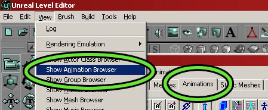
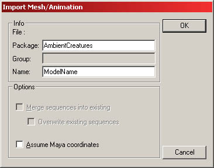
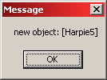
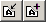
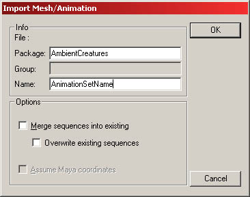
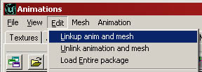
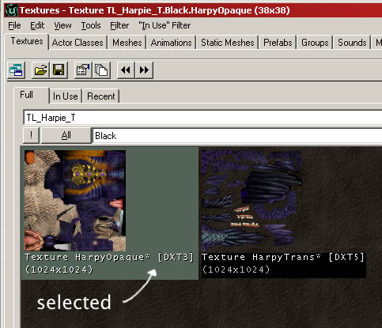
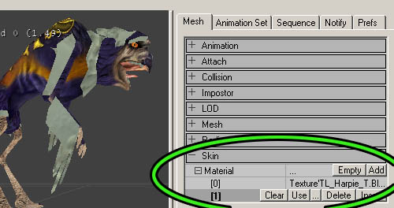
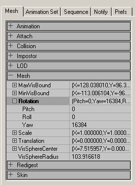
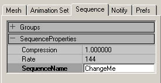

# Animation Browser Tutorial (.UKX Creation)

*Document Summary: A guide to using the Animation Browser.**Document Changelog: Last updated by Tom Lin (DemiurgeStudios?), document creation. Original author was Tom Lin (DemiurgeStudios?).*

* [Animation Browser Tutorial (.UKX Creation)](#animation-browser-tutorial-ukx-creation))
  + [Making .UKX Files](#making-ukx-files)
  + [Preparation](#preparation)
  + [The Animation Browser](#the-animation-browser)
    - [Importing the Model and Rig (.PSK)](#importing-the-model-and-rig-psk))
    - [Importing the Animations (.PSA)](#importing-the-animations-psa))
    - [Linking the Mesh and Animation](#linking-the-mesh-and-animation)
    - [Texture Assignment](#texture-assignment)
    - [Minor Tweaks](#minor-tweaks)
      * [Rotating the Mesh](#rotating-the-mesh)
      * [Resizing the Mesh](#resizing-the-mesh)
      * [Changing Animation Names](#changing-animation-names)
      * [Changing Animation Rate](#changing-animation-rate)
  + [Summation](#summation)

## Making .UKX Files

Creating .UKX's is the final step for character artists working in the Unreal Engine. They combine the skeletal mesh rigging (.PSK) with the animation files (.PSA) and link back to the texture files, as well (.UTX). When you're finally finished, you'll have just a .UKX and a UTX file.This document will provide the user with a step-by step guide to creating a working .UTX file, as well as the process for getting a `quick and dirty' version of a character model into a game. For more in-depth information about the options and capabilities of the animation browser, go to this doc: [AnimBrowserReference](AnimBrowserReference.md).

## Preparation

Before you dive into the animation browser, it's a good idea to make sure that you have all the required bits that go into it. If you are missing pieces, all is not lost - the beauty of the .UKX format is that incomplete or rough material can be changed or added to, without having to go through the entire creation process again. Here is what you'll want to have on hand:

* .UTX file with appropriate textures
* .PSK file with character model and rigging

* .PSA file with character animations

## The Animation Browser

When you first launch Unreal, the texture browser will already be opened for you. The animation browser is accessible from the same location - just click the `Animations' tab to open it up. It is also possible to open it with the `View' drop down menu from the main Unreal window.

### Importing the Model and Rig (.PSK)

This is very straightforward. Go to `File' > `Mesh import' in the animation browser. Locate your .PSK file, then import it into the browser. You could also use the mesh import button

in the toolbar.
When you select the .PSK, you'll see a window like this one.

There are a few fields here that could use some explanation.

* **Package:** This will be the name of the .UKX file itself, which can hold many different models and their associated animations. For example, if I were making a military game, I could have put the rifleman, scout, and sniper models in one .UKX file, under the overriding package name, "Soldiers." A non-existing package name will result in the creation of a new one.

**NOTE:**
This is VERY important; **never** name your .UKX (mesh/animation) package with the same name as an existing package This means ANY package that Unreal will use, including maps, code packages (.U), texture packages (.UTX), or static meshes (.USX). Unreal will get very confused, you'll get strange errors, and in the end you will most likely have to recreate one of the packages and fix all the ensuing broken linking. One more time: never re-use package names, no matter what.

* **Group:** You cannot group items in a .UKX file. Ignore this field. It is advised that separate .UKX files be used if you need to group your models.

* **Name:** This is what your individual models will be called once they are imported into the .UKX file. In other words, this will be the Sniper/Scout/Rifleman, who resides within the larger Soldiers package. Note that it is possible to name two models with the same name, if they are in different packages. For example, `Scout' in package `AmericanTroops.UKX' and `Scout' in package `RussianSoldiers.UKX.' Confusing, but possible.

For now, just name your package and model appropriately. If you are importing into an existing package, make sure all contents of the package are loaded before changing anything (use the load-all button). The same goes for any other importing or tweaking.If you are using Maya, use the checkbox, "Assume Maya coordinates." If this works correctly, you will get a window like the one shown below. After closing that window, your model will appear in the browser.

If your browser crashes when you try to import a .PSK model, make sure that you have a texture applied to it in your 3D modeling package. This is a fairly common problem - it doesn't matter what texture you apply, since you can change it later. Just having UVW mapping coordinates isn't enough, so make sure that you've applied a texture.

### Importing the Animations (.PSA)

The next step is to import the suite of animations that will be linked to the model. Use the Import/Append animation buttons

or go to `File' > `Animation import' and find the .PSA file that corresponds to your model. You'll see an import window open up.

* **Package:** Make sure that the package name is correct, it should be the same name you just used when you imported your .PSK.

* **Name:** This is the name of your animation set. In theory, you could organize your animations for specific models with multiple .PSA's - but in practice, this is never done. It's common practice to have just one set that is extremely large, with all the possible animations for a model contained within.

* **Merge sequences into existing:** This option lets you append new animations to an existing list. If you don't have an existing list of animations for a model, don't have this option checked, it will generate an error.

* **Overwrite existing sequences:** This is pretty obvious. If you've tweaked an animation, make sure to have this checked on re-import.

If this is your first time importing a .PSA, then don't worry about the bottom two checkboxes. Just set the package and name fields correctly.If you are importing animations into an existing set of animations, make absolutely sure the .PSA binary data you're importing is completely compatible with the existing animation sequences - that is, they must have been exported from a character with the exact same skeleton.

### Linking the Mesh and Animation

So you have your mesh and your animation, both loaded and ready to go. Before you can play the animations, there is one last step. In the `Edit' menu choose `Linkup anim and mesh' to (you guessed it) link the animations to the mesh. If this worked correctly, you should see the model snap into the first frame of your selected animation.

Once this is done, you can hit the `Play' button at the bottom of the window to see the animation in action.

### Texture Assignment

Upon importing your model, you may find that it doesn't have the right texture on it - it's got that grayish default texture on instead. Fixing this is pretty simple. First of all, go to the texture browser and open the appropriate .UTX file. Click on the desired texture (or if you have several materials, any of them will do) so that you see a border appear around it in the browser window.

With the texture still selected, go back to the animation browser. On the right side of the window, there are a number of tabs - select the first one, `Mesh.' At the bottom of the window you'll see `Skin,' which will open up to a list of the different material IDs that are contained in your model. Click one of the ID numbers and then click the `Use' button that appears. You should see your model update with the previously selected texture from the material browser.

It's possible that you may choose the wrong texture for the material ID you've got selected. In this case, simply go back to the texture browser, select the correct skin and reassign it.

### Minor Tweaks

The animation browser is crammed full of useful functions, ranging from notifies to setting collision to attachments. Going through all of these is beyond the scope of this document, for a more complete listing and explanation, see the [AnimBrowserReference](AnimBrowserReference.md) doc. In this section, some of the more common introductory complaints will be addressed.

#### Rotating the Mesh

It's common for skeletal meshes to come in rotated incorrectly. The `front' viewport in 3D Studio Max doesn't correspond to what Unreal calls the front view, for instance. Luckily, this is fairly easy to correct. In the `Mesh' tab on the right there is another `Mesh' section. If you open it up, you will see that you can expand `Rotation' to expose independent `Pitch,' `Roll' and `Yaw' values. To rotate about the Z-axis, use the Yaw value.The values that Unreal is using to rotate aren't simple degrees, unfortunately - you'll have to put the rotation amounts in Unreal Units (URUs).

* 45� : 8192 URUs
* 90� : 16384 URUs
* 180� : 32768 URUs
* 360� : 65536 URUs

#### Resizing the Mesh

If you have more than one person making models, or if you don't have a strict scale that all of your models adhere to, chances are you'll need to do this at least a few times. The fields you will need to edit are right under the mesh rotation values (see above), and are pretty self-explanatory. You have the option of changing the X, Y or Z values independently, but most of the time you will want to increase them all by the same amount, to avoid stretching the model in strange ways.The values are 1 by default, which is equal to 100%. So if you wanted it to be 150% larger, you'd put 1.5 for all of the values. Simple.

#### Changing Animation Names

This one is nice and easy. One of the tabs on the right side is `Sequence.' Inside of this is a field, `SequenceProperties.' Change the value in `SequenceName' to rename an animation.

#### Changing Animation Rate

This is another simple one. In almost the exact same location as the SequenceName field (see above), there is `Rate.' This is how many frames of the animation will be played per second, and is set by the animator in whatever animation package was used to create the animation. 3D Studio Max has this set by default to 30.If you want your animation to play faster, increase the rate number. Decrease the number for a slower animation. This is useful for tweaking animations a few frames to make them all gel nicely with each other.

## Summation

With the information outlined in this doc, you shouldn't have any problems making a .UKX file - that is, provided you already have a .PSK, .PSA, and .UTX. If you need information on how to create these files, see the [ModelingTableOfContents](../../Uncategorized/ModelingTableOfContents.md), which will link to individual sections that explain how to create the files. In particular, see the [ActorXMaxTutorial](../../Uncategorized/ActorXMaxTutorial.md) or the [ActorXMayaTutorial](../../Uncategorized/ActorXMayaTutorial.md).

