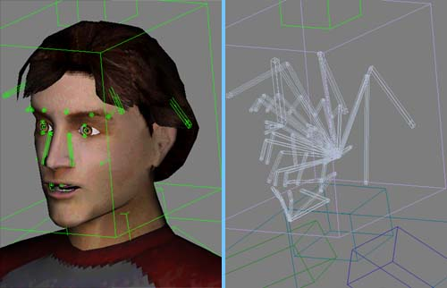
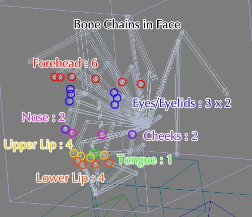
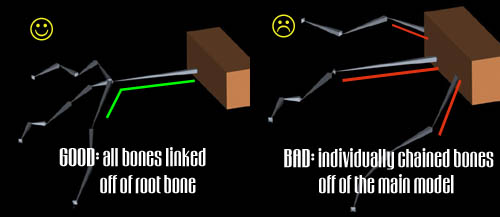
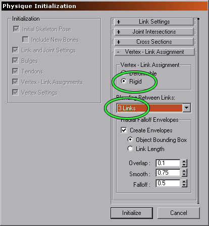
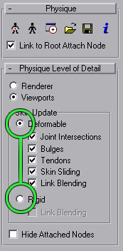
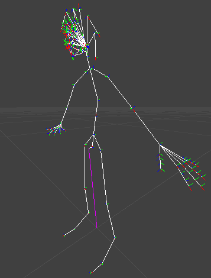
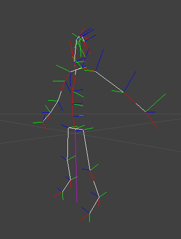

# Preparing a Character for use with the Unreal Skeletal Animation System

*Document Summary: A broad document that covers general design and implementation principles associated with skeletal animations. Appropriate for novice and intermediate users.**Document Changelog: Last updated by Tom Lin (DemiurgeStudios?), for document summary. Original authors were Erik de Neve ([EpicGames](https://udn.epicgames.com/Main/EpicGames)) and James Green.*

* [Preparing a Character for use with the Unreal Skeletal Animation System](#preparing-a-character-for-use-with-the-unreal-skeletal-animation-system)
  + [Overview](#overview)
  + [Designing a Skeleton](#designing-a-skeleton)
    - [Unnecessary Bones](#unnecessary-bones)
    - [Shoulders and Elbows](#shoulders-and-elbows)
    - [The Neck](#the-neck)
    - [Highly Articulated Facial Skeleton](#highly-articulated-facial-skeleton)
      * [Procedural Facial Control](#procedural-facial-control)
  + [Optimizing your Mesh](#optimizing-your-mesh)
  + [Initializing Physique](#initializing-physique)
  + [Other Issues](#other-issues)
    - [Creating a Skeleton Without Biped](#creating-a-skeleton-without-biped)
    - [Adding Bones to Biped](#adding-bones-to-biped)
    - [Link Rigid Meshes After Physiquing](#link-rigid-meshes-after-physiquing)
    - [Unlink Meshes after Removing Physique](#unlink-meshes-after-removing-physique)
    - [Null Vertex Weight](#null-vertex-weight)
  + [Karma and Skeletons](#karma-and-skeletons)
  + [UDN Skeletons vs UT2K3 Skeletons](#udn-skeletons-vs-ut2k3-skeletons)
  + [Misc Skel Info](#misc-skel-info)
    - [Blending Animations](#blending-animations)
    - [Bone Attachments](#bone-attachments)
    - [Animation Notifications](#animation-notifications)
  + [For Programmers](#for-programmers)

## Overview

Skeletal animation gives your characters smoother movement than was possible with vertex animation, but they must be designed and prepared properly to get the desired results. Generally, polygon counts can increase, because memory usage does not balloon as it does with vertex animations, and rendering power becomes the new bottleneck. The difficult part is that the artists no longer have frame by frame, vertex by vertex control of their animations. Each vertex can only be animated by the bones around it, which means that much more planning must go into each model, lest you find that your model isn't capable of certain motions because of a poorly considered skeleton.

## Designing a Skeleton

### Unnecessary Bones

Your character's skeleton needs to be designed efficiently to take full advantage of the benefits of skeletal animation. Each bone requires resources to track and animate, so eliminating redundant or clumsy hierarchies is important. For example, if your characters are only going to have 2 digits on their hand (a thumb and four bonded fingers) it is an incredible waste to have a Biped with 5 fingers with 3 joints each. Evaluate the exact function of each bone and make sure you need it before finalizing your skeleton.

### Shoulders and Elbows

Skeletal animation is not as kind as most would like on areas such as shoulders and elbows. This is because the influences of the bones on the vertices are linear, not spline-based like Physique's Deformable mode. A shoulder lifted straight above the head is prone to pinching, unless designed particularly well. A workaround is to segment the arms from the body if appropriate, as in the case of robots, knights in armor, or even characters in vests or clearly segmented clothing. Another possible solution is to add an extra 'helper' bone to your skeleton that can be animated to make the skin shift more naturally. This could be done with some method of automatic control (including script functions/methods, or 3rd party plugins) if someone is feeling really clever, since animating this by hand would be an arduous task.

### The Neck

Neck areas are also sometimes tricky. A neck segmented many times looks smooth, lights perfectly, but can deform horribly. Pay special attention to how the neck deforms when the character looks to extreme angles, since this area will probably draw a lot of attention in game.

### Highly Articulated Facial Skeleton

If you're reading this and scoffing at the very *idea* of saving resources by eliminating useless bones, then this section is for you. As games have become more complex, the expected level of detail in models has skyrocketed. If your game will have any sort of close-up, facial camerawork then some thought must be given to adding additional bones for a facial structure.The following pictures illustrate an inordinately high-count bone structure.

This skeletal structure is complex enough for simple emotion, blinking, eye tracking, and phonemes/visemes.The skeleton is composed of approximately 50 bones. They break down as follows:

* Forehead: 12
* Eyes: 4 per eye
* Sides of the nose: 4
* Cheeks: 4
* Upper Lip: 8
* Lower Lip/Chin: 11
* Tongue: 4

These numbers are slightly misleading, as they include the bone substructure that places the surface bones in the correct area. Below is an image with the terminating ends of the bone chains highlighted. Note that it is certainly possible to make facial rigs with a fraction of these numbers, though in that case the bones would likely not deform in an anatomically correct fashion.

#### Procedural Facial Control

If your model will have a large number of facial animations, you may want to consider setting up your skeletal rig to take advantage of procedural controls over the animations. A programmer can choose to play multiple animations at once, and over selected branches of the facial tree.For this reason, it's a good idea to have one root bone that comes off of the main skeleton, which controls all the other bones lower in the hierarchy. This allows ALL the hair to be blended at once, since you have a single bone parent. This is much cleaner than having each string of bones (strands of hair, fingers) connect to a part of the skeleton that you don't wish to receive blending information (hand, head).

For example, imagine an animation exists for 'happy' and 'sad' faces on a correctly set up facial rig. A new animation could be created, 'talking,' which can be selectively played on certain bones during either the 'happy' or 'sad' animations. This saves animators from having to create separate 'talking while happy' and 'talking while sad' animations. For a rough diagram of a facial system that would be suited to procedural animation, see the [PawnAnimation](https://udn.epicgames.com/Two/PawnAnimation#Setting_Up_the_Face_of_the_Model)
doc.The most important concept to keep in mind is that procedural control works for bones along the tree structure; if you'd like to be able to play an entire facial animation at once **or** be able to break the mouth out into another animation, then have the entire face link off of the root head bone, and then branch off another section for the mouth.You can download this model with the completed facial rig. The source files are attached to this doc page: [UnrealDemoModels](../../Uncategorized/UnrealDemoModels.md).Tools exist to help streamline the facial control process. You may want to consider using *Impersonator* for lip synch on your models. To get started, take a look at these documents.[ImpersonatorHeadRigging](../../Uncategorized/ImpersonatorHeadRigging.md)
  
[ImpersonatorTutorial](https://udn.epicgames.com/Two/ImpersonatorTutorial)
  
[ImpersonatorUserGuide](../../Uncategorized/ImpersonatorUserGuide.md)
  

## Optimizing your Mesh

Any mesh can benefit from being tweaked for use in game, no matter how good it looks in Max. The Unreal Engine uses vertex lighting for meshes, which means that light and dark areas are applied at actual vertices, with areas in between calculated as an average. Therefore, the more vertices there are the smoother the lighting will appear. If you have the polygons to spare, make sure you have a minimum number of 'long' edges. Even on a robotic character, a thigh section that stretches from the hip to the knee will look better if there are a few segments in it.It is extremely important that you weld the vertices on your mesh. This is because meshes are drawn smoothly as long as faces share vertices, with abrubt shadows usually showing up along edges where this has not been done. The LOD code will also 'tear' the model apart at these seams. So unless you have a specific reason for doing so, make sure you weld your vertices. I have to stress this because Max has the annoying behavior of unwelding vertices on .3ds files you import.

## Initializing Physique

When linking a mesh to a biped (or any hierarchy for that matter) you must initialize with Rigid Vertex Link Assignments. If you do not, what you see in Max will be different from what you see in the engine. This is because Max's Deformable mode computes vertex deformation in a special way which is not duplicated in the engine. The image to the right shows the correct initialization settings, along with the recommended 3 link maximum. Remember, you want to use these options:

* Rigid
* 3 Links

All of the other settings can be left as their default, or set to whatever you normally would use. Editing vertex weights may be done by adjusting envelopes or by assigning vertices manually (or even typing in values).When exported, all weights are normalized so they add up to 100% influence automatically.No bulges, tendons, or other special Physique tools may be used. This is necessary so that meshes will deform in Max exactly as they will in the game engine.Often people report differences between what they see in Max and what they see in the engine. Usually this indicates a problem with the initial setup. An easy way to see if a model is set up wrong is to toggle between the Physique Level of Detail settings while the model is in a non-reference pose. If the mesh surface 'shifts' in any way, it has been linked up incorrectly. Below, you can see an image of the radio buttons to toggle between to check a model.

## Other Issues

There are some other things to watch for when preparing your models due to quirks in Physique. Some of the things are well known to Max users while others may be new, since a lot of things can be 'wrong' with a Physique setup that will not affect cinematic or vertex animation, but will give skeletal animation some problems.

### Creating a Skeleton Without Biped

This is completely possible, as long as you add the appropriate Dummy objects to the ends of your hierarchies. The exporter will work on any valid hierarchy with a single root.

### Adding Bones to Biped

A lot of artists need to add extra bones for things such as special shoulder pads, wings, or even weapon attach points. This is done in the standard method, making sure a Dummy is linked to the end of any new bone chain, even if there is only a single bone added. This should be done before applying Physique to the mesh. If the Dummy objects are not present, Physique will ignore them as links. Biped bones work because the Dummys are automatically created for you.

### Link Rigid Meshes After Physiquing

If you have rigid meshes that do not deform at all (helmets, shoulder pads, etc.) you can link them to your skeleton using Max's standard link command. However, this should be done after you have applied (and initialized) all meshes that will be Physiqued, because otherwise Physique will interpret these meshes as links in the hierarchy. They will probably not deform your mesh unexpectedly, but extra links will be established and may be exported as bones into the engine. This can sometimes create problems, and wastes engine resources if nothing else.

### Unlink Meshes after Removing Physique

When I am working, I find myself applying and removing Physique several times when setting up a character. If you let Physique link your mesh to the root (default behavior) deleting the Physique modifier will not unlink your mesh. If you then proceed to apply Physique again, it will treat the mesh you are trying to Physique as a bone and add an extra link to that mesh's origin. This can cause some of the problems listed in the previous section. To avoid this, always 'unlink' meshes after you remove the Physique modifier (or collapse the stack).

### Null Vertex Weight

If a locked vertex is accidentally set to no influence from any bone, then when imported into Unreal vertices will jump about haphazardly, and the model will tear in obvious ways. If you check the logs during the model import process into UnrealEd, it will spit out a null vertex error. Unfortunately, there is no easy way to track down which vert is broken. To guard against this problem, make sure that each vertex has at least some influence when you set type-in weights.

## Karma and Skeletons

A complete analysis of the Karma Physics tools is beyond the scope of this document. See these docs for a more complete description of how to implement Karma.[KarmaReference](../Physics/KarmaReference.md)
  
[ImportingKarmaActors](../../Uncategorized/ImportingKarmaActors.md)
  
[UsingKarmaActors](../../Uncategorized/UsingKarmaActors.md)
  
[KarmaAuthoringTool](../../Uncategorized/KarmaAuthoringTool.md)
  
[RagdollsInUT2003](../../Uncategorized/RagdollsInUT2003.md)
  
[KarmaExampleUT2003](../../Uncategorized/KarmaExampleUT2003.md)
  
[ExampleMapsKarmaColosseum](../../Uncategorized/ExampleMapsKarmaColosseum.md)

## UDN Skeletons vs UT2K3 Skeletons

Here is a side by side comparison of the skeletons to be found in the UDN models and a typical skeleton in UT2K3.

The UDN Skeleton.

The UT2K3 skeleton.As you can see, there is a large discrepancy in the number of total bones between the two skeletons. The UDN model has as many bones in the hands alone as the 2K3 models have in their entire bodies. Let's not even mention the respective heads - as you may have noticed above, the UDN model is stuffed full of bones. Interestingly enough, much of the body looks relatively similar in terms of bone density; the legs, torso, and arms have minor differences in numbers, if at all.The point between the comparison is that your needs for a skeleton may vary wildy between the stripped down framework of the 2K3 rigs and the overweight UDN models. There isn't a perfect number of bones, it all depends on what you want your models to do.If you want:

* eye tracking
* facial emotion
* lip synching
* sign language

then you need something like the UDN rig.However, if you want:

* many characters onscreen at once
* less memory spent on animation
* jumping, shooting, running

then the 2K3 setup will serve you just fine.

## Misc Skel Info

### Blending Animations

Animations can be blended together in code to make transitions fluid, as well as to create new animations out of existing animations. For example, in the UDNBuilds and the CodeDrops (not UT2003/UT2004) running forward-left is not a separate animation; it is the run forward animation mixed with the run left animation. For animations to mix well together they must be the same length and also sync up with each other in a reasonable way. In the Epic content that comes with the CodeDrops ([CodeDrop2226](https://udn.epicgames.com/Two/CodeDrop2226) for example), all the run animations (forward, back, left and right) are 33 frames and the left foot always steps down at about frame 10.

### Bone Attachments

Objects can be attached to bones in the skeleton. Weapons are attached to models in this manner. In most cases you will want to make a special attach bone to attach the object in the correct location with the correct orientation. If you do not make a specific bone, one of your existing bones must be aligned for the attachment, or an offset rotation and location must be set in code. The following images illustrate how to align objects to bones.If the object is aligned in 3DS MAX like this:

The attach bone should be aligned like this:

The Z axis of the alignment bone orientation corresponds to the Y axis of the object orientation. The X axis of the alignment bone orientation corresponds to the negative Z axis of the object orientation.Objects are attached to bones by using the bone names. It is best to use the same bones names for attach bones for all models; for example, all of Epic's models that comes with the CodeDrops ([CodeDrop2226](https://udn.epicgames.com/Two/CodeDrop2226) for example), have a bone called "weapon\_bone" that is used for attaching the weapon.

### Animation Notifications

For things like footstep sounds and the spawning of effects that should happen at a particular frame you can set up notifies for animations in UnrealEd?. Please see this [Animation Notification](AnimNotifies.md) document for details.

## For Programmers

To get an understanding of how programmers are involved in the animation pipeline, check out the [Skeletal Animation 101](https://udn.epicgames.com/Two/SkelAnim) and [Skeletal Animation 102](../../Uncategorized/SkelAnim2.md) pages, as well as the [Extending Skeletal Animation](https://udn.epicgames.com/Two/ExtendingUWSkelAnim) page.

