# Introduction to UnrealEd

*Document Summary: A basic introduction to using the Unreal Editor. Excellent for first timers.**Document Changelog: Last updated by Jason Lentz (DemiurgeStudios?), to include Box Selection. Original author was Jason Lentz (DemiurgeStudios?).*

* [Introduction to UnrealEd](#introduction-to-unrealed)
* [Introduction](#introduction)
  + [Unreal Ed Philosophy](#unreal-ed-philosophy)
  + [Creating the Basic World Space](#creating-the-basic-world-space)
    - [Changing Surface Textures](#changing-surface-textures)
    - [Testing your Level](#testing-your-level)
  + [Adding to the Level](#adding-to-the-level)
    - [Making Additional BSP Brushes](#making-additional-bsp-brushes)
    - [Placing StaticMeshes](#placing-staticmeshes)
    - [Creating Terrains](#creating-terrains)
  + [Box Selection](#box-selection)
    - [Selecting Additional Actors](#selecting-additional-actors)
    - [Box Selection with Vertex Manipulation](#box-selection-with-vertex-manipulation)
  + [Common Pitfalls](#common-pitfalls)
    - [Never Have Packages with the Same Name](#never-have-packages-with-the-same-name)
    - [Remember to Save Your Packages](#remember-to-save-your-packages)
    - [Remember to Link Your Animations](#remember-to-link-your-animations)
    - [Getting Sun Light to Show Up.](#getting-sun-light-to-show-up)
    - [Remember to Rebuild](#remember-to-rebuild)
    - [Keep The Grid On](#keep-the-grid-on)

# Introduction

The purpose of this document is to introduce Level Designers to the Unreal Editor. This document helps you get started on not only setting up your first level, but also offers a brief guide through the Unreal Developers Network website and even points out some common pitfalls that nearly all first time UnrealEd users fall into.While reading through this document you may find the following other documents to be useful references:

* [UnrealEdInterface](UnrealEdInterface.md) - A comprehensive guide to all of the basic features that make up the Unreal Ed interface.
* [RotationGizmo](https://udn.epicgames.com/Two/RotationGizmo) - A brief description on how to use the rotation ball and its restrained movement functions.
* [UnrealEdKeys](UnrealEdKeys.md) - A cheat sheet to all the hot keys to help you maximize your efficiency.

## Unreal Ed Philosophy

Probably the best way to think of the world space in Unreal Ed is to imagine it as an infinite solid mass of clay from which you carve your own world. Everything you create in your world will exist in pockets of subtracted space. After subtracting, then you add world geometry and later effects and before long, you've got a detailed environment for your characters to frolic about it. This approach of starting with a solid world space minimizes the opportunity to introduce nasty BSP holes into your level.BSP Holes are gaps between the subtractive world space and the additive world space that can cause unwanted rendering effects (such as Hall Of Mirror effects, a.k.a. HOM effect) as well as slow down rendering times. Below is an image of an HOM effect:

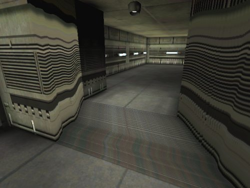

## Creating the Basic World Space

The tools you will be using to carve out your subtracted space are called "Builder Brushes." Brushes are basic geometric primitives that you can manipulate to shape into various forms in your level by adding them and subtracting them from the world space. On the left side of the tool bar you will see the Brush Builder buttons:

As you can see, there are a variety of Brush Primitives to work with and it is also possible to create your own custom shapes with the [ShapeEditor](../../Uncategorized/ShapeEditor.md) -although this tool is not always reliable and should be used with caution. For almost every level, you will want to start with one large subtracted box, so *right* click on the Cube Builder Brush and it will pop up the CubeBuilder window.

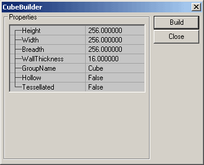

Here you can set its dimensions and various other attributes. For this initial subtraction, you need only make a really large cube (large enough to encompass your entire level). You will be able to see the red Builder Brush change size once you push the "Build" button in the CubeBuilder window.

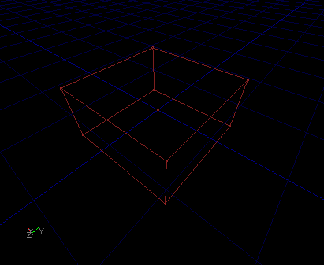

Once you have the brush in position, use the subtract button to carve out your space and it will create a Constructed Solid Geometry (CSG) but it is more commonly referred to as BSP (Binary Space Partition). For a more in depth description of these terms see the [BspBrushesTutorial](../Primitives/BspBrushesTutorial.md#bsp-brush-introduction).

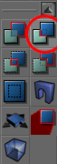

### Changing Surface Textures

Chances are that you now have a large box with the default grey bubble texture repeated across it. Subtracted and added BSP geometry will display whatever texture is selected in the Texture Browser. To change this, select all of the surfaces of your newly created BSP box (*Shortcut:* Select one surface then press SHIFT + b), then open up the Texture Browser and select the desired texture. To open the Texture Browser, you can open any of the browsers and click on the "Textures" tab, or you can just click on the picture icon on the top menu bar.

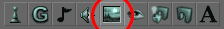

### Testing your Level

Before you run your level you will need to add a PlayerStart so that you have somewhere to spawn in. You can add one by right clicking in the location you want to place it and then select "Add Player Start" from the list. You will then see a joystick appear in your level; this is the PlayerStart. Make sure that the PlayerStart is relatively close to a level surface -otherwise the level will throw up errors when it compiles.

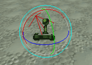

Now is also a good time to add some lights to your environment. Just right click where you want the light to be and select the "Add Light" option. Alternatively you can just left click while holding down the "L" key. You can open the properties of any Actor (which is the term for just about anything you place in the level) by pressing F4. Under the LightColor rollout you can adjust the basic settings of the light.

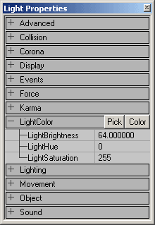

Now you are almost ready to run your level. Just hit the rebuild all button, wait for everything to compile as it calculates the lighting and new geometry, and then hit the "Play Map!" button.

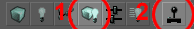

## Adding to the Level

There are multiple ways you can add to your level. You can add additional added and/or subtracted BSP geometry, place in StaticMeshes, create a Terrain, or even add other special geometry types. Below are instructions on how to add some of these geometry types to your level.

### Making Additional BSP Brushes

When creating additional brushes (subtracted or added) there are some guidelines you should follow.

* # 1 Rule: Always leave the grid on.

This is not only conducive to modular design, but it also reduces the chances of BSP holes emerging in your map. With the grid turned off, it is very easy to misalign brushes, and when brushes do not perfectly line up, BSP holes as well as other terrible artifacts can emerge

* Make sure you Intersect and Deintersect before Subtracting and Adding BSP Brushes.

The engine does not deal well with overlapping added or overlapping subtracted spaces. Before you Subtract a BSP Brush from your level, be sure that you hit the Intersect button, and likewise, before you Add a BSP Brush to your level, be sure that you hit the Deintersect button.

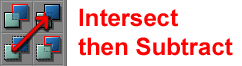

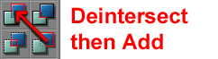You can also quickly create some more complex Builder Brushes using the Intersect and Deintersect buttons. Just remember that the Intersect deletes the portion of the Builder Brush in Subtracted space, and Deintersect deletes the portion of the Builder Brush that is in the Added space.

* Rebuild the map before running the game.

If you add, subtract, move a BSP Brush (not the Builder Brush), or add a new light, you will need to rebuild your map before you see its effect in the game. Often if something isn't working as you expect the first time you run your level, it can be fixed by building the level before you run the map.

### Placing StaticMeshes

StaticMeshes are geometry created in a 3rd party package such as 3DS Max, Maya, or Lightwave, that can be added into your level. StaticMeshes are used as the major decorative elements in the level for various reasons. To place a StaticMesh, first you must open the StaticMesh Browser by clicking clicking on the "StaticMesh" Tab of the browser window, or by clicking on the StaticMesh Browser button in the top menu bar.

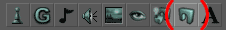

Then you need to select your StaticMesh on the right side of the StaticMesh Browser. Once selected you can either right click and add one.StaticMeshes are very versatile as they can be easily moved, rotated, scaled, and even have their textures swapped in Unreal Ed. To learn more about using StaticMeshes take a look at these documents

* [StaticMeshesTutorial](../Primitives/StaticMeshesTutorial.md)
* [Level Optimization doc](../Techniques/LevelOptimization.md#static_meshes) *(Static Meshes section)*

### Creating Terrains

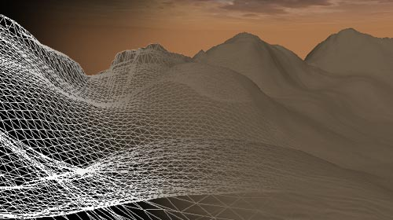

Terrains are another handy type of geometry that you can in building your level. They are very useful for quickly and easily creating the framework for large outdoor environments. For more information on how to create Terrains take a look at these documents:

* [TerrainTutorial](../Primitives/TerrainTutorial.md)
* [Level Optimization doc](../Techniques/LevelOptimization.md#terrain) *(Terrain section)*
* [ExampleMapsCaverns](../../Uncategorized/ExampleMapsCaverns.md)

## Box Selection

To select Ators you can simply click on them, although you can also select multiple Actors with a selection box. This action is the same no matter what other mode the editor is in. Hold down the **CTRL** and **ALT** keys. Then, left click and drag in any of the 2D viewports (this doesn't work in the 3D viewport). As you drag you should see a box being drawn, starting from where you first clicked and ending at the current mouse location. For example:

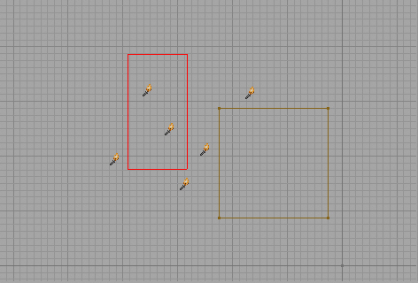

When you let go of the buttons, you would see this ...

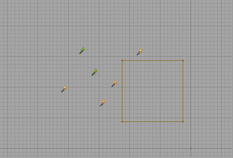

And that's that. Those actors were selected because they were inside the box when you let go of the buttons.

### Selecting Additional Actors

If you want to select more actors, but don't want to lose your current selections, simply hold the **SHIFT** button down while you perform your normal box selection. So you would be holding down **CTRL,** **ALT** and **SHIFT** down at the same time while you create your box.Using the example, from above, I'll draw a new box while adding the SHIFT button into the procedure ...

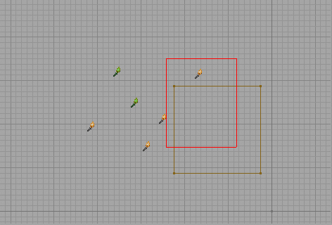

It looks the same on the screen, but when I let go of it, it will select the new actors AND leave the old ones still selected. Like this:

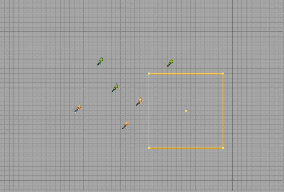

Brushes will be selected when their origin falls within the box. This is important since you might think that if any of the vertices are in there it will select the brush, but it only works on the origin. The vertices come into play in vertex manipulation mode.

### Box Selection with Vertex Manipulation

Where this feature comes in most handy is when using vertex manipulation. Selecting all the vertices on one side of a brush to move them would be very inconvenient without box selection. This is what we start with:

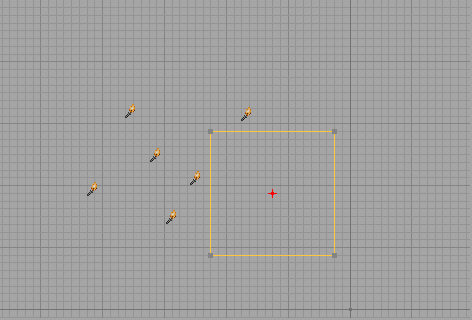

Now, let's say I want to select all the vertices on the right side of the cube so I can drag that face. I create my box like so:

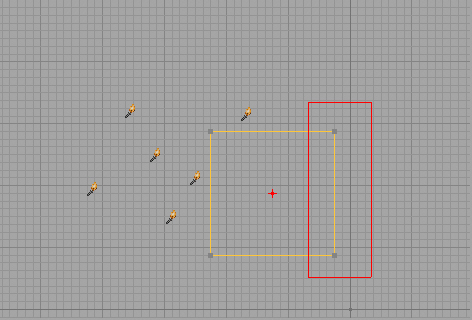

And I end up with this when I release the buttons:

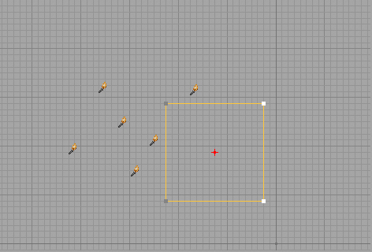

Now I can drag those vertices like normal and effectively drag that face of the brush.

## Common Pitfalls

Unreal Ed like any other complex application has its subtleties. Here are some of the more common subtleties that almost everyone discovers the hard way.

### Never Have Packages with the Same Name

The files that contain the StaticMeshes, Textures, and Animations are called packages. It may sometimes seem like the logical choice to make a Texture package and a StaticMesh with the same name if they are for the same piece of level scenery (for instance, you might have a *Trees.usx* for the meshes and a *Trees.utx* for the textures). However, if this does happen, Unreal Ed will become very confused as to which package is which and you may have the Texture package showing up in the StaticMesh browser and vice versa and ultimately both packages will become corrupt. Often the only fix for this problem is to delete both packages and recreate them from the source art.

### Remember to Save Your Packages

If you've just created a StaticMesh package and the StaticMeshes do not show up when you start your level, you have probably neglected to save the package before running the game. This fix is simple, just go to the file menu from the StaticMesh and/or Texture Browser and select the Save option (don't forget to give them unique names). Unreal Ed will not display content from packages if they are not saved.

### Remember to Link Your Animations

If your Animations aren't showing up in the game and/or disappearing from the Animation Browser you may have forgotten the step of linking your animations to the mesh. Again, this fix is simple, just click on the "Link animation to mesh" button (shown below).

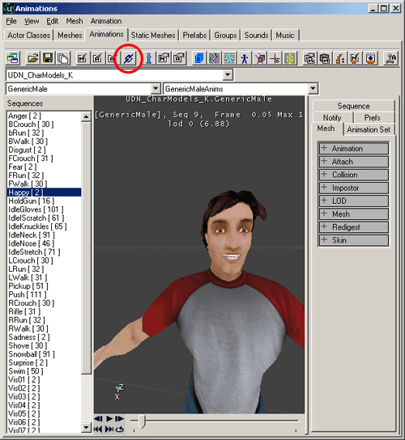

### Getting Sun Light to Show Up.

So you've placed a SunLight and no matter how bright you set its properties, the level doesn't get any brighter. The problem may be that you've forgotten to set the surfaces of your initial BSP subtraction to "Fake Backdrop." To correct this, just select all the faces of your initial BSP subtraction and bring up the Surface Properties window (hot key = F5) and check the "Fake Backdrop" box.

If this is not set, then the SunLight will be obstructed by the BSP subtraction leaving everything in shadow.

### Remember to Rebuild

Sometimes when you run your game to test it out, things may not be working quite the way you expect them to, or they just don't work at all. Sometimes Unreal Ed will tell you what the problem is (like you may not have a PlayerStart), but sometimes it won't be able to narrow the problem or not realize that there even is one. If this happens, just try rebuilding your level to see if that fixes it.See the [Build Options Reference](../../Uncategorized/BuildOptionsReference.md) page for more information on building levels.

### Keep The Grid On

The Grid is a very very useful part of Unreal Ed. By leaving the grid on, you make things easy on yourself for lining up geometry on nice regular powers of two. When you turn it off, you open yourself up for disaster. If BSP brushes are misaligned in any direction they can cause terrible things to happen (randomly disappearing geometry, BSP holes, drastically slowing down render times, etc.) and these problems can be very difficult to track down. Sometimes you can have BSP brushes appear to line up perfectly -even when you zoom in super close, but unless you have the grid on, chances are that super close is not close enough.If you do need more flexibility, you can change the grid size, and it will go down to a grid size of 1. So really, there shouldn't be any need to turn the grid off as the risk of forgetting to turn it back on is great. Sometimes the only way to fix misalign BSP geometry is to just through the map away and start over.

