# UnrealEd Manual: Interface

*Document Summary: Comprehensive reference for the main interface of Unreal Ed.**Document Changelog: Last update by Michiel Hendriks, v3323 changes. Previous update by Jason Lentz (DemiurgeStudios?), to link to relevant documents. Original author - Tomasz Jachimczak ([UdnStaff](https://udn.epicgames.com/Main/UdnStaff)).*

* [UnrealEd Manual: Interface](#unrealed-manual-interface)
  + [Introduction](#introduction)
  + [Main Points of the Editor](#main-points-of-the-editor)
  + [Drop Menu Options](#drop-menu-options)
  + [General Editor Functions](#general-editor-functions)
    - [File Options](#file-options)
    - [Undo and Redo](#undo-and-redo)
    - [Search for Actors](#search-for-actors)
    - [Browsers](#browsers)
      * [Actor Browser](#actor-browser)
      * [Groups Browser](#groups-browser)
      * [Music Browser](#music-browser)
      * [Sound Browser](#sound-browser)
      * [Texture Browser](#texture-browser)
      * [Mesh Browser](#mesh-browser)
      * [Prefab Browser](#prefab-browser)
      * [Static Mesh Browser](#static-mesh-browser)
      * [Animation Browser](#animation-browser)
    - [2D Shape Editor and UnrealScript Editor](#2d-shape-editor-and-unrealscript-editor)
      * [2D Shape Editor](#2d-shape-editor)
      * [UnrealScript Editor](#unrealscript-editor)
    - [Property Browsers](#property-browsers)
      * [Actor Properties](#actor-properties)
      * [Surface Properties](#surface-properties)
    - [Rebuilding and Rebuilding Options](#rebuilding-and-rebuilding-options)
      * [Build Geometry](#build-geometry)
      * [Build Lighting](#build-lighting)
      * [Build Changed Lighting](#build-changed-lighting)
      * [Build Paths](#build-paths)
      * [Build Changed Paths (only available in 2107+)](#build-changed-paths-only-available-in-2107))
      * [Build All](#build-all)
      * [Build Options](#build-options)
    - [Play Map](#play-map)
  + [Building and Environment Buttons](#building-and-environment-buttons)
    - [Camera and Miscellaneous](#camera-and-miscellaneous)
      * [Camera Movement](#camera-movement)
      * [Edit Vertices](#edit-vertices)
      * [Scale Brush](#scale-brush)
      * [Brush Rotate](#brush-rotate)
      * [Teture Pan](#teture-pan)
      * [Texture Rotate](#texture-rotate)
      * [Brush Clipping Markers](#brush-clipping-markers)
      * [Freehand Polygon Drawing](#freehand-polygon-drawing)
      * [Face Drag](#face-drag)
      * [Terrain Editor](#terrain-editor)
      * [Matinee Editor](#matinee-editor)
    - [Brush Clipping](#brush-clipping)
      * [Clip Selected Brush](#clip-selected-brush)
      * [Split Selected Brush](#split-selected-brush)
      * [Flip Clipping Normal](#flip-clipping-normal)
      * [Delete Clipping Markers](#delete-clipping-markers)
    - [Brush Primitives](#brush-primitives)
      * [Create Cube](#create-cube)
      * [Create Curved Stair](#create-curved-stair)
      * [Create Spiral Stair](#create-spiral-stair)
      * [Create Linear Stair](#create-linear-stair)
      * [Create BSP Terrain](#create-bsp-terrain)
      * [Create Sheet](#create-sheet)
      * [Create Cylinder](#create-cylinder)
      * [Create Cone](#create-cone)
      * [Create Volumetric Shape](#create-volumetric-shape)
      * [Create Tetrahedron](#create-tetrahedron)
    - [CSG Operations](#csg-operations)
      * [Add Brush](#add-brush)
      * [Subtract Brush](#subtract-brush)
      * [Intersect Brush](#intersect-brush)
      * [De-Intersect Brush](#de-intersect-brush)
      * [Add Special Brush](#add-special-brush)
      * [Add StaticMesh (or Hardware Brush)](#add-staticmesh-or-hardware-brush))
      * [Add Mover Brush](#add-mover-brush)
      * [Add Anti-Portal Brush](#add-anti-portal-brush)
      * [Add Volume](#add-volume)
    - [Selections and Movement Rate](#selections-and-movement-rate)
      * [Show Selected Actors](#show-selected-actors)
      * [Show Selected Actors](#show-selected-actors)
      * [Hide Selected Actors](#hide-selected-actors)
      * [Show All Actors](#show-all-actors)
      * [Invert Selection](#invert-selection)
      * [Change Camera Speed](#change-camera-speed)
    - [Mirror Brush and Miscellaneous (buttons available in 2107+ builds)](#mirror-brush-and-miscellaneous-buttons-available-in-2107-builds))
      * [Mirror X](#mirror-x)
      * [Mirror Y](#mirror-y)
      * [Mirror Z](#mirror-z)
      * [Select All Inside](#select-all-inside)
      * [Clip Z in WireFrame](#clip-z-in-wireframe)
      * [Align View on Actor](#align-view-on-actor)
  + [Viewports](#viewports)
    - [Viewport Controls](#viewport-controls)
    - [Viewport Window Settings](#viewport-window-settings)
    - [Viewport Display Modes](#viewport-display-modes)
    - [Additional Viewport Menus](#additional-viewport-menus)
  + [Command Prompt and Settings](#command-prompt-and-settings)
    - [The Command Prompt and Log Window](#the-command-prompt-and-log-window)
      * [The Command Prompt](#the-command-prompt)
      * [The Log Window](#the-log-window)
      * [Vertex Snap](#vertex-snap)
      * [Drag Grid](#drag-grid)
      * [Rotation Grid](#rotation-grid)
      * [Maximize Viewport (2107+ only)](#maximize-viewport-2107-only))

## Introduction

This article deals with the Unreal Editor interface and is current to Build 3323. The Interface is broken into various sections, each dealing with a different aspect of working within the Unreal Editor. While it goes into a lot of detail with how to use functions, and how to achieve certain things, it is not written as a guide to show you how to actually create anything in the editor itself. It is created as a reference so that you, the developer can read other articles and refer to this document if you are unfamiliar with terms or methods that are not explained elsewhere.

## Main Points of the Editor

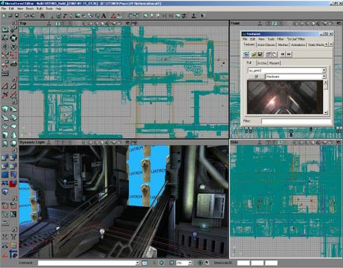The interface can be broken down into eight main sections, which are described in detail below. You should take a few moments to ensure that you are familiar with them as this document will refer to them from now on and assume that you understand these, and know where they are and what they do.

## Drop Menu Options

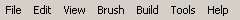Firstly, there are the menus at the top of the screen. They are:

* File: Saving and opening files, importing and exporting your environments.
* Edit: Change Selections, cut and paste, duplicate and other features.
* View: Allows you to view different windows such as the texture viewer, prefab browser, actor and surface properties and many more.
* Brush: This menu has options for changing the brush that you are currently using to build with, clip the brush, import and export brushes to your environment and more.
* Build: This allows you to play-test the level in the engine itself, and rebuild the environment. There are separate options for rebuilding the geometry, lighting, paths and more here.
* Tools: Additional tools that help you to create a brush reset particle emitters and scale the map and lights.
* Help: option for a Tip of the Day, also a link to UDN (That would be here) and a context sensitive help system that is not currently implemented)

The functions here are generally repeated somewhere else in the editor as well, often as buttons.

## General Editor Functions

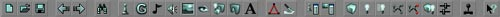Secondly, there is a set of buttons across the top of the screen. These are your main functions such as open, save, rebuild etc. The functions here are not actually used to build your environment, but rather to perform functions on it once you have created it. Detailed information regarding these options is presented in the following text.

### File Options

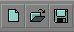These buttons will allow you to create a new map, open a file or save your current work. These options are also available from the top menu and through shortcut keys (New: CTRL +N; Open: CTRL +O; Save: CTRL+L).

### Undo and Redo

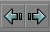These are the Redo and Undo buttons. There are also available from the top menu and as shortcut keys (Undo: CTRL +Z; Redo: CTRL +Y).

### Search for Actors

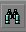This tool allows you to find actors in your environment. When you click the button, the following window is opened, allowing you to either browse the current actors, or find what you require by name, event or tag.**Syntax:** To find an actor, you may type in the actor name (for example, a brush actor may be called Brush0 - in this case, the red builder brush). What you will find though, is that as soon as you start typing the actor name, the list of available actors will be reduced to only the actors whose name starts with what you have entered. Hence, if you have a skyzone and two sunlight actors to find the skyzone actor, would you type in "s" and the list of actors will be narrowed down to only actors that start with the letter s. You can continue to type more of the actor's name and the list will be narrowed down further, till either no matches are found, or the list is narrowed down to the level that is required (and you can see your actor). To align all cameras to the actor, and in a close vicinity to it, double click the actors name in the list. This feature of narrowing the list works for each of the three fields (Name, Event and Tag). These fields may also be used in conjunction with each other (e.g. To find a Trigger that activates another actor via the event "start\_explosion", you could enter in Name: trigger, Event: start and the list would be narrowed down to only trigger actors that have an event entered beginning with start - and almost certainly the actor you are looking for would be in that list).You will note that once you start typing in the Name field, the editor will focus all the windows on the first actor starting with that letter. You once you have found the actor you are looking for, you can double click it from the list on the left side and the editor will highlight the actor and focus the 2D windows on the actor directly while in the 3D window it brings the camera close to the actor and often faces the actor as well.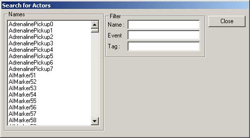

### Browsers

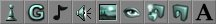These buttons open browsers. These (going form left to right) are:

#### Actor Browser

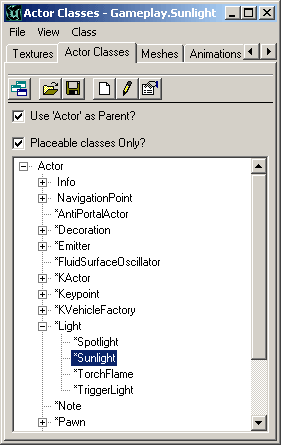The actor Browser allows you to browse the actor classes in the Unreal engine. It will browse any classes that are loaded by the editor. Additional classes may be loaded into the browser to be used. Classes are opened in the editor to allow you to place specific actors into the environment. Double-clicking on a class will open the actual source code for that actor, and allow source code modification. Note that after editing the source code, the packages must be recompiled.To place a selected actor into an environment from the actor list, highlight the required actor (in this case a Sunlight Actor - which is located in Actor > Info > Light > Sunlight. The plus and minus signs next to nested actors are used to expand and collapse the hierarchy tree. Once the required actor is selected, right clicking in the one of the editor windows will allow you to place the selected actor (space permitting) into the area that you clicked in after selecting from the list. The following image shows the placement of this particular actor after right clicking.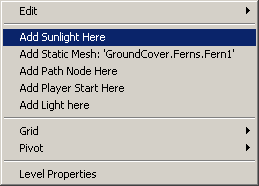

#### Groups Browser

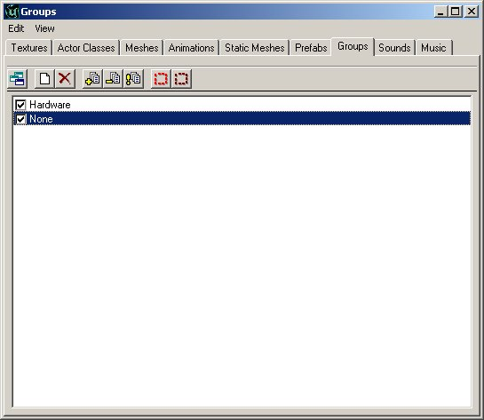You can group actors together using the Group browser. After your actors are grouped together, you are easily able to find the groups and edit the information in them or make changes. As specific groups are unchecked in the browser, they are removed from view totally in the editor.To create a new Group in the Browser simply click the "Create New Group" button. Note - You must have at least one actor selected in the editor to create a new group.**Group Example**
For this example, I am going to create a group from the road barricade here, then have it visible/non-visible. This blockade of the road makes for a perfect group. All the brushes are close together, and make a set of brushes that I would want to either see or not see as a collective group.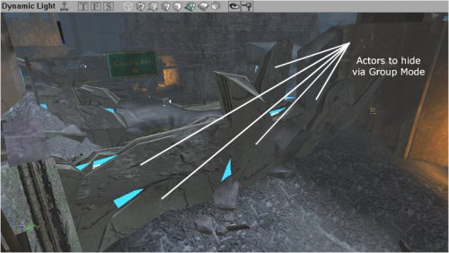Hence, selecting the first brush I want to add to this group, I create a new group by clicking the "Create New Group" button in the browser, then enter the name I wish to reference the group by and hit enter (thus creating the group).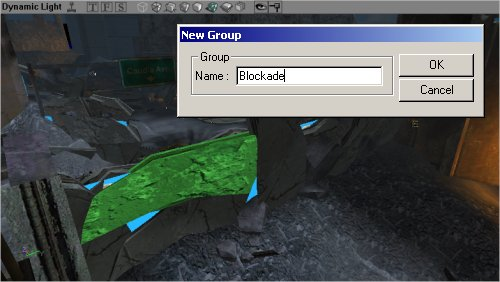When a new group is created, the following prompt appears for you to enter the group name. Note that you may have multiple actors selected when creating a new group.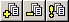In the Groups Browser, these three buttons allow you to add new actors to a current group, delete selected actors from the selected group and refresh the group listings. The Refresh group listings seems to be currently not beneficial, as the groups seem to automatically refresh each time an action is performed when dealing with groups.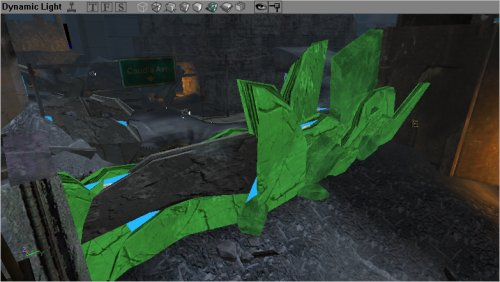Here, additional brushes have been selected in the 3D viewport, and I am adding them to the group by selecting the "Add Selected Actors to Group(s)" button in the browser. With this step, I have added all the brushes that I want to group. Now to continue work on this environment I do not need to see these actors, and hiding them from view will speed up the engine rendering system in the editor. So un-checking the group name in the Group Browser will hide them.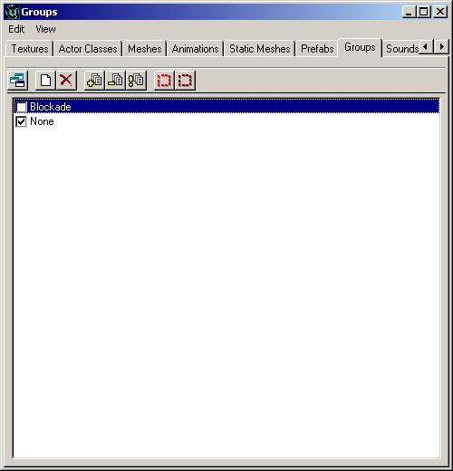Finally, all of our work can now be seen in the editor 3D viewport with the following scene - beautifully devoid of the blockade, though it is of course still there, and we can recall it by merely checking the group in the Groups Browser to be visible.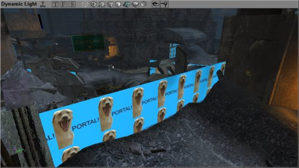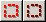Groups can also be used to quickly select and de-select particular actors. If you group a set of lights together in a room, and require to brighten them up together as a group, or to change the volume on a set of ambient sounds, you can select all the actors in a particular group through these two buttons in the group browser.**Some Additional Notes:**
An Actor may be part of any number of groups. If at least one of the groups that an actor belongs to is hidden however, the actor will not be visible. Hence, if an actor was to belong to 3 groups, and one of those was hidden, even though the other two are still visible, that particular actor would stay hidden.Brushes and Meshes are of course not the only actors that can be placed into groups - any actor that you can select can be hidden via the groups menu.Certain actors such as BSP brushes will not be hidden in the 3D view - though they will be hidden perfectly well in the 2D views. In this example, even though the sheet brush (the one with the blue texture saying "Portal" all over it) was hidden, it was still shown in the 3D view as it displayed as a BSP area - and cannot be hidden easily like a mesh or other actor.For an additional guide to using groups, see the [GroupsBrowser](GroupsBrowser.md) document.

#### Music Browser

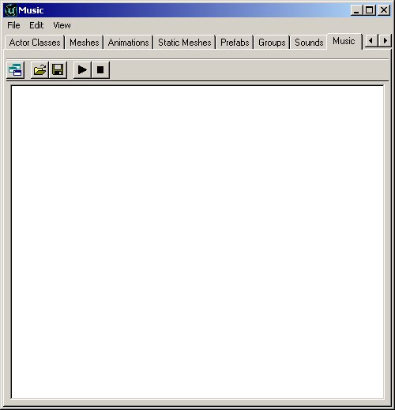The music browser is similar to the sound browser. It allows you to open and listen to music files. Music files are stored in a .umx format, which means that they are not like the sound files, but more like a midi file (except the sound samples for the instruments are included within the file).
The .umx format is no longer supported which makes this browser obsolete.

#### Sound Browser

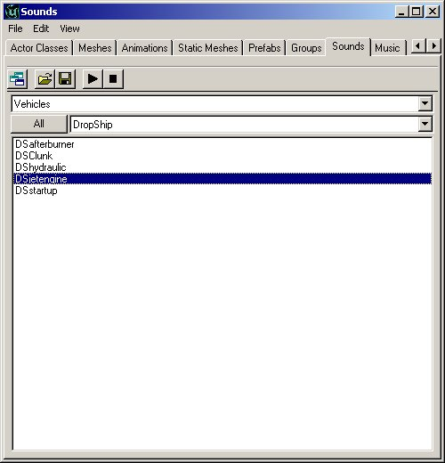The Sound Browser allows you to open, play and find Unreal Sound Packages. It will also allow you to create new sound packages, insert new sounds into current packages and more.For more information on SoundActors see the [ExampleMapsSounds](ExampleMapsSounds.md) document.

#### Texture Browser

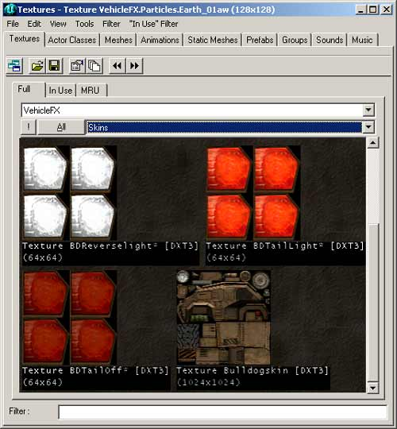Like the other browsers, this will allow you to open texture packages, sort through the various categories in the packages, create new packages and insert new textures into the packages. There is also a filter option to help find the textures required in an easier way. The filter checks to see if the string entered into the filter field is present in the texture names (anywhere in the name, not just starting with) and if it is not present, the texture will be hidden.Many texture packages will be subdivided into Groups to facilitate organization. In the above image, the group "Skins" is open thus only the textures in the Skins group are being displayed in the browser. The other groups can be selected by clicking on the groups field (where it says Skins) and select your desired group. Alternatively, you can just click the "All" button and it will display all the textures in that package. To the left of the "All" button is the "!" button, which displays all the textures in real time. This will have no affect for most textures, but if there are animated textures, or special environment mapped shaders, they will show up as they would in game.Additionally, the texture browser has "In-Use" and "MRU" or `Most Recently Used' settings, which will show all the textures which are currently in use in an environment, and also the recently used textures for quick access.

#### Mesh Browser

The Mesh Browser allows you to find the meshes in your system files. These meshes are not only for decorations, but may actually be used by other actors calling them for rendering (pickups are good examples of this). You may view the meshes, their specific animations and there is additionally a scroll bar at the bottom allowing you to skip to a specific point in an animation. In addition, hitting the play button loops the animation, so that you may see what it looks like when being performed continuously. Note that not all animations loop well - walking will for example, but a death animation for a soldier will not loop well (starting frame of the mesh does not look like the final one, so there is a point where the mesh will jump from one frame to another).

#### Prefab Browser

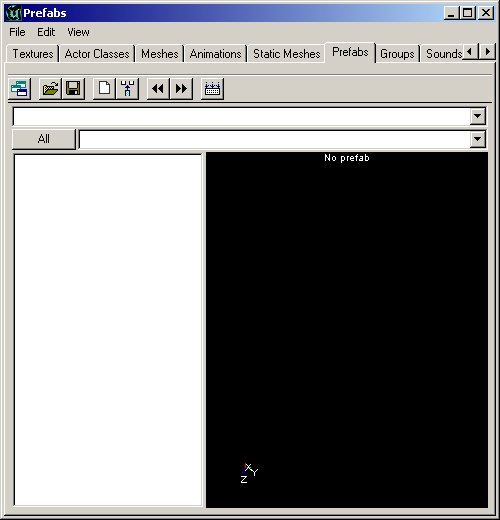The prefab browser allows you to create `packages' of actors and brushes that can be pasted into your environment as a group. The browser stores the information in the prefab in a separate file, so that the prefab files can be used from one level to another easily. It is important to note that as soon as the prefab is placed into the environment, the package file is not required to see it in the environment (though keeping it for future use is of course beneficial). The prefab packages are stored as .t3d files, and may contain actors, brushes and any information that may be present in an Unreal environment.When a prefab is placed into the environment, it is as if each individual actor was placed in manually - there is only less work. There is no difference between individual actors and actors placed via a prefab. As soon as the prefabs are placed, each may be individually changed without affecting any of the other prefabs that have been added.

#### Static Mesh Browser

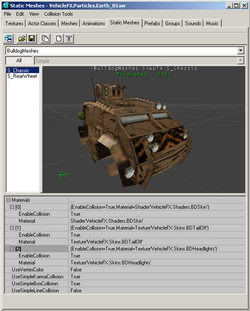The Static Mesh browser allows you to view the static meshes that are in your package files, add new static meshes into the environment and in addition also create static meshes from selection made in the environment. As static meshes do not contain any animation data (hence the name) only items without any animation may be used to create static meshes.For more information on StaticMeshes as well as the StaticMesh Browser, see the [StaticMeshesTutorial](StaticMeshesTutorial.md).

#### Animation Browser

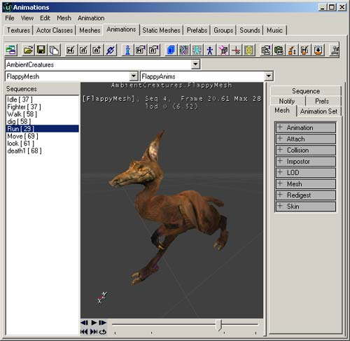The Animation Browser allows detailed viewing of animations for meshes, skeletal structures, influences and many other mesh animation properties. It allows skeletal meshes to be imported and other animation features.For more information also see the [AnimBrowserTutorial](AnimBrowserTutorial.md) and [AnimBrowserReference](AnimBrowserReference.md) documents.

### 2D Shape Editor and UnrealScript Editor

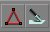These two buttons will open the 2D Shape Editor and UnrealScript editor.

#### 2D Shape Editor

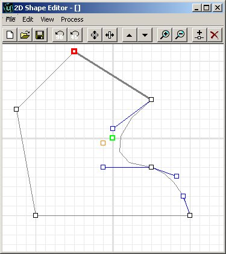The 2D Shape Editor is a tool allowing designers to create more complex shapes then the primitives, though it cannot create extremely complex shapes (e.g. like 3DMax can). This tool is described in much more detail in the 2D [ShapeEditor](ShapeEditor.md) document.It is limited in features, but has not been designed to replace high-end software.

#### UnrealScript Editor

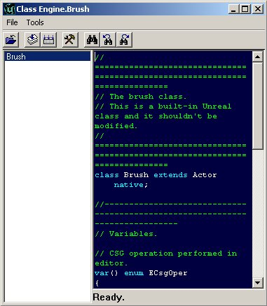The UrealScript editor that is supplied with the Unreal Editor is a simple text editing tool that allows changes to be made to the package classes. While this tool is a very handy addition, it has not been designed to have large or complex code written in it. There are more powerful editors that are available, like the [UDE](https://udn.epicgames.com/Two/Udeinfo), but any text editor would be enough. It is however a useful addition if a few lines of code need to be changed quickly. It also allows for all scripts to be compiled into package files.

### Property Browsers

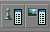These two buttons will open the Property Actors in the Unreal Editor. They open the Actor Properties and Surface Properties respectively.

#### Actor Properties

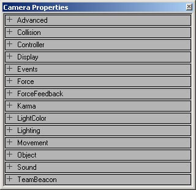The Actor Properties browser allows you to view and change information stored in a specific actor. Information stored includes items like the actors name, properties of the actor (e.g. light brightness settings, triggered event names, zone gravity) and many more. The browser allows these entries to be changed for that particular actor - not for that actor class. To see an example of these properties, take a look at the [ActorVariables](ActorVariables.md) doc that describes the default settings for an Actor.

#### Surface Properties

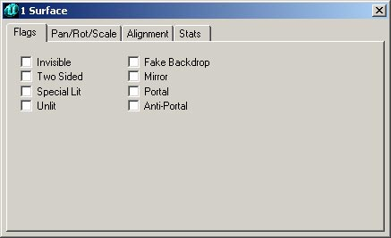The Surface Properties window will allow you to change the properties of any selected surfaces. Surfaces are selected in the 3D view by clicking on them, or multiples can be selected by holding CTRL and clicking multiple surfaces. Surfaces may also be selected by right clicking on a surface and choosing SELECT SURFACES>Option which can automatically select surfaces that are adjacent, similar types or many others (shortcut keys are shown in this menu for additional surface selections).

### Rebuilding and Rebuilding Options

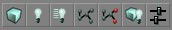These buttons all deal with rebuilding (or compiling) your environment. Some of these buttons are only available in the UT2K3 build. In order from left to right they are:

#### Build Geometry

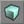This will rebuild the actual geometry in your environment. Geometry is the actual brushes that make up your world. This will create (or recreate if it has already been made) the BSP for the environment.

#### Build Lighting

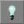Rebuilding the lighting will render light settings for all the light actors in the environment. This is required for correct lighting to be generated. New geometry is not fully lit when it is placed into the environment, and so before it will properly be rendered in the engine, the lighting has to be rebuilt.

#### Build Changed Lighting

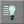This works much like the Build Lighting button except for it only rebuilds lights that have been added or altered thus allowing for a faster rebuild.

#### Build Paths

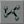Whether paths are used for bots or creatures, paths must be built before the AI is able to use them. Paths are made from many different types of actors, and rebuilding them will create paths for the AI to follow based on the current locations of path-based actors.

#### Build Changed Paths (only available in 2107+)

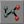 (This feature is only available from builds 2107 and up)Again, this works like the Build Paths button except for it only rebuilds paths that have been added or altered thus allowing for a faster rebuild.

#### Build All

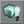This option will rebuild the entire map based on your rebuild settings (which can be changed in the next option explained). You can set this to automatically rebuild the Geometry, BSP, Lighting and Paths. If you have options deselected in your rebuild options, they will not be rebuilt by pressing this button.

#### Build Options

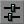This allows you to change your current rebuild options, and either rebuild the environment straight away or use the settings to later rebuild using the Rebuild All button (described above).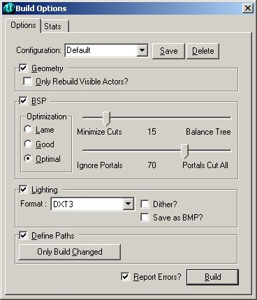

### Play Map

This buttons loads the current map into the Unreal engine and starts play as if a player was playing it. This is useful for testing triggered events and seeing what your environment looks like when being played directly in the engine.

## Building and Environment Buttons

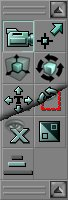Next, we have the toolbar down the left had side of the screen. These buttons are all used in the actual creation of your world. They are broken down into six sections, representing different needs that are grouped together. Going from top to bottom, they are:

### Camera and Miscellaneous

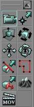These are options to allow you to move the camera, resize brushes, align textures and several other functions.

#### Camera Movement

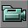Selecting this option will allow you to move the camera freely in the viewports on the screen. If you select another option from the Camera and Miscellaneous section, you are still able to move the camera freely, though other options are available as well.

#### Edit Vertices

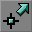This button will select the vertex editing mode. While it is possible to edit vertices without this mode being selected, having this feature selected will make vertex editing easier with more being shown in the viewports.

#### Scale Brush

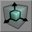This feature will allow you to scale the brush that you have selected. To scale the brush, select the feature, select the brush that you want to scale, then in a 2D viewport (more information on viewports is available further in this document) or 3D (This feature does work in the 3D viewport, though it tends to be easier in the 2D mode as finding the correct axis is much easier) viewport. Holding CTRL, drag the mouse with either the left or right mouse button pressed. This will scale the brush on an axis. The left button will scale in one axis, the right in the other. This is why the 2D views are easier for scaling - one button per axis visible in the view, as compared to the 3D viewport, where on axis is not available.**NOTE: Brush Scaling will take the brush OFF the grid.**

#### Brush Rotate

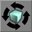This feature will allow you to rotate a brush in the viewport on all three axes. While it is possible to rotate any brush normally by holding CTRL and the Right mouse button (then dragging), that method only allows the brush to be rotated on a single axis in the viewport. With this feature selected, the brush can be rotated on each of the three axes in the same viewport.This is done by selecting the Rotate Brush button, holding down CTRL and the left mouse button (and dragging), the right mouse button (and dragging) or both mouse buttons (and dragging). Each of the combinations will rotate the brush around a different axis. Note that the brush is always rotated around the pivot point (which is either in the middle for most primitives which have not been vertex edited, the pivot point generated by intersection with other brushes, or the last vertex point that was moved or selected).

#### Teture Pan

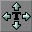This feature allows you to pan the textures across the surface of the brush. This does not turn on automatic panning of the textures, but rather allows you to slide the texture over the surface of the brush so that it can be aligned to exactly where you want it. This feature will only work properly in the 3D view (where the textures are visible). To pan a texture, select this feature, select the texture (by left clicking on the surface in the 3D view - so that it is highlighted - multiple textures may be selected by holding CTRL and left clicking additional textures - and then dragging the mouse with the left or right mouse button pressed. The left will drag in the U texture axis, and the right will drag in the V texture axis.Note that if the texture has been rotated on the brush, it will still drag along the original texture axis - i.e. the texture axis is rotated along with the texture itself.

#### Texture Rotate

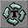Similar to the texture panning feature, this button will allow you to rotate the textures on the surface of the brush without moving the brush in any way. The textures are rotated around a vertex on the brush. This vertex is automatically selected, and there is no way to change this point.Panning a texture is done by selecting the Pan Textures button, then selecting a texture (left click on the texture) in the 3D view (more can be selected by holding and CTRL and left clicking additional textures), then holding the CTRL key pressed, click (either left of right mouse button) and drag. You will see the texture rotating on the surface as you drag. The more you drag, the more it rotates.

#### Brush Clipping Markers

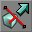This feature will allow you to place brush clipping markers. This is done by holding CTRL and left clicking where you want the clipping marker to be placed. The first clipping point is placed into a 2D view. Then additional markers are added to the view to create the clipping plane. There cannot be more than 3 markers to define the clipping plane. When a clipping plane is defined, it will show the direction of the clipping plane by rendering a small line from the center of the plane in the direction that will clip brushes. This directional marker may be flipped (more information is provided below in the brush clipping section of the toolbar). Note that if you deselect the brush clipping feature on the toolbar, you will lose the markers that you have placed.

#### Freehand Polygon Drawing

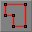This powerful feature of the editor will allow you to create a 3D brush by simply drawing the outline of the shape you require, then extruding (effectively stretching a 2D object into 3D).This feature is performed by selecting the Freehand Polygon Drawing button, the holding CTRL right click the view to add a vertex. Move the mouse to the next point that you want a vertex and once again right click - a red line will appear and join the two points. Once you have three or more vertices, you are able to create a brush from the freehand drawing. If the polygon is not closed, the first and last vertices are automatically joined (this happens regardless of whether the vertices look closed or not - quite often a polygon that appears closed will still be open, and this is visible by zooming right in on the polygon).To extrude the polygon, right click the viewport (you should have let go of the CTRL button by now, else you will create another vertex) and select the option at the top of the list "Create Brush". This opens a small dialogue window asking how deep you require the brush to be. Input a value greater than 1, and click Ok. Your polygon will now be extruded to a 3D shape based on the depth that you entered.

#### Face Drag

This feature allows you to stretch a brush in any angle, while leaving a face of the brush untouched. In the 2D view, right click two vertices while holding CTRL on the brush to select which face should not be moved, and then holding CTRL, left click and drag the mouse to stretch the brush in the direction that the mouse is being dragged.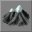

#### Terrain Editor

This button will open the Terrain Editor, which allows you to create realistic terrain based on height maps. While this document shows the interface of the Terrain Editor, it does not go into any further detail about it. This tool is described in much more detail in the [TerrainTutorial](TerrainTutorial.md) document.

#### Matinee Editor

This button will open the Matinee editor, which allows you to make movie like animations using the game engine as the rendering medium. This method of showing cut-scenes is becoming more and more commonly used - partly because of lower load times (the engine does not have to load a video movie file, then reload the level, with all the actors as they were when the movie was started) and also allows the engine to trigger other events as the sequence is being played. You can read more about the Matinee Editor in the [MatineeTutorial](MatineeTutorial.md).

### Brush Clipping

These functions allow you to clip your brushes, move the clipping planes and splice brushes apart.

#### Clip Selected Brush

With this function, the brush that is selected will be clipped (by the clipping markers set out with the Brush Clipping Markers function - which is explained above). The brush is always clipped in the direction of the clipping plane, which is shown by a small line extending from the middle of the clipping line.

#### Split Selected Brush

With this function, the brush that is selected will be split (by the clipping markers set out with the Brush Clipping Markers function - which is explained above). The brush is always split in the direction of the clipping plane, which is shown by a small line extending from the middle of the clipping line.

#### Flip Clipping Normal

This button will flip the line that has been created using Clipping Markers. This is used to determine in which direction the brush will be clipped. The direction that will be clipped is shown by the small line extending from the middle of the clipping plane.

#### Delete Clipping Markers

This feature simply deletes the clipping markers that are in the environment. The same can be done simply by deselecting the Brush Clipping Markers button (explained above), though there are occasions where more clipping is needed, though new markers are required.

### Brush Primitives

These functions will create primitive brushes for use in your environment. To alter the dimensions of any brush builder, you can **right click** on the brush button and a window will pop up. In this window, type in your desired dimensions either directly *or* by typing in an expression (such as **"1024+256"** ). Below each of the Brush Builder Tools are described in detail.

#### Create Cube

This function will create a cube or rectangular brush for you. To create a brush from the last used settings, just left click this button, or to input new settings, right click the button, and the following menu will appear.The settings for the Cube Primitive are explained below.

|  |  |
| --- | --- |
| Height | This is the height of the brush that will be created. |
| Width | This is the width of the brush to be created. |
| Breadth | This is the breadth of the brush to be created. |
| WallThickness | If a hollow setting has been selected for this brush, this will be the thickness of the walls in the brush. |
| GroupName | Optional entry to later find or sort brushes by. |
| Hollow | This settings work with the WallThickness setting above. If this setting is selected as True, then the brush will be built as a cardboard box - hollow inside, but only as solid walls. |
| Tessellated | If this setting is set as True, the faces of the brush will be made from triangles, not rectangles. This feature is useful when vertex editing will be later performed on the brush, as it dramatically reduces instances of HOM. With this setting set to True, no polygon in this brush will be created from more than three vertices, meaning that it will be impossible to move a vertex off the plane that the surface occupies. |

#### Create Curved Stair

This will create a curved (spiral) staircase. The staircase extends to the ground - meaning that each stair created is created from the ground and is raised to the required height.The settings that may be entered to change the stair are as follows:

|  |  |
| --- | --- |
| InnerRadius | This will change the innermost radius of the staircase. This setting must be at least one unit. The larger this number is, the larger the area is inside the center of the brush. |
| StepHeight | The steps are each made to this height, incrementing for each step created. If a value of 16 is used, the first step will be 16 units off the ground, the next will be 32, the next 48 and so on. |
| StepWidth | This determines how wide the staircase is. The total radius of the staircase is determined by adding this value to the InnerRadius value. Hence, if the InnerRadius is set to 256, and the step width is set to 256, the stairs will be 256 units wide, but have a total radius (going around the staircase) of 512 units. |
| AngleOfCurve | This determines how rounded the stairs are. If a value of 90 is used, the stairs will turn 90 degrees in total, while a value of 360 will produce a full circle of stairs. |
| NumSteps | This is the total number of stairs that create the staircase. Note that this has no effect on the angle of curve, but merely creates this number in the total staircase. |
| AddToFirstStep | This setting will add a certain height to the first step created - and add this to the base height for each step created afterwards. If a staircase is required to be 32 units high before the first step is added, entering 32 into this field will correctly create the brush. |
| GroupName | Optional entry to later find or sort brushes by. |
| CounterClockwise | This is a true/false field that will generate the stairs to either curve clockwise (from lowest step to highest) or counterclockwise (from lowest step to highest). |

#### Create Spiral Stair

This function will create a spiral staircase. While it is somewhat similar to the Curved Staircase, in this brush the stairs will only be as thick as the height of each step. Hence, it is possible to create a spiral that can be 720 degrees in revolution.The settings for a Spiral Staircase are as follows:

|  |  |
| --- | --- |
| InnerRadius | This is the setting for the inner radius of the spiral staircase. |
| StepWidth | The actual width of each step in the staircase. |
| StepHeight | The height of each step. This setting, combined with the number of steps in the staircase will determine the total height of the staircase. |
| StepThickness | This will determine how thick each step is going to be. The vertical height of each step does not determine anything to do with the height f the staircase, but only aesthetic appearance. |
| NumStepsPer360 | This is the number of steps in a 360 degree revolution. The higher this value, the more steps will be required to create a full circle. |
| NumSteps | The actual number of steps to create in the brush. If the NumStepsPer360 field contains 32 and this field contains 17, the staircase will only go halfway through a revolution, but if it contains 33, it will go through a complete revolution. This value requires one additional step to be placed for what is required. |
| GroupName | Optional entry to later find or sort brushes by. |
| SlopedCeiling | True of False value that is used to either create a stepped ceiling (underside of the brush) or a smooth surface. |
| SlopedFloor | like the value above, this determines whether the surface is to the sloped or stepped, but this time dealing with the actual upper side of the brush. If this value is set to true, the staircase appears to be a rounded incline rather than steps. |
| CounterClockWise | This is a true/false field that will generate the stairs to either curve clockwise (from lowest step to highest) or counterclockwise (from lowest step to highest). |

#### Create Linear Stair

This creates stairs similar to the Create Curved Stair tool, except straight.The settings that may be entered to change the stair are as follows:

|  |  |
| --- | --- |
| StepLength | The length of the top of each step in the staircase. |
| StepWidth | The actual width of each step in the staircase. |
| StepHeight | The height of each step. This setting, combined with the number of steps in the staircase will determine the total height of the staircase. |
| NumSteps | This determines the length of the total staircase. As set in the fields in the above image, building that staircase would create a staircase that is 256 units long (NumSteps 8 x StepLength 32 = 256). |
| AddToFirstStep | This setting will add a certain height to the first step created - and add this to the base height for each step created afterwards. If a staircase is required to be 32 units high before the first step is added, entering 32 into this field will correctly create the brush. |
| GroupName | Optional entry to later find or sort brushes by. |

#### Create BSP Terrain

This function will create a special type of brush. This can be used to create BSP based terrain or be vertex edited to suit other requirements. This brush is somewhat like a cube, though it has a mesh on one side, which is tessellated allowing for easy and reliable vertex editing.The settings for the Linear Staircase are as follows:

|  |  |
| --- | --- |
| Height | This determines the height of the entire brush. |
| Width | This will determine how wide the brush is created. |
| Breadth | The breadth of the brush is entered here. |
| WidthSegments | This is the number of segments that will be tessellated along the width of the brush. This field however does not automatically increase with the width of the brush. |
| DepthSegments | This is as above, but determines the number of tessellated segments along the breadth of the brush. |
| GroupName | Optional entry to later find or sort brushes by. |

#### Create Sheet

This will create a sheet or flat polygon. This polygon however cannot ever block a player. The polygon created will always be rectangular.Settings for the Sheet Brush Builder are explained here:

|  |  |
| --- | --- |
| Height | The height of the brush (assuming it is placed vertically) |
| Width | The width of the brush. |
| HorizBreaks | The sheet brush can be divided into multiple sections for later manipulation. This setting determines the number of horizontal breaks in the brush. The default is 1, which means that there is one section along the horizon i.e. no breaks. Greater number will result in additional sections being added. |
| VertBreaks | As above, but along the sheets other axis. |
| Axis | The value entered here will determine how the sheet is aligned when created. |
| GroupName | Optional entry to later find or sort brushes by. |

#### Create Cylinder

The Cylinder Brush Builder creates cylinder and pipe brushes.The settings are as follows:

|  |  |
| --- | --- |
| Height | The overall height of the cylinder (from flat end to flat end). |
| OuterRadius | This is the radius of the cylinder. If the Hollow setting is true, this is the outer edge of the pipe. |
| InnerRadius | If the Hollow setting is set to true, then this value will be used as the inner radius of the pipe i.e. if there is a difference of 16 units between the two settings, the pipe will be 16 units in thickness - though it may have a radius of 256 units. |
| Sides | This is the number of sides that will make up the cylinder. Four sides will create a primitive that could be created with the Cube builder. The value entered must be at least 3 (2 would create a sheet). |
| GroupName | Optional entry to later find or sort brushes by. |
| AlignToSide | The AlignToSide setting determines the alignment of the sides of the cylinder. If this setting is true, the bottom brush side will align with the X axis. If there is an even number of sides, the top will also obviously align. If the setting is set to false, the bottom of the brush will be a point where two sides meet. |
| Hollow | A True/False setting that is used to create a solid or hollow brush depending on what is required. |

#### Create Cone

The Cone is very similar to the Cylinder brush, though it has a point at one end.Settings for the Cone are very similar to the Cylinder, though there are a few additions:

|  |  |
| --- | --- |
| Height | This is the overall height of the Cone. |
| CapHeight | If the cone is set to Hollow, this will determine how high up inside the brush the cap will be placed. The cap itself is merely a flat section of the cone that stops a shape being built that comes to a complete point. |
| OuterRadius | This is the radius of the cone. |
| InnerRadius | If the Hollow setting is set to true, then this value will be used as the inner radius of the cone i.e. if there is a difference of 16 units between the two settings, the cone will be 16 units in thickness - though it may have a radius of 256 units. |
| Sides | This is the number of sides that will make up the cone. Four sides will create a pyramid. The value entered must be at least 3 (2 would create a sheet). |
| GroupName | Optional entry to later find or sort brushes by. |
| AlignToSide | The AlignToSide setting determines the alignment of the sides of the cone. If this setting is true, the bottom brush side will align with the X axis. If there is an even number of sides, the top will also obviously align. If the setting is set to false, the bottom of the brush will be a point where two sides meet. |
| Hollow | A True/False setting that is used to create a solid or hollow brush depending on what is required. |

#### Create Volumetric Shape

The Volumetric shape is actually a combination of two sheet brushes joined as one shape. This brush is very useful for creating effects like chains, or possible torch flames where true 3D is either not required, or the polygons used in creating such a shape are not worth the extra resources required to render them.The settings for the Volumetric shape are as follows:

|  |  |
| --- | --- |
| Height | The height of the brush when complete. |
| Radius | The distance that each part of the brush extends from the middle point. |
| NumSheets | This is the number of sheet brushes that is used to create the volumetric shape. The default is 2, which will make a cross. |
| GroupName | Optional entry to later find or sort brushes by. |

#### Create Tetrahedron

The tetrahedron is a spherical object. The faces of this object are triangular, hence with a few extrapolations, the tetrahedron is a very high polygon and very smooth sphere.Settings for the Tetrahedron are explained below:

|  |  |
| --- | --- |
| Radius | The distance from the middle of the brush to the outermost vertices. |
| SphereExtrapolation | This determines the smoothness of the sphere. The larger the number of extrapolations, the smaller the triangles will be that make up the sphere, leading to a much more rounded shape. |
| GroupName | Optional entry to later find or sort brushes by. |

### CSG Operations

These functions allow you to add, subtract, Intersect, De-Intersect your brushes, add moving brushes, hardware brushes (static meshes) and more.

#### Add Brush

Pressing this button will create an additive brush in your environment in the exact place where the active brush (the red brush outline) is. If the active brush contains information about textures and so forth, they will be copied to the new additive brush, otherwise, the default (bubble like) texture will be applied.

#### Subtract Brush

Pressing this button will create a subtractive brush in the environment. Like the Add Brush button, this will copy any information in the active brush (the red brush outline) to the subtractive brush created through this operation.

#### Intersect Brush

This button intersects the active brush with geometry in the level. The active brush is checked against BSP geometry currently in the environment. The effect of Intersecting is that the brush is deleted anywhere inside subtractive geometry. This may be shown as an algebraic expression where X is the space occupied by the active brush, and Y is subtractive space in the geometry. Assuming this to be true, the expression would look something like:X = YThis produces the exact opposite of the De-Intersect function.

#### De-Intersect Brush

This will perform a de-intersection on the active brush. The active brush is checked against BSP geometry in the environment and is recreated only existing where additive BSP based geometry exists. Like the Intersection operation, this function can easily be expressed in an algebraic form. Taking X as the space occupied by the active brush, and Y to be any subtractive geometry in the level (remember that the entire level is initially a huge additive space i.e. the opposite of subtractive geometry) the de-intersection, the result of the function can be expressed as:X = < Y AND > Y (where = means not equal to)X = YThis produces the exact opposite of the Intersect function.

#### Add Special Brush

This allows you to add in special brushes. Most of these brushes are not commonly used, or are created using different properties. Hence they do not have a specific button assigned to them.Pressing this button opens this dialogue box:You may choose one of the preset brush types from the drop down menu which are described below, or you may enter your own settings and create the brush. Note that you can also select a preset from the list and then make any changes that are required.Note that there is more information available about brushes, brush types and geometry in the Geometry chapter of the Unrealed Manual.

* Invisible Collision Hull: This creates a brush that is not seen by the player, but still blocks all movement and by default blocks all actors.
* Zone Portal: This will create a brush that is a zone portal, but totally invisible and non-solid.
* Anti-Portal: This will create a brush that is an anti-portal, but totally invisible and non-solid.
* Regular Brush: This is a normal additive brush. There is no difference in the default settings for this brush and the brush created by simply using the Add Brush button (explained in detail above).
* Semi-Solid Brush: This preset will create a semi-solid brush.
* Non-Solid Brush: This preset will create a non-solid brush.

#### Add StaticMesh (or Hardware Brush)

This action will create a Hardware Brush. This type of geometry is explained in detail in the geometry chapter of this document. The action will merely create the active brush into a hardware brush.

#### Add Mover Brush

This button will create a Mover Brush. The Mover Brush is a special type of brush that is able to move through the environment with set movement positions. This is covered in more detail in the [MoversTutorial](MoversTutorial.md) document. Right clicking the button will open a list of Mover types from the engine actor classes. The programmers in your company are able to add additional mover classes that may be required for your software.

#### Add Anti-Portal Brush

This creates an orange volume in outline that is non-solid and not visible in game. They are used for optimization in preventing the renderer from drawing more than it has to. For more detailed information on anti-portals, see the [LevelOptimization](LevelOptimization.md) document.

#### Add Volume

With this tool you can create effects to simulate certain conditions (such as being underwater or on a ladder) within regions of the level. To select a particular volume type, click on the Add Volume button and choose the desired volume from the menu that appears.For more detailed information on volumes, see the [VolumesTutorial](VolumesTutorial.md).

### Selections and Movement Rate

These buttons will allow you to hide sections of your environment (very handy when you start dealing with larger or more complex maps and geometry) and change the rate of movement for the camera in the viewports.

#### Show Selected Actors

This feature will hide any actors in the environment that are not selected and ignore actors that are selected. This is very useful if scripted sequences are being created, and event lines need to be seen - while ignoring the remained of the environment during the development process.

#### Show Selected Actors

This feature will hide any actors in the environment that are not selected and ignore actors that are selected. This is very useful if scripted sequences are being created, and event lines need to be seen - while ignoring the remained of the environment during the development process. Hiding actors removes them from view in all viewports. Note however that brushes are still rendered in the 3D view.

#### Hide Selected Actors

This function will hide any selected actors from the view. All other actors are still shown as normal. This is useful if there are many actors occupying a small space and only certain ones are required in the editor view. Hiding actors removes them from view in all viewports. Note however that brushes are still rendered in the 3D view.

#### Show All Actors

This function will show all the actors in viewports that display actors (more information is available about viewport display modes in the following section of this document). This function will simply show you any actors that you have previously hidden in the editor.

#### Invert Selection

This function allows you to change the current selection that you have. Any actor that you currently have selected will be unselected and any actor that is not selected will be selected for you.

#### Change Camera Speed

This is a variable setting for the camera movement speed in the viewports. It has three settings, which are slow (the camera is sluggish, though moves accurately), default (the camera moves at a reasonable speed for most things) and fast (where the camera moves very fast, though it can be hard to move the camera accurately with high zoom). Your current camera speed is shown by the button. If the smallest bar is highlighted, then your current camera speed is slow. The middle bar means that you have default camera speed, while if the longest bar is highlighted, it means that you have the fastest camera speed available.

### Mirror Brush and Miscellaneous (buttons available in 2107+ builds)

**NOTE: while these buttons may not be available in more current builds, some of their functionality can be found by right clicking on the brush in question and then going to "Transform."**These functions allow you to mirror brushes you are creating, and more easily select objects within a brush. They are however only available for the UT2K3 builds.

#### Mirror X

This button will mirror the brush (the red outline) along the X axis.

#### Mirror Y

This button will mirror the brush along the Y axis.

#### Mirror Z

This button will mirror the brush along the Z axis.

#### Select All Inside

This action will select all objects that intersect the volume that of the builder brush.

#### Clip Z in WireFrame

Information to be added here.

#### Align View on Actor

After selecting an actor in a viewport, this button will center all of the 2D viewports on that actor and in the 3D viewport, the camera will move close and point at the selected actor.

## Viewports

The next four items are the viewports that open. These are able to be changed and customized to allow you to view the information as you need it, though generally you will have 3 views that are 2 dimensional (showing Top, Front, Side elevations of the environment) and a Dynamic Lighting representation, which is a 3D view of the world just as the player would see it - though it also shows you all the actors and other information which is not visible while playing the actual environment.Note that all the views have a set of axis visible in the lower left hand corner. This will show you the X, Y and Z planes and their directions at all times. This is very handy in the 3D view when you are rotating and changing the camera angle.**CAUTION: Unreal Ed uses a Left-Handed coordinate system, but in the top down viewport, the axis depict a Right-Handed coordinate system. The axis in the Top down viewport are INCORRECT. Do not believe their lies. See image below for clarification:**

### Viewport Controls

All of the viewports have buttons at the top. Firstly, they tell you what they are showing (examples include Top, Dynamic Light, Perspective, BSP Cuts). This is just a quick reference - pretty self-explanatory. Next is a small joystick icon. This will tell you whether the viewport is showing you a dynamic image of the environment, or a static image. The difference here is that things like dynamic lights (lights that flicker, change etc) or a myriad of other things will not be displayed fully in a static viewport. Dynamic viewports also update location of brushes and actors as you change them in other viewports. While this feature may seem like something that would not get turned off at all, it is quite resource hungry to have running, and may cause machines to lag. The editor will certainly run faster without this feature turned on. I would suggest that you use it to test out things like dynamic lights, scrolling textures and so forth, then revert to normal (static) mode when you want to edit further.

### Viewport Window Settings

You can additionally change the window sizes of the viewports. You can choose different layouts for the main four windows if desired. This feature is accessed through the menu shown on the left of this text.This will open the window show below. From this dialogue window you are able to choose a layout that best suits your preferred working viewport display. The icons in the dialogue window show the layout of the viewports. The 3D viewport is shown in blue in the icons. Please note that it is very simple to change which viewport displays what sort of information (as explained in detail below).If you select this menu, the viewports are redrawn on the screen so that they are each individual windows, which you can resize. When in this mode, the viewports may also overlap each other. They are drawn completely independently of the other viewports. This mode of viewport display will also allow additional viewports to be opened - thus giving you more than the standard 4 viewports. More information is available on additional viewports below.When an additional viewport is required, perhaps to zoom in and stay on one section of the environment or an additional display mode (more information on display modes is available in detail below) it is possible to create more viewport windows. This feature however is only available if the viewport display is set to floating (see above).When a new viewport is created, it defaults to a small window that displays the map from the top down in 2D. The image to the left shows multiple viewports that have been created, and are overlapping each other.If you really want to be special, you can change the background space behind the viewports by going to the "View" menu and selecting "Background Image" at the bottom. This is not a terribly useful feature and its pretty self explanatory (once you realize its putting the image behind the viewports, not in the viewports).

### Viewport Display Modes

The next three icons show you which of the three (in order from left to right they are, Top, Front and Side) two-dimensional views the environment is being rendered in (if it is being rendered in one of them, the icon will be highlighted in green otherwise, it will be gray).Lastly there are eight icons, which will show you if a viewport is being rendered in one of the seven 3D modes - which in order from left to right they are presented below. There is also an image of a map to the left of each description. This is the same environment, from the exact same camera angle in each shot:**Perspective** - The environment is rendered in a wireframe view, meaning that each brush is drawn as a colored outline. The brush types are drawn in the same colors as they are drawn in the 2D views to make it easier to find the correct area and/or brush type.**Texture Usage** - The environment is rendered with no lighting. Each texture used is drawn in the same color. This makes it easy to find areas that contain a large number of textures (possibly making high resource demands on the graphics processing hardware while being played). Hardware brushes are textured as per normal - though no lighting is rendered onto them.**BSP Cuts** - This will render your environment showing you where the engine has created BSP cuts. The environment is rendered in basic colors, with different shades representing where cuts have been made. This is useful to possibly single out areas or specific brushes that have made too many BSP cuts into the level (and hence would have an adverse effect to the frame rate.**Textured** - The environment will be rendered as a 3D world with the textures that you have selected placed onto the surfaces, but they will not be lit in any way. This mode is very useful for aligning textures to ensure that they are perfectly laid out. Note that there are no lighting effects at all in this mode, so that textures may (and probably will) not look the same as they will with dynamic lighting in the level.**Lighting** - The environment is rendered as varying shades from black to white. All brushes, whether they are BSP based, hardware or terrain, are rendered purely on the amount of light on them. The more light that brightens the surface, the lighter the color of that surface will be. This mode is most commonly used to either create exact shadows (textures will often distort the true amount of light shed on an area due to their own varying shades) or to check the current lighting in an area (once again for the same reasons).**Dynamic Lighting** - When a viewport is set to dynamic lighting, it renders the lighting fully as a player would see in the engine. Note however that dynamic lighting does not mean that lights that are dynamic in nature (e.g. triggered or flashing) are rendered as such. These will only be rendered in their first instance (how they are shown when the engine first starts). If you wish to view dynamic effects of lights and so forth, you should enable the viewport to display the environment dynamically (by pressing the little joystick icon - detailed above).**Zone Portal** - The Zone Portal mode will render each zone in a different color, and at the same time show where BSP cuts have been made (like the BSP Cuts mode described above) in each zone.**Depth Complexity** - This view is an excellent way to track what is reducing the frame rate in a particular environment. The colors range from green to red and translate the number of passes that the rendered has to calculate to correctly render an environment. Green areas are ones that require only a single pass, through orange where a few passes may be required to red which indicated that there are too many passes being used to render this. Red areas should be corrected to achieve the best frame rate possible.**Large Vertices** - Large Vertices will as the name suggests display larger vertices on selected brushes. In this image the upper left hand side contains the large vertices on the selected brush. Note that you cannot edit these on non-BSP brushes.You can change the viewports to render the environment in a different way by clicking the appropriate icon, or you can also right click the small bar that the icons are on, and change the mode (as shown in detail below).

### Additional Viewport Menus

Right Clicking (on the viewport toolbar) will also allow you to change other aspects of what is shown and how it is done.If you Right Click on the bar in any of the view ports, you are given the following options:These allow you to select what view mode the window will be in. The different modes are described above.The following options from this pull down allow you to show and hide the various different pieces that make up your level.This pull down menu allows you to set the display mode for actors in your level.From here you can choose between displaying in 16-Bit and 32-Bit color for that viewport in the editor.

## Command Prompt and Settings

There are additional tools here that allow you to further modify your editor, set a few simple preferences and enter commands directly into the command prompt (to be added into the log or as per the command settings). Note that this image has been edited to fit correctly on a printed page.(The DrawScale3D fields are only available in the v2226+ builds.)

### The Command Prompt and Log Window

The Command Prompt allows you to enter console commands into the editor. Some commands show information in the viewports, while other commands will print information to the log window.

#### The Command Prompt

The command prompt itself simply allows you to enter commands directly into the editor. Entering the correct commands can mimic pressing buttons in the editor and so forth, but there are also many commands that do not have buttons assigned to them which can be entered into the command prompt. The command prompt also keeps the last commands used in memory. To access the last entered commands, click the button on the right hand side of the command prompt to open a drop menu.

#### The Log Window

The log window merely shows the current Unreal Editor Log. The editor log outputs a lot of very useful information, and there are many commands that only output the information to the log (these are mainly information seeking queries - such as checking overall texture usage other similar global information).When this button is pressed, the log is shown in a window like the one below. The window can be resized to show all the information, and a scroll bar is available to find information in the log.The log window also has a prompt, which allows commands to be entered directly into it - just like entering commands into the Command Prompt.

#### Vertex Snap

This toggle command determines whether all the vertices dragged are automatically snapped to the grid. This setting is recommended as it will allow for easier manipulation of the brushes in the editor. If this toggle is turned off, it may seem that vertices are on a specific grid cross (and therefore implying a specific distance from the other vertices) but may actually be minute distances (or not so minute - depending on the viewport zoom factor) apart. Additionally, brushes that have been snapped to the grid are easier for the engine to render - hence providing improved frame rates. The vertex snap will adhere to any grid that the editor is currently using (see next two entries here for additional information on the grid and grid settings).It is important to note however that brushes and vertices are the only things snapped. Actors represented by icons (such as lights, triggers and so forth) are not snapped - no matter what this toggle is set at.

#### Drag Grid

Similar to the Vertex Snap feature, the Drag Grid will snap entire brushes that are dragged around the screen to specific points on the grid. This setting is once again tied to the grid size (which is explained in the next point). Note that it is generally much easier to align brushes when the drag grid is enabled. Minute distances in the editor (assuming normal viewport zoom) are impossible to see - though they are treated exactly the same as large distances. If there is an area of solid space that is one tenth of a unit wide, it will block the player just as well as a distance of a few thousand units.

#### Rotation Grid

This toggle determines whether objects that are rotated are rotated freely or on a rotational grid. If the rotational grid is enabled, any brush that is rotated is done so with 64 rotational units per complete revolution i.e. one rotational grid unit is equal to 5.625 degrees. This feature is useful for rotation brushes in an exact manner. Rotating freely 90 degrees left is close to impossible without this setting due to minute rotational units in the editor. Like dragging brushes, while it may seem exactly correct, brushes are often a few minutes (fractions of degrees) off the required rotation - possibly having adverse effects on the geometry or not being aligned correctly.

#### Maximize Viewport (2107+ only)

 (This feature is only available in the 2107 builds and up)This will maximize the active viewport (the one with the white border) to the full size of the viewport area. Pressing it again will restore it to it's original size. This works for both floating and fixed viewports.

