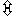

# UnrealEd Key Combinations Cheat Sheet

*Document Summary: A reference for all of the keyboard shortcuts for Unreal Ed.**Document Changelog: Last updated by Jason Lentz (DemiurgeStudios?), to update for the 2110 build. Original author was Mike Lambert ([UdnStaff](https://udn.epicgames.com/Main/UdnStaff)).*

* [UnrealEd Key Combinations Cheat Sheet](#unrealed-key-combinations-cheat-sheet)
  + [Movement](#movement)
    - [Movement Usage](#movement-usage)
    - [Axial Movement](#axial-movement)
    - [Free Movement](#free-movement)
    - [Axial Rotation](#axial-rotation)
  + [Clicking on...](#clicking-on)
    - [the backdrop](#the-backdrop)
    - [a surface/polygon in the 3D view](#a-surfacepolygon-in-the-3d-view)
    - [an actor](#an-actor)
    - [the vertex of a brush](#the-vertex-of-a-brush)
  + [Render Options](#render-options)
    - [Render Modes](#render-modes)
    - [Toggle Rendering](#toggle-rendering)
  + [Brush Manipulation](#brush-manipulation)
  + [Actor Manipulation](#actor-manipulation)
  + [The Usual](#the-usual)
    - [File](#file)
    - [Edit](#edit)
    - [Find/Replace](#findreplace)
  + [Polygon Selection](#polygon-selection)
    - [Select Adjacent...](#select-adjacent)
    - [Complex Selection Modes](#complex-selection-modes)
    - [Memorization](#memorization)
    - [Miscellaneous](#miscellaneous)
  + [Editing Modes](#editing-modes)
    - [Brush Clipping Mode](#brush-clipping-mode)
    - [Vertex Editing Mode](#vertex-editing-mode)
    - [Polygon (Face) Dragging Mode](#polygon-face-dragging-mode) Dragging Mode)
    - [Brush Rotate Mode](#brush-rotate-mode)
    - [Brush Scale Mode](#brush-scale-mode)
    - [Freehand Polygon Drawing Tool](#freehand-polygon-drawing-tool)
    - [Texture Panning Mode](#texture-panning-mode)
    - [Texture Rotate Mode](#texture-rotate-mode)
    - [Terrain Editing Mode](#terrain-editing-mode)
    - [Regular Viewport Mode](#regular-viewport-mode)
  + [UnrealEd Bugs (found while creating the above document)](#unrealed-bugs-found-while-creating-the-above-document))

One can find the below key shortcuts in the following files, since this file will become out of date as new features are added:

* UnEdCam's UEditorEngine::Key
* UnEdCam's UEditorEngine:: MouseDelta
* UnEdCam's CalcFreeMoveRot and CalcAxialMoveRot
* UnEdClick's HBackdrop::Click and FEditorHitObserver::Click

## Movement

There are two 'modes' for mouse movement.

### Movement Usage

Free movement is used for:

* moving the camera
* moving actors in an orthographic view
* face dragging
* vertex dragging

Axial movement is used for:

* moving actors in an non-orthographic view
* scaling brushes
* snapping brushes

Axial rotation is used for:

* brush rotation

### Axial Movement

If orthographic viewport (XY,YZ,XZ views)

|  |  |
| --- | --- |
|   | Zoom In/Out |
|   | Move Left/Right (horizontal) |
|   | Move Up/Down (vertical) |

If non-orthographic viewport (3D view)

|  |  |
| --- | --- |
|   | Move along X axis |
|   | Move along Y axis |
|    | Move along Z axis |

### Free Movement

If orthographic viewport (XY,YZ,XZ views)

|  |  |
| --- | --- |
|   | Move left/right and up/down |
|    | Zoom in/out |
|   | Rotate in plane of current viewpoint |

If non-orthographic viewport (3D view)

|  |  |
| --- | --- |
|   | Yaw and Move forwards/backwards and yaw |
|    | Move left/right and up/down |
|   | Yaw and Pitch |

### Axial Rotation

|  |  |
| --- | --- |
|   | Pitch |
|   | Yaw |
|    | Roll |

## Clicking on...

### the backdrop

|  |  |
| --- | --- |
|   | Center Camera at Clicked Point |
| A  | Add Current Actor |
| L  | Add Light |
| ) | Context Menu |
| No-   | Select None |
|   | Add Clip Marker |
|    | Dragging the mouse extends a ruler that will give you the distance between any two points |

### a surface/polygon in the 3D view

|  |  |
| --- | --- |
|    | Select Brush associated with surface |
|   | Apply current texture to surface |
|   | Grab texture from surface |
|   | Apply current texture to surface |
|    | Apply current texture and texture coordinates (from last grabbed surface) to surface |

### an actor

|  |  |
| --- | --- |
|   | Add Clip Marker |
|   | Toggle selection of Actor |
| ) | Select this |
| ) | Context Menu |
|   | Properties Window |

### the vertex of a brush

|  |  |
| --- | --- |
|   | Add Clip Marker |
| ) | Set vertex as pivot |

## Render Options

### Render Modes

|  |  |
| --- | --- |
|  1 | RMODE 1 (Wireframe) |
|  2 | RMODE 2 (Zones and zone portals) |
|  3 | RMODE 3 (Flat-shaded) |
|  4 | RMODE 4 (Flad-shaded with normals) |
|  5 | RMODE 5 (Illuminated texture mapping) |
|  6 | RMODE 6 (Plain texture mapping) |
|  7 | RMODE 13 (XY view) |
|  8 | RMODE 14 (YZ view) |
|  9 | RMODE 15 (YZ view) |

### Toggle Rendering

|  |  |
| --- | --- |
| B | Toggle Show-Brushes |
| H | Toggle Show-Actors |
| K | Toggle Show-Backdrop |
| P | Toggle Show-Player-Control (Realtime Preview) |
| W | Toggle Show-Hardware-Brushes |

## Brush Manipulation

|  |  |
| --- | --- |
|  A | Add Brush |
|  D | Deintersect Brush |
|  I | Intersect Brush |
|  S | Subtract Brush |

## Actor Manipulation

|  |  |
| --- | --- |
|  A | Select All Actors |
|     | Add selected actors (supports shift.gif for multiple-selection) |
| Delete | Delete Selected Actors |
| F4 | View Actor Properties |
| F5 | View Surface Properties |
| F6 | View Level Properties |
| F7 | Compile Changed Scripts |

## The Usual

### File

|  |  |
| --- | --- |
|  O | Open |
|  L | Save |
|  E | Save As... |
|  P | Play Level |

### Edit

|  |  |
| --- | --- |
|  X | Cut |
|  C | Copy |
|  V | Paste |
|  D    W | Duplicate (important when using Static Meshes/Hardware Brushes) |
|  Y | Redo |
|  Z | Undo |

### Find/Replace

|  |  |
| --- | --- |
|  F | Find |
|  H | Replace |

## Polygon Selection

### Select Adjacent...

|  |  |
| --- | --- |
|  J | Select All Adjacent Polys |
|  C | Select Adjacent Coplanar Polys |
|  F | Select Adjacent Floor Polys |
|  Y | Select Adjacent Polys With Slanted Slope |
|  W | Select Adjacent Walls |

### Complex Selection Modes

|  |  |
| --- | --- |
|  G | Select Matching Group Polys |
|  B | Select All Polygons on Brushes which have a polygon currently selected |
|  I | Select Polys on Brush with Same ItemNames |

### Memorization

|  |  |
| --- | --- |
|  M | Memorize Selected Polys |
|  R | Select Memorized Polys |
|  O | Select Memorized Polys and Currently Selected Polys (Selected OR Memorized) |
|  U | Select Memorized Selected Polys (Selected AND Memorized) |
|  X | Select Memorized Non-Selected Polys and Non-Memorized Selected Polys (Selected XOR Memorized) |

### Miscellaneous

|  |  |
| --- | --- |
|  S | Select All Surfaces in Level |
|  Q | Select Unselected Polys on Brush (Brush MINUS Selected) |
|  T | Select Matching-Texture Polys |
|  N | Select None |

## Editing Modes

*(choose a mode by selecting an icon on the upper portion of the left toolbar)*

### Brush Clipping Mode

|  |  |
| --- | --- |
| ) | Add vertex (up to three) |

### Vertex Editing Mode

|  |  |
| --- | --- |
|   | Regular Camera Movement |
|    | Move vertices |
|     | Add selected vertices (supports shift.gif for multiple-selection) |
| ) | Add vertex to selection |

### Polygon (Face) Dragging Mode

|  |  |
| --- | --- |
|   | Regular Camera Movement |
|    | Move faces |
| ) | Add polgyons visible to point clicked (as if it is on the 0 plane) |

### Brush Rotate Mode

|  |  |
| --- | --- |
|   | Regular Camera Movement |
|    | Axial Rotation |

### Brush Scale Mode

|  |  |
| --- | --- |
|   | Regular Camera Movement |
|    | Snap to grid |
|    | Scaling on Brush in Given Direction |

*(Deprecated? Broken?)*

|  |  |
| --- | --- |
|     | Scaling on Each Brush, Retaining Relative Positioning |

### Freehand Polygon Drawing Tool

|  |  |
| --- | --- |
| ) | Add vertex to list |
|   | Regular Camera Movement |
| ) | Options which allow one to "Create Brush" |

### Texture Panning Mode

|  |  |
| --- | --- |
|   | Regular Camera Movement |
|     | Uniform Texture Scaling |
|    | U Panning |
|    | V Panning |

### Texture Rotate Mode

|  |  |
| --- | --- |
|   | Regular Camera Movement |
|    | Rotate Textures on Selected Faces |

### Terrain Editing Mode

*(rough and unfinished. changes expected)*

|  |  |
| --- | --- |
|   | Regular Camera Movement |
|     | Raise/Lower Terrain Vertices |
| ) | Select Vertex |
|   | Select Additional Vertex |

### Regular Viewport Mode

|  |  |
| --- | --- |
|     | Add selected vertices (supports shift.gif for multiple-selection) |
| ) | Select brush, or Select vertex on brush |
|    | Move selected vertices |
|   | Move |
|   | Move Actors |
|        Delete | Eliminate all BSP errors |

## UnrealEd Bugs (found while creating the above document)

)

N assigned to both "New" and "Intersect"

)

S assigned to both "Select all surfaces" and "select adj. slants""Select None" mislabelled as

)

Z, should be

)

N"Select Adj. Slanted" should be

)

Y, not

)

S"Intersect" should be

)

I, not

)

N"Save As" should have "Ctrl-E" listed in the menu

