# Emitters

*Document Summary: A reference to properties-based emitter editing and creation. (non UDN build).**Document Changelog: Last update by Michiel Hendriks for build 3323. Previous update by Tom Lin for 2226 build and reorganization. Original Author: Lode Vandevenne.*

* [Emitters](#emitters)
  + [Introduction](#introduction)
  + [Setting it up](#setting-it-up)
  + [ParticleEmitters](#particleemitters)
    - [Add a new ParticleEmitter](#add-a-new-particleemitter)
    - [Remove a ParticleEmitter](#remove-a-particleemitter)
    - [Remove an empty slot](#remove-an-empty-slot)
    - [Add or Insert](#add-or-insert)
    - [Linked ParticleEmitters](#linked-particleemitters)
    - [Clear all ParticleEmitters](#clear-all-particleemitters)
  + [Emitter Properties](#emitter-properties)
    - [Acceleration](#acceleration)
    - [Collision](#collision)
    - [Color](#color)
    - [Fading](#fading)
    - [Force](#force)
    - [General](#general)
    - [Local](#local)
    - [Location](#location)
    - [Mass](#mass)
    - [MeshSpawning](#meshspawning)
    - [Object](#object)
    - [Performance](#performance)
    - [Rendering](#rendering)
    - [Revolution](#revolution)
    - [Rotation](#rotation)
    - [Size](#size)
    - [SkeletalMesh](#skeletalmesh)
    - [Sound](#sound)
    - [Spawning](#spawning)
    - [Texture](#texture)
    - [Tick](#tick)
    - [Time](#time)
    - [Trigger](#trigger)
    - [Velocity](#velocity)
    - [Warmup](#warmup)
  + [Emitter Flowchart](#emitter-flowchart)
  + [Final Notes](#final-notes)

This document is part of a series. [SpriteEmitter](https://udn.epicgames.com/Two/SpriteEmitter), [MeshEmitter](MeshEmitter.md), [SparkEmitter](SparkEmitter.md) and [BeamEmitter](BeamEmitter.md) cover the different emitter types in greater detail. Some are still under construction. The information about these emitters can be had in previous revisions of this document. Please be patient.

## Introduction

Emitters are actors you can drop into your level that will spawn particles. Using a huge amount of properties, you can tell the emitter what kind of particles to make, how many, how the particles will move and more. Almost any effect you can think of is possible with particles, given the right parameters. You can make fire, rain, snow, waterfalls, smoke, fireworks, lightning and much more. This is the fun stuff! 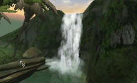 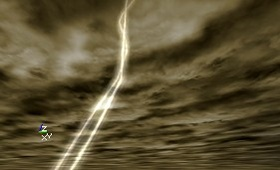From now on, the actor you add in the map that looks like 5 colored dots will be referred to as an "Emitter." A "ParticleEmitter" is the component piece of an Emitter. There are 4 kinds of ParticleEmitters: [SpriteEmitter](https://udn.epicgames.com/Two/SpriteEmitter), [SparkEmitter](SparkEmitter.md), [MeshEmitter](MeshEmitter.md) and [BeamEmitter](BeamEmitter.md). A single Emitter can be made of many ParticleEmitters. Each ParticleEmitter has a doc that explains the fields that are specific to that class, but many of the properties are shared by all the emitter types.This document covers the theory about Emitters, what they are, the common properties, how to add them in your map, etc... There will be a lot of references from one section to another, since often to achieve certain effects, you must use fields that are widely separated. Other documents cover how you can make cool effects with it, example maps, and the properties specific to the individual ParticleEmitter types. To fully understand those documents, you will probably want to refer back to this document.

## Setting it up

To add a working Emitter in your map, first you have to select the Emitter in the Actor Class Browser, it's directly in the Actors list.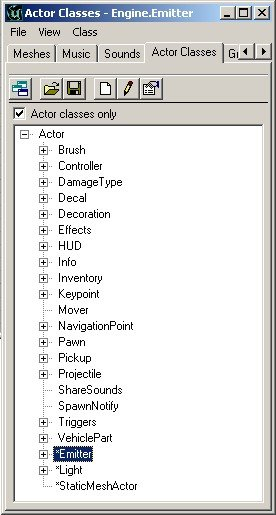Add the Emitter in your map at the place where you want the effect. In the editor, the Emitter looks like 5 colored dots.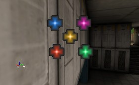This Emitter will not do a lot on it's own, it's just a placeholder for one or more sub- emitters, called ParticleEmitters. This is slightly confusing. The `Emitter' itself is simply a convenient way to group one or more `ParticleEmitters' that do the actual work. Open the properties of the Emitter and expand the `Emitter' field. Click on Emitters (you can't expand this yet, because it's empty now) and press the Add button that appears. Now Emitter[0] (which is one of the aforementioned ParticleEmitters gets created in the list.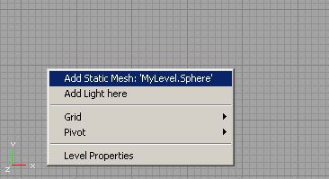 But it's not done yet! Expand Emitters and expand [0]. There you have to choose between [SpriteEmitter](https://udn.epicgames.com/Two/SpriteEmitter), [SparkEmitter](SparkEmitter.md), [MeshEmitter](MeshEmitter.md) or [BeamEmitter](BeamEmitter.md). When you made your choice, press the New button and there will be the new ParticleEmitter in the flavor of your choice, with all its properties.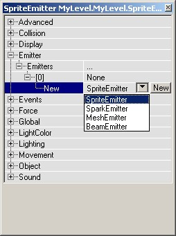 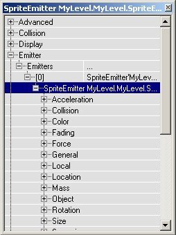

## ParticleEmitters

As you've seen, you have to add a ParticleEmitter inside the properties of the Emitter. You can also add two or more ParticleEmitters in one Emitter. Each of these ParticleEmitters works completely independent, but they are inside the same actor. The ParticleEmitters are automatically stored in the MyLevel package, with names like "BeamEmitter0" or "MeshEmitter8". In the previous section of this tutorial, you had to do 2 things to add a new ParticleEmitter: first you had to make a new place for the ParticleEmitter by pressing the Add button, and then you had to fill that new place with an actual ParticleEmitter. To fill that space, you pressed the New button, so a new ParticleEmitter was created in the MyLevel package. You can also copy the name of an already existing ParticleEmitter in there.For example, this is an Emitter with 6 total emitter slots in it. 2 of the places are filled (one with a SparkEmitter and one with a MeshEmitter), and the other 4 are still empty.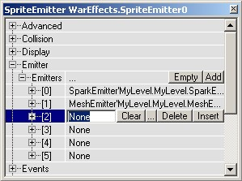

### Add a new ParticleEmitter

To add a new ParticleEmitter, for example a SpriteEmitter, press the button next to the [2], choose `SpriteEmitter' from the pull-down and press the `New' button. Now *SpriteEmitter'MyLevel.MyLevel.SpriteEmitter0'* should appear in the textfield, assuming this is the first SpriteEmitter in your map.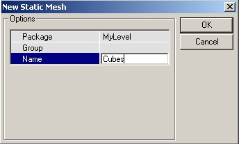

### Remove a ParticleEmitter

To remove this SpriteEmitter, press the `Clear' button next to the [2]. Now place [2] will be empty again. Then it'll be the same again as it was before you added the [SpriteEmitter](https://udn.epicgames.com/Two/SpriteEmitter).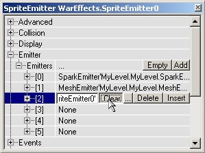

### Remove an empty slot

To delete a placeholder, for example place[5], press the Delete button next to the [5]. Now the Emitter will have 5 placeholders left.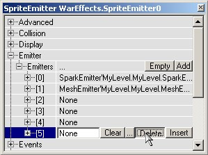

### Add or Insert

To add place[5] again, press the Insert button at any of the other placeholders, or press the Add button next to Emitters. If you use the Insert button, the new place will be inserted before the one with the Insert button. This means if you pressed the Insert button of place [4], the new place will become place [4] and the one where you pressed the button becomes place [5].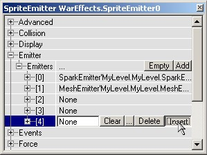

### Linked ParticleEmitters

If you want to give place [2] exactly the same [SparkEmitter](SparkEmitter.md) as the one in place [0], first select the name of the [SparkEmitter](SparkEmitter.md) in [0] and copy it (press CTRL + c), then click on the word "None" in place [2] and paste the name of the [SparkEmitter](SparkEmitter.md) there (Press CTRL + v). Now the ParticleEmitter of place [0] and place [2] share the same data, so if you change a property (for example the Velocity) in place [0], this property is also automatically changed in place [2].This is **not** useful for 2 ParticleEmitters that are in the same Emitter: two identical ParticleEmitters that emit their particles at the same [Location](#location), look like one ParticleEmitter. However, you can also copy the name in one Emitter, and paste it into another Emitter somewhere else in your map. This way, you can link ParticleEmitters that are used in more than one Emitter. For example, you can make 4 fires in a room, that use the same ParticleEmitter, so when you change the properties of one of the fires, the others change as well. This way you don't have to change the properties of the 4 fires separately.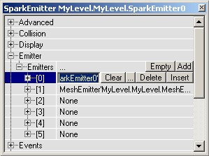 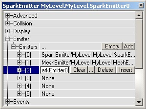

### Clear all ParticleEmitters

If you want to remove all the places from an Emitter, just press the Empty button next to Emitters, and it's all gone.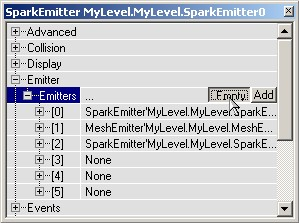 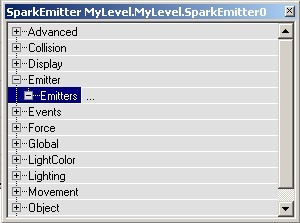

## Emitter Properties

Here almost all of the properties in an emitter will be listed. The fields that are specific to certain types of emitters are covered in their own documents, but the properties listed below are applicable to all of the types. See [BeamEmitter](BeamEmitter.md), [MeshEmitter](MeshEmitter.md), [SparkEmitter](SparkEmitter.md) and [SpriteEmitter](https://udn.epicgames.com/Two/SpriteEmitter) for the class-specific information.

### Acceleration

To make particles move, you can give them Velocity and/or Acceleration. The Acceleration makes them move faster and faster, and is very easy to set up: open the properties of the Emitter and in there open the properties of your emitter. In there, expand Acceleration.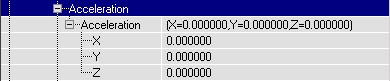There you can enter the amount of Acceleration you want along the X, Y and Z axis. You can enter negative values too. If you assume that the upper part of the Top View is the North, here's what the settings do: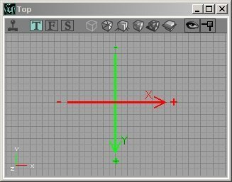If X > 0, the particle will go to the East
If X < 0, it'll go to the West
If Y > 0, it'll go to the South
If Y < 0, it'll go to the North
If Z > 0, it'll go to the ceiling or sky
If Z < 0, it'll go to the ground
The total acceleration is the sum of these 3 components, so if X = 425, Y = -950 and Z = -950, the particles will go to the North-East and down, and will go to the North with more acceleration than to the East. However, if you rotated the Emitter actor with the Rotation tool, this won't be correct anymore, the CoordinateSystem will be rotated then. The X-axis will then be the direction of the arrow if you set bDirectional to True in advanced. Once you gave it some acceleration, you'll see the particles move.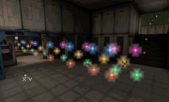For more information on making particles move, you can skip down to [Velocity](#velocity).

### Collision

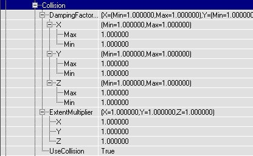Collision can make the particles realistically bounce on walls, floors or ceilings. It looks for example like the animated gif: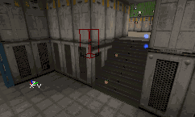If you have no Collision, the particles will just disappear in the wall: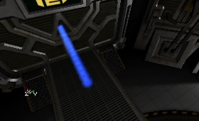But if you set UseCollision to True, the particles will bounce on the wall. If they hit the wall perpendicularly, they will bounce back to from where they came as on the first screenshot, in any other case they'll bounce like on the second screenshot. Note that collision doens't work if the coordinatesystem is PTCS\_Relative.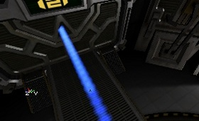 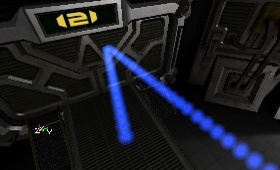

#### Collision Planes

It is possible to make invisible planes, which only particles will bounce on. The planes don't collide anything else, only the particles of that particular emitter. These planes are 1-sided, the particle can go through it at one side but will bounce against it if it goes the other direction. You have to make the planes in the CollisionPlanes setting. For each plane, you can enter W, X, Y and Z. W is the distance from the plane to the center of the editor grid, and X, Y and Z determinate the direction of the normal of that plane. You can also enter negative values, for example to get on the other side of the grid or to turn around the 1-sided direction. On the screenshots, the red dot represents the center of the editor grid, the grid itself is 256 units, and the red line shows the (invisible) plane. The small red triangles point into the direction the particles can go through the plane. On the first screenshot, W=256, X=0, Y=1 and Z=0. The particles can go to the south until they bounce against the wall, and when going north again, they'll bounce against the plane. On the second screenshot, W is changed to -256 and Y to -1, so the direction turns around, and the particles will bounce against the other side of the plane instead.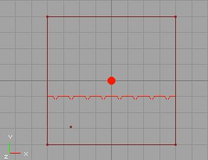 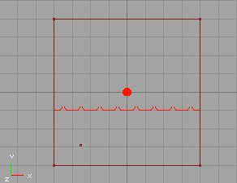Make sure to turn on the collision planes lower down in the properties, with [UseCollisionPlanes](#usecollisionplanes).

#### DampingFactorRange

The DampingFactor changes the velocity of the Particle every time it bounces on the wall. For example, in the real world if you let a tennis-ball fall on the ground, it bounces less high every time it hits the ground again. On the following screenshots, there is an acceleration Z = -950, and a velocity of X = 500. The Velocity gets multiplied by the Damping Factor, to determine how high the particles will bounce back..On every screenshot, the Z value of the DampingFactor is modified to alter the `bounciness' of the particles. It's the Z value that's used, because in this case the particles are bouncing on the Z-axis, to the floor. If the DampingFactor is `1' they can keep and keep bouncing as long as they live, as shown on the first screenshot. If you make it lower than 1, for example 0.9, they'll bounce less high every time they hit the ground, as in the second screenshot.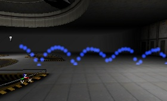 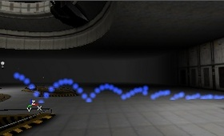If you make the DampingFactor higher than 1, for example 1.5, the particles will bounce higher and higher (1st screenshot). If you give a different Min and Max value, every particle will bounce randomly something between the Min and Max value (2nd screenshot).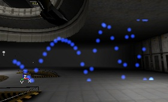 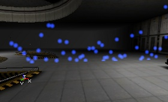

#### ExtentMultiplier

The ExtentMultiplier is multiplied by the Size of the particle, and this is used for the collision detection. This multiplied Size determinates where the colliding sides of the particles are, and as soon as that (invisible) side reached the surface, the particle will bounce.

#### MaxCollisions

If you set UseMaxCollisions to True, the particle will die when it has bounced the user-defined number of times entered in MaxCollisions, no matter what LifeTime it has. MaxCollisions is a range, so it can be set to be a random figure within that range.

#### SpawnAmount

SpawnAmountRange controls the number of sub-particles you want to get spawned when a bouncing particle hits the surface. See the next two fields for more detail on this.

#### SpawnedVelocityScaleRange

If you set UseSpawnedVelocityScale to True, you can also give the particles that get spawned when it bounces a velocity. You can set this Velocity in the SpawnedVelocityScaleRange settings: you can give Minimum and Maximup X, Y and Z settings. If the particle bounces, the spawned particles only get the velocity in the normal direction on the surface.

#### SpawnFromOtherEmitter

With SpawnFromOtherEmitter, you can make another ParticleEmitter spawn at the point of impact of a particle. Bullet holes, or ripples in shallow water, for example. For this to work, you have to make a second ParticleEmitter inside of the same emitter actor, and in SpawnFromOtherEmitter enter the number of that new emitter, for example 1 if it's called SpriteEmitter [1]. The particles of this new emitter are the ones that will be spawned when the bouncing particle bounces. For the new emitter, set RespawnDeadParticles in Local and AutomaticInitialSpawning in Spawning to False. The reason for this is, otherwise these particles may also get spawned at the wrong moment and the wrong place.

#### UseCollision

This is a Boolean toggle that turns [collision](#collision) for particles on or off.

#### UseCollisionPlanes

This is a Boolean toggle that turns the [collision planes](#collisionplanes) on or off.

#### UseMaxCollisions

This is a Boolean toggle that tells Unreal whether or not to use the [MaxCollisions](#maxcollisions) value.

#### UseSpawnedVelocityScale

This is a Boolean toggle that tells Unreal whether or not to use the [SpawnedVelocityScaleRange](#spawnedvelocityscalerange).

### Color

#### ColorMultiplierRange

The Color Multiplier Range is a multiplier that is applied to each particle individually at the start of its lifetime. This can be used in two main ways; to give the particles random variation in color, and to adjust the color of the emitter without having to change the texture or the color scale. To give the particles a slightly random color set the min and max of a field to different values; the wider the range the more the variation in color. To adjust the color of the emitter just change the value of R, G, or B to make the emitter less Red, Green or Blue.

#### ColorScale

This is a time-based scale that can be applied to the particles. A scale changes a property of the particle during its LifeTime, in this case the color. To use a ColorScale, first set UseColorScale to True, and then add a new ColorScale: click on ColorScale, press the Add button and a new Color and RelativeTime will appear. To choose a color, use the "..." button to get the Windows Color Picker, use the "Pick" button to get a dropper tool, or enter the RGB value manually.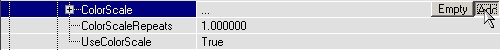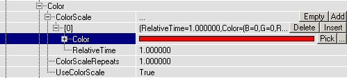First choose a color, for example red. Then you need to enter a RelativeTime. This time depends on the LifeTime of the particles (you can set this in Time), and on the ColorScaleRepetitions value. The RelativeTime does NOT depend on the MaxParticles, so if you have too few MaxParticles, it might be the LifeTime is too long. Then you'll have to make more MaxParticles, or reduce the LifeTime. If ColorScaleRepeats is at it's default value of 0, and RelativeTime = 1, the particles will be their own texture color (in this case blue) at the start of their Life, and will have finished fading to red at the end of their life.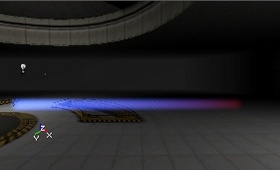If RelativeTime = 0.5, they will have Faded to red in the half of their LifeTime, and then get their original color back (first screen). If RelativeTime = 1.5, the particles will never get read (they die already at "1"), but you will see the fading process already (second screen)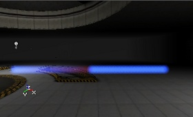 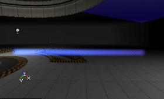You can also set more than one Color by adding more ColorScales. Then you can set as many Colors and RelativeTimes as there are ColorScales.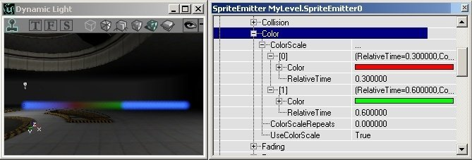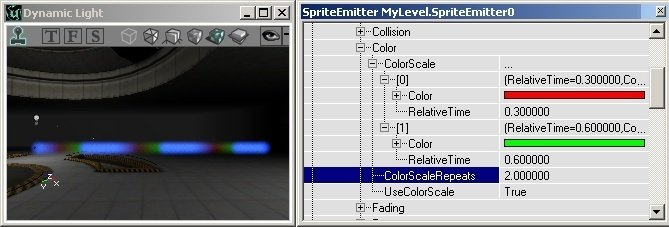If you want the particle to be red at the beginning of it's life already, set the RelativeTime of the red color to 0.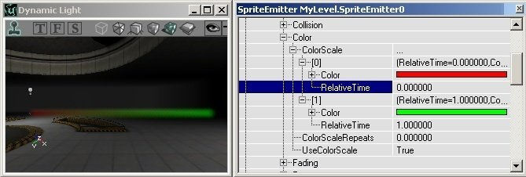Remark: the color the particle will get depends on the Color you entered in ColorScale, but also on the color of the texture from the particle itself. On a black particle, the ColorScale will not be visible at all, on a white texture it works at it's best. In the examples above, the texture was blue.

#### ColorScaleRepeats

This number indicates how many times to use the color scale over the life of the particle.
If you enter 1 there will be 2 ColorScales over the particle lifetime. In this image, the RelativeTime is also reduced so if RelativeTime is 1 and ColorScaleRepeats is 1, the particles will have become red in the half of their LifeTime AND at the end of their LifeTime.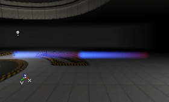

#### Opacity

This is a number that indicates how opaque or transparent your particle will be. It is scaled so that 1.0 = 100% opaque. If it is set to .5, then the particle will never appear more than half-opaque.

#### UseColorScale

This is a Boolean toggle that indicates whether or not to use the color scale features outlined above.

### Fading

With these fields you can make your particles fade in or fade out. You can also make only a few of the colorchannels to Fade, so for example the red and green parts of the texture will be invisible while the blue parts are always visible.

#### FadeIn

This enables fading in of particles. See below for the fields that control the fade in values.

#### FadeInEndTime

This is a number, given in seconds, that determines how long the particle will take to fade in, beginning from the moment it is spawned.On the screenshot, the particles have a LifeTime of 5 and a FadeInEndTime of 5, so they are 100% visible at the moment they die: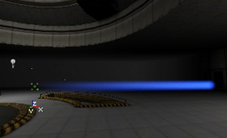

#### FadeInFactor

These values indicate the levels of fading that the ParticleEmitter will use.

* **W**: corresponds to the alpha value.
* **X**: corresponds to `Red'
* **Y**: corresponds to `Green'
* **Z**: corresponds to `Blue'

If the values are 1, they Fade normally. If you make for example X = 0, the red channel will get changed 0%, so while the other colors are invisible (this is at the start of a FadeIn, or the end of a FadeOut), the red will still be visible (left part of the first screen). Or when Y = 0, the green will still be visible (right part of the first screen). If X and Y are 0, both will be visible, it looks somewhat yellowish here (left part of the second screen). If X, Y and Z are 5, the whole texture will get super-invisible so it Fades out much faster (right part of the second screen). If X, Y and Z would all be 0, the texture wouldn't get invisible at all.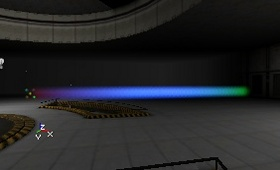 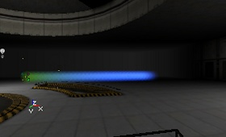

#### FadeOut

This enables fading out of particles. See below for the fields that control the fade out values.

#### FadeOutFactor

These values indicate the levels of fading that the ParticleEmitter will use.

* **W**: corresponds to the alpha value.
* **X**: corresponds to `Red'
* **Y**: corresponds to `Green'
* **Z**: corresponds to `Blue'

See [above](#fadeinfactor) for a complete description of these values.

#### FadeOutStartTime

The time the particles will start fading out. If this is 0 they will begin fading when they're born. They're completely Faded out at the moment they die. On the screenshot, FadeOutStartTime is 1. This value is not relative, it's in seconds.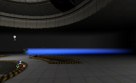

#### Fading in and fading out

If you use a FadeIn AND a FadeOut, the effect will look like the first screen if FadeInEndTime is smaller than FadeOutStartTime (here 1 and 4), and it'll look like the second screen if FadeInEndTime is larger than FadeOutStartTime (here 4 and 1)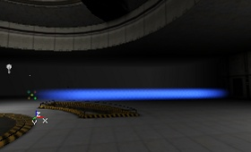 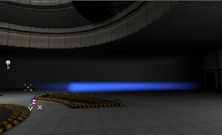

### Force

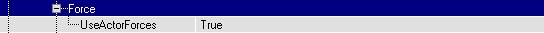With this, it's possible to make the particles get affected by other objects that are flying around. For example to shoot a projectile through smoke and have the smoke smoothly and realistically dissipate. To make this work, you have to set UseActorForces to True, and the projectile or whatever other object going through it must have Forces enabled. I tried this with a Flappy (an animal) running through some particles. So in the properties of the Flappy, the projectile or whatever else go to Force, and set ForceType to FT\_DragAlong. Also set a ForceScale (how big the Force is) and a ForceRadius (the radius of the Force).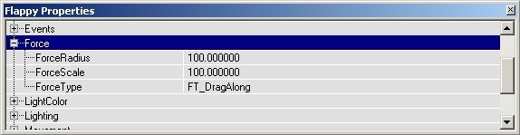If now the Flappy runs through the particles (because it fears my grenade launcher), some of them will fly away. Of course you can make this effect looking much better with nice smoke and projectiles.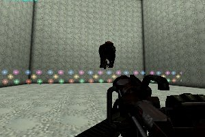 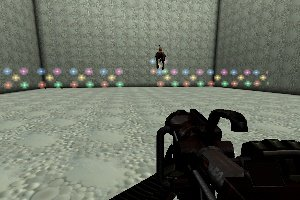

### General

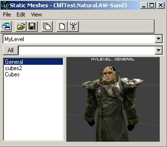

#### CoordinateSystem

The CoordinateSystem determines what the X, Y and Z values for the [Location](#location) of the particles mean. If you set the CoordinateSystem to PTCS\_Relative, the (X,Y,Z) = (0,0,0) position for the particles is the position of the Emitter actor in the editor, so the particles will get spawned there:But if you set the CoordinateSystem to PTCS\_Absolute, the CoordinateSystem of the world in the editor is used, and there the (0,0,0) [Location](#location) is the exact center of the world (there the lines of the grid are painted a little darker than the others in the 2D views). So the particles will start in the center of the map (where the thicker gridlines in the 2D view cut each other), no matter where the Emitter actor is: note the emitter actor on the right of the screenshot:The default CoordinateSystem PTCS\_Independent does the same as PTCS\_Relative, but after they are spawned the particles become independent and use the absolute coordinatesystem. The difference between PTCS\_Relative and PTCS\_Independent becomes very important when your ParticleEmitters are moving.All the three CoordinateSystems will rotate if you rotate the Emitter actor with the Rotation Tool. If you set in the properties of the Emitter actor in Advanced bDirectional to True, an arrow will be displayed in the editor to help you to rotate it better.In the section [Location](#location) is explained how you can make the particles spawn at another [Location](#location), again relative or absolute to the Emitter actor depending on the CoordinateSystem you use.

#### EffectAxis

With EffectAxis, you can rotate the CoordinateSystem that determinates the spawnlocation of the particles 90 degrees, at least if you base the Rotation on PTRS\_Normal.

#### MaxParticles

The MaxParticles setting sets the maximum number of particles that may be on screen for this ParticleEmitter. If the maximum number is reached, the oldest particle gets killed, so a new one can get spawned. For example, if you set this number to 4, there will be 4 particles on screen once the warmuptime is over. On the screenshot, the particles are moving to the left, and the most left one gets destroyed while a new one appears on the right:This setting is quite important, especially if you want to reduce the amount of particles on screen to get more performance. Another way to reduce the number of particles is by lowering their LifeTime. Note that if the max number of particles is reached before existing particles finish out their lifetimes, they will `pop' out of the world, which can be very distracting. Make good use of the [fade out](#fadeout) to avoid this.

#### ResetAfterChange

If ResetAfterChange is True, the ParticleEmitter will restart from zero again after every time you changed a property, but they do that already if this property is False too, so actually this property does almost nothing.

### Local

#### AutoDestroy, AutoReset

AutoDestroy and AutoReset should work here, but they work much better in Global instead.When AutoDestroy is true the ParticleEmitter? will simply be disabled when all particles are dead, unless AutoDestroy is set for the emitter (global). If AutoDestroy is set for the emitter (global) the emitter itself will be destroyed when all particles are dead.If AutoReset is set in the ParticleEmitter (not global) the particle emitter will be reset within the AutoResetTimeRange? after all particles have died.

#### AutoResetTimeRange

Sets the min and max time range before the ParticleEmitter will be reset.

#### Disabled

If this is True, the ParticleEmitter will be hidden. You can for example use it if you want to remember the settings of a ParticleEmitter, but you currently don't want it to work in the map. This is also useful when you have more than one ParticleEmitter in an Emitter, and you want to hide one of them to better focus on the remaining particle emitters.

#### DisableFogging

If True, the fogging on the particles will be disabled, so you can see them through the DistanceFog.

#### Name

You can enter a name to better identify a ParticleEmitter.

#### RespawnDeadParticles

If RespawnDeadParticles is True, the InitialParticles (read [Spawning](#spawning) for more details) get respawned over and over again, so there will be spawned more particles than you filled in ParticlesPerSecond. But if it is False, the InitialParticles will get spawned only once, and after that the ParticlesPerSecond is used. If ParticlesPerSecond is 0 then, there will be no more particles spawned after all the InitialParticles are spawned (this is, until MaxParticles is reached), so the emitter won't do anything anymore. It then can stay the way it is, or get Reset or Destroyed automatically if these settings are enabled in Global.

### Location

With these settings you can make the particles start somewhere other than at the Emitter itself. There are several options here, but many of them are ignored depending on other settings. Read on for more information.

#### AddLocationFromOtherEmitter

In AddLocationFromOtherEmitter, you can enter the number of another ParticleEmitter that is inside the same Emitter actor. If you leave it at -1, nothing will happen, but if you set it for example to 1, the particles will not be spawned where they normally should spawn, but at the [Location](#location) of one of the particles of ParticleEmitter[1]. They will not keep following that particle, they only get spawned there and get independent after that. You can for example make a trace of particles behind another moving particle. This is done in the DEMO-Particles example map:The blue sprites never move, but when they die they respawn at one of the bouncing balls, so together all the blue sprites form the shape of the traces the balls follow.

#### SphereRadiusRange

This field is only used if the [StartLocationShape](#startlocationshape) is set to `PTLS\_Sphere.'To give the particles a random StartLocation, you can use StartLocationRange or SphereRadiusRange. First you have to choose if you want this random StartLocation to be inside a sphere or a box: set StartLocationShape to PTLS\_Sphere for a sphere, or PTLS\_Box for a box.If you use PTLS\_Sphere, you have to set a minimum and maximum radius in SphereRadiusRange. The particles will then start somewhere between these 2 radii.

#### StartLocationOffset

The easiest setting is StartLocationOffset: here you can set exactly where in the coordinate system the particles have to start. If you leave it at X=Y=Z=0, the particles will always start in the origin of the coordinatesystem, for PTCS\_Independent or PTCS\_Relative this is the Emitter itself, and with PTCS\_Absolute this is the (0,0,0) position in the grid from the editor. For example if you set X=100, Y=100 and Z=100, the particles will start 100 units to the east, 100 units to the south and 100 units above the Emitter actor

#### StartLocationPolarRange

This field is only used if the [StartLocationShape](#startlocationshape) is set to `PTLS\_Polar.'This is pretty complicated. The X, Y, and Z variables in StartLocationPolarRange are mapped to theta, phi, and r respectively in the standard polar equation. Basically, this makes a hollowed partial-sphere with radius r. It will sweep longitudally theta degrees and latitdually phi degrees.

#### StartLocationRange

This field is only used if the [StartLocationShape](#startlocationshape) is set to `PTLS\_Box.'If you use PTLS\_Box, you can set 6 values to determinate the 6 sides of the box: X(Min), X(Max), Y(Min), Y(Max), Z(Min) and Z(Max). For example if you set X, Y and Z(Min) to -150 and X, Y and Z(Max) to +150, all the particles will start inside a 300\*300\*300 box.

#### StartLocationShape

This is the field where you may choose what starting shape you'd like for your Emitter. The choices are:

* PTLS\_Box
* PTLS\_Sphere
* PTLS\_Polar
* PTLS\_All

Note that PTLS\_Box and PTLS\_Sphere work in combination with [StartLocationOffset](#startlocationoffset), so the final StartLocation is the sum of those. Also note that you will never want to use the PTLS\_All option.More about the shapes and effects you can tweak with these settings is in the section Shapes.

### Mass

This setting does nothing at the moment. However, if the mass of a particle is 0 it won't be influenced by actor force.

### MeshSpawning

Mesh Spawning uses the vertices of a static mesh to calculate the spawn location, and optionally the velocity and the color of the particles in this emitter. The static mesh does not have to exist in the world, nor do the faces of the spawning static mesh matter. This means that you can make arbitrary shapes for static meshes in a modeling program to make a framework for particle spawning. You can also use existing static meshes in the world and attach effects to them to produce results like a bush on fire.

#### MeshNormal

This is the direction of the normals to use for spawning particles. This will only work is *Spawn Only In Normal Direction* is true.

#### MeshNormalThresholdRange

This is the threshold for the *Normal Direction*. This will only work if *Spawn Only In Normal Direction* is true.

#### MeshScaleRange

*Mesh Scale* is the scale of the *Static Mesh*. Given that this is a range, a random number in the range is chosen for every particles spawned.

#### MeshSpawning

| [Mesh Spawning Type](https://udn.epicgames.com/bin/publish/WebHome?webs=Main%2CTwo%2CThree%2CPowered&amp;inclusions=%2A&amp;exclusions=&amp;filter=&amp;inclfilter=%5C%25META%5C%3AFIELD%5C%7Bname%5C%3D%5C%22Documentavailability%5C%22.%2Avalue%5C%3D%5C%22General%20public%5C%22&amp;filterbymeta=yes&amp;skin=static_udn3&amp;restrictedclass=restricted&amp;format=&amp;sortcol=0;table=1;up=0#sorted_table "Sort by this column") | [Description](https://udn.epicgames.com/bin/publish/WebHome?webs=Main%2CTwo%2CThree%2CPowered&amp;inclusions=%2A&amp;exclusions=&amp;filter=&amp;inclfilter=%5C%25META%5C%3AFIELD%5C%7Bname%5C%3D%5C%22Documentavailability%5C%22.%2Avalue%5C%3D%5C%22General%20public%5C%22&amp;filterbymeta=yes&amp;skin=static_udn3&amp;restrictedclass=restricted&amp;format=&amp;sortcol=1;table=1;up=0#sorted_table "Sort by this column") |
| --- | --- |
| PTMS\_None | Off. The mesh spawning is not used at all. |
| PTMS\_Linear | The particles will be spawned on each subsequent vertex based on numbering of the vertices. |
| PTMS\_Random | The particles will spawned on a random vertex. |

#### MeshSpawningStaticMesh

This is the static to use for the mesh spawning. Select a mesh in the mesh browser and click "Use".

#### SpawnOnlyInDirectionOfNormal

(Note: Do not use with *Respawn Dead Particles* = true!)This will only use the normals within *Normal Direction Threshold* of *Normal Direction* to spawn particles.

#### UniformMeshScale

This will cause only the X component to be used to uniformly scale the mesh. With will prevent stretching and squashing and just change the size of the static mesh.

#### UniformVelocityScale

*Uniform Velocity Scale* will cause the only the X component of the *Velocity Scale* to be used to uniformly scale the velocity.

#### UseColorFromMesh

This uses the color of the each vertex to determine the color the particle being spawned.

#### VelocityFromMesh

This will use the normal of each vertex to determine the initial velocity of each particle. This is a Boolean toggle, which tells the engine whether or not to use the values in VelocityScaleRange, below.

#### VelocityScaleRange

This scales the velocity from the mesh normal. For example if you have a mesh sphere with outward facing normals, you can set the *Velocity Scale* to negative values and the particles will move inwards towards the center of the sphere.

### Object

This are the same Object settings as any normal actor has (the Emitter itself has it too), but this time it's for the ParticleEmitter. The Group settings are missing here, and you can't change any of the values, you can just check the Class and Name of the ParticleEmitter here.

### Performance

#### LowDetailFactor

In case of low detail settings the MaxParticles value will be multiplied with this value. So, when set to 0.5 only half the number of particles will be spawned when the engine runs in low detail mode.

### Rendering

#### AcceptsProjectors

This is a Boolean toggle that indicates whether projectors will affect the particles. Most of the time, you can leave this as `False.'

#### AlphaRef/AlphaTest

When checked, the video hardware will not write pixels that already has accumlated an alpha value of Alpha Ref.

#### ZTest

The the default and normal behavior for emitters is with this set to `True.' Otherwise, the emitter will draw on top almost everything. This may not draw on top of other emitters with z-test unchecked or other objects using an alpha channel.

#### ZWrite

This causes the particles to write to the Z-buffer. ("In a graphics card, this section of video memory keeps track of which onscreen elements can be viewed and which are hidden behind other objects." - CNET Glossary)

### Revolution

While `Rotation' rotates individual particles about their center, `Revolution'rotates particles about a fixed point in space. Using Revolution will cause the particles to change position.

#### UseRevolutionCenterOffsetRange

In general particles will revolve about the center of the particle system. This offset will allow you to change this so that particles rotate about a point other than the center of the particle system. Since this is a range, the value can be set exactly or to be random within min and max values.

#### RevolutionScale

This Revolution Scale is used as a multiplier for each of the axes of Revolutions Per Second range. Using Revolution Scale you increase or decrease the speed of revolution of particular axes over the lifetime of the particle. You can even reverse the direction of revolution by using negative numbers.

#### RevolutionScaleRepeats

Revolution Scale Repeats is the number of times the Revolution Scale will be additionally repeated. Setting this to 0 will cause the revolution scale to happen just once. Setting this to 1 will cause the revolution scale to happen twice, and so on.

#### RevolutionsPerSecondRange

This specifies the number of revolutions per second around the specified axes. Again, it's a range, so it can be a random number in between the set min/max bounds.

#### UseRevolution

This is a Boolean toggle to enable Revolution.

#### UseRevolutionScale

This is a Boolean toggle to enable the Revolution Scale.

### Rotation

These settings will allow your individual particles to spin during their lifetimes. Rotating particles is one of the biggest tools at your disposal for making particle systems that look convincing, as it helps to break up visual repetition a great deal. You'll be spending a lot of time with the following fields.

#### DampRotation

This is a Boolean toggle that tells Unreal whether or not to use the next field, RotationDampingFactorRange.

#### RotationDampingFactorRange

This lets you set the damping factor for the Spinning particles, which makes the particles Spin slower or faster every time they bounce. For example if you make the Z(Min) and Z(Max) values of the RotationDampingFactorRange `0,' the Spin will stop after the first bounce on the floor already (because the SpinsPerSecondRange gets multiplied by 0). Note on the screenshot all the textures have the same Rotation after the bounce:

#### RotationNormal

This value determines what the orientation of the particles will be if the UseRotationFrom field (see below) is set to PTRS\_Normal. You can enter the direction of a plane, and the X-Axis will be perpendicular on that plane.If you use PTRS\_Normal, you can also make the coordinatesystem for the StartLocation rotate 90� along the Pitch Rotation. The Velocity will remain the same, only the StartLocation you set in [Location](#location) will be rotated, and you can only see this if the StartLocation is not the Emitter itself. To do this, in [General](#general) set the EffectAxis to PTEA\_PositiveZ.

#### RotationOffset

Here you can set the amount that the coordinatesystem has to Pitch, Yaw and Roll. A value of 16384 means 90�, 32768 is 180�, etc.

#### SpinCCWorCW

This field has X, Y and Z values, but only the X value is actually used. If you set the X of SpinCCWorCW to 0, all the particles will rotate CounterClockWise. If you set it to 1, all the particles will rotate ClockWise. If you set it to something between 0 and 1, for example 0.7, there's 70% chance a particle will rotate ClockWise and 30% chance it'll rotate CounterClockWise. If SpinsPerSecondRange is 0.5 and SpinCCWorCW is 1, it'll look somewhat like the first animated gif. If you set SpinCCWorCW to 0.5, it'll do for example like on the second animated gif (on the second screenshot, some particles may suddenly switch fro CCW to CW, but that's because otherwise the gif would require TOO much frames. This never happens in the editor.) 

### Size

Here you can set your particle sizes. It's possible to set them in a fairly random manner, or to control the size more with SizeScale settings over the lifetime of the particle.

#### SizeScale

SizeScale allows you to set a size for your particles at a particular moment in their lifetime. To add a new SizeScale, click on the SizeScale field and `Add' one with the button. Two new fields will appear when you do this, RelativeSize and RelativeTime.

#### RelativeSize

This value will control what size a particle will appear at. The figure is given as a decimal value that corresponds to 1.0 = 100% of the size.

#### RelativeTime

This value tells Unreal what point in the particle lifetime to apply the RelativeSize at. Note that this is to given in a value from zero to one, representing 0-100% of the particle's lifetime.Below is an example of the RelativeSize and RelativeTime over two SizeScales.

#### SizeScaleRepeats

This will make your size cale repeat the number of times indicated. Pulsing effects can be easily achieved with this value, instead of using a large number of SizeScale points.

#### StartSizeRange

The StartSizeRange determines the size the particles will get when spawned. The default value is 100. The first screenshot shows X(Min) = X(Max) = 50; the second X(Min) = X(Max) = 150. If you enter a different X(Min) and X(Max) value, the particles will get a random size.

#### UniformSize

If Uniform Size is set to True, only the X is used for both U and V (or X, Y and Z for meshes). You may need this if you use a random Size and you want to preserve the aspect ratio of your particles.

#### UseRegularSizeScale

If you set UseSizeScale to True AND UseRegularSizeScale to True, the Particles will always shrink, and you don't have to add any SizeScales.If you want to use the SizeScales, you have to set UseRegularSizeScale to False.

#### UseSizeScale

This must be set to `True' to use the [SizeScale](#sizescale) field. Also, don't forget to set the UseRegularSizeScale to `False.' (see above)

### SkeletalMesh

The SkeletalMesh field allows you to attach particles to the bones of a skeletal mesh. The mesh is used to determine the spawn location of the particles and can also be used to determine the movement the particles. For a thorough explanation, see the [ParticleSystems](ParticleSystems.md#Skeletal_Mesh) document.

#### RelativeBoneIndexRange

RelativeBoneIndexRange is used to determine which bones are used to for spawning particles. For all bones set this range from 0.0 to 1.0. If you only want some bones, set it to a sub range between 0 and 1. Which bones you get is dependent on how the bones are indexed in your model.

#### SkeletalMeshActor

Which skeletal mesh actor will be used for particle spawning. In most cases this will be set in code. If you want to set this in the editor you will have type this in directly, using the [Object Name](#object).

#### SkeletalScale

This is used to set the scale of the spawning mesh, which is slightly different than the actual mesh of the SkeletalMeshActor. You can use this number to make the spawning mesh size intentionally larger or smaller. The value is given as 1.0 = 100%.

#### UseSkeletalLocationAs

* PTSU\_None : Off. Skeletal location is not used at all.
* PTSU\_SpawnOffset: The particles will spawn at bone locations but once the particle is spawned, it will not be affected by the mesh. This is good for particle trails - imagine a streamer, or a ribbon.
* PTSU\_Location : The particles will spawn at a bone location and will continue to be affected by the location of the bone but not the rotation. This is useful if you want to keep the particles tightly tied to the spawning mesh.

### Sound

#### CollisionSound

* PTSC\_None: No sounds on collisions.
* PTSC\_LinearGlobal: Plays through the sounds in a linear order when particles are spawned. Every time a particle is spawned, the next sound in the specified range of the sound (specified in [Spawning Sound Index](#spawningsoundindex)) is played.
* PTSC\_LinearLocal: This is like Linear Global except that the loop for each particles is reset at the end of it's lifetime. This mean that if the Sound Array contains the sounds "Boing!", "Bop!", and "Thud!", in that order, particles will always start with "Boing!". If a particle only collided with the world twice, the first time it collides in its next life, it will not play "Thud!", as it would in the case of Linear Global. Instead, it will start at "Boing!" again.
* PTSC\_Random: This will play a random sound from the sound array, in the range specified by [Spawning Sound Index](#spawningsoundindex).

#### CollisionSoundIndex

This indicates which sounds in the sound array to use. When you specify a sound range using CollisionSoundIndex, the Min and Max must be different numbers. If they are the same, Min=0 and Max=0 for example, all the sounds in the sound array will be used.

#### CollisionSoundProbability

CollisionSoundProbability is a range for the probability that a sound will play on collision.

#### Sounds

* **Pitch:** 1.0 is the default pitch.
* **Probability:** the chance that this sound will play if it is told to play. The sound will be told to play based on Spawning Sound Probability or Collision Sound Probability.
* **Radius:** The distance from the sound at which it will be audible. This is not given in Unreal units.
* **Sound:** To set a sound, select a sound in the sounds browser and click `Use.'
* **Volume:** This takes only values between 0.0 and 1.0. 1.0 is the standard volume and it can only be made quieter.
* **Weight:** This field is obsolete. Ignore it.

#### SpawningSound

This is identical to [CollisionSound](#collisionsound), only it is called when a particle is spawned, not when it collides.

#### SpawningSoundIndex

This indicates which sounds in the sound array to use. When you specify a sound range using SpawningSoundIndex, the Min and Max must be different numbers. If they are the same, Min=0 and Max=0 for example, all the sounds in the sound array will be used.

#### SpawningSoundProbability

SpawningSoundProbability is a range for the probability that a sound will play on particle birth.

### Spawning

#### AutomaticInitialSpawning

If AutomaticInitialSpawning is True, and ParticlesPerSecond = 0, the engine will create particles at a steady rate such that the number of particles onscreen is the same number as specified in [MaxParticles](#general), AND they can live exactly as long as you entered in [LifeTimeRange](#time).So, when LifeTimeRange is larger, fewer particles per second will be spawned. When MaxParticles is larger, there will be spawned more particles per second. Keep this interaction between the lifetime and MaxParticles in mind, it's very useful.

#### InitialParticlesPerSecond

InitialParticlesPerSecond is the number of particles per second that gets spawned during the warmup time. The warmup time ends when the [MaxParticles](#general) value is reached.

#### ParticlesPerSecond

If you set AutomaticInitialSpawning to False, you can enter the number of ParticlesPerSecond manually. After the [warmup](#warmup) period ends, the ParticlesPerSecond value gets used.For example, if MaxParticles = 20, InitialParticlesPerSecond = 100 and ParticlesPerSecond = 5, there will first be spawned 20 particles very quickly: in 1/5th of a second (because you had set it to 100 particles per second, and only 20 have to be spawned). Then, once the 20 particles are there, only 5 particles get spawned every second, but also the dead particles get respawned, unless you set RespawnDeadParticles to False in Local. In that case, at the beginning, it'll look like the first screenshot, but once the warmup is gone, it looks like the second screen. (the particles are moving from left to right). If ParticlesPerSecond = 0, all the InitialParticles will be respawned again after they die if the setting RespawnDeadParticles in [Local](#local) is `True.' If it's `False,' there will be no more particles spawned after all the InitialParticles are spawned (this is, until MaxParticles is reached), so the emitter will be effectively dead.

### Texture

A single texture can be subdivided into equally sized parts, vertically and horizontally. Many of the options in this section deal with managing this subdivision of textures. You can make the particles randomly pick one of the textures, or make one particle change from one Subdivision to another during it's LifeTime. Your texture will need to be created with this future subdivision in mind, of course. For example, this is a texture that can be divided into 3 \* 3 = 9 subdivisions:

#### BlendBetweenSubdivisions

This setting will turn on smooth transitions between the texture divisions, much like a crossfade.

#### DrawStyle

Using the DrawStyle property you can change the way the texture is drawn in the map. The DrawStyle for Particles is somewhat the same as the DrawStyle you find under Display of normal actors, but has some added options, and some others removed.For the example screenshots, the blue texture does not have an alphachannel. The second multicolored texture has an alphachannel that has 16 dark dots, like this:PTDS\_Regular makes the texture opaque, so it's a non-transparent square.  PTDS\_AlphaBlend makes the darker parts of the A-channel of the RGBA texture more transparent than the bright parts. Black becomes 100% transparent (invisible) and white becomes 100% opaque. Grey becomes semi-transparent. This effect is not very visible on bright textures. PTDS\_Modulated makes the texture some sort of inverse translucent: it makes the brightest colors of the texture more transparent than the darkest colors, so black becomes opaque, white becomes 100% transparent (invisible). Grey, red, blue, etc... become semi-transparent. PTDS\_Translucent makes the darkest colors of the texture more transparent than the brightest colors, so white become opaque, while black become 100% transparent (invisible). Grey, red, blue, etc... become semi-transparent. PTDS\_AlphaModulate makes the actual RGB texture brighter on places where the alphachannel is darker. It looks somewhat the opposite of AlphaBlend. This effect isn't good to see on very bright textures. PTDS\_Darken makes the colors of the texture negative and translucent. PTDS\_Brighten makes the texture to brighten the background, so the texture becomes translucent and brighter than it's original version. As you can see, the alphachannel of an RGBA8 texture is only used for the DrawStyles AlphaBlend and AlphaModulate.

#### SubdivisionEnd, SubdividionStart

You'll set how many subdivisions you want in a texture in a later field. For now though, we'll use an example of a texture that we want to split into nine subdivisions.Use the SubdivisionEnd and SubdivisionStart values if you want only a few Subdivisions of the texture to be used. Subdivision 0 is the Subdivision in the upper left corner of the texture, Subdivision 1 the one below that, and the last one is in the lower right corner of the texture. This picture shows the numbering:

#### SubdivisionScale

Subdivisions are very useful, in that you can change from one `image' in your particle systems to another, while staying within the same actual texture. Normally, each subdivision will exist for the same amount of time before transitioning to another.If you want to make some of your subdivisions last longer than others, you can use the SubDivisionScale feature. We'll use the above image as an example.First select SubDivisionScale in the properties and press the add button there 3 times, so there are 3 SubDivisionScales. This will make 4 of the 9 Subdivisions be active. If you want the 9 Subdivisions to be used, you have to make 8 SubDivisionScales. If you make less than 8 SubDivisionScales, the last Subdivisions will never appear. There's also nothing fatally wrong with making too many SubDivisionScales, the extra ones will just be ignored. The SubDivisionScale looks pretty straightforward: it's a single number that is relative to the LifeTime of the particles, so a SubDivisionScale of 1.0 will last for the entire particle LifeTime.Each SubDivisionScale represents a certain point in the LifeTime of the particle. For example if the LifeTimeRange is 4 seconds, a SubDivisionScale of 0.25 is the end of the first second of the LifeTime. A successive SubDivisionScale should always be larger than the previous one, otherwise you're going back in time and it will be ignored.For example, if you make Subdivision [0] = 0.1, [1] = 0.3 and [2] = 0.6, and LifeTimeRange is 4 seconds:

* the particle will have Subdivision 1 for 0.4 seconds
* Subdivision 2 will last for 0.8 seconds (0.3 x 4 = 1.2, 1.2 - 0.4  = 0.8)
* Subdivision 3 will last for 1.2 seconds (0.6 x 4 = 2.4, 2.4 - 1.2 <Subdivision 2 lifetime. = 1.2)
* Subdivision 4 for the remaining 1.6 seconds. On the screenshot, the particles move from left to right.

If you make SubDivisionScale [0] = 0.4 and [1] = 1, only two of the Subdivisions will be used. Then it doesn't matter anymore what value you entered in [2].To get this effect at it's best, you have to use the correct LifeTimeRange and also make sure the MaxParticles value is high enough. Read sections General and Time for this.

#### Texture

This is the field where you pick what texture you'd like to use for your particle system. This is one of the most important fields in the entire emitter properties, so remember where it is. To set it, simply select a texture from the texture browser and hit the `Use' button in this field.

#### TextureUSubdivisions

This field tells the engine how many vertical sections you want your texture split into.

#### TextureVSubdivisions

This field tells the engine how many horizontal sections you want your texture split into.Setting these settings to 0 or 1 does exactly the same thing: it divides the texture into 1 Subdivision, meaning there are no Subdivisions at all (the Subdivision is the texture itself), so the particles will look like this:If you set both TextureUSubdivisions and TextureVSubdivisions to 3, it looks like this:If you set them to 2 or 4, some pictures of this texture will be cut into half, because it has 3 \* 3 Subdivisions and isn't made for other values. If you set respectively TextureUSubdivisions=1 and TextureVSubdivisions=3 or TextureUSubdivisions=3 and TextureVSubdivisions=1, it'll look like this: 

#### UseRandomSubdivisions

If you set UseRandomSubdivision to True, the ParticleEmitter will give each particle a random Subdivision at the beginning, and the particle keeps this Subdivision as long as it lives.If you set UseRandomSubdivision to False, the particles will change during their LifeTime. For example if you'd have 2 \* 2 Subdivisions, then first they'll have the upper left Subdivision, then the bottom left, then the upper right and finally the bottom right. The time it takes to change from one Subdivision to another, depends on their LifeTime, more about this further in the section Time. On the screenshot, there are 9 Subdivisions.

#### UseSubdivisionScale

You must set UseSubDivisionScale to True, otherwise the engine will not use the SubDivisionScales.

### Tick

Some fairly obscure but important fields live in here.

#### MinSquaredVelocity

MinSquaredVelocity: the minimum velocity a particle may have before it gets inactive. This is important if you use [Collision](#collision): the particles will then get less velocity every time they bounce on the wall.

#### SecondsBeforeInactive

When this is 0.000000, the movements of the particles are always calculated by the computer, even if they're out of view. If you enter a value in here, the computer will stop calculating the movements of the particles after the Emitter actor is out of view for this many seconds. This way you gain performance. So when you look away from the Emitter, the particles will freeze, and only come back to life when you look at them again. So when SecondsBeforeInactive = 0.010000 and you see this:and then rotate the camera 180�, wait an hour and then look again at the Emitter, you'll still see exactly the same image (where the warmup is not finished yet). When you can't see the Emitter actor, but you should be able to see some particles, you'll not see these particles! Only when you can see the Emitter itself, you'll be able to see its particles. If you'd rather have it calculate particle movement offscreen, set SecondsBeforeInactive to 0.000000.

### Time

#### InitialDelayRange

The InitialDelayRange is the time it takes before the emitter starts his job. For example, if you enter a InitialDelayRange of 5, when you start the map or the emitter gets reset, it'll do nothing for 5 seconds before it starts emitting.

#### InitialTimeRange

The InitialTimeRange lets the particles be several seconds old already when they get spawned. So if LifeTimeRange is 4 and InitialTimeRange is 3, the particle will already be 3 seconds old when spawned and live for only one second. This setting can be interesting when you use scales: the SubDivisionScale, ColorScale and SizeScale will also be calculated as if they're 3 seconds old already. (read more about these in the sections [Subdivisions](#subdivisions), [Color](#color) and [Size](#size))

#### LifetimeRange

The LifeTimeRange is the number of seconds the particle will live. After this time, the particles get destroyed (and will respawn if RespawnDeadParticles is true).

### Trigger

Triggering allows you to change the behavior of an emitter when it is triggered. You can trigger an emitter just like everything else in Unrealed by setting the Tag of the Particle System to be that of an Event of a trigger. It is important to note that the Tag is not specified per emitter but for the entire particle system. Each emitter can configure how it handles the trigger differently but they will all receive the same trigger event at the same time.
Triggers are use mainly to turn emitters on and off in different ways. This trigger system provides good ways to turn emitters on but it unfortunately does not provide a very smooth way to turn emitters off.

#### ResetOnTrigger

This will reset the emitter. The emitter will start over with all its initial values.

#### SpawnOnTriggerPPS

This is the number of particles that will be spawned when the emitter is triggered. This setting depends on ParticlesPerSecond and also the MaxParticles number in General. The particles whose number you specify here will spawn at rate described in ParticlesPerSecond and will not exceed MaxParticles.

#### SpawnOnTriggerRange

This is the number of particles that will be spawned when the emitter is triggered. This setting depends on ParticlesPerSecond (described below) and also MaxParticles in General. The particles whose number you specify here will spawn at rate described in Particles per Second and will not exceed MaxParticles.

#### TriggerDisabled

This will toggle the disabledness of the emitter. If the emitter is currently disabled, triggering it will turn it back on. If the emitter is not disabled, triggering it will disable it. When an emitter is toggled, all the particles will either disappear or appear instantly.

### Velocity

#### AddVelocityFromOtherEmitter

AddVelocityFromOtherEmitter gives the particles the same Velocity as a random particle coming from another ParticleEmitter inside the same Emitter actor.

#### AddVelocityMultiplierRange

If AddVelocityFromOtherEmitter is not set to `None' then the particle's velocity will be multiplied by this value. For example, if you want the particles from this emitter to have twice the velocity of the particles from the `Other,' referenced emitter you could set all the values in this tool equal to 2.0. Because this value is a range, you can, of course, set a range of values, which will return a random value for a velocity multiplier within that range.

#### GetVelocityDirectionFrom

* PTVD\_None: This is the default, and works as described above.
* PTVD\_StartPositionAndOwner: the particles will go in the direction determined by the start position of the particle, and the Emitter Actor, and it moves away from the Emitter.
* PTVD\_OwnerAndStartPosition: this is similar to above, but now the particle will move from its startposition towards the Emitter Actor. When it has reached that, it will keep going further. This only works if its startposition is not the Emitter itself. See the [Location](#location) section for more information on offsetting the start position.
* PTVD\_AddRadial: This setting will add a `pinching' effect to your emitter, as particles that don't spawn directly on the emitter will travel towards it. Note that this setting won't look as if anything is happening unless your particles spawn offset? from the emitter with random ranges (so that the movement can be seen).

In the above image, you can see the effect of the AddRadial setting. The left picture has no movement (PTVD\_None) applied to a spherically-offset emitter. The right picture has the radial (PTVD\_AddRadial) setting selected, and the particles move towards the center.

#### MaxAbsVelocity

If your particles are set to accelerate, they will speed up until they reach the velocity set in this field. They will remain at this constant speed until the end of their lifetime. Always give MaxAbsVelocity a positive value, even if the Acceleration is negative. If you give it a negative value, the particles might act strangely, for example trying to be at two places at the same time.

#### StartVelocityRadialRange

This allows you to change the amount of radial movement applied to your particles. This is only useful when your GetVelocityDirectionFrom is set to PTVD\_AddRadial.In this image, there is a particle system with movement along the Z-axis. The first image shows the particles going straight up. The second image shows the same particle system with the AddRadial applied. The third image shows the AddRadial applied, with a higher overall value on the RadialRange. This causes the particles to reach the center and continue past, in the direction they were headed, until their lifetime ends.

#### StartVelocityRange

Use Start Velocity to give the particles a constant speed. The X, Y and Z values will adjust how fast the particles travel in that direction.If Min and Max are the same, you get what you would expect: the particle moves with the speed you entered to the direction you used. If the values are not the same, you'll get a random velocity between those two values. For example, if you set X-Min equal to X-Max and Y-Min equal to Y-Max and Z-Min equal to Z-Man (and make sure there is no acceleration), all the particles will move towards the same direction:Note that velocity can be **negative**, which will make the particles travel in opposite directions, not just faster or slower. We'll set X(Min) to -500 and X(Max) to +500 (and keep the Y values), so that the particles will spread randomly in the X direction:If you'd have made X(Min) = -150 and X(Max) = +150, there'd be less difference in the directions:

##### Velocity and Acceleration Interactions

If you use Velocity AND Acceleration, the total speed of the particle will be the sum of the constant Velocity and the variable speed caused by the Acceleration. This sum is called the AbsVelocity.If there is a Velocity and a Acceleration along the same axis, but they have opposite (positive/negative) signs, the particle will first move in one direction, but at a certain point the absolute value of the speed caused but the Acceleration will be larger than the absolute value of the Velocity, so the particles will move back to the direction they came from. Put more simply, imagine shooting a cannonball straight up into the air. The high velocity will eventually be counteracted by a negative acceleration, and the ball will fall back to the earth.If you use a Velocity and an Acceleration, both along different axes, the particles will make a parabola. A parabola is the realistic trajectory that a bullet or a thrown object will follow. For example if Acceleration has Z = -950 (close to the gravity on Earth), and StartVelocityRange has X(Min) = X(Max) = + 500, it'll look like this:If you now set also the X of Acceleration to -1000, it'll do the following:If you use this, the Acceleration will keep speeding up the particle until the MaxAbsVelocity speed is reached.

#### UseVelocityScale

This is a Boolean toggle that will turn on the use of VelocityScale (see sbelow).

#### VelocityLossRange

The VelocityLossRange setting hinders the particle from moving along the axis you chose. If it's larger than 100, the particles suddenly get shot away at very high speed. Again, you can use a Min and Max value if you want the VelocityLossRange to be something random between the Min and Max value.

#### VelocityScale

VelocityScale allows you to scale the velocity of particles over the course of their lifetime. This can allow you to do things such as stop moving particles and then start them again. It can also allow you change the direction of particles by setting the X scale to 0.0 and the Y scale to 1.0 for one entry and then setting the X scale to 1.0 and the Y scale to 0.0 for another entry.

##### RelativeVelocity

A multiplier for the current velocity of the particle.

##### RelativeTime

The time at which RelativeVelocity will be applied.

#### VelocityScaleRepeats

VelocityScaleRepeats is the number of times the Velocity Scale will be additional repeated. Setting this to 0 will cause the velocity scale to happen just once. Setting this to 1 will cause the velocity scale to happen twice, and so on.

### Warmup

The warmup is the part of the emitter lifetime when not all the particles have yet spawned.You can force the engine to precalculate your Emitters, so that when you start the map it's as if the ParticleEmitter has been there already for a few seconds, and the warmup effect will be skipped. Note that you may actually want warmup in certain particle sytems so don't

#### RelativeWarmupTime

With the setting RelativeWarmupTime you can set how many seconds have to be precalculated, relative to the LifeTime of the particles. This means if you set it to 1, there are exactly as much precalculated seconds as the first particles will live.

#### WarmupTicksPerSecond

Before the engine will use RelativeWarmupTime correctly, you also have to set the WarmupTicksPerSecond: this is how many ticks each second of the RelativeWarmupTime has. The higher the WarmupTicksPerSecond, the more of the particle system the engine will precalculate.So basically, the longer the warmup of a certain ParticleEmitter, the higher you have to make the WarmupTicksPerSecond setting (and set RelativeWarmupTime to 1) if you want there to be no visible warmup.

## Emitter Flowchart

Making particle systems is pretty complicated - especially with the property-based system of emitter editing. Consider using the particle system editor (in the UDN builds, and from build 3323), it's much more logically laid out.Here is a flowchart that may help in thinking about how you want to design your future particle systems. (items in parentheses indicate what section relevant fields can be found in.)

## Final Notes

* SpriteEmitters, BeamEmitters and SparkEmitters also work with animated or procedural textures
* If you place the Emitter Actor inside a solid brush, the emitter might not work. If this happens, but you want the StartLocation to be inside the brush, you can use the GlobalOffsetRange.
* The 4 ParticleEmitter classes are in the Actor Class Browser, in Object --> ParticleEmitter (after you turned off "Actor classes only")
* If you type "stat particle" in the console, you see the particle stats. pclrender and pcltick have to do with the rendering time for the particles, pcls is the total number of particles in the map and emitters is the number of emitters in the map.
* Thanks to Daniel Vogel (and any other people who worked on it) for making such a great particle system :)
* There's another [Emitter tutorial](EmittersExamples.md) with example maps and a description on how they were made.

