# Example Particle Systems

*Document Summary: A guide to creating some example Emitters using the new Particle System Editor available in the UDN Build.**Document Changelog: Last updated by Jason Lentz (DemiurgeStudios?), to update map to the 2226 build. Original authors were Chris Linder, Tom Lin, and Albert Reed (DemiurgeStudios?).*

## Unsupported Disclaimer

The code described in this document is provided to you as a service of UDN or other licensees. It is not supported by Epic.

* [Example Particle Systems](#example-particle-systems)
  + [Unsupported Disclaimer](#unsupported-disclaimer)
  + [Introduction](#introduction)
  + [Emitter Examples](#emitter-examples)
    - [Spell Ring](#spell-ring)
    - [Bubbles](#bubbles)
    - [Dirt Explosion](#dirt-explosion)
    - [Arc Welding](#arc-welding)
    - [Impact Explosion](#impact-explosion)
      * [The Making of an Explosion](#the-making-of-an-explosion)
      * [Explosion Emitter](#explosion-emitter)
      * [Sparks Emitter](#sparks-emitter)
      * [Overall](#overall)
    - [Muzzle Flash](#muzzle-flash)
      * [Initial Concerns](#initial-concerns)
      * [Flash Emitters (first three emitters)](#flash-emitters-first-three-emitters))
      * [Smoke Emitter](#smoke-emitter)
      * [Overall](#overall)
    - [SpotLights](#spotlights)
    - [Breaking Glass](#breaking-glass)
    - [Spooky Hell's Lightning](#spooky-hells-lightning)
      * [Global Offset / Reset](#global-offset-reset)
      * [Beam](#beam)
      * [Source Mark](#source-mark)
      * [Cloud Light Effect](#cloud-light-effect)
    - [Ground Fog](#ground-fog)
    - [Waterfall](#waterfall)
      * [The Falls](#the-falls)
      * [Waterfall Base Splash](#waterfall-base-splash)
      * [Misty Fog](#misty-fog)
  + [Downloads](#downloads)

## Introduction

Several people have asked for good examples of particle systems to get them started. Using the [Particle System Editor](ParticleSystems.md) available in the [UDNBuild](https://udn.epicgames.com/Two/UDNBuildFeatures), we've assembled a small library of production-quality particle systems which you can use as a starting point in your own projects. In addition to having a texture pack, mesh pack and source-files many of these examples have a detailed "how we did it" [explanation](#emitterexamples). If this turns out to be popular, we might make some more, so send along requests to [al@demiurgestudios.com](mailto:al@demiurgestudios.com) if you have them.

## Emitter Examples

All of these examples are available for [download](#examplesdownload).

### Spell Ring

*By Tom Lin*


Perhaps the most exciting thing about the particle effects in UT is that they can be a wide range of things that don't really fit the classic idea of particles. A good example of this is the spell ring shown here.The spell ring is made up of three emitters. Most of the work for this system was actually done in an image editing program. First, I made the two image maps that are used on the ground plane in Photoshop. This is what one of the rings looks like by itself:

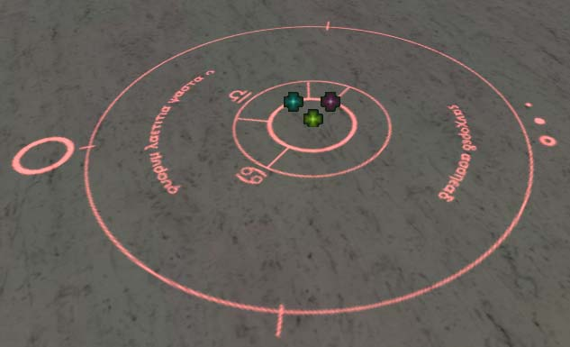

The outer ring is made up of just one particle with a long lifespan. There aren't many options in the editor that need to be looked at here. Size stays constant, there is no movement, etc. Rotation is important, however. The `spin particles' box must be checked for any rotations, that's the first step. Spins per second is set very low, below 0.01 is enough for this ring. Also important to note is the spin CCW or CW slider - this determines the percentage of the time it will spin in a direction - meaning, if it's at 75% it will spin clockwise 75% of the time and counter-clockwise 25%. For this ring, I set it at 0%. Finally, the `specified normal' is the set option for the facing direction, with Z set to 1.0.The second ring has basically the same settings as the first, save for the spin direction. The inner ring is set to 100% clockwise, so that the rings will always spin against each other. I sized the rings appropriately in Photoshop, so that when imported into the editor they already fit nicely into each other when size is set to default.The last part of the system is simply a radial gradient texture that moves upwards and fades out over time.For added visual interest, the second ring was replicated several times and set to spawn at intervals. Finally, a color scale was applied to both rings to change them red over time.

### Bubbles

*By Tom Lin*

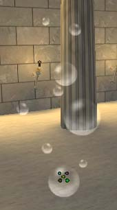

Bubbles are fairly easy to create with particle systems. In thinking about bubbles, I attempted to recreate the Final Fantasy style `poisoned' indicator, a constant stream of bubbles that are generated by the afflicted character. These can easily be modified to simulate soap bubbles, the stream of bubbles that might escape from a respirator underwater, swamp gas, etc.I initially started with just one sprite emitter, and used a texture with multiple bubbles arranged haphazardly across the surface. It was soon clear that this was a poor solution for this particle, however - when the bubbles `popped,' a large group would disappear at once. Because of this, limit your texture to a single bubble per map, and adjust the number of particles to suit.First I started with one large bubble. I kept the max number of particles low, so as to prevent obvious patterns. I used translucent draw style, but kept the opacity at 100%. A small fade in-time helps eliminate the initial drawing in, but there is no fade-out time so as to get that sudden disappearance of the bubble popping. More on the pop later.Make sure to vary the size of the bubble, as well as the motion. Changing the start location is optional, depending on what your intended use. Obviously, blowing bubbles from a bubble wand will have a much more localized starting area than, say, a bubble bath.With the first bubble out of the way, it's a simple matter to add a few more emitters for variety. More emitters lead to better control over your bubbles, but there is a minor performance hit that you should be aware of.Ok, back to the popping. If you're feeling ambitious, pay attention. Having the bubbles just disappear when they pop can serve, but it's possible to add a little bit of character to your popping bubbles by using Subdivisions (under the texture area). For my bubble I have two parts to the texture, the full bubble and a popping bubble. I set the number of U divisions to 2, and V divisions to 1.


This breaks the texture into 2 subdivisions, a left and a right side. By checking the `use subdivision scale' button, I can control how long the left half of the texture shows before changing to the right half. In this case, I set it at .98 (98% of the lifetime will be on the left half). I left the `Blend between subdivisions' box unchecked - I want a very quick jump from one half of the texture to the other, not a fade between the two.

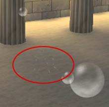

### Dirt Explosion

*By Tom Lin*

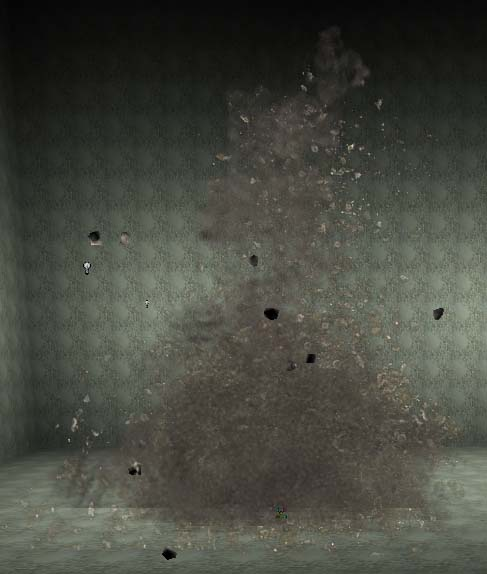

This is a pretty straightforward particle concept: grenades over ground, things go boom. More specifically, I wanted to simulate open ground (rocks and dirt) and add some visual interest to the system with mesh emitters. There are lots of parts to this system, but there's very little in the way of complexity. This particle system has a total of 105 particles in it. This isn't a huge amount, but having more than one or two of these happening at one time might not be such a great idea. In making these larger systems, always keep in mind how many will be in use at once, to avoid slowing down the engine.We'll take this system one step at a time. First of all, the general shape that I was aiming for was primarily a column, with a wider base that might tend to give the system more of a rough conical shape if viewed from further away. The central column would simulate the initial blast of dirt up into the air, and the wider base would take care of both initial particles that get thrown out more to the side, as well as the dispersing particles in the post-explosion sytsem lifetime. I also wanted bigger chunks of rock thrown outwards in all directions from the blast.The central columnar shape is made up two sprite emitters. The first is a simple rock texture, the second a simple smoke texture. The rock texture was kept small. Since it will be thrown in the air and bounces with collision a bit after it comes back down, it is important that the planar nature of the texture isn't too apparent. Both of these emitters are pretty standard in almost all respects - add rotation, scale, location and speed variance on them to break up any visual repetition. The only fields worth mentioning are the movement values. To get the particles to move outwards in a circle, link the X and Y start velocities, reflected. Note that the Z max start velocity is obscenely high, as is the Z negative acceleration. This is to get the rock and dirt particles to look like they're being thrown up in the air very quickly, and then falling back down.

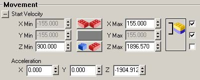

The lower, wider spread of debris is similar to the column. Again, it's made up of a rock texture and a smoke texture. The rock texture is slightly more substantial, since not being thrown into the air as high, the particles of thrown rock will be bigger and clumped together more. The smoke texture is the same as that used in the column. Again, the standard modifiers apply. This rock texture has gravity, but doesn't have collision on it. The smoke increases in scale as it nears the end of its lifetime, so simulate dispersion. To mimic a dust cloud, there is no gravity applied to it.The interesting part of this system is the mesh emitter. First I made a small, low-poly rock mesh in 3D Studio and textured it. Make sure to get that rock texture into a texture pack somewhere, or else the editor will substitute a base texture onto it. I set the motion's start velocity in a manner similar to the columnar particles - link X and Y, and reflect those values. Under the `size' tab, I have a fairly wide range of min and max values, so as to get a nice spread of rock shapes and sizes. Finally, just a little touch of trickiness: making the rocks fade out instead of pop out unnaturally. First, in the `mesh' tab, I checked the `use particle color' box. Now, back in the `color/fading' tab, I set the fading to an appropriate value. I let the rocks sit on the ground for a bit before fading them out. One last thing - make sure collisions are on. That is why you have these sexy meshes instead of textures, after all, right?

### Arc Welding

*By Tom Lin*


Arc welding is a good particle system to experiment with a combination of sprite and spark emitters.Beginning with the central sprite, I simulated the rapid flickering of the main arc light with several fields scattered throughout the editor. Under the `general' tab I have the number of particles set relatively low, to introduce more flickering effect. The particles per second is set high, while under the `time' tab the lifetime of the particles is set very low. This results in constant spawning and death of the particles, many times per second. To avoid overt repetition, the lifetime, size and location of the particles were given a range.Next, the smoke/fog effects were created with 2 different sprite emitters. One has a simple movement and fade on it, and little else. The other is more complex. To simulate light flashes on the generated smoke from the welding process, I used a subdivision scale on the smoke texture map. It has 2 U and 2 V subdivisions, and blends equally between all four. The lifetime of the particle is set high, 9 seconds or so. I use 2 particles, set to spawn close together in time. Here's where it gets tricky. Under the `texture' tab make sure draw style is set to translucent. In the color scale (under the `color/fading' tab) I have eleven color points, mostly white sandwiched in between black, with a black bar on the two ends. The color scale repeat is also set very high. This changes the transparency of the emitter from fully transparent to fully visible and back very quickly, simulating a flickering light. Both emitters have a high warmup time and warmup ticks per second, to make them start immediately.

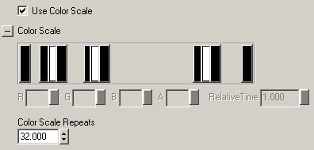

Now, onto the sparks. I set the number reasonably high, 40 particles or so. The texture for the particles isn't a huge factor - since they're single pixel-wide lines, the most important thing is to make sure they don't have transparent bits on them, unless that's what you want, of course. I set it to completely white, and added in a color scale to them for color changes over time.Movement is the first really important section for spark emitters. Since I was making a welding environment, I wanted the sparks to be generated in all directions. To get this effect, just link up the X and Y values under start velocity, and reflect them. Then, whatever value you put in the field will be reflected appropriately. (For example, X min -122, X max 122, Y min -122, Y max 122) To get the sparks to be thrown up into the air (instead of down, and clipping into the weld surface) I have the X min and max always set positive. The min is set to 55 and the max much higher, about 440, to get a nice range of upward motion on the different particles. Finally, to make the particles curve downwards, there is a heavy negative Z acceleration.

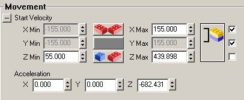

Time is an important section for sparks, in a common sense way. My particles don't last that long, but have a decent range in lifetime. This tends to make more sparks cluster about the middle, since they are generated upwards, but many die before they are pulled back down by the acceleration. Then, more particles spawn to take their place.Finally, the Spark tab itself. Line segment range doesn't do a whole lot - UDN previously recommended 5 as a good number. Mine is at 3, but there's not a lot of difference. Time between segments is the important one - the lower the number, the smoother your lines will be. You want this number LOW. Try values until you get the desired effect. I have it set very, very low - below 0.05 in this field.

### Impact Explosion

*By Chris Linder*

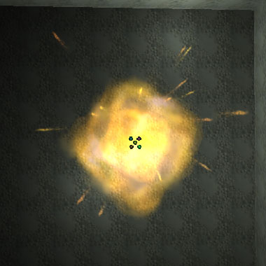

#### The Making of an Explosion

I set out to make a simple impact explosion that used only about 20 particles and not too much texture memory. This sort of explosion could be used for things ranging from a rocket explosion to the clashing of swords. The main drawback of this particle system is that the main explosion is only a few billboarded sprites so if the explosion is near a wall clipping can be seen (see image below). This problem could be solved by building the main explosion out of many smaller sprites and using particle collision to deal with the walls. This however would be a greater load on the system.

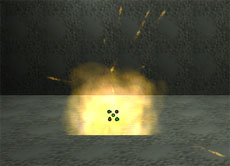

#### Explosion Emitter

There are two sprite emitters in this particle system, one for the explosion and one for the sparks. The first emitter, the explosion emitter, is fairly simple with a few complex tweaks to make it just right. All the particles start in the default location at the center and don't move. There are only three particles and they are all spawned at nearly the same time. The particles are spawned at the same time by turning off automatic initial spawning and setting particles per second to be 100. I also turned off respawn dead particles so that the explosion would not keep repeating. The lifetime of the particles is also very short (0.64 seconds) so as to capture the brief nature of explosions.The "motion" of the explosion is handled with adjusting the size particles. Four size scale points create a smooth non-linear motion for the expansion of the explosion. In the first 1/20 of a second the particle quadruples in size; from then until the end of the life it only doubles in size. With only three size scale points the motion looked very jerky because the very fast expand transitioned directly into the smooth gradual expand. By adding a scale point after the first expand, the transition looked gentler. I also used a size range as opposed to a fixed size because that seemed to capture the nature of an explosion better.Rotation and subdivision fading also greatly helped the feel of movement in the particle system. The particles start with a random starting rotation and have a mild spin. The spins per second range from 0.05 to 0.1 with a 50% chance of spinning in either direction. I found this method works much better than having the spin range from -0.1 to 0.1 because it ensures that all particles are spinning at least at 0.05. As the particles overlap with this mild rotation it gives the impression of motion within the explosion. Subdivision fading helps with the decay at the end of the explosion. The particle system looks okay without it and if one were really pressed for texture memory it could be removed but everything looks much better with the subdivision fading. The two images look fairly similar but one is more decayed looking and a bit darker.

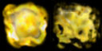

I use the subdivision scale to make the emitter fade to the second image at the end of the lifetime as opposed to the middle. There was one problem where I needed to add a third subdivision scale to make the first two work. The third value did not need to have any particular value but if it was 0.000 the value was not saved on export or cut and paste so I set it to 0.001.Colorscale and fading are essential to the look of the particle system. I used fade in but not fade out because I used the color scale to fade the emitter out. The important difference between fading and color scale is that fading works on absolute times and color scale works on relative times. In this case I used the same min and max for lifetime but if one were to use different values this would ensure that all the particles fading in at the same time and the same rate but would fade out at their own rate. I also find that color scale seems to yield more consistent smooth results than fading. The color scale used for the explosion is the result of trail and error adjusting when I thought the system was too bright or too dark at different points in time. I also used a color multiplier with a small range to give the explosion of bit of variety and more "depth" by having slightly different colors on the same texture.

#### Sparks Emitter

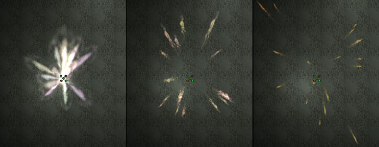

The sparks emitter is slightly more complicated. First off, it is important to note that it is not a Spark-Emitter but a Sprite-Emitter. It relies mainly on velocity, acceleration, and particle facing direction to achieve its look. The motion of the particle is simple but the emitter adjusts many other things at the same to work well with this motion.There are 17 particles in this emitter and like the explosion automatic initial spawning is turned off and the particles per second is turned very high. The respawning of dead particles is also disabled. The lifetime of the particles is very short for obvious reasons. One of the most important things about this particle system is that collision is enabled. The damping factors are all left at the defaults so it is not complicated but helps the look greatly.The velocity of the particles is set to have a wide spread between the mins and maxes so the particles start heading in all directions. The values are symmetric about 0 for X and Y so the system does not "lean" in one particular direction. The Z values are not symmetric to account for the downward acceleration of gravity. If the values were symmetric, the system would look as it were moving down too much even though it might be more "accurate". Acceleration has a large -Z value which mimics gravity. This value is not set to correspond to Unreal's world gravity; it is just adjusted to look right. To make the particles of this emitter look like sparks as opposed to chunks of flying debris the facing direction is set to along movement direction facing camera. This means that the particle rotates so that the "up" of the texture is always facing the direction the particle is moving. The particle tries its best to also face the camera at the same time but it is hard at certain angles like looking along the direction the particle is moving.Like the explosion emitter this emitter uses a color scale, a color multiplier range, a size scale, and a size range. All these work together to make the sparks give off a strong initial flash, which is the base of the impact effect. The color multiplier range has more variance than the explosion emitter to give the sparks more visual impact when they are created. Using the color scale the sparks fade to orange very quickly and therefore lose their visual dominance. The size scale also works to augment the initial impact of the sparks. The particles start off relatively very large and shrink to a reasonable size very quickly. After that the particles slowly get smaller as they fade out. The size range has noticeable variance that helps to make the flash look less symmetric and more like an explosion.Subdivision blending is an additional effect enabled to improve the look of the emitter. It is not critical by any means because the blending is very fast given that the emitter has such a short lifetime. I found that it made the particles look better because they seemed less like moving textures where they were blending. Also it helps that the texture becomes more ball like and less sprite like at the end, which cannot be done with size scale.

#### Overall

This is a simple system that looks good almost all the time. It could use less texture memory if you where in a pitch but really it is not much given that both the texture are less than 256 x 256 and compressed with DXT5.

### Muzzle Flash

*By Chris Linder*


#### Initial Concerns

One of the trickiest things about making a muzzle flash is that under normal circumstances it last about 1/20 of a second. The eye can detect what look right and wrong at this speed but unfortunately it is very hard to see what is going on in any sort of detail so correcting the problems is difficult. To get around this I first made a slow-mo muzzle flash, speeded it up and then did some final adjustments. Other than dealing with the speed issue, I wanted to make a system with very few particles because gunfire is conceivably something one could have a great deal of at one time. It is also a concern for overdraw (the number of times the same pixel is drawn to, which is limited by video card fillrate) in first person games where the particle system is used directly in front of the camera because it will be several alpha images drawn over a large part of the scene. Even with only 16 particles there is noticeable about of overdraw which can be seen in the images below.


*The image on the right was created with rendering mode set to `Depth Complexity' which can be turned on with a button on the right part of the top of the perspective viewport in UnrealEd*.

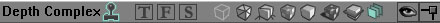

Many games use a single sprite or animated sprite for the first person view and only use a particle system for other players to avoid this problem.From a distance, overdraw is not much of a problem because the area that is drawn to mulptiple times is not large. Also, when the system is seen from the side, you can more "bang for you buck" because it looks larger but is drawing the same number of tranparent triangles. This can be seen in the image below.


#### Flash Emitters (first three emitters)

##### Why So Many Emitters? (Velocity and Size)

It may seem odd to use three emitters, two emitters of which only have 2 particles each, in such a small particle system. This is because the Unreal particle system does have the ability to say things like randomize size and have the big particles go slow and the little particles go fast. One can randomize both size and velocity but then big and little particles will both randomly go fast and slow. The problem is solved in Unreal by creating one emitter is for the big slow particles and another for the fast small particles. This emitter used three emitters to model the range from big and slow to small and fast. If greater accuracy is necessary, more particle emitters could be used with fewer particles per emitter.

##### Use of Texture, Size Scale, and Rotation to Mimic More Particles

Instead of making lots of particles I use one texture that has many fragments of muzzle "fire".


I also used subdivision fading and scale to animate the fading of the texture over time. (For a better description of this see the impact explosion tutorial) To make the fragments on the texture appear as if they were moving outwards I used the size scale to make the particles expand outwards from a size of zero. The first emitter, the biggest and slowest, uses two size scale points to expand from zero to full size over the course of its lifetime. The second emitter uses three size scale points to expand quickly at first and then gradually to the end of its life. The third emitter, the smallest and fastest, uses three points to expand out quickly and then shrink gradually. I also started all the particles with a random rotation and a slight spin. This makes it look as if the "fire" fragments on the texture are interacting with each other and moving independently with the system. All these factors work together to give the impression of one single flash made of many small bits that evolve to look basically tear shaped.

##### Color and Fading

Color and fading are not very complicated in this particle system. Fading is not much of an issue in a particle system that lasts a 1/20th of a second. Some fading is better than none but the values do not have to be very precise. Basically I have particles pop in and fade out partway through their lifetime. The color multiplier ranges and color scale are adjusted to give the system depth and an appropriate color.

#### Smoke Emitter


This emitter is very simple. It is 3 particles of smoke with slightly random start location and velocity spread. The particles have a large X start velocity but they also have a wide range the start velocity so that they are not tightly cluster together but instead spread out along the direction of movement. A velocity loss range is also used. This makes it so that the particles slow down in the specified direction like friction or air resistance. I only use the X loss range because that the only direction particles are significantly moving in. A wide size range is used so make the smoke look varied both within one flash and also between flashes.

#### Overall

This particle system seems to look like a good muzzle flash in a relatively few number of particles. If you where looking to improve the system and could spend more particles, the smoke would be a good place to start. Adding more smoke that lasted longer and swirled more would be an obvious first step. Other improvements might include adding the vent flash associated with many automatic rifles or adding a flash at the chamber of the gun into this particle system so two separate objects would not have to be spawned. There are many places this particle system could go but serves a good base and reference.

### SpotLights

*by Lode Vandevenne, updated by Chris Linder*

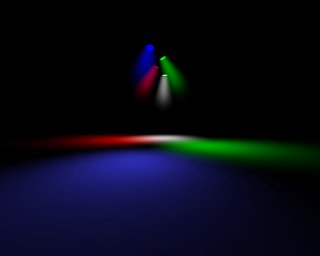

In this map, each spot uses an Emitter with the LightEffect LE\_SpotLight, and with a SpriteEmitter to create a volumetric lighting effect.First add one Emitter, open its properties and in Advanced set bDirectional to True. Then rotate it with the Rotation Tool, so that the arrow points towards the direction where the spotlight will shine.

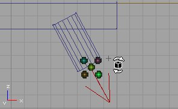

You need this rotation for two things: the LightEffect LE\_SpotLight needs it to determine the direction of the spotlight, and the SpriteEmitter uses it to determine the direction the particles will move.Add a SpriteEmitter in the Emitter, and give it a texture like the first picture. It's a very dark version of the second picture. Many of these dark textures together make a very smooth lightcone.

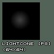

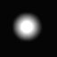This texture is white, so you can use it for any color of SpotLight: just give it a ColorScale. For example for a green light this would be an appropriate ColorScale?:


As you can see, the first and last colors are the same: now the particle color will remain constant for the entire LifeTime.These is a very short *Fade In* and a long *Fade Out* to make the particles disappear gradually over time but also not start too abruptly. There is also a very small *Max Particles* = 20 (this depends on the size of your light cone), *Start Size* --> X(Min) and X(Max) = 50 (this also depends on the size of your light cone). In *Rotation* set *Use Rotation From* to **Actor**, so the axes will be rotated by the rotation of the Emitter actor. This is very important: otherwise it's very difficult to set the correct direction of the Velocity. Give it a *Size Scale* like this:

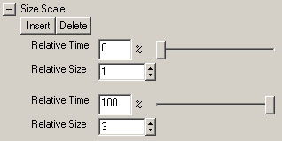

This *Size Scale* makes the particles grow while they move forward, to create a LightCone. If they wouldn't grow, you'd get a lightcylinder. Set *Relative Warmup Time* and *Warmup Ticks Per Second* both to 1 so that you don't have wait for the system to warmup, it just appears. Each of these light cones has a different *LifeTime* and a different *Start Velocity* but they all have the same shape. The "fastest" system, the blue system, has a *LifeTime* of 2 and a *Start Velocity* --> X(Min) and X(Max) = 100. The green system is 10 times slower than the blue system with a *Lifetime* of 20 and a *Start Velocity* of 10. The red system is 10 times slower than the green and the white system is 10 times slower than the red system. *(These speeds were acheived with the Scale Speed setting in General.)* Close inspection of the particle systems, particularly the base of the spot light, reveals the differences between the different speeds. Motion can clearly be seen in the blue system and the base looks flickery, like a fluorescent light. The green system has a very gentle motion but the base looks odd because it pulses. This could be solved by having many more particles and turning the *Opacity* down but this would be slower to render. Motion can barely be seen in the red system and it pulses much less often so it doesn't look very odd. The white system looks stationary and it doesn't have a pulsing problem because it pulses over the course of 100 seconds.Because *Use Rotation From* = **Actor** and you rotated the Emitter into the correct direction, the particles should now move with the direction of the SpotLight and make a nice LightCone.

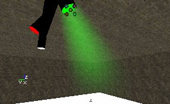

For the Lighting effect: open the properties of the Emitter, go to Lighting --> LightColor and give the light the same color as the color of the *Color Scale* for the particles. Then go to Lighting and set LightType to LT\_Steady, LightEffect to LE\_SpotLight, and LightRadius to 128 (an appropriate number for your map). Then set LightCone to 64, or again more or less depending on the size of the LightEffect you want: the higher this value, the larger the light on the floor will be. For example on the first screenshot LightCone is 13, and on the second screenshot it is 255. You'll have to judge what looks best compared to the size of the volumetric lighting effect.


To get the effect for more than one light with different colors and different directions, duplicate the Emitter and give the new ones the color and direction you want.

### Breaking Glass

*by Lode Vandevenne, modified/updated by Chris Linder*

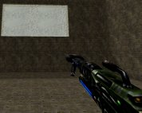


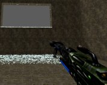

In this map there is a mover that represents a window. When shot, the mover moves away and simultaneously triggers a spawn thing that spawns a BreakingGlassEmitter. This BreakingGlassEmitter is nothing more than a SpriteEmitter with some properties set. Here the whole window explodes when you shoot it, but if you want only the part you shoot to break, just make the window out of different movers, all with their own spawner etc...There's no weapon in the map, but if you type loaded in the console you should get some so you can shoot the window.To begin, add a SpriteEmitter in the center of the window. Later you'll add the thing that spawns the BreakingGlassEmitter here, but it's easier to do it with an Emitter now so you can preview in the editor what you're doing.In the example map, the texture has 2 \* 2 subdivisions:

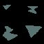

So *Number of U-Subdivisions* and *Number of V-Subdivisions* are set to 2, and *Use Random Subdivision* is checked. Now the fragments will not all look the same. For multicolored windows, you can use this to give the fragments different colors. You could also use *Color Multiplier* to vary the color but because it is random, you will have less control. To add more variation to the particles, use a *Start Size* between 1 and 10. The particles also start with a random rotation (orientation not motion) which is done by checking *Spin Particles* and setting *Start Spin* between 0 and 1.For the movement of the fragments, Acceleration and Velocity are used. For the directions and axes, to get your window working the same way as this example, set bDirectional to 'true' in advanced and rotate until the arrow points towards the direction you want the fragments to go to, and in *Rotation* set *Use Rotation From* to **Actor**.A negative Z *Accelaration* makes the fragments fall down. A *Start Velocity* of X(Min) = -60, X(Max) = 250. This makes all the fragments fall mostly to one side of the window, if you want them to fall to the other side as well, make X(Min) = -250. The higher this Velocity the more the fragments will be blasted forward, so if there happens a big explosion inside a building you could give the fragments a much higher speed. *Start Velocity* --> Y(Min) = -100, Y(Max) = 100 makes the fragments fall a little further than the sides too, otherwise they will form the shape of a boring rectangle on the ground.For the spawning of the particles: there have to be a lot of particles, and they have to be spawned all together at almost the same time, inside of the window. After that, no new particles may appear anymore. To get this, MaxParticles = 1000, but you'll need more if you have a larger window. Because the particles are so small, there is not much of a fill rate problem but many many particles is still a hit to performance. Set *Start Location* --> Y(Min) = -256, Y(Max) = 256, Z(Min) = -128, Z(Max) = 128, assuming you have a 512\*256 window and the Emitter is in the center of it.In *General* uncheck *Automatic Spawning* and set *Particles Per Second*. Now the SpriteEmitter wants to create particles at the rate of 50,000 in one second, but because MaxParticles = 1000, only 1000 particles will be created, and all within 0.02 seconds. This makes it look like all the particles get spawned at the same time.*LifeTime* = 10000000, and *Respawn Dead Particles* is False and in the Global settings of the Emitter bAutoDestroy = True. Now the particles will live for 10000000 seconds, and after that they die, they don't get respawned and the Emitter actor gets destroyed. Actually the last will never happen, because if the player wants to wait for 10000000 seconds, that'll cost him 115 days. However, if you give a *LifeTime* of (for example) 20 seconds, the fragments disappear after a while and you gain performance.Check *Use Collision* to True for bouncing fragments that will stay on the ground (otherwise they fall through the floor). Give ALL the X, Y and Z values in DampingFactorRange a number lower than 1, because the particles have got Velocity or Acceleration in ALL of these directions, and otherwise they stay moving forever! It works great when X(Min),Y(Min) = 0.28 and X(Max),Y(Min) = 0.999, and Z(Min) = 0.093, Z(Max) = 0.309. This makes the particles bounce very low, but skitter along the ground for a bit. In *Movement* set *Min Squared Velocity* to 9700 to avoid odd effects as the particles are coming to a stop. Collision at very slow speeds does not work well so this says after the particles are going below a certain speed, stop moving them so more collisions will not happen.Now you have an Emitter that will emit fragments when you open the map, but no more after that. If you want to spawn this Emitter with all these properties at the moment the player shoots the window, make a new subclass of Emitter, with for example the name "BreakingGlassEmitter", do NOT add this class in the map, but instead open its Default Properties in the Actor Class Browser. These Default Properties are the ones that will be used when the BreakingGlassEmitter is spawned, so you have to copy the properties of the Emitter you just made (the one you placed in the window) into this one.The easiest way to do this, is first open the properties of the Emitter inside the window, and copy the name of the SpriteEmitter. Then paste this name into the Default Properties of the BreakingGlassEmitter class, and it should get all the properties you gave the Emitter in the window.

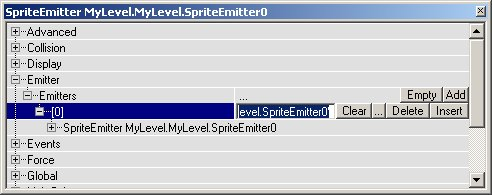

Also, give the BreakingGlassEmitter the same Global settings, and in Movement the same Rotation as you gave the Emitter in the window. You can now delete the Emitter in the window, and place a ThingFactory instead that will spawn the BreakingGlassEmitter. In the example map, this ThingFactory is a simple class called BreakingGlassSpawner, with the following script:

```

class <nop>BreakingGlassSpawner extends Emitter;

function trigger(actor Other, pawn <nop>EventInstigator)
{
     Spawn(class'mylevel.BreakingGlassEmitter');
}
```

But of course this small script isn't perfect.Add this BreakingGlassSpawner in the center of the window (where the Emitter used to be), and give it a Tag, for example "glass". So there are TWO new classes in the example map: the BreakingGlassEmitter that gets spawned, and the BreakingGlassSpawner that spawns the BreakingGlassEmitter when triggered.Then place a mover in the window, that represents the glass before it was shot. Set Key1 of this mover somewhere outside the map, and in the Mover properties set bDamageTriggered = True, MoveTime = 0, bTriggerOnceOnly = True, in Object set InitialState = TriggerOpenTimed, and in Event set Event to the Tag of the BreakingGlassSpawner, "glass".This mover will then trigger the spawner when it is shot, the spawner will spawn the breaking glass emitter, and it will look like you shot out the window.

### Spooky Hell's Lightning

*by Epic Games, doc by Chris Linder*


This is a fairly complicated lightning example. It includes three beam emitters to do the branching beam, one sprite emitter for the source mark, and one sprite emitter for the cloud light effect which also serves as a delay timer for the whole system.

#### Global Offset / Reset

The oddest thing about this particle system is that it is offset by the *GlobalOffsetRange* which is a setting for the whole particles system *(what Unreal calls "Emitters" but what we call "particle systems")* and is therefore not in the *Particle System Editor* which edits properties of individual sprite, spark, beam, and mesh emitters. This setting can be found by double clicking on the particle system and expanding the *Global* category.


This lightning uses a range from -4000 to 4000 for both X and Y with Z held at 0. What this means is that the origin *(X=0, Y=0, Z=0)* of each emitter is moved this amount. The point of all this is that it will create the lighting and source mark at the same random place. Another way to consider doing this would be to use the *Add Location From Other Emitter* setting in *Location*.The *GlobalOffsetRange* is reset every 0.25 seconds which is specified by *TimeTillResetRange*. *TimeTillResetRange* not only resets the range but the whole particle system as well. In all the emitters *Respawn Dead Particle* is unchecked. The only reason the system keeps going is because of the reset. It is also worth noting that the system will not reset until all the particles are dead, so if *Respawn Dead Particle* is checked the system will never pick a new location.Using *TimeTillResetRange* also allows one to use a particle system like a timer because none of the systems will reset until all the systems are dead. The cloud light effect serves as the timer in this case because it lasts longer than all the other systems. Because its lifetime is somewhat sporadic, it gives a random feel to the lightning. Another way to do this would be to give *TimeTillResetRange* a larger range and then you would not need a timer system.

#### Beam

A thorough explanation of beam branching can be found in the [ParticleSystems](ParticleSystems.md#Beam_Branching) doc. This lightning is very similar to the examples discussed in the doc which also has three levels of branching that get increasing random and smaller.The color on the beams is one of few simple things in this emitter. Each beam has a quick fade in and then a slow fade out. Each beam also has a color scale which goes from almost white (255, 251, 255), to a yellowish color (238, 185, 62). The texture on each beam is different but all are white, narrow, and a little wavy. The textures get skinnier from main beam to smallest branch.


This is why the main beam looks bold and bright while the branches look smaller and ... branchier. All the beam sizes are the same because they rely on the texture to adjust size.

#### Source Mark

The particles in the emitter are aligned with the ground, not facing the camera, by setting *Facing Direction* to **Normal**. This emitter uses a 3x3 subdivision texture and fades between the subdivisions to get an explosion type effect which is enhanced by the fact that all the particles are spawned at the same time using *Particles Per Second*.


A size scale is also used to expand the particles over their lifetime which contributes to the exploding effect. Lastly, a color scale fades the particles to a reddish color as they fade out. The lifetime of the particles varies in the same way as the lifetime of the beam (between 0.25 and 0.5 seconds).

#### Cloud Light Effect

The cloud light effect is fairly interesting. It serves as the timer for the system so the lightning doesn't strike all the time as mentioned before. It also gives the feeling that there is other lightning in the clouds that we can't see because there are flashes between strikes. The lifetime of the particles is between 2 and 3 seconds so not only do the cloud light flashes look random, but the time between strikes is not always the same. The particles have a color scale that is bright in the very beginning, fades out to a dull color quickly, and then fades to transparent over the rest of the scale. This scale is repeated 3 times so the cloud light looks flickery, like lightning. The particles also fade out over time so the later flickers are not as bright as the first. There are 3 particles in the system so this flicker cycle happens 3 times. The particles also get much bigger over the course of their lifetime due to a size scale from 25 to 200.

### Ground Fog

*by Chris Linder*

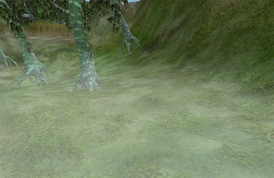

This low ground fog is a very simple particle system. It consists of 18 particles that are aligned with a vertical normal. This is done by setting *Facing Direction* in *Rotation* to **Specified Normal** and setting the *Projection Normal* to (X=0, Y=0, Z=1). *Use Rotation From* is set to **Actor** so that the particle system can be rotated in the world to align with the enviroment. In this case the *Start Location Box* is much longer in the X direction (+/- 1400) than in Y direction (+- 25). (The particles also have some small variation in Z *(+/- 5)* to give the system more depth) This particles system is rotated to fit in the valley which is not aligned with any axis.

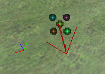

The particle uses an alpha texture with *Draw Style* set to **Alpha Blend**. The texture itself has a fairly opaque center so the *Opacity* of the system is turned down to 20% so as not to white out the whole scene. The particles also fade in and fade out, but for most of their lifetime they are not fading. The particles also have a very large size of X and Y = +/- 825 so the texture covers a very large area.The ground fog particles have a life time of 20 seconds. This makes it so that all the fading is slow and not very noticiable. The system also have *Relative Warmup Time* and *Warmup Ticks Per Second* = 1 so you don't see the system warmup. Also all the motion is very slow so that nothing apears jerky or sudden. The particles have have an X and Y *Start Velocity* of +/- 2.5 and a Z velocity of min=1, max=3.5. The particles also start with a random rotation and have a *Spins Per Second* of min=0.05, max=0.08. All these combine to form a gently swirling, overlapping fog system.One of the biggest problems with making a particle system fog is overdraw. *(Overdraw is the number of times the same pixel is drawn to, which is limited by video card fillrate)* The overdraw in this system is not so bad because it uses few large particles so there is not that much overlap.

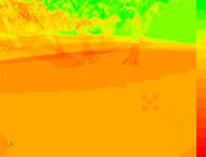

Still, considerable overdraw remains, and anyone making or using fog with particle systems must recognize this.

### Waterfall

*by Chris Linder*

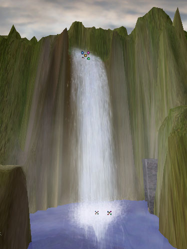

This example is fairly complicated and also moderately expensive in terms of rendering time. At the same time, it looks better and is more flexible than almost all sheet based waterfalls (the inexpensive way to create waterfalls). You can be in front of, to the side, behind, and looking up through this waterfall.

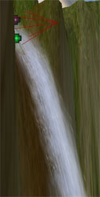


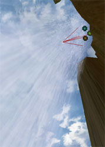

The effect is composed of three emitters. The first emitter is the waterfall itself, the next is the base where the falls hit the surface of the water, and the third is the misty fog surrounding the falls.

#### The Falls

The falls are composed of four emitters: The 'main water' emitter which makes up the bulk of the falling water; the 'fast water' emitter which is in front of and less dense than the main water, and falls at a faster rate to give the appearance of different layers and speeds of water; the 'drops' emitter which captures the effect of water droplets on the edges and around waterfalls; and the 'side water' which is a system so the waterfall does not just look like a thin sheet from the side.The 'main water' is a system composed of 29 alpha sprites. The texture is a 2x1 subdivision texture and a random subdivision is chosen for each sprite. The 'right' thing to do would be *Blend Between Subdivisions* but for some reason that does not work with alpha or fading of any kind. This is inconvenient because it would look better if the texture changed on the way down but fading is more important. The particles fade with a color scale that has an alpha value on both ends and two non-alpha values in the middle. This is done instead of fading because color scale is calculated per particle while fading is absolute times. At one point in time I tested the system with different lifetimes for the particles so this was necessary, but now that the lifetime is fixed at 2.5 seconds it doesn't matter; fading could have been used. The texture is slightly tinted with the *Color Multiplier* to make it more blue. These seemed to fit the level better, which has the lighting of late afternoon, and blue is used to darken/shadow the system.The texture itself is fairly large (256x512) and it you wanted to save texture memory, shrinking it could be done without much of a loss in quality. It is important to note that the texture is not pure white. With no color variation in color on texture, the water looked very flat and unconvincing. Just a little bit of color improved the look of the water greatly. Below is RGB of the texture, followed by its alpha channel, followed by the texture as it looks in UnrealEd.


The system is aligned with the actor so it can easily be rotated to match the environment. The width of the falls is set with the Y range of the *Start Location Box* which, in this case is about +/- 133. X and Z are both 0 in the start location. All particles start with the same velocity which is heading out mostly (X = 242), and a little bit down (Z = -60). *Acceleration* is down at a rate of about Z = -800. As the particles fall and move more quickly, they get longer and skinnier because the *Facing Direction* is **Along Movement Facing Normal**. To compensate for getting thinner, a size scale is used to make the particles larger over time. The final size in the scale was tweaked till the system stayed the same width. This also resulted in the particles becoming even more stretched vertically as they fell, which looks good visually. The size of the particles starts with almost the same X and Y, but not quite. X = +/-140 and Y = +/-134. The particles do not spin because with *Facing Direction* as **Along Movement Facing Normal** spinning does very odd things to the particles.The 'fast water' was created by duplicating the 'main water' and making the system faster using the *Scale Speed* tool in *General*. The emitter was then moved up and forward a little with *Start Location Offset*. There are fewer particles in this emitter and the *Start Size* is slightly different. Also, the *Start Location Box* Y range is more narrow (Y = +/- 100) so that fast particles do not show up on the edge and look obviously like single sprites.The 'drops' emitter was also created by duplicating the 'main water' and making the system faster but not quite as fast as 'fast water'. The texture is different and has many little drops of water that are more opaque. This system also has the *Start Size* and *Start Location Box* adjusted a bit, but the main difference is that these particles have a small amount of spin. This spin does not rotate on the normal of the sprite however because the *Facing Direction* is **Along Movement Facing Normal**; they spin on some other axis which makes them stick up and out, which works very well for random drops of water from a waterfall because they are no longer part of the waterfall plane.The 'side water' emitter is also a duplicate of the 'main water' but it has a *Facing Direction* of **Along Movement Facing Camera**. This is how the waterfall can look good from the side. This *Facing Direction* does not stretch the particles do the size scale was removed from this emitter. The *Start Size* was also adjusted a lot to make the system work from the side and not be too obtrusive in the front view. If you are dealing with a waterfall that will not be seen from the side, save the particles and disable this system.

#### Waterfall Base Splash

The waterfall base splash is composed of two emitters, one for the main water splashing and one for the little droplets on the edge of the main splash. This is designed to look as if the entire splash effect is made of the little tiny droplets that are just very dense in the center. The main water splashing emitter uses a dense texture with 2 subdivisions that are chosen randomly.

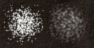

It would be preferable to blend between them, but as mentioned above, this blending does not work with alpha. The texture is an alpha texture so that when the base splash is seen from the side, it does not get brighter, which it would if *Draw Style* was **Translucent** or **Brighten**. The droplet texture:

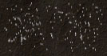

also uses subdivision and **Alpha Blend** for the same reasons. The drops of water are far less dense and are nor clustered in the center of this texture for obvious reasons. The main emitter, that uses the dense texture, is also more dense because it uses 44 particles compared to the drops emitter's. The main emitter uses an *Opacity* of 40% though, so the systems are more balanced and do not white out in the center. Another difference between the main texture and the drops texture is that the main splash particles are larger (size = 106) than the ones in the drops system (size = 66).Both these emitters spin the particles and and start with a random rotation to make the drops look more like individual drops and less like a single texture of many drops. A *Facing Direction* of **Facing Camera** is used because the splash is supposed to be a volume and so always facing the camera makes the most sense.*Start Location Box* is used to position the particles in a line at the base of the waterfall. The system has *Use Rotation From* set to **Actor** so it can easily be rotated in the world to match things such as the waterfall base. The particles start mainly along the Y axis (Y = +/- 155) with a little bit of play on the X axis (X = +/- 25). A *Start Location Offset* (Z=-150) is used to start the splash below the surface of the water. This is done so the fade in happens when only part of the particles is seen above the surface of the water. If the particle were to fade in when it was entirely above the water, it would look even more like a single sprite appearing which is allready a problem with this system.The particles in both these emitters start moving quickly up (+Z) and out some (+/- Y) and even a little bit forward (+X). The droplets move up a little bit faster and out much faster than the main splash. *Acceleration* in the -Z direction (Z=-1260) plays a large part of in the motion of the these particles. The particles have all have a *Lifetime* of about 0.9 seconds so they have just enough time to slow down and start heading back down before they fade out.The fading on these particle system is perhaps overly complicated. The particles use *Color Scale* with alpha to fade in, stay full bright for a little bit, and then fade out. *Fading* is also used to increase the fade out rate at the end of the particles' life by setting the *Fade-Out Start Time* to part way through the *Color Scale* fade out. Really just *Fading* could be used and things would look fine, but it is worth mentioning how two different fading rates can be used together.

#### Misty Fog

This system is composed of 18 relatively large alpha blended particles that have a very low *Opacity* (0.13). These particles start with a random rotation and move fairly slowly, mainly upwards but also forwards and a little bit out in both directions. The particles have a lifetime of 8 seconds which gives them time to float to about halfway up the waterfall. The partilces fade in 0.63 seconds, stay at max opacity for a little more than 2 seconds, and they fade out for the rest of their lifetime. The fade in may seem quick but the fact that the particles start with a *Start Location Offset* 100 below the particle system (which puts them below the water) helps to hide this. This system also has *Use Rotaion From* set the **Actor** so it can easily be aligned with the waterfall.

## Downloads

Below you can download a compressed archive that contains the content for this example:

* [EM\_ParticleSystems.zip](../../assets/EM_ParticleSystems.zip) (for Unreal Engine 2 build 2226)

