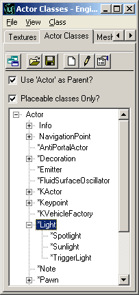
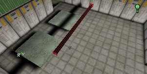
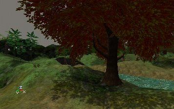

# Lighting Basics

*Document Summary: A table of contents to the lighting docs with descriptions.**Document Changelog: Last updated by Jason Lentz (DemiurgeStudios?) to separate into more manageable documents. Original author - Jason Lentz (DemiurgeStudios?)*

* [Lighting Basics](#lighting-basics)
  + [Introduction](#introduction)
  + [Using Lights](#using-lights)
  + [Types of Lights](#types-of-lights)
  + [Lighting Reference](#lighting-reference)
  + [Lighting on Surfaces](#lighting-on-surfaces)
  + [Special Lighting Features](#special-lighting-features)

## Introduction

This document is designed to introduce you to using Lights in Unreal Ed. Below are a series of documents outlining the various features and uses for lights with links to the documents themselves. For first time users of Unreal Ed, these docs are in the recommended order for reading them.To link directly to the documents click on the links here:

* [UsingLights](UsingLights.md)
* [TypesOfLights](TypesOfLights.md)
* [LightingReference](LightingReference.md)
* [LightingOnSurfaces](LightingOnSurfaces.md)
* [SpecialLightingFeatures](SpecialLightingFeatures.md)

---

## Using Lights

[Link to this doc here.](UsingLights.md)Here you will find the basics of lighting. This document shows how to place lights and describes the various features that allow you more easily and accurately asses the lighting within your level.

* [UsingLights](UsingLights.md)
  + Adding a Light
  + Radii View
  + 3D View Modes
  + Game Settings
  + Rebuilding
  + Scale Lights

---

## Types of Lights

[Link to this doc here.](TypesOfLights.md)The most common light of course is the basic light you can add by right clicking in your level, but there are a variety of other ways to add lighting to your level. Here you will see what these alternatives are and how best to use them.

* [TypesOfLights](TypesOfLights.md)
  + Zone Light
  + Other Light Actors
    - SpotLight
    - SunLight
    - TriggerLight

---

## Lighting Reference

[Link to this doc here.](LightingReference.md)Here you'll find a complete list of all the Lighting properties, both for the LightColor section and Lighting Section. These properties can be used in not only LightActors, but in all Actors. Some of the properties have more in depth descriptions after the tables

* [LightingReference](LightingReference.md)
  + LightColor
  + Lighting
  + UnLit

---

## Lighting on Surfaces

[Link to this doc here.](LightingOnSurfaces.md)Lights affect different types of geometries in different ways. This document outlines how each of these cases differ to help you avoid unwanted artifacts as well as take full advantage of other features available.

* [LightingOnSurfaces](LightingOnSurfaces.md)
  + Lighting on BSP
  + Lighting on Static Meshes
  + Lighting on Meshes
  + Lighting on Terrain
  + Lighting on Sprites
  + Lighting on Particles
  + Lighting on Movers

---

## Special Lighting Features

[Link to this doc here.](SpecialLightingFeatures.md)This section of the Lighting Tutorials describes more advanced uses of Lights and how to achieve various Lighting Effects. These methods require you to use properties outside of the Lighting and LightColor properties, but with a little extra work, you can achieve some nice effects.

* [SpecialLightingFeatures](SpecialLightingFeatures.md)
  + TexturePaletteLoop
  + MovingLights
  + Coronas
  + Projective Textures

