# Matinee Example

*Document Summary: A walk through creating an example Matinee scene.**Document Changelog: Last updated by Hugh Macdonald ([UdnStaff](https://udn.epicgames.com/Main/UdnStaff)) to correct a few bits which were updated in 829. Created by Warren Marshall for version 829.*

* [Matinee Example](#matinee-example)
  + [Overview](#overview)
  + [Getting Started](#getting-started)
  + [SceneManager](#scenemanager)
  + [InterpolationPoints](#interpolationpoints)
  + [LookTarget](#looktarget)
  + [Building the Path](#building-the-path)
  + [Check for Errors](#check-for-errors)
  + [Preview Window](#preview-window)
  + [Effects](#effects)
    - [Fades](#fades)
    - [Orientation](#orientation)
      * [Preview Tip](#preview-tip)
  + [Bezier Paths](#bezier-paths)
  + [Player Start](#player-start)
  + [In Closing](#in-closing)

## Overview

In this document we're going to build a simple matinee scene. This will teach you the basics of placing InterpolationPoints and getting the camera to do what you want it to. I will assume a basic understanding of the editor - that you know how to create a map, subtract rooms, etc.

## Getting Started

To start with load a fresh UnrealEd.

* Create a cube of the dimensions 1024x1024x1024
* Subtract it
* Create another cube of the dimensions 256x256x256
* Add it
* Select all surfaces and mark them as unlit

Rebuild the level. This gives us a playground to build this example level with. Or if you're lazy, you can download a UNR to start with here : [https://udn.epicgames.com/pub/Two/MatineeExample/MatineeExample1.zip](../../assets/matineeexample1.zip) .When you're done, you should have a level that looks like this:

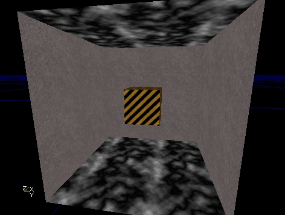

A cube within a larger cube. I chose some textures I had handy here to make it clear what's going on but you can use whatever you want.

## SceneManager

Now we need to add a SceneManager actor. This can be done in two ways:

* Select the SceneManager class under **Info** in the actor browser and place it in the level manually
* Go into Matinee mode and click the new button on the Scenes tab

Now that we have a scene manager, edit it's properties so that **bCinematicView** is set to TRUE. This will put the screen into letterbox mode when the scene runs.Also, go under the **Events** section and set the **Tag** field to "ExampleScene". This is the name we'll use to trigger the scene later on.

## InterpolationPoints

Now we have to add some InterpolationPoints into the level so the camera will have somewhere to go. What we should do is add one near each corner of the smaller cube. The easiest way to add InterpolationPoints is to go to the **Tools** tab in the matinee dialog and use the "Add Interpolation Point" button. This will add the InterpolationPoint at the same location/rotation as the camera.So go ahead and place an InterpolationPoint near each corner of the smaller box. You might want to vary the heights of the actors so there's some variety in the path. This is what I did:

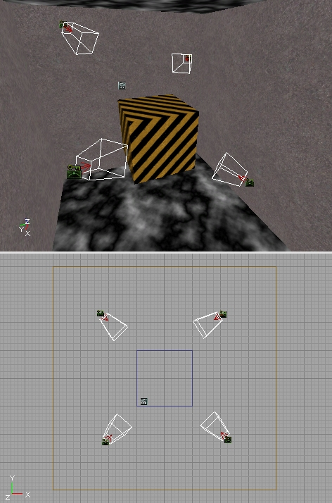

You'll notice that when InterpolationPoints are selected, they display a wireframe frustum cone. This is to give you an idea of which way they're pointing (*more than the directional arrow would be able to do on it's own*).

## LookTarget

A LookTarget is a simple actor that does nothing more than act as a target for the camera to look at. Any actor can be used for this purpose, but the LookTarget has a bullseye as it's graphic so it's easy to see in the level and it's obvious what the camera is looking at.To add one, position the viewport camera where you want it and on the **Tools** tab click the "Add Look Target" button. This will place one in the level at the cameras current location. Go ahead and add one on top of the smaller cube. Something like this:

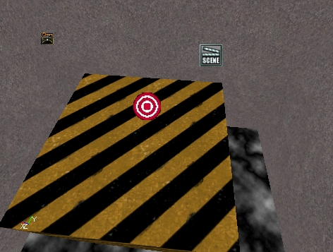

## Building the Path

To actually link up these InterpolationPoints so they form a nice path, we have to start adding actions to the scene. Make sure the scene is selected on the **Scenes** tab and click the **Actions** tab.Click the **New** button and choose **ActionMoveCamera**. This will place a new action in the window below. The first thing we need to do is select one of the InterpolationPoints in the level. This will be where the path will start. Now, open up the **MatAction** section of the action, go to **IntPoint** and click the **Use** button. This will fill in the name of the selected InterpolationPoint.This first action is somewhat special because we don't enter a **Duration** for it. This is simply a starting location for the camera. A **Duration** of zero indicates an instant cut to matinee.Now, add another action, select the next InterpolationPoint in the path and do the same thing. Now you should see a line connecting those two InterpolationPoints in the level. Something like this:

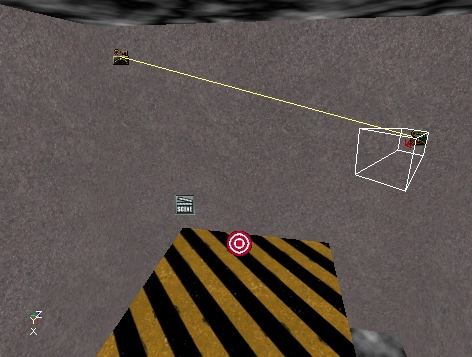

We need to set a time for this action, so open up the **Time** section and enter a **Duration** of "8". This means that it will take 8 seconds to travel to the InterpolationPoint assigned to this action.

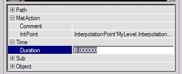

Let's add a third action. But this time, select the one we just added and hit the **Duplicate** (

) button. This will copy the currently selected action (*which at this point should be the last one we added*). The only thing we have to do now is select the next InterpolationPoint and assign it to this action.Do this 2 more times until you make a complete path that connects back to the first InterpolationPoint in the path. You should have 5 total actions, connecting 4 InterpolationPoints. Something like this:

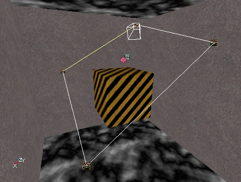

## Check for Errors

Now we should have a complete matinee scene that will play. It's ugly, but it should work. To make sure you haven't forgotten something important, use the **Tools** menu at the top of the editor and choose "Check Map For Errors". If it comes up empty, congratulations! If not, fix whatever it's complaining about before continuing on.

## Preview Window

We can take a look at our path without starting the game itself. Click the **Preview** button (

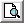

) and the preview window will appear. It should look something like this ...

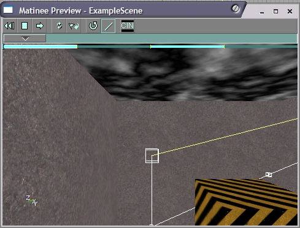

The easiest thing to do at this point is to click the **Play** (

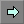

) button and watch the scene play out. When you click it, the letterbox will turn on and the camera will start moving. It will take 8 seconds to move to each InterpolationPoint that we placed in the level. The InterpolationPoints don't show up in this window and are instead represented by little boxes. If you don't want to see the lines, turn off the **Lines** button (

).You can also drag the time scrubber control (

) to manually move the camera through the scene. This won't do much at the moment, but it's still useful to get a feel for what it does, so go ahead and play with it.

## Effects

Now for the good stuff! We'll add some simple effects to this path now and see what they do. The other effects are explained in the first document in this series ( [MatineeTutorial](MatineeTutorial.md) ). Once you know how to add these ones, you should be able to add the others and play around with them.

### Fades

Let's start off by making the path fade in from black. Select the second action in the list, then click on the "Sub Actions" tab. The UI components here work just like the ones on the "Actions" tab. Click the **New** button and select "SubActionFade". This will place a Fade subaction in the list.In it's properties, open up the **Fade** section. In here you can see the field that controls what color the fade is and whether it's fading in or out. Change **bFadeOut** to FALSE since we want to fade in at the start of the scene.The next thing we need to change is under the **Time** section. Change the **Duration** field to "4", and leave the **Delay** at zero. What this means is that the fade will start immediately when this action starts executing and will last for 4 seconds. So it will take 4 seconds to full fade in from black.Make sure the time scrubber is back the start of the path and click the **Play** button again. You'll see a nice fade happening now. If you find that you want to stop a path from playing before it hits the end, just click the **Stop** button (

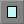

).To see the effects of what **Delay** does for a subaction, try setting it to "2" and play the scene again. Now everything is normal for 2 seconds and THEN the fade starts taking effect. Subaction times are relative to the action that owns them. This is important to remember but not really clear on what it means. You'll get the idea as you play with more advanced subactions.Change the **Delay** back to zero before continuing on.

### Orientation

Let's do something now where we'll change where the camera is looking in the middle of the path. We'll make it look at the LookTarget actor we added at the start of this article.The first thing to do is to go back to the "Actions" tab and select the third action on the list, then go back to the "Sub Actions" tab. Before you do that though, note that the action we were just editing has a little "S" on the right side now. That tells us that action has subactions attached to it. Just a convenience thing, that's all.Once you're back on the "Sub Actions" tab, click the **New** button and choose "SubActionOrientation". Once it's added, go under it's **Time** section and enter a **Delay** of "4". This means that it will start changing the cameras orientation halfway through the action (*remember that the action itself takes 8 seconds*).Now, the meat of this subaction lies in the **Orientation** section. Open that up and then open **CamOrientation**. These fields were explained in the previous document ( [MatineeTutorial](MatineeTutorial.md) ), so I won't go over it all again here. Select a **CamOrientation** of "CAMORIENT\_LookAtActor". Now, select the LookTarget actor in the level and click the **Use** button in the **LookAt** field. This will put that LookTargets name in there automatically. This tells matinee that you want the camera to look at that LookTarget.One other field we need to change is **EaseInTime**. This tells matinee how long you want it to take to switch to this new orientation. Enter "2" so it will take 2 seconds to make the switch.OK, now click the **Play** button in the preview window again. When the camera is traveling along the second actions path you should see it swing to look at the top of the smaller cube. You'll notice that once you change the orientation, it stays that way. Each time you want the camera to change, you have to set up a SubActionOrientation.To demonstrate this, go back to the "Actions" tab and select the last action on the list, then come back to the "Sub Actions" tab. Add a new SubActionOrientation but this time leave the **CamOrientation** as "CAMORIENT\_FacePath". Set the **EaseInTime** to "4" and under the **Time** section, set the **Delay** to "4".Play it again in the preview window. Oops. When the camera tries to go back to facing the path, it ends up turning around the long way to do it. You can fix this sort of situation by changing **bReverseYaw** to "1". This tells matinee to reverse the camera turning direction around the yaw axis. Change that and run the path again. You should see it looking proper now.

#### Preview Tip

When you're fine tuning your path in the preview window, it can be maddening to have to sit through the entire thing over and over. The solution to this is to drag the time scrubber up to the point just before the part you want to view. When you click the **Play** button it will start playing from wherever the time scrubber is sitting.

## Bezier Paths

So far the camera movement has been pretty jerky. When it hits a corner it immediately snaps to face the next path. The way to fix this is to change the actions to use bezier paths rather than linear. Click on the second action in the list and open up its **Path** section. Change the **PathStyle** field to "PATHSTYLE\_Bezier". You'll immediately see the editor viewports update to show a curving path now with control handles sticking out of the InterpolationPoints.

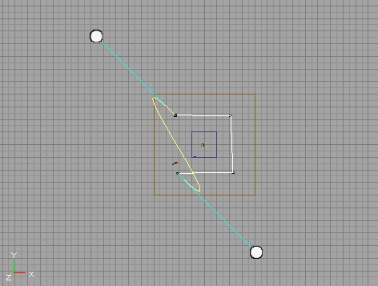

You can drag these control handles around to shape the path the way you want it to look. Change the other actions to be bezier paths as well. Now form the path into some semblance of a smooth curve. Something like this:

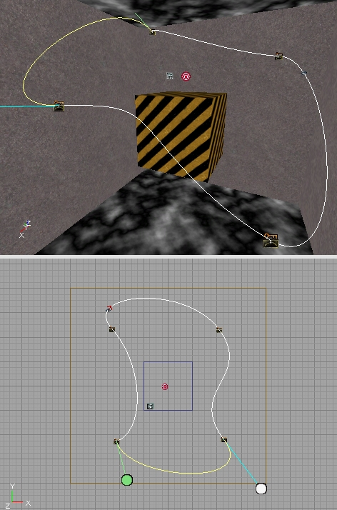

The exact shape of your path doesn't really matter, as long as you get the idea of what's happening here. Now play the path again. Looks a little more interesting and when the camera moves through an InterpolationPoint, it does it smoothly rather than jerking.

## Player Start

OK, it's time to leave the editor and see this path run in the game engine. To do that, we'll need a PlayerStart in the level. Place one as you normally would but set it's **Event** field to "ExampleScene". This will cause the path to be executed as soon as the level loads into the engine.If you wanted to trigger the path later, you could simply create a Trigger and wait until the player walks into it to start the scene.Once the PlayerStart is added, go ahead and run the level in the game. It should play automatically. Congrats! That's your first matinee scene.

## In Closing

If you're having problems getting your scene to work, you can download a working version of what we just built here:[https://udn.epicgames.com/pub/Two/MatineeExample/MatineeExample2.zip](../../assets/matineeexample2.zip)Good luck!

