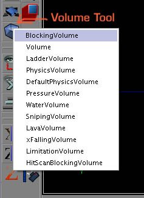
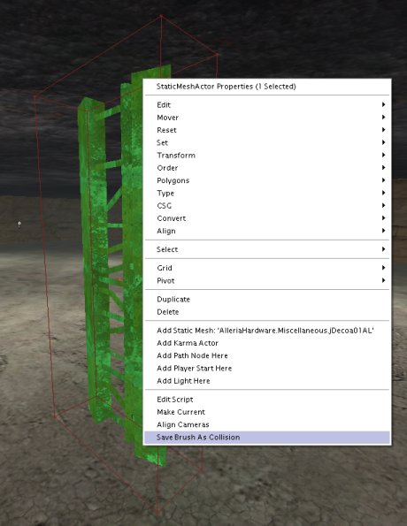
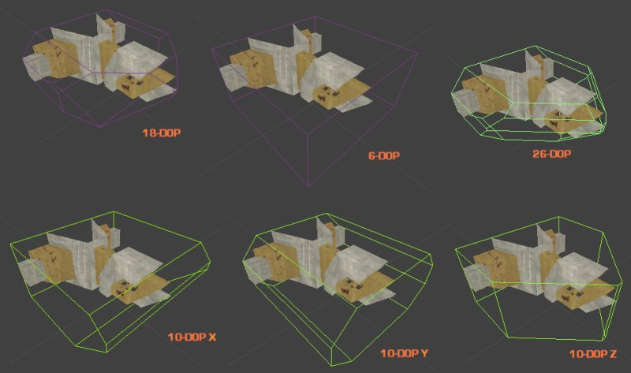
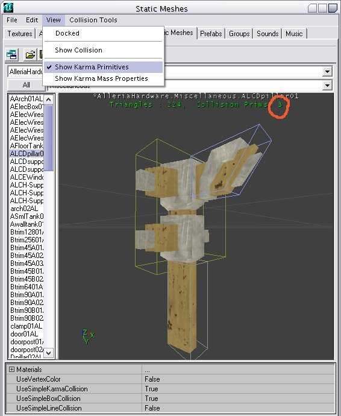
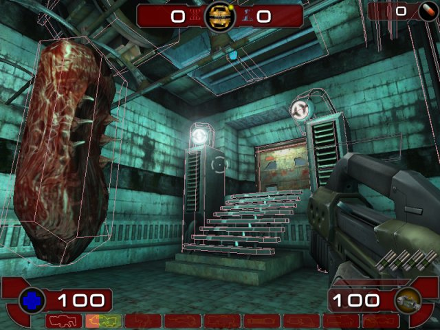
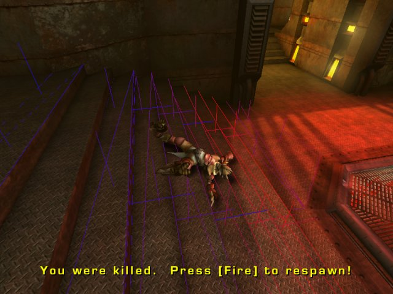

# Collision Tutorial

*Document Summary: A quick introductory guide to Collision in Unreal Ed.**Document Changelog: Last updated by Michiel Hendriks, updated for v3323. Previously updated by Chris Linder(DemiurgeStudios?) 11-3-2003 to link to more collision docs. Original Author was James Golding ([jamesg@epicgames.com](mailto:jamesg@epicgames.com)) October 22nd 2002.*

* [Collision Tutorial](#collision-tutorial)
  + [Related Documents](#related-documents)
  + [Collision Overview](#collision-overview)
  + [Collision Types](#collision-types)
    - [Blocking Volume](#blocking-volume)
    - [Collision Models](#collision-models)
  + [Creating Collision Models](#creating-collision-models)
    - [Save Brush As Collision](#save-brush-as-collision)
    - [K-DOP](#k-dop)
    - [Fit Karma Primitive](#fit-karma-primitive)
    - [Create in a Modeling Program (3D Studio Max or Maya)](#create-in-a-modeling-program-3d-studio-max-or-maya))
  + [Collision For Karma](#collision-for-karma)
  + [Reviewing Collision In-Game](#reviewing-collision-in-game)

## Related Documents

[StaticMeshCollisionReference](../../Uncategorized/StaticMeshCollisionReference.md), [KarmaReference](KarmaReference.md), [StaticMeshesTutorial](../Primitives/StaticMeshesTutorial.md),

## Collision Overview

This tutorial is intended for 3323 builds of the engine. Most of the information in this document is relevant and useful for most [UnrealEngine2](https://udn.epicgames.com/Two/UnrealEngine2) games but there might be some differences that are not addressed in this document.As well as making your Unreal level look amazing, it is worth spending some time on the collision in your level. After this tutorial, take a look at some of the UT2004 maps and see how the methods described here have been used.Collision with the level BSP and terrain should work fine without much tweaking. Collision with static meshes, however, can require some optimization, simply because of the large number of triangles involved. The main job here is using simpler shapes for collision than for graphics. There are 2 reasons for doing this:

* *Faster*. With the number of triangles now in a level, using just the graphics triangles for collision can get really slow.

* *Smoother*. It can be really annoying to get 'snagged' on some small graphical detail in the middle of a firefight!

## Collision Types

There are two main tools for tweaking collision in your level, [Blocking Volumes](#blocking-volume) and [Collision Models](#collision-models). Both must be 'closed' meshes.

### Blocking Volume

These are invisible actors which the player will collide against in game. First make the builder brush the correct shape, then press the 'Volume' button in the editor and select 'BlockingVolume' from the list. These can also be useful for preventing players getting to certain areas of the level eg. over walls.

### Collision Models

*Collision Models* are stored as part of a static mesh, in the .usx package. Every time you place a static mesh, it will collide in the same manner. Each static mesh can have several collision models to make up the collision for the entire mesh. Because collision models are part of the static mesh, they are 'instanced' in the same way as static mesh graphics, so are more efficient memory-wise than blocking volumes.There are two basic types of collision models:

* **Type 1** - These are collision models created using [Save Brush As Collision](#save-brush-as-collision), or [K-DOP](#k-dop). This type of collision also includes collision shapes [created in a modeling program](#create-in-a-modeling-program) with the *MCDCX* tag.
* **Type 2** - These are collision models created with [Fit Karma Primitive](#fit-karma-primitive) or collision shapes [created in a modeling program](#create-in-a-modeling-program) with the *MCDBX*, *MCDSP*, or *MCDCY* tags.

You can easily tell the difference between these types of collision models by turning on *View->Collision* in the static mesh browser; only the *Type 1* collision objects will be displayed. You can see the *Type 2* collision models by turning on *View->Show Karma Primitives*. The *Show Karma Primitives* option will sometimes display *Type 1* objects and sometimes not.In the static mesh browser you can change a few properties of how the collision model is used:

| [Collision Type](https://udn.epicgames.com/bin/publish/WebHome?webs=Main%2CTwo%2CThree%2CPowered&amp;inclusions=%2A&amp;exclusions=&amp;filter=&amp;inclfilter=%5C%25META%5C%3AFIELD%5C%7Bname%5C%3D%5C%22Documentavailability%5C%22.%2Avalue%5C%3D%5C%22General%20public%5C%22&amp;filterbymeta=yes&amp;skin=static_udn3&amp;restrictedclass=restricted&amp;format=&amp;sortcol=0;table=1;up=0#sorted_table-sort-by-this-column) | [Default](https://udn.epicgames.com/bin/publish/WebHome?webs=Main%2CTwo%2CThree%2CPowered&amp;inclusions=%2A&amp;exclusions=&amp;filter=&amp;inclfilter=%5C%25META%5C%3AFIELD%5C%7Bname%5C%3D%5C%22Documentavailability%5C%22.%2Avalue%5C%3D%5C%22General%20public%5C%22&amp;filterbymeta=yes&amp;skin=static_udn3&amp;restrictedclass=restricted&amp;format=&amp;sortcol=1;table=1;up=0#sorted_table-sort-by-this-column) | [Relevant For](https://udn.epicgames.com/bin/publish/WebHome?webs=Main%2CTwo%2CThree%2CPowered&amp;inclusions=%2A&amp;exclusions=&amp;filter=&amp;inclfilter=%5C%25META%5C%3AFIELD%5C%7Bname%5C%3D%5C%22Documentavailability%5C%22.%2Avalue%5C%3D%5C%22General%20public%5C%22&amp;filterbymeta=yes&amp;skin=static_udn3&amp;restrictedclass=restricted&amp;format=&amp;sortcol=2;table=1;up=0#sorted_table-sort-by-this-column) | [Description](https://udn.epicgames.com/bin/publish/WebHome?webs=Main%2CTwo%2CThree%2CPowered&amp;inclusions=%2A&amp;exclusions=&amp;filter=&amp;inclfilter=%5C%25META%5C%3AFIELD%5C%7Bname%5C%3D%5C%22Documentavailability%5C%22.%2Avalue%5C%3D%5C%22General%20public%5C%22&amp;filterbymeta=yes&amp;skin=static_udn3&amp;restrictedclass=restricted&amp;format=&amp;sortcol=3;table=1;up=0#sorted_table-sort-by-this-column) |
| --- | --- | --- | --- |
| *UseSimpleKarmaCollision* | *TRUE* | *Type 1* and *Type 2*. | If this is *TRUE* and a collision model is present, the collision model will be turned into a set of convex hulls and used for calculate the collision of karma objects against this object. If *UseSimpleKarmaCollision* is *TRUE*, and there is no collision model, karma will not collide with this object. If you set *UseSimpleKarmaCollision* to *FALSE*, karma will collide with the graphics triangles; only use this option if the graphics triangles are fairly large. See the [Collision For Karma](#collision-for-karma) section below for more details. |
| *UseSimpleBoxCollision* | *TRUE* | *Type 1* | If this is *TRUE*, the collision model (if present) will be used for 'non-zero extent' line checks. This includes things like player movement, but not weapon fire. No per triangle collision will be used if this is *TRUE* and there is a collision model. If you set *UseSimpleBoxCollision* to *TRUE* when you do not have a collision model or if you set *UseSimpleBoxCollision* to *FALSE*, per triangle collision will be used based on the material. You can turn off collision for a material by pulling down the *Materials* array and setting *EnableCollision* to *FALSE*. |
| *UseSimpleLineCollision* | *FALSE* | *Type 1* | If this is *TRUE*, collision model (if present) will be used for 'zero extent' line checks. This includes most weapon fire, corona traces etc. If you set *UseSimpleLineCollision* to *TRUE* when you do not have a collision model or if you set *UseSimpleLineCollision* to *FALSE*, per triangle collision will be used based on the material. You can turn off collision for a material by pulling down the *Materials* array and setting *EnableCollision* to *FALSE*. |

For more details on static mesh collision see the [Static Mesh Collision Reference](../../Uncategorized/StaticMeshCollisionReference.md)An additional bonus of using collision models is that if you set all of the settings to true and you turn off the collision of every material, the static mesh will use much less memory.

## Creating Collision Models

There are several ways to create a collision model for a static mesh. After adding a collision model to a static mesh you will need to save the .usx.

### Save Brush As Collision

Place the static mesh that you want to add a collision model to into a level. Then place the builder brush around it in the shape you want the collision model to be. Keep it as simple as possible! Then select the static mesh, right click and choose 'Save Brush As Collision'. This will take into account any scaling you may have applied to the static mesh.

It is very important to note that this collision will be added to ALL instances of the static mesh you have selected. To see the effect of saving the brush as collision you will have to save the package that contains the static mesh.

### K-DOP

K-DOP is a tool in the static mesh browser for generating simple *Type 1* [collision models](#collision-models). K-DOP stands for 'K discrete oriented polytope' but that doesn't really matter :). Basically it takes 'k' axis-aligned planes and pushes them as close to the mesh as it can. The resulting shape is used as a collision model. In the editor k can be:

|  |  |
| --- | --- |
| *6* | Axis-aligned box. |
| *10* | Box with 4 edges bevelled - you can choose X, Y or Z aligned edges. |
| *18* | Box with all edges bevelled. |
| *26* | Box with all edges and corners bevelled. |

See below for an example. This util is quite handy for .usx's full of pipes, pillars and railings.

### Fit Karma Primitive

*Fit Karma Primitive* is a tool in the static mesh browser for generating simple *Type 2* [collision models](#collision-models). You can fit Spheres or Cylinders.

### Create in a Modeling Program (3D Studio Max or Maya)

You can create [collision models](#collision-models) of *Type 1* and *Type 2* in MAX or Maya. Simply create boxes, spheres, cylinders, or convex objects and place them around your mesh appropriately. These shapes will be converted to collision models in Unreal if they are named properly. The naming convention (which is case sensitive) is as follows:

|  |  |
| --- | --- |
| MCDBX | Box Primitive |
| MCDSP | Sphere Primitive |
| MCDCY | Cylinder Primitive |
| MCDCX | Convex Mesh Primitive |

* Boxes are created with the "Box" objects type in MAX or with the "Cube" polygonal primitive in Maya. You can't move the vertices around or deform it in any way to make it something other than a rectangular prism, or else it won't work.

* Spheres are created with the "Sphere" object type. The sphere does not need to have many segments (8 is a good number) at all because it is converted into a true sphere for collision. Like boxes, you shouldn't move the individual vertices around.

* Cylinders are a little tricky. There does not seem to be a set number of *Height Segments* and *Sides* that work. In general if the cylinder does not import, increase the number of *Height Segments* till it does. 8 *Sides* seems to be a good number. Like spheres, cylinders are converted to true cylinders with fully smooth sides and so the polygonal sides don't matter.

* Convex objects can be any completely closed convex 3D shape. A box for example can also be a convex object. The diagram below illustrates what is convex and what is not:

Objects created with the *MCDCX* tag behave differently than the others; please see the [collision models](#collision-models) parts of this document for more details. In general you probably want to create *MCDCX* primitives. Once your collision objects are set up you can export both the graphics and collision mesh in the same .ASE. When you import the .ASE into UnrealEd it should find the collision mesh, remove it from the graphic, and turn it into the collision model.Note: In the case of an object whose collision is defined by multiple convex hulls, results are best when the hulls do not intersect with one another. For example, if the collision for a lollipop were defined by two convex hulls, one for the candy and one for the stick, a gap should be left between the two as in the following illustration:

## Collision For Karma

The way that Karma works is to generate 'contact points' each frame for where things are touching. This is a more complicated process than performing a line check, so it is important to keep the geometry that karma objects (such as a ragdoll) collide with as simple as possible, both for speed and behavior. For example, a lot of small triangles can lead to Karma objects getting 'snagged', and will take a long time to process.First, for an actor to block karma actors, it must have the 'bBlockKarma' flag set to true. This is the default for static meshes and blocking volumes.If 'UseSimpleKarmaCollision' is true (see [Collision Models](#collision-models) above for more details), Karma will take the collision model and turn it into a set of convex hull primitives for contact generation. If you choose 'Show Karma Primitives' from the 'View' menu, it will show you each hull that was generated in a different colour, as well as giving you an overall count (indicated in the shot below). You ideally want to keep that count below 10, certainly under 100.

Karma actors collide against BSP and terrain per-triangle. For this reason, you should make sure your BSP and terrain do not have very small triangles in them. For small details, use a blocking volume/collision model.

## Reviewing Collision In-Game

There are several console commands you can use in-game for reviewing how collision is set up - here are a few. Typing them toggles them on and off.

* *'show collision'* This will draw all collision models and blocking volumes in use in the level.

* *'kdraw triangles'* This is only for Karma collision, but shows the raw triangles being fed to Karma for contact generation. It allows you to check the size and quantity of triangles you are getting.

* *'stat game'* This shows you various useful stats on how long different types of collision are taking.

