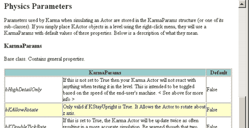
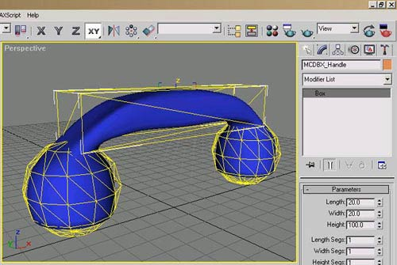
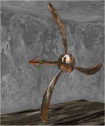
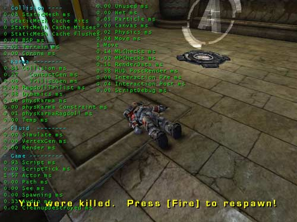

# Introduction to Karma

*Document Summary: A table of contents to the Karma documents.**Document Changelog: Last updated by Jason Lentz (DemiurgeStudios?), for creation purposes. Original author was Jason Lentz (DemiurgeStudios?).*

* [Introduction to Karma](#introduction-to-karma)
  + [Guide to the Karma Docs](#guide-to-the-karma-docs)
  + [Karma Reference](#karma-reference)
  + [Importing Karma Actors](#importing-karma-actors)
  + [Using Karma Actors](#using-karma-actors)
  + [Karma Authoring Tool](#karma-authoring-tool)
  + [Ragdolls in UT2003](#ragdolls-in-ut2003)
  + [Karma Example Maps](#karma-example-maps)
    - [Karma Colosseum](#karma-colosseum)
    - [Karma Example UT2003](#karma-example-ut2003)

## Guide to the Karma Docs

This page briefly describes the contents and purpose of each of the Karma documents. If you aren't sure which document has what you're looking for, this document should help you narrow it down. Below is a list of links to the actual Karma docs described on this page:

* [KarmaReference](KarmaReference.md)
* [ImportingKarmaActors](../../Uncategorized/ImportingKarmaActors.md)
* [UsingKarmaActors](../../Uncategorized/UsingKarmaActors.md)
* [KarmaAuthoringTool](../../Uncategorized/KarmaAuthoringTool.md) (a.k.a. KAT)
* [ExampleMapsKarmaColosseum](../../Uncategorized/ExampleMapsKarmaColosseum.md)
* [RagdollsInUT2003](../../Uncategorized/RagdollsInUT2003.md)
* [KarmaExampleUT2003](../../Uncategorized/KarmaExampleUT2003.md)

---

## Karma Reference

The [KarmaReference](KarmaReference.md) document is a comprehensive guide to all of the features of KarmaActors including removing Karma Integration, activating Karma, explanations of each of the Karma Properties, explanations of KConstraint properties, and tips for debugging Karma and creating good simulations.

---

## Importing Karma Actors

The [ImportingKarmaActors](../../Uncategorized/ImportingKarmaActors.md) document contains a ready made KarmaActor (both in .ASE and .MAX file formats) that you can download and import into your own build. The document also provides explanations on how to create your own Karma Actors using 3rd party modeling programs (such as 3DS Max).

---

## Using Karma Actors

The [UsingKarmaActors](../../Uncategorized/UsingKarmaActors.md) document contains an additional example KarmaActor (both in .ASE and .MAX file formats) that you can download and import into your own build. This document focuses more on how to set up KActors with constraints.

---

## Karma Authoring Tool

The [KarmaAuthoringTool](../../Uncategorized/KarmaAuthoringTool.md) document is an introduction to using KAT for setting up ragdoll physics in character models.

---

## Ragdolls in UT2003

The [RagdollsInUT2003](../../Uncategorized/RagdollsInUT2003.md) document briefly talks about how KAT was used to set up ragdoll physics for the characters in UT2003.

---

## Karma Example Maps

The following documents are example maps that demonstrate how to use Karma in your levels.

### Karma Colosseum

In the [ExampleMapsKarmaColosseum](../../Uncategorized/ExampleMapsKarmaColosseum.md) document, you will see how to create a variety of Karma Objects ranging from simple Karma primitives, to more complex objects made of multiple parts including KConstraints and destructible geometry.

### Karma Example UT2003

The [KarmaExampleUT2003](../../Uncategorized/KarmaExampleUT2003.md) document shows how Karma can be used to create a catapult, swinging door, and a rotating fan with dangling poles. While the map only works with UT2003, its principles should still hold true in a current build of Unreal.

