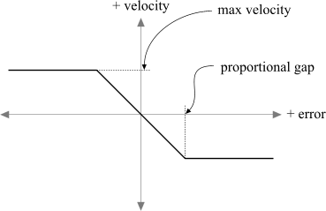

# Karma Reference

*Document Summary: A comprehensive reference for the Karma properties.**Original Author was James Golding. ( [jamesg@epicgames.com](mailto:jamesg@epicgames.com) )*
  
*Updated by Chris Linder ( DemiurgeStudios? ) on 6-10-2003 to update for 2226.*
  
*Updated by Chris Linder ( DemiurgeStudios? ) on 7-9-2003 to add more robust comments for StayUprightStiffness and StayUprightDamping.*
  
*Updated by Chris Linder ( DemiurgeStudios? ) on 8-5-2003 to add more robust comments for KInertiaTensor.*Note - this reference is for 2226 based builds of the Unreal Engine, NOT for UT2003. Much of this information will be useful for UT2003 but there are some small differences.For additional information about Karma see also:[ImportingKarmaActors](../../Uncategorized/ImportingKarmaActors.md)[UsingKarmaActors](../../Uncategorized/UsingKarmaActors.md)[ExampleMapsKarmaColosseum](../../Uncategorized/ExampleMapsKarmaColosseum.md)[CollisionTutorial](CollisionTutorial.md)[KarmaAuthoringTool](../../Uncategorized/KarmaAuthoringTool.md)Karma User Guide: [KarmaUserGuide.pdf](rsrc/Two/KarmaReference/KarmaUserGuide.pdf)

## Contents

* [Karma Reference](#karma-reference)
  + [Contents](#contents)
  + [Removing Karma Integration](#removing-karma-integration)
  + [Introduction](#introduction)
  + [Enabling Karma](#enabling-karma)
  + [Karma Collision](#karma-collision)
  + [Physics Parameters (KParams)](#physics-parameters-kparams))
    - [KarmaParams](#karmaparams)
    - [KarmaParamsRBFull](#karmaparamsrbfull)
    - [KarmaParamsSkel](#karmaparamsskel)
  + [Physics Volumes](#physics-volumes)
  + [Player Interaction](#player-interaction)
    - [Shooting](#shooting)
    - [Pushing](#pushing)
    - [Manipulating](#manipulating)
  + [Joints](#joints)
    - [Joint Types](#joint-types)
      * [Ball And Socket (KBSJoint)](#ball-and-socket-kbsjoint))
      * [Cone Limit (KConeLimit)](#cone-limit-kconelimit))
      * [Hinge (KHinge)](#hinge-khinge))
      * [Car Wheel Joint (KCarWheelJoint)](#car-wheel-joint-kcarwheeljoint))
  + [Debugging](#debugging)
  + [Creating Good Simulations With Karma](#creating-good-simulations-with-karma)
  + [Known Issues](#known-issues)

## Removing Karma Integration

If you don't want to use Karma physics at all, you can stop the integration being compiled in by commenting out the line:`#define WITH_KARMA`in Engine/Inc/Engine.h, and rebuilding everything. You will also find a `metoolkit_dummy` directory which contains empty, null karma libraries. So if you rename this directory to `metoolkit` it will link against these instead of the real ones, which could save you some space.

## Introduction

Karma is a rigid-body physics engine that has been integrated into the Unreal engine from version 829. It allows you to simulate solid objects such as crates, tyres or bones, as well as different joints, motors or springs between objects. Using these simple 'building blocks', complicated systems can be easily built that will behave according to the laws of physics. This can be anything from the classic stack of crates, to swinging lights or doors that can be shot off their hinges, up to 18-wheeler trucks, or characters falling down stairs like a rag-doll when they die.This document briefly covers the fundamentals of using Karma in Unreal. For lots more useful information on using Karma in a game, please have a look at the [Karma Developers Guide](rsrc/Two/KarmaReference/KarmaUserGuide.pdf).If you experience any problems using Karma, do check the UW.log file for any warnings including the world 'Karma'. These can give very useful information about any potential problems.Note: Karma does not cover other types of physics, such as fluid, cloth, smoke, deformable bodies etc.There are 3 ways to use Karma in the Unreal engine. We will come back to each of these cases in more detail later.

* **Level Physics** - This covers systems set up entirely inside the Unreal Editor, that don't require any specialized control. For example, placing crates or barrels around a level, or hanging a chandelier from the ceiling. This type of physics can be set up without writing any UnrealScript.

* **Vehicle Physics** - This covers a system which is placed as one 'unit' in the level, and has specialized UnrealScript code for controlling it. In this case, a new UnrealScript class is created for the vehicle, which will spawn all the parts it needs when the game starts.

* **Rag Doll Physics** - This is refers to using Karma to simulate a skeletal mesh as if it were a collection of bones joined together. This allows much more interesting death sequences such as players tumbling down stairs, or ending up slumped across furniture. To use this description of the physics of the skeleton (mass of each bone, joint limits etc.) needs to be created and assigned.

## Enabling Karma

To use Karma physics to drive the motion of any Actor, you use the new physics type PHYS\_Karma. However, to get it to behave as you want, you will need to set a few things up.

## Karma Collision

Although it is possible to generate contacts directly from triangle meshes, given the high poly counts this is not a very efficient option. Instead, a set of 'collision primitives' (spheres, boxes, cylinders and convex hulls) are fitted to static meshes for Karma contact generation.A utility has been built into the .ASE importer in UnrealEd for Static Meshes for generating this collision information. When creating the graphics for your static mesh (e.g. inside MAX), also create the desired collision primitives. The name of each collision primitive must start with a keyword to identify what it is:

|  |  |
| --- | --- |
| *MCDBX* | Box Primitive |
| *MCDSP* | Sphere Primitive |
| *MCDCY* | Cylinder Primitive |
| *MCDCX* | Convex Mesh Primitive |

(see the [Create in a Modeling Program](CollisionTutorial.md#create_in_a_modeling_program) part of the [CollisionTutorial](CollisionTutorial.md) for more information about creating collision primitives)When you import this .ASE into UnrealEd, you will be asked if you want to store the collision geometry with the static mesh inside the .usx package. When viewing static meshes in the static mesh browser, those that have collision geometry/mass information stored with them are shown with a '\*' prefixed.Each named part will be converted into Karma collision geometry (if possible), and removed from the graphics. A default inertia tensor and centre-of-mass position is also calculated for this static mesh and stored. The collision geometry, inertia-tensor and centre-of-mass position are automatically re-scaled if the Actors DrawScale is changed. For line-checks (e.g. shooting the static mesh), Unreal's triangle-accurate tests are still used by default. This however can be changed by altering the settings of the static mesh. (see the "Collision Models" section of [CollisionTutorial](CollisionTutorial.md) for more details.)There is also support for colliding against parts of the level not constructed using static meshes with collision geometry. Terrain collision works by querying the heightfield to find just the set of triangles underneath the Actor, and passing these to Karma's triangle-primitive collision system. This will also ignore 'invisible' parts of the terrain used for tunnels etc, and will take into account 'flipped' triangles. For BSP collision, the BSP is queried to find a set of potentially-colliding triangles, and these are put together with any terrain triangles before being passed to Karma to generate contacts. Generating good contacts from arbitrary collections of triangles is potentially difficult, so static-meshes with simplified collision geometry usually produce better results.Please note that if you are using PHYS\_Karma, you will probably need to disable the usual Unreal collision. This is because Karma may well try to move the Actor into a position which Unreal would not normally allow (e.g. two chairs with legs interlocking). For more on Actors using Karma blocking players see Player Interaction below.

## Physics Parameters (KParams)

Parameters used by Karma when simulating an Actor are stored in the KarmaParams structure (or one of its sub-classes). If you simply place KActor objects in a level using the right-click menu, they will use a KarmaParams with default values of these properties. Below is a description of what they mean.

### KarmaParams

Base class. Contains general properties.

| **KarmaParams** | | **Default** |
| --- | --- | --- |
| *bHighDetailOnly* | If this is not set to True then your Karma Actor will not react with anything when testing it in the level. This is intended to be toggled based on the speed of the end-user's machine. < See above for more info > | False |
| *bKAllowRotate* | Only valid if KStayUpright is True. It Allows the Actor to rotate about z axis. | False |
| *bKDoubleTickRate* | If this is set to True, the Karma Actor will be update twice as often resulting in a more accurate simulation. Be warned though that two objects of different TickRates may not collide. | False |
| *bKNonSphericalInertia* | If this is set to True, the Karma Actor will use a non-spherical inertial tensor. This is slower to calculate but more accurately simulates the inertia of an object. If you are using *KarmaParamsRBFull, the values specified in \_KInertiaTensor* will be used; otherwise the collision hulls will be used to calculate an inertia tensor. | False |
| *bKStayUpright* | If this is True then the Karma Actor will try to keep its orientation upright. See *StayUprightStiffness* and *StayUprightDamping* below for more details. | False |
| *KActorGravScale* | Here you can set an individual gravity multiplier for your this Karma Actor. This multiplier will be overridden by a PhysicsVolume though. Also note that if this setting is made greater than 1 it may cause the Karma Actor to sink the world geometry. | 1.0 |
| *KAngularDamping* | This is the amount of force applied to reduce angular motion of the Actor to create rotational drag. The greater the value, the more it will resist rotation. | 0.2 |
| *KBuoyancy* | This will allow the Karma Actor to be able to float within a WaterValue. A value of 1 will cause the Actor to free float in the direction it was last moving in until it comes to rest. In order for the Actor to float upwards, it must have a setting greater than 1 even if only slightly. | 0.0 |
| *KLinearDamping* | Like KAngularDamping, this is the amount of force applied to reduce linear motion of Actor causing translational drag. The greater the value the more it will resist movement in a linear direction. | 0.0 |
| *KMass* | This is a multiplier value for determining the Mass of an Actor that is relative to the total volume of the Karma Primitives. It does not determine the absolute Mass of an Actor. | 1.0 |
| *KStartAngVel* | Once triggered, the Karma Actor will rotate in the rotational direction specified in these fields. | 0,0,0, |
| *KStartEnabled* | If set to True, this will cause the Actor to start simulating as soon as it is spawned. | False |
| *KStartLinVel* | Once triggered, the Karma Actor will move in the linear direction specified in these fields. | 0,0,0 |
| *KVelDropBelowThreshold* | If the Karma Actor drops below this speed then a function (yet to be written) will be called. This function may be whatever you want, but you'll have to code it in. | 1000000 |
| *Repulsors* | As of 2226 these must be set up in code and can not be added in Unrealed. | none |
| *SafeTimeMode* | This setting determines when to do a 'safe time' check to avoid this actor passing through other things. This can be set to 1 of 3 values: KST\_Always, KST\_Auto, and KST\_None. KST\_Auto means it will only do it when it thinks it needs to (ie moving fast). | KST\_None |
| *StayUprightStiffness* | This is the stiffness with which objects with *bKStayUpright* set to true will try to stay upright. It might be helpful to think of *StayUprightStiffness* as the "stiffness" of a spring. If you have a very stiff spring, like from the suspension of a car, and you bend it, it will very quickly bounce back to being straight. If your spring is not very stiff, like a spring from a screen door or a Slinky, it will wobble around a lot and not snap quickly back to being straight. The larger *StayUprightStiffness* is, the faster the karma object will snap back to being upright. | 50 |
| *StayUprightDamping* | This is the damping with which objects with *bKStayUpright* set to true will try to stay upright. *StayUprightDampening* is designed to slow down the oscillation of the karma object. It is sort of like friction for rotation. If you are still thinking of the spring analogy, think of damping as like putting the stiff spring under water or in molasses. It will wobble back and forth a lot less. It will always come back to the center but it will be slower. Molasses is more damping than water and a lot more than air. If you do not have enough damping your karma object will wobble back and forth and take a long time to come to rest in the center. | 0 |
| **KarmaParamsCollision** | | **Default** |
| *KFriction* | This sets the resistance due to friction on a surface. Values between 0 and 1 are good but outside of that, the object may never achieve a state of rest or always remain at rest. | 0.0 |
| *KImpactThreshold* | If the Karma Actor is impacted by a value greater than this setting, a function (yet to be written) will be called. This function may be whatever you want, but you'll have to code it in. | 1000000 |
| *KRestitution* | This determines the `bouncyness' of the Karma Actor, where 0 = no bounce and 1 = incoming velocity is equal to outgoing velocity | 0.0 |

### KarmaParamsRBFull

Subclass of KarmaParams. Assigning one of these to an Actor instead of a basic KarmaParams allows over-riding the default static mesh physics properties for this Actor.

| **KarmaParamsRBFull** | | **Default** |
| --- | --- | --- |
| *KInertiaTensor* | Mass distribution of Actor - indicates how easily it can be spun. This is the 'identity' inertia tensor, for an object with a KMass of 1 and a DrawScale of 1. It will be scaled internally if KMass or DrawScale are changed. Inertia Tensors can be anything but in most cases it is easier to only use 3 of the 6 fields. Index [0] is how difficult it is to roll the object, index [3] is how difficult it is to pitch the object and index [5] is how difficult it is to yaw the object. Set the other fields to 0. The larger these numbers are, the more the object will resist rotating. If all these numbers are very large the object will appear to be heavier than it is. | 0.4 (diagonal) |
| *KCOMOffset* | Centre-off-mass position of Actor, relative to the static mesh origin. This is for a DrawScale of 1; it will be scaled internally if DrawScale is changed. | 0, 0, 0 |

### KarmaParamsSkel

Subclass of KarmaParams. Used specifically for Actors using RagDoll physics.

| **KarmaParamsSkel** | | **Default** |
| --- | --- | --- |
| *KSkeleton* | Text name of Karma Asset to load from .me file to use to simulate this skeletal mesh. | none |

## Physics Volumes

Actors simulated using Karma will use the gravity specified by the Physics Volume they are currently in.

## Player Interaction

Having the player interact with Karma simulated actors is a subtle area. There are three main types on interaction.

### Shooting

This works at the moment. The default behavior for each Actor derived from KActor is to have an impulse applied to the point where the shot hit.

### Pushing

Having the player interact directly with other Karma Actors is a little more difficult.
Currently players can be pushed around by Karma Actors and that is all. More complex interaction such as see-saws and jumping onto stacks can be added in the future.

### Manipulating

Currently there is no direct support for the user picking up and moving other Karma Actors. However, there are special constraint types that allow a player to pick up and manipulate objects (making stacks etc.), and these could be exposed in the future as needed.

## Joints

There is a special class of Actor used to join other Actors together in different ways - the *KConstraint* class. A 'constraint' is just some relationship that will be enforced between two Actors, or between one Actor and the world. This includes joints, but can also cover springs, motors, sliders etc.Below KConstraint in the Actor Browser you will find several joint types that can be used (more will be added in the future). Here are the parameters common to all constraint types.

|  |  |  |
| --- | --- | --- |
|  | | **Default** |
| *KConstraintActor1* | First Actor to connect with this joint. | |
| *KConstraintActor2* | Other Actor to connect with this joint. Leave blank to connect KConstraintActor1 to world. | |
| *bKDisableCollision* | Disable Karma collision between two Actors joined together. | True |
| *KForceThreshold* | Force inside constraint at which KForceExceed UnrealScript event is triggered. | 0 |

### Joint Types

Some parameters are specific to particular joint types. Also, the orientation of the constraint may be important, depending on the type of constraint.

#### Ball And Socket (KBSJoint)

This simply pins a point on one Actor to a point on another. There are no parameters to set up.

#### Cone Limit (KConeLimit)

The cone limit isn't really a joint; it is used for adding limits to other joints by restricting the angle between them (KHalfAngle). For example, you could add hard stops to a swing door, or prevent a lampshade swinging more than 45 degrees from the vertical.

|  |  |  |
| --- | --- | --- |
|  | | **Default** |
| *KHalfAngle* | Size of cone to limit Actors to. Uses Unreal scale of 65535 = 360 degrees. |
| *KStiffness* | How 'springy' the limit is when you hit it A larger number makes a hard stop, a small number makes a springy stop. |
| *KDamping* | How much damping the limit has when you reach it. |

#### Hinge (KHinge)

As well as acting as a simple hinge, it can be used as a spring or a motor. This is defined by the KHingeType parameter. The options are:

|  |  |
| --- | --- |
| *HT\_Normal* | Basic hinge. Free to rotate about given axis. |
| *HT\_Springy* | Hinge acts like a spring about its desired angle. |
| *HT\_Motor* | Hinge acts as a motor. |
| *HT\_Controlled* | Hinge acts like a motor, but trying to achive a desired angle. |

The parameters that are used to configure the hinge are given below.

|  |  |  |
| --- | --- | --- |
|  | | **Default** |
| *KHingeType* |  | HT\_Normal |
| *KStiffness* | HT\_Spring only. | 50 |
| *KDamping* | HT\_Springy only. | 0 |
| *KDesiredAngVel* | HT\_Motor and HT\_Controlled only. | 0 |
| *KMaxTorque* | HT\_Motor and HT\_Controlled only. | 0 |
| *KDesiredAngle* | HT\_Springy and HT\_Controlled only. Angle to try and get achieve, either as a spring or as a motor. | 0 |
| *KAltDesiredAngle* | Alternative angle to use if KUseAltDesired is True. (65535 = 360 degrees) | 0 |
| *KUseAltDesired* | Use KAltDesiredAngle instead of KDesiredAngle for desired angle. (65535 = 360 degrees) | False |
| *KProportionalGap* | HT\_Controlled only. | 8200 |

The 'controlled' option uses a simple controller to drive the hinge motor to a particular angle. This is useful for driving pieces of machinery (cranes etc.). It does this by setting the desired velocity for each timestep to achieve the desired orientation. If the current error is more than KProportionalGap, the velocity will be KDesiredAngVel. Once the error is between 0 and KProportionalGap, the velocity will slowly ramp down until it achieves the desired angle.

KHinges can be also be triggered in the same way as movers etc. By setting the initial state of the KHinge, different behaviors can be achieved.

|  |  |
| --- | --- |
| *ToggleMotor* | Trigger will cause the hinge type to change to HT\_Motor. Another trigger will toggle it to HT\_Controlled, and set KDesiredAngle to its current angle, so it will try to maintain it. |
| *ControlMotor* | Trigger will turn motor on. Untrigger will turn toggle it to HT\_Controlled, and it will try and maintain its current angle. |
| *ToggleDesired* | Trigger will toggle the hinge between using KDesiredAngle and KAltDesiredAngle. It will use whatever the current KHingeType is to achieve this, so this is only useful with HT\_Controlled and HT\_Springy. Another trigger and it will use KDesiredAngle again. |
| *ControlDesired* | Trigger will cause the hinge to use KAltDesiredAngle. Untrigger will cause it to use KDesiredAngle. |

#### Car Wheel Joint (KCarWheelJoint)

This is a specialized type of joint used for connecting wheels to vehicles, and allows you so set up suspension, steering and drive. The steering works in the same way as the KHinge constraint HT\_Conrolled mode.

|  |  |  |
| --- | --- | --- |
|  | | **Default** |
| *KSteerAngle* | Current desired steering angle for this wheel. (65535 = 360 degrees) | 0 |
| *KProportionalGap* | See KHinge. Used for steering controller. (65535 = 360 degrees) | 8200 |
| *KMaxSteerTorque* | See KHinge. Used for steering controller. | 1000 |
| *KMaxSteerSpeed* | See KHinge. Used for steering controller. (65535 = 1 rev/sec) | 2600 |
| *bKSteeringLocked* | Indicates if wheel can be steered or are locked straight ahead. | True |
| *KMotorTorque* | Max drive torque applied to achieve KMaxSpeed. See KMaxTorque on KHinge. | 0 |
| *KMaxSpeed* | Max drive angular velocity to try and achieve. See KDesiredAngVel on KHinge. (65535 = 1 rev/sec) | 655350 |
| *KBraking* | Amount of braking torque to apply. | 0 |
| *KSuspLowLimit* | Lower hard stop on suspension. | -1 |
| *KSuspHighLimit* | Upper hard stop on suspension travel. | 1 |
| *KSuspStiffness* | Suspension spring stuffness. | 50 |
| *KSuspDamping* | Suspension damping. | 5 |
| *KSuspRef* | Equilibrium (unloaded) position of suspension. | 0 |

## Debugging

There are several very useful console commands that are very useful for figuring out what exactly is going on with your simulation:

|  |  |
| --- | --- |
| *kdraw collision* | Show all karma collision geometry in green wireframe. |
| *kdraw contacts* | Show active contacts indicating position, penetration and normal. |
| *kdraw joints* | Show joints including limits. |
| *kdraw triangles* | Show all terrain/bsp triangles being considered by Karma collision. |
| *kdraw com* | Show the centre of mass of Karma-simulated Actors. |

You can also toggle these options using the Debug Menu (press 'Esc').It is worth checking the UW.log file regularly, especially if you are having problems, as this can contain useful warnings.

## Creating Good Simulations With Karma

Take a look at the 'Creating Good Simulations With Karma' chapter in the Karma User Guide (page 85) for lots of useful information.

## Known Issues

* Currently there is a hard limit on the number of objects (about 200) that can be simulated at the same time. This is due to memory considerations, and should be made more flexible in the future.

* The swept check when moving Karma actors is imperfect. So if you have a very small Actor, moving very fast, it can pass straight through a wall and will not be detected. This will be improved in the near future.

