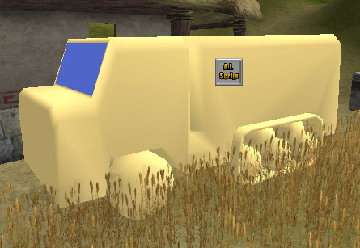
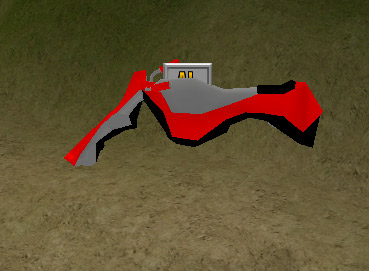
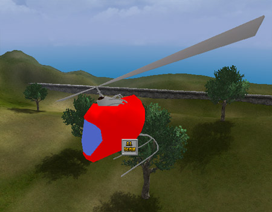

# Simple SVehicle Examples

*Document Summary: An introduction to setting up SVehicles (Skeletal Vehicles) for the Runtime, including a downloadable Mod and the source art for creating the vehicles.**Document Changelog: Last updated by Michiel Hendriks, v3323 updates. Previously Updated by Jason Lentz to include Document Summary and additional installation instructions (DemiurgeStudios?). Created by Chris Linder (DemiurgeStudios?) on 11-12-03.*

## Unsupported Disclaimer

The code described in this document is provided to you as a service of UDN or other licensees. It is not supported by Epic.

* [Simple SVehicle Examples](#simple-svehicle-examples)
  + [Unsupported Disclaimer](#unsupported-disclaimer)
  + [Related Documents](#related-documents)
  + [Introduction](#introduction)
  + [Installing SVehicle Examples.](#installing-svehicle-examples)
  + [Compiling new SVehicles for the Runtime](#compiling-new-svehicles-for-the-runtime)
  + [The Example Vehicles](#the-example-vehicles)
    - [Buggy](#buggy)
    - [Tank](#tank)
    - [APC](#apc)
    - [HoverBike](#hoverbike)
    - [PodChopper](#podchopper)
    - [FlyingSaucer](#flyingsaucer)

## Related Documents

[RuntimeSVehicles](../../Uncategorized/RuntimeSVehicles.md),
[SVehicleCreation](../../Uncategorized/SVehicleCreation.md),
[SVehicleReference](../../Uncategorized/SVehicleReference.md),
[SCarReference](../../Uncategorized/SCarReference.md),
[SCopterReference](../../Uncategorized/SCopterReference.md),
[HelicopterTutorial](../../Uncategorized/HelicopterTutorial.md)

## Introduction

SVehicles are the most commonly used type of vehicle in the Unreal engine. SVehicles (SVehicle stands for Skeletal Vehicle) are made of skeletal meshes as opposed to static meshes. Because the meshes have skeletons, SVehicles can include things like tires and moving gun turrets in the single mesh for the vehicle.This document contains example SVehicles intended primarily for the Unreal Runtime. These examples are still useful even if you are not using the Runtime as they are more examples of how to create SVehicles which include both code and source art. The example vehicles are very rough and are not in any way meant to represent final tuned vehicles. They exist simply to quickly demonstrate the SVehicle system and give a starting point from which to work.

## Installing SVehicle Examples.

This document includes zip files for the source code, and animation and texture packages, as well as source art made in 3DS MAX This document also includes an Unreal Runtime U-Mod that will install all the source code, art packages, compiled code, and an example map so you can you immediately test and play with the example vehicles. Please note that the U-Mod is intented for the Unreal Runtime version 2226.19.03. If you have a different version of the Runtime, the SVehicle examples may not work. To check the version of the Runtime open *Manifest.ini* in the System sub-directory in your Runtime directory and search for the text `"Version="`. Additionally a roughly (not as polished as the original) ported version for codedrop 3323 is available (source only).If you are using the Runtime, simply download the [examplesvehicleumod.zip](../../assets/examplesvehicleumod.zip)), unzip it and run *ExampleSVehicleUMod.urm*. If you can not simply run *ExampleSVehicleUMod.urm* this probably means you unchecked the "Runtime modification association" box when installing the Runtime. In that case you will have to follow the steps below:

1. Open [examplesvehicleumod.zip](../../assets/examplesvehicleumod.zip) and extract *ExampleSVehicleUMod.urm* to the `"System"` directory of the Runtime.
2. Open a command prompt in the `"System"` directory of the Runtime.
3. Type ="setup install ExampleSVehicleUMod.urm"

In either case, follow the instructions presented in the install window and this will install the SVehicle examples for the Runtime.If you are using a build other than the Runtime you should just download the [examplesvehiclenobin.zip](../../assets/examplesvehiclenobin.zip)) which contains the source code, and animation and texture packages and compile these for your build of the engine. Note that this code will not compile on the first try for most 2226 builds of the engine because *PodChopper* extends *SHelicopter* which does not exist in the normal 2226 SVehicle code (see [HelicopterTutorial](../../Uncategorized/HelicopterTutorial.md) for more details on SHelicopters).As for the [examplevehicles3323.zip](../../assets/examplevehicles3323.zip) of this example, it requires much more magic, the SHelicopter is needed, but also the SHover and SHalfTrack vehicle classes are required (these classes don't exist in the original 3323 code drop, a basic port of these classes can be found [examplevehicles3323natvie.zip](../../assets/examplevehicles3323natvie.zip)). This port isn't as nice as the original, use the Runtime binary if you just want to see it in action.The source art for the SVehicles presented in this example can be found in the [roughvehicles.zip](../../assets/roughvehicles.zip)). The vehicles were created in 3DS MAX and are exported like normal skeletal meshes using Actor X. They were imported normally except for *car.max* and *apc.max* which must have the "Assume Maya coordinates" box checked on import of the PSK (despite that fact that they come from MAX). This makes the wheel and suspension coordinate systems align correctly. Once in UnrealEd, collision was added to the meshes (see the[AnimBrowserReference](../Animation/AnimBrowserReference.md#collision) for details on adding collision) and some of the meshes were scaled. For more details on creating art for SVehicles see the [SVehicleCreation](../../Uncategorized/SVehicleCreation.md) document.NOTE: In order to see the SVehicles in the Actors Browser after installing the mod, you must open up the example map first. Once the map loads, you will be able to place SVehicles in any map.

## Compiling new SVehicles for the Runtime

If you want to make changes to the code of the SVehicles you will need to recompile the example vehicles. See the [RuntimeSVehicles](../../Uncategorized/RuntimeSVehicles.md#compiling-new-svehicles) document for more details on compiling new SVehicles.

## The Example Vehicles

Below are brief descriptions of the six example SVehicles. Please keep in mind that the example vehicles are only meant as starting points for your own vehicles and should not be considered final or refined. To get in and out of all these vehicles press the *Use* key when you are next to the AI Script icon or in v3323 when you are "close" enough. In the Runtime *Use* is "Enter" by default but you can bind "E" to *Use* by typing `"set input e use"` at the in-game console.

### Buggy

This is your basic car with suspension. When you go over bumps or around turns you will see the wheels and suspension compress and expand.**Controls**

| Command | Input You Press |
| --- | --- |
| Gas | *Forward* |
| Brake/Reverse | *Back* |
| Turn Left | *Strafe Left* |
| Turn Right | *Strafe Right* |

### Tank

This is your basic tank. This is fairly similar to a heavy car but the suspension and "wheel" movement are handled differently. Unfortunately the thank doesn't shoot.**Controls**

| Command | Input You Press |
| --- | --- |
| Gas | *Forward* |
| Brake/Reverse | *Back* |
| Turn Left | *Strafe Left* |
| Turn Right | *Strafe Right* |

### APC

The APC is a half track in that it is half normal wheels and half track / treads. Half tracks do not seem to work well yet and this vehicle does not drive well in many cases.**Controls**

| Command | Input You Press |
| --- | --- |
| Gas | *Forward* |
| Brake/Reverse | *Back* |
| Turn Left | *Strafe Left* |
| Turn Right | *Strafe Right* |

### HoverBike

The HoverBike is a hovering device that floats a short distance above the ground. This version is pretty bouncy but that is because it is more fun this way.**Controls**

| Command | Input You Press |
| --- | --- |
| Gas | *Forward* |
| Brake/Reverse | *Back* |
| Turn Left | *Strafe Left* |
| Turn Right | *Strafe Right* |

### PodChopper

The PodChopper is a funny little pod helicopter. It is probably the hardest vehicle to operate but it is also one of the most fun once you get the hang of it.**Controls**

| Command | Input You Press |
| --- | --- |
| Spin Rotor Faster / Go Up | *Jump* |
| Spin Rotor Slower / Go Down | *Crouch* |
| Tilt Forward | *Forward* |
| Tilt Back | *Back* |
| Tilt Left | *Strafe Left* |
| Tilt Right | *Strafe Right* |
| Turn Left | *Mouse Look Left* |
| Turn Right | *Mouse Look Right* |

### FlyingSaucer

The FlyingSaucer is a hovering flying spaceship vehicle. It will stay floating in the air even if you get out. This vehicle is very forgiving to fly. Don't forget to try surfing on the top of the saucer when you get out of the vehicle when it is still moving fast.**Controls**

| Command | Input You Press |
| --- | --- |
| Go Up | *Jump* |
| Go Down | *Crouch* |
| Fly Forward | *Forward* |
| Fly Back | *Back* |
| Fly Left | *Strafe Left* |
| Fly Right | *Strafe Right* |
| Turn Left | *Mouse Look Left* |
| Turn Right | *Mouse Look Right* |

