# StaticMeshes Tutorial

*Document Summary: A guide to using static meshes, the static mesh browser, static mesh conversions, and properties. Useful for beginners and intermediate skill levels.**Document Changelog: Last updated by Chris Linder(DemiurgeStudios?), to updating collision information. Original author was Lode Vandevenne ([UdnStaff](https://udn.epicgames.com/Main/UdnStaff)).*

* [StaticMeshes Tutorial](#staticmeshes-tutorial)
  + [What are Static Meshes / Hardware Brushes?](#what-are-static-meshes-hardware-brushes)
  + [The Static Mesh Browser](#the-static-mesh-browser)
  + [Importing a Static Mesh](#importing-a-static-mesh)
  + [Converting a Brush or Animated Mesh to a Static Mesh](#converting-a-brush-or-animated-mesh-to-a-static-mesh)
  + [Converting a Static Mesh to a brush](#converting-a-static-mesh-to-a-brush)
  + [Adding a Static Mesh](#adding-a-static-mesh)
  + [Static Mesh Properties](#static-mesh-properties)
  + [Collision](#collision)
  + [References](#references)

## What are Static Meshes / Hardware Brushes?

A StaticMesh (formerly known as "Hardware Brushes") is a set of polygons that is drawn by the hardware of your graphics card. They are much faster, can handle many more polygons, are invulnerable to BSP holes and look better than normal brushes or animated meshes. StaticMeshes get their name since they are drawn as meshes that never change, so they can be cached in the video memory. This way you get much higher performance.You can convert any brush or animated mesh to a Static Mesh and you can convert any Static Mesh to a brush. You can also import Static Meshes from \*.ase files. The Static Meshes are stored in packages, \*.usx files, the same way as textures, sounds, music etc. are stored.Normal brushes should only be used for the very basic layout of your map and to subtract things out of the opaque world, for very nice lighting, or if you want to use special surfaces such as mirrors, fake backdrops or panning surfaces. All other brushes should be converted to a Static Mesh, especially if they have a lot of polygons.For example the map Mesas is made of almost nothing but StaticMeshes: notice there are only 8 visible polys of normal brushes on the screenshot

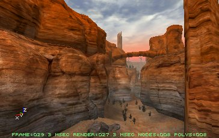

## The Static Mesh Browser

To get the Static Mesh Browser, press the Static Mesh Browser button in the upper toolbar.

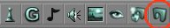

You will get the Static Meshes Window.

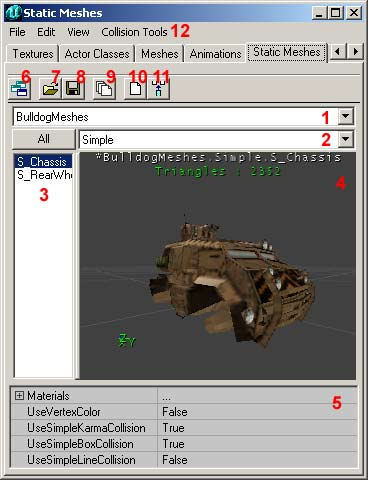

This window shows all the Static Meshes that are in a package. It works the same way as the Sound Browser, the Texture Browser, etc... This means, all Static Meshes use a skin from this browser, and if you change it in the browser all Static Meshes that use the changed skin, will be changed as well. Here's what the numbered buttons and parts on the screenshot mean:1. In this list you can select one of the packages you opened.2. In this you can choose a group inside the selected package, if there is any group. If you press the "All" button, all groups will be shown at the same time.3. This list shows all the Static Meshes that are inside the selected package or group.4. This is the preview window, in which you will see the Static Mesh. You can move the camera in this window the same way you move the camera in the 3D View of the editor.5. In this field you can control collision as well as switch the textures per each material of the static mesh. You can also toggle on and off using Vertex Colors, Simple Karma Collision, Simple Box Collision, and Simple Line Collision.6. If you press the Toggle Dock Status button, the Static Meshes Window will be docked or released from the main browser window.7. The Open Package button allows you to open a Static Mesh Package from your hard drive. Static Mesh Packages have the \*.usx file type.8. The Save Package button allows you to save the selected package on your hard drive, in the *StaticMeshes* directory. If you made a new package or modified one, and used some elements from it in your map, never forget to SAVE the package, otherwise the map will not be playable.9. With the Load Entire Package button, you load all the Static Meshes from the selected package from your hard drive, if not all the Static Meshes are loaded because the map you opened uses only some of them.10. When you press the Create Static Mesh From Selection button, all the selected brushes, actors and Static Meshes will be converted to a new Static Mesh. More about this later.11. If you press Insert Static Mesh into Level button, the selected Static Mesh will be added into your map, snapped at the position of your camera.12. The menu bar is specific to each of the browsers. Below are all of the actions found in each of the menus:

* File - From here you can Open and Save Static Mesh \*.usx files, or Import a Static Mesh from an \*.ase file. More about this later.
* Edit - This allows you to Delete, Rename, or Load Entire Package. You can also

add the package to the level or create one from a selection, and at the bottom of this menu you can advance to the next or previous package.

* View - Here you have a variety of different view modes for the preview window (#4).
  + Show Collision - This displays a light pink wireframe of the collision hull.
  + Karma Primitives - This displays the representation of the collision boundary used by Karma. The Karma collision boundary supports sphere, cylinder, box, and convex (which is stored only as vertices, not as edge faces). The different colors of the Karma collision boundary indicate the different primitives that make up the collision hull (the fewer the better -ideally you'll have just one). The number of the total Collision Primitives is also displayed in the preview window (#4).
  + Karma Mass Properties - This shows a visual representation as a box defining the mass of the object as well as the center of mass of the object shown as exaggerated vertices.
* Collision Tools - These allow you to generate different complexities of collision hulls for your static mesh.

## Importing a Static Mesh

You can import \*.ase files into the Static Mesh Browser. Open the File Menu, choose Import... and browse to your \*.ase file. You will get the Import Static Mesh Window

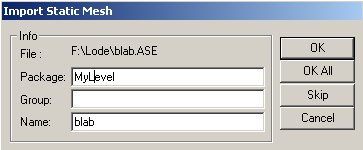

In Package, enter the name of the package you want the new Static Mesh to be stored in. If you use the MyLevel package, the Static Mesh will be stored in the file of the map you are making (the \*.unr file). If you use any other package name, never forget to save the package before you close the editor or want to test the map.In Group, enter the name of the group in which you want the Static Mesh to be put. If you enter nothing, it will not be put in any group.In Name, enter the name you want the Static Mesh to get in the package.If you had selected more than 1 \*.ase files in the browser window, you can use OK All to automatically import all the files in the package and group you selected. They will get the same name as their filename.If you use another package than MyLevel, don't forget to SAVE your package!

## Converting a Brush or Animated Mesh to a Static Mesh

Instead of Importing a Static Mesh, you can also convert any brush to a new Static Mesh. To convert a brush to a static mesh, right click on it, expand Convert and choose To Static Mesh.

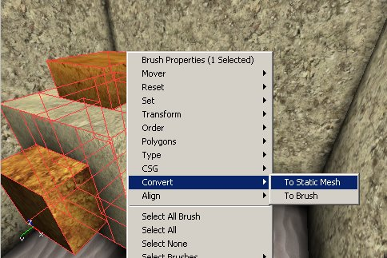

You can also press the "Create Static Mesh From Selection" button in the Static Mesh Browser instead.This works with any brush, no matter if it's blue, yellow, red or anything else. However, if you convert a subtractive (yellow) brush to a static mesh, the mesh will be additive, as if the yellow brush would have been a blue one. When you press "To Static Mesh," you get the New Static Mesh Window. It is exactly the same as the Import Static Mesh Window; you have to fill in a package, a group and a name again.

You should now be able to see the Static Mesh in the browser

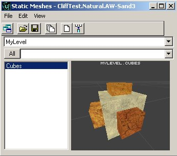

Before you convert, make sure the red Pivot Point is on the brush, because this point becomes the center of the Static Mesh. Click on one of the vertices of the brush to place the Pivot Point there, or right click on the grid and choose Pivot --> Place Pivot (Snapped) Here.If you select multiple brushes and convert them, all the selected brushes will be put into one mesh. However if you have made a shape by using different additive and subtractive brushes, you first have to intersect the whole thing into one brush, because otherwise all the subtractive brushes become additive.

You can also convert normal meshes or other Static Meshes to a new Static Mesh

When you convert a brush to a Static Mesh, Some surface settings like Unlit and Special Lit won't work anymore, but you can still set the complete Static Mesh to Unlit in its display properties.

## Converting a Static Mesh to a brush

You can also convert a Static Mesh to a brush. Right click on a Static Mesh, expand Convert and choose To Brush.Note that it is strongly discouraged to convert a Static Mesh to a brush with the goal of adding it to a level's BSP architecture.
It is likely to cause major performance slowdowns as well as introduce BSP holes, lighting (as BSP polygons are faceted, and can't be smooth shaded like static meshes) and collision problems.

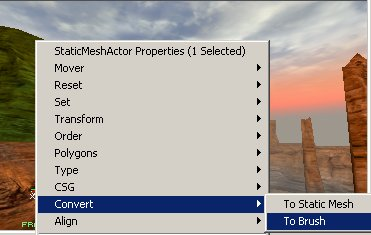

The red brush will now get the same shape as the StaticMesh

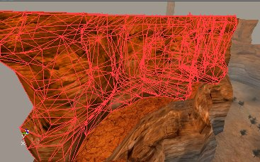

Most of the times, you want to convert a Static Mesh to a brush to change the texture of some surfaces of the Static Mesh. It's not possible to edit them directly on the Static Mesh (Let us hope this will become possible later). You can add the brush in an empty space, edit the textures, and then convert it back to a new Static Mesh, or you can overwrite the old static mesh. If you overwrite the old Static Mesh (put it in the same package with the same name), all these Static Meshes in the map will be updated automatically.Basically, you can convert any kind of brush to any other kind of brush. On the Screenshot, from left to right: an additive brush, a Static mesh, the red builder brush, a skeletal mesh and a subtractive brush.

## Adding a Static Mesh

To add a Static Mesh in your map, select one in the Static Mesh Browser, then right click in one of the 2D or 3D views and in the menu that appears choose Add Static Mesh: 'Package.Name'

After you added it, you can rotate or reposition it the same way you can rotate or reposition any other object or brush. To snap one of the vertices of the Static Mesh to the grid, simply right click on the small white box painted on the vertex when you have selected the Static Mesh (If the white box isn't there, press the Show Large Vertices button

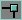

). To place the Pivot Point on a vertex from the Static Mesh, left click on a white box.

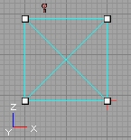

## Static Mesh Properties

If you right click on a Static Mesh, and choose StaticMeshActor Properties. You get the StaticMeshActor Properties. In there expand Display.

**bShadowCast**: if this is True, the Static Mesh will cast shadows, if it is False, it will not.

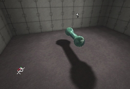

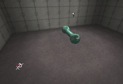**bUnlit**: if this is True, the Static Mesh will always be bright, if it is False, it will have to get light from Light Actors or ZoneLight.

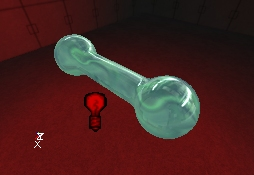

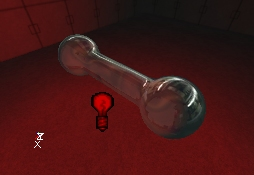**DrawScale**: use this to make the Static Mesh smaller or larger. 1 is the default size, 2 is twice the size, etc...

**DrawScale3D**: this allows you to change the Draw scale independently along the X, Y or Z axis.

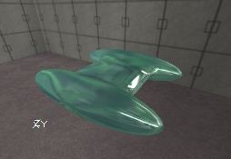

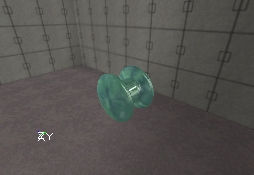**DrawType**: it's because of this setting that this object is a Static Mesh. If this option is set to DT\_StaticMesh, the StaticMesh skin you selected in StaticMesh will be used, otherwise it will be ignored. You can turn any object, even Light Actors or weapons into a Static Mesh by setting this setting to DT\_StaticMesh.**Skins**: this is the Skins Array and it will allow you to overwrite the textures assigned to your StaticMesh while still taking advantage of the StaticMesh as an instance. Just select the texture you wish to use from the Texture Browser. Then add as many skins as you need to replace the appropriate material on the StaticMesh (Skin 0 will replace Material 0, Skin 1 will replace Material 1, etc.). Then to replace the texture, simply hit the Use button and it will assign your prescribed texture to that instance of that StaticMesh.

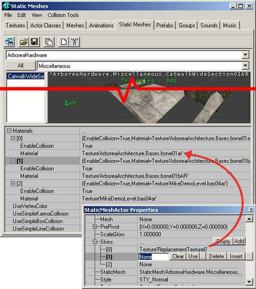

**StaticMesh**: this option determinates what StaticMesh skin is used for this object. You can enter a value by selecting a Static Mesh in the Static Mesh Browser and pressing the Use button.In the Static Mesh Properties, you can also expand **LightColor** and **Lighting** to make your Static Mesh give light, the same way you can do this with any other object. To make the lighting work, you have to set a **LightBrightness**, **LightRadius** and **LightType**. Also set **bShadowCast** to False in Display, otherwise the Static Mesh will shadow its own lighting completely, resulting in no lighting at all.

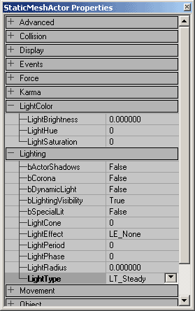

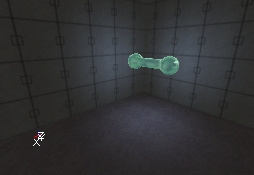You can also give the Static Mesh its own **AmbientSound**: expand **Sound** in its properties, select a sound in the Sound Browser and press the Use button in the **AmbientSound** field. You can also give the sound a pitch, a radius and a volume.

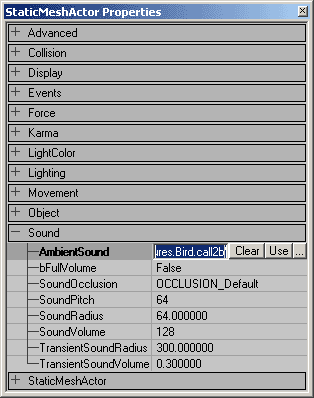

## Collision

For more details about collision for static meshes, see the [StaticMeshCollisionReference](../../Uncategorized/StaticMeshCollisionReference.md) document.One variable worth mentioning that is not covered by the [StaticMeshCollisionReference](../../Uncategorized/StaticMeshCollisionReference.md) document (mainly because it doesn't affect collision) is *bAutoAligntoTerrain* which is in the "Collision" category in properties.**bAutoAligntoTerrain**: If this is True, the static mesh will be locked to the Terrain and when using the Terrain Editor, the static mesh will remain attached and aligned to the Terrain. This is very useful for grass and plant meshes.

## References

Movers also use Static Meshes. More about movers is in the [MoversTutorial](MoversTutorial.md).To get CubeMaps and other effects on the Static Mesh, you need to use the Material System, explained in the [MaterialTutorial](../Lighting and Textures/MaterialTutorial.md).More about the lighting on Static Meshes is in the [LightingBasics](../Lighting and Textures/LightingBasics.md).

