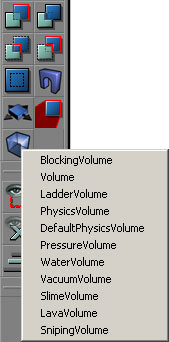
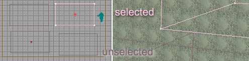
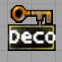
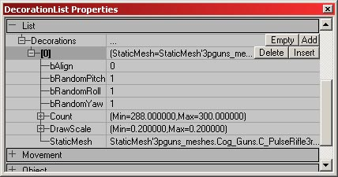
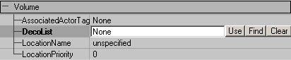
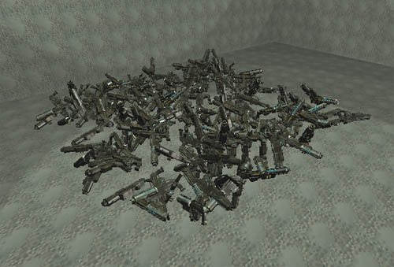
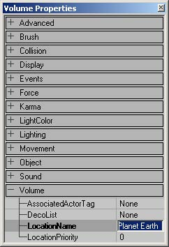
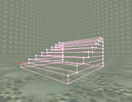
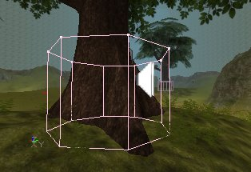

# Volumes

*Document Summary: A reference to setting up and using the various Volume types.**Document Changelog: Last updated by Michiel Hendriks, few v3323 updates. Previously updated by Tom Lin (DemiurgeStudios?) to split doc into manageable chunks. Original author was Lode Vandevenne ([UdnStaff](https://udn.epicgames.com/Main/UdnStaff)).*

* [Volumes](#volumes)
  + [Volumes](#volumes)
  + [Adding a Volume](#adding-a-volume)
    - [Volume](#volume)
      * [AssociatedActorTag](#associatedactortag)
      * [DecoList](#decolist)
      * [LocationName](#locationname)
      * [LocationPriority](#locationpriority)
    - [BlockingVolume](#blockingvolume)
      * [bClampFluid](#b-clampfluid)
      * [bClassBlocker](#b-classblocker)
      * [BlockedClasses](#blockedclasses)
    - [PhysicsVolume](#physicsvolume)

## Volumes

Volumes are invisible brushes that "know" when actors or players enter or leave it. When you are inside a volume, special properties can be set to take place (such as water-style friction, or pain-causing areas). There are several distinct types of Volumes, and the major subsets have their own docs or are covered in more appropriate areas. For more information on these types, see [PhysicsVolumes](https://udn.epicgames.com/Two/PhysicsVolumes) and the [LevelOptimization](../Techniques/LevelOptimization.md#antiportal_volumes) doc. This document will cover more general properties that are common to almost all volumes.

## Adding a Volume

To add a Volume, first give your red brush the shape and location you want, then press the Volume Button

in the left toolbar. Then you get a list where you can choose what Volume you want to add. The Volume and the PhysicsVolume are the motherclasses, the others are subclasses of the PhysicsVolume, some of them with extra features added in the script, others are only PhysicsVolumes with modified properties. If you want to know more about these types of physics volumes, see the [PhysicsVolumes](https://udn.epicgames.com/Two/PhysicsVolumes) document.

When you add a volume in the editor and move away the red brush, it looks like a pink brush (selected) or a purple brush (unselected).

After you have added the Volume, you may freely rotate, resize and relocate it. Volumes are invisible when playing the game, so you might consider representing where a volume is with visible geometry when you are testing.

### Volume

This is the motherclass of the PhysicsVolume. Basically, the only thing you can use it for, is to give a location a LocationName, if this location doesn't need the properties of the PhysicsVolume.

#### AssociatedActorTag

Setting this to the tag of a particular actor will cause the "Touch" and "UnTouch" events to be called on the actor when this volume is touched. This is something that programmers will mostly want to worry about.

#### DecoList

You can use your volume to define the boundaries for a DecorationList actor. This is fairly straightforward, if you know the basics of Unreal editing.First of all , in the Actor list, go to Actor > Keypoint > DecorationList. Add a Decoraration List to your level.

The properties for the decoration list are pretty self-explanatory.

* **bAlign:** This will align your static meshes to the floor below them. Therefore, if your floor is tilted, the decoration meshes will follow that tilt as well.
* **bRandomPitch:** This is a true/false toggle for a random pitch.
* **bRandomRoll:** This is a true/false toggle for a random roll.
* **bRandomYaw:** This is a true/false toggle for a random yaw.
* **Count:** Min and Max values determine the amount of static mesh decorations in the volume.
* **DrawScale:** Min and Max values determine the sizes of the static mesh decorations.
* **StaticMesh:** Choose which mesh to use for your decoration mesh.

Now, in your Volume properties, select the DecoList line. You need to use the `Find' button to fill in this field, and not the `Use' button. Just click on the Find button, and then click the DecorationList icon. Rebuild, and if all went correctly, you should see your volume filled with meshes when you load the level.

Notice that this filled volume generates all the meshes on a plane, even though the volume is nonplanar. The meshes will spawn at the vertical center of the volume.

#### LocationName

You can give all of the Volumes a LocationName. Enter it in the Volume Properties --> Volume --> LocationName.

You can use this LocationName for example to appear next to the player's name when he gives a team message while he's inside this Volume, so the other players know where he is. If you want an area in your map to have a name, but the area doesn't need any of the physics properties, you should use the normal Volume class.

#### LocationPriority

If an actor is in more than one volume, the actor's volume will be set to the volume with the highest priority. There are a few things to keep in mind when dealing with this variable. First of all, higher numbers have higher priorities - therefore, a LocationPriority of 3 will be higher than 1. Secondly, this only affects what volume the actor is considered to be in; it will not affect any effects of volumes that the player is in. For example: If there are two lava volumes, one inside another, if a player is inside the interior lava volume, the damage from both volumes will still affect the player. Though in code the player will be considered to be in `LavaInterior,' and not `LavaExterior.'

### BlockingVolume

A BlockingVolume is simply an invisible, blocking, brush. A blocking volume blocks players and other actors, but it allows zero extent traces (projectiles, rockets, ...) to go through. Players will be able to walk on this invisible staircase, but you can shoot through it:

BlockingVolumes provide faster and better collision than Static Meshes: they add BSP to the map, but they won't cut any other BSP from the level and they can't create BSP-holes because they aren't rendered.To use a BlockingVolume around a Static Mesh, just add a BlockingVolume around it, and then in the properties of the Static Mesh, in Collision, set bBlockNonZeroExtendTraces to False: now the Static Mesh will stop bullets, but will let players walk through. Now, the players are blocked by the BlockingVolume instead.

#### bClampFluid

When set to true the blocking volume will be used as a collision model for fluid surfaces just like the simpel collision model of a static mesh.

#### bClassBlocker

When this is set to true the blocking volume will only block certain classes (defined in [BlockedClasses](#blockedclasses)). Classes in the list will be blocked while others won't. (v3323 and up)

#### BlockedClasses

A list with classes this volume will block (when `bClassBlocker` is set). Only these classes (and subclasses) will be blocked. (v3323 and up)

### PhysicsVolume

A bounding volume which affects actor physics. Each Actor is affected at any time by one PhysicsVolume?. More about these types of volumes can be found in the [PhysicsVolumes](https://udn.epicgames.com/Two/PhysicsVolumes) document.

