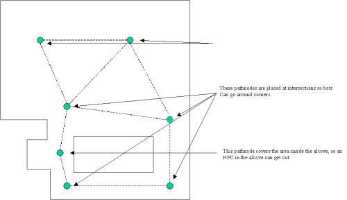

# Navigation AI for Level Designers

*Document Summary: A guide and reference for setting up Pathnodes and using AI Paths.**Document Changelog: Maintained by Richard Nalezynski (RichardNalezynski?). Last updated by Vito Miliano ([UdnStaff](https://udn.epicgames.com/Main/UdnStaff)), for latest updates. Original author was Steve Polge ([EpicGames](https://udn.epicgames.com/Main/EpicGames)).*

* [Navigation AI for Level Designers](#navigation-ai-for-level-designers)
  + [Overview](#overview)
  + [Basic Pathing](#basic-pathing)
    - [Path Nodes](#path-nodes)
  + [Building Paths](#building-paths)
    - [Path Coloring](#path-coloring)
  + [Debugging Paths](#debugging-paths)
  + [Advanced Pathing](#advanced-pathing)
    - [Doors](#doors)
    - [JumpPads](#jumppads)
    - [JumpDests](#jumpdests)
    - [Lifts](#lifts)
    - [Ladders](#ladders)
  + [Keypoints](#keypoints)

## Overview

This document describes how to set up navigation networks in a level so that NPCs can efficiently navigate to any point in the level. The intended audience is level designers.

## Basic Pathing

### Path Nodes

Level designers place `PathNodes` (a subclass of `NavigationPoint`) in their levels on surfaces which NPCs can walk on, or in volumes which NPCs can swim in. `PlayerStarts` are also `NavigationPoints`, and they perform the same navigation function. In addition, `InventorySpots` are automatically placed at the location of every pickup in the level when building paths (they are invisible, but you will be able to see path connections to them).For `PathNodes` to connect, they should be less than **1200** Unreal units apart (programmers can modify **MAXPATHDIST** in `UnPath.h` to change this value). Having two `NavigationPoints` too close together (overlapping) can cause AI navigation problems and should be avoided. When placing `PathNodes`, the goal is to make sure that every area of the level is covered by a `PathNode` or some other `NavigationPoint`. An area is covered if an NPC could walk to some `PathNode` less than 1200 units away completely unobstructed (i.e. without having to step around anything). *([larger version](rsrc/Two/NavigationAI/naviga1.gif))*

## Building Paths

After placing `PathNodes`, the level designer can build the connections between `NavigationPoints` by using the *Build AI Paths* option in the *Build* menu (or by doing a full rebuild). Once paths have been built, they can be seen in the various level view windows by using the *Show Paths* option under the *View* menu.Paths will be displayed as lines from one `NavigationPoint` to another. If NPCs can traverse the path in either direction, there will be two lines, with an arrowhead pointing in each direction. Otherwise, the line will show with an arrowhead in which direction the path can be traversed.Even if the NPCs using the paths are small, it is always better to tweak the `PathNode` positions to make the connecting paths as wide as possible. NPCs will smoothly round corners, or strafe back and forth within a path, so larger paths will result in more natural looking movement.Once a level has a large number of paths, it can take a while to rebuild all the paths. To tweak path placement, use the *Build Changed Paths* button in the *Build Options* menu. This will only rebuild paths between `NavigationPoints` which have been added, removed, or moved. Before saving and playing the level, however, a full path rebuild is required.

### Path Coloring

Once built, paths will be displayed in various colors, indicating important information about the path. The default path coloring of the navigation graph edges is defined as follows:

* **White** - very wide path, which large NPCs can use (large is defined by **MAXCOMMONRADIUS** in `UnPath.h`, with a default value of *120*).
* **Green** - wide path, which moderately large NPCs can use (defined by **COMMONRADIUS**, with a default value of *72*).
* **Blue** - narrow path, useable by smaller NPCs.
* **Purple** - path using a Lift or Teleporter.
* **Light Purple** - path using a Ladder.
* **Yellow** - forced path. A path between two `NavigationPoints` can be forced, if no connection is automatically made, by putting the name of the destination `NavigationPoint` in the **ForcedPaths[]** array property of the source `NavigationPoint` (in the `NavigationPoint` *Properties* sheet).
* **Red** - proscribed path. A path between two `NavigationPoints` can be proscribed by putting the name of the destination `NavigationPoint` in the **ProscribedPaths[]** array property of the source `NavigationPoint` (in the `NavigationPoint` *Properties* sheet).

## Debugging Paths

After building paths, a window may pop up in the editor with a list of pathing errors. Click on an error to take you to the offending NavigationPoint.After the level is completely pathed and paths have been defined, use the *Review Paths* option in the *Tools* menu. The following items are checked:

* All `NavigationPoints` with **bMustBeReachable** set to *true* can be reached from any path in the level.
* All Movers have an appropriate `NavigationPoint` associated with them (unless the `Mover's` editable **bNoAIRelevance** property is *true*).
* Whether or not `PathNodes` should be converted to `JumpDests`.

In a future version, *Review Paths* will also use random walks to verify that the level is completely pathed, and check for redundant `PathNodes`.If an AI NPC seems confused or is doing something funky, the following console commands are available:

* `Viewclass Pawn` - to view the AI NPC in question.
* `ShowDebug` - to see what the AI NPC is thinking and the path it is following.
* `RememberSpot` - to mark a location when check navigation paths while in the level. Then, using `ShowDebug` (without viewing something else) will show you a continually updated path to the marked location.

## Advanced Pathing

### Doors

`Door` `NavigationPoints` should be placed in conjunction with any `Mover` that acts as a door (based on its position, it allows or blocks movement between two areas). The `Door` should be placed in the center of the affected area (typically, in the middle of the actual static mesh used for the door - but low enough to touch the ground). There are also several important properties of a `Door` `NavigationPoint` that should be updated as needed:

* **DoorTag** - the tag of the `Mover` with which this `Door` is associated.
* **DoorTrigger** - if the `Door` is triggered, this is the tag of the trigger actor which will open the `Door`.
* **bInitiallyClosed** - whether the default state of the `Mover` allows movement (if *false*), or prevents it (if *true*, the default value).
* **bBlockedWhenClosed** - if the `Mover` is closed, there is no way for the NPC to open it (*false* by default).

`Movers` now have the **bAutoDoor** property. If set to true, a `Door` `PathNode` is automatically generated for that `Mover`. This should work for most `Doors`.

### JumpPads

`JumpPads` will throw any `Pawn` touching them in a specified direction. `JumpPads` are set up by specifying a destination `PathNode` in the first entry of the **ForcedPaths[]** array property of the `JumpPad`. The appropriate jump velocity is automatically calculated when paths are rebuilt. The **JumpModifier** vector property of the `JumpPad` can be set if for any reason the automatically generated velocity is problematic.

### JumpDests

`JumpDests` should be used instead of `PathNodes` at any spot that is too high to jump up to, but is linked to paths below it. `JumpSpots` will be used by NPCs in low gravity, or if they have some kind of jump boost. The path from which the bot should jump to the `JumpSpot` should have the `JumpSpot` in one of its **ForcedPath[]** array property entries.

### Lifts

A `Mover` used as a lift should never use the **BumpOpenTimed** state (use **StandOpenTimed** instead). `Movers` used as `Lifts` have two types of `NavigationPoints` associated with them. A `LiftCenter` should be placed on the lift at its center. A `LiftExit` should be placed at each exit from the `Lift` (but far enough away so that an NPC standing there will not interfere with the `Lift`). Both the `LiftCenter` and `LiftExits` have a **LiftTag** property which must be set to the tag of the `Mover`. In addition, if the lift is triggered, put the tag of the triggering actor in the **LiftTrigger** property of the `LiftCenter`. `LiftExits` also have an optional property, **SuggestedKeyFrame**, which can be set to the keyframe number of the mover when the `LiftExit` can be used. This may improve navigation by NPCs in some situations.

### Ladders

`LadderVolumes` must be oriented to face the wall being climbed (by adjusting their **WallDir** property, which is displayed as a directional arrow when the `LadderVolume` is selected). In most cases, level designers can allow Ladder `NavigationPoints` to be automatically added when paths are built, at the top and bottom of the `LadderVolume`. However, if there are any problems with the automatically placed Ladders, level designers can manually place the Ladders after setting the `LadderVolume` **bAutoPath** property to *false*. The Ladder centers must be within the `LadderVolume`. The `LadderVolume` should touch the floor at its bottom, and poke over the edge at the top by at least the height of the largest NPC using the Ladder.

## Keypoints

See the [Keypoint Reference](KeypointReference.md) for a list of different Keypoint types and their uses.

