# Example Maps

*Document Summary: A table of contents for all of the Example Maps.**Document Changelog: Last updated by Jason Lentz (DemiurgeStudios?), to move the downloads to the individual examle map pages. Original author was Jason Lentz (DemiurgeStudios?).*

* [Example Maps](#example-maps)
  + [Introduction](#introduction)
  + [Lights](#lights)
    - [Advanced Lighting Effects](#advanced-lighting-effects)
    - [Light Beams](#light-beams)
    - [Triggerable Lighting](#triggerable-lighting)
    - [Fluorescent Lights](#fluorescent-lights)
    - [Swinging Light Fitting for 2107](#swinging-light-fitting-for-2107)
  + [Movers](#movers)
    - [Complex Movers](#complex-movers)
  + [Volumes](#volumes)
    - [Rising Water](#rising-water)
  + [Envrironmental](#envrironmental)
    - [SkyZones](#skyzones)
    - [Underground Caverns](#underground-caverns)
  + [Special Effects](#special-effects)
    - [WarpZones](#warpzones)
    - [Teleporters](#teleporters)
    - [Particle Systems](#particle-systems)
    - [Expanding Pool](#expanding-pool)
  + [Miscellaneous](#miscellaneous)
    - [Scripted Sequences](#scripted-sequences)
    - [Triggers](#triggers)
    - [Sounds](#sounds)
    - [Hardware Shaders](#hardware-shaders)
    - [Karma Colosseum](#karma-colosseum)
    - [Karma Demonstration for 2107](#karma-demonstration-for-2107)
    - [EPIC Demo Maps](#epic-demo-maps)

**NOTE**: *Licensees wanting to run these example maps will need to download the [UDN Build Content](https://udn.epicgames.com/Two/UDNBuildContent). Mod developers are out of luck, as many of the newer example maps are incompatible with UT2003 and UT2004. Try at your own risk.*

## Introduction

This document will contain links to Demos and Example Maps. Feel free to create new pages describing a map or to improve the existing ones and link then add links to them from this site.Click on the link under the particular map section you are interested in to see the doc on that example map. For the actual example maps themselves, you can download them at the bottom of this page if they are not available on the corresponding Example Map page.For better organization this document has been separated into different types of example maps ([Lights](#lightssection), [Movers](#moverssection), [Volumes](#volumessection), [Environmental](#environmentalsection), [Special Effects](#specialeffectssection), and [Miscellaneous](#miscsection)). Some maps may fit into multiple categories so if you can't find something in one section, check other sections that might be related.

---

---

## Lights

### Advanced Lighting Effects

[ExampleMapsAdvLighting](../../Uncategorized/ExampleMapsAdvLighting.md)This map shows how to create various light effects using different combinations of projectors, staticmeshes, shaders, and lights.

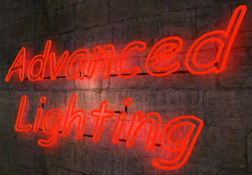

---

### Light Beams

[ExampleMapsLightBeams](../../Uncategorized/ExampleMapsLightBeams.md)This map, submitted by a licensee, shows a way to create close to realistic lightbeams with a SpriteEmitter and a Projector.

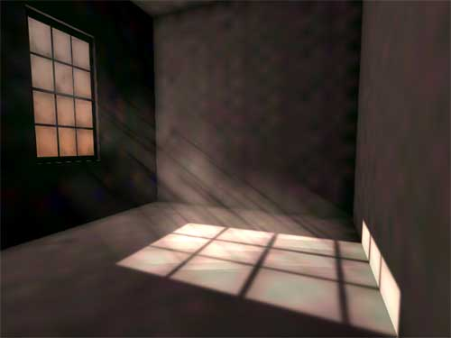

---

### Triggerable Lighting

[ExampleMapsTriggerableLighting](../../Uncategorized/ExampleMapsTriggerableLighting.md)Here you can find the basics on how to create triggerable lights and even see how to create a couple of effects including an illuminated path and (coming soon) how to create fluorescent lights.

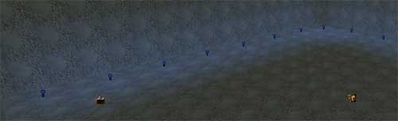

---

### Fluorescent Lights

[ExampleMapsFluorescentLights](../../Uncategorized/ExampleMapsFluorescentLights.md) (this map is for the 927 build)This map has 8 realistic TL lights: if you turn them on, they'll first blink for a while before eventually going on. If you give it a sound, the sound will go on and off too. You may have to increase your volume to hear the sound. You can adjust a lot.

---

### Swinging Light Fitting for 2107

[ExampleMapsSwingingLamp](../../Uncategorized/ExampleMapsSwingingLamp.md) (NOTE: this map is for the 2107 UT2K3 build)This tutorial demonstrates how to combine Karma, projectors and Emitters all into one interactive effect.

---

---

## Movers

### Complex Movers

[ExampleMapsComplexMovers](../../Uncategorized/ExampleMapsComplexMovers.md)This map shows how to set up complicated movers that work together to create more spectacular effects including a rising-self cealing prison chamber and a roller coaster that uses more than 8 KeyFrames.

---

---

## Volumes

### Rising Water

[ExampleMapsRisingWater](../../Uncategorized/ExampleMapsRisingWater.md) (this document also includes maps for the 927 and 2136 builds)There are two example maps here. The first map shows that it's possible to move WaterVolumes, and a way to move the bottom of a waterfall emitter.

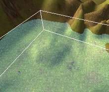

The second map is a small room that fills with water and then drains, but the water surface is a fluid surface that reacts to encroaching players.

---

---

## Envrironmental

### SkyZones

[ExampleMapsSkyZones](../../Uncategorized/ExampleMapsSkyZones.md)In this document you will see how to create various types of SkyZones using sky boxes, sky cylinders, and sky spheres. It also points out the advantages and disadvantages of each type as well as describes some of the effects that can be achieved with SkyZones.

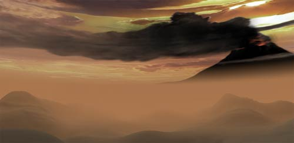

---

### Underground Caverns

[ExampleMapsCaverns](../../Uncategorized/ExampleMapsCaverns.md)Here you will see how to create murky caverns quickly and easily using mainly just two terrains.

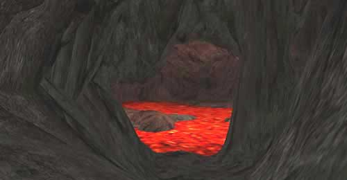

---

---

## Special Effects

### WarpZones

[ExampleMapsWarpZones](../../Uncategorized/ExampleMapsWarpZones.md)This example map demonstrates how to create such effects as rooms that are larger on the inside than they are on the outside, infinite rooms, and ring worlds.

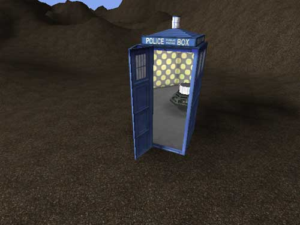

---

### Teleporters

[ExampleMapsTeleporters](../../Uncategorized/ExampleMapsTeleporters.md)Here you will see how to use the various Teleporter Actor propterties to teleport within levels as well as teleporting to other maps. Included in this document are two example maps to play with.

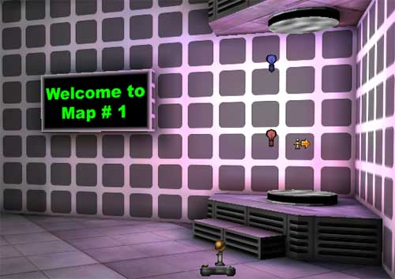

---

### Particle Systems

[ExampleParticleSystems](../Effects/ExampleParticleSystems.md)This example map shows how to set up a variety of different emitters to create all sorts of cool effects including but not limitted to water falls, sparklers, spot lights, fire, and explosions.

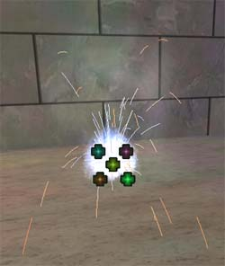

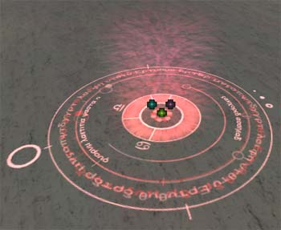

---

### Expanding Pool

[ExampleMapsExpandingPool](../../Uncategorized/ExampleMapsExpandingPool.md) (this map is for the 927 build)This map shows an expanding pool: when you walk on a trigger, wine starts flowing out of a barrel, and creates the pool on the ground. The pool is done with a Projector with an expanding DrawScale. There's also an emitter for the wine spouting out of the barrel.

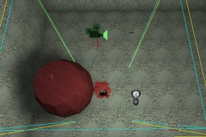

---

---

## Miscellaneous

### Scripted Sequences

[ExampleMapsScriptedSequencesRT](../../Uncategorized/ExampleMapsScriptedSequencesRT.md) - [ExampleMapsScriptedSequencesCD](https://udn.epicgames.com/Two/ExampleMapsScriptedSequencesCD)These two docs demonstrate how to use Scripted Sequences to set up a scene. The Runtime version (the link on the left) is available to the general public, and the link on the right is only available for licensees.

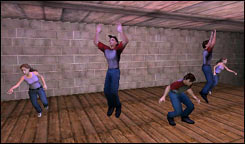

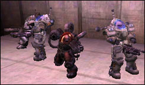

---

### Triggers

[ExampleMapsTriggers](../../Uncategorized/ExampleMapsTriggers.md)This document includes two maps. One demonstrates all of the basic Triggers while the other shows how to use TriggerCondition.

---

### Sounds

[ExampleMapsSounds](../../Uncategorized/ExampleMapsSounds.md)In this map, one can see the various ways in which sounds can be used within your level.

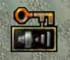

---

### Hardware Shaders

[UsingHardwareShaders](https://udn.epicgames.com/Two/UsingHardwareShaders)This document (from the Technical section) shows how to create your own Hardware Shaders. Note that this example map is not included in the below attachmented files, but it can be downloaded from its own page.

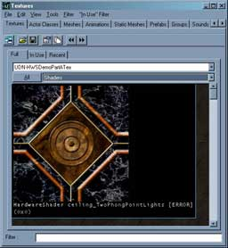

---

### Karma Colosseum

[ExampleMapsKarmaColosseum](../../Uncategorized/ExampleMapsKarmaColosseum.md)In this map you will see how to create a variety of Karma Objects ranging from simple Karma primitives, to more complex objects made of multiple parts including KConstraints and destructible geometry.

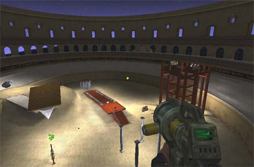

---

### Karma Demonstration for 2107

[KarmaExampleUT2003](../../Uncategorized/KarmaExampleUT2003.md) (NOTE: this map is for the 2107 UT2K3 build)This map shows how Karma can be used to create a catapult, swinging door, and a rotating fan with dangling poles.

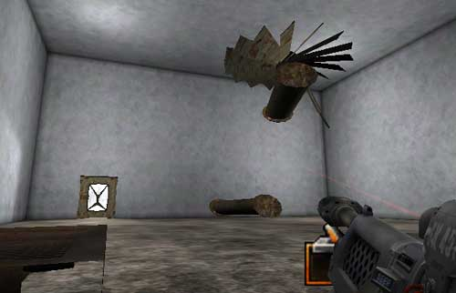

---

### EPIC Demo Maps

[ExampleMapsEPIC](../../Uncategorized/ExampleMapsEPIC.md)This document contains a variety of old example maps by EPIC. This document has very little explanantion, but you can play with the downloadable maps which include a matinee map, materials map, a particle systems map, and a sounds map.

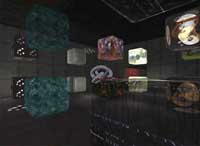

---

*NOTE: The zip files have been relocated to the relevant docs linked to from this page.*

