# Introduction to Level Optimization

*Document Summary: An introduction to optimizing your level.**Document Changelog: Last updated by Michiel Hendriks, minor text changes. Last updated by Jason Lentz (DemiurgeStudios?), to break up in to smaller docs. Original Author was Jason Lentz (DemiurgeStudios?).*

* [Introduction to Level Optimization](#introduction-to-level-optimization)
  + [Introduction](#introduction)
  + [Core Rendering Objects and Techniques](#core-rendering-objects-and-techniques)
    - [Frustum](#frustum)
    - [Geometry](#geometry)
      * [BSP](#bsp)
      * [StaticMeshes](#staticmeshes)
      * [Terrain](#terrain)
      * [Emitters](#emitters)
    - [Techniques](#techniques)
      * [Trouble Shooting and Profiling](#trouble-shooting-and-profiling)
      * [Antiportals](#antiportals)
      * [Distance Fog](#distance-fog)
  + [Plan Ahead](#plan-ahead)

## Introduction

Level Optimization is like an elaborate juggling or balancing act which can be different for each platform, PC, Xbox, PS2 or GameCube. Each system has its own restraints and quirks. In the realm of level optimization there are two main divisions, Performance and Level Compression.This doc will help guide you through the 'in's and 'out's of the various ways in which you can optimize your level mostly centered around change you can make to your map, but not just limited to map changes. Note though that this document is just an introduction to level optimization that focuses on optimizing the rendering of a scene. For more in tips on optimizing your level see the below links (which are also linked to later in this document):

* [LevelOptimizationAntiportals](LevelOptimizationAntiportals.md)
* [LevelOptimizationBSP](LevelOptimizationBSP.md)
* [LevelOptimizationProfiling](LevelOptimizationProfiling.md)
* [LevelOptimizationStaticMesh](LevelOptimizationStaticMesh.md)
* [LevelOptimizationTerrain](LevelOptimizationTerrain.md)

---

## Core Rendering Objects and Techniques

These are the main components and techniques for level optimization. The descriptions here are fairly cursory, but there are links to more in depth documents where warranted.

### Frustum

The frustum is the volume of space that encompasses everything in the field of view of the player's camera. This is the only automatic optimization tool in the renderer as it only draws geometry that falls within the frustum of the camera. Below is a simple room in top down view that diagrams what the frustum would look like.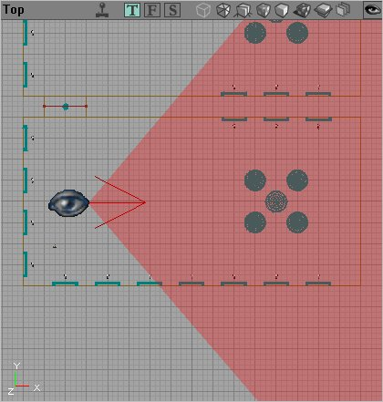The large eyeball denotes where the player is standing in the room and the red arrow shows which direction he is looking while the shaded region is the space of the frustum. The frustum is a three dimensional volume and it goes well off screen. Here is what the camera sees from this vantage point: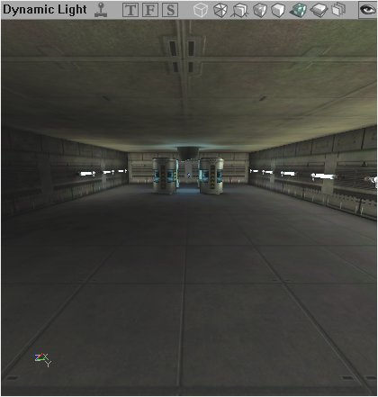The frustum extends from the player's view to form a four-sided pyramid extended from the eye of the player outward. Using objects that allow the player to zoom (like a sniper rifle) obviously changes the frustum of the player. Other attributes of the frustum include the near and far clipping planes which determine how far away or how close an object must be located to be drawn.

### Geometry

There are four basic types of geometry, BSP (Binary Space Partitioning), Static Meshes, and Terrain. Emitters/Sprites. Each has different advantages and disadvantages for optimization purposes. We'll start by taking a look at the most basic of these geometry types, BSP.

#### BSP

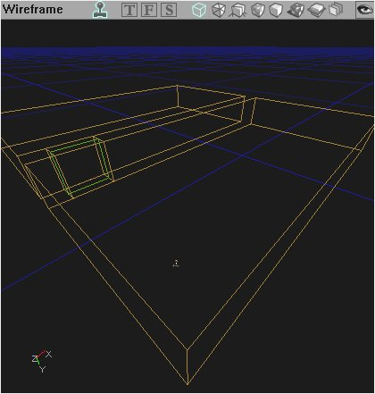[LevelOptimizationBSP](LevelOptimizationBSP.md)As stated above this is the most basic of the geometry types. You can't create a level without it. Here are some quick bullet points to note about BSP for general use:

* Slow to render per triangle
* Good at culling when used with Zones and ZonePortals
* Fast at calculating collision

In general, BSP is good for carving out simple shapes, using for surfaces players will walk on, and carving out zones. For a more detailed document on using BSP for Level Optimization see the [LevelOptimizationBSP](LevelOptimizationBSP.md) doc.Also be aware that [converting BSP Brushes into Static Meshes](ConvertingBspBrushesIsSuboptimal.md) may not be as optimal as creating Static Meshes from scratch!

#### StaticMeshes

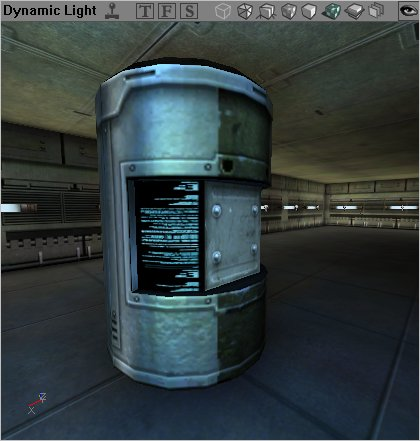[LevelOptimizationStaticMesh](LevelOptimizationStaticMesh.md)StaticMeshes, or meshes created in third party modeling programs and imported into Unreal Ed, are among the most prolifically used geometry types. Here are some quick bullet points to note about StaticMeshes:

* Fast to render per triangle
* Can easily create complex shapes
* Slow for collision calculations (but can be optimized)

StaticMeshes are ideal for fleshing out a scene. For more information about optimizing StaticMeshes for maximum performance, see the [LevelOptimizationStaticMesh](LevelOptimizationStaticMesh.md) doc.

#### Terrain

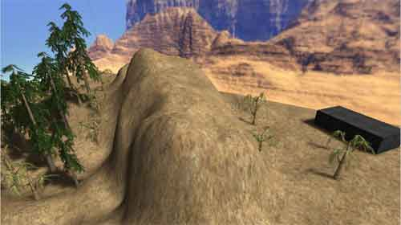[LevelOptimizationTerrain](LevelOptimizationTerrain.md)The editor offers a tool for quickly creating a landscape that you can alter and tweak. This type of level geometry is called Terrain. Here are some quick bullet point to note about Terrain:

* Decent render speed (faster than BSP, slower than StaticMeshes)
* Fast at collision calculations
* Very versatile and easily sculpted from within the editor

For more detailed information about optimizing the Terrain in your level, see the [LevelOptimizationTerrain](LevelOptimizationTerrain.md) doc.

#### Emitters

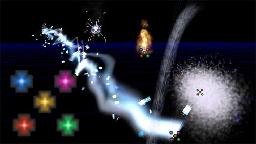Emitters and Particles Systems are ways of creating fancy effects often based around display a stream of sprites or low poly geometry in such a way that the whole is greater than the parts (for instance a dirt explosion, or a torch fire). Optimizing Particle Systems can be different for each platform, for instance, while the Xbox can handle a few fairly elaborate particle systems, a PC with a low end graphics card would be better at handling a large number of fairly simple Particle Systems. There is a lot of detailed analysis that can be done to determine how to optimize a Particle System, but 99 times out of a 100 you will find that the answer is invariably use less particles.Here are some quick and fairly intuitive guidelines to follow when creating Particle Systems:

* Use as few particles as possible in the emitter to achieve your effect
* If you don't need particle collision turn collision off in the emitter properties
* Particles with shorter life spans are better

### Techniques

#### Trouble Shooting and Profiling

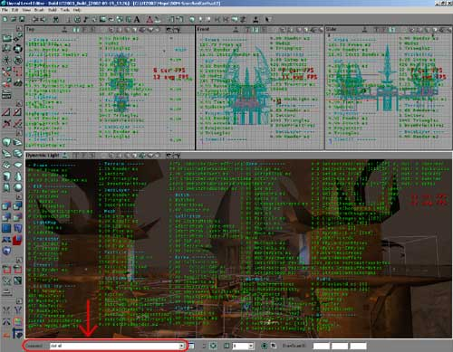[LevelOptimizationProfiling](LevelOptimizationProfiling.md)Before you start optimizing, you should know what the weak parts in your scene are. There are of course special tools available to programmers for this very purpose, but there are a few tools within the Editor that Level Designers can use. This document takes a look as some of the ways Level Designers can trouble shoot their level and find the general weak spots in their level.

#### Antiportals

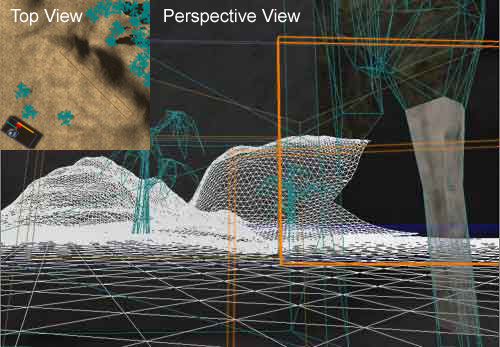[LevelOptimizationAntiportals](LevelOptimizationAntiportals.md)In addition to Zones, Antiporals are another helpful tool for culling geometry in your level. Essentially they are volumes that you can insert into your level and the renderer will not draw any geometry that is obscured by the Antiportal. Different types of geometry are culled differently though. To learn more about using Antiportals, see the above document.

#### Distance Fog

Distance Fog is the last of the tools a level designer has for optimizing his or her level, and it should be used last as well. A well optimized level should not rely on Distance Fog to make it playable. The effects of level optimization, when done right, should never be noticeable to the player other than to increase the smoothness of the game play. Distance Fog, if done poorly, will look fake and forced if the fog gets too dense too early. Because this can break a player's suspension of disbelief or affect gameplay, Distance Fog should be used judiciously.The best places to use Distance Fog are in large outdoor environments. When used well, it can give an additional sense of distance and depth (as real fog would), and it will also help to hide far off geometry. How Distance Fog works to occlude objects from the renderer is that the further away things are from the player's perspective, the more saturated with the fog color they become. Once the geometry is far enough away to be at 100% saturated in the fog color, the renderer ceases to draw it with no noticeable popping for the player. The scenes below show this effect.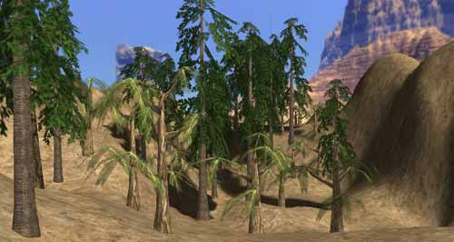Now with Distance Fog...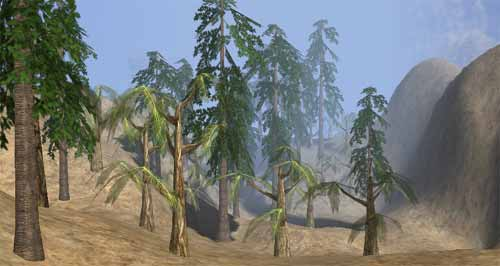To create Distance Fog within your level, you must first add a ZoneInfo to the zone in which you want to fog to affect. Then under the ZoneInfo tab in the ZonInfo Properties change bDistanceFog to True. To tweak the Distance Fog values, expand the ZoneLight Tab and you will see the following: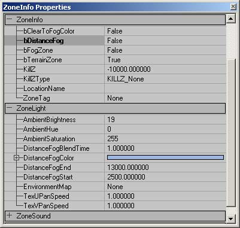The values for Distance Fog control the following things:

DistanceFogBlendTime
:   information to be added later

DistanceFogColor
:   This allows you to either use the color picker to select a color from the view port (choosing from the background sky box is a good place to pick from), or select from the color palette. It is a good idea to pick a color that blends in the background of the environment so the transition to total fog is as gradual as possible.

DistanceFogEnd
:   This sets the distance from the player at which the geometry will be totally saturated with the fog color and is no longer drawn.

DistanceFogStart
:   This sets the distance from which the geometry will begin to get saturated with the fog color.

With the above setting the fog starts at 2,500 Unreal units from the player and beyond 13,000 Unreal units, geometry is totally occluded. Other than the aesthetic cautions in using Distance Fog, there are practically no optimization drawbacks to using it, as it puts less strain on the processor.A little bit mofr on distance fog can be found [here](AdditionalTerrainTips.md#DistanceFog).

## Plan Ahead

The biggest tip of all is planning ahead. Spending a little extra time just thinking about how you want to organize your level can save you hours upon hours of heartache and headache when it comes down to actually implementing the level optimization. Establish polygon budgets at the outset. Develop a plan for where you want to place your zones, portals and antiportals. Beautiful levels will never see the light of day if they aren't playable. Planning ahead is what separates the amateurs from the masters of this craft.For additional docs on the planning process of a map see the following docs on the creation of the Runtime example map:

* [RuntimeMapPreproduction](RuntimeMapPreproduction.md)
* [RuntimeMapProcess](RuntimeMapProcess.md)

Below you can download one of the referenced example maps covered in the Level Optimization docs.

