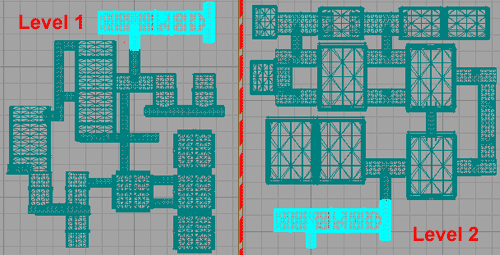
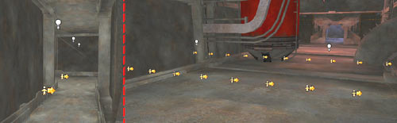
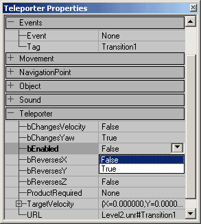
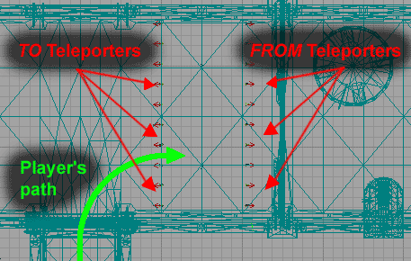
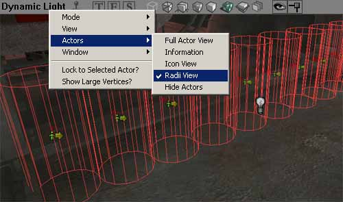

# Level Transitions

*Document Summary: A short guide on how to set up Level Transitions between maps.**Document Changelog: Last updated by Jason Lentz (DemiurgeStudios?), for creation purposes. Original author was Jason Lentz DemiurgeStudios?).*

* [Level Transitions](#level-transitions)
  + [Introduction](#introduction)
  + [Setting up the Levels](#setting-up-the-levels)
  + [Setting up the Teleporters](#setting-up-the-teleporters)
    - [Properties](#properties)
    - [Placement](#placement)
    - [Orientation](#orientation)
  + [Summary](#summary)

## Introduction

Teleporters can be used to send a player back and forth between two separate maps for level transitions. Here you will see how to set up Teleporters to make these transitions as seamless as possible. This document assumes a basic understanding of Teleporters, the Unreal Ed interface and how to set up levels. For more information on Teleporters see the [Teleporters Example Map](../../Uncategorized/ExampleMapsTeleporters.md).

## Setting up the Levels

In each level you will need to create a space that exists in both maps so the level transition is as seamless as possible. This space should obviously be kept small so you avoid having too much overlap between the two maps. The below top views show the duplicated space shared by both maps.

This portion can easily be selected in a one map, and then copied and pasted with CTRL+C and CTRL+V commands.Once you have the transition space set up, then you are ready to place the Teleporters.

## Setting up the Teleporters

For the simple case of a narrow corridor, two Teleporters (a *TO* Teleporter and a *FROM* Teleporter) may be sufficient, but if your level transition occurs in a wider space, you may need a series of *TO* and *FROM* Teleporters to prevent jarring transitions. In this document *TO* Teleporters are where the player will teleport to and *FROM* Teleporters are where the player will teleport from. This section describes how to set up the Teleporters to get the best results.

### Properties

To simplify the set up process you can set up one base Teleporter then copy it with minimal changes to differentiate between the *TO* and *FROM* Teleporters. Another helpful timesaver would be to create Groups in the Groups Browser for both the *TO* and *FROM* Teleporters. In the base Teleporter you will want to assign a **Tag** and a **URL** with the same Tag but in a different Map.

If you level transition is in larger space, you may need to create multiple Teleporters in a row. The [Placement](#placement) section explains how you should arrange the Teleporters. You will of course need unique names for each Teleporter in a single map.
Now in the *TO* Teleporters you need only set the **bEnabled** field to *False.* Leave the URL field in the *FROM* Teleporter though. The Teleporter in this level won't use it, but if you select all of your Teleporters -and- the surrounding Level Transition space, you can copy and paste it into your other map (as described above in the [Level Setup](#levelsetup) section) and then switching the *TO* and *FROM* Teleporters becomes trivial. Just select all the Teleporters in the second map and reverse their **bEnabled** fields so that the *TO* Teleporters become *FROM* and vice versa.

### Placement

For a level transition that will allow you to go back and forth between two different levels you will need two maps and two Teleporters in each map. One Teleporter will be used to teleport to, and the other is used to teleport from. Place the Teleporters in identical locations in the two maps, and then reverse their **bEnabled** fields as described [above](#reversebenabled). This turns the *FROM* Teleporters into *TO* Teleporters and vice versa.

Note that the player should cross the *TO* Teleporter before crossing the *FROM* Teleporter and that they are spaced substantially far apart. If they are placed too close together the player might accidentally back up some and end up reloading the level that he or she just came from.For larger sections you may find it helpful to turn on the Radii View in the Actors View on the viewport then make sure that collision radii form a solid wall.

It is better to create a wall of Teleporters rather than use one Teleporter with a large collision radius. Using the wall of Teleporters will avoid jarring level transitions since the player is be teleported to the location of the Teleporter not their location from the Teleporter. The smaller the discrepancy here, the less jarring the transition will be.

### Orientation

Players will not keep their orientation from one level to the next, but you can orient the player to at least point them in the direction once they load the next map. To set the player's orientation, you will need to change the **Yaw Rotation** under the **Movement** properties of the *FROM* Teleporter only.For quick reference here are the Unreal Rotation units for the basic compass directions:

|  |  |  |  |
| --- | --- | --- | --- |
| North | South | West | East |
| 49152 | 16384 | 32768 | 0 |

## Summary

To sum up these points in quick bullet form, here are the things you need to keep in mind when setting up level transitions with Teleporters.

* *TO* Teleporters (or Teleporters that you teleport to) are set to **bEnabled False**
* Set the **URL** field to be the same as its **Tag** but in the connecting level
* Set the proper orientation in the **Movement** field of the *FROM* Teleporter
* Arrange the levels so that the player crosses the *TO* Teleporters before the *FROM* Teleporters

