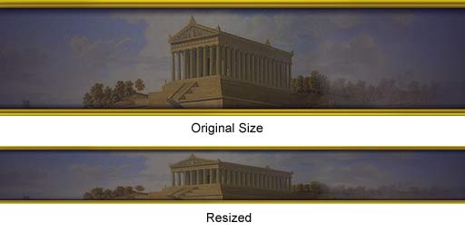
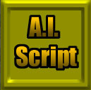

# GUIStyles Example

*Created by Chris Linder (DemiurgeStudios?) on 10-24-03 for the Unreal Runtime. Updated by Chris Linder (DemiurgeStudios?). Last updated by Michiel Hendriks.*

* [GUIStyles Example](#guistyles-example)
  + [Related Documents](#related-documents)
  + [Introduction](#introduction)
  + [How to Use GUIStyles](#how-to-use-guistyles)
    - [Creating a GUIFont](#creating-a-guifont)
    - [Creating GUIStyles](#creating-guistyles)
    - [Using GUIStyles and GUIComponents](#using-guistyles-and-guicomponents)
    - [GUIStyles Problems](#guistyles-problems)
      * [No Animated Materials When Paused](#no-animated-materials-when-paused)
      * [List Box Issues (pre v3323)](#list-box-issues-pre-v3323))
      * [BorderOffsets Ignored](#borderoffsets-ignored)
  + [How to Create Textures for GUIStyles](#how-to-create-textures-for-guistyles)
  + [Installing the Example](#installing-the-example)

## Related Documents

[GuiReference](GuiReference.md), [RuntimeExampleRestrictedMenu](RuntimeExampleRestrictedMenu.md), [LocalizationReference](LocalizationReference.md)

## Introduction

This example will go over how to create and use GUIStyles. To do so, we will redo the [RuntimeExampleRestrictedMenu](RuntimeExampleRestrictedMenu.md) with new styles. This will include new fonts, new button images, and new UI elements. The look and feel of the interface will change but almost no code changes in the existing menus are needed. This document will discuss both the creation of the art needed for the styles and the code needed to support the art. This example is based on the Unreal Runtime but it can be used in any 2226 or higher build of the engine.

## How to Use GUIStyles

As explained in the [GUIReference](GuiReference.md#GUIStyles) document, GUIStyles is a class that provides support for making different drawing styles for *GUIComponents*. The style for the component is set using the *StyleName* variable in *defaultproperties* where the *GUIComponent* is defined. For example:

```

Begin Object Class=GUIButton Name=LeaveMatchButton
   WinWidth=0.2
   WinHeight=0.05
   WinLeft=0.6
   WinTop=0.45
   StyleName="RoundButton"
   OnClick=InternalOnClick
End Object
```

*StyleName* is a string identifier for a *GUIStyles* subclass which matches the *KeyName* (or any of the *AlternateKeyName* s) of that class. Before styles can be used, they must be registered with the *GUIController*. This is done by setting the *StyleNames* array in *defaultproperties*. Given that previous subclasses of *GUIController* define there own styles, start indexing the *StyleNames* array at the one index greater than the superclass of the *GUIController* you are creating. For example *StyleGUIController*, which is the controller for this example, starts with index 17.

### Creating a GUIFont

Before you can create *GUIStyles* you will need a *GUIFont*. To create a font in GUI you need to create a class that extends *GUIFont*. Special font classes are needed in GUI to accommodate different resolutions. The reason is that fonts in Unreal are based on images (they are stored in texture packs) and are not designed to be scaled. To account for this, different resolutions use different Unreal fonts. A *GUIFont* specifies a list of fonts and a corresponding list of resolutions that dictate when each font should be used. In general most *GUIFonts* use the same typeface at different sizes for the list of fonts.To create a set of Unreal fonts see the [FontTutorial](FontTutorial.md). In general, you should create 5 fonts with the same typeface. The first should be appropriate for resolutions widths less than 800 pixels, the next less than 1024, the next less than 1600, and the last for resolutions greater than 1600.If you find that 5 fonts are not enough control over text size, you can override the *GetFont* function in your *GUIFont*. You can override *GetFont* natively or in script. *RTInterface.fntMidGameFont* is an example of overriding *GetFont* in script. The class is shown below:

```

class fntMidGameFont extends GUIFont;

var int FontScreenWidth[7];

static function Font GetMidGameFont(int xRes)
{
   local int i;
   for(i=0; i<7; i++)
   {
      if ( default.FontScreenWidth[i] <= XRes )
         return LoadFontStatic(i);
   }

   return LoadFontStatic(6);
}

// Same as
event Font GetFont(int XRes)
{
   return GetMidGameFont(xRes);
}

defaultproperties
{
   KeyName="MidGameFont"

    FontArrayNames(0)="EM_Fonts_T.FontEurostile17"
    FontArrayNames(1)="EM_Fonts_T.FontEurostile14"
    FontArrayNames(2)="EM_Fonts_T.FontEurostile11"
    FontArrayNames(3)="EM_Fonts_T.FontEurostile11"
    FontArrayNames(4)="EM_Fonts_T.FontEurostile9"
    FontArrayNames(5)="EM_Fonts_T.FontNeuzeit9"
    FontArrayNames(6)="EM_Fonts_T.FontSmallText"

    FontScreenWidth(0)=2048
    FontScreenWidth(1)=1600
    FontScreenWidth(2)=1280
    FontScreenWidth(3)=1024
    FontScreenWidth(4)=800
    FontScreenWidth(5)=640
    FontScreenWidth(6)=600
}
```

Fonts, like styles, need to be registered with the *GUIController*. This is done differently than styles because the *FontStack* is an array of *GUIFont* objects as opposed to an array of *String* names. To put fonts into this array, you need to create objects in default properties and then assign them like so:

```

defaultproperties
{
   Begin Object Class=fntGreekFont Name=GUIGreekFont
      bFixedSize=false
   End Object
   FontStack(6)=GUIGreekFont
   Begin Object Class=fntGreekBigFont Name=GUIGreekBigFont
      bFixedSize=false
   End Object
   FontStack(7)=GUIGreekBigFont

   ...
}
```

Like the *StyleNames* array, the *FontStack* must start indexing where the superclass left off.

### Creating GUIStyles

To create your own *GUIStyles* refer to the [GUIReference](GuiReference.md#GUIStyles) document. *STY\_LeftButton* is shown below as an example. *STY\_LeftButton* shows all the possible variables for *GUIStyles* being set; this is not necessary but just here for convenient reference.

```

class STY_LeftButton extends GUIStyles;

defaultproperties
{
   KeyName="LeftButton"

   Images(0)=Material'ExampleGUIStyles_T.Menu.Frame2Left_Blurry'
   Images(1)=Material'ExampleGUIStyles_T.Menu.Frame2Left_Watched'
   Images(2)=Material'ExampleGUIStyles_T.Menu.Frame2Left_Focused'
   Images(3)=Material'ExampleGUIStyles_T.Menu.Frame2Left_Pressed'
   Images(4)=Material'ExampleGUIStyles_T.Menu.Frame2Left_Disabled'

   RStyles(0)=MSTY_Normal;
   RStyles(1)=MSTY_Normal;
   RStyles(2)=MSTY_Normal;
   RStyles(3)=MSTY_Normal;
   RStyles(4)=MSTY_Normal;

   ImgStyle(0)=ISTY_Stretched
   ImgStyle(1)=ISTY_Stretched
   ImgStyle(2)=ISTY_Stretched
   ImgStyle(3)=ISTY_Stretched
   ImgStyle(4)=ISTY_Stretched

   ImgColors(0)=(R=255,G=255,B=255,A=255)
   ImgColors(1)=(R=255,G=255,B=255,A=255)
   ImgColors(2)=(R=255,G=255,B=255,A=255)
   ImgColors(3)=(R=255,G=255,B=255,A=255)
   ImgColors(4)=(R=128,G=128,B=128,A=255)

   FontColors(0)=(R=255,G=255,B=255,A=255)
   FontColors(1)=(R=255,G=255,B=255,A=255)
   FontColors(2)=(R=255,G=255,B=255,A=255)
   FontColors(3)=(R=255,G=255,B=255,A=255)
   FontColors(4)=(R=128,G=128,B=128,A=255)

   FontNames(0)="GreekFont"
   FontNames(1)="GreekFont"
   FontNames(2)="GreekFont"
   FontNames(3)="GreekFont"
   FontNames(4)="GreekFont"

   BorderOffsets(0)=14
   BorderOffsets(1)=6
   BorderOffsets(2)=5
   BorderOffsets(3)=5
}
```

Note: See [BorderOffsets Ignored](#borderoffsets-ignored) below for problems with *BorderOffsets*.

### Using GUIStyles and GUIComponents

Once you have your styles you can apply then to *GUIComponents* such as buttons and text fields with expected results. *GUIComponents*, and the styles associated with them can also be used in less intuitive ways. For example, the background for the mid game menu is in fact a button with a special style that scales the texture as opposed to stretching as is done for most buttons.

### GUIStyles Problems

#### No Animated Materials When Paused

When the game is paused, materials do not animate. When the mid game menu is up, the game is paused. Ergo, materials do not animate in the mid game menu. This means no fancy animated flashing materials for the buttons in the mid game menu

#### List Box Issues (pre v3323)

In versions older than 3323 *GUIListBoxs* are not affected by the *StyleName* variable. This is because list boxes are drawn with the style of the *GUIList* that they contain. To set this style you have to do a bit of trickery in default properties. Below is an example of how I set the style of the map list in *RestrictedMainMenu*:

```

defaultproperties
{
   Begin Object Class=GUIList Name=IAMain_MapListList
      Name="MyList"
      StyleName="Frame"
      SelectedImage=Material'ExampleGUIStyles_T.Menu.SelectFrameFinal'
   End Object

   Begin Object Class=GUIListBox Name=IAMain_MapList
      List=IAMain_MapListList
      WinWidth=0.5
      WinHeight=0.45
      WinLeft=0.25
      WinTop=0.30
      bVisibleWhenEmpty=True
      Hint="Select the map to play"
   End Object
   Controls(0)=GUIListBox'IAMain_MapList'

   ...
}
```

The other thing worth noting about *GUIListBoxs* is that they have the horizontal selection indicator that is not covered in the style for the list. Instead, there is an extra variable called *SelectedImage* which is the material that is drawn under the selected item in the list.

#### BorderOffsets Ignored

Note: As of Runtime-2226.19.03 (code drop 2226) there is a problem with *BorderOffsets* and *GUIButtons*; *BorderOffsets* are ignored when drawing the text of the button. Future builds should fix this problem. For now licenses should check UnProg for the fix. 

## How to Create Textures for GUIStyles

Creating textures for GUIStyles is a fairly straightforward process, with a few particularies to keep in mind:Separate textures are created for the various buttons in their various behavior states (watched, blurry, etc) so that one button has five different versions.These textures will be used for buttons and frames whose dimensions will be defined by code. Therefore the textures you create will be most likely be resized. This is a great flexibility in the Unreal GUI system, but it also affects the way textures should be made. Unreal will use one of two methods to resize your textures. In the first, they are merely stretched, which can cause warping, just as changing the Image Size in Photoshop would:A more complicated method of pixel repeating can be used. This is done by repeating pixels in the middle of the image to fill the sections between the corners if the stretch size is larger than the image. If the stretch size is smaller the corners are cropped in the middle and refitted together. This is well illustrated in the following images:This is the original 128 x 128 image:This is the image resized to 100 x 100 pixels:This is the image resized to 300 x 300 pixels:Note that the corners are unaffected while the central areas are. This means that your textures can have detail in the corners while the central parts should be relatively plain. This will inevitably result in some iterations with your textures, but it will be worth it in the end. For more information on this, check out the [CanvasReference](CanvasReference.md#DrawTileStretched) document.While these textures can be reused throughout your new GUIStyle, there are some limitations. Note that button textures can't easily be mirrored. In the case of this example, the mid game menu consists of two buttons (one for Continue and one for Close Map). These buttons are identical except they are mirrored horizontally. This required the creation of two different sets of button textures--one with the curlycues on the left and one on the right.

## Installing the Example

Download the [attached zip file](rsrc/Two/GUIStylesExample/ExampleGUIStyles.zip) and unzip it in your Runtime directory. Next you will need to alter your INI file settings to use the new menus and console. In *UE2Runtime.ini*, (or *<your\_game>.ini*) in the `[Engine.Engine]` section, change the console and the GUIController as follows (note: you can comment out lines by starting them with a ';'):

```

Console=ExampleGUIStyles.RestrictedConsole
GUIController=ExampleGUIStyles.StyleGUIController
```

Next, in the `[Engine.GameEngine]` section, change the menu classes to:

```

InitialMenuClass=ExampleGUIStyles.RestrictedMainMenu
MainMenuClass=ExampleGUIStyles.RestrictedMainMenu
```

Now in *User.ini*, in the `[Engine.PlayerController]` section change the mid game menu to:

```

MidGameMenuClass=ExampleGUIStyles.RestrictedMidGameMenu
```

At this point you can launch the game and you will see the new menus. If you want to make changes to these menus, make sure you add "ExampleGUIStyles" to the EditPackages lists in *UE2Runtime.ini* (or *<your\_game>.ini*).

