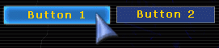
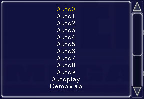
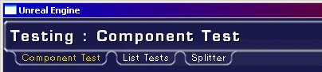

# GUI Reference

*Last updated by Michiel Hendriks, some v3323 updates. Previous update by Chris Linder (DemiurgeStudios?), for first draft. Original author was Chris Linder (DemiurgeStudios?).*

* [GUI Reference](#gui-reference)
  + [Introduction](#introduction)
  + [GUIController](#guicontroller)
    - [OpenMenu](#openmenu)
    - [ReplaceMenu](#replacemenu)
    - [CloseMenu](#closemenu)
    - [CloseAll](#closeall)
    - [GetMenuFont](#getmenufont)
    - [GetStyle](#getstyle)
    - [RegisterStyle](#registerstyle)
    - [GetCurrentRes](#getcurrentres)
    - [GetMapList](#getmaplist)
    - [ResetKeyboard](#resetkeyboard)
    - [MouseEmulation](#mouseemulation)
    - [ViewportOwner](#viewportowner)
  + [GUIComponent](#guicomponent)
  + [GUIPage](#guipage)
    - [OnOpen](#onopen)
    - [OnClose](#onclose)
    - [OnCanClose](#oncanclose)
    - [Opened](#opened)
    - [Closed](#closed)
    - [PageLoadINI](#pageloadini)
    - [PageSaveINI](#pagesaveini)
    - [PlayOpenSound](#playopensound)
    - [PlayCloseSound](#playclosesound)
    - [InitComponent](#initcomponent)
    - [HandleParameters](#handleparameters)
  + [GUIStyles](#guistyles)
    - [States](#states)
    - [RStyles](#rstyles)
    - [Images](#images)
    - [ImgStyle](#imgstyle)
    - [ImgColors](#imgcolors)
    - [FontNames](#fontnames)
    - [FontColors](#fontcolors)
    - [FontBKColors](#fontbkcolors)
    - [BorderOffsets](#borderoffsets)
  + [Controls](#controls)
    - [Standard Controls](#standard-controls)
      * [GUIButton](#guibutton)
      * [GUIListBox](#guilistbox)
      * [GUISlider](#guislider)
    - [GUIMenuOption Controls](#guimenuoption-controls)
      * [GUICheckBoxButton / moCheckBox](#guicheckboxbutton-mocheckbox)
      * [GUIComboBox / moComboBox](#guicombobox-mocombobox)
      * [GUIEditBox / moEditBox](#guieditbox-moeditbox)
      * [GUIFloatEdit / moFloatEdit](#guifloatedit-mofloatedit)
      * [GUINumericEdit / moNumericEdit](#guinumericedit-monumericedit)
  + [Laying out Components](#laying-out-components)
  + [Tabs](#tabs)
  + [Saving](#saving)
  + [Hints](#hints)
  + [Context Menus](#context-menus)

## Introduction

The GUI system is flexible toolkit for making menus. It provides tools for laying out buttons, labels, combo boxes, tabs, images, lists, and other basic UI elements in a resolution independent manner. All of the text is independent of the images so menus made with the GUI system can be easily localized. The GUI system also has the advantage of being laid out entirely in default properties so it is fairly easy to change and reorganize. Using GUI does not require the game to be paused so it can also be used for in-game menu overlays though it is not best suited for this. For the most part GUI is well documented so if you have questions about a particular variable or function, checking the source is a good thing to do. This document is designed to give a general overview of how to use GUI, not to go over the details of all variables and functions.The GUI system works by having a *GUIController* which distributes messages to *GUIComponents*. *GUIController* extends *BaseGUIController* which is an [Interaction](../../Uncategorized/InteractionReference.md) which is how the controller gets all its input events and also how it can draw to the screen. At the same time, because the controller is based on an interaction, other interactions can disrupt the GUI system by stealing events. Beware particularly of the *DefaultPlayerMenu* interaction which is defined in <YourGame >.ini under the [Engine.Engine] heading.The type of *GUIController* you have is also defined in <YourGame>.ini. For the GUI system to work GUIController=GUI.GUIController must be set. If you want an initial menu to appear when you launch the game you can set the *InitialMenuClass* under the [Engine.GameEngine] heading in <YourGame>.ini. For example:

```

[Engine.GameEngine]
InitialMenuClass=GUI.MyMainMenu
```

## GUIController

As mentioned above, *GUIController* is an [Interaction](../../Uncategorized/InteractionReference.md). It implements all the *Interaction* functions natively and uses these functions to send its own set of events to the current menu. The *GUIController* is a simple FILO menu stack. You have 3 things you can do. You can open a menu which adds the menu to the top of the stack. You can replace a menu which replaces the current menu with the new menu. And you can close a menu, which returns you to the last menu on the stack. *GUIController* also provides some useful functions and variables for menu layout and design.

### OpenMenu

`event bool OpenMenu(string NewMenuName, optional string Param1, optional string Param2)`OpenMenu opens the [GUIPage](#guipage) with the given class name *NewMenuName* and puts it on top of the stack as the active menu. If the menu could not be opened, this function returns false. *Param1* and *Param2* are passed to the new *GUIPage* in the the [HandleParameters](#handleparameters) function if the menu is created successfully. The [PlayOpenSound](#playopensound) function in *GUIPage* is also called. If this *GUIPage* has *bDisconnectOnOpen* set to true, any net game will be disconnected.
Note: disconnecting games causes an *NotifyLevelChange* event to be called. In this case all GUIPages will receive *NotifyLevelChange* call and will be closed.

### ReplaceMenu

`event bool ReplaceMenu(string NewMenuName, optional string Param1, optional string Param2)`This functions works much like [OpenMenu](#openmenu) but unlike *OpenMenu* this function does not put the new window on top of the stack, instead it replaces the current menu. The other major difference is that even if *bDisconnectOnOpen* is set to true, any net game will NOT be disconnected. This function will return false, if it does not succeed.

### CloseMenu

`event bool CloseMenu(optional bool bCanceled)`This function tries to close the top menu. The delegate *OnCanClose* will be called, if this delegate returns false the menu will not be closed.
When the menu can be closed the close sound for that menu is played, and it is removed from the stack. Control will be given to the menu next on the stack if there is one. If there is not a menu on the stack and the menu just closed does not have *bAllowedAsLast*, this function will attempt to open *GameEngine.MainMenuClass* and given control to it. If the there is not a menu on the stack and *bAllowedAsLast* = true, the *GUIController* will try to give up control and return focus to the game. If you want to close the menus and return to the game, call [CloseAll](#closeall) even there is only one menu open. If bCanceled is false, the current menu will save its setting by calling [SaveINI](#saveini), this is called for all components on the page. *CloseMenu* only returns false and is considered to have failed if there are no menus on the stack when it is called.

### CloseAll

`event CloseAll(bool bCancel, optional bool bForced)`*CloseAll* will close all menus and the *GUIController* will give up control and the focus will return to the game. If bCanceled is false, the top menu will save its setting by calling [SaveINI](#saveini).
Setting bForced to true will prevent the main menu from being opened.

### GetMenuFont

`native event GUIFont GetMenuFont(string FontName)`*GetMenuFont* finds and returns a given *GUIFont* in the *FontStack* based on the font's *Name*. The *FontStack* is defined in defaultproperties of *GUIController*. If the font can't be found, NONE is returned.

### GetStyle

`native event GUIStyles GetStyle(string StyleName)`*GetStyle* find and returns a style on the *StyleStack* based on the *KeyName* of the *GUIStyles*. If the style can't be found, NONE is returned.

### RegisterStyle

`function bool RegisterStyle(class StyleClass, optional bool bTemporary)`This allows you to register a new style during runtime. Returns true when the style is registered. If `bTemporary` is set the style will only exist for the duration of this level, so when a level is changed the style will be purged (see the *PurgeObjectReferences* function).

### GetCurrentRes

`native function string GetCurrentRes()`This function returns the current resolution as a string in the format *WIDTHxHEIGHT* (for example "1024x768").

### GetMapList

`native function GetMapList(string Prefix, GUIList list)`This function takes a *GUIList* and fills it with all the maps with the given *Prefix*. If you want all the maps, simply pass "" as *Prefix*.
**Deprecated since v3323** Use the CacheManager instead.

### ResetKeyboard

`native function ResetKeyboard()`This function resets all the key bindings to those in the default ini files like *Default.ini* and *DefUser.ini*.

### MouseEmulation

`native function MouseEmulation(bool On)`This seems to turn on joystick emulation for the mouse. Note: I have not tested this. If anyone has used it, drop me a line.
Removed from v3323.

### ViewportOwner

`var Player ViewportOwner`This is a variable in *Interaction* but it is worth mentioning here because it allows the *GUIController* or a *GUIPage* to have access to the *PlayerController*, the *Level*, and *Game*; for example "ViewportOwner.Actor.Level.Game".
In v3323 use *PlayerOwenr()* defined in *GUIComponent* instead to get the *PlayerController*.

## GUIComponent

Almost everything in GUI, from [GUIPages](#guipage) to [GUIButtons](#guibutton), is built on *GUIComponent*. This class is well documented and I suggest just looking though it.

## GUIPage

*GUIPage* is the basic page out of which menus are built. *GUIPage* extends *GUIMultiComponent* which allows it to contain many *GUIComponents* which are menu tools such as labels, buttons and lists. Besides containing *GUIComponents*, *GUIPages* have a *Background* image, a *BackgroundColor* and sounds that play when the menu opens and closes. *GUIPages* can demand to be rendered at 640x480 or greater by setting *bRequire640x480* to true which will switch the resolution if it is not already at 640x480 or greater. These are some other variables in *GUIPage*:

|  |  |
| --- | --- |
| Background | The background image for the menu |
| BackgroundColor | The color of the background |
| BackgroundRStyle | The render style of background |
| bAllowedAsLast | If this is true, closing this page will not bring up the main menu if last on the stack. |
| bCaptureInput | Whether to allow input to be passed to pages lower on the menu stack. |
| bCheckResolution | obsolete |
| bDisconnectOnOpen | Should this menu cause for a disconnect when opened. |
| bPauseIfPossible | This does not do anything. But: should this menu pause the game if possible. |
| bPersistent | If set in defprops, page is kept in memory across open/close/reopen |
| bRenderWorld | this does not do anything |
| bRequire640x480 | Does this menu require at least 640x480 |
| bRestorable | When the GUIController receives a call to CloseAll(), should it reopen this page the next time main is opened? |
| CloseSound | Sound to play when closed |
| InactiveFadeColor | Color Modulation for Inactive Page |
| OpenSound | Sound to play when opened |

### OnOpen

`delegate OnOpen()`This [delegate](../../Uncategorized/UnrealScriptDelegates.md) is called from [Opened](#opened). This delegate is called by the [GUIController](#guicontroller).
Pre-v3223 tis delegated is called by the *Opened* event and the default delegate calls [PageLoadINI](#pageloadini).

### OnClose

`delegate OnClose(optional Bool bCancelled)`This [delegate](../../Uncategorized/UnrealScriptDelegates.md) is called from [Closed](#closed). Pre-v3323 the default calls [PageSaveINI](#pagesaveini) if bCancelled is false.

### OnCanClose

`delegate bool OnCanClose(optional Bool bCancelled)`This delegate will be called by the [GUIController](#guicontroller) from *CloseMenu*. Return false to prevent this menu from closing.

### Opened

`event Opened(GUIComponent Sender)`This function is called from the [GUIController](#guicontroller) when this *GUIPage* is opened.
Pre-v3323 *Opened* calls [OnOpen](#onopen).

### Closed

`event Closed(GUIComponent Sender, bool bCancelled)`*Closed* is called from the [GUIController](#guicontroller) when this *GUIPage* is closed. This function calls [OnClose](#onclose).

### PageLoadINI

`function PageLoadINI()`**Removed from v3323** This function calls *LoadINI* on all the controls in this page.

### PageSaveINI

`function PageSaveINI()`**Removed from v3323** This function calls *SaveINI* on all the controls in this page.

### PlayOpenSound

`function PlayOpenSound()`This function plays *OpenSound*. It is called from the [GUIController](#guicontroller) when this *GUIPage* is opened.

### PlayCloseSound

`function PlayCloseSound()`This function plays *CloseSound*. It is called from the [GUIController](#guicontroller) when this *GUIPage* is closed.

### InitComponent

`function InitComponent(GUIController MyController, GUIComponent MyOwner)`*InitComponent* is responsible for initializing all components on the page. Pages that subclass *GUIPage* should override this function to initialize all the components. Make sure to call the super though.

### HandleParameters

`event HandleParameters(string Param1, string Param2)`This is called from [OpenMenu](#openmenu) and [ReplaceMenu](#replacemenu) where *Param1* and *Param2* are optional parameters to both those functions. This gives the ability to pass arguments to your menus when you create them without changing the API. You should subclass this function to take advantage of this functionality.

## GUIStyles

*GUIStyles* is a class that provides support for making different drawing styles for *GUIComponents*. When the *GUIComponent* is drawn, the *Style* variable which is a *GUIStyles*, is used to draw the component. The style determines the image to draw, the color of the image, how to draw that image, the text to draw, the color of the text, and the font of the test. The style determines each of these things for all five states of the component (Blurry, Watched, Focused, Pressed, and Disabled). This gives a great deal of flexibility for creating whatever sort of look and feel you might want.Below is an example of the same button drawn with two different styles:


### States

As mentioned before there are five states: Blurry, Watched, Focused, Pressed, and Disabled. These are defined in the *eMenuState* enum in *GUI.uc*.

|  |  |
| --- | --- |
| MSAT\_Blurry | Component has no focus at all. This is the state if the mouse is not over this component nor is it selected. |
| MSAT\_Watched | Component is being watched (ie: Mouse is hovering over, etc) |
| MSAT\_Focused | Component is Focused (ie: selected). This happens either though using Tab or by the component receiving a mouse down event but the mouse button is no longer being pressed. The mouse being over the component does not affect this state. |
| MSAT\_Pressed | Component is being pressed. This is when the component received a mouse down event and the mouse button is still being pressed, even if the mouse is not over this component any more. |
| MSAT\_Disabled | Component is disabled |

### RStyles

`var EMenuRenderStyle RStyles[5]`*RStyles* determines how the text and image of this component will be rendered. *EMenuRenderStyle* is and enum defined in *GUI.uc*. This defaults to *MSTY\_Normal*.

### Images

`var Material Images[5]`This array holds 1 material for each state (Blurry, Watched, Focused, Pressed, and Disabled). Because these are materials you can have them blink and fade and do very neat things.

### ImgStyle

`var eImgStyle ImgStyle[5]`*ImgStyle* determines how each image should be drawn.ISTY\_Normal,
ISTY\_Stretched,
ISTY\_Scaled,
ISTY\_Bound,
ISTY\_Justified,
ISTY\_PartialScaled,
ISTY\_Tiled,

|  |  |
| --- | --- |
| ISTY\_Stretched | This is the default. It corresponds to the [DrawTileStretched](CanvasReference.md#drawtilestretched) function in [Canvas](CanvasReference.md) and will stretch the image to fit the dimensions of the *GUIComponent*. |
| ISTY\_Normal | This draws the image without any scaling or stretching. |
| ISTY\_Scaled | This will draw the image scaled to fit the dimensions of the *GUIComponent*. |
| ISTY\_Bound | image doesn't seem to draw |
| ISTY\_Justified | Image is drawn within the bounds of the component according to the ImageAlign setting |
| ISTY\_PartialScaled | Combination between scaling and stretching. |
| ISTY\_Tiled | The image is repeated. |


### ImgColors

`var Color ImgColors[5]`This array holds 1 image color for each state. The image will be modulated *(multiplied with the color range (0-255) considered to be from 0.0-1.0)* with this color.

### FontNames

`var string FontNames[5]`Holds the names of the fonts to use for each state.

### FontColors

`var Color FontColors[5]`This array holds 1 font color for each state.

### FontBKColors

`var Color FontBKColors[5]`Background colors for the fonts. Used to color the background for selections in lists and popup menus.

### BorderOffsets

`var int BorderOffsets[4]`*BorderOffsets* is the border for the text. 0=Left, 1=Top, 2=Right, 3=Bottom.

## Controls

Below are some examplea of controls that can be used to design pages and panels with GUI. There are a lot more components available. Check the code of the classes in the XInterface and GUI2K4 package for good examples on how various components can be used.

### Standard Controls

These are basic controls built on [GUIComponent](#guicomponent).

#### GUIButton



To use buttons you must use the *OnClick* [delegate](../../Uncategorized/UnrealScriptDelegates.md) of *GUIComponent*. This Delegate is defined as follows:

```

// The mouse was clicked on this control
Delegate bool OnClick(GUIComponent Sender);
```

To use this delegate, create a function in your [GUIPage](#guipage) that has the same format as the delegate. Below is an example:

```

function bool ButtonClick(GUIComponent Sender)
{
   local GUIButton Selected;

   if (GUIButton(Sender) != None)
      Selected = GUIButton(Sender);

   if (Selected == None) return false;

   switch (Selected)
   {
      case TestButton1:
         return Controller.OpenMenu("GUI.MyTest2Page"); break;
      case TestButton2:
         return Controller.OpenMenu("GUI.MyTestPage"); break;
      case QuitButton:
         return Controller.OpenMenu("GUI.MyQuitPage"); break;
   }
   return false;
}
```

Now in defaultproperties set the OnClick of the button to be the name of the function you created like so:

```

defaultproperties
{
   Begin Object Class=GUIButton Name=cTestButton1
      ...
      OnClick=ButtonClick
      ...
   End Object

   TestButton1=cTestButton1
}
```

#### GUIListBox



This box will simply display a *GUIList*. The delegates of *GUIListBox* pass on the *OnClick* and *OnChange* events to the *GUIList* itself.

#### GUISlider


A *GUISlider* is a slider between *float MinValue* and *float MaxValue* which are specified in defaultproperties. If *bIntSlider* is true, the slider will have only Int values. You can get the value of the slider by querying *float Value*; there is not getter function. Two useful functions are:

```

function SetValue(float NewValue)
function Adjust(float amount)
```

*SetValues* sets the current value after doing a range check and a cast to an Int if *bIntSlider* is true. *Adjust* moves the slider up or down by the given *amount* which is treated as a percentage. If *amount* causes the slider to exceed its min or max, that value will just be clamped.

### GUIMenuOption Controls

*GUIMenuOption* is a wrapper class for *GUIComponent*. *GUIMenuOption* contains a *GUIComponent* ( *MyComponent* ) and a *GUILabel* ( *MyLabel* ) and it takes care of all positioning and scaling between the component and the label. By default the label is left justified in the space available for this component and the control is right justified but this can be changed by altering the defaultproperties of the *GUIMenuOption*. The text of the label is specified in *Caption*.The *GUIComponent* of the *GUIMenuOption* can be accessed directly through *MyComponent* but most *GUIMenuOptions* provide a more direct representation such as *MyCheckBox* in *moCheckBox*. *GUIMenuOptions* often also provide similar accessor functions to the *GUIComponent* they wrap so it is easy to swap one for the other without changing much code. For example *moFloatEdit*, the *GUIMenuOption* wrapper of *GUIFloatEdit*, both have the *SetValue(float V)* function.Below I will discuss both the *GUIComponent* and the *GUIMenuOption* wrapper for that component together. This is because the two classes serve nearly the same purpose and are used in nearly the same way except for the fact that one has a label.

#### GUICheckBoxButton / moCheckBox


These classes are very simple. Unfortunately, they don't have the same API. *GUICheckBoxButton* has the function *SetChecked(bool bNewChecked)* to set the checkedness of the box and to examine the checkedness you just look at *bCheckBox*. *moCheckBox* has the function *Checked(bool C)* to set the checkedness and the function *bool IsChecked()* to examine the checkedness.

#### GUIComboBox / moComboBox


There are two types of combo boxes, *GUIComboBox* and *moComboBox*. Both behave in very similar ways. The main function of interest in both of these classes are *SetText* , *GetText*, and *Find*.

```

function SetText(string NewText)
function string GetText()
function string Find(string Test, bool bExact)
```

*SetText* will set the current text in the text field of the box to *NewText* and try to set the item in the pull down list be *NewText*. If *NewText* does not exist in the pull down list, the list index will remain unchanged.*GetText* returns the current text of the combo box.*Find* returns contents of the combo box that match *Test*. If *bExact* is true, the finding will be case sensitive and the return value of *Find* will equal *Test* exactly or be an empty string. If *bExact* is false, *Find* will return the version in the combo box or an empty string if *Test* is not found.

#### GUIEditBox / moEditBox


These are boxes that display text and that you can type in if *bReadOnly* is false. They can be configured to only display numbers but maybe you would want to use a [GUIFloatEdit](#guifloatedit-mofloatedit) or a [GUINumericEdit](#guinumericedit-monumericedit) instead for that. *GUIEditBox* and *moEditBox* both have the *SetText(string NewText)* function. *GUIEditBox* can inspect the value of *TextStr* to get the current value of the edit while *moEditBox* has the *string GetText()* function.

#### GUIFloatEdit / moFloatEdit


This is an edit for entering floats. The floats can be either left or right justified based on *bLeftJustified* in *GUIFloatEdit*. Based on the general pattern we are seeing here both of these classes have setter functions, *SetValue(float V)*, but only *moFloatEdit* has a getter, *float GetValue()*. *GUIFloatEdit \_ must inspect \_string Value* and cast it to a float.

#### GUINumericEdit / moNumericEdit


These classes are almost exactly like [FloatEdits](#guifloatedit-mofloatedit) but with Ints.

## Laying out Components

The layout of components is done predominantly in defaultproperties. Below is an example:

```

defaultproperties
{
   Begin Object Class=GUIButton Name=cLoadMapButton
      Caption="Load Map"
      Hint="Loads a map"
      OnClick=InternalOnClick
      TabOrder=0
      bBoundToParent=true
      bScaleToParent=true
      WinWidth=0.2
      WinHeight=0.05
      WinLeft=0.031250
      WinTop=0.8
   End Object

   Begin Object Class=GUIButton Name=cCancelMapButton
      Caption="Cancel"
      Hint="Cancels and closes this window"
      OnClick=InternalOnClick
      TabOrder=1
      bBoundToParent=true
      bScaleToParent=true
      WinWidth=0.2
      WinHeight=0.05
      WinLeft=0.26
      WinTop=0.8
   End Object

   LoadMapButton=cLoadMapButton;
   CancelMapButton=cCancelMapButton;

   Background=Material'GUIMenu.SquareBoxA'

   WinWidth=1.000000
   WinHeight=0.807813
   WinLeft=0.000000
   WinTop=55.980499
}
```

Clearly this is not a complete *GUIPage* but it illustrates common layout techniques. First we will inspect the creation of the two buttons. *Caption* is used to set the text of the button. This string can be [localized](LocalizationReference.md) in the following manner (German in this example):

```

[MyClass]
LoadMapButton.Caption="Last Diagramm"
CancelMapButton.Caption="L�schen"
```

*OnClick* is the click delegate which is set to *InternalOnClick* for both these buttons. For more information on click delegates see [GUIButton](#guibutton).Now for the layout information. Layout positions can be given in ratios with 0.0 being the extreme top or left and 1.0 being the extreme bottom or right. These ratios can be given in either screen ratios or parent ratios as the parent does not necessarily take up the whole screen. The parent size is defined by the *WinWidth* and *WinHeight* of the GUIPage which are 1.000000 and 0.807813 respectively in the example above. *bBoundToParent* set to true means that this component uses the parent's bounds for all positioning instead of the window size. This affects *WinLeft* and *WinTop*. *bScaleToParent* set to true means that this component uses the Parent for scaling. The affects *WinWidth* and *WinHeight* of the component.Layout positions can also be given in pixels by entering any value > 1.0 even floats such as 1.1. Pixel values are also affected by *bBoundToParent* and *bScaleToParent*.As you might have guessed by now *WinLeft* and *WinTop* are used to position components. They are the left side and top of the component respectively. *WinWidth* and *WinHeight* are the width and height of the component respectively.

## Tabs



The *GUITabControl* and *GUITitleBar* classes can be used to make tabs in the UI. Strictly speaking *GUITitleBar* does not need to be used to make the tabs but it has support for linking the title bar to the tabs so the tabs are not just floating in space.*GUITabControl* has a function:

```

GUITabPanel AddTab(string Caption, string PanelClass,
          optional GUITabPanel ExistingPanel,
          optional string Hint,
          optional bool bForceActive)
```

which is used to add tabs to the tab control. *Caption* is the name what will be written on the tab itself. *PanelClass* is the name of the *GUITabPanel* class to be spawned. *PanelClass* will not used if a valid *ExistingPanel* is passed. *Hint* is the hint that will be associated with the tab. If *bForceActive* is true, this new tab will be set to the active tab.Another important aspect of *GUITabControls* is the *OnChange(GUIComponent Sender)* delegate. This delegate is called when tabs change and can, for example, be used to change the caption of the *GUITitleBar*.

## Saving

Saving and the subsequent loading of *GUIComponents* can take place in two delegate functions of *GUIComponent*.

```

Delegate OnLoadINI(GUIComponent Sender, string s);
Delegate string OnSaveINI(GUIComponent Sender);
```

These delegates are called for all of the controls in a *GUIPage* but not the page itself.Another way to do saving it to use the *SaveConfig* function. *SaveConfig* works by writing to the game ini file the config vars in a config(user) defined class. When this class in next spawned, it will start with these defaults.

## Hints

There is a built in mouse over hint system in GUI. All *GUIComponents* have a *localized string Hint* which is the hint about how to use that component.In v3323 the hint is shown in a GUIToolTip component. This GUIToolTip will show when the mouse is overing above a component with a hint set. The delegates *OnBeginTooltip* and *OnEndTooltip* are called when a tool tip should be opened/closed. Not all components have the ToolTip variable set by default, only the input components (buttons, menuoptions, etc.). Tooltips can be disabled globally by setting the `bNoToolTips` variable in *GUIController* .Pre-v3323 the *event ChangeHint(string NewHint)* defined in *GUIPage* is called when there is a new hint. In many cases this will be used to set the text of a text box or a *GUITitleBar*. Below is an example taken from *MyTestPage.uc*.

```

var Automated GUITitleBar TabFooter;

...

event ChangeHint(string NewHint)
{
   TabFooter.Caption = NewHint;
}

...

defaultproperties
{
   Begin Object class=GUITitleBar name=MyFooter
      WinWidth=0.880000
      WinHeight=0.055000
      WinLeft=0.120000
      WinTop=0.942397
      bUseTextHeight=false
      StyleName="Footer"
      Justification=TXTA_Center
   End Object

   TabHeader=MyHeader

   ...
}
```

## Context Menus

Another new thing in v3323 are context menus. Every component can have it's own context menu. Context menus are creaed just like any GUIComponent in the defaultproperties.

```

   Begin Object class=GUIContextMenu Name=myContextMenu
      ContextItems(0)="Option 1"
      ContextItems(1)="Second Option"
      ContextItems(2)="Last Option"
      OnSelect=ContextMenuOnClick
   End Object
   ContextMenu=myContextMenu
```

There's one important thing to think about, the context menu has to be defined in the defaultproperties section of the component that it is going to assigned to.
When a user right-clicks a component with a ContextMenu assigned it will open the ContextMenu. When a ContextMenu item is selected the *OnSelect* delegate is called:`function cmMatchesOnClick(GUIContextMenu Sender, int ClickIndex)`
The ClickIndex is the item that was selected from the context menu.
The context menu can be modified on runtime using the following functions:

* AddItem
* InsertItem
* RemoveItemByName
* RemoveItemByIndex
* ReplaceItem

