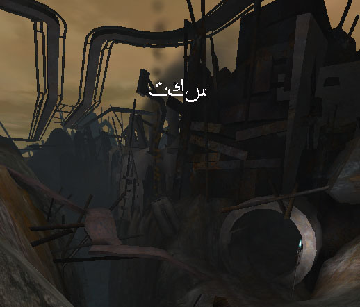

# Localization Reference

*Last updated by Chris Linder (DemiurgeStudios?), to update for 2226 and include correct arabic translation. Original author was Chris Linder (DemiurgeStudios?).*

* [Localization Reference](#localization-reference)
  + [Introduction](#introduction)
  + [How Localization Works](#how-localization-works)
    - [Localized Variables](#localized-variables)
    - [Localized Maps](#localized-maps)
    - [Localized Packages](#localized-packages)
    - [Localization Functions](#localization-functions)
  + [DumpInt](#dumpint)
    - [DumpInt Commandlet](#dumpint-commandlet)
    - [DumpInt UnrealEd Console Command](#dumpint-unrealed-console-command)
  + [Localized Text](#localized-text)
    - [Setting up Fonts for Localization](#setting-up-fonts-for-localization)
  + [Localized Audio](#localized-audio)
    - [Sound File Organization](#sound-file-organization)
    - [How to Create a Localized Sound Package](#how-to-create-a-localized-sound-package)
  + [Example](#example)
    - [Ground Work](#ground-work)
    - [Localizing the Text](#localizing-the-text)
    - [Localizing the Audio](#localizing-the-audio)
    - [Localization in Action](#localization-in-action)
  + [Downloads](#downloads)

## Introduction

The purpose of localization is to make it easy to translate your game without rewriting any code. You can use localization files (.int, .frt, .etc) to replace the properties of any variable declared as *localized*, at runtime. This is used mainly for strings, but can also be integers, floating point values, and any other variable type in Unrealscript. This modular design not only allows games to be translated without taking programmer or level designer time but also very easily allows games to be updated for new languages after they have been released.

## How Localization Works

The localized language is set in *your\_game*.ini. The parameter is **Language** in the **[Engine.Engine]** section and it can be set to any three letter language code. Language defaults to "int" which stands for international and in most cases means English.

### Localized Variables

Values for localized variables are stored per package in localization files in the system directory (Engine.int, UnrealGame.int). For all UnrealScript variables with the keyword *localized* (or CPF\_Localized in C++) the engine will look for the values of that variable in files with the extension of the localized language code. For example if your language is "frt" (French), then the engine will look for localized values in \*.frt files. The engine looks in files with the same name as the package and under that category of the class name. Localized variables for HUD.uc would be in Engine.frt under the [HUD] category if "frt" was your language. If the localized file is not found or does not contain the variable in question the engine defaults to the \*.int file. If the value is not found in the \*.int file, the value in defaultproperties is used. See [DumpInt](#dumpint) for info on generating \*.int files for each code package, which you can then use to generate different language versions.

### Localized Maps

Maps can be localized. In most cases the only information about maps that is localized is the LevelInfo but any script class stored in the level can be localized as well. In 2226 the only localized variables in LevelInfo are *Title* and the *LevelEnterText* but if you add more those will be localized too. These should be put in the `[LevelInfo0]` category in the localization file for the map. The map localization files are the name of the map with the localization language extension (for example MyMap.int or MyMap.frt) and should be stored in the system directory. See [DumpInt](#dumpint) for info on generating \*.int files for each map, which you can then use to generate different language versions.

### Localized Packages

You can localize packages by recreating the package with the same names but with the new data and saving the file with the extension \*.localization-code\_package-extension . So for example if you had a sound package VoicePack.uax, the French localized version would be VoicePack.frt\_uax. See [Localized Audio](#localized-audio) or [Example](#example) for more details.

### Localization Functions

In C++ and UnrealScript, there are Localize(...) functions which take an arbitrary key name and return its corresponding localized text. In script the function is:

```

String Localize( string SectionName, string KeyName, string PackageName )
```

|  |  |
| --- | --- |
| SectionName | The name of the [...] heading in the localization file. Generally this is the name of the class with the localized variable. |
| KeyName | The name of the localized variable. |
| PackageName | The name of the package this localized variable is in. |

In C++ the function is:

```

const TCHAR* Localize( const TCHAR* Section, const TCHAR* Key,
                       const TCHAR* Package=GPackage,
                       const TCHAR* LangExt=NULL, UBOOL Optional=0 )
```

|  |  |
| --- | --- |
| Section | The name of the [...] heading the in the localization file. Generally this is the name of the class with the localized variable but in C++ often this nothing more than an arbitrary category. |
| Key | The name of the localized variable. |
| Package | The name of the package this localized variable is in. |
| LangExt | This is the localized language code. If NULL is passed, this will use the current language. |
| Optional | If this is false, and the string could not be found, this functions will write out an error and the result returned will be a concatenation of the LangExt, Package, Section, and Key that could not be found. |

The Localize(...) function is intended mainly for C++ code where there is no convenient UObject containing defaultproperties in which to place the translatable string.In C++ there are two additional localization functions you might think about using.GetLanguage() returns the current localization language code ("int", "frt", ...). You should probably only use this when dealing specifically with the technicalities of localization if you plan on extending its functionality. Otherwise just use localized variables.SetLanguage() sets the current language. You could maybe use this to change the language mid game. I don't know if this will reload all the correct localized packages though.

## DumpInt

DumpInt is a commandlet and also an UnrealEd console command. It is used for generating \*.int files from packages. It will create an entry for every localized variable in the package in an \*.int file with the name of the package you pass it. This is used mainly for code packages and maps because they are generally the only things with localized variables. Once an \*.int file is created you can make copies for each language you plan on localizing to and have the copies translated. This process is much easier than manually going though each source file and looking for localized variables. It is worth noting that you should be careful using DumpInt on packages such as *Core* and *Engine* because there are fields specified in these \*.int files that do not correspond to localized variables. Some code reads these fields manually using [Localization Functions](#localization-functions) to localize parts of the engine that do not have localized variables. Running DumpInt on a package that already has an \*.int file and uses [Localization Functions](#localization-functions) (like *Core* and *Engine*) will overwrite the \*.int file with an incomplete version containing only the localized variables.

### DumpInt Commandlet

The DumpInt Commandlet is used at the command prompt in the system directory.Usage:`ucc DumpInt <file[s]>`For example, `"ucc DumpInt UnrealGame.u GUI.u"` will generate UnrealGame.int and GUI.int in the system directory. Below are parts from GUI.int:

```

[ExtendedConsole]
AddedCurrentHead="Added Server:"
AddedCurrentTail="To Favorites!"

[MyTestPage]
MyBackButton.Caption="BACK"
MyBackButton.Hint="Return to Previous Menu"
MyHeader.Caption="Settings"

[MyTestMultiColumnList]
ColumnHeadings[0]="Caption"
ColumnHeadings[1]="Value"
ColumnHeadings[2]="Key"

[GUIFont]
FontArrayNames=()

[fntHeaderFont]
FontArrayNames=("UT2003Fonts.FontEurostile14","UT2003Fonts.FontEurostile17","UT2003Fonts.FontEurostile21")
```

As you can see, DumpInt works on normal variables, subobject variables, static arrays, and dynamic arrays. DumpInt also works on localized variables in structs.DumpInt can also be used on maps. For example `"ucc DumpInt ..\Maps\MyMap.unr"` will create an \*.int file that contains localizable information such as the map's *Title* and the *LevelEnterText*. This information is presented twice, once under the `[LevelInfo0]` category and once under the `[LevelSummary]` category. The `[LevelInfo0]` category is the one that matters.

### DumpInt UnrealEd Console Command

The DumpInt UnrealEd console command is used from either the "Command:" text box in UnrealEd or from the log window in UnrealEd, which you bring up by trying "showlog" in the "Command:" text box.Usage:`DumpInt <package name>`DumpInt as a console command only takes one package at a time and you do not need to specify an extension. For example typing `"DumpInt GUI"` will generate the same \*.int file in the system directory as typing `"ucc DumpInt GUI.u"` at the command prompt. See [DumpInt Commandlet](#dumpint-commandlet) for more info on what DumpInt generates.

## Localized Text

Text is probably the most common use of localization. Localization files (\*.int, etc..) can contain any Unicode character and so any language even if does not use a western alphabet can be represented. To use non-standard Unicode characters (those not in Western European Windows - Codepage 1252) the file must be saved in Unicode format "Unicode - Codepage 1200". This can be done in Dev Studio by pulling down the arrow next to the save button in the Save-As dialog and selecting "Unicode - Codepage 1200" for *Encoding:* and leaving *Line endings:* at "Current Setting". You can put Unicode characters in your document in many ways like pasting from Character Map in Windows or pasting from a web page that generates Unicode characters such as Babel Fish (<http://world.altavista.com/>).

### Setting up Fonts for Localization

Once you have the localization files generated, the next trick is making sure your game can display them. In many cases this is easy because the languages you are translating to will use the same western alphabet, like German or French. Clearly this does not work in all cases though, Japanese being a prime example. Luckily you can localize textures packages which contain the font information so dropping in a new font to go with your new text requires no code changes.

## Localized Audio

Localizing audio is very helpful if you plan to have speech in your game. You will need to record different versions of the speech in your game for different languages. Clearly, you will not need to record new versions of your sound effects. It is therefore best to separate sounds into packages of sounds that require translation and those that do not. You can then create different versions of those sounds packages that need translation for each language.

### Sound File Organization

This document will assume three things about your sound file organization.

1. You have recorded different versions of all the wav files for all the languages you want in your game.
2. You have given these wav files the exact same names for the different languages and stored them different directories.
3. You want the sounds in Unreal to be named the same as the wav file names.

If you have not done either of these things I would suggest reorganizing or renaming your files because in the long run it will be much easier this way.

### How to Create a Localized Sound Package

Let us say we want to localize the sound packages VoicePack stored in the file VoicePack.uax. First make a copy of VoicePack.aux named sometime like VoicePack.uax.save.Now, open VoicePack.uax in the Sounds browser in Unrealed. Next go to File -> Import... Open the directory where your wav files are stored, select a group (if you are using Unreal package groups, if not select them all), and then click Open. Make sure the Package is your sounds package, VoicePack in this case and the Group is set appropriately. Now you can click OK All and all the sounds will import. Now go to File - > Save... and save the package as VoicePack.uax.Exit Unrealed and go the Sounds directory in your game. Copy VoicePack.uax to something like VoicePack.frt\_uax or VoicePack.arb\_uax depending on the language. The three letter language prefix to "\_uax" should be the same language code you are using to localize text to this language. You can use whatever 3 letter code you want; all it has to do is be the same as the localization code you are planning on using for this language. If you need to localize for another language just repeat this process.When you are done, rename VoicePack.uax.save to VoicePack.uax and you are ready to go. When the "Language" parameter in uw.ini is set to your language code you will hear the localized versions of the sounds when you run the editor or the game, even when you open VoicePack.uax explicitly. When the "Language" parameter in uw.ini is set to "int" you will hear the default sounds.

## Example

This example will go over displaying a paused message on the HUD in English, French, Japanese and Arabic. As well as displaying a message a voice will say "paused" in English, French, or Spanish every time you pause. This will demonstrate not only the ability to localize but also illustrate how falling back works if there is no appropriate value for the given language.(Note: If the translations are bad, please forgive me, this is meant only to be an example. Credit to Rebecca Linder for the arabic translation. For the voices, if the accent is not perfect, please forgive Jason Lentz, I forced him to help me.)

### Ground Work

For this example I created a very simple game type (*LocalGame.uc*) and a very simple HUD (*LocalHUD.uc*) and put them in a package called *LocalExample*. The HUD simply draws the text pause-message and plays a sound when the game is paused. LocalHUD has one localized variable:**```

var localized string PauseMessage;
```**In *LocalExample.int* the pause message is defined like so:**```

[LocalHUD]
PauseMessage=paused
```**LocalHUD used *LocalFonts.BigFont* as its font. This font was created by making the following text file (*LocalFonts.exec*) and then typing "exec LocalFonts.exec" in the log in Unrealed. This created the *LocalFonts.utx* textures package. See the [Font Tutorial](FontTutorial.md) for more information on creating fonts.**```

new truetypefontfactory package=LocalFonts name=BigFont
fontname="Arial Unicode MS" height=30
obj savepackage package="LocalFonts" file="..\textures\LocalFonts.utx"
```**The sound that is played is *LocalSounds.Paused*.

### Localizing the Text

To localize the text I created *LocalExample.frt*, *LocalExample.jap*, and *LocalExample.arb* for French, Japanese, and Arabic respectively. The Japanese and Arabic versions I saved in **Unicode - Codepage 1200** format while the French version did not need this. The files are listed below:**French**   
[LocalHUD]
PauseMessage=fait une pause**Japanese**   
[LocalHUD]
PauseMessage=休止する**Arabic**   
[LocalHUD]
PauseMessage=سكتI then generated the Japanese and Arabic fonts by changing *LocalFonts.exec* from above re-running the exec command from Unrealed for each language. You must restart Unrealed for each new font because it saves the font info.**```

new truetypefontfactory package=LocalFonts name=BigFont
fontname="Arial Unicode MS" height=30 Path="." WildCard="*.jap"
obj savepackage package="LocalFonts" file="..\textures\LocalFonts.jap_utx"

new truetypefontfactory package=LocalFonts name=BigFont
fontname="Times New Roman" height=30 Path="." WildCard="*.arb"
obj savepackage package="LocalFonts" file="..\textures\LocalFonts.arb_utx"
```**

### Localizing the Audio

I created French and Spanish version of the audio as discussed above in the [Localized Audio](#localized-audio) section. In the end I had *LocalSound.uax*, *LocalSounds.frt\_uax*, and *LocalSounds.spn\_uax*.

### Localization in Action

You can [download](#downloads) the code and texture packs and audio packs and drop it into and 2226 based build very easily. Simply unzip the file into a 2226 directory, open a command prompt in the system directory and type:**```

uw LocalMap?Game=LocalExample.LocalGame
```**and pause the game. At first it will be in English but you can experiment with different languages by changing the Language setting in uw.ini. Try any of these:

|  |  |
| --- | --- |
| frt | French |
| jap | Japanese |
| arb | Arabic |
| spn | Spanish |

If you do not have a 2226 build this code will still work, you will just need to rebuild *LocalExample.u* for your build of the engine.Enjoy! 楽しみなさい Appr�ciez! 享用 Goce! 유열하십시요 Aprec�e!

## Downloads

