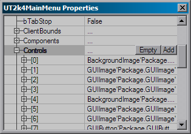
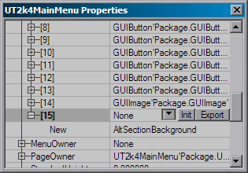
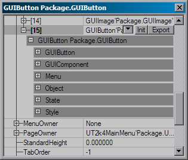

# User Interface Design

*Last updated by Michiel Hendriks, pretty much rewrote it. Previously Updated by Richard 'vajuras' Osborne (SecretLevel?) for document creation. Originally written by Joe Wilcox ([EpicGames](https://udn.epicgames.com/Main/EpicGames)).*

* [User Interface Design](#user-interface-design)
  + [Ingame Layout](#ingame-layout)
    - [Simple editor](#simple-editor)
    - [All editor hotkeys](#all-editor-hotkeys)
    - [Property Editor](#property-editor)
  + [BatchExport Issues](#batchexport-issues)

## Ingame Layout

This document describes the engine's ingame feature to allow programmers to dynamically adjust GUI components. The ingame design tool allows GUI designers/programmers to adjust settings and post the changes into their scripts.In order to be able to use any of the in-game UI editing feature you will have to set the following in the `User.ini` file

```

[XInterface.GUIController]
bModAuthor=true
```

### Simple editor

To activate the simple editor press `Ctrl+Alt+D`. In this mode you'll be able to move and resize the selected component. To select a component hold `Ctrl` and select the control with the left mouse button, or use `Ctrl+Tab` to cycle through the component list. Subsequent clicks on the smae spot will cycle through the z-order of the components. A red border will be shown around the selected components, you can temporarily hide this frame by holding the `Shift` key.Once a component is selected you can move it around with the cursors keys while holding the `Ctrl` key. You can also move components with the mouse when holding `Ctrl+Alt+Left Mouse Button`, however this only works well in windowed mode or with mouse acceleration set to 1.To resize a component hold the `Ctrl` and press one of the following keys:

|  |  |
| --- | --- |
| = | increase the height |
| - | decrease the height |
| numpad + | increase the width |
| numpad - | decrease the width |

When holding `Ctrl+Alt` the component will be resized with larger steps.After you made the changes you can copy the current position and dimesion to the clipboard for easy pasting in the code by pressing `Ctrl+c`.

### All editor hotkeys

Here's a list of all editor hotkeys. Can also see this list by holding `F1` while in design mode.
Legenda: (Key) only when holding this key; [Key] only required when not in *interactive* mode.

| [Key](https://udn.epicgames.com/bin/publish/WebHome?webs=Main%2CTwo%2CThree%2CPowered&amp;inclusions=%2A&amp;exclusions=&amp;filter=&amp;inclfilter=%5C%25META%5C%3AFIELD%5C%7Bname%5C%3D%5C%22Documentavailability%5C%22.%2Avalue%5C%3D%5C%22General%20public%5C%22&amp;filterbymeta=yes&amp;skin=static_udn3&amp;restrictedclass=restricted&amp;format=&amp;sortcol=0;table=2;up=0#sorted_table "Sort by this column") | [Meaning](https://udn.epicgames.com/bin/publish/WebHome?webs=Main%2CTwo%2CThree%2CPowered&amp;inclusions=%2A&amp;exclusions=&amp;filter=&amp;inclfilter=%5C%25META%5C%3AFIELD%5C%7Bname%5C%3D%5C%22Documentavailability%5C%22.%2Avalue%5C%3D%5C%22General%20public%5C%22&amp;filterbymeta=yes&amp;skin=static_udn3&amp;restrictedclass=restricted&amp;format=&amp;sortcol=1;table=2;up=0#sorted_table "Sort by this column") |
| --- | --- |
| (F1) | View this help screen. |
| Ctrl + Alt + D | Toggles design mode. |
| Ctrl + Alt + E | Toggles [property editor](#propertyeditor) mode. |
| [Ctrl +] H | Toggles active/focused info; This will show some component details at the bottom of the screen. |
| [Ctrl +] I | Toggle interactive mode; when enabled some functions are more easy accessable. |
| [Ctrl +] P | Toggles full MenuOwner? chains for active/focused |
| [Ctrl +] C | Copy position and dimension to the clipboard |
| [Ctrl +] X | Export the selected component to the clipboard; This is usefull in combination with the [property editor](#propertyeditor) |
| [Ctrl +] U | Refresh the property editor window in the designer. |
| [Ctrl +] Up/Down/Left/Right | Reposition the selected component using arrow keys. |
| [Ctrl +] =/- | Resize the selected component vertically. |
| [Ctrl +] Num+/Num- | Resize the selected component horizontally. |
| [Ctrl +] WheelUp? | Set the current component to the component's menuowner. |
| [Ctrl +] WheenDown? | Set the current component to components's focused control. |
| [(Ctrl + Alt) +] MouseX?/Y+LMouse | Reposition the selected component using mouse. |
| (Shift) | Hides all design mode indicators. |
| (Ctrl + Alt) | View focus chain in top of the screen, only visible when the detail info is visible (`Ctrl+H`). |
| [Ctrl +] Tab | Select new component. |
| [Ctrl +] LMouse | Select new component. |

### Property Editor

In order to use this you first have to set the following in the `User.ini`:

```

[XInterface.GUIController]
DesignerMenu=GUIDesigner.PropertyManager
```

Now when you press `Ctrl+Alt+E` or every time you select a new component the property editor window will show up. You will have to switch to windowed mode for this to be usefull. The property editor is in fact normal more that the normal property editor that you'll also find in UnrealEd. With this you will be able to change pretty much every variable of the GUI components.The changes you make will be directly visible in the game, after you've made the changes you can export the whole GUI object by pressing `Ctrl+X`, you can simply paste this in the *defaultproperties* section.



It's also possible to add new components on the fly. To do this select a GUIMultiComponent (this is usually a GUIPage) and open the Menu section in the property editor. There you will find an entry **Controls**, when you select it you can press the **Add** button to add a new control.



It is possible to reuse an existing component, however this doesn't always work well. It's best you select a new component class and press the **New** button.



After you created the button, you will have to initialize it before it will show up on screen, you can do this by selecting the new entry in the controls list and press the **Init** button. After you made the changes you can press `Ctrl+X` or press the **Export** button to export the component to the clipboard. Note: you will still have to hook up the class variable for the new component.There are a few things you can not edit, one of them being the context popup windows.

## BatchExport Issues

In v3323 exporting of subobjects has been fixes for the better of it. However in some cases not everything is exported. So it's best to use the released source code as reference and guidance instead of the exported code. You can get the source code releases [here](../../Uncategorized/USCRIPTDownload.md).

