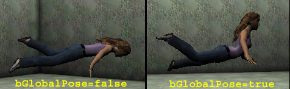

# Actor Functions

*Created by Chris Linder (DemiurgeStudios?) on 12-08-03 for 2226 builds. Last Updated by Chris Linder (DemiurgeStudios?). Last update by Michiel Hendriks, adapeted content for v3323 and added more functions*

* [Actor Functions](ActorFunctions.md#Actor Functions)
  + [Related Documents](ActorFunctions.md#Related Documents)
  + [Introduction](ActorFunctions.md#Introduction)
  + [Misc](ActorFunctions.md#Misc)
    - [Trace](ActorFunctions.md#Trace)
    - [FastTrace](ActorFunctions.md#FastTrace)
    - [Spawn](ActorFunctions.md#Spawn)
    - [ConsoleCommand](ActorFunctions.md#ConsoleCommand)
    - [Error](ActorFunctions.md#Error)
    - [OnlyAffectPawns](ActorFunctions.md#OnlyAffectPawns)
    - [AddToPackageMap](ActorFunctions.md#AddToPackageMap)
    - [CopyObjectToClipboard](ActorFunctions.md#CopyObjectToClipboard)
    - [GetNextInt](ActorFunctions.md#GetNextInt)
    - [GetNextIntDesc](ActorFunctions.md#GetNextIntDesc)
    - [GetAllInt](ActorFunctions.md#GetAllInt)
    - [GetAllIntDesc](ActorFunctions.md#GetAllIntDesc)
    - [GetCacheEntry](ActorFunctions.md#GetCacheEntry)
    - [MoveCacheEntry](ActorFunctions.md#MoveCacheEntry)
    - [GetURLMap](ActorFunctions.md#GetURLMap)
    - [GetUrlOption](ActorFunctions.md#GetUrlOption)
    - [UpdateURL](ActorFunctions.md#UpdateURL)
  + [Debug](ActorFunctions.md#Debug)
    - [DebugClock](ActorFunctions.md#DebugClock)
    - [DebugUnclock](ActorFunctions.md#DebugUnclock)
    - [DrawDebug\*](ActorFunctions.md#DrawDebug*)
    - [DrawStayingDebugLine](ActorFunctions.md#DrawStayingDebugLine)
    - [ClearStayingDebugLines](ActorFunctions.md#ClearStayingDebugLines)
  + [Physics](ActorFunctions.md#Physics)
    - [SetPhysics](ActorFunctions.md#SetPhysics)
    - [SetCollision](ActorFunctions.md#SetCollision)
    - [SetCollisionSize](ActorFunctions.md#SetCollisionSize)
  + [Rendering](ActorFunctions.md#Rendering)
    - [SetDrawScale](ActorFunctions.md#SetDrawScale)
    - [SetDrawScale3D](ActorFunctions.md#SetDrawScale3D)
    - [SetStaticMesh](ActorFunctions.md#SetStaticMesh)
    - [SetDrawType](ActorFunctions.md#SetDrawType)
  + [Movement](ActorFunctions.md#Movement)
    - [Move](ActorFunctions.md#Move)
    - [SetLocation](ActorFunctions.md#SetLocation)
    - [SetRotation](ActorFunctions.md#SetRotation)
    - [SetRelativeRotation](ActorFunctions.md#SetRelativeRotation)
    - [SetRelativeLocation](ActorFunctions.md#SetRelativeLocation)
    - [MoveSmooth](ActorFunctions.md#MoveSmooth)
    - [AutonomousPhysics](ActorFunctions.md#AutonomousPhysics)
  + [Relations](ActorFunctions.md#Relations)
    - [SetBase](ActorFunctions.md#SetBase)
    - [SetOwner](ActorFunctions.md#SetOwner)
  + [Animation](ActorFunctions.md#Animation)
    - [GetMeshName](ActorFunctions.md#GetMeshName)
    - [PlayAnim](ActorFunctions.md#PlayAnim)
    - [LoopAnim](ActorFunctions.md#LoopAnim)
    - [AnimStopLooping](ActorFunctions.md#AnimStopLooping)
    - [TweenAnim](ActorFunctions.md#TweenAnim)
    - [IsAnimating](ActorFunctions.md#IsAnimating)
    - [FinishAnim](ActorFunctions.md#FinishAnim)
    - [HasAnim](ActorFunctions.md#HasAnim)
    - [StopAnimating](ActorFunctions.md#StopAnimating)
    - [FreezeAnimAt](ActorFunctions.md#FreezeAnimAt)
    - [SetAnimFrame](ActorFunctions.md#SetAnimFrame)
    - [IsTweening](ActorFunctions.md#IsTweening)
  + [Animation Notifications](ActorFunctions.md#Animation Notifications)
    - [AnimEnd](ActorFunctions.md#AnimEnd)
    - [EnableChannelNotify](ActorFunctions.md#EnableChannelNotify)
    - [GetNotifyChannel](ActorFunctions.md#GetNotifyChannel)
  + [Skeletal Animation](ActorFunctions.md#Skeletal Animation)
    - [LinkSkelAnim](ActorFunctions.md#LinkSkelAnim)
    - [LinkMesh](ActorFunctions.md#LinkMesh)
    - [BoneRefresh](ActorFunctions.md#BoneRefresh)
    - [AnimBlendParams](ActorFunctions.md#AnimBlendParams)
    - [AnimBlendToAlpha](ActorFunctions.md#AnimBlendToAlpha)
    - [GetBoneCoords](ActorFunctions.md#GetBoneCoords)
    - [GetBoneRotation](ActorFunctions.md#GetBoneRotation)
    - [GetRootLocation](ActorFunctions.md#GetRootLocation)
    - [GetRootRotation](ActorFunctions.md#GetRootRotation)
    - [GetRootLocationDelta](ActorFunctions.md#GetRootLocationDelta)
    - [GetRootRotationDelta](ActorFunctions.md#GetRootRotationDelta)
    - [LockRootMotion](ActorFunctions.md#LockRootMotion)
    - [AttachToBone](ActorFunctions.md#AttachToBone)
    - [DetachFromBone](ActorFunctions.md#DetachFromBone)
    - [SetBoneScale](ActorFunctions.md#SetBoneScale)
    - [SetBoneDirection](ActorFunctions.md#SetBoneDirection)
    - [SetBoneLocation](ActorFunctions.md#SetBoneLocation)
    - [SetBoneRotation](ActorFunctions.md#SetBoneRotation)
    - [GetAnimParams](ActorFunctions.md#GetAnimParams)
    - [AnimIsInGroup](ActorFunctions.md#AnimIsInGroup)
  + [Sound](ActorFunctions.md#Sound)
    - [PlaySound](ActorFunctions.md#PlaySound)
    - [PlayOwnedSound](ActorFunctions.md#PlayOwnedSound)
    - [DemoPlaySound](ActorFunctions.md#DemoPlaySound)
    - [GetSoundDuration](ActorFunctions.md#GetSoundDuration)
    - [PlayMusic](ActorFunctions.md#PlayMusic)
    - [StopMusic](ActorFunctions.md#StopMusic)
    - [StopAllMusic](ActorFunctions.md#StopAllMusic)
    - [AllowMusicPlayback](ActorFunctions.md#AllowMusicPlayback)
    - [PlayStream](ActorFunctions.md#PlayStream)
    - [StopStream](ActorFunctions.md#StopStream)
    - [SeekStream](ActorFunctions.md#SeekStream)
    - [AdjustVolume](ActorFunctions.md#AdjustVolume)
    - [PauseStream](ActorFunctions.md#PauseStream)
  + [Latent functions](ActorFunctions.md#Latent functions)
    - [Sleep](ActorFunctions.md#Sleep)
    - [FinishInterpolation](ActorFunctions.md#FinishInterpolation)
  + [Karma](ActorFunctions.md#Karma)
    - [KGetRBQuaternion](ActorFunctions.md#KGetRBQuaternion)
    - [KGetRigidBodyState](ActorFunctions.md#KGetRigidBodyState)
    - [KDrawRigidBodyState](ActorFunctions.md#KDrawRigidBodyState)
    - [KRBVecToVector](ActorFunctions.md#KRBVecToVector)
    - [KRBVecFromVector](ActorFunctions.md#KRBVecFromVector)
    - [KSetMass](ActorFunctions.md#KSetMass)

## Related Documents

[ActorVariables](ActorVariables.md)

## Introduction

This document attempts to go over all native functions and events defined in *Actor.uc*. Native functions are functions defined in C++ that can be called from UnrealScript and events are UnrealScript functions called from C++. Currently this document is does not cover all native functions and events so if you find it lacking you should check UnProg or email [chris@demiurgestudios.com](mailto:chris@demiurgestudios.com).

## Misc

### Trace

```

native final function Actor Trace( out vector      HitLocation,
                                   out vector      HitNormal,
                                   vector          TraceEnd,
                                   optional vector TraceStart,
                                   optional bool   bTraceActors,
                                   optional vector Extent,
                                   optional out material Material)
```

*Trace* is one of the most useful functions in UnrealScript. It casts a ray (aka "traces") into the world and returns what it collides with first. *Trace* takes into account both this actor's [collision properties](ActorVariables.md#Collision) and the [collision properties](ActorVariables.md#Collision) of the objects *Trace* may hit. If *Trace* does not hit anything it returns `NONE`; if *Trace* hits level geometry (BSP) it returns the current *LevelInfo*; otherwise *Trace* returns a reference to the *Actor* it hit.`HitLocation, HitNormal, Material` -- If *Trace* hits something, *HitLocation*, *HitNormal*, and *Material* will be filled in with the location of the hit, the normal of the surface *Trace* hit, and the material *Trace* hit. Note that *HitLocation* is not exactly the location of trace hit, it is bounced back along the direction of trace a very small amount (in my tests it was between 0.5 and 3.9 Unreal Units).`TraceEnd, TraceStart` -- When you call *Trace*, *TraceEnd* is the end of the line you want to trace and *TraceStart* is the beginning. If you do not specify *TraceStart* the current location of this actor will be used. The farther apart *TraceEnd* and *TraceStart* are the longer *Trace* will take to compute.
`bTraceActors` -- If you don't pass *bTraceActors*, *Trace* uses this actor's value of *bCollideActors* for *bTraceActors*. Pawns for example, have *bCollideActors* set to `TRUE` which means if you call *Trace* without *bTraceActors* it will use `TRUE`. When *bTraceActors* is `FALSE` the trace can only hit world geometry and movers. World geometry includes BSP, Terrain, blocking volumes, and things that have *bWorldGeometry* set to true, like StaticMeshes. If *bTraceActors* is `TRUE`, traces can additionally hit all other actor types. Based on *bTraceActors*, even if traces can hit a particular type of object, the individual [actor collision settings](ActorVariables.md#Collision) of the object that might be hit determine if the traces do in fact hit. For example, many actors have *bCollideActors* set to `FALSE` which means no type of trace will hit that actor. Blocking volumes have *bCollideActors* set to `TRUE` but *bBlockZeroExtentTraces* set to `FALSE` which means zero extent traces (see [below](ActorFunctions.md#ExtentZeroNonZero)) will not hit blocking volumes. Non-zero extent traces will hit blocking volumes because *bBlockNonZeroExtentTraces* is `TRUE`. Sometimes the collision test is much more nuanced; for example, setting *bProjTarget* to `TRUE` will cause non-colliding actors to be hit by traces. Additionally, if the actor that might be hit has *bOnlyAffectPawns* set to `TRUE` and this actor is not a pawn, the trace will not hit. Likewise, if this actor has *bOnlyAffectPawns* set to `TRUE`, and the actor that might be hit is not a pawn, the trace will not hit. For more details on if a trace will hit a particular type of actor check the *ShouldTrace* function in C++ (if you have access to source).
`Extent` -- There are two types of traces in Unreal, zero-extent traces and non-zero-extent traces. A zero-extent trace is just a line in space; a non-zero-extent trace is a volume projected through space. Non-zero-extent traces are slower. Sometimes zero-extent traces are called line checks or line collision and non-zero-extent traces are called box checks or box collision. To do a zero-extent trace, either don't pass in *Extent* or a pass `vect(0,0,0)`. To do a non-zero-extent trace, pass in anything other than a zeroed vector. Non-zero-extent traces function a little differently than zero-extent traces aside from the fact that one is a line and the other is a projected volume. When a zero-extent trace ends exactly on something, the trace does not hit that object; when a non-zero-extent trace ends exactly on an object, the trace hits that object.The rest of this section will talk about non-zero-extent traces because zero-extent traces are pretty straight forward. The *Extent* of a non-zero-trace is interpreted differently for different types of actor and different types of collision. Each object potentially colliding with the projected trace volume gets to evaluate the collision in its own manner. For example, static meshes and BSP treat *Extent* as a world aligned rectangular prism. So if the X and Y values of *Extent* are different, *Trace* will behave differently depending on the direction in which the trace was done. Actors with cylinder collision interpret *Extent* as a cylinder (when *Extent.X* != *Extent.Y* the collision gets a little weird). In general you want to have the *Extent.X* == *Extent.Y*.As an example of how non-zero-extent trace work differently for different objects, we will talk about pawn movement which uses non-zero-extent traces. If you make a BSP cube that is aligned at 45 degrees and pawns walk into the walls of this cube you will note that the collision cylinder of the pawn (shown my typing `"rend collision"` at the console in the [UDNBuild](https://udn.epicgames.com/Two/UDNBuildFeatures#In_Game_Collision_Rendering)) does not touch the walls. But if you walk into orthogonally aligned walls, the cylinder will touch the walls. This is because BSP treats the *Extent* of the trace for pawn movement as a world aligned rectangular prism. However, when two pawns walk into each other, they will bump into each other and slide off each other like they are true cylinders. This is because pawns treat the *Extent* of the trace for pawn movement as a cylinder.Other documents of interest:If you are using many traces in a row, you might want to check out the *TraceActors* iterator in the [UnrealScriptReference](../Technical and Programming/UnrealScript/UnrealScriptReference.md#ForEach_and_iterator_functions). Also, for really nitty-gritty info on tracing and collision in C++ check out the [CollisionHash](https://udn.epicgames.com/Two/CollisionHash) document.

### FastTrace

`native final function bool FastTrace(vector TraceEnd, optional vector TraceStart)`*FastTrace* is very similar to [Trace](ActorFunctions.md#Trace) except that it has a simplified set of options and it is faster. Also, *FastTrace* does not return what it hit; it returns `FALSE` if it hit something and `TRUE` if it hit nothing. *FastTrace* only traces world geometry and movers. This is the same as having [bTraceActors](ActorFunctions.md#TraceActors) set to `FALSE` in the [Trace](ActorFunctions.md#Trace) function.

### Spawn

```

native final function actor Spawn( class<actor>     SpawnClass,
                                   optional actor   SpawnOwner,
                                   optional name    SpawnTag,
                                   optional vector  SpawnLocation,
                                   optional rotator SpawnRotation)
```

*Spawn* creates an actor in the world. This function returns an actor of the specified class, not of class *Actor* (this is hardcoded in the compiler). *Spawn* returns *NONE* if the actor could not be spawned which will happen for example if the actor wouldn't fit in the specified location, or the actor list is full.*SpawnOwner* is the *Owner* of this new actor. (See [SetOwner](ActorFunctions.md#SetOwner) for more info about *Owner*.) If you do not specify *SpawnOwner*, this actor will be spawned without an owner. If you specify a *SpawnTag*, the *Tag* of the new actor will be set to that, otherwise, it will not have a *Tag*.*SpawnLocation* is the location at which the new actor is spawned. If no *SpawnLocation* is specified, the location of the actor calling *Spawn* is used. Likewise, *SpawnRotation* is the rotation for the newly spawned actor and if none is specified, the rotation of the actor calling *Spawn* is used.

### ConsoleCommand

`native function string ConsoleCommand( string Command, optional bool bWriteToLog )`Execute a console command in the context of the current level and game engine. In most cases this does not include "exec" functions in *PlayerController* or *Pawn*. Certain class, such as *PlayerController* and *Interation* override *ConsoleCommand* to execute exec functions in a different context. *PlayerController* for example executes function for the player and for the game engine. This means that calling the *ConsoleCommand* function in *PlayerController.uc* will have different results than calling the *ConsoleCommand* function in *Pawn.uc*. For example the function below will work when placed in a subclass of *PlayerController* but not when placed in subclass of *Pawn*.`bWriteToLog` is new in v3323, if set to true the console command return will be written to the log file, in this case the return value is always empty.

```

exec function ConTest()
{
   ConsoleCommand("ToggleBehindView");
}
```

### Error

`native final function Error( coerce string S )`Prints an error message of the following form and then destroys this one actor.ScriptWarning: <ClassName> <MapName>.<ObjectName> (Function <PackageName>.<ClassName>.<FunctionName>:000E) <Text in string S>For example, if you call the following function in class *TestPawn* when you are in the map "EM\_Runtime"...

```

exec function ErrorTest()
{
   Error("Error Test");
}
```

the following will be printed to the log:`ScriptWarning: TestPawn EM_Runtime.TestPawn0 (Function TestPawns.TestPawn.ErrorTest:000E) Error Test`

### OnlyAffectPawns

`native final function OnlyAffectPawns(bool B)`This function sets the value of *bOnlyAffectPawns* to the value of *B* that you pass in. *bOnlyAffectPawns* is used for [Trace](ActorFunctions.md#Trace) calculations and to determine if actors are overlapping.

### AddToPackageMap

`native final function AddToPackageMap(optional string PackageName)`Add `PackageName` to the server's packagemap (as if it was in GameEngine's ServerPackages list). If `PackageName` is omitted, the package of the actor is added.
This function is only valid during initialization (between *GameInfo::InitGame()* and *GameInfo::SetInitialState()* )
If called outside of that window, or anytime on a client, the function returns without doing anything.
This function is usefull for optional add-ons that require a package to be in the ServerPackages list in order to work properly.

### CopyObjectToClipboard

`native function CopyObjectToClipboard(Object Obj)`Copy the specified object's properties to the clipboard, the format depends on the object's type.
\* Actors are copied so that they can be pasted in UnrealEd
\* The data copied for non-actors is to be used within the *defaultproperties* block of a script class.

### GetNextInt

`native final function string GetNextInt( string ClassName, int Num )`With this function it's possible to get the Object meta specifications in the *[Public]* section of the localization files. This was previously used for game types, mutators, weapons, etc (v3323 uses a much faster caching system for these now).
*ClassName* is the meta class of all objects to retrieve. *Num* is the sequence number. The return value is the name of the object found. To get all class names simply call this function while increasing *num* until an empty string is returned.For example in *Core.int* the following is specified:

```

[Public]
Object=(Name=Core.HelloWorldCommandlet,Class=Class,MetaClass=Core.Commandlet,Description="Hello world!")
```

Calling `GetNextInt("Core.Commandlet", 0)` will return `"Core.HelloWorldCommandlet"` .

### GetNextIntDesc

`native final function GetNextIntDesc( string ClassName, int Num, out string Entry, out string Description )`The *object* specifications in the *[Public]* section can also contain a

```
Description=""
```

section. This function allows you to retrieve this description together with the class name.
This function works just like [GetNextInt](ActorFunctions.md#GetNextInt) except that it doesn't return the class name.

### GetAllInt

`native static final function GetAllInt( string MetaClass, array Entries )`This function does the same as [GetNextInt](ActorFunctions.md#GetNextInt) except that it returns all entries at once.

### GetAllIntDesc

`native static final function GetAllIntDesc( string MetaClass, out array Entry, out array Description )`This function does the same as [GetNextIntDesc](ActorFunctions.md#GetNextIntDesc) except that it returns all entries and descriptions at once.

### GetCacheEntry

`native final function bool GetCacheEntry( int Num, out string GUID, out string Filename )`This function will return the entries in the download cache (files downloaded from the server).
`Num` is the sequence number, keep calling this function while increasing `Num` to get all cache entries (until `GUID` is empty).
`GUID` is the global unique identifier of the downloaded package, and `Filename` is the filename of the package.
The cache entries can be moved from the cache by using the [MoveCacheEntry](ActorFunctions.md#MoveCacheEntry) functions.

### MoveCacheEntry

`native final function bool MoveCacheEntry( string GUID, optional string NewFilename )`This will move a cache entry from the cache to it's correct location. Depeding on the extention and the *Paths* configuration the file will be moved to the right directory. The file will be moved to the first directory in the *Paths* array the matches the filename, e.g. MyMap.ut2 -> ../Maps/ .
If `NewFilename` is empty the original filename will be used..

### GetURLMap

`native(547) final function string GetURLMap( optional bool bIncludeOptions )`This function returns the last URL, that is the URL used to get to the current level. If bIncludeOptions is true (defaults to false) also the options of the URL are included.

### GetUrlOption

`native final function string GetUrlOption(string Option)`Returns the value of an option given in the URL used to get to this level.
For example if the url is `DM-MyMap?name=MyName?skin=MySkins.Skin1`
The call `GetUrlOption("name")` returns `"MyName"` .

### UpdateURL

`native final function UpdateURL(string NewOption, string NewValue, bool bSaveDefault)`This will update the last used URL with `NewOption` and `NewValue`. If `NewValue` is empty the `NewOption` element will be removed.
If `bSaveDefault` is true the changes will be saved to *User.ini* so it will always be used in the future.
After calling *UpdateURL* the last URL is modified, so *GetURLMap* and *GetUrlOption* will return the modified URL.

## Debug

### DebugClock

`native final function DebugClock()`*DebugClock*, along with [DebugUnclock](ActorFunctions.md#DebugUnclock), can be used to time the performance of blocks of UnrealScipt. Calling *DebugClock* starts a timer that totals up milliseconds until *DebugUnclock* is called. You can see the results of this timer by typing `"stat game"` at the console in game. The last stat in the "Game" category is "ScriptDebug" which is how much time the *DebugClock* / *DebugUnClock* took. This value is calculated every frame so make sure you start and stop the clock within a frame.

### DebugUnclock

`native final function DebugUnclock()`See [DebugClock](ActorFunctions.md#DebugClock).

### DrawDebug\*

```

native final function DrawDebugLine( vector LineStart, vector LineEnd, byte R, byte G, byte B)
native final function DrawDebugCircle( vector Base, vector X, vector Y, float Radius, int NumSides, byte R, byte G, byte B)
native final function DrawDebugSphere( vector Base, float Radius, int NumDivisions, byte R, byte G, byte B)
```

Debug functions to draw arbitrary lines\circles\spheres. These functions are slow and should only be used for debugging. After the element is rendered it's cleared from the draw stack, so it won't be drawn the next frame.
These elements are rendered as one of the last parts of the level scene, right before `HUD.eventWorldSpaceOverlays()` is called.
More DrawDebug functions are available via the native class `FTempLineBatcher`.

### DrawStayingDebugLine

`native final function DrawStayingDebugLine( vector LineStart, vector LineEnd, byte R, byte G, byte B)`This function is almost identical to [DrawDebugLine](ActorFunctions.md#DrawDebugLine) except that these lines are won't be cleared the next frame. The lines will be drawn until they are cleared.

### ClearStayingDebugLines

`native final function ClearStayingDebugLines()`This will clear the persistant lines drawn with [DrawStayingDebugLine](ActorFunctions.md#DrawStayingDebugLine). It's the only way to get rid of them.

## Physics

### SetPhysics

`native final function SetPhysics( EPhysics newPhysics )`This command sets the physics of this actor to *newPhysics*. For physics to work on an actor, that actor must have *bStatic* set to `FALSE`. The possible options for physics are:

* `PHYS_None` -- Physics is not computed for this actor. This means that the actor does not move on its own though you can call functions like [Move](ActorFunctions.md#Move) and [SetLocation](ActorFunctions.md#SetLocation) to move the actor. Attachments (see [SetBase](ActorFunctions.md#SetBase) and [AttachToBone](ActorFunctions.md#AttachToBone)) are normally set to *PHYS\_None*.
* `PHYS_Walking` -- (Only used for Pawns) This pawn is moving on the ground and is sort of affected by gravity. "Sort of affected by gravity" means that if the pawn walks off an edge, or on a slope that is too steep, it will switch into *PHYS\_Falling* at which point it will be affected by gravity. In most cases this works well but if a pawn runs from a flat surface to an sharply angled surface the pawn will be able to descend more quickly than if the pawn had run off a cliff. Clearly this is not correct but in most cases it is not noticeable. In v3323 `PHYS_Walking` is also available to any other actor, however it is very limited. It doesn't emulate friction, max speed, or anything. All it does is force the object to stick to the ground and climb up/down small steps.
* `PHYS_Falling` -- This object is falling and is affected by gravity. In many cases objects in *PHYS\_Falling* will have their momentum redirected when they hit a non-floor surface. "Floors" are anything that is within 45 degree of flat (this is the same as floors that Pawns can walk on, see `MINFLOORZ` for more details). Also, objects that [bounce](ActorFunctions.md#Bouncing) or objects that implement a *HitWall* function will handle momentum in their own way.
* `PHYS_Swimming` -- (Used only for Pawns.) This pawn is swimming in water.
* `PHYS_Flying` -- (Only used for Pawns) This pawn is flying and is not affected by gravity. In v3323 a simple version of `PHYS_Flying` is also available to all other actors.
* `PHYS_Rotating` -- This actor will rotate in place in one of two ways. If you set *bFixedRotationDir* is `TRUE` (and set *bRotateToDesired* `FALSE`), the actor will rotate at the rate specified in *RotationRate* which is given in Unreal Rotation Units (65536 = 360 degrees) per second. Each frame *RotationRate* is multiplied by DeltaTime and is then added to *Rotation* which means that rotation will always take place in global space. The other way to rotate is set *bRotateToDesired* to `TRUE` (and set *bFixedRotationDir* to `FALSE`) and specify a rotation in *DesiredRotation*. The *Rotation* of this actor will approach *DesiredRotation* at the rate specified by *RotationRate*. When *Rotation* equals *DesiredRotation* the actor will not longer rotate.
* `PHYS_Projectile` -- This actor is a projectile. It is not affected by gravity and travels in a straight line based on its *Velocity* and *Acceleration*. Actors with *PHYS\_Projectile* can rotate in the same way as *PHYS\_Rotating* actors described above. Also, actors with *PHYS\_Projectile* can [bounce](ActorFunctions.md#Bouncing).
* `PHYS_Interpolating` -- *PHYS\_Interpolating* does not appear to be used.
* `PHYS_MovingBrush` -- (Only used for Movers) This is the physics type for movers.
* `PHYS_Spider` -- (Only used for Pawns) This pawn can walk on any surface and aligns with the surface it is on. The pawn is not affected by gravity.
* `PHYS_Trailer` -- *PHYS\_Trailer* is used for actors that should be attached to their owners (see [SetOwner](ActorFunctions.md#SetOwner)). This is for things like smoke trails on rockets and other effects. Using *PHYS\_Trailer* is similar to attaching an object to another object using [SetBase](ActorFunctions.md#SetBase) but a few things are handled differently. First off, when you set the physics of an actor to *PHYS\_Trailer*, it sets the location of the actor to that of its owner; you can not have a relative offset. If this actor has *DrawType* `DT_Sprite`, you can specify an absolute offset in *PrePivot* by setting *bTrailerPrePivot* to `TRUE`. The rotation of this actor can be adjusted in many ways using the variables *bTrailerAllowRotation* and *bTrailerSameRotation*. By default both of these variables are `FALSE` and this actor takes on an orientation based on the direction of the velocity of the owner actor; the normal of the velocity is negative X. This allows you to create effects that "trail" behind the owner actor as it moves. If *bTrailerAllowRotation* is `TRUE` (and *bTrailerSameRotation* is `FALSE`), this actor can set its own rotation which will not be based on the motion of the owner. In this case you can control the rotation of this actor however you want, for example by using *RotationRate* as described in *PHYS\_Rotating* above. If you set *bTrailerSameRotation* to `TRUE` (and *bTrailerAllowRotation* to `FALSE`) the rotation of this actor will be the same as the rotation of the owner.
* `PHYS_Ladder` -- (Only used for Pawns) *PHYS\_Ladder* is the physics used when pawns are climbing ladders (ladders are created by placing *LadderVolumes*). Only pawns with *bCanClimbLadders* set to `TRUE` can climb ladders.
* `PHYS_RootMotion` -- Root motion is only partially implemented. If you are interested in using root motion, see the [RootMotionPhysics](https://udn.epicgames.com/Two/RootMotionPhysics) document which discusses adding this feature to the engine.
* `PHYS_Karma` -- This actor uses Karma physics. See the [KarmaReference](../Content Creation/Physics/KarmaReference.md) for more details.
* `PHYS_KarmaRagDoll` This actor uses Karma ragdoll physics. See the [KarmaAuthoringTool](KarmaAuthoringTool.md) document for more details.
* `PHYS_Hovering` (new in v3323) An actor in PHYS\_Hovering will hover a bit above the ground (about 20% of the *CollisionHeight* ) and is less affected by gravity and friction (only 50%)
* `PHYS_CinMotion` (new in v3323) Used for cinematics. In PHYS\_CinMotion collision is turned off during motion.

#### Bouncing

Actors with physics *PHYS\_Falling* and *PHYS\_Projectile* can bounce. To do this, *bBounce* must be set to `TRUE` **as well as** having a *HitWall* function to handle the actual bouncing. The *HitWall* function can set the velocity of the actor however it wishes but in most cases a simple reflection is preferable. Rotation can also be set in this function. Below is a very simple class for a bouncing actor that will be 100 percent reflected whenever it hits a surface. Currently this actor is set up to use *PHYS\_Falling* but it can also use *PHYS\_Projectile* which is currently commented out.

```

class Bouncer extends Actor
   placeable;

var() float BounceRatio;

simulated function HitWall (vector HitNormal, actor HitWall)
{
   Velocity = BounceRatio * (( Velocity dot HitNormal ) * HitNormal * (-2.0) + Velocity);
}


defaultproperties
{
   bBounce=true;
   BounceRatio=1.0

   Physics=PHYS_Falling
   //Physics=PHYS_Projectile
   //Velocity=(X=50,Y=100,Z=200)

   DrawType=DT_StaticMesh
   StaticMesh=StaticMesh'Editor.TexPropCube'
   drawscale=0.05

   bCollideWorld=true
   bCollideActors=true
   bBlockActors=true
   bBlockPlayers=true
   CollisionRadius=+00025.000000
   CollisionHeight=+00025.000000
}
```

### SetCollision

`native final function SetCollision( optional bool NewColActors, optional bool NewBlockActors, optional bool NewBlockPlayers )`This function resets the following collision variables in this actor; *bCollideActors*, *bBlockActors*, and *bBlockPlayers*. It also updates all the touching and collision hash information. This function is necessary to change *bCollideActors*, which is const, but it should be also be used to change *bBlockActors* and *bBlockPlayers*. For more details on the actor collision variables see the [ActorVariables](ActorVariables.md#Collision) document.

### SetCollisionSize

`native final function bool SetCollisionSize( float NewRadius, float NewHeight )`This function sets a new *CollisionRadius* and *CollisionHeight* for this actor. This function is necessary to change *CollisionRadius* and *CollisionHeight* from script because they are const. This function will not work perfectly for *Pawns* because when the pawn crouches and un-crouches, the collision cylinder will get reset to the default. It is worth noting that the "Set" console command can be used to change *CollisionRadius* and *CollisionHeight* in-game (see the [PawnTricksAndTips](PawnTricksAndTips.md#The_Set_Command) document for more details.)

## Rendering

### SetDrawScale

`native final function SetDrawScale(float NewScale)`*SetDrawScale* changes the *DrawScale* of an actor. This function is needed because *DrawScale* is const and therefore cannot be changed directly. (see the [ActorVariables](ActorVariables.md#Display) document for more details on *DrawScale*.)

### SetDrawScale3D

`native final function SetDrawScale3D(vector NewScale3D)`*SetDrawScale3D* changes the *DrawScale3D* of an actor. This function is needed because *DrawScale3D* is const and therefore cannot be changed directly. (see the [ActorVariables](ActorVariables.md#Display) document for more details on *DrawScale3D*.)

### SetStaticMesh

`native final function SetStaticMesh(StaticMesh NewStaticMesh)`*SetStaticMesh* changes the *StaticMesh* of an actor. This function is needed because *StaticMesh* is const and therefore cannot be changed directly. (see the [ActorVariables](ActorVariables.md#Display) document for more details on *StaticMesh*.)

### SetDrawType

`native final function SetDrawType(EDrawType NewDrawType)`*SetDrawType* changes the *DrawType* of an actor. This function is needed because *DrawType* is const and therefore cannot be changed directly. (see the [ActorVariables](ActorVariables.md#Display) document for more details on *DrawType*.)

## Movement

#move

### Move

`native final function bool Move( vector Delta )`*Move* tries to move the actor by a movement vector. If the actor has no attachments and *bCollideActors* and *bCollideWorld* are both **false**, this function just does a `Location+=Delta`, which is very-very fast. *Move* assumes that the actor's *Location* is valid and that the actor fits in its current *Location*. If *bCollideWorld* is true, *Move* checks collision with the world. Then, for every actor-actor collision pair, this function performs the following checks:

* If both actors have bCollideActors and bBlocksActors, performs collision rebound, and dispatches Touch messages to touched-and-rebounded actors.
* If both actors have bCollideActors but either one doesn't have bBlocksActors, checks collision with other actors (but lets this actor interpenetrate), and dispatches Touch and UnTouch messages.

This means that if the actor is in front of a trigger (not touching the trigger), and *Move* is called such the actor's new location will be on the other side of the trigger (not touching the trigger), the trigger will still be called. This is not the case with [SetLocation](ActorFunctions.md#SetLocation).This function returns **true** if some movement occurred and **false** if no movement occurred. *Move* also updates actor's *Zone* and *PhysicsVolume*.

### SetLocation

`native final function bool SetLocation( vector NewLocation )`This function sets the location of an actor in the world. It is generally used for moving actors long distances, through teleporters, adding them to levels, and starting them out in levels. The result of this function is independent of the actor's current location and rotation. This means that no mater where the actor is, if it can fit in the *NewLocation* it will be put there, even if the *NewLocation* is totally isolated from the current location (note: this behavior is different from the [Move](ActorFunctions.md#Move) function). The rotation of the actor is unchanged by the *SetLocation* call. If the actor doesn't fit exactly in the location specified, *SetLocation* tries to slightly move it out of walls and such.Returns **true** if the actor has been successfully moved, or **false** if it couldn't fit. *SetLocation* also updates the actor's *Zone* and *PhysicsVolume*.It is worth noting that in cases where you are calling *SetLocation* a lot (every frame or so) for "short" distances" you might want to think about using [Move](ActorFunctions.md#Move) instead. In most cases, it is faster to call [Move](ActorFunctions.md#Move) for short distances because *SetLocation* rehashes the actor in the collision hash and rehashing an actor is not a super quick operation.

### SetRotation

`native final function bool SetRotation( rotator NewRotation )`*SetRotation* changes the *Rotation* of an actor. This function is needed because *Rotation* is const and therefore cannot be changed directly. *SetRotation* ensures that everything attached to the actor rotates as well.

### SetRelativeRotation

`native final function bool SetRelativeRotation( rotator NewRotation )`*SetRelativeRotation* changes the relative rotation for actors attached to other actors. The *NewRotation* specified is relative to the base actor to which this actor is attached. When called on an actor that is not attached to anything, *SetRelativeRotation* behaves like *SetRotation*.

### SetRelativeLocation

`native final function bool SetRelativeLocation( vector NewLocation )`This function sets the *Location* of this actor relative to the position and orientation of the actor to which it is attached. This means that the position of this actor will be set relative to the local coordinate system of the base actor. When *SetRelativeLocation* is called on an actor that is not attached to anything, it does nothing.

### MoveSmooth

`native final function bool MoveSmooth( vector Delta )`This function is very similar to the [Move](ActorFunctions.md#Move) function but when you hit something while moving, this function keeps the actor moving as best it can by sliding the actor along a wall, or going up steps, or however it might be possible for the actor to move.

### AutonomousPhysics

`native final function AutonomousPhysics(float DeltaSeconds)`*AutonomousPhysics* runs the physics for this actor the given about of time *DeltaSeconds*. The physics is run right when this function is called, independent of tick or the actual game time. In general this function is used to deal with net-play.

## Relations

### SetBase

`native final function SetBase( actor NewBase, optional vector NewFloor )`*SetBase* is a fairly nuanced and complex function. It is most commonly used for attaching one actor to another. This is done in the following manner:

```

ActorToAttach.SetBase(BaseActor);
 - or -
ActorToAttach.bHardAttach = true;
ActorToAttach.SetBase(BaseActor);
```

When *SetBase* is called, the relative position of the attached actor is saved and it is at this position that the actor will be attached. When the base actor moves and rotates, the attached actor will be updated with the new movement and rotation.The way movement and rotation of the attached actor is handled depends on the value of *bHardAttach* of the attached actor. If *bHardAttach* is **true**, the relative location of the attached actor is reset every time the base actor moves to account for the new location and orientation of the base actor. This means as long as the base actor is moving, the attached actor will maintain the exact same relative location and orientation to the base actor.If *bHardAttach* is **false**, each time the base moves or rotates, the base will update the location of the attached actor with the delta movement. If the attached actor is moving on its own, the movement of the attached actor will be added to the movement of the base.There is one major caveat to the movement of attached actors, which is collision. When the position of the attached actor is updated, the equivalent of [Move](ActorFunctions.md#Move) is called, not the equivalent of [SetLocation](ActorFunctions.md#SetLocation). This means that attached actors can "get caught" on things when the base is moving. In most cases this is solved by turning off blocking collision for attached actors but turning off collision may not always desirable. If collision is not turned off, imagine the situation where an actor that is blocked by static meshes is attached to the player pawn. The player pawn moves such that the attached object is on the other side of a static mesh tree and backs away. The object will be blocked by the tree and the player pawn will be able to back far away from it. If *bHardAttach* is **true**, the attached object will snap back to the relative attached location as soon as there is a clear path from the tree to the location at which the attached actor should be. If *bHardAttach* is **false**, the attached actor will stay a long distance away when it gets unstuck on the tree.The other major use of *SetBase* is to control what Pawns are walking on. Everything from BSP geometry to static meshes to movers to terrain can be a base for a pawn. All the setting of bases for pawns is handled in low level movement code. It is not effective to set the base of a pawn if the [physics](ActorFunctions.md#SetPhysics) of that pawn is anything other than `"PHYS_None"` because the base will just be reset. Pawns are the only case in which the *NewFloor* vector is relevant. *NewFloor* sets the *Floor* vector in *Pawn.uc* which is the normal for the "base" on which the pawn is standing. You can see the use of the *Floor* normal most prominently in `"PlayerSpidering"` when the pawns [physics](ActorFunctions.md#SetPhysics) are equal to `"PHYS_Spider"`.

### SetOwner

`native final function SetOwner( actor NewOwner )`This function sets the *Owner* variable in *Actor.uc*. *SetOwner* also calls the event *LostChild* if the actor had an existing *Owner* and calls *GainedChild* on the new *Owner*.

## Animation

There are several documents on UDN that cover animation; these documents are: UWSkelAnim?, [PawnAnimation](https://udn.epicgames.com/Two/PawnAnimation), [MyFirstPawn](MyFirstPawn.md), [SkeletalBlending](SkeletalBlending.md), and [RootMotionPhysics](https://udn.epicgames.com/Two/RootMotionPhysics).

### GetMeshName

`native final function string GetMeshName()`Returns the name of the `Mesh` of this actor. `Mesh` is the skeletal mesh or vertex mesh that is used if `DrawType==DT_Mesh`. If this actor does not have a mesh, *GetMeshName* returns an empty string.

### PlayAnim

```

native final function PlayAnim( name Sequence,
                                optional float Rate,
                                optional float TweenTime,
                                optional int Channel )
```

*PlayAnim* starts playing the animation given by *Sequence*.You can set the rate at which the animation will be played using *Rate*. A value of 1.0 means that animation will be played at the rate given in the [Animation Browser](../Content Creation/Animation/AnimBrowserTutorial.md#Changing_Animation_Rate). A *Rate* less than 1.0 will play slower than normal and a *Rate* greater than 1.0 will play faster than normal. If you do not include *Rate* in the *PlayAnim* call, it defaults to 1.0.*TweenTime* is used for blending animations. *TweenTime* is the amount of time used to blend animation from the previous animation to the start of this animation. When *PlayAnim* is called, the previous animation stops immediately and the mesh starts "tweening". The animation given by *Sequence* will not start until the "tweening" is done. So if there is an animation that is 2.0 seconds long, and your *TweenTime* is 1.0 seconds, the animation will finish 3.0 seconds after the *PlayAnim* call. Note: Tweening and animation channels, covered below, sometimes don't get along well; see the [PawnAnimation](https://udn.epicgames.com/Two/PawnAnimation#Channels_fading_in_and_out_and_p) document for more details.Animation can be played on multiple channels. All animation channels are blended together to produce a single animation. The way in which the animations are blended depends on how each channel is setup (see [AnimBlendParams](ActorFunctions.md#AnimBlendParams) and [AnimBlendParams](ActorFunctions.md#AnimBlendParams) for more details). For more information on how channels can be used, see the [PawnAnimation](https://udn.epicgames.com/Two/PawnAnimation#The_Use_of_Channels) document.

### LoopAnim

```

native final function LoopAnim( name Sequence,
                                optional float Rate,
                                optional float TweenTime,
                                optional int Channel )
```

*LoopAnim* is very similar to [PlayAnim](ActorFunctions.md#PlayAnim) with the main difference that the animation loops instead of plays once. Also, if you call *LoopAnim* with the same *Sequence* as the animation that is currently looping, the animation keeps playing and does not go back to the beginning (this is different from the way [PlayAnim](ActorFunctions.md#PlayAnim) works). If the *Rate* you specify is different from the current *Rate*, the animation will use the new *Rate*.The trickiest aspect of *LoopAnim* is not the function itself, but the default way in which animation works for *Pawns*. Every time a *Pawn* finishes playing an animation on channel 0, the [AnimEnd](ActorFunctions.md#AnimEnd) event calls *PlayWaiting* which in most cases plays a new animation based on the state of the *Pawn*. This means that if you call *LoopAnim* and don't specify a channel (or use channel 0) the animation will probably not loop because the looping animation will be overridden by *PlayWaiting*. For more details on *PlayWaiting* see the [MyFirstPawn](MyFirstPawn.md#Idling) document.

### AnimStopLooping

`native final function AnimStopLooping(optional int Channel)`Stops the looping animation in *Channel*. *Channel* defauls to channel 0. See [LoopAnim](ActorFunctions.md#LoopAnim) about looping animations.

### TweenAnim

```

native final function TweenAnim( name Sequence,
                                      float Time,
                                      optional int Channel )
```

*TweenAnim* blends to the first frame of the animation given by *Sequence* in the given amount of *Time* on the given *Channel*. This function does not play the animation; it just goes to the first frame. Unlike [LoopAnim](ActorFunctions.md#LoopAnim), *TweenAnim* does not deal with being called with the same *Sequence* in a row in any special way.

### IsAnimating

`native final function bool IsAnimating(optional int Channel)`This function returns true if animation is being played on the given *Channel*.

### FinishAnim

`native final latent function FinishAnim(optional int Channel)`*FinishAnim* can only be used in latent state code because it is a latent function. For more details on latent state code see the [UnrealScriptReference](../Technical and Programming/UnrealScript/UnrealScriptReference.md#State_Labels_and_Latent_Function). *FinishAnim* pauses the execution of latent code until the animation on the given *Channel* of this actor (or if this actor is a *Controller*, the controller's *Pawn*) has completed, and then continues. If no *Channel* is given, the base channel (channel 0) is used.

### HasAnim

`native final function bool HasAnim( name Sequence )`This returns `TRUE` if the *Mesh* of this actor has an animation with the name given by *Sequence*. *HasAnim* returns `FALSE` if this actor does not have a *Mesh* or the *Mesh* does not have the given animation.

### StopAnimating

`native final function StopAnimating( optional bool ClearAllButBase )`If *ClearAllButBase* is omitted or is `FALSE`, calling *StopAnimating* makes all channels freeze in the current pose. If there are any animations playing on channels higher than the base channel (channel 0) these animations will be frozen in place as well and so they will mask all animations on lower channels such as movement animations. The end result is that you see the frozen pose of the highest animation channel.If *ClearAllButBase* is `TRUE`, all the animation channels higher than the base channel (channel 0) will be cleared such that they do not affect the animation of the mesh. The base channel will also be frozen in its current pose. Then end result is that you see the frozen pose of the base channel.In both cases no [AnimEnd](ActorFunctions.md#AnimEnd) events are called.

### FreezeAnimAt

`native final function FreezeAnimAt( float Time, optional int Channel)`This function freezes the current animation on the given *Channel* (if *Channel* is not given, 0 is used) at the frame given by *Time*. If the current animation is 31 frames and you pass 15.5 into *Time*, the animation will freeze exactly half way through. There is no tween or blending; the animation just snaps to that frame. You must be playing an animation on the given *Channel* for this function to work.

### SetAnimFrame

```

native final function SetAnimFrame( float Time,
                                     optional int Channel,
                                     optional int UnitFlag )
```

*SetAnimFrame* sets the current frame of animation on the given *Channel* to be to the frame given by *Time*. If no *Channel* is given, the base channel (channel 0) is used. If *UnitFlag* is not included or is `"0"`, *Time* is interpreted as a ratio of how far through the animation to set the frame. If *UnitFlag* is `"1"`, *Time* is interpreted as a frame number for the currently playing animation.

### IsTweening

`native final function bool IsTweening(int Channel)`This function returns `TRUE` if the given *Channel* is currently tweening. See [PlayAnim](ActorFunctions.md#PlayAnim) and [TweenAnim](ActorFunctions.md#TweenAnim) for more details on tweening.

## Animation Notifications

### AnimEnd

`event AnimEnd( int Channel )`*AnimEnd* is called when an animation finishes playing. When animation loops, *AnimEnd* is called at the end of every loop. *Channel* is the animation channel on which the animation ended.The calling of *AnimEnd* can be disabled for a particular actor by calling `Disable('AnimEnd');`; you can re-enable *AnimEnd* by calling `Enable('AnimEnd');`. By default, *AnimEnd* starts enabled. The calling of *AnimEnd* can be enabled and disabled for a particular channel by calling [EnableChannelNotify](ActorFunctions.md#EnableChannelNotify). *AnimEnd* defaults to enabled so unless you take the time to change it, you will get the *AnimEnd* event.*AnimEnd* is handled uniquely for *Pawns*. If the pawn has a controller and the controller is listening for *AnimEnd* events then the *AnimEnd* will be called on the controller and not the pawn. A controller will be listening for *AnimEnd* events if it had defined an *AnimEnd* function and it has not disabled *AnimEnd* events by calling `Disable('AnimEnd');` as described above. If there is no *AnimEnd* function in the controller, then the controller will not listen for the event. If the pawn does not have a controller or the controller is not listening for *AnimEnd*, the event will be called on the pawn.

### EnableChannelNotify

`native final function EnableChannelNotify ( int Channel, int Switch )`This function enables and disables animation notifies for the given *Channel*. This includes [AnimEnd](ActorFunctions.md#AnimEnd) events as well as [AnimNotifies](../Content Creation/Animation/AnimNotifies.md). If *Switch* is `"0"`, the given channel will no longer process notifies and [AnimEnd](ActorFunctions.md#AnimEnd) will no longer be called. If *Switch* is `"1"` the given channel will process notifies again.

### GetNotifyChannel

`native final function int GetNotifyChannel()`*GetNotifyChannel* returns that last channel that received an animation notify. This only includes [AnimNotifies](../Content Creation/Animation/AnimNotifies.md) and does **not** include [AnimEnd](ActorFunctions.md#AnimEnd) events. This function is never used (not in the UDNBuild, the Runtime, UT2003, UT2004, or Warfare). I am not sure how this function would be useful.

## Skeletal Animation

Most of the functions listed below will only work with skeletal meshes. Unless noted otherwise the function only works for skeletal meshes, not for vertext meshes or any other type. Pre-v3323 these function only work with skeletal meshes.Many of these functions take a *BoneName*. This can be the name of a bone as shown when you [view bone names](../Content Creation/Animation/AnimBrowserReference.md#View_Bone_Names) in the Animation Browser. This can also be the name of an [attach socket](../Content Creation/Animation/AnimBrowserReference.md#Attach) created in the Animation Browser. Sockets can also be created using `"#exec"` commands in UnrealScript like so:`#exec MESH ATTACHNAME MESH=WarriorMesh BONE="right_wrist_2" TAG="weaponbone" YAW=-64.0 PITCH=00.0 ROLL=128.0 X=0 Y=0 Z=0`

### LinkSkelAnim

```

simulated native final function LinkSkelAnim( MeshAnimation Anim,
                                              optional mesh NewMesh )
```

This function links the given animation, *Anim*, to the *Mesh* of this actor if it had one. This function does about the same thing as what the Link animation to mesh? button does in UnrealEd. It takes an existing animation and makes it part of the set of animations a given mesh has. If a *NewMesh* is given, the *Mesh* of this actor will be changes to the *NewMesh*. Note that if the actor does not have a valid skeletal mesh to start with, *NewMesh* will not be used.Helpful Hint: *LinkSkelAnim* can be used by Mod makers to dynamically add new animations to an existing mesh in a game where they can't change the animation package. First import the animation in from a PSA using "#exec" like so:

```

#exec ANIM IMPORT ANIM=FunAnim1 ANIMFILE=MODELS\FunAnim1.PSA COMPRESS=0.9 MAXKEYS=9999999
#exec ANIM DIGEST ANIM=FunAnim1 USERAWINFO VERBOSE
```

Then use *LinkSkelAnim* (in a function like *AssignInitialPose* in UT2003) to link the new animation to the existing skeleton like so:

```

simulated function AssignInitialPose()
{
    super.AssignInitialPose();
    LinkSkelAnim(MeshAnimation'FunAnim1');
}
```

### LinkMesh

```

simulated native final function LinkMesh( mesh NewMesh,
                                          optional bool bKeepAnim )
```

*LinkMesh* sets the *Mesh* of the actor to *NewMesh*. If the actor has an existing skeletal mesh and *bKeepAnim* is `TRUE`, then the *NewMesh* will keep the animations of the old mesh as well as its own.

### BoneRefresh

`native final function BoneRefresh()`*BoneRefresh* ensure that all the bones in the skeletal mesh of this actor have been updated or set up at least once. This is useful to ensure that you never see a mesh in the initial T-pose / reference pose. For example UT2003 calls *BoneRefresh* in *AssignInitialPose* (a function unique to UT200x that is called from *PostBeginPlay*).

### AnimBlendParams

```

native final function AnimBlendParams( int Stage,
                                        optional float BlendAlpha,
                                        optional float InTime,
                                        optional float OutTime,
                                        optional name BoneName,
                                        optional bool bGlobalPose)
```

Before playing animation on any channel, you need to call *AnimBlendParams* to set up that channel. Channels are blended in order starting at the base channel (channel 0) with higher channels blended on top. This means that animations played on higher channels will mask animations played on lower channels. The amount of masking of course depends on the *BlendAlpha* of the higher animation channel and which bones the higher channel affects. When setting up a channel you can tell it to only affect a subset of the bones in the skeletal mesh. The parameters of *AnimBlendParams* are described in detail below.

* `Stage` -- This is the channel you want to setup. (Sometimes channels are called *stages*.)
* `BlendAlpha` -- This is the alpha with which to blend this channel, (0.0 - 1.0). If *BlendAlpha* is 0.0, this channel will not affect the animation of the skeleton at all. If *BlendAlpha* is 1.0, the animation played on this channel will mask animation on all channels lower than it. *BlendAlpha* defaults to 0.0.
* `InTime` -- This is the ease-in time to ramp up to full *BlendAlpha*. *InTime* is given as a 0.0 - 1.0 fraction of the total animation sequence time. Note that if *InTime* is non-zero, looping animation will look very bad because the ramp up will happen every time the animation starts. To avoid this popping problem call *AnimBlendParams* with *InTime* = 0 and *BlendAlpha* = 0 and then call [AnimBlendToAlpha](ActorFunctions.md#AnimBlendToAlpha) to fade the channel in. *InTime* defaults to 0.0
* `OutTime` -- Reserved (not currently implemented).
* `BoneName` -- This is the name of the start bone from which the blending is to take effect, down the hierarchy. All the bones down in the hierarchy from the specified bone and including the specified bone are used when animations are played on this channel. See the SkeletalSetup? and [PawnAnimation](https://udn.epicgames.com/Two/PawnAnimation#Setting_Up_the_Face_of_the_Model) documents for more details about setting up skeletons in a way that *AnimBlendParams* can be used effectively. If *BoneName* is not specified, this channel will effect the whole skeleton.
* `bGlobalPose` -- Normally *bGlobalPose* is `FALSE`. If *bGlobalPose* is `TRUE`, use the global orientations for the bones this channel affects. This means that the hierarchy of bones before *BoneName* will not affect the rotation of the bones in this channel. The previous bones will still affect the location of the bones for this channel however. Refer to the picture below to see how different settings of *bGlobalPose* can effect animation. To create the picture, a swimming animation was played on the whole body and then a hands-on-desk animation was played on the upper part of the body. *bGlobalPose* defaults to `FALSE`,



In v3323 this function can be used for all meshes, not just skeletal meshes.

### AnimBlendToAlpha

```

native final function AnimBlendToAlpha( int Stage,
                                        float TargetAlpha,
                                        float TimeInterval )
```

*AnimBlendToAlpha* blends the alpha of the channel given by *Stage* to the *TargetAlpha* over the given *TimeInterval*. *TimeInterval* is given is seconds. You can use *AnimBlendToAlpha* to blend the alpha of a channel both in an out.

### GetBoneCoords

`native final function coords GetBoneCoords( name BoneName )`*GetBoneCoords returns the global coordinates of the bone specified by \_BoneName*. The results are returned as a *Coords* struct (definition shown below). *Origin* is the location of the bone and axes are the orientation of the bone (*XAxis* is forward).

```

struct Coords
{
   var() config vector Origin, XAxis, YAxis, ZAxis;
};
```

### GetBoneRotation

```

native final function rotator GetBoneRotation( name BoneName,
                                               optional int Space )
```

*GetBoneRotation* returns the global orientation of the bone specified by *BoneName* as a *Rotator*. The result of this function cast as a *Vector* will return the same thing as *XAxis* of *GetBoneCoords*. The *Space* parameter of *GetBoneRotation* is completely ignored

### GetRootLocation

`native final function vector GetRootLocation()`This seems to be part of an unfinished root motion system.

### GetRootRotation

`native final function rotator GetRootRotation()`This seems to be part of an unfinished root motion system.

### GetRootLocationDelta

`native final function vector GetRootLocationDelta()`This seems to be part of an unfinished root motion system.

### GetRootRotationDelta

`native final function rotator GetRootRotationDelta()`This seems to be part of an unfinished root motion system.

### LockRootMotion

`native final function LockRootMotion( int Lock );`This seems to be part of an unfinished root motion system.

### AttachToBone

```

native final function bool AttachToBone( actor Attachment,
                                          name BoneName )
```

*AttachToBone* attaches the given actor *Attachment* to the bone given by *BoneName*. When this function is called, the location and rotation of *Attachment* are set to those of the attach bone. If the location or rotation of a particular bone is undesirable, keep in mind that you can pass the name of an [attach socket](../Content Creation/Animation/AnimBrowserReference.md#Attach) to *BoneName* as described [above](ActorFunctions.md#Skeletal_Animation). When attaching to a socket the *Attachment* uses the relative location and rotation specified in the [Animation Browser](../Content Creation/Animation/AnimBrowserReference.md#Attach). You can also change the relative location and rotation of the attached actor by calling [SetRelativeLocation](ActorFunctions.md#SetRelativeLocation) and [SetRelativeRotation](ActorFunctions.md#SetRelativeRotation).Attachments are rendered only when their base actor is visible and being rendered; there are no separate visibility determination is executed for attachments. Attachments are rendered recursively but without checking for circular dependencies.

### DetachFromBone

`native final function bool DetachFromBone( actor Attachment )`This function detaches the given *Attachment* from the actor it is attached to. Presumably *Attachment* is attached to this actor, but really it does not matter; *DetachFromBone* will detach it from any actor as long as **this** actor has a valid skeletal mesh. Presumably *Attachment* was attached using the [AttachToBone](ActorFunctions.md#AttachToBone) function but it could have been attached using [SetBase](ActorFunctions.md#SetBase) and *DetachFromBone* will not care.

### SetBoneScale

```

native final function SetBoneScale( int Slot,
                                    optional float BoneScale,
                                    optional name BoneName )
```

*SetBoneScale* sets the scale of the bone given by *BoneName*. This function scales not only the given bone, but all bones in the subsequent hierarchy. *BoneScale* is the new scale. The tricky part of *SetBoneScale* is the interesting idea of *Slots*. There can be 256 slots each of which stores a bone name and a bone scale. You can have the same bone name in multiple slots. The slots you specify do not need to be contiguous (you can specify any index from 0 to 255) but the smaller the largest slot index you use, the faster things will run. The engine then goes through all the slots and applies the given scale to the given bone. Given that scaling is a multiply, the order does not matter.You can have scales canceling each other out or exaggerating each other. If you want to scale just part of the skeletal hierarchy (like a bicep) you can apply a scale to the bone at the base of the hierarchy you want to effect (the bicep bone) and then apply the inverse of that scale at the point in the hierarchy you no longer want the scale (the forearm bone).This function can be used for all meshes.

### SetBoneDirection

```

native final function SetBoneDirection( name BoneName,
                                        rotator BoneTurn,
                                        optional vector BoneTrans,
                                        optional float Alpha,
                                        optional int Space )
```

*This function works in model or world space. To use local bone space see [SetBoneLocation](ActorFunctions.md#SetBoneLocation) and [SetBoneRotation](ActorFunctions.md#SetBoneRotation).*This function sets the rotation and relative location of the bone given by *BoneName* which affects the subsequent bones in the hierarchy. When you call *SetBoneDirection* the transform you apply will remain in effect until it is disabled. To disable the effect of *SetBoneDirection*, call *SetBoneDirection* with an *Alpha* of `"0"` or call `StopAnimating(true)`. Setting the *Alpha* to zero significantly reduces the amount of computation used for calculating the previous *SetBoneDirection* for the given bone but it will still be marginally more than never having called *SetBoneDirection*. [StopAnimating](ActorFunctions.md#StopAnimating) nullifies all previous *SetBoneDirection* calls for this actor's mesh.*BoneTurn* is a rotator that describes the desired orientation of the bone. *BoneTurn* can be interpreted as being in either model space or global space depending on the value of *Space*. If *Space* is `"0"` (which it defaults to), *BoneTurn* will be applied in model space. This means that the rotation will be applied with relation to the current coordinate system of the model, which in most cases is the coordinate system of the actor. The only caveat with model space is that it does not account for the rotations applied in the Animation Browser?; this is when the model space and actor space do not agree. When *BoneTurn* is applied in model space, animations will still affect this bone because *BoneTurn* is added to the animation rotation. Calling *SetBoneDirection* with *BoneTurn* equal to `"(0,0,0)"` and *Space* set to `"0"` will set the given bone to its normal orientation (it will look the same as having never called *SetBoneDirection* but be more computationally costly; see above for how to turn off *SetBoneDirection*).If you set *Space* to `"1"`, *BoneTurn* will be applied in global space. This means that the bone will always point the same direction no mater what direction the actor is facing or what animation is playing. Using global space is almost as fast using local space. There are three additional calls to Vector `Normalize()` and that is the only major difference. The only purpose for the calls to *Normalize* is to preserve scale. This is to account for things like *DrawScale* and the scale set in the Animation Browser?. When *Space* is `"1"` you can not use bone scaling like [SetBoneScale](ActorFunctions.md#SetBoneScale).*BoneTrans* is the relative offset for the given bone. *BoneTrans* is always applied in global space regardless of *Space*.To limit the effect of *SetBoneDirection* you can use *Alpha*. *BoneTurn* and *BoneTrans* are both multiplied by *Alpha* before they are applied. When you use *Alpha* in model space (*Space* is 0), as *Alpha* approaches 0, the effect of *SetBoneDirection* will become less noticeable. When you use *Alpha* in global space (*Space* is 1), *BoneTurn* behaves oddly. As Alpha approaches 0, *BoneTurn* will get smaller but since the transformation will still be in global coordinates, the transformation will not approach normal animation.

### SetBoneLocation

```

native final function SetBoneLocation( name BoneName,
                                       optional vector BoneTrans,
                                       optional float Alpha )
```

*This function works in local bone space. To use model or world space see [SetBoneDirection](ActorFunctions.md#SetBoneDirection).**SetBoneLocation* sets the relative location of the bone given by *BoneName*. *BoneTrans* is the relative offset for the given bone and is applied in local bone space. *Alpha* is the intensity with which the *BoneTrans* is applied. If *Alpha* is 0, the bone translation will not be applied.Like [SetBoneDirection](ActorFunctions.md#SetBoneDirection), when you call *SetBoneLocation* the transform you apply will remain in effect until it is disabled. To disable the effect of *SetBoneLocation*, call *SetBoneLocation* with an *Alpha* of `"0"` or call `StopAnimating(true)`. Setting the *Alpha* to zero significantly reduces the amount of computation used for calculating the previous *SetBoneLocation* for the given bone but it will still be marginally more than never having called *SetBoneLocation*. [StopAnimating](ActorFunctions.md#StopAnimating) nullifies all previous *SetBoneLocation* calls for this actor's mesh.This function can be used for all meshes.

### SetBoneRotation

```

native final function SetBoneRotation( name BoneName,
                                       optional rotator BoneTurn,
                                       optional int Space,
                                       optional float Alpha )
```

*This function works in local bone space. To use model or world space see [SetBoneDirection](ActorFunctions.md#SetBoneDirection).**SetBoneRotation* sets the rotation of the bone given by *BoneName*. *BoneTurn* is a rotator that describes the desired relative rotation of the bone. *BoneTurn* will be applied in local bone space. To see the local bone orientations, use the "View Bones" option in the Animation Browser?. Animations will still affect this bone because *BoneTurn* is added to the animation rotation. Calling *SetBoneRotation* with *BoneTurn* equal to `"(0,0,0)"` will set the given bone to its normal orientation (it will look the same as having never called *SetBoneRotation* but be more computationally costly; see below for how to turn off *SetBoneRotation*).*Alpha* is the intensity with which the *BoneTurn* is applied. If *Alpha* is 0, the bone rotation will not be applied. *Space* is not used at all.Like [SetBoneDirection](ActorFunctions.md#SetBoneDirection), when you call *SetBoneRotation* the transform you apply will remain in effect until it is disabled. To disable the effect of *SetBoneRotation*, call *SetBoneRotation* with an *Alpha* of `"0"` or call `StopAnimating(true)`. Setting the *Alpha* to zero significantly reduces the amount of computation used for calculating the previous *SetBoneRotation* for the given bone but it will still be marginally more than never having called *SetBoneRotation*. [StopAnimating](ActorFunctions.md#StopAnimating) nullifies all previous *SetBoneRotation* calls for this actor's mesh.This function can be used for all meshes.

### GetAnimParams

```

native final function GetAnimParams( int Channel,
                                     out name OutSeqName,
                                     out float OutAnimFrame,
                                     out float OutAnimRate )
```

*GetAnimParams* returns the animation information about the given animation *Channel*. After calling this function, *OutSeqName* will contain the name of the animation currently playing on the given *Channel*. *OutAnimFrame* will contain the current frame as a float from `0.0` to `1.0` where `0.0` is the start of the animation and `1.0` is the end. *OutAnimRate* will contain the number of "animations per second" at which the current animation is playing. For example, if the playing animation is 60 frames long, and it is being played at 30 frames per second, *OutAnimRate* will equal `2.0`. *OutAnimRate* takes into account both the *Rate* specified in the [Animation Browser](../Content Creation/Animation/AnimBrowserReference.md#SequenceProperties) as well as the *Rate* specified in [PlayAnim](ActorFunctions.md#PlayAnim) or [LoopAnim](ActorFunctions.md#LoopAnim).This function can be used for all meshes.

### AnimIsInGroup

```

native final function bool AnimIsInGroup( int Channel,
                                          name GroupName )
```

This function returns `TRUE` if the animation playing on the given *Channel* is in the [animation group](../Content Creation/Animation/AnimBrowserReference.md#Groups) given by *GroupName*. Animations can be in multiple groups.

## Sound

### PlaySound

```

native simulated final function PlaySound( sound                 Sound,
                                           optional ESoundSlot   Slot,
                                           optional float        Volume,
                                           optional bool         bNoOverride,
                                           optional float        Radius,
                                           optional float        Pitch,
                                           optional bool         Attenuate)
```

See [PlaySound](SoundReference.md#PlaySound) in the [Sound\_Reference](SoundReference.md).

### PlayOwnedSound

```

native simulated final function PlayOwnedSound( sound                 Sound,
                                                optional ESoundSlot   Slot,
                                                optional float        Volume,
                                                optional bool         bNoOverride,
                                                optional float        Radius,
                                                optional float        Pitch,
                                                optional bool         Attenuate)
```

See [PlayOwnedSound](SoundReference.md#PlayOwnedSound) in the [Sound\_Reference](SoundReference.md).

### DemoPlaySound

```

native simulated final function DemoPlaySound( sound                 Sound,
                                               optional ESoundSlot   Slot,
                                               optional float        Volume,
                                               optional bool         bNoOverride,
                                               optional float        Radius,
                                               optional float        Pitch,
                                               optional bool         Attenuate)
```

See [DemoPlaySound](SoundReference.md#DemoPlaySound) in the [Sound\_Reference](SoundReference.md).

### GetSoundDuration

`native final function float GetSoundDuration( sound Sound )`See [GetSoundDuration](SoundReference.md#GetSoundDuration) in the [Sound\_Reference](SoundReference.md).

### PlayMusic

`native final function int PlayMusic( string Song, float FadeInTime )`See [PlayMusic](SoundReference.md#PlayMusic) in the [Sound\_Reference](SoundReference.md).

### StopMusic

`native final function StopMusic( int SongHandle, float FadeOutTime )`See [StopMusic](SoundReference.md#StopMusic) in the [Sound\_Reference](SoundReference.md).

### StopAllMusic

`native final function StopAllMusic( float FadeOutTime )`See [StopAllMusic](SoundReference.md#StopAllMusic) in the [Sound\_Reference](SoundReference.md).

### AllowMusicPlayback

`native final function AllowMusicPlayback( bool Allow )`See [AllowMusicPlayback](SoundReference.md#AllowMusicPlayback) in the [Sound\_Reference](SoundReference.md).

### PlayStream

```

native final function int  PlayStream( string          Song,
                                       optional bool   UseMusicVolume,
                                       optional float  Volume,
                                       optional float  FadeInTime,
                                       optional float  SeekTime )
```

See [PlayStream](SoundReference.md#PlayStream) in the [Sound\_Reference](SoundReference.md).

### StopStream

`native final function StopStream( int Handle, optional float FadeOutTime )`See [StopStream](SoundReference.md#StopStream) in the [Sound\_Reference](SoundReference.md).

### SeekStream

`native final function int  SeekStream( int Handle, float Seconds )`See [SeekStream](SoundReference.md#SeekStream) in the [Sound\_Reference](SoundReference.md).

### AdjustVolume

`native final function bool AdjustVolume( int Handle, float NewVolume )`See [AdjustVolume](SoundReference.md#AdjustVolume) in the [Sound\_Reference](SoundReference.md).

### PauseStream

`native final function bool PauseStream( int Handle )`See [PauseStream](SoundReference.md#PauseStream) in the [Sound\_Reference](SoundReference.md).

## Latent functions

Latent function can only be called from latent state code. For more information on latent functions see the [UnrealScriptReference](../Technical and Programming/UnrealScript/UnrealScriptReference.md#State_Labels_and_Latent_Function).

### Sleep

`native final latent function Sleep( float Seconds )`This function pauses the execution of latent state code for the specified number of seconds.

### FinishInterpolation

`native final latent function FinishInterpolation()`This is a latent function that only returns after this actor has finished interpolating. The only actors that interpolate are *Movers* and the *Viewer* of a *SceneManager* when using matinee.

## Karma

### KGetRBQuaternion

`native final function quat KGetRBQuaternion()`This function returns the orientation of the Karma rigid body as a quaternion. This result is **slightly offset** from the orientation of the actor which is stored in *Rotation*. It is also worth noting that when the results of *KGetRBQuaternion* are transformed into a rotator, often that rotator will be in a very different form than *Rotation* (because many *Rotators* can represent the same rotation), though the two are **nearly equivalent**. For example, in one test case when *Rotation* equaled (65262,65528,58), *QuatToRotator(KGetRBQuaternion())* equaled (274,6,65478). To translate: the pitch (first component), is off by 3 degrees, the yaw (second component) is off by 0.08 degrees, and the roll (third component) is off by 0.6 degrees (on a 360 degree scale).

### KGetRigidBodyState

`native final function KGetRigidBodyState(out KRigidBodyState RBstate)`*KGetRigidBodyState* returns the state of the Karma rigid body in *RBstate*. *KRigidBodyState* is defined as follows:

```

struct KRigidBodyState
{
   var KRBVec   Position;
   var Quat   Quaternion;
   var KRBVec   LinVel;
   var KRBVec   AngVel;
};
```

* *Position* consistently equals the *Location* of this Actor.
* *Quaternion* is the same value that [KGetRBQuaternion](ActorFunctions.md#KGetRBQuaternion) returns.
* *LinVel* is the linear velocity of this Karma object and it consistently equals the *Velocity* of this actor.
* *AngVel* is the angular velocity of this Karma object given in rate of rotation about the global X, Y, and Z axes.

### KDrawRigidBodyState

```

native final function KDrawRigidBodyState( KRigidBodyState RBState,
                                           bool AltColour )
```

*KDrawRigidBodyState* does not seem to work. If it did it would draw axes corresponding to the orientation of the Karma object. Consider using the console command "KDRAW ORIGIN" instead.

### KRBVecToVector

`native final function vector KRBVecToVector(KRBVec RBvec)`This function coverts a *KRBVec* to a standard Unreal *Vector*.

### KRBVecFromVector

`native final function KRBVec KRBVecFromVector(vector v)`This function coverts a standard Unreal *Vector* to a *KRBVec*.

### KSetMass

`native final function KSetMass( float mass )`*KSetMass* sets the mass of this Karma object. The default mass of the Karma object is set in *KMass* in this actor's [KParams](../Content Creation/Physics/KarmaReference.md#Physics_Parameters_KParams_).
