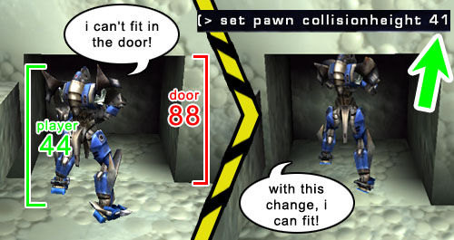
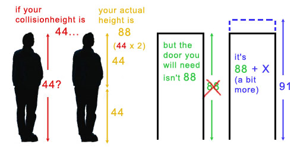

# Actor Variables

*Document Summary: A comprehensive guide to the Actor Properties.**Document Changelog: Last updated on 25-11-2004 by Michiel Hendriks, updated for v3323 . Previously updated on 11-3-03 by Chris Linder (DemiurgeStudios?) to rewrite collision section. Original author - Tom Lin (DemiurgeStudios?).*

* [Actor Variables](ActorVariables.md#Actor Variables)
  + [Introduction](ActorVariables.md#Introduction)
  + [Advanced](ActorVariables.md#Advanced)
  + [Collision](ActorVariables.md#Collision)
    - [Collision Height vs. Door Height](ActorVariables.md#Collision Height vs. Door Height)
  + [Display](ActorVariables.md#Display)
  + [Events](ActorVariables.md#Events)
  + [Force](ActorVariables.md#Force)
  + [Karma](ActorVariables.md#Karma)
  + [LightColor](ActorVariables.md#LightColor)
  + [Lighting](ActorVariables.md#Lighting)
  + [Movement](ActorVariables.md#Movement)
  + [Object](ActorVariables.md#Object)
  + [Sound](ActorVariables.md#Sound)

## Introduction

This document will list all the values that are contained in the `properties' section for an actor. This list will also include the default values for each entry. Links to relevant documents on UDN will also be provided. Since much of this information already exists on other pages, this will function largely as an index that links to their locations.

## Advanced

| [Variable](https://udn.epicgames.com/bin/publish/WebHome?webs=Main%2CTwo%2CThree%2CPowered&amp;inclusions=%2A&amp;exclusions=&amp;filter=&amp;inclfilter=%5C%25META%5C%3AFIELD%5C%7Bname%5C%3D%5C%22Documentavailability%5C%22.%2Avalue%5C%3D%5C%22General%20public%5C%22&amp;filterbymeta=yes&amp;skin=static_udn3&amp;restrictedclass=restricted&amp;format=&amp;sortcol=0;table=1;up=0#sorted_table "Sort by this column") | [Description](https://udn.epicgames.com/bin/publish/WebHome?webs=Main%2CTwo%2CThree%2CPowered&amp;inclusions=%2A&amp;exclusions=&amp;filter=&amp;inclfilter=%5C%25META%5C%3AFIELD%5C%7Bname%5C%3D%5C%22Documentavailability%5C%22.%2Avalue%5C%3D%5C%22General%20public%5C%22&amp;filterbymeta=yes&amp;skin=static_udn3&amp;restrictedclass=restricted&amp;format=&amp;sortcol=1;table=1;up=0#sorted_table "Sort by this column") | [Default](https://udn.epicgames.com/bin/publish/WebHome?webs=Main%2CTwo%2CThree%2CPowered&amp;inclusions=%2A&amp;exclusions=&amp;filter=&amp;inclfilter=%5C%25META%5C%3AFIELD%5C%7Bname%5C%3D%5C%22Documentavailability%5C%22.%2Avalue%5C%3D%5C%22General%20public%5C%22&amp;filterbymeta=yes&amp;skin=static_udn3&amp;restrictedclass=restricted&amp;format=&amp;sortcol=2;table=1;up=0#sorted_table "Sort by this column") |
| --- | --- | --- |
| **bCanTeleport** | If set to `True` this actor can be teleported with a [Teleporter Actor.](ExampleMapsTeleporters.md) | *False* |
| **bCollideWhenPlacing** | If set to `True` this actor will collide with the world when being placed in UnrealEd? and when being spawned at runtime. If this variable is true the actor will fail to get placed if it is not positioned such that it does not collide with things. | *False* |
| **bDirectional** | If set to `True` this actor shows a direction arrow during editing with an arrow. | *False* |
| **bEdShouldSnap** | If set to `True` this will snap the actor to the grid in editor. | *False* |
| **bGameRelevant** | Leave this variable at its default value. |
| **bHidden** | Makes the actor hidden during runtime. This is good for toggling this value on things like triggers, that you would may want to see in game to test, but ultimately want hidden. | *False* |
| **bHiddenEd** | If set to `True` this makes the actor hidden during editing. To select it again, you will have to use the Search Actors button. | *False* |
| **bHiddenEdGroup** | If set to `True` this hides the actor in the editor. You can toggle it back to visible by using the [GroupsBrowser](GroupsBrowser.md). | *False* |
| **bHighDetail** | If this is set to `True`, the actor will only appear at runtime if *HighDetailActors* in the default.ini file is also set to `True`. | *False* |
| **bLockLocation** | When set to `True` this prevents the actor from being moved in the editor. | *False* |
| **bMovable** | If this is set to `True` this actor can be moved at runtime. | *True* |
| **bNoDelete** | Leave this at the default value. | *False* |
| **bShouldBaseAtStartup** | If this is `True`, and bCollideWorld is `True` and Physics equals PHYS\_None or PHYS\_Rotating then the actor will set its base to whatever is below it. An actor's "base" is what it is attached to. The actor location will remain constant relative to the newly set "base." For example, a moveable light with this value set to `True` could be placed over a mover, and as the mover travels around a level, the light will also move about with it. | *False* |
| **bStasis** | Leave this at the default value. | *False* |
| **bSuperHighDetail** | If this is set to `True`, the actor will only appear at runtime if *SuperHighDetailActors* in the default.ini file is also set to `True`. | *False* |
| **Lifespan** | The amount of time in seconds this actor will stay in the world before being deleted. If zero this object is considered to have an infinite lifespan. | *0* |

## Collision

Collision is a very tricky topic and has many interrelated variables. Not only are there many variables in this section, there are other variables elsewhere in the engine (Static Mesh Browser for example) that affect collision. Things are further complicated by the fact that every once in a while objects set their collision properties in code overriding the variables set in UnrealEd. So take following definitions more as a guide, not as absolute truth.In the case of static meshes, the caveats and nuances of collision have been described in great detail. See the [StaticMeshCollisionReference](StaticMeshCollisionReference.md) for this information.

| [Variable](https://udn.epicgames.com/bin/publish/WebHome?webs=Main%2CTwo%2CThree%2CPowered&amp;inclusions=%2A&amp;exclusions=&amp;filter=&amp;inclfilter=%5C%25META%5C%3AFIELD%5C%7Bname%5C%3D%5C%22Documentavailability%5C%22.%2Avalue%5C%3D%5C%22General%20public%5C%22&amp;filterbymeta=yes&amp;skin=static_udn3&amp;restrictedclass=restricted&amp;format=&amp;sortcol=0;table=2;up=0#sorted_table "Sort by this column") | [Description](https://udn.epicgames.com/bin/publish/WebHome?webs=Main%2CTwo%2CThree%2CPowered&amp;inclusions=%2A&amp;exclusions=&amp;filter=&amp;inclfilter=%5C%25META%5C%3AFIELD%5C%7Bname%5C%3D%5C%22Documentavailability%5C%22.%2Avalue%5C%3D%5C%22General%20public%5C%22&amp;filterbymeta=yes&amp;skin=static_udn3&amp;restrictedclass=restricted&amp;format=&amp;sortcol=1;table=2;up=0#sorted_table "Sort by this column") |
| --- | --- |
| **bAutoAlignToTerrain** | If this is `True`, the actor will be locked to the Terrain and when using the Terrain Editor, the actor will remain attached and aligned to the Terrain. |
| **bBlockActors** | If this is `False`, non-player actors will be able to move though this object. If this is `True`, and *bBlockNonZeroExtentTraces* and *bCollideWorld* are both `TRUE`, this object will block non-player actors. |
| **bBlockKarma** | If *bBlockKarma* is `False`, this object will not block Karma objects. If *bBlockKarma* is `True`, and *bCollideWorld* is also `True`, this object will collide with Karma Actors. |
| **bBlockNonZeroExtentTraces** | If this is `False`, this object will not block non-zero extent traces. Non-zero extent traces are used for things like player movement and most other actor movement. If this is `True`, and *bCollideWorld* is also `True`, this object will block non-zero extent traces. |
| **bBlockPlayers** | If this is `False`, player actors will be able to move though this object. If this is `True`, and *bBlockNonZeroExtentTraces* and *bCollideWorld* are both `TRUE`, this object will block player actors. |
| **bBlockZeroExtentTraces** | If this is `False`, this object will not block zero extent traces. Zero extent traces are used for things like weapon fire which includes both instant hit weapons and things like rockets. If this is `True`, and *bCollideWorld* is also `True`, this object will block zero extent traces. |
| **bCollideActors** | This is the most important collision variable. If bCollideActors is `False`, this actor will not collide with or block anything. This is because it will not be in the collision hash. If this is `True`, this actor will "collide" with other actors. "Collide" only means the engine will calculate is the two objects are touching. So for example, *Triggers* have this set to `True` because the engine needs to know if you are touching the trigger but you are not blocked by the trigger. If you want this actor to block other actors, you must set *bCollideActors* to `True` along with other variables described in this section depending on what you want it to block. |
| **bCollideWorld** | Determines whether the actor will collide with the world. If your actor is falling though the world and you don't want it to, make sure *bCollideWorld* is `True`. |
| **bPathColliding** | If *bBlockActors* and *bCollideActors* are `True`, and *bStatic* is `False`, if you set *bPathColliding* to `False`, this actor will not collide during path building. This means that AI's will think that they can move through this actor even if they can not. Settings *bPathColliding* to `True` will not prevent AI's from finding paths though this actor if it is possible for those AI's to move though this actor. This settings is useful for movers or any actor that will move out of the way when an AI attempts to move though it. |
| **bProjTarget** | If this is `False`, weapon fire will pass though this actor. This is the case for both instant hit weapons and things like rockets. If *bProjTarget* is `True`, and *bBlockZeroExtentTraces* and *bCollideWorld* are both `TRUE`, this actor will block weapon fire. |
| **bUseCylinderCollision** | If this is `True`, the engine will use cylinder collision for this actor (defined by *CollisionRadius* and *CollisionHeight*) for all collision EXCEPT karma collision. If *bUseCylinderCollision* is `False`, this actor will need to rely on some other sort of collision, such as per-triangle static mesh collision, to collide with things. |
| **CollisionHeight** | This value is half the total height for an actor. |
| **CollisionRadius** | This value sets the radius for cylindrical collision volume. |

### Collision Height vs. Door Height

CollisionHeight (see above) is a funny variable. The height that you enter into this field isn't actually the height that your actior will get, it's exactly one-half of the height. However, this does not mean that your actor can enter a door that is exactly the height of the actor. So, if your actor height is 44, and you have a door with a height of 88, you might run into the following problem:

Therefore, when you are making your levels, keep in mind that the collisionheight should be doubled and increased a bit past the doubled amount, to approximate the actual collision size of an actor.

## Display

| [Variable](https://udn.epicgames.com/bin/publish/WebHome?webs=Main%2CTwo%2CThree%2CPowered&amp;inclusions=%2A&amp;exclusions=&amp;filter=&amp;inclfilter=%5C%25META%5C%3AFIELD%5C%7Bname%5C%3D%5C%22Documentavailability%5C%22.%2Avalue%5C%3D%5C%22General%20public%5C%22&amp;filterbymeta=yes&amp;skin=static_udn3&amp;restrictedclass=restricted&amp;format=&amp;sortcol=0;table=3;up=0#sorted_table "Sort by this column") | [Description](https://udn.epicgames.com/bin/publish/WebHome?webs=Main%2CTwo%2CThree%2CPowered&amp;inclusions=%2A&amp;exclusions=&amp;filter=&amp;inclfilter=%5C%25META%5C%3AFIELD%5C%7Bname%5C%3D%5C%22Documentavailability%5C%22.%2Avalue%5C%3D%5C%22General%20public%5C%22&amp;filterbymeta=yes&amp;skin=static_udn3&amp;restrictedclass=restricted&amp;format=&amp;sortcol=1;table=3;up=0#sorted_table "Sort by this column") | [Default](https://udn.epicgames.com/bin/publish/WebHome?webs=Main%2CTwo%2CThree%2CPowered&amp;inclusions=%2A&amp;exclusions=&amp;filter=&amp;inclfilter=%5C%25META%5C%3AFIELD%5C%7Bname%5C%3D%5C%22Documentavailability%5C%22.%2Avalue%5C%3D%5C%22General%20public%5C%22&amp;filterbymeta=yes&amp;skin=static_udn3&amp;restrictedclass=restricted&amp;format=&amp;sortcol=2;table=3;up=0#sorted_table "Sort by this column") |
| --- | --- | --- |
| **AmbientGlow** | Controls how bright an actor will appear, from a 0-255 scale. See [LightingOnSurfaces](LightingOnSurfaces.md#Lighting_on_Meshes) for an example. | *0* |
| **AntiPortal** | Leave this field at its default value. | *None* |
| **bAcceptsProjectors** | This determines whether projectors will affect the actor. | *True* |
| **bAlwaysFaceCamera** | The actor will be rendered always facing the camera like a sprite. Only for vertex meshes. | *False* |
| **bDeferRendering** | Defer rendering if DrawType? is DT\_Particle or Style is STY\_Additive | *True* |
| **bDisableSorting** | If this is set to `True`, the engine will not sort the actor triangles (for example, as for alpha channel triangles). | *False* |
| **bShadowCast** | Determines whether the actor will cast a static shadow (for instance cast by a SunLight Actor). | *False* |
| **bStaticLighting** | If this is `True` then the engine will use pre calculated lighting on the actor. The lighting on an actor will not change, even if the actor itself moves. It is usually best to leave this as its default value. | *False* |
| **bUnlit** | If this is `True` then lights won't affect the actor and it will appear at its full brightness. | *False* |
| **bUseDynamicLights** | If this is `True` then this actor can receive dynamic lights. It is possible to have an actor receive both static and dynamic lights simultaneously. | *True* |
| **bUseLightingFromBase** | This will draw the Unlit/AmbientGlow values that the actor is attached to, and apply it to the actor itself. | *False* |
| **CullDistance** | This determines when the actor will be culled. If the value is 0, there will be no distance culling. If the value is greater than 0, then it will be culled at that distance. Negative values don't seem to work. | *0* |
| **DrawScale** | This will control the actor size. | *1.0* |
| **DrawScale3D** | This can be used to scale the actor non-uniformly. | *(1.0, 1.0, 1.0)* |
| **DrawType** | This indicates what drawing effect the engine will choose to use. You shouldn't need to change this value. In fact, changing the value may crash your editor window. | *varies with actor* |
| **ForcedVisibilityZoneTag** | This makes the visibility code treat the actor as if it was in the zone with the given tag. | *None* |
| **LODBias** | Used by skeletal and vertex animated meshes to scale the Level of Detail (LOD) that is being used. This is a multiplier for the LOD to be used. If a mesh were going to use LOD level of 2, and LODBias was 2.0 then it would use a LOD level of 4. See the [Level of detail section of the AnimBrowserReference](../Content Creation/Animation/AnimBrowserReference.md#LOD) document for more information. | *1.0* |
| **MaxLights** | The limit of dynamic lights that can affect this actor. | *4* |
| **Mesh** | This allows you to use a skeletal or vertex animated mesh in place of your actor. Make sure to change the *DrawType* to `DT_Mesh` when using this. | *None* |
| **OverlayMaterial** | Shader/material effect to use with the skin (Only for skeletal meshes) | *None* |
| **PrePivot** | These values allow you to offset the actor from its given pivot point. | *(0.0, 0.0, 0.0)* |
| **ScaleGlow** | Allows you to change the brightness on static meshes and coronas. Rebuild lighting to see changes. | *1.0* |
| **Skins** | Here you can reassign textures to your mesh. For more information see the [Workflow and Modularity](WorkflowAndModularity.md#Variations_on_a_Theme) doc. | ... |
| **StaticMesh** | This allows you to substitute a StaticMesh for this actor. This won't work for all actors, such as emitters. If you use this, the DrawType is set to `DT_StaticMesh`. | *None* |
| **Style** | The rendering style for sprites and meshes. This is usually best left at its default setting. | *STY Normal* |
| **Texture** | This controls which texture will represent your sprite actor. | *varies with actor* |
| **UV2Mode** | Render mode for the UV2Texture | *UVM MacroTexture* |
| **UV2Texture** | An additional overlay added to the Actor's skin (Only for static meshes) | *None* |

## Events

| [Variable](https://udn.epicgames.com/bin/publish/WebHome?webs=Main%2CTwo%2CThree%2CPowered&amp;inclusions=%2A&amp;exclusions=&amp;filter=&amp;inclfilter=%5C%25META%5C%3AFIELD%5C%7Bname%5C%3D%5C%22Documentavailability%5C%22.%2Avalue%5C%3D%5C%22General%20public%5C%22&amp;filterbymeta=yes&amp;skin=static_udn3&amp;restrictedclass=restricted&amp;format=&amp;sortcol=0;table=4;up=0#sorted_table "Sort by this column") | [Description](https://udn.epicgames.com/bin/publish/WebHome?webs=Main%2CTwo%2CThree%2CPowered&amp;inclusions=%2A&amp;exclusions=&amp;filter=&amp;inclfilter=%5C%25META%5C%3AFIELD%5C%7Bname%5C%3D%5C%22Documentavailability%5C%22.%2Avalue%5C%3D%5C%22General%20public%5C%22&amp;filterbymeta=yes&amp;skin=static_udn3&amp;restrictedclass=restricted&amp;format=&amp;sortcol=1;table=4;up=0#sorted_table "Sort by this column") | [Default](https://udn.epicgames.com/bin/publish/WebHome?webs=Main%2CTwo%2CThree%2CPowered&amp;inclusions=%2A&amp;exclusions=&amp;filter=&amp;inclfilter=%5C%25META%5C%3AFIELD%5C%7Bname%5C%3D%5C%22Documentavailability%5C%22.%2Avalue%5C%3D%5C%22General%20public%5C%22&amp;filterbymeta=yes&amp;skin=static_udn3&amp;restrictedclass=restricted&amp;format=&amp;sortcol=2;table=4;up=0#sorted_table "Sort by this column") |
| --- | --- | --- |
| **Event** | The event this actor causes when activated or triggered. | *None* |
| **ExcludeTag[8]** | Multipurpose exclusion tag for excluding lights, projectors, rendering actors, blocking weather. For example this is used for Actors with `bSpecialLit` to check if a dynamic light has effect on this actor. |  |
| **Tag** | The actor's tag. | *None* |

## Force

| [Variable](https://udn.epicgames.com/bin/publish/WebHome?webs=Main%2CTwo%2CThree%2CPowered&amp;inclusions=%2A&amp;exclusions=&amp;filter=&amp;inclfilter=%5C%25META%5C%3AFIELD%5C%7Bname%5C%3D%5C%22Documentavailability%5C%22.%2Avalue%5C%3D%5C%22General%20public%5C%22&amp;filterbymeta=yes&amp;skin=static_udn3&amp;restrictedclass=restricted&amp;format=&amp;sortcol=0;table=5;up=0#sorted_table "Sort by this column") | [Description](https://udn.epicgames.com/bin/publish/WebHome?webs=Main%2CTwo%2CThree%2CPowered&amp;inclusions=%2A&amp;exclusions=&amp;filter=&amp;inclfilter=%5C%25META%5C%3AFIELD%5C%7Bname%5C%3D%5C%22Documentavailability%5C%22.%2Avalue%5C%3D%5C%22General%20public%5C%22&amp;filterbymeta=yes&amp;skin=static_udn3&amp;restrictedclass=restricted&amp;format=&amp;sortcol=1;table=5;up=0#sorted_table "Sort by this column") | [Default](https://udn.epicgames.com/bin/publish/WebHome?webs=Main%2CTwo%2CThree%2CPowered&amp;inclusions=%2A&amp;exclusions=&amp;filter=&amp;inclfilter=%5C%25META%5C%3AFIELD%5C%7Bname%5C%3D%5C%22Documentavailability%5C%22.%2Avalue%5C%3D%5C%22General%20public%5C%22&amp;filterbymeta=yes&amp;skin=static_udn3&amp;restrictedclass=restricted&amp;format=&amp;sortcol=2;table=5;up=0#sorted_table "Sort by this column") |
| --- | --- | --- |
| **ForceNoise** | Amouth of noise added to the ForceScale?, *0* = no noise, *1* = maximum noise. | *0* |
| **ForceRadius** | The radius with which this actor can affect particles as it moves through them. | *0* |
| **ForceScale** | The scale of the influence this actor has over particles. | *0* |
| **ForceType** | The type of force this actor has over particles. FT\_None means this actor should not affect particle systems. FT\_DragAlong causes particle to be pulled behind the actor slightly as it moves through them. This effect was used for rocket trails in UT2K3. | *None* |

## Karma

|  |  |
| --- | --- |
| **KParams** | This is explained in the [KarmaReference](../Content Creation/Physics/KarmaReference.md#Physics_Parameters) doc. |

## LightColor

You can also use the Color Picker tool to set these values, or play around in Photoshop and use the Hue, Saturtion, and Brightness (H S B) settings from there.

| [Variable](https://udn.epicgames.com/bin/publish/WebHome?webs=Main%2CTwo%2CThree%2CPowered&amp;inclusions=%2A&amp;exclusions=&amp;filter=&amp;inclfilter=%5C%25META%5C%3AFIELD%5C%7Bname%5C%3D%5C%22Documentavailability%5C%22.%2Avalue%5C%3D%5C%22General%20public%5C%22&amp;filterbymeta=yes&amp;skin=static_udn3&amp;restrictedclass=restricted&amp;format=&amp;sortcol=0;table=7;up=0#sorted_table "Sort by this column") | [Description](https://udn.epicgames.com/bin/publish/WebHome?webs=Main%2CTwo%2CThree%2CPowered&amp;inclusions=%2A&amp;exclusions=&amp;filter=&amp;inclfilter=%5C%25META%5C%3AFIELD%5C%7Bname%5C%3D%5C%22Documentavailability%5C%22.%2Avalue%5C%3D%5C%22General%20public%5C%22&amp;filterbymeta=yes&amp;skin=static_udn3&amp;restrictedclass=restricted&amp;format=&amp;sortcol=1;table=7;up=0#sorted_table "Sort by this column") | [Default](https://udn.epicgames.com/bin/publish/WebHome?webs=Main%2CTwo%2CThree%2CPowered&amp;inclusions=%2A&amp;exclusions=&amp;filter=&amp;inclfilter=%5C%25META%5C%3AFIELD%5C%7Bname%5C%3D%5C%22Documentavailability%5C%22.%2Avalue%5C%3D%5C%22General%20public%5C%22&amp;filterbymeta=yes&amp;skin=static_udn3&amp;restrictedclass=restricted&amp;format=&amp;sortcol=2;table=7;up=0#sorted_table "Sort by this column") |
| --- | --- | --- |
| **LightBrightness** | This controls the amount of light cast. | *0.0* |
| **LightHue** | This controls the hue of the light cast. | *0* |
| **LightSaturation** | This controls the saturation level of the light cast. | *0* |

## Lighting

| [Variable](https://udn.epicgames.com/bin/publish/WebHome?webs=Main%2CTwo%2CThree%2CPowered&amp;inclusions=%2A&amp;exclusions=&amp;filter=&amp;inclfilter=%5C%25META%5C%3AFIELD%5C%7Bname%5C%3D%5C%22Documentavailability%5C%22.%2Avalue%5C%3D%5C%22General%20public%5C%22&amp;filterbymeta=yes&amp;skin=static_udn3&amp;restrictedclass=restricted&amp;format=&amp;sortcol=0;table=8;up=0#sorted_table "Sort by this column") | [Description](https://udn.epicgames.com/bin/publish/WebHome?webs=Main%2CTwo%2CThree%2CPowered&amp;inclusions=%2A&amp;exclusions=&amp;filter=&amp;inclfilter=%5C%25META%5C%3AFIELD%5C%7Bname%5C%3D%5C%22Documentavailability%5C%22.%2Avalue%5C%3D%5C%22General%20public%5C%22&amp;filterbymeta=yes&amp;skin=static_udn3&amp;restrictedclass=restricted&amp;format=&amp;sortcol=1;table=8;up=0#sorted_table "Sort by this column") | [Default](https://udn.epicgames.com/bin/publish/WebHome?webs=Main%2CTwo%2CThree%2CPowered&amp;inclusions=%2A&amp;exclusions=&amp;filter=&amp;inclfilter=%5C%25META%5C%3AFIELD%5C%7Bname%5C%3D%5C%22Documentavailability%5C%22.%2Avalue%5C%3D%5C%22General%20public%5C%22&amp;filterbymeta=yes&amp;skin=static_udn3&amp;restrictedclass=restricted&amp;format=&amp;sortcol=2;table=8;up=0#sorted_table "Sort by this column") |
| --- | --- | --- |
| **bActorShadows** | When `True`, actor will cast shadows. | *False* |
| **bAttenByLife** | Attenuate light by diminishing lifespan. | *False* |
| **bCorona** | The light will use *Skins* as a corona. | *False* |
| **bDirectionalCorona** | If bCorona si true, make corona bigger if it faces you, and zero for 90 degrees or beyond. | *False* |
| **bDynamicLight** | This will allow the lighting from this light to move with the light if `True`. Note that DynamicLights are somewhat more processor intensive than regular lights. | *False* |
| **bLightingVisibility** | Calculates lighting visibility for this actor with line checks. | *True* |
| **bSpecialLit** | See the [LightingReference](LightingReference.md#Special_Lit) document for an explanation. | *False* |
| **LightCone** | See the [LightingReference](LightingReference.md#LightCone) document for an explanation. | *0* |
| **LightEffect** | See the [LightingReference](LightingReference.md#LightEffect) document for an explanation. | *LE None* |
| **LightPeriod** | See the [LightingReference](LightingReference.md#LightPeriod) document for an explanation. | *0* |
| **LightPhase** | See the [LightingReference](LightingReference.md#LightPhase) document for an explanation. | *0* |
| **LightRadius** | This is a multiplier of the actual radius of the light. | *0.0* |
| **LightType** | See the [LightingReference](LightingReference.md#LightType) document for an explanation. | *LT None* |

## Movement

| [Variable](https://udn.epicgames.com/bin/publish/WebHome?webs=Main%2CTwo%2CThree%2CPowered&amp;inclusions=%2A&amp;exclusions=&amp;filter=&amp;inclfilter=%5C%25META%5C%3AFIELD%5C%7Bname%5C%3D%5C%22Documentavailability%5C%22.%2Avalue%5C%3D%5C%22General%20public%5C%22&amp;filterbymeta=yes&amp;skin=static_udn3&amp;restrictedclass=restricted&amp;format=&amp;sortcol=0;table=9;up=0#sorted_table "Sort by this column") | [Description](https://udn.epicgames.com/bin/publish/WebHome?webs=Main%2CTwo%2CThree%2CPowered&amp;inclusions=%2A&amp;exclusions=&amp;filter=&amp;inclfilter=%5C%25META%5C%3AFIELD%5C%7Bname%5C%3D%5C%22Documentavailability%5C%22.%2Avalue%5C%3D%5C%22General%20public%5C%22&amp;filterbymeta=yes&amp;skin=static_udn3&amp;restrictedclass=restricted&amp;format=&amp;sortcol=1;table=9;up=0#sorted_table "Sort by this column") | [Default](https://udn.epicgames.com/bin/publish/WebHome?webs=Main%2CTwo%2CThree%2CPowered&amp;inclusions=%2A&amp;exclusions=&amp;filter=&amp;inclfilter=%5C%25META%5C%3AFIELD%5C%7Bname%5C%3D%5C%22Documentavailability%5C%22.%2Avalue%5C%3D%5C%22General%20public%5C%22&amp;filterbymeta=yes&amp;skin=static_udn3&amp;restrictedclass=restricted&amp;format=&amp;sortcol=2;table=9;up=0#sorted_table "Sort by this column") |
| --- | --- | --- |
| **AttachTag** | This field allows you to enter the *Tag* of another actor that you want to move with this actor. Note that this only works with actors that can move (such as Emitters, Movers, or MoveableLights). | *None* |
| **bBounce** | This will make the actor bounce if it is moving and hits an object. This variable doesn't handle complex Karma physics, but rather just rudimentary bouncing. | *False* |
| **bFixedRotationDir** | This will fix the direction of rotation to always be in the same direction, for example always about the X axis in a clockwise direction. | *False* |
| **bHardAttach** | Fixes the rotation of the actor as well as the location. With this variable false, the actor will merely follow what it is attached to, rather than rotating with it. bBlockActor and bBlockPlayer must also be false. | *False* |
| **bIgnoreEncroachers** | Setting this variable to true causes the engine to ignore collisions between movers and this actor. Additionally, other miscellaneous collision detections will no longer fire including some traces and checks for ducking or jumping. | *False* |
| **bIgnoreTerminalVelocity** | In `PHYS_Falling`, ignore the `TerminalVelocity` of the *PhysicsVolume* . If true the actor will keep accelerating. | *False* |
| **bOrientToVelocity** | Rotate the actor in the direction of current velocity. | *False* |
| **bRotateToDesired** | Rotates the actor to DesiredRotation. (See below) | *False* |
| **Buoyancy** | Water buoyancy of an actor (for example when inside a WaterVolume). | *0.0* |
| **DesiredRotation** | The target rotation that will be moved to in bRotateToDesired. | *(0, 0, 0)* |
| **Location** | Actor location. | *(0.0, 0.0, 0.0)* |
| **Mass** | Mass of this actor. This variable has influence on the velocity in `PHYS_Swimming`, `PHYS_Falling` and `PHYS_Hovering` when hovering over a fluid surface. But it is also used for various other things like *movers*. | *100.0* |
| **Physics** | Actor's current physics mode. See [SetPhysics](ActorFunctions.md#SetPhysics) for the various physics types. | *PHYS None* |
| **Rotation** | Rotation of this actor. | *(0, 0, 0)* |
| **RotationRate** | Change in rotation per second. | *(0, 0, 0)* |
| **Velocity** | The directional speed at which the actor is moving during run time. | *(0.0, 0.0, 0.0)* |

## Object

| [Variable](https://udn.epicgames.com/bin/publish/WebHome?webs=Main%2CTwo%2CThree%2CPowered&amp;inclusions=%2A&amp;exclusions=&amp;filter=&amp;inclfilter=%5C%25META%5C%3AFIELD%5C%7Bname%5C%3D%5C%22Documentavailability%5C%22.%2Avalue%5C%3D%5C%22General%20public%5C%22&amp;filterbymeta=yes&amp;skin=static_udn3&amp;restrictedclass=restricted&amp;format=&amp;sortcol=0;table=10;up=0#sorted_table "Sort by this column") | [Description](https://udn.epicgames.com/bin/publish/WebHome?webs=Main%2CTwo%2CThree%2CPowered&amp;inclusions=%2A&amp;exclusions=&amp;filter=&amp;inclfilter=%5C%25META%5C%3AFIELD%5C%7Bname%5C%3D%5C%22Documentavailability%5C%22.%2Avalue%5C%3D%5C%22General%20public%5C%22&amp;filterbymeta=yes&amp;skin=static_udn3&amp;restrictedclass=restricted&amp;format=&amp;sortcol=1;table=10;up=0#sorted_table "Sort by this column") | [Default](https://udn.epicgames.com/bin/publish/WebHome?webs=Main%2CTwo%2CThree%2CPowered&amp;inclusions=%2A&amp;exclusions=&amp;filter=&amp;inclfilter=%5C%25META%5C%3AFIELD%5C%7Bname%5C%3D%5C%22Documentavailability%5C%22.%2Avalue%5C%3D%5C%22General%20public%5C%22&amp;filterbymeta=yes&amp;skin=static_udn3&amp;restrictedclass=restricted&amp;format=&amp;sortcol=2;table=10;up=0#sorted_table "Sort by this column") |
| --- | --- | --- |
| **Group** | Indicates which group this actor is assigned to in the [GroupsBrowser](GroupsBrowser.md). An actor can exist in more than one group at once. | *None* |
| **InitialState** | This is not applicable to all actors. Certain actors such as [movers](../Content Creation/Primitives/MoversTutorial.md#Assigning_Activators) use this field. | *None* |
| **Name** | This is the name that Unreal Ed assigns to your actor. This field can **NOT** be changed, and is **NOT** the same as the *Tag* field. | *None* |

## Sound

| [Variable](https://udn.epicgames.com/bin/publish/WebHome?webs=Main%2CTwo%2CThree%2CPowered&amp;inclusions=%2A&amp;exclusions=&amp;filter=&amp;inclfilter=%5C%25META%5C%3AFIELD%5C%7Bname%5C%3D%5C%22Documentavailability%5C%22.%2Avalue%5C%3D%5C%22General%20public%5C%22&amp;filterbymeta=yes&amp;skin=static_udn3&amp;restrictedclass=restricted&amp;format=&amp;sortcol=0;table=11;up=0#sorted_table "Sort by this column") | [Description](https://udn.epicgames.com/bin/publish/WebHome?webs=Main%2CTwo%2CThree%2CPowered&amp;inclusions=%2A&amp;exclusions=&amp;filter=&amp;inclfilter=%5C%25META%5C%3AFIELD%5C%7Bname%5C%3D%5C%22Documentavailability%5C%22.%2Avalue%5C%3D%5C%22General%20public%5C%22&amp;filterbymeta=yes&amp;skin=static_udn3&amp;restrictedclass=restricted&amp;format=&amp;sortcol=1;table=11;up=0#sorted_table "Sort by this column") | [Default](https://udn.epicgames.com/bin/publish/WebHome?webs=Main%2CTwo%2CThree%2CPowered&amp;inclusions=%2A&amp;exclusions=&amp;filter=&amp;inclfilter=%5C%25META%5C%3AFIELD%5C%7Bname%5C%3D%5C%22Documentavailability%5C%22.%2Avalue%5C%3D%5C%22General%20public%5C%22&amp;filterbymeta=yes&amp;skin=static_udn3&amp;restrictedclass=restricted&amp;format=&amp;sortcol=2;table=11;up=0#sorted_table "Sort by this column") |
| --- | --- | --- |
| **AmbientSound** | See the [Sounds example map](ExampleMapsSounds.md#AmbientSounds) document for an explanation. | *None* |
| **bFullVolume** | See the [Sounds example map](ExampleMapsSounds.md#AmbientSounds) document for an explanation. | *False* |
| **SoundOcclusion** | See the [Sounds example map](ExampleMapsSounds.md#AmbientSounds) document for an explanation. | *OCCLUSION Default* |
| **SoundPitch** | See the [Sounds example map](ExampleMapsSounds.md#AmbientSounds) document for an explanation. | *64* |
| **SoundRadius** | See the [Sounds example map](ExampleMapsSounds.md#AmbientSounds) document for an explanation. | *64.0* |
| **SoundVolume** | See the [Sounds example map](ExampleMapsSounds.md#AmbientSounds) document for an explanation. | *128* |
| **TransientSoundRadius** | See the [Sounds example map](ExampleMapsSounds.md#AmbientSounds) document for an explanation. | *300.0* |
| **TransientSoundVolume** | See the [Sounds example map](ExampleMapsSounds.md#AmbientSounds) document for an explanation. | *0.3* |
