# Additional Terrain Tips

*Document Summary: Some tips and pointers for improving your Terrain.**Document Changelog: Last updated by Jason Lentz (DemiurgeStudios?) to separate into smaller docs and update for the 2110 build. Original author was Lode Vandevenne ([UdnStaff](https://udn.epicgames.com/Main/UdnStaff)).*

* [Additional Terrain Tips](AdditionalTerrainTips.md#Additional Terrain Tips)
  + [Introduction](AdditionalTerrainTips.md#Introduction)
  + [Saving and Testing the Map](AdditionalTerrainTips.md#Saving and Testing the Map)
  + [Terrain Statistics](AdditionalTerrainTips.md#Terrain Statistics)
  + [Adding a SkyBox](AdditionalTerrainTips.md#Adding a _SkyBox)
  + [SunLight](AdditionalTerrainTips.md#SunLight)
  + [DistanceFog](AdditionalTerrainTips.md#DistanceFog)
  + [Multiple TerrainInfos, Multiple Zones](AdditionalTerrainTips.md#Multiple _TerrainInfos, Multiple Zones)
  + [Other Sections](AdditionalTerrainTips.md#Other Sections)

## Introduction

While none of these sections are absolutely required to create a Terrain, they are useful and some necessary to make your Terrain as beautiful and efficient as it can be. Many of these techniques do not even involve the Terrain tools, but since they are so crucial to Terrain creation, they have been included in this document. This document assumes that you know the general [UnrealEdInterface](../Content Creation/Basics/UnrealEdInterface.md) and that you are familiar with the process of [CreatingTerrain](CreatingTerrain.md).

## Saving and Testing the Map

Once you have a working terrain you can (and should) test your map in the game. Testing your map frequently can quickly reveal problems such as non-navigable areas as well as overly jaggy sections. To make the map playable, first place a PlayerStart (in the Actor Class Browser under NavigationPoint), and make sure it is above the terrain. Then to play the map, simply press the PlayMap button (

).If you save your map, do not give it the name terrain.ut2 or terrain2.ut2. There may already be some texture packages called terrain.utx and terrain2.utx, and the engine will confuse the map and the texture packages.Whenever you are walking around in the terrain in the game and you want to be able to walk quickly from one side to another, type "slomo 8" in the console to walk 8 times faster than normally. Use "slomo 1" to get back the normal speed.

## Terrain Statistics

If you enter "stat render" in the console in the game or in the editor, you get stats about the terrain together with some other stats.

In Terrain, it shows the number of sectors and terrain triangles currently in view, and the time needed to render the terrain.
In DecoLayer, it shows the total number of triangles of all the decorations in view, the number of decorations in view and the time needed to render the DecoLayers. To learn more about DecoLayers, see the [CreatingDecoLayers](CreatingDecoLayers.md) document.

## Adding a SkyBox

Especially if you want SunLight in your terrain, a SkyBox is very important. To create a SkyBox, subtract a small cube somewhere outside the large cube you made. Add a SkyZoneInfo in it (in the Actor Class Browser under Info), add some lights and some textures.

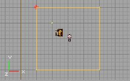

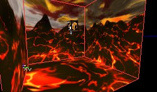Then go back to the large box, select all the walls of it, open the Surface Properties and enable Fake Backdrop.

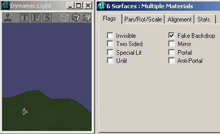

If you rebuild and enable "Show Backdrop" in the 3D viewport, you should see the SkyBox parallax in the large box. Select the 3D viewport and press k to toggle showing the backdrop.If your terrain is much larger than the 65536\*65536\*65536 box, and some walls are set to Fake Backdrop, you will be able to see the terrain behind these walls, but you will still not be able to walk through them. In the game, it looks like an invisible barrier.For more on SkyBoxes, see the [Sky Zones Example Map.](ExampleMapsSkyZones.md)

## SunLight

To make the terrain look nicer, you have to add one of more SunLights. A SunLight is a light that comes from infinitely far away, and it is also calculated that way by the editor. This means that all the rays are parallel. In the calculations of the editor, the rays of a light are stopped by every wall, so also by the sides of the large box, except if they are set to Fake Backdrop. That's why you made this SkyBox.Select the SunLight class in the Actor Class Browser in Actor --> Light --> SunLight. It doesn't matter where you place the light; just make sure the light is inside the large box. After you've added it, rebuild the lighting of the map and the terrain will now look a lot nicer: the screenshot of the left has no SunLight, the one on the right has it.

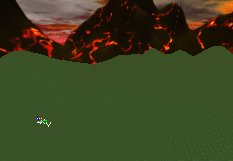

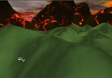You probably have to decrease the AmbientBrightness of the ZoneInfo and increase the Brightness of the SunLight to see the effect better. You can change the color of the SunLight the same way you would change the color of a normal light.To change the direction of the light, use the rotation tool

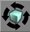

and rotate in any of the 2D views. The arrow shows the direction of the light. Rotating it up or down in one of the side views will simulate the sun being higher or lower. Rotating it in the top view will change the direction of the sun (North, East, or whatever).

Note that in build 927 and newer, the arrows shows the direction the SunLight is shining to, while in some older versions it pointed to the direction the SunLight comes from.

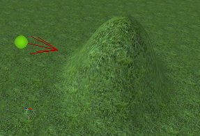

You can have multiple and colored lights in your terrain:

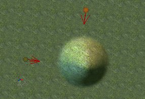

If you have multiple zones in your map, the SunLights will only light the zones in which you placed them, so each zone can have its own lighting. This means you have to watch out if you have buildings with rooms with different zones: you'll have to place an extra sunlight inside of the building then (assuming it has windows).The SunLights will not only light the terrain, but also every other polygon that is in the map. Also, normal lights will light the terrain as well, as you can see on this screenshot:

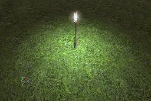

## DistanceFog

DistanceFog creates realistic fog on the whole terrain or inside any other zone, and it can make your map faster because the fog hides the polygons that are inside the fog. To enable the DistanceFog, open the properties of the ZoneInfo actor, expand ZoneInfo and set bFogZone to True. Then expand ZoneLight and use the following properties

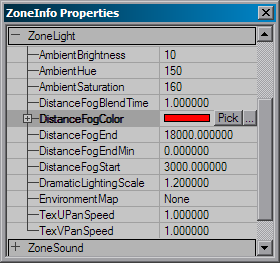

* DistanceFogColor: the color of the fog. Using the "Pick" button, you get a dropper tool, so you can pick any color in any of the 3D or 2D views. Using the "..." button, you get the Windows Color Picker. You can also enter a RGB value manually.
* DistanceFogEnd: This is the max distance you will be able to see, everything behind this is covered in the fog completely. If the radius is larger than your terrain, nothing will be going on, but if it's smaller, all polygons of the terrain that are behind this distance will not be displayed, so it looks like the screenshot on the right:

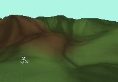

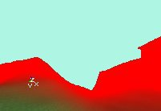If you don't want the players to see this, give the SkyBox the same color. The easiest way to do this is to set the SkyZoneInfo to bDistanceFog as well, give it the same DistanceFogColor, and set both DistanceFogEnd and DistanceFogStart to 1. This way, you can't see that some polygons are not shown:

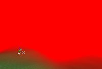

* DistanceFogEndMin: Defines the minimal distance fog. When the user sets the DrawDistanceLOD the actual distance end of the fog will be calculated from a linear interpolation between this value and the DistanceFogEnd value. When this value is 0 the user will not be able to change the maximal draw distance by setting the DrawDistanceLOD value of Engine.ViewportManager.

* DistanceFogStart: Starting from this distance, the fog will slowly fade to completely dark, until it reached the DistanceFogEnd.

* DistanceFogBlendTime: Sets the time it takes to blend between two distance fog settings, when moving from one zone to the other.

## Multiple TerrainInfos, Multiple Zones

You can have as many TerrainInfo Actors as you want in a zone, if you place the TerrainInfos are close to each other, the terrains will stick through each other, as you can see on the screenshot:

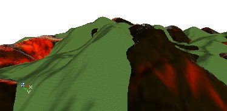

If your map has multiple zones, and you are outside the zone with the terrain in it, you can still see the terrain so you can safely use different zones for rooms inside buildings with windows. Make sure, however, the building has a floor because the terrain will only collide in its own Zone.

## Other Sections

To view the other documents on Terrain creation, just click on one of the links below.[TerrainTutorial](../Content Creation/Primitives/TerrainTutorial.md) - This outlines all the contents of the following documents. Also, if you add new sections to this document, it is also good practice to update the [TerrainTutorial](../Content Creation/Primitives/TerrainTutorial.md) as well.[CreatingTerrain](CreatingTerrain.md) - This document explains how to create a Terrain starting from an empty level.[EditingTerrainMaps](EditingTerrainMaps.md) - Shows how to use the Terrain Editor Tools.[EditingTerrainLayers](EditingTerrainLayers.md) - Explains how to create and use Layers within your Terrain.[CreatingDecoLayers](CreatingDecoLayers.md) - Shows how to create DecoLayers.
