# Beam Emitters

*Document Summary: A reference to properties-based emitter editing and creation. (non UDN build).**Document Changelog: Updated by Michiel Hendriks for build 3323. Previously updated by Chris Sturgill for 2226 build and reorganization. Original Author: Lode Vandevenne.*

* [Beam Emitters](BeamEmitter.md#beam-emitters)
  + [Introduction](BeamEmitter.md#introduction)
  + [Acceleration](BeamEmitter.md#acceleration)
  + [Beam](BeamEmitter.md#beam)
    - [BeamDistanceRange](BeamEmitter.md#beamdistancerange)
    - [BeamEndPoints](BeamEmitter.md#beamendpoints)
    - [BeamTextureUScale](BeamEmitter.md#beamtextureuscale)
    - [BeamTextureVScale](BeamEmitter.md#beamtexturevscale)
    - [DetermineEndPointBy](BeamEmitter.md#determineendpointby)
      * [PTEP\_Velocity](BeamEmitter.md#ptep_velocity)
      * [PTEP\_Distance](BeamEmitter.md#ptep_distance)
      * [PTEP\_Offset](BeamEmitter.md#ptep_offset)
      * [PTEP\_Actor](BeamEmitter.md#ptep_actor)
      * [PTEP\_TraceOffset](BeamEmitter.md#ptep_traceoffset)
      * [PTEP\_OffsetAsAbsolute](BeamEmitter.md#ptep_offsetasabsolute)
      * [PTEP\_DynamicDistance](BeamEmitter.md#ptep_dynamicdistance)
    - [RotatingSheets](BeamEmitter.md#rotatingsheets)
    - [TriggerEndpoint](BeamEmitter.md#triggerendpoint)
  + [BeamBranching](BeamEmitter.md#beambranching)
    - [BranchEmitter](BeamEmitter.md#branchemitter)
    - [BranchHFPointsRange](BeamEmitter.md#branchhfpointsrange)
    - [BranchProbability](BeamEmitter.md#branchprobability)
    - [BranchSpawnAmountRange](BeamEmitter.md#branchspawnamountrange)
    - [LinkupLifetime](BeamEmitter.md#linkuplifetime)
    - [UseBranching](BeamEmitter.md#usebranching)
  + [BeamNoise](BeamEmitter.md#beamnoise)
    - [DynamicHFNoisePointsRange](BeamEmitter.md#dynamichfnoisepointsrange)
    - [DynamicHFNoiseRange](BeamEmitter.md#dynamichfnoiserange)
    - [DynamicTimeBetweenNoiseRange](BeamEmitter.md#dynamictimebetweennoiserange)
    - [HFScaleFactors](BeamEmitter.md#hfscalefactors)
    - [HFScaleRepeats](BeamEmitter.md#hfscalerepeats)
    - [HighFrequencyNoiseRange](BeamEmitter.md#highfrequencynoiserange)
    - [HighFrequencyPoints](BeamEmitter.md#highfrequencypoints)
    - [LFScaleFactors](BeamEmitter.md#lfscalefactors)
    - [LFScaleRepeats](BeamEmitter.md#lfscalerepeats)
    - [LowFrequencyNoiseRange](BeamEmitter.md#lowfrequencynoiserange)
    - [LowFrequencyPoints](BeamEmitter.md#lowfrequencypoints)
    - [NoiseDeterminesEndPoint](BeamEmitter.md#noisedeterminesendpoint)
    - [UseHighFrequencyScale](BeamEmitter.md#usehighfrequencyscale)
    - [UseLowFrequencyScale](BeamEmitter.md#uselowfrequencyscale)
  + [Collision](BeamEmitter.md#collision)
  + [Color](BeamEmitter.md#color)
  + [Fading](BeamEmitter.md#fading)
  + [Revolution](BeamEmitter.md#revolution)
  + [Rotation](BeamEmitter.md#rotation)
  + [Size](BeamEmitter.md#size)
  + [SkeletalMesh](BeamEmitter.md#skeletalmesh)
  + [Spawning](BeamEmitter.md#spawning)
  + [Texture](BeamEmitter.md#texture)
  + [Tick](BeamEmitter.md#tick)
  + [Time](BeamEmitter.md#time)
  + [Trigger](BeamEmitter.md#trigger)
  + [Velocity](BeamEmitter.md#velocity)
  + [Warmup](BeamEmitter.md#warmup)

## Introduction

This document will cover Beam Emitters, one of five different possible emitters available in the 3323 build. For more information on general emitter properties, see  [EmittersReference](../Content Creation/Effects/EmittersReference.md). For more information on the other three emitter types, see  [SpriteEmitter](https://udn.epicgames.com/Two/SpriteEmitter),  [SparkEmitter](SparkEmitter.md),  [MeshEmitter](MeshEmitter.md) and [TrailEmitter?.This Emitter is very useful to create lightning and electrical effects. It stretches the chosen texture into a beam with HighFrequencyPoints and LowFrequencyPoints. There must be at least two of each to make the lightning work. Each beam is one particle. Normally, the beam is only one angular line, but you can also give it branches.As previously stated, we will be discussing Beam Emitters a property at a time, with most of our attention on those properties unique to, or especially relevant to, these Emitters.

## Acceleration

Applies acceleration to the beam particles. This is probably not going to be useful as real-world lightning bolts are not visibly affected by gravity. Probably better results will result in changes to  [StartVelocityRange](BeamEmitter.md#velocity). For more information on Acceleration check out the [Emitters Reference](../Content Creation/Effects/EmittersReference.md#acceleration) document.

## Beam

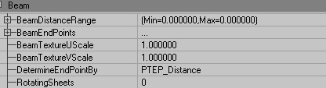

### BeamDistanceRange

The endpoint of the beam will be offset by the specified distance. This value is used if the emitter's [DetermineEndPointBy](BeamEmitter.md#determineendpointby)
option is set to  [PTEPDistance](BeamEmitter.md#ptepdistance).

### BeamEndPoints

Add one or more to specify either an offset range or an ActorTag. This is further explained in  [PTEP\_Offset](BeamEmitter.md#ptepoffset) and  [PTEP\_Actor](BeamEmitter.md#ptepactor) under [DetermineEndPointBy](BeamEmitter.md#determineendpointby).

### BeamTextureUScale

Scales the particle's texture in the U dimension, which lies along the length of the beam. Note that the texture used will need to be laid out horizontally like the image below in order to be displayed correctly.

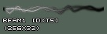

The default value is 1, which means the texture is repeated one time. A higher value yields results like the one below, with a BeamTextureUScale of 4.

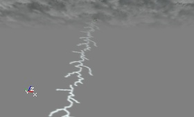

### BeamTextureVScale

Scales the particle's texture in the V dimension, which is the width of the beam. A value of 4 would repeat the texture twice horizontally like the image below.

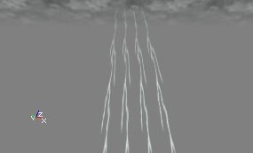

### DetermineEndPointBy

A very important field. This, not surprisingly, determines the method by which your beam finds its endpoint. The options are as follows:

#### PTEP\_Velocity

With the default setting PTEP\_Velocity, the EndPoint is determined by the Velocity of the particle (that is a combination of StartVelocityRange in Velocity, and Acceleration). The length of the beam is then determined by the StartVelocityRange values and the LifeTime of the particles. The direction of it is determined by the X, Y and Z values of the StartVelocityRange. You can again use random values, so for example if X(Max) = Y(Max) = Z(Max) = +1000 and X(Min) = Y(Min) = Z(Min) = -1000, each beam will be anything random between this. It'll do almost exactly the same as on this animated gif below. You'll be able to see more than one beam now, because MaxParticles in General is set to 10 by default. Also, lightning normally only goes straight towards the ground, so only using negative Z values for StartVelocityRange is useful.

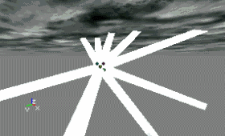

#### PTEP\_Distance

This does the same as PTEP\_Velocity, but now only the direction of the beams is determined by the StartVelocityRange. You can set the length with  [BeamDistanceRange](BeamEmitter.md#beamdistancerange), in editor units.

#### PTEP\_Offset

This allows you to determinate the EndPoint in relative coordinates. You have to enter these coordinates in Offset, inside BeamEndPoints[0]. To get this, first click on BeamEndPoints and press the Add button. Then there should appear a [0]. If you expand it, you can see the properties inside [0].

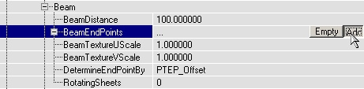

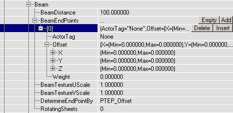In there, in Offset, enter the X, Y and Z coordinates for the EndPoint of the beam. The coordinates are relative to the StartPoint (most of the times this is the Emitter actor), so for example X = 0, Y = 0, Z = -1000 means the EndPoint will be 1000 units below the StartPoint. Before it works, you also have to set Weight to something larger than 0. You can again use different Min and Max values if you want a random location for the EndPoint. You can add more BeamEndPoints, for example [1] and [2]. Then the beam will use one of these BeamEndPoints by random. With Weight, you can set the importance of each BeamEndPoint, this is the probability that it'll be used. If you give all the BeamEndPoints a Weight of 1, the chances will be equally divided. If for the Offset X = Y = Z = 0, the EndPoint and the StartPoint the same, so there won't be a beam. You can use this if you want the lightning to strike only a few times and to be invisible for the rest of the time. Then you can give the BeamEndPoint with this 0-Offset a high Weight, so the lightning is most of the times invisible.

#### PTEP\_Actor

With this, you can make the lightning go to a certain actor. This also uses BeamEndPoints[0], but this time, you have to fill in the ActorTag property (and not the Offset property). The lightning will go towards the actor you gave that Tag (in the Event properties of that actor). If you want the lightning to go randomly towards different actors, you have to add more BeamEndPoints, for example [1], [2], etc..., and in each BeamEndPoint enter a different ActorTag. Of course also give the actors these Tags. If you'd give three trees the SAME tag and use only BeamEndPoints[0], it won't work, the lightning will go to only one of the trees then. Again you have to give each of the BeamEndPoints a Weight higher than 0, that is the chance this BeamEndPoint will be used.
For example if there are three trees, with Tags FullTree, FullTree2 and FullTree3, and you want the lightning to strike each of the trees randomly, but to strike FullTree3 twice as much as the other trees, give the following properties to the BeamEmitter:

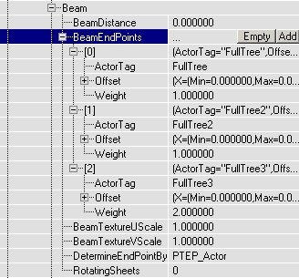

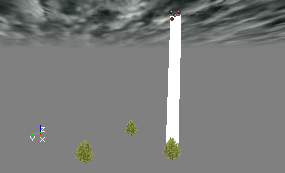If the actor is moving, the beam will follow it:

Note: In the event that you have competed the above steps and your beam is still not recognizing that it's endpoint should be your determined actor, try adding a new BeamEndPoint. Things should now begin working and you can feel free to delete this extra BeamEndPoint.

#### PTEP\_TraceOffset

This does the same as  [PTEP\_Offset](BeamEmitter.md#ptepoffset), but if there is a solid surface in the way the lightning will hit against it, instead of going to the actual EndPoint. Oh, and PTEP\_TraceOffset doesn't work good in combination with the coordinate system PTCS\_Relative.

#### PTEP\_OffsetAsAbsolute

The same as [PTEP\_Offset](BeamEmitter.md#ptepoffset), except that the EndPoint is the absolute location instead of the relative location.

#### PTEP\_DynamicDistance

Does the same as [PTEP\_Distance](BeamEmitter.md#ptepoffset) except that the length can be scaled by *Size.Y* and the distance can be changed in realtime from UnrealScript.

### RotatingSheets

This option determines how many sheets the beam has. 0 and 1 mean the same: only one sheet. The screenshots show 0, 3 and 10.

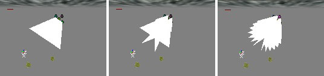

### TriggerEndpoint

This allows your beam to trigger another Actor. It is usable only when the  [DetermineEndpointBy](BeamEmitter.md#determineendpointby) is set to  [PTEP\_Actor](BeamEmitter.md#ptepactor). If the Actor in question is something that can be triggered, ie. another particle system or a mover, then when the beam EndPoint will activate the trigger when it strikes.In the following example, a BeamEmitter is set to strike a SpriteEmitter with the Tag "ParticleActor" and a Mover with the Tag "MoveActor".

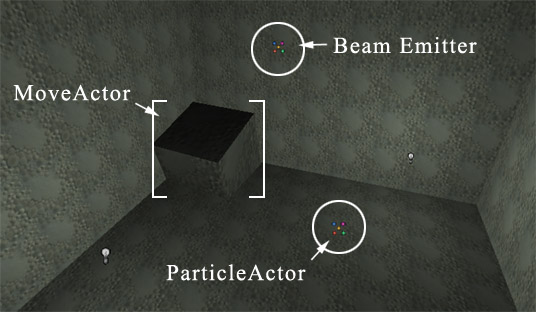

When the beam hits the SpriteEmitter, it emits it's particles.

When the beam hits the Mover, it's animation is triggered and it rotates through the wall.

Note that while the BeamEmitter will play in UnrealEd, it won't trigger anything in the editor. You have to be actually playing the map to see these results.

## BeamBranching

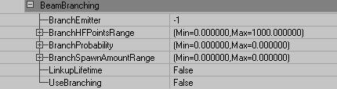

To make good looking lightning, you can give it branches. It works like this: you have to create more than one BeamEmitter (inside the same Emitter). Click in the Emitters field and click Add. Then choose BeamEmitter type and click New.Then you can set the first BeamEmitter to use the second BeamEmitter for the branches. Going further, you can tell the second BeamEmitter to use a third one for sub-branches, and so on. The MaxParticles setting is also the maximum number of branches.A few tips on the settings of your branch emitter: You will want to make the branch BeamEmitter smaller than your main beam, and it should have a higher MaxParticles value (your main beam should probably have a very low MaxParticles value). In Local, set RespawnDeadParticles to False for all branches, and set AutomaticInitialSpawning in Spawning to False, otherwise the branches might get spawned at the StartPoint of the emitter itself instead of the new StartPoint they get when they become branch. Also, make sure your main beam has a lot of BeamNoise. The branches will appear in the bends only, so if there aren't enough HF and LF points, there isn't place enough for all the branches! You can of course make the noise very subtle, so you won't notice it. Only the number of HF points is important--the more the better.

### BranchEmitter

This chooses the emitter you will use for your branch emitter. It is the number of the emitter you just added.

### BranchHFPointsRange

This is the range of high frequency points from which the branches of the beam will be spawned. The high frequency points are indexed starting with 0 at the beam's origin and continuing up to the number of high frequency points. The Max of this can be set well beyond the number of the high frequency points so if you don't want to think about this setting make sure the Min is 0 and the Max is very large, like 1000.

### BranchProbability

With BranchProbability, you can set the chance of branches to appear. If you set both Min and Max to 1, all the branches will be there (this is, the number of branches that you set in MaxParticles). If you enter a very high number, the branches may appear only at the top of the main beam. If Min=0 and Max=1, the branches will be divided over the whole beam. You have to experiment a little with this setting to find the best result.

### BranchSpawnAmountRange

In BranchSpawnAmountRange, both Min and Max have to be larger than 1, as soon as you make one of them smaller than 1, there won't appear any branches at all. The Branch Spawn Amount is the number of beams to spawn at each high frequency point. When this is 1, there will be at most 1 branch at each point. If this is 10, there will be up to 10 branches coming off each point.

### LinkupLifetime

If LinkupLifetime is False, the branches may stay behind while the large beam is somewhere else already. This happens when the branch has a bigger LifeTime, than the large beam. Setting LinkupLifetime to True, solves problems because the branches will live as long as the main beam, no matter their LifeTime value.Note: Make sure RespawnDeadParticles is False for the branches in this case, otherwise they get spawned at the wrong place.Here is an example of BeamBranching: The main beam is red. It has 12 LowFrequencyPoints and 60 very small HighFrequencyPoints that can be used as spawn points for the 25 green branches.

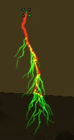

You can also make the branch emitters have branches. In branch emitter's setting, if you set UseBranching to True, and set BranchEmitter to 2, the branches get sub-branches themselves. Note that if MaxParticles is 10 for the sub-branches, there will be 10 sub-branches total, and not 10 for every branch. For example, this emitter has 10 sub-branches (pink).

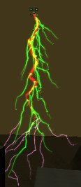

### UseBranching

Setting this value to True will allow beam branching.

## BeamNoise

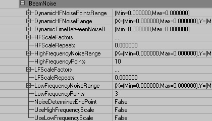A word about Dynamic High Frequency Noise: Dynamic HF Noise is used to make the beam actually wiggle over the course of its lifetime. The only drawback of dynamic noise is that it only works on the first beam in a Beam Emitter. If you have more than one beam, the dynamic noise will not apply to the additional beams. The functions of the specific properties are described below.

### DynamicHFNoisePointsRange

Determines the range along the beam that will have Dynamic Noise. The high frequency points start at index 0 at the start of the beam and end at 1 less than the total number of points. If the beam has 20 high frequency points and Dynamic High Frequency Noise Points is set from 0 to 10, only half of the beam will move dynamically.

### DynamicHFNoiseRange

This simply determines the range of dynamic noise applied to the beam. Higher values will result in the beam's High Frequency points being dynamically offset further and further in the respective dimension (X, Y, or Z).

### DynamicTimeBetweenNoiseRange

This determines the time the engine waits before updating the Dynamic Noise. If you want the beam to update continuously set Dynamic Noise Points Update Time to 0 or some very small number.

### HFScaleFactors

Insert these to create a High Frequency Scale, similar to the ColorScale explained in the [EmittersReference](../Content Creation/Effects/EmittersReference.md#color) document.For example, let's say you have a beam with 100 HighFrequencyPoints. Without the HFScale, the whole Beam has the same NoiseRange everywhere, as in the image below.

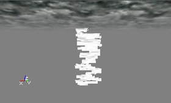

To enable the HFScale, first set HighFrequencyScale to True, and then add HFScales in HFScaleFactors, the same way as you might add ColorScales: click on HFScales and press the Add button until you have enough HFScaleFactors. In there, FrequencyScale multiplies the HighFrequencyNoiseRange (X, Y and Z separately), and RelativeLength determines the Location of the beam where you want this multiplier to happen. 1 represents the length of the whole beam. If you set for HFScaleFactor[0] the RelativeLength to 0.7, the first 70% of the beam will have the FrequencyScale of that HFScaleFactor, and if you then set the RelativeLength of HFScaleFactor[1] to 1, the remaining 30% will get multiplied by the FrequencyScale of HFScaleFactor[1]. On the screenshot the FrequencyScale of [0] is 1 for X, Y and Z, and the FrequencyScale of [1] is 10 for X, Y and Z.

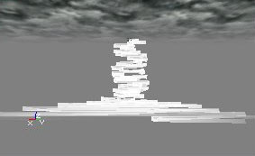

### HFScaleRepeats

This allows you to repeat the HFScale you have created using HFScaleFactors. A value of 1 repeats the scale one time, resulting in the image below.

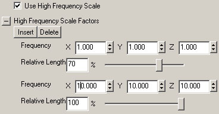

### HighFrequencyNoiseRange

This determines the amount of noise is applied to the HighFrequencyPoints of the beam. Higher values will result in the beam's High Frequency points being offset further and further in the respective dimension (X, Y, or Z). HighFrequencyNoise creates small-scale bends in the beam.

### HighFrequencyPoints

There must be at least 2 HighFrequencyPoints which define, along with 2 LowFrequencyPoints, the beam's Start and End points. They determine where the beam makes small bends. They also serve as points for Branching Beams.

### LFScaleFactors

This works exactly like  [HFScaleFactors](BeamEmitter.md#hfscalefactors) (check there for a thorough explanation), except that it applies to Low Frequency Noise. Low frequency and high frequency noise work independently from each other, and can be used "through" each other. For example, you can use a lot of small High Frequency Points, and a few, very large, Low Frequency Points. Then the beam will have a few large bends, and a lot of small bends at the same time, as shown on the screenshot:

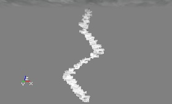

### LFScaleRepeats

This allows you to repeat the LFScale you have created using LFScaleFactors. A value of 1 repeats the scale one time, resulting in the image above.

### LowFrequencyNoiseRange

This determines the amount of noise is applied to the LowFrequencyPoints of the beam. Higher values will result in the beam's Low Frequency points being offset further and further in the respective dimension (X, Y, or Z). LowFrequencyNoise creates large-scale bends in the beam.

### LowFrequencyPoints

There must be at least 2 LowFrequencyPoints which define, along with 2 HighFrequencyPoints, the beam's Start and End points. They determine the points at which the beam makes large bends.

### NoiseDeterminesEndPoint

This allows the noise applied to the beam to also affect its endpoint, which in most cases, it already does. Sometimes, however, the location of the endpoint is locked-- if the  [DetermineEndPointBy](BeamEmitter.md#determineendpointby) setting is  [PTEP\_Actor](BeamEmitter.md#ptep_actor), for example. In this case the endpoint will be set to the center point of the specified actor. However, this might not be the desired effect. It might look odd to see lightning strike the exact same place repeatedly. Setting this value to True will allow the beam to strike the desired actor but in a more random fashion.If the beam were striking a triggerable actor, allowing the noise to determine the endpoint will not stop the actor from triggering, even if the beam does not visually strike that actor. Note that this might result in visual glitches if the amount of noise is great. For example, let's say your beam is supposed to strike a tree and set off a fire particle system. However, it will look strange if a lightning bolt strikes the ground and tree 40 feet away from the impact bursts into flame. Reducing the amount of noise on the beam would fix this problem.

### UseHighFrequencyScale

If True, the beam will use a  [HFScale](BeamEmitter.md#hfscalefactors) as described above.

### UseLowFrequencyScale

If True, the beam will use a  [LFScale](BeamEmitter.md#lfscalefactors) as described above.

## Collision

Beam Emitters do not work with collision *per se*. However, the beam can be interrupted if it intersects something. See  [PTEP\_TraceOffset](BeamEmitter.md#pteptraceoffset) for more information. For more on particle collision check out the [EmittersReference](../Content Creation/Effects/EmittersReference.md#collision) document.

## Color

The best way to make the lightning to flash realistically is to use a color scale. This will make the whole beam change it's color during it's LifeTime. On the animated screenshot, there are two color scales] orange and yellow and the lifetime of the particles is 0.6 seconds. You can also use Fade In and Fade Out to make a flashing effect.

The use of ColorScale is further explained in the [EmittersReference](../Content Creation/Effects/EmittersReference.md#color) document.

## Fading

For a more in-depth review of fading, see the [EmittersReference](../Content Creation/Effects/EmittersReference.md#fading) document.

## Revolution

This doesn't seem to affect Beam Emitters. For a more in-depth review of revolution, see the [EmittersReference](../Content Creation/Effects/EmittersReference.md#revolution) document.

## Rotation

You may want to add rotations to your Beam Emitter. For a more in-depth review of rotation, see the [EmittersReference](../Content Creation/Effects/EmittersReference.md#rotation) document.

## Size

With the X values of the StartSizeRange, you can make the lightning more thin or more fat. This doesn't change the length of the lightning, only the width of it's texture.For a more on Size, see the [EmittersReference](../Content Creation/Effects/EmittersReference.md#size) document.

## SkeletalMesh

Skeletal Mesh emitters allows you to attach particles to the bones of a skeletal mesh. The mesh is used to determine the spawn location of the particles and can also be used to determine the movement the particles. For a more in-depth review of Skeletal Mesh emitters, see the [EmittersReference](../Content Creation/Effects/EmittersReference.md#skeletal_mesh) document.

## Spawning

Make sure to set appropriate values in the Spawning fields. These figures will affect how quickly particles are created, over the lifetime of your emitter. For a more in-depth review of Spawning, see the [EmittersReference](../Content Creation/Effects/EmittersReference.md#spawning) document.

## Texture

For more information on the texture field, see the [Emitters Reference](../Content Creation/Effects/EmittersReference.md#texture_).

## Tick

This functions normally. See the [Emitters Reference](../Content Creation/Effects/EmittersReference.md#tick) for more information.

## Time

This functions normally. See the [Emitters Reference](../Content Creation/Effects/EmittersReference.md#time) for more information.

## Trigger

This functions normally. See the [Emitters Reference](../Content Creation/Effects/EmittersReference.md#trigger) for more information.

## Velocity

StartVelocityRange will determine the initial velocity of your particles. Since this is given in a range, the value chosen for the particle velocities will be random. If your  [DetermineEndPointBy](BeamEmitter.md#determineendpointby) setting is not  [PTEP\_Velocity](BeamEmitter.md#ptep_actor), these numbers will be ignored.See the [Emitters Reference](../Content Creation/Effects/EmittersReference.md#velocity) for more information on Velocity.

## Warmup

This functions normally. See the [Emitters Reference](../Content Creation/Effects/EmittersReference.md#warmup) for more information.
