# Breakaway Example

*Document Summary: Using visual explanations, this doc shows how various Unreal elements can be combined to create a scene.**Document Changelog: Last updated by Jason Lentz (DemiurgeStudios?), for creation purposes. Original author was Jason Lentz (DemiurgeStudios?).*

* [Breakaway Example](BreakAwayExample.md#Breakaway Example)
  + [Introduction](BreakAwayExample.md#Introduction)
  + [Order of Operations](BreakAwayExample.md#Order of Operations)
    - [Subtracting Out the World Space](BreakAwayExample.md#Subtracting Out the World Space)
    - [Adding a Rough Terrain](BreakAwayExample.md#Adding a Rough Terrain)
    - [Adding/Subtracting secondary BSP zones](BreakAwayExample.md#Adding/Subtracting secondary BSP zones)
    - [Adding World Geometry](BreakAwayExample.md#Adding World Geometry)
    - [Adding Water and Other effects](BreakAwayExample.md#Adding Water and Other effects)
    - [Adding Polish](BreakAwayExample.md#Adding Polish)
  + [Creating the BSP Space](BreakAwayExample.md#Creating the BSP Space)
    - [Setting up the Zones](BreakAwayExample.md#Setting up the Zones)
    - [Connecting to the Terrain](BreakAwayExample.md#Connecting to the Terrain)
    - [Advantages of BSP](BreakAwayExample.md#Advantages of BSP)
    - [BSP Editing Tools and Techniques Used](BreakAwayExample.md#BSP Editing Tools and Techniques Used)
    - [BSP Holes](BreakAwayExample.md#BSP Holes)
    - [Additional BSP references](BreakAwayExample.md#Additional BSP references)
  + [Setting up Trees with Shadows](BreakAwayExample.md#Setting up Trees with Shadows)
    - [Basic Tree StaticMesh](BreakAwayExample.md#Basic Tree _StaticMesh)
    - [Shadow Projector](BreakAwayExample.md#Shadow Projector)
    - [Special Materials for Leaves](BreakAwayExample.md#Special Materials for Leaves)
    - [Assembling the Torches](BreakAwayExample.md#Assembling the Torches)
  + [Giving Atmosphere to the Level](BreakAwayExample.md#Giving Atmosphere to the Level)
    - [Sun Light](BreakAwayExample.md#Sun Light)
    - [Rolling Clouds](BreakAwayExample.md#Rolling Clouds)
    - [Sky Zone](BreakAwayExample.md#Sky Zone)
    - [Distance Fog](BreakAwayExample.md#Distance Fog)

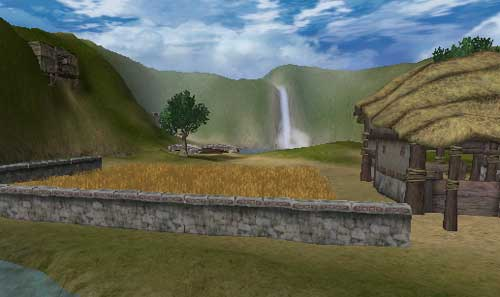

## Introduction

The map being referenced in this example is the EM\_Runtime map that comes with the Runtime build. Using breakaway images, this doc shows how all of the different aspects of the Runtime map were put together. This doc is an excellent doc for first time users of the Unreal Engine who are curious to see what things be accomplished as well as how everything works together. While this doc doesn't go into detail on how to set up every aspect of each effect, it does link to several others that do.To download the Runtime build and map click on the following link:[http://udn.epicgames.com/pub/Powered/UnrealEngine2Runtime/](rsrc/Powered/UnrealEngine2Runtime/)

---

## Order of Operations

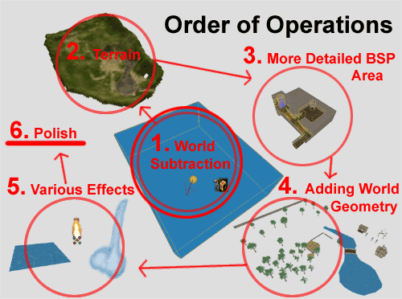

The creation of the level can be broken down into six stages:

* [1](BreakAwayExample.md#OnE) Subtracting out a large BSP zone for the world
* [2](BreakAwayExample.md#TwO) Adding the Terrain and roughly sculpting it
* [3](BreakAwayExample.md#ThreE) Adding the secondary BSP addition then subtractions with zones
* [4](BreakAwayExample.md#FouR) Adding world geometry
* [5](BreakAwayExample.md#FivE) Adding water and other effects
* [6](BreakAwayExample.md#SiX) Polishing everything (sounds, special materials, better lighting)

### Subtracting Out the World Space

There is also of course a *zeroth* step which is the designing of your level but once you've figured out what you want where and how big, you are ready to subtract out your world space. If you misjudge how large your world needs to be, you may need to make more subtractions later, which is not ideal. So when in doubt, it is best to error on the side of larger rather than smaller.After subtracting the space you will need to do three more things, make sure the faces are set up to be Fake Backdrop, add a SunLight Actor, and then set up a ZoneInfo. The only fields that are necessary to fill out right now are **bTerrainZone = True** and some sort of **AmbientBrightness.** It might also be a good idea to set **bDistanceFog = True** but we'll get to that later in this doc.One last thing you can do to make your life just a little bit easier, is to increase the **DrawScale** to something on the order of 10 or 20 so it's easier to find in the level. This only changes the size of the icon, so it's a purely cosmetic feature that will only be noticeable in the Editor.For more about setting up a basic world space see the [Intro To Unreal Ed](../Content Creation/Basics/IntroToUnrealEd.md#Creating_the_Basic_World_Space) doc.

### Adding a Rough Terrain

Next in the process for creating the Runtime map a rough Terrain was added. In this step the layout of the entire level was quickly set up and tested to see if everything was to the right scale. Initially, a 64x64 size Terrain was used to save on memory and then place holder models for trees and buildings to get a sense of scale.

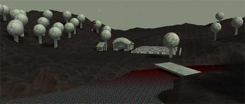

### Adding/Subtracting secondary BSP zones

Once a rough layout of the landscape of the entire level is set up, then the more detailed underground BSP section was added. This in itself was a multi-step process, but the most important part was setting it up to make sure it would fit beneath the Terrain without popping through. A more detailed description of the BSP space can be found [below.](BreakAwayExample.md#Creating_the_BSP_Space) Also in this step a sky box was added to help give the entire world a better sense of place.

### Adding World Geometry

After all of the spaces a player can go are laid out, then more complex level geometry is added to flesh out the scene. There is often a fair amount of back and forth with the artist(s) and level designer through this stage as you find out what special needs are required in special sections

### Adding Water and Other effects

Now all of the special effects types are added, such as water falls, flowing water, special materials for waiving wheat and leaves, shadows, and torch fires are added to the level. This step, like the last, can also require a lot of back and forth with the artist(s) and level designer.

### Adding Polish

And last but definitely not least is the polish. After everything is laid out you can go back over and make it all better. Hopefully if you designed your level well from the beginning, nothing major will need to change.

---

## Creating the BSP Space

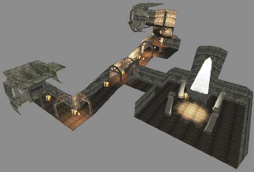

Many many moons ago, entire levels were constructed entirely out of BSP. Now things are done differently. BSP is still necessary for setting up Zones, the general world space, and some special effects that require BSP surfaces. The main world that the player sees though should be made up of StaticMeshes?. This section of this document will explain how the underground area was set up in the EM\_RunTime map.Below you can see a break away image showing each of the zones that the BSP area is divided into with the StaticMesh, Mover, Light, and Emitter Actors raised above the sections in which they reside.

### Setting up the Zones

The zones are set up simply at each corner or space that will block a line of sight from one area to the next. So the resulting zones will be in a sequence of a zone that you stand in, a zone for the corner, and another zone that should be hidden around the corner. The tighter you can make the zones to encase the StaticMeshes you will use to decorate the level, the better.

### Connecting to the Terrain

Since the BSP area of the EM\_RunTime map is underground it required special attention to connect it to the Terrain. This was done with carefully placed meshes, and carefully cut zones. Below you can see a breakaway image of how the entrance was put together.

The same technique is used for the exit at the top of the spiral staircase in the BSP area. You may also find that blocking volumes are necessary to smoothly transition between the StaticMesh and the Terrain and/or BSP floor.

### Advantages of BSP

While using BSP for everything is no longer a viable option (not only because it can be unwieldy to work with but also because it does not render as fast as StaticMeshes), it still has many advantages. Among the most obvious advantage, aside from zoning, is how it handles lighting. When you rebuild lights it ray traces the lighting onto all of the BSP surfaces from the light source taking into account any geometry that might be blocking it and creates very slick baked in lighting.

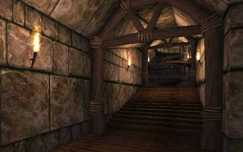

Another advantage of BSP is that it calculates collision much faster than StaticMesh geometry. Because of this BSP is often used as the floor for an area where StaticMeshes make up the walls, ceilings, and other details of the environment.

### BSP Editing Tools and Techniques Used

A variety of initial temporary builder brushes were used in the process for creating the BSP section. Note that this method works best if you are keeping your designs modular so you can get as much reuse out of your core builder brush as you can. The core builder brush for the BSP section in the EM\_RunTime map was the hallway piece which was created in the following order:

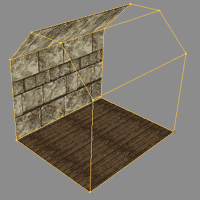

Then this resulting brush was intersected with a new Builder brush and then Added to the world so that it could be used later to create more complex shapes such as intersections, sloped hallways, and turns (as seen below).

The above sections were created through a combination of intersecting and deintersecting new brushes made from our core hallway piece as well as using the Vertex Editing tool to manually select and move certain faces to the right place. This modular and incremental design of the BSP makes it much easier to modify your BSP based sections as well as expand the area by adding new rooms based on your core pieces. Virtually every part of the BSP section in the EM\_RunTime map is based off of the one core hallway piece that was initially created as described above.

### BSP Holes

BSP holes can be terrible and nasty problems to track down and correct, so the best thing to do is to avoid ever introducing them into your level. Here are some tips and guidelines that I followed to avoid BSP holes.

* Always have the grid snap on
* Work in modular units (for instance 256 x 256 x 256 blocks)
* Keep the BSP geometry as simple as possible
* avoid rotating BSP brushes
* if you must rotate a BSP brush, rotate it only once and alter the Rotation grid so that it snaps to your desired angle
* Test the level and save back ups often when working with BSP

If you do encounter BSP holes, often it is easier to revert to an earlier version than to correct the problem or if that's not an option, delete the trouble section and try to create it again but more simply.

### Additional BSP references

For more detailed information on these various topics check out the following documents:

* [LevelOptimization](../Content Creation/Techniques/LevelOptimization.md)
* [ExampleMapsCaverns](ExampleMapsCaverns.md)
* [LightingOnSurfaces](LightingOnSurfaces.md)

Also taking a look at any UT2K3 map will be a good example to look out to see how zone issues are handled in professional product.

---

## Setting up Trees with Shadows

You can just let Unreal cast its default shadows for StaticMesh geometry as it roughly ray traces the shadow cast by the geometry, or you can set the mesh to bCastShadow = *False* and create your own more detailed shadows.

Here is how the trees were set up in the EM\_RunTime including not only their waiving shadows, but also their waving leaves.

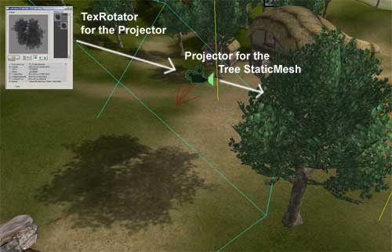

### Basic Tree StaticMesh

For the trees in EM\_RunTime, only one tree mesh was used. It's roughly 890 units tall, and has 820 triangles and 4 materials (2 branch/leaf textures, 1 bark, and 1 detail texture for the bark) assigned to it.

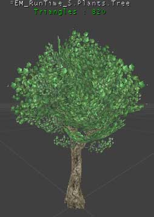

To create the appearance of several different similar types of trees and avoid obvious repetition, each copy of the tree was scaled and rotated differently so no obvious patterns would stand out. Not that for this method to work, the basic mesh must also be some what regular in its randomness, or in other words, you can't have on really characteristic branch that sticks out. If you do, then this branch will be still be able to be noticed after rotating and/or scaling and thus the illusion breaks down.

### Shadow Projector

To set up a more elaborate shadow, a projector is used in conjunction with the tree mesh. This will require a special additional texture to be created, by taking a screenshot of the tree in the level and importing desaturating then importing it as described in the [Advanced Lighting Example Map doc](ExampleMapsAdvLighting.md#Single_Tree_Shadow).In the EM\_RunTime map the sun is at such a steep angle that the shadow is close enough to being directly beneath it that a simple TexRotator that subtly oscillated back and for was used to give the effect that the shadow of the leaves are waiving just as the leaves in the tree are. The next section describes briefly how the leaves were made to wave.

### Special Materials for Leaves

To make the tree seem more alive and in a living world, the leaves have a subtle waiving motion to them as if wind was steadily passing across them. To achieve this affect, all that is necessary is a TexOscillator. The base texture for the leave textures is passed into a TexOscillator with the following properties:

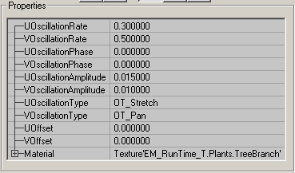

And then the new TexOscillator is assigned to the tree StaticMesh in the StaticMesh browser so that all the trees will have the waiving leaves.

---

### Assembling the Torches

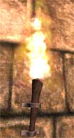

The torches in the EM\_RunTime map are made up of four parts, the StaticMesh, the fire emitter, and the light, and an AmbientSound.

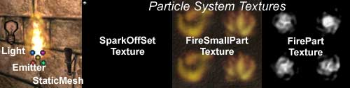

The AmbientSound, for simplicities sake was set in the Sound property of the Fire Emitter -this way if you need to copy or move a torch set up you have one less object to select. The light is best left as a separate actor as the lighting looks much better if it is actually set apart from the wall some and thus the apparent light source. And of course the Emitter and StaticMesh must be separate actors.One helpful tool used in organizing this torch set is the Groups Browser. By creating a group that has just the lights for the torch you can then go back later if you want to tweak the lighting to adjust the hue or brightness. You could even create a hidden mover that constantly wiggles back and forth, attach all the lights to it at once, and set them to bDynamicLight = *True* to create a shimmering effect consistent with flickering flame. If the lights were not in their own group, this task would be as many times more time consuming as you have lights, and there's always the chance you might miss one.For more on using the Groups Browser, see the [GroupsBrowser](GroupsBrowser.md) document. Also you can see more cool effects that you can add to your torch in the [Advanced Lighting Example Map doc](ExampleMapsAdvLighting.md#Wavering_Torch_Light). If you are curious about how to create your own fire emitter, check out the this example in the [Emitters Examples doc](EmittersExamples.md#The_Torches).

---

## Giving Atmosphere to the Level

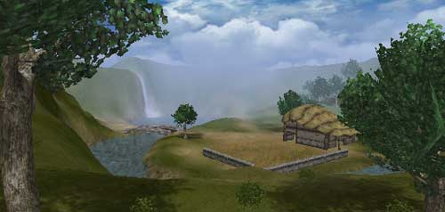

There are several tools that one can use to create a sense of atmosphere and a real feel of place in your level. In the EM\_RunTime map, **Sun Light**, a **Sky Zone**, **Distance Fog**, and a **Projector** casting rolling clouds over the level all work together to give a sense of atmosphere to the level. Below are brief descriptions on how each of these elements are set up in the level.

### Sun Light

The SunLight Actor was among the first of these elements to be placed and set up in the level, and also one of the easiest, but it is very important to note that how the SunLight is set up will affect several other aspects of the level. For instance, as mentioned [above](BreakAwayExample.md#TreeShadow), the Projectors used for the Tree Shadows are aligned to match the same exact rotation of the SunLight Actor.Another thing that the SunLight will obviously have a dramatic impact on are the shadows cast by the Terrain as well as the time of day. You will want to experiment with the LightColor fields as well as the Rotation settings in the SunLight Actor to make sure that it's not obscuring important parts of your level and is highlighting areas that you do want out in the light.

### Rolling Clouds

To create a rolling clouds all you really need is a panning cloud texture and a really large projector that casts down across the entire level. For a more detailed description you can take a look at the [Advanced Lighting Example Map](ExampleMapsAdvLighting.md#Rolling_Clouds) doc.Some things to watch out for when setting up your rolling clouds Projector are artifacts that occur on masked and alpha-ed textures (like the leaves in the tree StaticMesh) as well as indoor spaces that are still within the MaxTraceDistance of the Projector. There are a couple ways to take care of these issues. Mainly, just make sure that the Projector isn't casting on the surfaces. This can be accomplished with any of the following techniques:

* ProjectTag settings
* bAcceptProjectors on the non-cooperative Actors
* bProjectOnBSP/Terrain/StaticMesh settings of the Projector

### Sky Zone

Having a SkyZone in your level will also go a long way to creating a feeling of space. There are of course a number of different ways in which a SkyZone can be set up. To see three examples of different SkyZones see the [Sky Zones Example Map doc](ExampleMapsSkyZones.md). Here is how the SkyZone in the EM\_RunTime map was set up:

As you can see, the SkyZone is constructed out of four StaticMeshes -or rather two meshes each used twice: Two cylinders and two planes. The two planes are used to create a greater sense of depth in the clouds and the inner cylinder is there to blend more smoothly into the Distance Fog (described below). Each of the StaticMeshes are set to bUnlit = *True* since there is not light source in the SkyZone itself. The subtraxted BSP box that the SkyZone resides in is textured with just a solid sky blue texture. Once all the StaticMeshes and the SkyZoneInfo are set up in place, then your SkyZone is ready to go.

### Distance Fog

The last thing you can use to create a sense of atmosphere in your level is to turn on Distance Fog in your ZoneInfo. By playing with the DistanceFogEnd and DistanceFogStart values you can get the density of fog you want, and then by making the DistanceFogColor matching the inner ring of a sky cylinder, you will get the effect of things being culled by the Distance Fog will appear as if they are blending into the horizon.For additional information on using Distance Fog, see the [Level Optimization doc](../Content Creation/Techniques/LevelOptimization.md#Distance_Fog).
