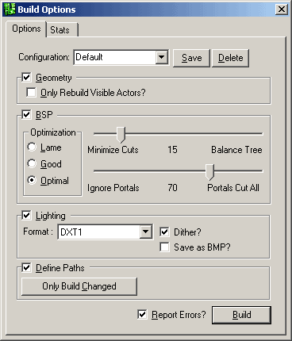

# Build Options Reference

*Document Summary: Here you will find explanations for all of the different settings under the Build Options menu.**Document Changelog: Last updated by Jason Lentz (DemiurgeStudios?) to include infomation on the Ignore Portal/Portals Cut All slider. Original author: Jason Lentz (DemiurgeStudios?).*

* [Build Options Reference](BuildOptionsReference.md#build-options-reference)
  + [Introduction](BuildOptionsReference.md#introduction)
  + [Configuration](BuildOptionsReference.md#configuration)
  + [Geometry](BuildOptionsReference.md#geometry)
  + [BSP](BuildOptionsReference.md#bsp)
    - [Optimization: Lame Good Optimal](BuildOptionsReference.md#optimization-lame-good-optimal)
    - [Minimize Cuts versus Balance Tree](BuildOptionsReference.md#minimize-cuts-versus-balance-tree)
    - [Ignore Portals versus Portals Cut All](BuildOptionsReference.md#ignore-portals-versus-portals-cut-all)
  + [Lighting](BuildOptionsReference.md#lighting)
  + [Define Paths](BuildOptionsReference.md#define-paths)

## Introduction

When rebuilding your scene you have the option of customizing what is rebuilt. Most of customization you will want can be achieved through the separate buttons on the interface, but if you want more finely tuned control over what you will be rebuilding or how it will be rebuilt then the Build Options may be exactly what you want.

## Configuration

Once you have all of your settings the way you want them, you may want to save them. To do this, just type in a name for your settings right over the default field and then click on the save button in the build options. Now whenever you start up Unreal Ed, you will have that option available as one of the pull downs from the Configuration field.Note that the check box for "Report Errors" is not saved when you save the configuration. If you want the Build process to ignore errors, then you must turn it off each time your restart Unreal Ed.

## Geometry

In this section you can choose to either not rebuild any of the geometry at all by checking on the main box, or you can choose to rebuild only the actors that are visible by checking both boxes. What is meant by "Visible Actors," is all actors that are not set to be invisible to players either by setting their bHidden field set to *False* or setting their surface properties to be invisible.

## BSP

When the BSP box is not check, the rebuild process will entirely skip rebuilding BSP. There are also specific settings that can be tweaked for how the BSP is rebuilt. The following sections describe these settings.

### Optimization: Lame Good Optimal

These radio buttons determine the general speed versus quality of the rebuild."Optimal" considers every poly for cutting every other poly in the level. This results in a substantial build time, but it should result in more stable BSP in that the best polygon is always selected"Good" and "Lame" settings should speed up rebuild times, but they may result in much slower running speeds when actually running the level.For any level that is nearing finalization, the "Optimal" setting is the one you will want.

### Minimize Cuts versus Balance Tree

The default position for this slider is best as there aren't any consistent benefits to changing the slider either way.

### Ignore Portals versus Portals Cut All

This slider controls the percentage to cut based on visablity into the next zone. If set all the way to the right it will be more generous in what the renderer decides not to cull. If set all the way to the left, it will be more strict about what is culled based on visibility.This option is a very handy tool if your map is having some problems with certain portal setups or your trying to optimize the polygon count from certain views.

## Lighting

Rebuilding lighting can also be skipped if the box is not checked. The pull-down in this field determines what type of compression will be used for the light maps on BSP. As with any texture, the different compression settings are a give and take between quality and file size. The "Dither" check box also allows you to set whether or not you want the light maps to be dithered.The "Save as BMP" will create a BMP file that contains all of the light map information for shadows cast on BSP. As many 512x512 Bitmap files as needed will be saved in the System folder of your version of Unreal as "LM-0000#.bmp"Below is an example of what one of the light map files looks like from the EM\_Runtime.urt example map:

The usefulness of this functionality it not entirely clear though as you cannot import light maps.

## Define Paths

Lastly, to avoid rebuilding paths with every rebuild of the map, this box can be unchecked. Also by pressing the button in this section you can choose to only build the paths that have been altered. Note, that this will not rebuild any of the lighting or geometry.
