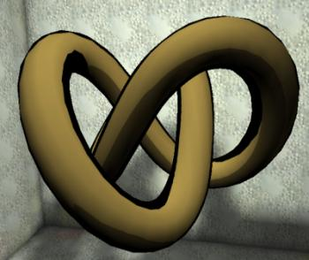

# Example of Cel Shading in UT2004

*Document Summary: An example of cel shading in UnrealEngine2, with example content provided for UT2004.**Document Changelog: Created. Thanks to Steve Polge and Alan Willard. Renamed to UT2004 by Michiel Hendriks*

* [Example of Cel Shading in UT2004](CelShadingExampleUT2004.md#example-of-cel-shading-in-ut2004)
  + [Alan Willard writes...](CelShadingExampleUT2004.md#alan-willard-writes)
  + [A Note](CelShadingExampleUT2004.md#a-note)

## Alan Willard writes...

"Here's how I hacked cellshading into the base Unreal Engine.Create a cubemap with mostly white sides, one black sides, and a thin black border on every white side where it touches the black. For 'lighting' I put a mid-grey on the bottom face of the cubemap.This cubemap, when placed inside a texenvmap set to cameracoords, is then multiplied with a texture or color in the diffuse channel of a shader. For no lighting, put the same combiner in the self-illumination channel.[Attached](../assets/ut2004celshadingexample.zip) is an example texture package and map. Place in the appropriate directories in UT2004 and enjoy.- Alan Willard   
- Level Designer   
- Epic Games"

## A Note

Open the map up in UnrealEd; it's not a DM map or anything, there's no playerstart, it's just a room with a cel-shaded object for you to see it in use.

