# Creating DecoLayers

*Document Summary: An introductory document on setting up DecoLayers.**Document Changelog: Last updated by Michiel Hendriks, v3323 update. Previously updated by Jason Lentz (DemiurgeStudios?) to separate into smaller docs for the 2110 build. Original author was Lode Vandevenne ([UdnStaff](https://udn.epicgames.com/Main/UdnStaff)).*

* [Creating DecoLayers](CreatingDecoLayers.md#creating-decolayers)
  + [Introduction](CreatingDecoLayers.md#introduction)
  + [Creating a DecoLayer](CreatingDecoLayers.md#creating-a-decolayer)
  + [Additional DecoLayer Properties](CreatingDecoLayers.md#additional-decolayer-properties)
    - [AlignToTerrain](CreatingDecoLayers.md#aligntoterrain)
    - [ColorMap](CreatingDecoLayers.md#colormap)
    - [DensityMap](CreatingDecoLayers.md#densitymap)
    - [DensityMultiplier](CreatingDecoLayers.md#densitymultiplier)
    - [DetailMode](CreatingDecoLayers.md#detailmode)
    - [DisregardTerrainLighting](CreatingDecoLayers.md#disregardterrainlighting)
    - [DrawOrder](CreatingDecoLayers.md#draworder)
    - [FadeOutRadius](CreatingDecoLayers.md#fadeoutradius)
    - [LitDirectional](CreatingDecoLayers.md#litdirectional)
    - [MaxPerQuad](CreatingDecoLayers.md#maxperquad)
    - [RandomYaw](CreatingDecoLayers.md#randomyaw)
    - [ScaleMap](CreatingDecoLayers.md#scalemap)
    - [ScaleMultiplier](CreatingDecoLayers.md#scalemultiplier)
    - [Seed](CreatingDecoLayers.md#seed)
    - [ShowOnInvisibleTerrain](CreatingDecoLayers.md#showoninvisibleterrain)
    - [ShowOnTerrain](CreatingDecoLayers.md#showonterrain)
    - [StaticMesh](CreatingDecoLayers.md#staticmesh)
  + [Other Sections](CreatingDecoLayers.md#other-sections)

## Introduction

Here you will see how to create your own DecoLayers and the various ways you can manipulate them to your liking. This document assumes that you know how to build and shape a terrain and that you are familiar with the [UnrealEdInterface](../Content%20Creation/Basics/UnrealEdInterface.md), the StaticMesh Browser, and the Texture Browser.

## Creating a DecoLayer

DecoLayers generate Static Meshes everywhere on the terrain. You can only see the ones that are inside a radius you can set, to save resources. Also, the StaticMeshes from a DecoLayer are able do not impede players, so using them for trees isn't realistic, but DecoLayers are better used for grass, flowers and ferns.

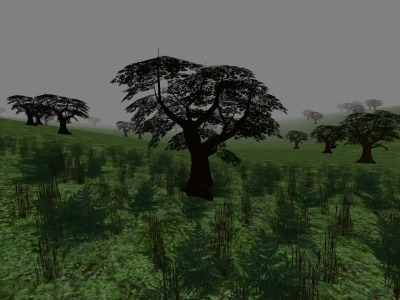

To create a new DecoLayer on a Terrain go to the Terrain Editor and click on the Decorations tab and press

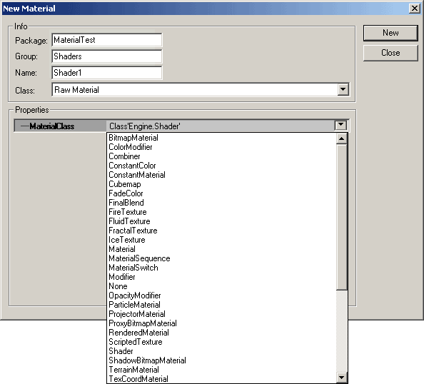

.You can also add more than one DecoLayer if you like. Before the DecoLayer works, you have to set a lot of settings. First give it a StaticMesh by right clicking on the newly created DecoLayer. This tells the DecoLayer what it will be rendering.

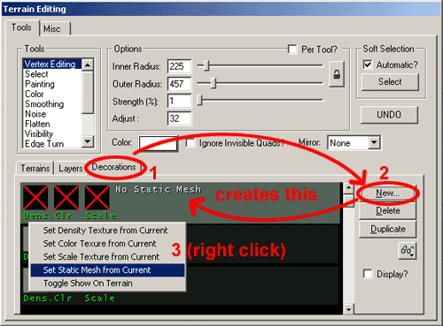

Then you must create a new Terrain Layer. Get a texture that is very different from your terrain (for instance an checked texture -although make sure it's an RGBA8 texture with an alpha channel or a P8 texture). Create a new Terrain Layer by clicking on the "Layer" tab of the Terrain Editor, then click the

button. Be sure to enter the texture's correct dimensions in the AlphaHeight and AlphaWidth fields. Also you should create this layer at the bottom of the layer stack. If you did not, you can move it to the bottom by selecting the layer and using the

buttons.Next, select the Layer Texture that was created in the Texture Package "MyLevel" in the Texture Browser (Decoalpha1 in this example). Go back to the Decorations Tab and then right-click on the DecoLayer and choose the "Set Density Texture from Current." This tells the DecoLayer where to lay the decorations using an alpha channel. The white parts of the alpha channel, or the highest places in the palette of the P8 texture, will become the places where the most Static Meshes will be generated.You can also create your own textures maps to use as a Density Texture. If you just want the whole terrain to be grassy, you can use for example a white Density Texture, but if you want the grass to be only in the NW corner of the terrain, make the Density Map black everywhere, except in one corner. For example, you can create a crop circle with it. The picture on the left shows the alpha channel of the Density Texture that was used:

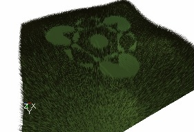The next options to set are in the Properties window of the Terrain Info. To open this, just double click on the TerrainInfo name in the Terrains tab of the Terrain Editor. Go to the TerrainInfo rollout within the Properties window and then expand the DecoLayers section.

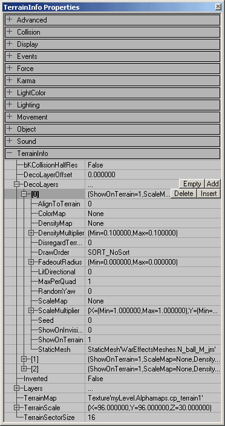

Then expand the DecoLayer enumerated as "[0]", and under the FadeoutRadius enter a large value for the Max, and a smaller value of for the Min. Between each Min and Max FadeOutRadius, the Static Meshes will become more and more transparent, until they become invisible. For example in the screenshot the Min FadeOutRadius is 500 and the Max is 1200. Both radii are marked with a yellow circle on the screenshot. Everything inside the smallest circle is opaque, everything between both circles is translucent, and outside the circles everything becomes invisible.

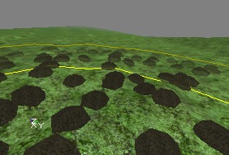

The last in adding the DecoLayer Meshes to your map is to paint them on to your map. To do this, go back to the Layers tab of the Terrain Editor and select the layer you created (Decoalpha1 for this example). If the checkered texture you selected as the Density Texture is showing up when you paint on the DecoLayer Meshes simply go to the Layer tab in the Terrain Editor and move the Layer one below the rest of the Layers in the stack. This causes the terrain to no longer render the texture; however you can still select that layer and paint with it.NOTE: Do NOT paint while you have the DecoLayer selected under the *Decorations tab*. This can create holes in the Density map which prevent you from painting on StaticMeshes anywhere on those holes.

## Additional DecoLayer Properties

There are other options for adjusting the DecoLayers within the TerrainInfo rollout. Below are descriptions of what each of field controls.

### AlignToTerrain

If this is set to [1], this setting will cause the DecoLayer to rotate the StaticMeshes to align with the normal of the quad that the mesh is sitting on. If left at [0] the StaticMeshes will all be vertical.

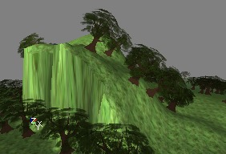

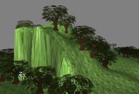Aligning to the terrain can be useful for such things as rocks and debris, but when used on trees and grass it can look out of place.

### ColorMap

This map changes the color of the decorations on different locations. It has to be a RGBA8 texture; otherwise all decorations will become black. This effect is best visible on white or very bright Static Meshes. For example, white Static Meshes become like this if you use a colorful ColorMap:

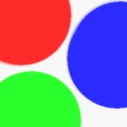

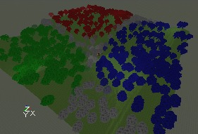You can also paint a color on the DecoLayer manually: go to the Terrain Editing Window, select the tool "Color", pick a color with the Color button, and then go to the Decorations tab and select the DecoLayer you want to paint on. Then you should be able to paint on the terrain in the 3D View.

### DensityMap

This is the Texture Map you assigned by right clicking on the Layer in the Terrain Editor. From here you can reassign it to a different texture by first selecting a texture in the Texture Browser then clicking the "Use" button in this field when it is selected.

### DensityMultiplier

These fields vary the number of StaticMeshes that are placed in the painted DecoLayer area on the terrain. I'm not sure how exactly the Max and Min values separately determine the number ofStaticMeshes placed, but they do each do different things. Experiment with each to find the appropriate density of DecoLayer StaticMeshes.

### DetailMode

This defines the minimal detail that has to be set before this decolayer is shown. The minimal value is `DM_Low`, in this case it will always be shown, unless decolayers are completely turned off ( `DecoLayers` in `[WinDrv.WindowsClient]` ). With `DM_High` it's only shown in high detail mode ( `HighDetailActors` in the render device settings), and `DM_SuperHigh` is just for eye candy ( `SuperHighDetailActors` in the render device).

### DisregardTerrainLighting

Setting this value to 1 will force the deco meshes to ignore the lighting value of the quad they rest on, and make them appear fullbright.

### DrawOrder

The DrawOrder allows you to set in what order the decorations should be drawn. SORT\_BackToFront draws the ones far away first and then the ones close to the camera, and SORT\_FrontToBack does the opposite. SORT\_NoSort uses no specific order. You can use this setting to prevent problems with AlphaTextures: if the near trees are drawn first, and after that the distant trees, the engine may forget to draw these behind semi-transparent parts of the AlphaTexture if AlphaTest is on. This is shown on the first screenshot. If you now set DrawOrder to SORT\_BackToFront, the distant trees are drawn first, and the AlphaTexture from the near trees is blended correctly over them.

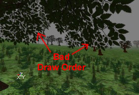

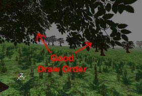Since there are only three different settings, it is pretty easy to experiment with each of the settings to see which works best for your situation if you're not sure which one to use.

### FadeOutRadius

These are the radii that the StaticMeshes begin to fade out. The Min setting determines the distance from the camera at which they start to become translucent, and the Max setting determines the distance from the camera at which they become entirely transparent.

### LitDirectional

If this value is set to [1], it forces the StaticMeshes to use sunlight. It can look very bad in some cases, as it will cause shadows on things like grass and such.

### MaxPerQuad

This value sets the maximum number of StaticMeshes placed per quad.

### RandomYaw

If this is set to 1, the StaticMeshes will be randomly rotated along the Z axis which helps break up `tiling' appearance. Be aware that this may cause AlignToTerrain to work incorrectly.

### ScaleMap

You can add a ScaleMap on the DecoLayer, this is a RGBA8 texture that determines what size the decorations have on different locations on the terrain. This is done for X, Y and Z independently: the red and green channel determine the width and length, and the blue channel the height. For example if you use the texture from the left picture as ScaleMap, and the DecoLayer is a forest, the forest will look like the screenshot on the right:

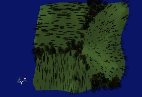

### ScaleMultiplier

You also have to enter a ScaleMultiplier, there are six values for a Min and Max X, Y and Z scale. If you give a different Min and Max, each decoration will get a random size between both values. Sometimes the Static Mesh is so small or so big that you can't see it anymore, sometimes you really have to try different values before you can see the decorations.

### Seed

These determine different randomly generated layouts for the placement of the StaticMeshes. If feel that you have the proper density and number of StaticMeshes but the StaticMeshes aren't quite in the right place, try entering a few different numbers in here to see if different Seeds will produce more favorable scatterings.

### ShowOnInvisibleTerrain

If this is set to [1], the StaticMeshes will still be rendered even if they are on terrain that has been hidden using the Visibility Tool.

### ShowOnTerrain

Make sure ShowOnTerrain is set to [1]. If you leave it at [0], the DecoLayer will not be displayed. This can be handy if you created a DecoLayer but you want to turn it off while you work on the rest of the map.

### StaticMesh

This is the StaticMesh you assigned by right clicking on the Layer in the Terrain Editor. From here you can reassign it to a different StaticMesh by first selecting a one in the StaticMesh Browser then clicking the "Use" button in this field when it is selected.

## Other Sections

To view the other documents on Terrain creation, just click on one of the links below:[TerrainTutorial](../Content%20Creation/Primitives/TerrainTutorial.md) - This outlines all the contents of the following documents. Also, if you add new sections to this document, it is also good practice to update the [TerrainTutorial](../Content%20Creation/Primitives/TerrainTutorial.md) as well.[CreatingTerrain](CreatingTerrain.md) - This document explains how to create a Terrain starting from an empty level.[EditingTerrainMaps](EditingTerrainMaps.md) - Shows how to use the Terrain Editor Tools[EditingTerrainLayers](EditingTerrainLayers.md) - Explains how to create and use Layers within your Terrain.[AdditionalTerrainTips](AdditionalTerrainTips.md) - In this document you will find several ways to greatly improve the appearance and effectiveness of your Terrain. If you are learning how to create your first Terrain, this section should **NOT** be over looked.
