# Creating Your First Terrain

*Document Summary: An introductory document to creating Terrain.**Document Changelog: Last updated by Jason Lentz (DemiurgeStudios?) to separate into smaller docs for the 2110 build. Original author was Lode Vandevenne ([UdnStaff](https://udn.epicgames.com/Main/UdnStaff)).*

* [Creating Your First Terrain](CreatingTerrain.md#Creating Your First Terrain)
  + [Introduction](CreatingTerrain.md#Introduction)
  + [Preparing Your Map for Terrain](CreatingTerrain.md#Preparing Your Map for Terrain)
  + [Your First Terrain](CreatingTerrain.md#Your First Terrain)
    - [The TerrainMap](CreatingTerrain.md#The _TerrainMap)
    - [Adding a Texture](CreatingTerrain.md#Adding a Texture)
    - [Rebuilding the Map](CreatingTerrain.md#Rebuilding the Map)
  + [The Terrain Generator](CreatingTerrain.md#The Terrain Generator)
  + [Other Sections](CreatingTerrain.md#Other Sections)

## Introduction

This document explains how to create a Terrain starting with an empty level. This document assumes that you've never made a Terrain before, but you are familiar with the general [UnrealEdInterface](../Content Creation/Basics/UnrealEdInterface.md) and know how to use the Texture Browser, and Actor Browser.

## Preparing Your Map for Terrain

If you want to have a terrain in your map, you need a very large area to add the terrain. Subtract a very large cube, for example 65536\*65536\*65536. UnrealEd now supports sizes up to 524288\*524288\*524288, but I advise against making such a big space.To enable terrain in this cube, it needs to be a TerrainZone. You need a ZoneInfo for this. Open the Actor Class Browser, expand Info and then select ZoneInfo.

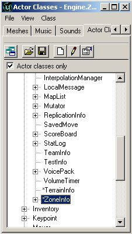

Place the ZoneInfo close to the center of the cube. If you right click in the center of the 2D overhead view and choose "Add ZoneInfo Here", it should be in the center of the cube automatically.

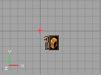

Right click on the ZoneInfo and choose ZoneInfo Properties. In the properties window, expand ZoneInfo and there set bTerrainZone to True. Now the editor knows that this zone will contain terrain. Expand ZoneLight and set AmbientBrightness to 128, this way you will be able to see the terrain when it's built. In the [AdditionalTerrainTips](AdditionalTerrainTips.md) document you will learn how to create SunLight which greatly improves the appearance of Terrain in a level.

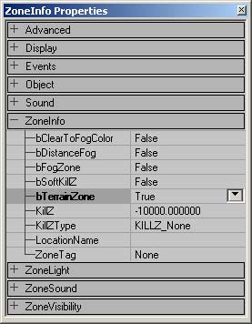

Note that setting the LevelInfo to bTerrainZone doesn't work, you have to use a ZoneInfo. Once you have set this zone to be a TerrainZone, then you can have as many Terrains in the Zone as you want, but if they spill over into another Zone that is not a TerrainZone, those Terrains will not be visible from the Non-TerrainZones.You will probably want to give the sides of the big box a texture now. Make sure it is one that you'll not use for the terrain. This is just to be able to distinguish the terrain and the sides of the box when you just made the terrain later.

## Your First Terrain

Now you are ready to actually create your Terrain. First, open the Terrain Editing Tools with this button from the left toolbar, and in the window that pops up select the "Terrains" tab if it isn't already selected.

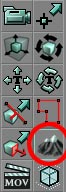

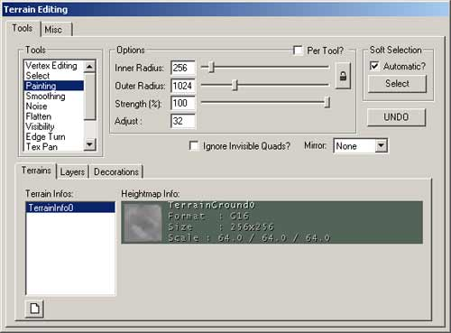This is the Terrain Editor window. From here, press the

button on the bottom left of the window and a "New Terrain" window will pop up.

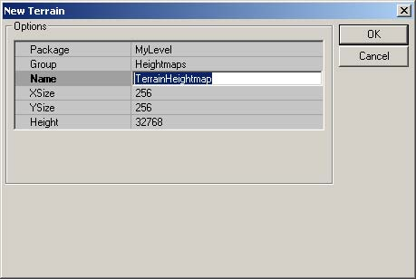

The only setting you need to change is the Name field. You could leave it named "TerrainHeightMap" but it's best to make sure that its name is a unique name to prevent the engine from getting confused or overwriting other textures. The rest of the fields can be left as is, although if you do wish to change any fields, here are some guidelines to follow.

* Package - When creating your own Package, make sure its name is not the same as any other Texture Package OR an StaticMesh Package. If you do create a new package for this, you will need to load that package every time you open the editor and load your level.
* Group - The Group you assign the HeightMap to is not as crucial and can be named pretty much anything.
* Name - Naming the HeightMap a unique name will help to sort out your Terrain from other Terrains you might create and it also helps prevent it from being overwritten or overwriting other textures in its package.
* XSize & YSize - These values determine the size of the HeightMap only, not the actual Terrain itself. Make sure that these are set to powers of 2. For every pixel of the HeightMap a quad is created in the terrain and the darkness of that pixel determines the height of the terrain.
* Height - A solid grayscale value is assigned to the entire Terrain initially, and this value determines what height that color will represent. It's best to leave this number at 32768 since that is directly in the middle of the spectrum of useable values (exactly 1/2 of 2^16).

After you press OK you will see that a TerrainInfo actor appeared in the map, at the position of your camera in the 3D view. Also a texture was created in the package and group you chose, and with the name and size you chose. This texture is the TerrainMap. The following section describes what the TerrainMap is and how it affects the Terrain you see in the level.

### The TerrainMap

The TerrainMap of your terrain is a HeightMap that determines where the terrain is high, where it is low or anything between this. It determines the hills, mountains, canyons, valleys, etc. of your terrain. The TerrainMap is a 16-bit texture, but you can also import 8-bit textures in the editor. When you edit the terrain, you have to convert it to 16-bit then. In the texture you use for the TerrainMap, the black color or the first color in the palette represents the lowest parts of the terrain, and the white color or the last color in the palette the highest parts. Most of the times you will want to import 16-bit or 8-bit grayscale textures for the TerrainMap, but it is possible to use any colored 8-bit palletized texture. Theoretically you can use textures up to 2048\*2048, but a enabling a texture of this size as TerrainMap takes much longer than rebuilding the lighting of a very large map. Most of the times textures with dimensions 256\*256 will do fine.As you already know a TerrainMap was automatically created by the Terrain Editing Tools, and you can see it in the Texture Browser in the MyLevel package, with the Group and Name you gave it. Whenever you paint using the Paint Tool (described in the [EditingTerrainMaps](EditingTerrainMaps.md) Doc) on the TerrainMap, this texture will be updated.Examples: This texture, fading linearly from black to white, will create a mountain with a peak. The texture is created with a brush with hardness 0 in PSP.

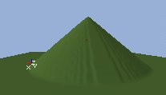This texture, created with a brush with hardness 50, makes a more flat mountain:

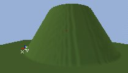If there is no fading in your texture, the faces of the mountain will be vertical:

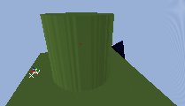Textures like this create very thin peaks, so it looks like grass -although definitely not a good way to create grass:

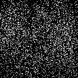

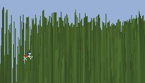What you really want are complicated HeightMap textures, like this one:

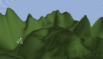

### Adding a Texture

Your Terrain will now need a texture to display on the geometry created by the TerrainMap. Open the Texture Browser and select the texture you want to use for your terrain, for example grass or mud. Go back to the Terrain Editing window and this time select the Layers tab. Once in the Layers tab, select the top most empty layer and press the

button on the right side of the window to create a new layer.

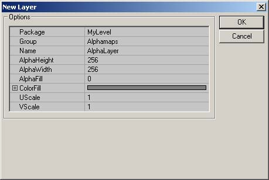

Just as with the TerrainMap, the only field you will really want to change is the Name field. Also, just as with the TerrainMap, you will want to follow the guidelines listed below:

* Package - This should probably be named the same package as the TerrainMap you created earlier since when you want to use one of these textures, you will most likely want to be using the other.
* Group - The Group you assign the HeightMap to is not as crucial and can be named pretty much anything.
* Name - As mentioned above, it is best to give your textures a unique name to prevent the engine from texture overwriting.
* AlphaHeight & AlphaWidth - It is very important to make sure that these values match the dimensions of the texture you are using. Otherwise, the texture may only appear as spots on a regular grid.
* AlphaFill - This determines the transparency of this texture over the layers above it in the Layers stack. The default setting of [0] should work fine (assuming you are using the 2110 build).
* ColorFill - This setting is ignore. In earlier versions of the engine, this could create a color on the Terrain.
* UScale & VScale - These affect the scale of the texture map as it is applied to the Terrain. If you don't get it to look quite right the first time, don't worry. You will be able to easily edit later so that it is an acceptable scale.

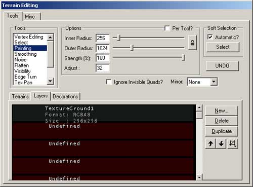

For more information on Layers, see the [EditingTerrainLayers](EditingTerrainLayers.md) Document.

### Rebuilding the Map

You now have all of the basic elements of your Terrain in place, but the Editor still needs to update everything. Simply click on the "Rebuild All" button (

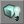

) and the terrain should be visible. It's pretty flat now. If you don't see any terrain, make sure your camera is above the terrain, because normally a terrain is invisible from the down side.

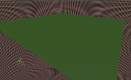

You probably want to see something more interesting, like hills and mountains. This next section will show you how to quickly generate a more interesting landscape (like the one below) using either the entire Terrain, or just a selection of the Terrain

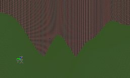

## The Terrain Generator

Another way to quickly generate a random Terrain is through using the Terrain Generator. You can generate an entire terrain or just create a random landscape in an area you have selected. To use this tool, first switch to the Select Tool (you don't necessarily have to use the tool if you want to use the entire Terrain; you just have to have the tool open).

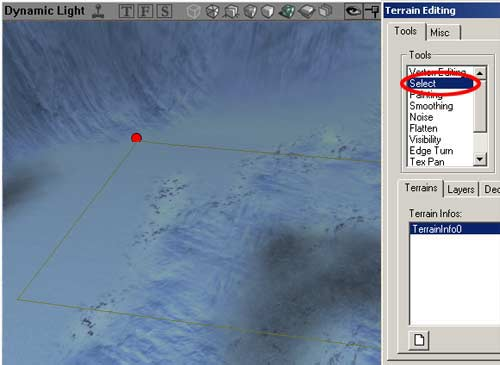

Then open the Misc. tab to access the Terrain Generator.

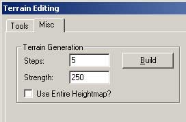

If you press the Build button, random terrain will be generated inside the selection only if "Use Entire Heightmap" is disabled or for the whole terrain if this is enabled.There are two values. `Steps' determines the average height differences that will be created: the screenshot on the left shows a `Steps' value of 50, the one on the right shows a `Steps' value of 5000. Both screenshots are taken with a `Strength' of 250

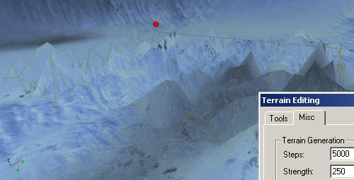

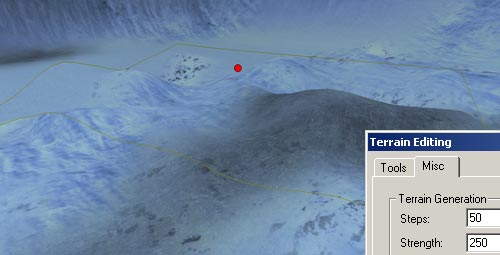The `Strength' value determines the size of the tops: the screenshot on the left shows a `Strength' of 100, the one on the right shows a `Strength' of 1000, so the hills in the second screenshot are 100 times wider than the hills in the first screenshot. Both screenshots are taken with a `Steps' value of 50.

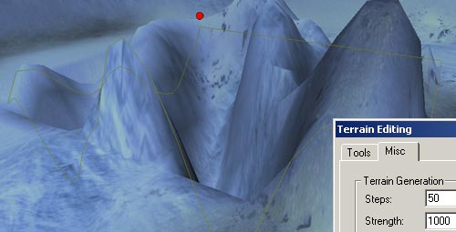

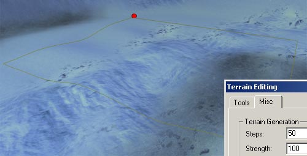There are still some bugs in the Terrain Generator: if you want to do this for the entire HeightMap, it still asks you for a selection, and if you undo this action, the action will only be undone inside the selection, even if you changed the whole HeightMap. Also, the Move Actors with Terrain option doesn't seem to work. After you generated a terrain for the entire HeightMap, all terrains in any map you open might look as if they're full of BSP holes. If you close and reopen the editor, this problem is solved. Another problem is that the generated terrain does not always update after you've hit the build button. To manually update it, switch to the Paint Tool, set the Strength to 1, and then paint the area.

## Other Sections

From here on out you can alter the Terrain in a number of ways. Below are a series of pages that describe the various ways you can manipulate your Terrain.[TerrainTutorial](../Content Creation/Primitives/TerrainTutorial.md) - This outlines all the contents of the following documents. Also, if you add new sections to this document, it is also good practice to update the [TerrainTutorial](../Content Creation/Primitives/TerrainTutorial.md) as well.[EditingTerrainMaps](EditingTerrainMaps.md) - Shows how to use the Terrain Editor Tools.[EditingTerrainLayers](EditingTerrainLayers.md) - Explains how to create and use Layers within your Terrain.[CreatingDecoLayers](CreatingDecoLayers.md) - Shows how to create DecoLayers.[AdditionalTerrainTips](AdditionalTerrainTips.md) - In this document you will find several ways to greatly improve the appearance and effectiveness of your Terrain. If you are learning how to create your first Terrain, this section should **NOT** be over looked.
