# Editing the Terrain Layers

*Document Summary: An introductory document on editing Terrain Layers.**Document Changelog: Last updated by Michiel Hendriks, minor fixes. Previously updated by Jason Lentz (DemiurgeStudios?) to separate into smaller docs. Original author was Lode Vandevenne ([UdnStaff](https://udn.epicgames.com/Main/UdnStaff)).*

* [Editing the Terrain Layers](EditingTerrainLayers.md#editing-the-terrain-layers)
  + [The TerrainInfo](EditingTerrainLayers.md#the-terraininfo)
  + [Layer Hierarchy](EditingTerrainLayers.md#layer-hierarchy)
  + [Layers](EditingTerrainLayers.md#layers)
    - [Creating a New Layer](EditingTerrainLayers.md#creating-a-new-layer)
    - [Layer Properties](EditingTerrainLayers.md#layer-properties)
    - [TextureMapAxis](EditingTerrainLayers.md#texturemapaxis)
  + [Editing the AlphaMaps](EditingTerrainLayers.md#editing-the-alphamaps)
    - [Vertex Editing and Select](EditingTerrainLayers.md#vertex-editing-and-select)
    - [Painting](EditingTerrainLayers.md#painting)
    - [Smoothing](EditingTerrainLayers.md#smoothing)
    - [Noise](EditingTerrainLayers.md#noise)
    - [Flatten](EditingTerrainLayers.md#flatten)
    - [Visibility](EditingTerrainLayers.md#visibility)
    - [Tex Pan, Tex Rotate and Tex Scale](EditingTerrainLayers.md#tex-pan-tex-rotate-and-tex-scale)
  + [Fake DisplacementMaps](EditingTerrainLayers.md#fake-displacementmaps)
  + [Other Sections](EditingTerrainLayers.md#other-sections)

## The TerrainInfo

While the Terrain Editing Tools make it extremely easy to make terrain, you should also know the theory behind it and how it works, and the best way to see how it works is to take a look inside the properties of the terrain. And to work with layers, explained in a later section, some things are only possible in the properties of the TerrainInfo.The most important actor for terrain is the TerrainInfo. The TerrainInfo **IS** the terrain, all the hills and valleys are drawn around it with the TerrainInfo in the center. The Terrain Editing Tools placed a TerrainInfo automatically at the position of your camera in the 3D view when you pressed "New...", but you can also place them yourself, the same way as you placed the ZoneInfo: it's in the Actor Class Browser under Info. A TerrainInfo looks like a small sprite texture with little mountains.

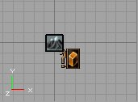

In the properties of a TerrainInfo is set what TerrainMap it has, what Textures and AlphaMaps, what DecoLayers, and some additional settings. If you open the properties of a TerrainMap you created with the Terrain Editing Tools, you'll see some properties are filled in already. You can access the TerrainMap properties by either double clicking on the name of your TerrainMap in the Terrain tab of the Terrain Editor, or you can right-click on the mountain icon in any one of the viewports and select "TerrainInfo Properties" from the top of the list. The properties specific to Terrain are located in the TerrainInfo rollout at the bottom.

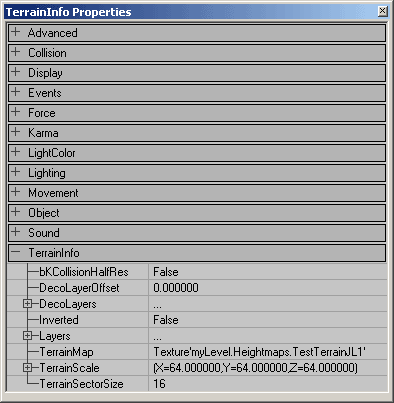

To see the different Layers of the Terrain (AlphaMaps as well as Textures), expand the Layers section under TerrainInfo and it will show you the long list of available slots to add Layers into. You should also have the Layer(s) you've already assigned at the top of this list.

To change it to another texture, first select the texture in the Texture Browser, and then press the little "Use" button that appears in the TerrainInfo Properties on the setting of the Layer you want to replace the corresponding texture..The TerrainMap should be a P8 or G16 texture that is in the MyLevel package, and the AlphaMap should be a RGBA8 texture that is in MyLevel. As you may have noticed, the Terrain Editing Tools had created these textures for you, which is the easiest way, because otherwise you have to create such a texture with a painting program and import it into the Texture Browser.Another thing the Terrain Editing Tools have done is setting a proper scale for the texture: UScale and VScale in the Layer[0] property should not be 0, because a texture with scale 0 is invisible, so set them to 1 or less or more if you want the texture to be smaller or bigger.

## Layer Hierarchy

The Layers use a hierarchy to determine which textures will be drawn above the others. It's somewhat counter-intuitive though as the closer the layer is to the bottom of the contiguous stack, the more towards the top it is drawn on the Terrain. The Layer that is at the top of the stack (Layer [0]) will automatically be given a completely white AlphaMap so that as the base layer it is completely opaque.You can alter the order and appearance of the layers with the buttons on the side of the Terrain Editor when you are in the Layers tab. Here is what each of the following buttons do:

*

Use this button to remove the selected layer
*

This button will make an exact copy of the selected layer
*

These buttons will move the selected layer up or down in the layer hierarchy. The more down a layer is in the list, the more on top it will be on the terrain.
*

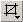

The Grid Options button will allow you to show or hide a grid on any of the layers

You can see an example of Layer Hierarchy in the image below

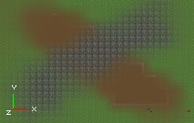

The Base Layer (Layer [0]) is the green grass texture and it is entirely opaque so you can only see it if there are no layers painted above it. Over the green texture, a brown texture is painted on a **\** stroke. This brown texture is on Layer [1], so even though it is lower on the Stack it shows above the green grass. Then on Layer [2], a grey tiled texture is painted in a **/** stroke. Since Layer three is the lowest in the stack of these three Layers, it is drawn on top of all of them.Note that if you used the

buttons to lower the grey tiled texture to Layer [3] and an empty layer was shifted into Layer [2], then the grey tiled texture would no longer be drawn at all. Only the contiguous layers from the top will show up on the Terrain.

## Layers

The terrain you now created has only one layer: Layer[0] with the grass. You can give the terrain up to 32 different layers. Every layer has a Texture and an AlphaMap. The Texture is a tileable pattern for the layer, for example grass, and the AlphaMap is a large alpha channel that determines on what places of the terrain the texture will be present, not present or anything between this. The Texture can be any texture or material, the AlphaMap has to be a RGBA texture. You probably want Layer[0] to have a completely white AlphaMap, otherwise the terrain becomes transparent. Other layers need a white part in the AlphaMap only there where you want their texture to be. For example to create snow tops, use a new layer a snowy Texture, and use an AlphaMap that is black everywhere, except at the places where there are high peaks in your TerrainMap.

### Creating a New Layer

To make new layers, use the Terrain Editing Tools, go to the Layers tab, select the topmost empty layer in the list and use the

button.

Leave package to "MyLevel", as it's much handier to work with because you will probably edit the AlphaMaps quite a lot while building the map and if it isn't in MyLevel you have to save the texture package it's in every time you save your map. MyLevel gets saved automatically inside the map file. Also make sure you give all the AlphaMaps another name, and to make it easy for yourself put then inside the same group.All of the settings in the New Layer dialog are described here:

* Package - It's best to place the AlphaMaps in the MyLevel package. This is a package that is stored in the \*.ut2 file of level itself and not in an \*.utx file you have to save. To place a texture in the MyLevel package, type MyLevel as Package when importing a texture. The reason for this is, when you are going to edit the AlphaMaps later, you are actually changing the texture you used as AlphaMap. If you don't place it in the MyLevel package, you have to save the texture package every time you edited the terrain.
* Group - The Group you assign the HeightMap to is not as crucial and can be named pretty much anything.
* Name - Be sure to use a different AlphaMap for every layer, because if two layers use the same texture and you edit one of them, the other one will be edited too.
* AlphaHeight & AlphaWidth - It is very important to make sure that these values match the dimensions of the texture you are using. Otherwise, the texture may only appear as spots on a regular grid.
* AlphaFill - This determines the transparency of this texture over the layers above it in the Layers stack. The default setting of [0] should work fine (assuming you are using the 2110 build or newer).
* ColorFill - This setting is ignore. In earlier versions of the engine, this could create a color on the Terrain.
* UScale & VScale - These affect the scale of the texture map as it is applied to the Terrain. If you don't get it to look quite right the first time, don't worry. You will be able to easily edit later so that it is an acceptable scale.

### Layer Properties

Once you've created the layer, you can open the properties tab (as described above) and you are able to set the following properties:

* AlphaMap - From here you can assign a different Terrain that this Layer will be assigned to. First you must select the new Terrain's AlphaMap from the Texture Browser and then you select the "Use" button in this field.
* KFriction - Information to be added later.
* KRestitution - Information to be added later.
* LayerRotation - This allows you to project this Layer onto the Terrain in directions other than just straight down. This is useful for painting Textures onto Terrain that is more vertical (like a cliff or a raised cylinder to create a tree out of Terrain) and it won't stretch like it normally would if projected from directly above.
* Texture - After selecting a Texture for the Texture Browser, you can click here and press the "Use" button to assign your chosen Texture to this layer.
* TextureMapAxis - Much like the LayerRotation field, these settings allow you to pick one Axis to project the layer onto. The LayerRotation field is more useful for applying textures at non-regular angles, while this field is useful for quickly setting the Layer to project from a particular Axis. For a more detailed explanation, see the TextureMapAxis section below.
* TextureRotation - this determines the rotation of the grass, dirt, snow or any other texture you used, expressed in degrees.
* UPan and VPan - the panning of the texture
* UScale and VScale - the size of the texture along the X and the Y-axis. These values will be 0 by default, but you better set them to 1 or another value for the best effect.

### TextureMapAxis

For the texture of any layer, you can also determine the axis is used to align the texture. To do this, open the properties of the TerrainInfo, expand TerrainInfo --> Layers and there choose the layer you want. There you can choose your TextureMapAxis for this layer.

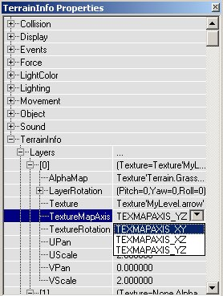

TEXMAPAXIS\_XY will align the texture to the floor. This means if you place your camera above the terrain and look, the texture will look straight. TEXMAPAXIS\_XZ and TEXMAPAXIS\_YZ will align it to the XZ or YZ wall. If it's YZ, it'll look straight when you look to the East or the West direction. If it's XZ, it'll look straight when you look to the North or South direction.Examples: In the first series of screenshots the camera is looking down and the TextureMapAxis is respectively XY, XZ and YZ:

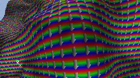

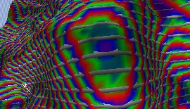

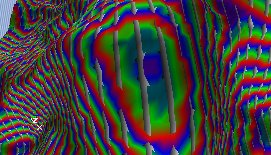

In the second series of screenshots, the camera is looking to the West, and again the TextureMapAxis is respectively XY, XZ and YZ:

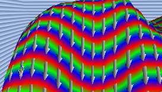

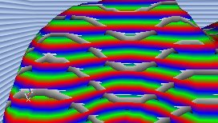

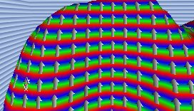

## Editing the AlphaMaps

Until now you used the Terrain Editing Tools to edit the TerrainMap, so you changed the height of the terrain. You can also use them to edit the AlphaMaps for any layer, so you can manually paint dirt paths in the grass, snow, swamps, etc...To do this, select a layer in the Terrain/Layers part of the Terrain Editing Window. Don't select the first layer in the list, because you probably want to keep the 100% white alpha map for it.

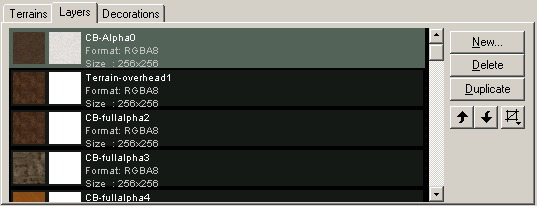

When editing the AlphaMaps, make sure they are in the MyLevel package, or if they are in another package you save that package every time you finished editing the AlphaMaps. You can use the different brushes again for different operations:

### Vertex Editing and Select

These tools will edit the HeightMap of the terrain, even if you have selected a layer in the list. So they do exactly the same as explained in the [CreatingTerrain](CreatingTerrain.md) document.

### Painting

This tool allows you to literally paint on the alpha maps: if you hold CTRL and the left mouse button, and drag over the terrain, you will make the AlphaMap brighter on the spots you touch, so the texture of the selected layer will become more visible. For example you can paint a mud path by editing the layer with the SMud1 texture:

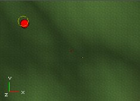

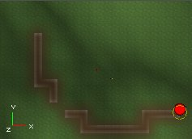As you can see, sometimes there are artifacts that appear on the terrain when you paint on it. You will be able to remove them with the Smoothing Tool. If you paint with the Painting Tool using the right mouse button, you will make the alpha map darker, so the texture of the selected layer will become less visible on the touched parts:

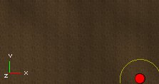

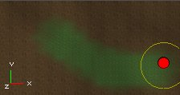The Inner Radius, Outer Radius, Strength and Adjust values again determine the way you will be painting: with a larger or smaller brush, a smoother or sharper brush, and a softer or harder brush.

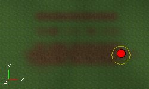

If you paint with the right mouse button on the first layer, layer[0], the terrain will become transparent or invisible on the location of your brush, if there's no other layer above it. Note that this is not the same as the Visibility tool, here the terrain may become invisible, but it's still not able to be passed through.

### Smoothing

If you hold CTRL and click with any mouse button at the alpha map, everything in the radius of the brush will become smoother.

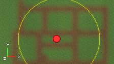

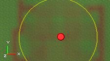If you lower the Strength value, the smoothing effect will be reduced:

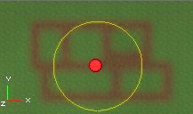

### Noise

With this you can create random patches of the texture inside your brush:

### Flatten

These tools will edit the HeightMap of the terrain, even if you have selected a layer in the list. So they do exactly the same as explained in the [CreatingTerrain](CreatingTerrain.md) document.

### Visibility

Because this tool makes all the layers and the terrain itself invisible/non-solid at the same time, this tool does exactly the same if you use it on any of the layers or on the TerrainMap.

### Tex Pan, Tex Rotate and Tex Scale

These tools don't edit the alpha map, but the alignment of the tiled texture your selected layer uses. The Tex Pan Tool will pan it from left to right if you use CTRL + left mouse, and from up to down if you use CTRL + right mouse button.

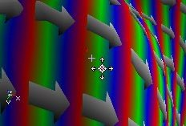

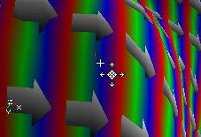The Tex Rotate Tool will rotate it.

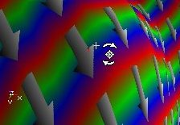The Tex Scale Tool will scale it from left to right with the left mouse button, and up or down with the right mouse button. You can also mirror the texture with it, if you make it very thin and then still keep dragging.

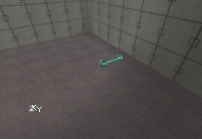

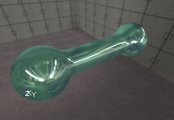

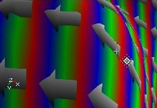

## Fake DisplacementMaps

The terrain is made to be used for outdoor terrains: mountains, deserts, canyons, etc..., but it can also be used to get the effect of DisplacementMaps on a floor. You can for example make a floor with 3-dimensional tiles. On the screens, the effect is a little bit exaggerated to make it clear.

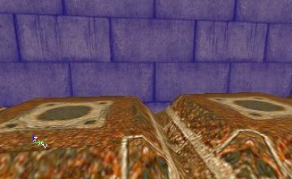

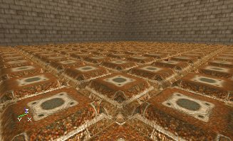If you compare it to a flat floor, a floor with DisplacementMaps looks much better.

To make the effect, a rasterized texture was used for the TerrainMap, every square is one tile. Because every tile has its own place on the texture, you can give individual tiles a separate height, for example to make a broken tile somewhere.

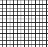

In TerrainScale, the Z should be a very low value, for example 0.05, if you leave the value at 1 the tiles will be 256 units high. Use a floor texture on the terrain, and pan and scale it until it's what you want.The performance of this really isn't bad. However you can only use it for floors, so you can't make brick walls with 3D grooves between the stones. In one of the later builds, there might be added support for real DisplacementMaps or BumpMaps, so it's up to you what to choose.

## Other Sections

[TerrainTutorial](../Content%20Creation/Primitives/TerrainTutorial.md) - This outlines all the contents of the following documents. Also, if you add new sections to this document, it is also good practice to update the [TerrainTutorial](../Content%20Creation/Primitives/TerrainTutorial.md) as well.[CreatingTerrain](CreatingTerrain.md) - This document explains how to create a Terrain starting from an empty level.[EditingTerrainMaps](EditingTerrainMaps.md) - Shows how to use the Terrain Editor Tools.[EditingTerrainLayers](EditingTerrainLayers.md) - Explains how to create and use Layers within your Terrain.[CreatingDecoLayers](CreatingDecoLayers.md) - Shows how to create DecoLayers.[AdditionalTerrainTips](AdditionalTerrainTips.md) - In this document you will find several ways to greatly improve the appearance and effectiveness of your Terrain. If you are learning how to create your first Terrain, this section should **NOT** be over looked.
