# Editing the Terrain Map

*Document Summary: An introductory document on editing Terrain Maps.**Document Changelog: Last updated by Jason Lentz (DemiurgeStudios?) to separate into smaller docs and update for the 2110 build. Original author was Lode Vandevenne ([UdnStaff](https://udn.epicgames.com/Main/UdnStaff)).*

* [Editing the Terrain Map](EditingTerrainMaps.md#editing-the-terrain-map)
  + [Introduction](EditingTerrainMaps.md#introduction)
  + [Editing the TerrainMap](EditingTerrainMaps.md#editing-the-_terrainmap)
    - [Vertex Editing](EditingTerrainMaps.md#vertex-editing)
    - [Select](EditingTerrainMaps.md#select)
    - [Painting](EditingTerrainMaps.md#painting)
    - [Color](EditingTerrainMaps.md#color)
    - [Smoothing](EditingTerrainMaps.md#smoothing)
    - [Noise](EditingTerrainMaps.md#noise)
    - [Flatten](EditingTerrainMaps.md#flatten)
    - [Visibility](EditingTerrainMaps.md#visibility)
    - [Edge Turn](EditingTerrainMaps.md#edge-turn)
    - [Tex Pan, Tex Scale and Tex Rotate](EditingTerrainMaps.md#tex-pan-tex-scale-and-tex-rotate)
  + [Other Sections](EditingTerrainMaps.md#other-sections)

## Introduction

This document shows how to use each of the Terrain Editing Tools to shape and manipulate the Terrain. It assumes you have a basic understanding of the [UnrealEdInterface](../Content Creation/Basics/UnrealEdInterface.md) and that you know how to create a basic Terrain (see the [CreatingTerrain](CreatingTerrain.md) document if not).

## Editing the TerrainMap

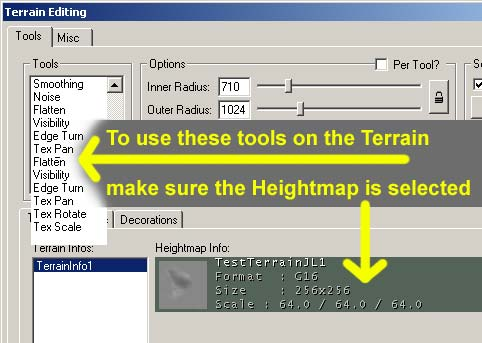

In the part of the Terrain Editing Window select the Terrains tab and make sure the HeightMap is selected (there should be a greenish or grayish color around it), so you will be editing the TerrainMap and not the AlphaChannels of the layers. What follows is an explanation about what every tool does with your terrain, but first make sure the TerrainMap is converted to 16-bit, if it isn't do so by right clicking on it's representation in the window.

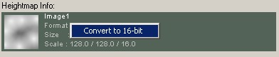

An 8-bit heightmap can create "stair" effects on the terrain, but if it's 16-bit (and after you used the Smooth tool), it's much smoother:

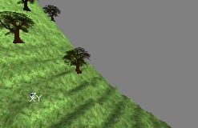

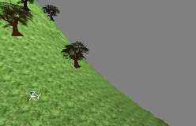

### Vertex Editing

If you select this tool, your mouse cursor becomes two yellow circles with a red dot in the center. The yellow circles represent the brush. In the Terrain Editing Window, you can set 2 radii for it: the Inner Radius and the Outer Radius. The inner part of the brush is the strongest part of it, the outer part is softer. The Strength (%) value determines how strong the brush is, the inner part of the brush will exactly as strong as this value, the outer part will be less strong: the further away from the center, the less strong it is.If you click with any mouse button on the terrain in the Top view or the 3D view, you will select some vertices of the terrain (you may have to try several times...). You can select the vertices with varying strengths, depending on your brush. White vertices are selected the strongest, black vertices are the softest. All the vertices that were inside the inner yellow circle of the brush are white. The ones in the outer circle are the further away from the center, the softer. This will only work when Soft Selection is set to Automatic, so make sure that option is enabled.

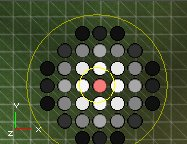

You can change the radius of the inner and outer yellow circles in the Options part of the Terrain Editing window. For example, if you set inner radius to 512 and outer radius to 2048, your brush will look like this:

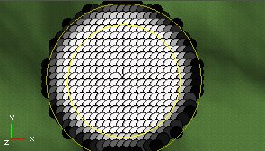

In the Options part, you can also set the Strength of the brush, for example if you set it to 50, your selection will become much softer:

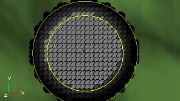

When holding the CTRL key, you can select more places at the same time. However, because of the automatic soft selection every circle you selected before will become larger:

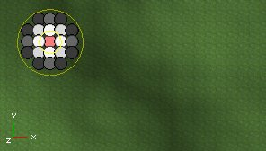

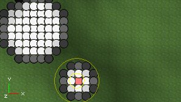

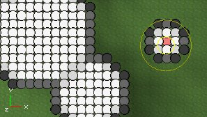

If you disable Automatic Soft Selection in the Soft Selection part of the Terrain Editing Window, you will be selecting only one vertex at the same time, no matter what size your brush has. When holding the CTRL key, you can select multiple vertices, or deselect previously selected ones. The strength of the vertex now depends on the Strength (%) value only:

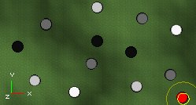

If you now press the Select button in the Soft Selection part, you will get this:

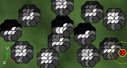

The radius and strength of the parts that are selected by the Select button are determined by the same sliders you use to change the radii of the brush. The target of Soft Selection is to create much smoother hills instead of sharp peaks.The reason why you are selecting the vertices is because you can raise or lower them to create hills or pits on your terrain. After you selected some vertices, hold CTRL and both mouse buttons, and drag the mouse. The white vertices will move up or down much faster than the black or grey vertices. On the first screenshot, "hard"-selected white vertices are moved up, and on the second screenshot soft selected black and grey vertices are moved up, creating a smooth hill.

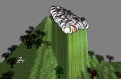

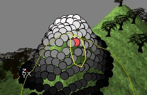When you want to raise or lower the terrain, first press both mouse buttons at the same time and press CTRL only after it. Otherwise the editor thinks you want to extend your selection.Note: if selecting doesn't seem to work so well in the 3D view, try it in the top view: press t to show the terrain there.

### Select

This tool allows you to make a rectangular selection on the terrain. Hold CTRL and left mouse button, and drag the mouse to select.

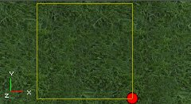

If you drag the box with the right mouse button, one corner of it will automatically be placed in the center of the terrain. You will need a selection like this later, for the Terrain Generator.

### Painting

With the Painting Tool, you can paint on your terrain to raise or lower it. Hold CTRL and left mouse button, and move the mouse over the terrain to raise the terrain on these parts:

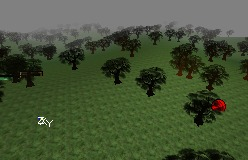

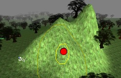If you use the right mouse button instead, you'll lower the terrain:

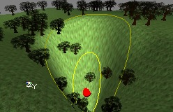

With the Adjust and the Strength (%) options in the Terrain Editing Window, you can make your brush stronger or softer, for example if Adjust is 5 you will have to paint much longer to get the effect you would get if Adjust was 50. The size of the peaks depends on the size of your brush, so that you can determine with the inner and outer radii values.

### Color

This tool can't be used on the TerrainMap, it's for DecoLayers only. For more information see the [CreatingDecoLayers](CreatingDecoLayers.md) document.

### Smoothing

If you hold CTRL and a mouse button, and you move the brush over sharp peaks or stair effects, you will make them much smoother.

Again, the Adjust and Strength (%) option determine how much the effect is present.

### Noise

This tool creates random noise on the terrain, if you drag the brush over it with CTRL and any mouse button pressed. The higher the Adjust value, the more differences in height there will be.

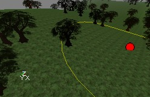

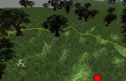

### Flatten

When you press CTRL and a mouse button and start painting, all places you touch with the mouse will get the same height as the place where you started, so you get flat terrain. You can create plateaus if you start at a high point, or canyons if you start at a low point.

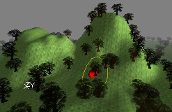

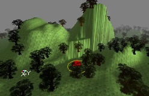

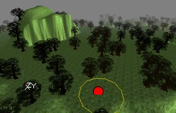

### Visibility

The visibility layer is an extra 1-bit layer: visible or invisible. To make parts of the terrain invisible, use the Visibility Tool. The invisible parts make ALL the layers invisible on that part, and are also non-solid (able to be passed through). The most important use of this feature is if you want the player to be able to go under the terrain, for example a basement or a cavern.Use CTRL+Right mouse button to make the terrain invisible, and CTRL+left mouse button to make the invisible parts visible again.

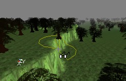

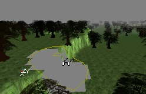The sides of the invisible part get blocky, so you'll have to hide them with normal or hardware brushes. For example if you want to make a cavern in a mountain, you'll have to make a hole in the side of the mountain first, so players are able to walk to the inside of the mountain.

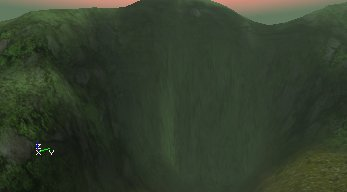

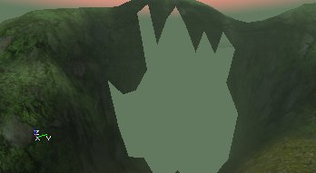Then the player can go under the TerrainMap. You'll need normal brushes, hardware brushes or another terrain for the player to stand on. Also, if you're under the terrain and you look up, you can't see the terrain: the surface of it is one sided, so you need to make walls and a ceiling as well. On this screenshot, a lot of static meshes were added to make a long cave that brings the player to another part of the map, where there's another invisible, non-solid hole in the terrain. The second screenshot shows the view inside the cave to the outside.

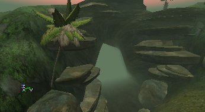

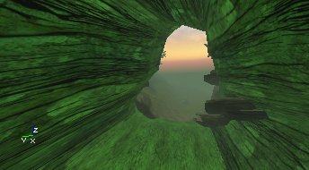

### Edge Turn

This tool is for fine tuning only and should not be used only for finishing touches to the terrain. What it does is to turn the individual triangles within the terrain. Below is an example of how it can be used to smooth out some sharper slopes.

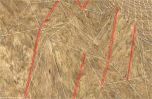

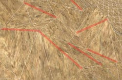Notice how the highlighted edges of the terrain have been turned to create a somewhat smoother terrain. Be aware though that the radius of effect for the Edge Turn tool is not shown, but it can be altered with the Outer Radius slider. It's probably best to slide it down to an Outer Radius = 1 when making these final changes to maximize your control over the tool. Another helpful hint is to make sure than you turn on the terrain grid using the GridOptions button

### Tex Pan, Tex Scale and Tex Rotate

These Tools don't do anything on the TerrainMap, you need them for editing the AlphaMaps.

## Other Sections

To view the other documents on Terrain creation, just click on one of the links below. It is recommended that you read the [EditingTerrainLayers](EditingTerrainLayers.md) next.[TerrainTutorial](../Content Creation/Primitives/TerrainTutorial.md) - This outlines all the contents of the following documents. Also, if you add new sections to this document, it is also good practice to update the [TerrainTutorial](../Content Creation/Primitives/TerrainTutorial.md) as well.[CreatingTerrain](CreatingTerrain.md) - This document explains how to create a Terrain starting from an empty level.[EditingTerrainLayers](EditingTerrainLayers.md) - Explains how to create and use Layers within your Terrain.[CreatingDecoLayers](CreatingDecoLayers.md) - Shows how to create DecoLayers.[AdditionalTerrainTips](AdditionalTerrainTips.md) - In this document you will find several ways to greatly improve the appearance and effectiveness of your Terrain. If you are learning how to create your first Terrain, this section should **NOT** be over looked.
