# Emitters (Examples)

*Document Summary: A tutorial for Emitters showing how to set up various effects using the non UDN Build.**Document Changelog: Last updated by Michiel Hendriks, added notes for v3323. Previous update by Lode Vandevenne ([UdnStaff](https://udn.epicgames.com/Main/UdnStaff)), to update for build 861. Original author was Lode Vandevenne ([UdnStaff](https://udn.epicgames.com/Main/UdnStaff)).*Note: attached to this document are example maps for (old) various versions. Most of the maps work with v3323, but a couple won't load (`PT-Break`, `PR-Storm`, `PT-Weird`) in the latest code drop. This doesn't mean the examples given below don't apply to v3323.

* [Emitters (Examples)](EmittersExamples.md#emitters-examples))
  + [Introduction](EmittersExamples.md#introduction)
  + [Bouncing Balls](EmittersExamples.md#bouncing-balls)
  + [Snow](EmittersExamples.md#snow)
  + [Storm](EmittersExamples.md#storm)
    - [Rain](EmittersExamples.md#rain)
    - [Lightnings](EmittersExamples.md#lightnings)
      * [The lightning that hits the tree](EmittersExamples.md#the-lightning-that-hits-the-tree)
      * [The smoke of the tree](EmittersExamples.md#the-smoke-of-the-tree)
      * [Thunders](EmittersExamples.md#thunders)
  + [Waterfall](EmittersExamples.md#waterfall)
    - [The Waterfall](EmittersExamples.md#the-waterfall)
    - [The Mist](EmittersExamples.md#the-mist)
  + [Fire](EmittersExamples.md#fire)
    - [The Torches](EmittersExamples.md#the-torches)
    - [The Big Fire](EmittersExamples.md#the-big-fire)
    - [The Smoke](EmittersExamples.md#the-smoke)
    - [The Sparks](EmittersExamples.md#the-sparks)
    - [Lighting](EmittersExamples.md#lighting)
  + [SpotLights](EmittersExamples.md#spotlights)
  + [Breaking Glass](EmittersExamples.md#breaking-glass)
  + [Electricity](EmittersExamples.md#electricity)
  + [Fountain](EmittersExamples.md#fountain)
    - [The Fountain](EmittersExamples.md#the-fountain)
    - [The Waterrings](EmittersExamples.md#the-waterrings)
    - [Weird](EmittersExamples.md#weird)

## Introduction

This tutorial is an addition to the [EmittersReference](../Content Creation/Effects/EmittersReference.md), and has to offer some example maps with a description. Each example map has one or more Emitters, showing some of the possibilities of the Particle System. The maps are kept as simple as possible, and all the textures, sounds and static meshes are stored in the MyLevel package, so you should be able to open the maps even if you don't have Epic's demo content installed.The download links of the maps are at the bottom of the page, and each map is available for different versions of the Unreal engine.In the descriptions, there is a list of the properties that are changed to create the described effect with the Emitter, with some remarks and screenshots. All the properties that are not listed, are left at their default value, this is the value they should get when you add a new ParticleEmitter in a clean [CodeDrop739](https://udn.epicgames.com/Two/CodeDrop739).To open a map in the game, for example the map PT-Bounce.unr type in the console: open pt-bounce.

## Bouncing Balls

Map: `PT-Bounce`

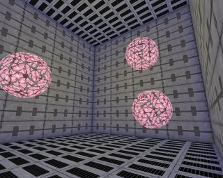

In this map is a MeshEmitter that emits balls.The StaticMesh is just a textured sphere, and the `StartSizeRange` = 0.5 (if you leave this at the default value of 100, the Static Mesh will be 100 times as bigger than it's supposed to, so it'll probably be so big that you can't see it).In `Acceleration` Z = -500, and in `Velocity` X(Min) = -1000, X(Max) = 1000, Y(Min) = -1000, Y(Max) = 1000. This is to give the particles some random velocity.`MaxParticles` = 3, so there will be 3 balls, and `LifeTimeRange` = 200, you can enjoy them long enough. In Spawning, `AutomaticInitialSpawning` = False and `InitialParticlesPerSecond` = 3, so all the balls will be spawned in the first second.To make the balls cooler, you can make thm spin around: in Rotation set `SpinParticles` = True, and in `SpinsPerSecondRange` X(Min) = 0.5, X(Max) = 1, Y(Min) = 0.5, Y(max) = 1. To make them translucent, in Mesh, `UseMeshBlendMode` = False and in Texture, `DrawStyle` = `PTDS_Translucent` .For the collision, set `UseCollision` to True. This makes the balls to bounce on any solid surface or actor, even on your own head. In `DampingFactorRange` all the values are left at 1, so the balls will keep bouncing forever.That's it already! It's very easy to make bouncing things.

## Snow

Map: `PT-Snow`To make snow in your map, first place an SpriteEmitter on a certain height and in the center of your map. The lower you place it, from the lower the flakes will start to fall, but also the better performance there'll be: there have to be drawn less flakes then.

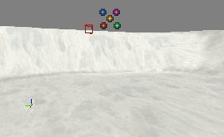

In the example map, it was given the following properties:`StartVelocityRang` -> Z(Min) = -300 and Z(Max) = -200: this makes the flakes slowly fall down with a random speed.`StartLocationRange` -> X(Min), X(Max), Y(Min) and Y(Max): what values you use depends on the size of your map, or the size of the place with snow in your map. The example map is a 16384\*16384 square, so to fill this completely with snow X(Min) = -8192, X(Max) = 8192, Y(Min) = -8192 and Y(Max) = 8192.Set `MaxParticles` to a high number, depending on the size of the map and the number of flakes you want. In the example map, it's set to 10000. The higher the number, the more flakes there will be, but also the less performance there'll be. In fact this is the only weak point of the snow system: you can't make a lot of flakes without reducing the performance a LOT.`StartSizeRange` -> X(Min) = X(Max) = 20: this makes the flakes small enough, at the default values of 100, the flakes are more like big snowballs. You might need to set this to 5 if you don't use a special "whirl" texture (see below)`LifeTime` : choose the LifeTime this way that the flakes will die at the moment they hit the ground, not sooner and not later. This depends on the height of the Emitter and the velocity of the flakes.You now already have flakes falling down, only they don't have a good texture yet (look! it's snowing five-colored-dot-textures!).

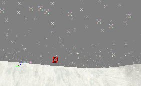

Also, these flakes are falling down in a straight line. Snow is supposed to whirl a bit while falling down. To get this effect, make a texture like this for the flakes:

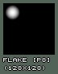

The whole texture is black, and there is a small white flake in a corner of it. The reason for this is: if you let this texture spin around it's center while it's falling down, it'll look like a flake that is whirling. So first apply this texture to the SpriteEmitter in Texture.Then in Rotation set `SpinParticles` to True, and in `SpinsPerSecondRange` set X(Min) to 0.5 and X(Max) to 0.75. Also, set `DampRotation` to True and in `RotationDampingFactorRange` everything to 0. This is because if you use collision for the flakes to lie on the ground, they'll really lie still instead of rotating.

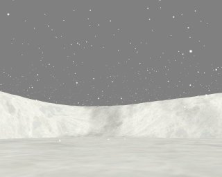

An alternative way to use instead of the spin could be to attach the Emitter to a looping mover that moves all the time. You'd need two or more Emitters then, all moving in a different way, otherwise all flakes would do the same.If you have buildings on the terrain, the snow will go through the roof! The solution is to use collision: set `UseCollision` to True, and in `DampingFactorRange` set everything to 0 so the flakes will lie still on the ground or roof for a short time.

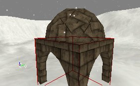

You'll find the performance isn't great, and if you want more snow or a larger map filled with snow, the performance will drop dramaticly. Here are some tips:Always make sure there are no flakes falling through the ground: make sure they die at the moment they hit the ground. All the particles under the ground can't be seen by the player and are only taking system-resources. Make their LifeTime short enough, but not too short or they'll die in the air already. If you use a random falling speed, you'll have to choose between some of the flakes disappearing in the air already, or some flakes in the ground.You can try to put more than one flake on the texture for the particles. However, this might not help at all, because there still has to be drawn as much, and it's not the number of particles that determinates the performance, but the total size of all the not masked parts of the particles together.If you put the Emitter lower, the particles will get created lower, so in the higher parts of the map (where the player will never come, except if he can fly), there don't have to be flakes. This way, there are less particles in the map.
You could make the Emitter to follow the player somehow. Then there are only particles at the location of the player, who can't see the far away particles anyway.If there are several parts in your map, and one part can't be seen from the other, use a different Emitter for each part, and make sure the Emitters get inactive when the player doesn't look at them (you can do this with the Tick properties).
There are also other ways to make snow, without particles (for example nonsolid sheet brushes with a panning and waving flake texture), but this doesn't look as good.If you have an outdoor part in your map that is not too big, or you have several smaller outdoor parts, or just want the snow to go through a hole in a roof, the best way to make very cool looking 3D-snow is to use the particle system.
You can of course also use texture like this for the flakes:

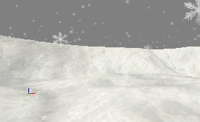

## Storm

Map: `PR-Storm` (doesn't load in v3323)

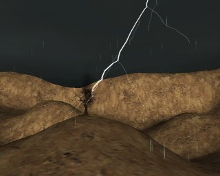

This map has got rain, lightnings and a tree with smoke that gets hit by a lightning. There's also fog and thundersounds. The lightnings are done with [BeamEmitters](BeamEmitter.md), it's up to you if you like these lightnings or not.

### Rain

The rain is somewhat similar to the snow, but the particles go much faster. Again add a SpriteEmitter at a certain height and in the center of the map. In `Velocity` -> set Z(Min) and Z(Max) to -10000. in Location -> `StartVelocityRange`, set the values the same way as for the Snow. Because the Velocity is so fast, the `LifeTimeRange` can be very short (depending on the height of the Emitter), in the example map it's 0.2.Set the Texture to something like the picture below. You have to place the drop upside down, otherwise it'll look wrong later.

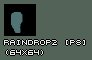

You'll find that putting more than one drops on one texture to get more drops on one particle doesn't help the performance at all, because then you have a larger texture. In the example map, `MaxParticles` in General is set to 2000, and such a few particles works quite well in this 16384\*16384 map, and the performance is very good.In Sprite set `UseDirectionAs` to `PTDU_Up` : otherwise the raindrops will rotate if you look up and then they look like horizontal stripes falling down. With `PTDU_Up`, the raindrops will be always vertical.In Size -> `StartSizeRange` set X(Min) and X(Max) to 3, and set Y(Min) and Y(Max) to 50. This way the raindrops will be long and thin, so they look like really fast falling rain.

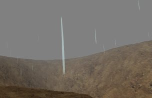

For better performance, the same can be said as for the Snow.

### Lightnings

The lightnings in this map are done with a [BeamEmitter](BeamEmitter.md) with `BeamNoise` and `BeamBranching` to get random shapes for the lightnings.Add an [BeamEmitter](BeamEmitter.md) in the center of the map, as high as possible but still inside the nonsolid area. Inside this Emitter, add two BeamEmitters (one for the main beam and one for the branches) and one SpriteEmitter (for the lighting effect).Both the BeamEmitters have the texture on the screenshot, and `DrawStyle` = `DSPT_Brighten` (this might not work in 777). It could also work with a completely white texture, but with a texture like the screenshot the edges will look mush softer.

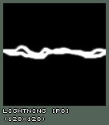

Then for the first beam only ([BeamEmitter](BeamEmitter.md)[0]), set in Beam: `BeamDistance` = 4000, `DeterminateEndPointBy` = `PTEP_TraceOffSet` , and in Velocity --> `StartVelocityRange` set Z = -1. This makes the lightning go straight to the bottom, and assuming the Emitter actor is placed less high than 4000 units above the ground, the endpoint of the lightning will alwasy be on the ground because DeterminateEndPointBy is set to .In `BeamNoise` set for example 30 `HighFrequencePoints` and 10 `LowFrequencyPoints` , and in `HighFrequencyNoiseRange` X(Min) and Y(Min) = -50, X(Max) and Y(Max) = 50, and in `LowFrequencyNoiseRange` X(Min) and Y(Min) = -200 and X(Min) and Y(Max) = 200. At least there have to be enough `FrequencyPoints` for the branches to get spawned.In Color set `UseColorScale` to True and inside `ColorScale` add a black color with `RelativeTime` = 0 and a white color with `RelativeTime` = 1, and set `ColorScaleRepeats` for example to 3.In Local set `bRespawnDeadParticles` to False, in Spawning set `AutomaticInitialSpawning` to False and set `InitialParitclesPerSecond` to 2. In General set `MaxParticles` to 2 and in Time set `LifeTimeRange` Min and Max to 0.5. This combination of settings spawns a lightning that lives for 0.5 seconds and then it spawns a second lightning that also lives 0.5 seconds, so in total there's one lightning that lives for 1 second and changes it's shape after 0.5 seconds.In `BeamBranching` set `UseBranching` and `LinkUpLifetime` to True, `BranchEmitter` = 1 (first make sure that BeamEmitter[1] is the one you'll use for the branches). In `BranchProbability` set Min = 0 and Max = 1, and in `BranchSpawnAmountRange` Min = 1 and max = 2.Then, in the settings of BeamEmitter[1] in Beam set in `BeamDistance` for example Min = 500 and Max = 1000, `DeterminateEndPointBy` to `PTEP_Distance` and in Velocity -> `StartVelocityRange` X(Min), Y(Min) and Z(Min) = -1 and X(Max), Y(Max) and Z(Max) to 1. This makes the branches to go in random directions. In Size -> `StartSizeRange` set it to 30, so the branches are much more thin than the main beam.In BeamNoise they have 10 `HighFrequencyPoints` and 5 `LowFrequencyPoints`, with in `HighFrequencyNoiseRange` X and Y(Min) = -20 and X and Y(Max) = 20 and in `LowFrequencyRange` X and Y(Min) = -100 and X and Y(Max) = 100. In Color they have exactly the same `ColorScale` as the main beam.Again set `bRespawnDeadParticles` and `AutomaticIinitialSpawning` to False, and in General set `MaxParticles` to the number of branches you want, for example 20.For a lighting effect on the clouds, use a [SpriteEmitter](https://udn.epicgames.com/Two/SpriteEmitter) inside the same emitter with a texture like this:


Again set `bRespawnDeadParticles` and `AutomaticInitialSpawning` to False. In General set `MaxParticles` to 1, in Time set `LifeTimeRange` to 1, and in Color give it the same `ColorScale` as the lightning, but set `ColorScaleRepeats` to 6 instead of 3 because this particle will live double as long as one lightningparticle.In Sprite set `UseDirectionAs` to `PTDU_Normal`, and in the `ProjectionNormal` make sure Z = 1. Set the size of the texture for example to 1500 in X and Y direction.Finally, to give the lightnings a random location, set in the Global settings of the Emitter `AutoReset` = True, and in `GlobalOffsetRange` enter for example X(Min) and Y(Min) = -5000 and X(Max) and Y(Max) = 5000, but this depends on the size of your map. You can also use `TimeTillResetRange` , for example Min = 1 and Max = 2, to get some waiting time between two lightnings.

#### The lightning that hits the tree

This emitter is exactly the same as the one used for the regular lightnings, except for it's BeamEndPoint: `DeterminateEndPointBy` is set to `PTEP_Actor` , and there's added a BeamEndPoint with in `ActorTag` the `Tag` of the tree.

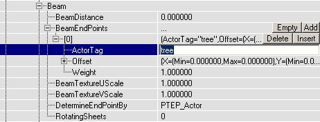

Also, in Global the `GlobalOffsetRange` is more subtle than for the other emitter, so the lightning will start more in the neighbourhood of the tree.

#### The smoke of the tree

Because the tree is hit by a lightning, it's a little burned and smoking. This smoke is actually almost the same as the smoke for the fire, only a little bit smaller, so I suggest you check it out at the end of the section Fire.


#### Thunders

The thundersound was done with 2 TimedTriggers?, each triggering a SpecialEvent. These SpecialEvents have a thundersound, and have bPlayersPlaySoundEffect to True, so the sound will always be played, no matter how far away you are from the SpecialEvent. Each TimedTrigger is set to bRepeating, and the DelaySeconds different for both the TimedTriggers?, so there will be some variation.Note: v3323 doesn't have TimedTriggers nor SpecialEvent triggers, you will have to use an other method to achieve the same result.

## Waterfall

Map: `PT-Falls`

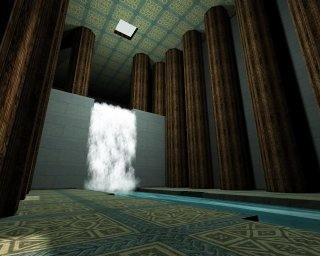

In the examplemap, there are 2 emitters: one for the actual waterfall, and one for the mist at the bottom of the waterfall.

### The Waterfall

For the waterfall itself, add a SpriteEmitter on top of what will become the waterfall, and there place it in the center between the two banks.


Give the SpriteEmitter a texture similar to this one

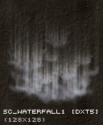

In Sprite set `UseDirectionAs` to `PTDU_Up`, so the texture will always be aimed towards the ground, no matter how you rotate the camera.In Size -> `StartSizeRange` set the Y values to something larger than 100, for example Y(Min) = 200 and Y(Max) = 400, the waterfall will look much better if the texture is stretched in the Y direction.In the properties of the Emitter actor itself, in Advanced, set `bDirectional` to True, so it gets an arrow in the editor. Use the Rotation Tool (with right mouse button) to rotate the Emitter until the arrow points towards the direction the river is going to. Otherwise you'll have to use correct X �nd Y values for both Velocity and StartLocationRange?, but when the arrow points towards this direction the X axis of the Emitter becomes the direction of the river. Then in Rotation set `UseRotationFrom` to `PTRS_Actor` , only then the axes will be rotated by the this.

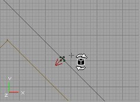

Now, in Location -> `StartLocationRange` set Y(Min) to -## and Y(Max) to +##, and choose ## this way that the waterfall has the same width as the river. Then enter a negative Z value in Acceleration (-900 is close to real gravity) and a positive X value in Velocity -> `StartVelocityRange` , so that the waterfall has the shape you want, for example the same shape as the wall or mountain. Then, make the `LifeTime` in Time so that the waterfall ends exactly at the moment it hits the low river, and set in Genaral `MaxParticles` high enough to get enough particles for your waterfall. In the example map this is 200. All of this depends on the length, the width, the speed, etc... of your waterfall.


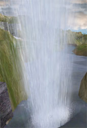If necessary, you can try to hide the end of the upper river as much as possible with the waterfall.


### The Mist

For the mist, add another [SpriteEmitter](https://udn.epicgames.com/Two/SpriteEmitter), at the bottom of the waterfall. Give it a texture like the first picture below. This texture is a very dark version of the second picture. It's very dark, but many of them together will look brighter.

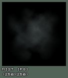

In Location -> `StartLocationRange` , add in Y(Min) and Y(Max) the same values as you entered in the SpriteEmitter for the waterfall, and also give a different X(Min) and X(Max) value to give the mist some volume. In Velocity -> `StartVelocityRange` set Z(Min) and Z(Max) to something around +150 to make the mist slowly rise. Set `LifeTime` to 3, or more if you want the mist to rise higher. Set `MaxParticles` so that the mist looks bright enough, this depends on the size of your mist. In the examplemap it's 150.To make the effect look cooler, you can make the texture spin, so in Rotation set `SpinParticles` to True and set in `SpinsPerSecondRange` the X values for example to something around 0.5. In the example map X(Min) = 0 and X(Max) = 0.5.Also, in `StartSizeRange` set X(Min) to 100 and X(Max) to 200, this way the particles have random sizes, and otherwise they're too small.You can also make it to `FadeOut` at the end if you think that looks better.


This example map shows a waterfall inside a building. CraterRiver23.unr is a map with a very cool outdoor waterfall.

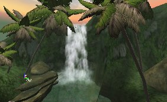

## Fire

Map: `PT-Fire`

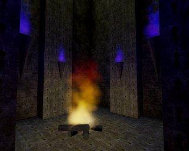

You can make a fire with only one ParticleEmitter?, but the bigger and better fires easily require 3 or more s (which you can put all in the same Emitter): one for the smoke, one for sparks, and then one or more for the flames. The big fire in the example map has 4 PraticleEmitters?, and the lighting is done with classic Light actors. There are also some torches on the wall, but these have only one.

### The Torches

Let's start with the torches, they are the easiest to make. First add a SpriteEmitter on top of a torch brush:

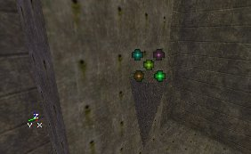

Give it a texture like the first picture. Flames work pretty well with almost any texture that you make by some dots with a very soft brush in PSP or PhotoShop?, and this same texture is also used for the big fire and the smoke of it. It's a very dark texture, the second picture shows the same texture if it would have been bright. Many of these dark texture together will create a good looking volumetric flame for the torch.

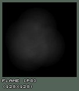

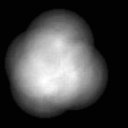Set the following properties: `StartSizeRange` Min and Max = 20, `MaxParticles` = 50, `LifeTimeRange` Min and Max = 1, `StartVelocity` -> Z(Min) and Z(Max) = 100, or use other values depending on the size of your torch.

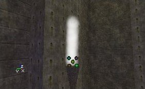

To make it look more like a flame, add a `SizeScale` to it: set `UseSizeScale` to True, `UseRegularSizeScale` to False, and add a new `SizeScale` with `RelativeSize` = 0 and `RelativeTime` = 1. Then, to make the top of the flame look better, set `FadeOut` to True and leave `FadeOutStartTime` at 0.

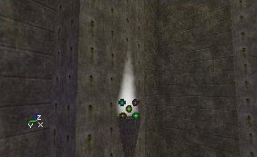

If you now set in =StartLocationRang=e X(Min) = -10, X(Max) = +10, Y(Min) = -10 and Y(Max) = +10, it'll look like this:

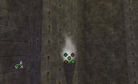

To give the flames a color, use a `ColorScale` like this. The 5 `ColorScaleRepeats` were necessary to get the purple visible enough despite the FadeOut.

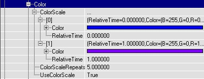

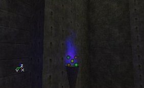To get more torches with this same flame, duplicate the Emitter a few times:

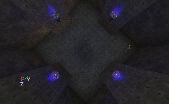

### The Big Fire

For the big fire, there is one Emitter with 4 ParticleEmitters in it:

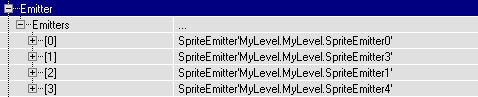

One for the smoke, one for the sparks, and two for the flames. The first flame looks like the first screenshot, the second one looks like the second screenshot, and together, they look like the 3th screenshot.

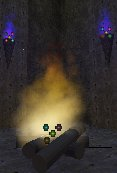

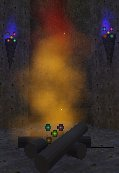

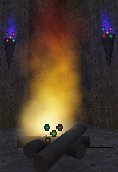

The first flame has the following properties:In Color, a ColorScale like this:


`FadeOut` = True, `FadeOutStartTime` = 0, `MaxParticles` = 150, `StartLocationRange` --> X(Min) = -30, X(Max) = 30, Y(Min) = -30, Y(Max) = 30. `StartSizeRange` --> X(Min) = 30, X(Max) = 30, and a `SizeScale` like this:

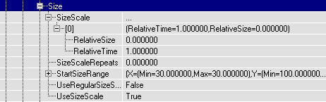

The Texture is the same as for the torches, `LifeTimeRange` -> X(Min) = X(Max) = 1.5, `StartVelocityRange` --> X(Min) = 100, X(Max) = 100.For the second flame:In Color, it has a ColorScale like this:


So actually, it has the same color all the time, but because it has a `FadeOut`, the color of the flame will change anyway: the red channel will be faded out the last (because there is more red than anything else in the color), so at the end the flame is red.`FadeOut` = True, `FadeOutStartTime` = 0, `MaxParticles` = 50, `StartLocationRange` -> X(Min) = -30, X(Max) = 30, Y(Min) = -30, Y(Max) = 30. `StartSizeRange` -> X(Min) = 30, X(Max) = 30. This flame has no `SizeScale`.`LifeTimeRange` -> X(Min) = X(Max) = 2, `StartVelocityRange` -> X(Min) = 100, X(Max) = 100, and again the same Texture was used.

### The Smoke

The smoke is very similar to the flames, only the `SizeScale` makes it become larger instead of smaller, and the color is different.In the example map, it has the following properties:`FadeIn` = True, `FadeInEndTime` = 1, `FadeOut` = True, `FadeOutStartTime` = 4, `MaxParticles` = 30, `StartLocationRange` -> X(Min) = -50, X(Max) = 50, Y(Min) = -50, Y(Max) = 50, `SpinParticles` = True, `SpinsPerSecondRange` -> X(Min) = 0, X(Max) = 0.5. In Size -> `StartSizeRange` -> X(Min) = 20 and X(Max) = 20, and it has a `SizeScale` as the screenshot: with a `RelativeSize` of 10.


It has again the same Texture as the flames and the torches, and the `DrawStyle` of the Texture is set to `PTDS_Darken` : this makes the smoke black. `LifeTimeRange` = 6, and `Velocity` -> Z(Min) = Z(Max) = 200. Because of the long `LifeTime` the smoke gets quite high, so it can disappear into the hole that's made in the roof.

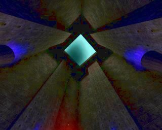

### The Sparks

This is the 4th and last SpriteEmitter inside of this Emitter, and it creates sparks: small burning dots jumping into the air.It has an `Acceleration` of Z = -1000, to make the sparks fall down again a bit at the moment they die, and it has a colorscale like this:

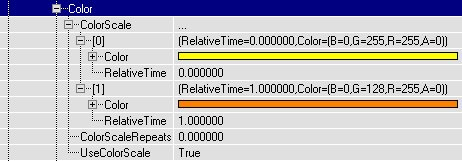

`FadeOut` = True to make the sparks slowly burn out at the end. `MaxParticles` = 8, more isn't really necessary, in a real fire there aren't too much sparks either. `StartLocationRange` -> X(Min) = -20, X(Max) = 20, Y(Min) = -20, Y(Max) = 20. For the Texture, a small sharp irregular circle shape was used, and it has a `StartSizeRange` of 1 to make the sparks small enough.


Also, `DrawStyle` = `PTDS_Brighten` to make them a little brighter. `LifeTimeRange` = 2. `StartVelocityRange` -> X(Min) = -100, X(Max) = 100, Y(Min) = -100, Y(Max) = 100, Z(Min) = 500, Z(Max) = 600.

### Lighting

There were also added some lighting effects for the fire and the torches: the torches have small, blue lights with `LightEffect` LE\_TorchWaver, and the fire has a big yellow light with `LightEffect` `LE_FireWaver`. There are no Light actors added for this, but instead the Emitters were made to give light: in the Emitter properties -> Lighting set `LightType` to `LT_Steady`, give a `LightRadius` , and in `LightColor` give a color and the Emitter itself will give the light.
The light effect `LE_FireWaver` is obsolete in v3323, you can switch to using projectors or be creative with different light types and effects.

## SpotLights

Map: `PT-Light`


In this map, each spot uses an Emitter with the `LightEffect` =LE\_SpotLight, and with a SpriteEmitter to create a volumetric lighting effect.First add one Emitter, open it's properties and in Advanced set `bDirectional` to True. Then rotate it with the Rotation Tool, so that the arrow points towards the diretion where the spotlight will shine to.


You need this rotation for two things: the `LightEffect` `LE_SpotLight` needs it to determinate the direction of the spotlight, and for the `SpriteEmitter` to make it easier to determinate the direction the particles will go to.Add a SpriteEmitter in the Emitter, and give it a texture like the first picture. It's a very dark version of the second picture: many of these dark textures together make a very smooth lightcone.


This Texture is white, so you can use it for any color of SpotLight: just give it a `ColorScale`. For example for a green light do it like this:

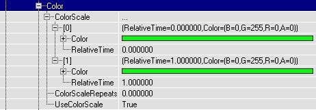

As you can see, Color[0] and Color[1] are the same: now the particles will have this color from the beginning till the end of their `LifeTime`.`FadeOut` = True and `FadeOutStartTime` = 0 to make the Volumetric Lighting softly disappear at the end. `MaxParticles` = 20 (this depends on the size of your SpotLight), `StartSizeRange` -> X(Min) and X(Max) = 50 (also this depends on the size of your SpotLight). In Rotation set `UseRotationFrom` to `PTRS_Actor`, so the axes will be rotated by the rotation of the Emitter actor. This is very important: otherwise it's very diffucult to set the correct direction of the Velocity. Give it a `SizeScale` like this:


This `SizeScale` makes the particles grow while they move forward, to create a LightCone. If they wouldn't grow, you'd get a lightcylinder. `LifeTimeRange` = 2, but again this depends on the size of your SpotLight. `StartVelocityRange` -> X(Min) and X(Max) = 100. Because `UseRotationFrom` = `PTRS_Actor` and you rotated the Emitter into the correct direction, the particles shouls now move with the direction of the SpotLight and make a nice LightCone.


For the Lighting effect: open the properties of the Emitter, go to Lighting -> `LightColor` and give the light the same color as the color of the `ColorScale` for the particles. Then go to Lighting and set `LightType` to `LT_Steady`, `LightEffect` to `LE_SpotLight` , `LightRadius` to 128, or something else depending on your map. Then also set `LightCone` to 64, or again more or less depending on the size of the `LightEffect` you want: the higher this value, the larger the light on the floor will be. For example on the first screenshot `LightCone` is 13, and on the second screenshot it's 255. You'll have to look what looks best compared to the size of the volumetric lighting effect.


To get the effect for more than one light with different colors and different directions, duplicate the Emitter and give the new ones the color and direction you want.

## Breaking Glass

Map: `PT-Break` (739 version does load, but has missing content)


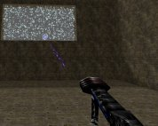


In this map is a mover that represents a window, and when you shoot it the mover moves away and at the same time triggers a spawn thing that spawns a BreakingGlassEmitter. This BreakingGlassEmitter is nothing more than a SpriteEmitter with some properties set. Here the whole window explodes when you shoot it, but if you want only the part you shoot to break, just make the window out of different movers, all with their own spawner etc...There's no weapon in the map, but if you type loaded in the console you should get some so you can shoot the window.To begin add a SpriteEmitter in the center of the window. Later you'll add the thing that spawns the BreakingGlassEmitter here, but it's easier to do it with an Emitter now so you can preview in the editor what you're doing. Open the properties of the SpriteEmitter.In the example map, a `SubdivisionScale` is used for the Texture. The texture has 2 \* 2 Subdivisions:


So `TextureUSubdivisions` and `TextureVSubdivisions` are set to 2, and `UseRandomSubdivision` = True. Now the fragments will not all look the same. For multicolored windows, you can use this to give the fragments different colors. Also, in `StartSizeRange` -> X(Min) = 1 and X(Max) = 10, so you have variating sizes.For the movement of the fragments, Acceleration and Velocity is used. For the directions and axes, to get your window working the same way as this example, set `bDirectional` to true in advanced and rotate until the arrow points towards the direction you want the fragments to go to, and set `UseRotationFrom` to `PTRS_Actor` .Accelaration -> Z = -950, to make the fragments fall down. `StartVelocityRange` -> X(Min) = -20, X(Max) = 200. This makes all the fragments fall to one side of the window, if you want them to fall to the other side as well, make X(Min) = -200. The higher this Velocity the more the fragments will be blasted forward, so if there happens a big explosion inside a building you could give the fragments a much higher speed. `StartVelocityRange` -> Y(Min) = -100, Y(Max) = 100: this makes the fragments fall a little further than the sides too, otherwise they will form the shape of a boring rectangle on the ground.For the spawning of the particles: there have to be a lot of particles, and they have to be spawned all together at almost the same time, inside of the window. After that, no new particles may appear anymore. To get this, `MaxParticles` = 5000, but you'll need more if you have a larger window. Because the particles are so small, this won't cost too much performance.`StartLocationRange` -> Y(Min) = -256, Y(Max) = 256, Z(Min) = -128, Z(Max) = 128, assuming you have a 512\*256 window and the Emitter is in the center of it.In Spawning `AutomaticInitialSpawning` = False, `InitialParticlesPerSecond` = 50000 and `ParticlesParSecond` = 0. Now the SpriteEmitter wants to create 50000 particles in one second, but because `MaxParticles` = 10000, only 10000 particles will be created, and this after 0.2 seconds, so it looks like all the particles get spawned at the same time.`LifeTime` = 10000000, `RespawnDeadParticles` = False and in the Global settings of the Emitter `bAutoDestroy` = True. Now the particles will live for 10000000 seconds, and after that they die, they don't get respawned and the Emitter actor gets destroyed. Actually the last things will never happen because if the player wants to wait for 10000000 seconds, that'll cost him 115 days. However if you give a `LifeTime` of for example 20 seconds, the fragments disappear after a while and you gain performance.Set Collision to True for bouncing fragments that will stay on the ground (otherwise they fall through the floor). Give ALL the X, Y and Z values in `DampingFactorRange` a number lower than 1, because the particles have got Velocity or Acceleration in ALL of these directions, and otherwise they stay moving forever! It works great when X(Min) = 0.8, X(Max) = 0.9, Y(Min) and Y(Max) = 0.5, Z(Min) = 0.2, Z(Max) = 0.3.Now you have an Emitter that will emit fragments when you open the map, and after that never anymore. If you want to spawn this Emitter with all these properties at the moment the player shoots the window, make a new subclass of Emitter, with for example the name "BreakingGlassEmitter", do NOT add this class in the map, but instead open it's Default Properties in the Actor Class Browser. These Default Properties are the ones that will be used when the BreakingGlassEmitter is spawned, so you have to copy the properties of the Emitter you just made (the one you placed in the window) into this one.The easiest way to do this, is first open the properties of the Emitter inside the window, and copy the name of the SpriteEmitter. Then paste this name into the Default Properties of the BreakingGlassEmitter class, and it should get all the properties you gave the Emitter in the window.


Also, give the BreakingGlassEmitter the same Global settings, and in Movement the same Rotation as you gave the Emitter in the window. You can now delete the Emitter in the window, and place a ThingFactory instead that will spawn the BreakingGlassEmitter. In the example map, this ThingFactory is a simple class called BreakingGlassSpawner, with the following script:

```

class BreakingGlassSpawner extends Emitter;

function trigger(actor Other, pawn EventInstigator)
{
    Spawn(class'mylevel.BreakingGlassEmitter');
}
```

But of course this small scrip isn't perfect.Add this BreakingGlassSpawner in the center of the window (where the Emitter used to be), and give it a Tag, for example "glass". So there are TWO new classes in the example map: the BreakingGlassEmitter that gets spawned, and the BreakingGlassSpawner that spawns the BreakingGlassEmitter when triggered.Then place a mover in the window, that represents the glass before it was shot. Set Key1 of this mover somewhere outside the map, and in the Mover properties set `bDamageTriggered` = True, `MoveTime` = 0, `bTriggerOnceOnly` = True, in Object set `InitialState` = TriggerOpenTimed?, and in Event set Event to the Tag of the BreakingGlassSpawner?, "glass".

## Electricity

Map: `PT-Elec`

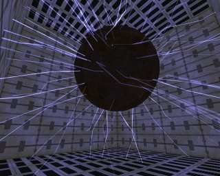

This map has a large floating sphere in the center with electric sparks around it. It's done with a BeamEmitter that creates beams in all directions. The BeamEmitter is placed in the center of the sphere, which is the center of the room as well.The beams have a texture like the screenshot, and with `DrawStyle` `PTDS_Brighten` .


Beam --> `DeterminateEndPointBy` = `PTEP_Distance`, `BeamDistanceRange` = 886 (this is close to the longest length the beams will ever need: from the center of the 1024\*1024 room to a corner)BeamNoise -> `HighFrequencyPoints` = 5, `FrequencyNoiseRange` -> X(Min) = -100, X(Max) = 100, Y(Min) = -100, Y(Max) = 100. To give the beams the blue color, and the flickering effect, they have a `ColorScale` like this:

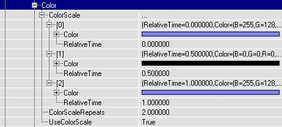

`MaxParticles` = 100, `StartSizeRange` --> X(Min) and X(Max) = 20, `LifeTimeRange` --> Min = 2, Max = 4.In the `StartVelocityRange` X(Min) = -1, X(Max) = 1, Y(Min) = -1, Y(Max) = 1, Z(Min) = -1, Z(Max) = 1. It doesn't matter that the value "1" has been used here, the length of the beams is determinated by BeamDistance anyway. The only important thing here are the signs of the values.A blue light with `LightEffect` `LE_FastWave` , and an electrical sound were added.

## Fountain

Map: `PT-Foutain`

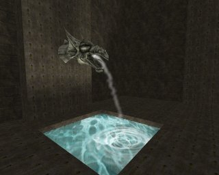

There is a small fountain on the wall, and the water falls into a little pool, causing some waterrings.

### The Fountain

The Emitter is placed where the fountain starts: inside the dragonhead. It has the same texture as the Lights in the SpotLight map, the left picture shows the actual texture, the right one a bright version of it.


Again if necessary set `bDirectional` to True and rotate the Emitter until the arrow points towards where the water will go to (but keep the arrow still horizontally), and set `UseRotationFrom` to `PTRS_Actor` .`StartSizeRange` -> X(Min- = X(Max) = 15, because it's a very thin jet of water. `Acceleration` -> Z = -300, `StartVelocityRange` -> X(Min) = -100, X(Max) = -90, Y(Min) = -5, Y(Max) = 5, `MaxParticles` = 50, `LifeTime` = 1.2. Of course all of this depends on the size, height, etc... of your fountain, you can compare this to the waterfall.If you want to make a round fountain, here's the problem: you could create it by setting in `StartVelocityRange` X(Min) = -100, X(Max) = 100, Y(Min) = -100, Y(Max) = 100, however you'd get a square fountain instead then. Let's all hope it'll once be possible to set a Max Total Velocity for the Emitters, then it'd be possible to create the circle because the Velocity of particles going towards a corner of the square wouldn't be able to go faster than the others anymore (and this eliminates the corner of the square). Here's a top and sideview of it:

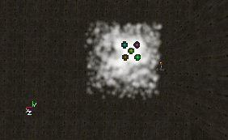

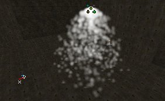

### The Waterrings

This Emitter spawns rings that use a `SizeScale` to grow. Place the Emitter at the location where the water of the fountain hits the surfaceof the pool. Give it a texture like this:

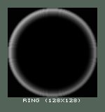

In Sprite set `UseDirectionAs` to `PTDU_Normal` , and in `ProjectionNormal` make sure X and Y are 0 and Z = 1. This makes the rings to be horizontal.In Size set the settings like this:

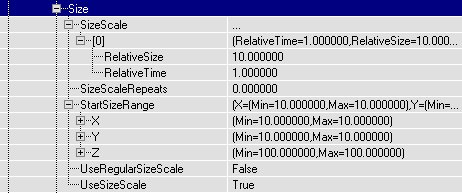

So the particles start with a size of 10, AND become 10 times as large during their `LifeTime`. In `StartSizeRange` , the X AND Y values are used, because `UseDirectionAs` is `PTDU_Normal` AND this requires you to set the X AND Y values independently.`MaxParticles` = 20 and `LifeTimeRange` = 5. There is no `Velocity` or `Acceleration` at all, the rings will stay where they are and just grow. To make them start at a random location, in `StartLocationRange` X(Min) = -20, X(Max) = 20, Y(Min) = -20, Y(Max) = 20. Also, `FadeOut` = True and `FadeOutStartTime` = 0, so while the rings grow they become more and more invisible, like happens with waterrings in real life.You now should have rings on the water.

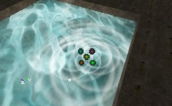

### Weird

Map: `PT-Weird` (only in 739, doesn't load for v3323)This map is been remade and will be available soon. It will contain some miscellaneous effects, for example an emitter moving along a matinee path and a [SparkEmitter](SparkEmitter.md).
