# Advanced Lighting Tutorial

*Document Summary: A useful guide to performing some tricks with lighting in Unreal. Best for advanced users, since knowledge of many aspects of the engine is a requirement.**Document Changelog: Last updated by Michiel, style changes and what not. Previous update by Tom Lin (DemiurgeStudios?), for document summary. Original author was Jason Lentz (DemiurgeStudios?).*

* [Advanced Lighting Tutorial](ExampleMapsAdvLighting.md#Advanced Lighting Tutorial)
  + [Introduction](ExampleMapsAdvLighting.md#Introduction)
  + [Projectors + Shaders](ExampleMapsAdvLighting.md#Projectors + Shaders)
    - [Tree Canopy Shadows](ExampleMapsAdvLighting.md#Tree Canopy Shadows)
      * [Single Tree Shadow](ExampleMapsAdvLighting.md#Single Tree Shadow)
      * [Forest Canopy Shadow](ExampleMapsAdvLighting.md#Forest Canopy Shadow)
    - [Ground Fog](ExampleMapsAdvLighting.md#Ground Fog)
    - [Rolling Clouds](ExampleMapsAdvLighting.md#Rolling Clouds)
    - [Wavering Torch Light](ExampleMapsAdvLighting.md#Wavering Torch Light)
    - [Caustics](ExampleMapsAdvLighting.md#Caustics)
      * [Underwater](ExampleMapsAdvLighting.md#Underwater)
      * [Above Water](ExampleMapsAdvLighting.md#Above Water)
  + [Projectors + Emitters](ExampleMapsAdvLighting.md#Projectors + Emitters)
    - [Light Beam through Window](ExampleMapsAdvLighting.md#Light Beam through Window)
  + [Mesh Effects](ExampleMapsAdvLighting.md#Mesh Effects)
    - [Tree Canopy Light Beams](ExampleMapsAdvLighting.md#Tree Canopy Light Beams)
    - [Neon Lights](ExampleMapsAdvLighting.md#Neon Lights)
    - [Rotating Caution Light](ExampleMapsAdvLighting.md#Rotating Caution Light)
    - [Moths Casting Shadows](ExampleMapsAdvLighting.md#Moths Casting Shadows)
  + [Special Projectors](ExampleMapsAdvLighting.md#Special Projectors)
    - [Triggerable FluorescentLight Projector](ExampleMapsAdvLighting.md#Triggerable _FluorescentLight Projector)
  + [Downloads](ExampleMapsAdvLighting.md#Downloads)

## Introduction

This document assumes that you know the fundamentals of using Lights, Projectors, [Static Meshes](https://udn.epicgames.com/Two/StaticMeshTopics), [Particle Systems](https://udn.epicgames.com/Two/ParticleTopics), and [Materials](../Content Creation/Lighting and Textures/MaterialTutorial.md). In the example map are demonstrations as well as explanations on how to create various lighting effects mostly using some combination of the actors listed above. In the example map, the effects are divided into indoors and outdoors effects. Inside you will find triggerable fluorescent lights, neon lights, caution lights, light beams through a window, and moving lights through grates. Outside you will find trees with moving canopy shadows and beams of light, wavering torch lights, volumetric ground frog, water caustics, and rolling clouds. Within the document though, these effects are categorized by how they are created.You will need the [UDN content](https://udn.epicgames.com/Two/UDNBuildContent) for some of the examples.

## Projectors + Shaders

### Tree Canopy Shadows

You can use projectors to create realistic shadows and depending on the type of shadow you are creating will obviously effect the type of projector you will create. In this section you will see how to create a shadow for a single tree as well as for a forest of trees.

#### Single Tree Shadow

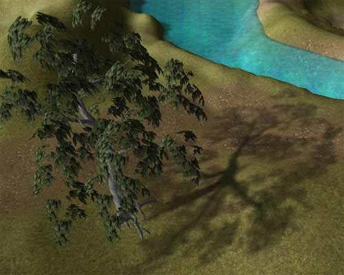

Because you will be creating the tree's shadow with a projector, you will want to turn the tree StaticMesh Display property `bShadowCast` and `bAcceptProjectors` to `False` . Then to create the Projector Texture here are a few steps to quickly creating an accurate shadow texture:

* Set up the tree in the level that is relatively free of other near by StaticMeshes (you can use groups to hide them)
* Set the texture of the tree bark to black (this is only temporary)
* Turn off the terrain in the perspective viewport
* Set the viewport mode to BSP Cuts
* Position camera view at the angle of the sun and take a screen shot into a power of 2 sized image

You should end up with an image that looks like this:

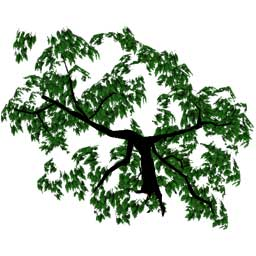

Now in Photoshop you follow these instructions:

* Select all of the white (non tree) and delete
* Desaturate the image
* Paint over where the leaves cover the bark with solid black
  + (This will create a solid shadow where the trunk should be casting one)
* Apply a Gaussian blur to the image
* Create a layer of grey (RGB values: 127, 127, 127) behind the shadow layer
* Save and import the texture into Unreal Ed

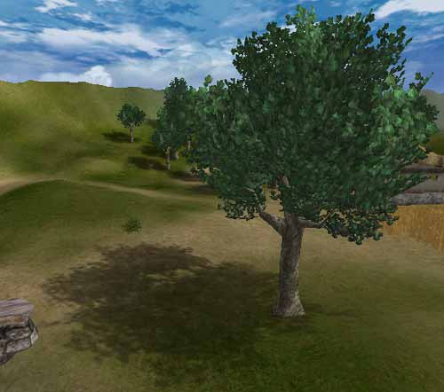

Next create a TexOscillator for this new texture that will give it a slight sway. Note that the UOscillationType is set to OT\_Stretch so that the trunk shadow stays aligned with the StaticMesh trunk.

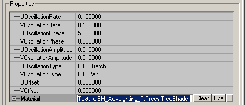

Then assign the TexOscillator to a projector that is casting in the direction of the Sun Light and just set the MaxTraceDistance accordingly and the FOV to 1 to simulate an extremely far off light source.

#### Forest Canopy Shadow

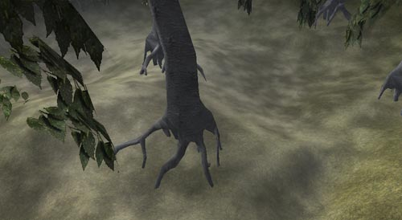

The process for a forest shadow is not that much different from a single tree shadow, except with a forest canopy shadow, you will need a tileable shadow texture without abrupt edges. To create such a texture, follow these steps:

* Turn off the terrain in the perspective viewport
* Set the viewport mode to BSP Cuts
* Orient the camera over the trees of your forest and grab a screenshot into a power of 2 sized image
* Select all of the white (non tree) and delete
* Desaturate the image in Photoshop
* Apply a Gaussian blur to the image
* Create two layers of grey (RGB values: 127, 127, 127)
  + Set one layer above the shadow layer with 50% opacity
  + Leave the other layer at 100% opacity and set it behind the shadow layer
* Now around the edges create a 127, 127, 127 grey border that blends to the center
  + This makes the edge seams less noticeable.
* Save and import the texture into Unreal Ed

Now you will need to use a TexScaler so that the image will tile when set as the Projector Texture. There will be an obvious tiling pattern duplicating the projector and moving it slightly off from the first one will solve this. You will still have a fairly obvious edge around the perimeter of the two projectors. To mask this just create another projector that casts the shadow of a single tree (as described [above](ExampleMapsAdvLighting.md#SingleTree)) and strategically place them along the perimeter of your forest so as to mask the forest canopy shadow seams.

### Ground Fog

Note: the ground fog projectors may flicker in older builds.

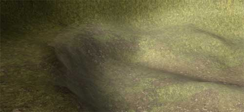

Using a single projector and a TexRotator material, you can quickly create a convincing ground fog effect for a large area. For the base texture, create a texture with some variation in the middle but have it fade out towards the edges leaving a large margin of black. This is the texture used in this example:

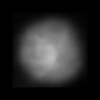

Then create a TexRotator with a TexRotationType of `TR_ConstantlyRotating` with a Yaw Rotation of 1000 for a subtle rotation. Then use the U and V Offsets to center the rotation about the center of the image (1/2 the dimension of the base texture).For the projector properties, you will want to set them as follows:

* Projector -
  + `bClipStaticMesh` : `True` This will cause the projector to cast only on the bottom portion of meshes that protrude through the ground fog. If you have BSP protruding through the ground fog, you will also want to set `bClipBSP` to `True`.
  + `bGradient` : `True` this will allow the projection to gracefully fade out at the edges of the ground fog.
  + `FOV` : *will vary* You will want to play with this setting some, but essentially, you want a LARGE setting for this value (between 150 and 179). The FOV for the ground fog in this example map is set to 160.
  + `FrameBufferBlendingOP` and `MaterialBelndingOp` : `PB Add` Both Blending Ops should be se to Add because the texture has been made to use black as transparent.
  + `MaxTraceDistance` : *will vary* This depends on the depth that you want your ground fog to be. A good measure is to set the Projector at your desired height and then increase the `MaxTraceDistance` until it passes through your terrain/ground surface. You can also make the ground fog appear darker by further increasing the `MaxTraceDistance` .

### Rolling Clouds

This effect combines Projector with two material modifiers, a TexPanner and a TexScaler. First you will want to set up your base texture though. Take your cloud texture from your SkyZone then desaturate the image so it is just a gray scale image. After importing the desaturated cloud image back into Unreal Ed, create your TexPanner (which you should be identical to the TexPanner you are using for your sky clouds just using the desaturated cloud image).

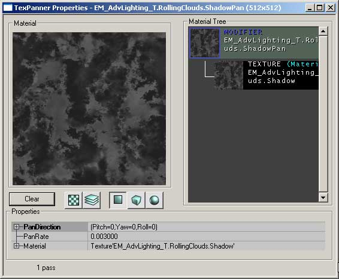

Then apply a TexScaler to the TexPanner to create for more believable shadow sizes. Your resulting material should look like this:

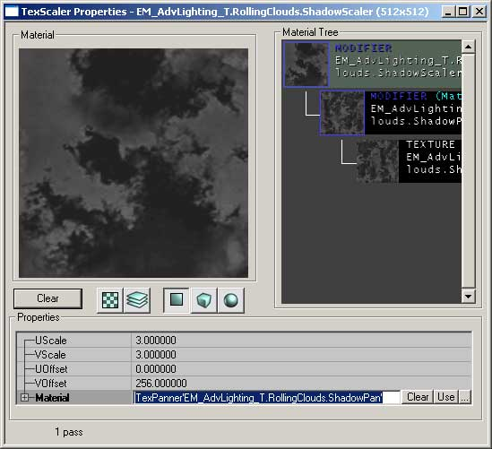

Now you are ready to set up the Projector. Set the `ProjTexture` to the newly created TexScaler and place the Projector above your level with its `FOV` set to 1. Then increase its `DrawScale` and `MaxTraceDistance` until the frustum encompasses the entire level. In the example map, the Projector is set to cast its shadows in the same direction as the sunlight; it's a minor touch, but it prevents shadows from being cast on surfaces that are already receiving a shadow from blocked sunlight. You can copy and paste the Rotation settings from the sunlight Movement Properties for a quick and accurate duplication of its orientation.

### Wavering Torch Light

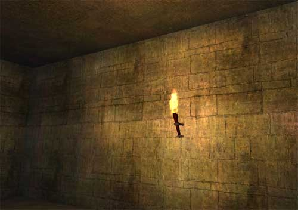

To create a wavering torch effect you will need a light and a single Projector with an TexOscillator material. The light is there just to cast the flame light and flame color. The projector will apply a wavering motion to the light cast on the wall.To set up the light, just add a light to the level, either at the source of the light or a little bit away if it is directly next to a wall. Next using the `LightColor` properties, assign an appropriate color to the light and then tweak the brightness until it looks right.

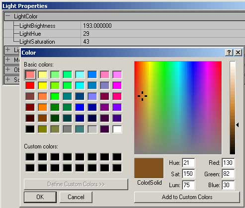

Before you move on to setting up the projector you must first create a texture for the projector that will looks something like this:

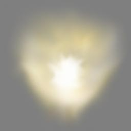

It is important that there is subtle variation throughout the texture so that the flicker effect is apparent even in the center of the projection. Also because we will be using a Modulate bleding type, you will want to keep the edges and background of the texture at 127, 127, 127 gray. To create the flicker effect for the texture you will need to create a TexOscillator material.

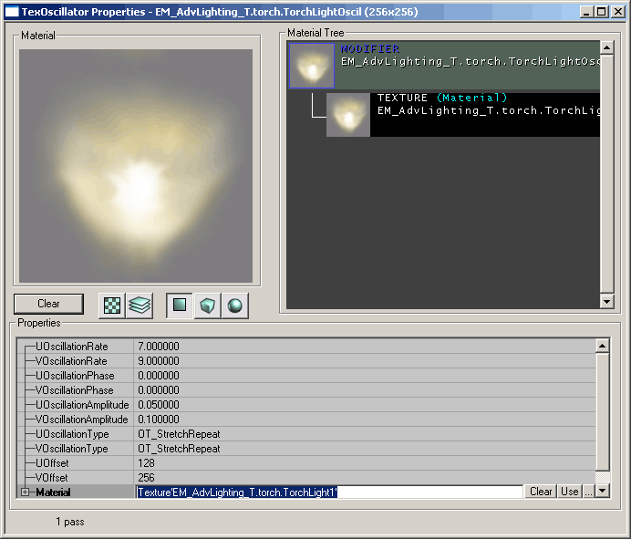

For this TexOscillator you will want to set different U and V `OscillationRates` as well as different U and V `OscillationAmplitudes` to create a more random appearance for the flickering. For both `OscillationTypes` you will want to set it to `OT_StretchRepeat` . For a final touch, offset the texture halfway in the U direction and a full 256 in the V direction (for a 256x256 texture). This causes the `StretchRepeat` to be exaggerated at the top of the texture which in this example is used as the far edge of the torch light.Now assign the TexOscillator to the ProjTexture of a new Projector. Set its properties as follows:

* Display -
  + `DrawScale` : *will vary* In this example a DrawScale of 0.25 is used to make the projector more manageable and able to be more directly targeted at one specific area without projecting through the floor.
* Projector -
  + `bClipBSP` and `bClipStaticMesh` : `True` This will prevent the projection from tiling across BSP and StaticMesh geometry.
  + `bGradient` : `True` Setting this to False will amplify the effect of the flicker and also create sharper edges to your projection, but the flame flicker should be a subtle effect that fades with distance from the light source.
  + `FOV` : `100` You may want to play with this setting, but it will help to distort your flame projection as it appears to cast from the flame source.
  + `FrameBufferBlendingOP` : `PB_Modulate` This should be left at its default setting as it will be Modulating the `ProjTexture` against the wall and the light casting on the wall from the colored light you set up earlier.
  + `MaxTraceDistance` : *will vary* Since Projectors are not occluded by anything you will want to set the MaxTraceDistance so that it does not project onto anything on the other side of the surface that is being lit by the torch.

Now place the Projector near the floor centering the bright portion of the `ProjTexture` behind the torch flame. This will cause the Projector to cast on the wall behind the torch as well as on the ceiling.To improve this effect another similar projector with an inverted `ProjTexture` can be created and cast down towards the floor to create the shadow of the torch.

### Caustics

#### Underwater

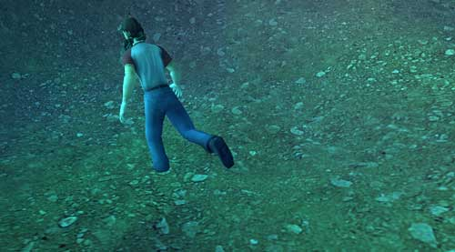

The majority of the work is in creating a compelling water caustics Shader, and there are a number of ways to create a caustics texture. Feel free to use your own method, but the method used to create the caustics in this example map are described here.First start with an image of reflected light on water.

This texture was quickly created using a few layers of the various stained glass texture filters blended together and then made to be tileable. It is important that you do not have an alpha channel for your texture as it will not properly blend with Combiner Materials that you will later be using.Once imported into Unreal Ed, you will base several different Shaders on this texture. Here you see the texture browser material tree of the final material followed by the settings for each material (in the order that you would create them)

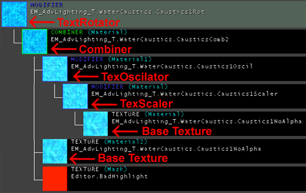

**TexScaler:** Both U and V Scale are set to 0.5 to double the size of the base texture. You may want to increase or descrease these values depending on the size of your underwater area.**TexOscillator:** The U and V `OscillationRates` are set to 0.2 and 0.3 respecitvely, and the U and V OscillationApplitudes are set at 0.01 and 0.02 respectively. The `OscillationType` for both U and V directions is `OT_Stretch` . This creates a subtle and irregular waving motion applied to the TexScaler .**Combiner:** With a `CombineOperation` of `CO_Multiply` with the TexOscillator in Material 1 and the base texture in Material 2, this creates a greater sense of depth.**TexRotator"** The `TexRotationType` is set to `TR_ConstantlyRotating` and it is given a rotation of Yaw = 512. This final modifier material creates a sense of movement to the resulting texture making it appear as if the water if constantly flowing by as it reflects and refracts the flowing water.Again this is not the only way to create a convincing caustics effect. Different materials may be used in different ways to create the effect you are looking for. Try experimenting and see what you can come up with on your own.Once you've finished creating your caustics Shader, you can apply it to a projector. You will most likely need several projectors unless your underwater area is easily covered by one large square projection. You will want to place the projector below the entire underwater area and point it upwards. Below is a list of the settings you will want to change with explanations as to why.

* Display -
  + `DrawScale` : *will vary* This will vary on the size of your projection. Set it to that it encompasses the entire underwater area.
* Projector -
  + `bGradient` : `True` This will cause the caustics effect gradually fade out towards the edge of the water, avoiding sharp seams along terrain triangles.
  + `bProjectOnBackfaces` : `True` Because you are placing the projector below the terrain pointing up, you will need to set this to true so that the Projector will show up on the Terrain.
  + `FOV` : `1` This projection should not be distorted with a wide `FOV` , so by setting it to 1 it will project without any noticeable distortion.
  + `FrameBufferBlendingOP` : `PB_Modulate` This will multiply the color of the projector on to the surface of the terrain allowing it to brighten any color values of the projector over 127 and darken any color values of the projector under 127.
  + `MaxTraceDistance` : *will vary* This value will also depend on the size of your underwater area. After you've placed your projector(s) just below the lowest point of your underwater area, set the `MaxTraceDistance` so that the projector projects just up to the surface of the WaterVolume.

After setting all this up, your projector should be ready to go. If you are using multiple projectors to cover your underwater portion, you can just copy the projector and line them up next to each other watching you that you don't get any overlap. The projectors may not line up perfectly, but it will take a careful and patient eye to notice the seams.

#### Above Water

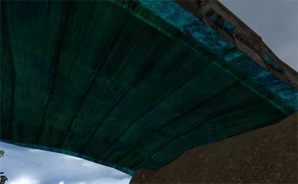

Using an almost identical Shader and very similar Projector settings, a caustics effect can be applied to the underside of geometry that may be over water (such as a bridge).Because a large projector isn't required to cover the space of the underside of the bridge, the TexScaler should be made to reduce the size of the texture even further so that you get more detail out of the projector (U and V Scale are set to .375). All other properties of this Shader are identical to the Shader described [above](ExampleMapsAdvLighting.md#UnderWaterShader).The Projector properties for the above water caustics are also very similar to that of the below water caustics. Because of subtleties with casting on to somewhat complex StaticMeshes, some setting may have to be altered to achieve the proper effect. For instance, `bProjectOnBackfaces` must remain at False so that the caustics do not cast through the bridge and appear on the top side. Below is a list of the settings you will want to change from the underwater projector with explanations as to why:

* Display -
  + `DrawScale` : `1` This setting should remain at the default setting of 1 and you can use the FOV to make the Project cast an appropriately sized projection.
* Projector -
  + `bGradient` : `False` Because you want the project to project evenly on the entire underside of the bridge, you can leave this setting at its default value of `False` . If set to `True`, the projection may not even show up at all in parts.
  + `bProjectOnBackfaces` : `False` As mentioned earlier, this should be left at the default setting so as to avoid projection on to the top side of the mesh.
  + `FOV` : *will vary* Play around with this setting so that it displays only on the exposed underside of your mesh. An FOV that is too large may end up causing the projector to cast on triangles of the topside of the bridge that are facing downwards.
  + `MaxTraceDistance` : *will vary* This value will also depend on the size of you're the mesh you are casting on. You will want to also play with this value in conjunction with the `FOV` setting. Be careful not to set it too far so that you don't end up projecting onto the top side of your StaticMesh.

Note that how you create your StaticMesh greatly aid in preventing the Projector for casting through. Below two diagrams of possible bridges are shown in cross section. The one on the right will work better with a projector below it casting water caustics:

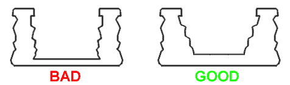

The bridge on the right will work better because it has a greater depth and the inside walls are slanted so that their inside faces all point upwards towards the bottom of the wall. Also if the bridge is straight and not arched, you can very easily set the MaxTraceDistance accordingly so it does not project beyond the top of the bridge, although some cases do call for an arched bridge.

## Projectors + Emitters

### Light Beam through Window

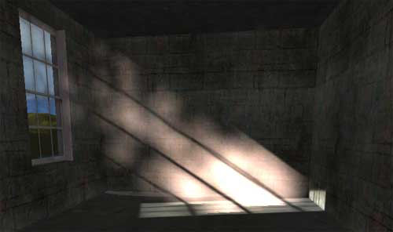

A sun beam from a window can be created with a Projector combined with a Particle System of fog and dust. For consistency's sake, you should make sure that the angle of your Projector matches the angle of your Sun Light. You can easily accomplish this by copying and pasting the Pitch Roll and Yaw values from the Rotation field under the Movement tab of the Sun Light properties to the Projector properties.Once you've set up your window you can place and set up your Projector. To create the Projector texture just take the texture for your window frame, desaturate the image in Photoshop and import it as a new texture. Also, this Projector Texture will need to have its `UClampMode` and `VClampMode` to `TC_Clamp` .

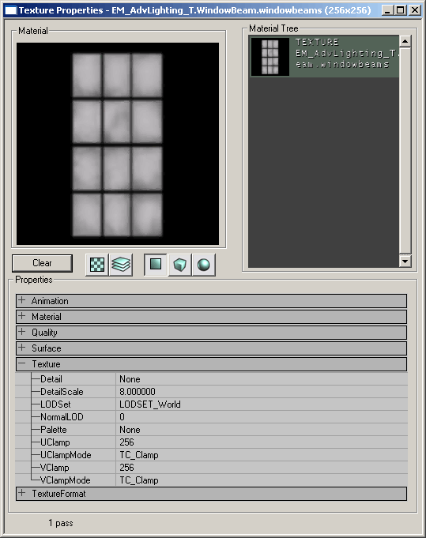

Note that if you have a rectangular Projector Texture the texture will display as a square. To correct for this you will need to make a square texture - just add some additional black space around the short edges of your Projector Texture in Photoshop and it will project a rectangular texture.For the other Projector Properties, you will only need to change the following properties:

* Projector -
  + `FOV` : `1`
  + `FrameBufferBlendingOp` : \_=PB\_Add=
  + `MaterialBlendingOp` : `PB_Modulate`

Now you will be able align the projector with your window and it will cast a bright spot within the room as if the sun is lighting it. The `MaxTraceDistance` has also been decreased to prevent the Projector from showing through into the next room.To complete the light beam effect you will need a particle system that runs through the Projector. In this example map a Particle System with a fog and a dust emitter is used. Be careful that if you have multiple projectors in your level that you don't have your particle system running through both of them. Currently Particle Systems will disappear if they pass through the frustum of two different Projectors.Note: This effect may disappear if two Projectors project onto the same particle system with out overlap. This is a known bug with Emitters in conjunction with Projectors in the 2110 build.

## Mesh Effects

### Tree Canopy Light Beams

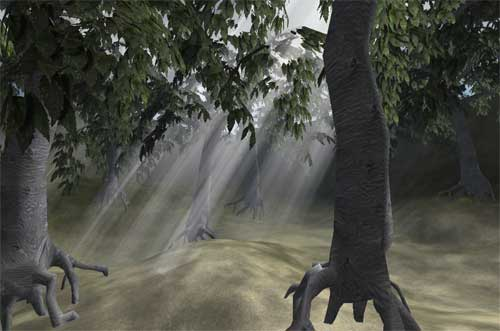

This section shows a method for creating light beams that stream down through the canopy of your forest using only static meshes. First you will need your static mesh which will simply be three planes put together as seen below:

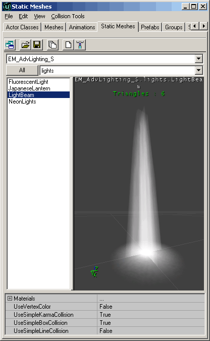

Then create two textures with alpha channels, one for the long beam section, and one for the top piece to appear as a bright spot if you look directly up the beam.

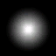

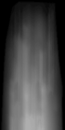Next you will need to set the properties for the light beam StaticMesh. Make sure all of its collision properties are set to False, `bShadowCast` is `False`, and `bAcceptsProjectors` is `False` .Lastly, orient the light beam to have the same rotation as the sun light with the square plane at the top of the beam. The rotation property can found under the Movement rollout), and then place in the canopy holes and resize accordingly.

### Neon Lights

To create a neon light effect is fairly easy. You will need a StaticMesh, a Projector casting a somewhat fuzzy image of the StaticMesh, and a series of lights the color of the neon light with a relatively small light radius.For the StaticMesh, you will need to set the light portion of the mesh to a solid color, and under its display properties, set `bUnlit` to *True.*For the Projector, set the properties as follows:

* Projector -
  + `FOV` : `1`
  + `MaxTraceDistance` : `32` Or something just larger than the depth of the neon light StaticMesh.
  + `FrameBufferBlendingOP` : `PB_Add` which means that Black will be transparent in the projective texture.

The texture itself should just be a blurred image of the neon light on a black background. This will give the glow around whatever surface the neon light is up against, but will not cast any light on any nearby StaticMeshes or Actors.

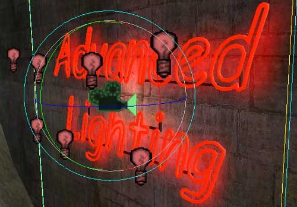

Lastly add a series of lights with a short `LightRadius` and small `LightBrightness` (8 and 16 respectively in this example map). These lights are not so much for lighting up the sign, or the surface behind it, but they are for casting a neon glow to anything that nearby or that passes by.

### Rotating Caution Light

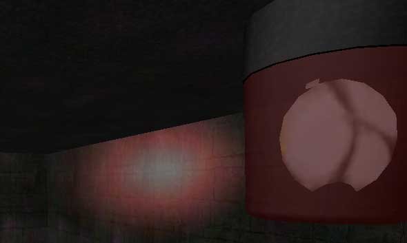

To create a moving Projector, you can attach it to a Mover. In this example, you will see how to create a spinning caution light with a Projector and a Mover.For the StaticMesh portion of the caution light, it is broken into three pieces, the rotating reflector, the red shade, and the light and base.

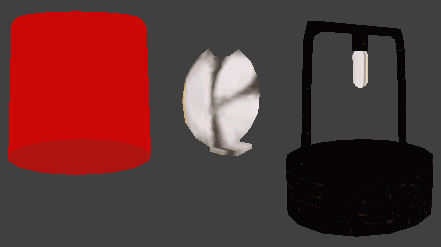

It is broken into three parts for two reasons. One, so that the rotating reflector can be placed in separately as a Mover, and two, by placing it as different pieces it allows you to control the drawing order manually in Unreal Ed (since the objects are all so close to each other, the render has difficulty determining what should be drawn first and last).

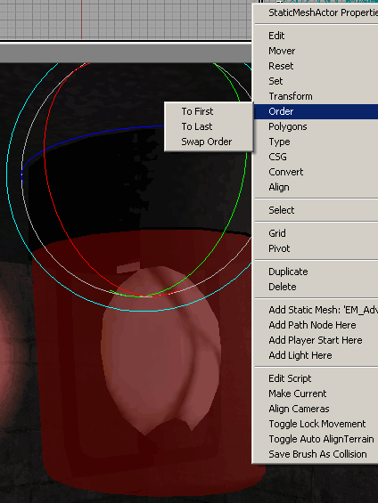

Set up the three pieces in your level with the reflector as a Mover and then adjust the draw order by right clicking on the meshes and selecting the appropriate setting from the Order option. For the reflector Mover, you will want to set the following properties:

* Display -
  + `bAcceptsProjectors` : `False`
* Events -
  + `Tag` : *NameOfYourMover*
* Movement -
  + `bFixedRotation` : `True`
  + `RotationRate` : *YourRotationSpeed (8192 in this example)*

Then place a **DynamicProjector** at the center of the reflector pointing outward. The Projector must be a **DynamicProjector** otherwise the projection will be baked into the level at the start of the level. The **DynamicProjector** properties should be set up as follows:

* Display -
  + `DrawScale` : *SetAccordinly* The projection should fit within the side of the translucent hull.
* Movement -
  + `AttachTag` : *NameOfYourMover*
* Projector -
  + `bClipBSP` : `True` This prevents the projector from tiling on BSP
  + `bClipStaticMesh` : `True` This prevents the projector from tiling across StaticMeshes.
  + `bGradient` : `True` The projection will fade out over distance.
  + `bProjectOnAlpha` : `True` If `False` , the projection will be very harsh on the translucent hull, and it will also show up poorly on any other textures with alpha layers.
  + `bProjectOnBackFaces` : `True` This will light up the translucent casing of the caution light.
  + `FOV` : `25` This number is up to the level designer, but 25 was chosen so as to limit the Projector for casting through the floor
  + `FrameBufferBlendingOP` : `PB_Add` (remember that this means your projection will cast black as transparent)
  + `MaxTraceDistance` : *MayVary* Set this accordinly to your level

Once you assign a texture to the **ProjTexture,** your caution light is ready to go. Note that a projector set up like this is best used in large indoor spaces so that the projections through walls can be more easily controlled and hidden from the players.

### Moths Casting Shadows

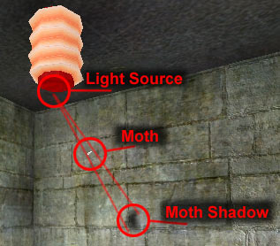

Some of the more dynamic lighting effects will require additional code to be written. This effect will create a dynamic shadow that follows the movement of a moth around a light. Below is a link to a document in the Technical section of UDN that shows how your programmers can set this up.[Moth Shadows](https://udn.epicgames.com/Two/ExampleMapsAdvLightingCode#Moth)

## Special Projectors

Special Projectors can also be added by your programmers depending on what you want. This example shows a FluorescentLight Projector that was added to the UDNContent code. To add this TriggerLight into your build, just copy the "UDNContent.dll" and "UDNContent.u" files into your system folder. You can download these files [here](https://udn.epicgames.com/Two/UDNBuildContent#Running_the_Content_). The new classes are explained in [this document](https://udn.epicgames.com/Two/ExampleMapsAdvLightingCode#Fluorescent_Lights).

### Triggerable FluorescentLight Projector

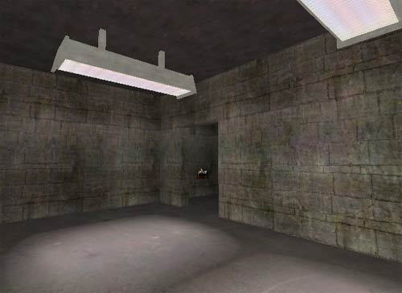

The FluorescentLight Projector will project a texture and a light that randomly flickers at a set rate and then remains steady after a set time once triggered. To set up this type of projector you will have to set up the Projector properties as you would any other projector, but you now also have a FluorescentLight tab in the properties window as well as the two normal light property tabs (LightColor and Lighting).Note that because the light component of the FluorescentLight Projector is set to `bDymanicLight` the light will cast through geometry hitting surfaces it shouldn't. Without `bDymanicLight` though, the light portion of the FluorescentLight Projector will not work.The fluorescent lights in the example map are set up in the following manner. First of all you will want to create a MaterialSwith material and a MaterialSwitchTrigger for the light texture. To do this import two textures, one for the lights on, and one for the lights off.

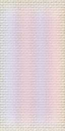

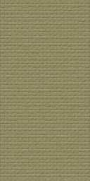Then create a MaterialSwith material from the New Material MaterialClasses window. Open the properties for the MaterialSwith material and assign the on and off textures to the first two Material slots.

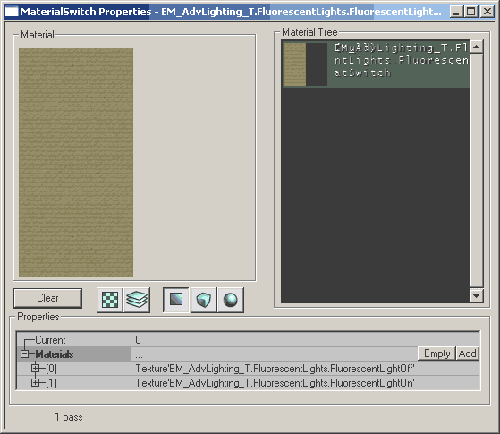

Next you will need to place two types of triggers, a regular trigger and a MaterialSwitchTrigger. The MaterialSwitchTrigger triggers the MaterialSwitch material but it cannot be triggered by itself. Thus the regular trigger is required to trigger the MaterialSwitchTrigger.

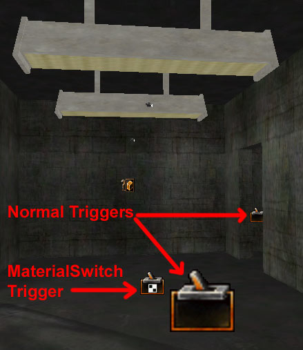

In the example map two separate regular triggers activate the MaterialSwitchTrigger which switches the MaterialSwitch material on both fluorescent lights. These two regular triggers are also set the bHidden False so that they can be easily found in game.If your programmers want to create your own special Projector lights, they can see how the FluorescentLight Projector was created [here](https://udn.epicgames.com/Two/ExampleMapsAdvLightingCode#Fluorescent_Lights) in the Technical version of this document.

## Downloads

Below are contained in the zip file are folders containing the map, Texture packages, and StaticMesh packages required to run the game. You will also need to down load the [UDN content](https://udn.epicgames.com/Two/UDNBuildContent) for some of the examples.Note: the examples are for build 2226, they might not work for other versions.
