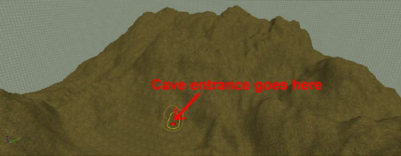
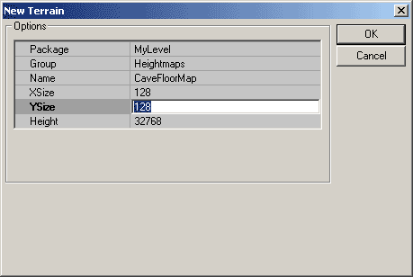
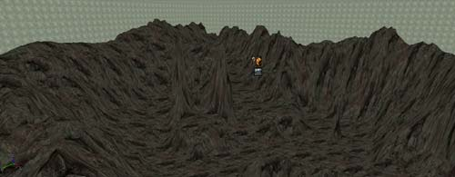
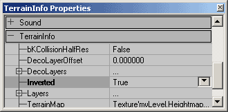
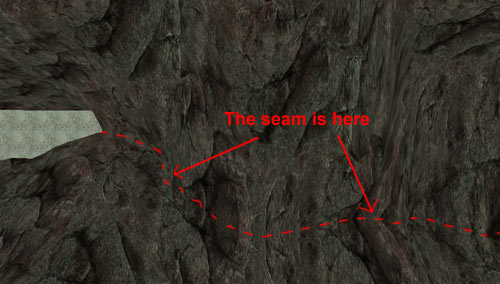
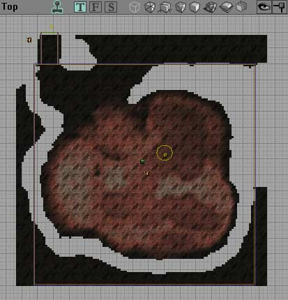
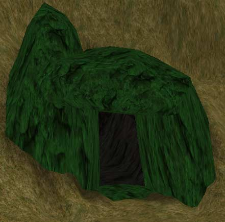
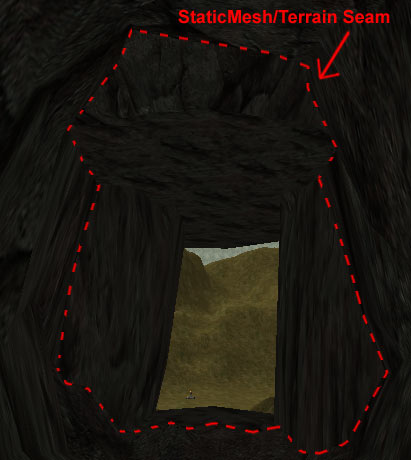
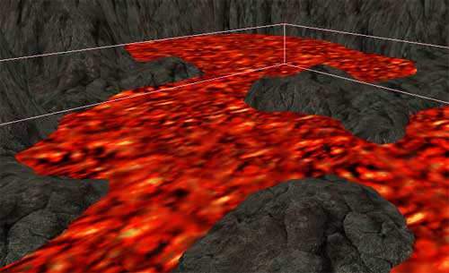
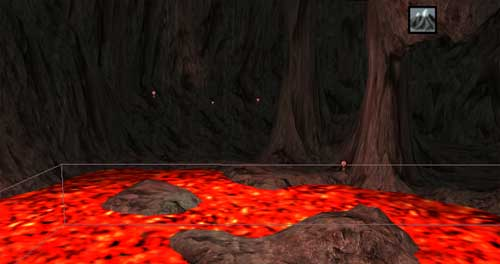

# Underground Caverns

*Document Summary: A straightforward guide to making caves using terrain. Suitable for intermediate skill levels.**Document Changelog: Last updated by Tom Lin (DemiurgeStudios?), for document summary. Original author was Jason Lentz (DemiurgeStudios?).*

* [Underground Caverns](ExampleMapsCaverns.md#underground-caverns)
  + [Introduction](ExampleMapsCaverns.md#introduction)
  + [Ingredients](ExampleMapsCaverns.md#ingredients)
  + [Planning Your Cave](ExampleMapsCaverns.md#planning-your-cave)
  + [Inserting the Cave Terrains](ExampleMapsCaverns.md#inserting-the-cave-terrains)
  + [Adding Entrances](ExampleMapsCaverns.md#adding-entrances)
  + [Cave Ambience](ExampleMapsCaverns.md#cave-ambience)
    - [Pools an Streams](ExampleMapsCaverns.md#pools-an-streams)
    - [Lighting and Visibility](ExampleMapsCaverns.md#lighting-and-visibility)
    - [Echoes and Reverberations [coming soon]](ExampleMapsCaverns.html#Echoes and Reverberations [coming soon])
  + [Downloads](ExampleMapsCaverns.md#downloads)

## Introduction

In this example map you will see how to quickly and easily create an underground cavern using two terrains and a few StaticMeshes. This document assumes that you know to create terrains, are able to add StaticMeshes to your level, and are familiar with the general UnrealEd interface.

## Ingredients

* Texture for ground terrain.
* Texture for cave terrain.
* A StaticMesh for the entrance of the cave.
* Any detail StaticMeshes you want to add to your cave.

## Planning Your Cave

First you will need to build a ground terrain that will conceal the cavern. When creating this ground terrain it is a good idea to keep in mind where you want the entrance(s) to be.

Once you have a section beneath the ground terrain dedicated for your cavern you are now ready to create a separate zone for your cave. It is likely that the brush for this zone will be irregularly shaped, but try to keep it as simple as possible so as to prevent BSP holes.

Creating a separate zone for the cave will not only allow you to significantly optimize your level, but it will also allow you to create entirely different atmospheric effects such as a different fog density and color, echoing reverberations, and specialized lighting conditions.

## Inserting the Cave Terrains

The terrains for inside your cave do not need to be as large as the ground terrain that conceals it so when creating this terrain you can make an initial optimization by setting the size and scale.

The ground terrain in this example was set to be 256 x 256, and this new terrain is made to be 128 x 128. It's okay if the cave terrain is a little larger than is required though since the extra quads can be hidden by turning the unnecessary quads invisible.Now create a bowl shape or whatever rough shape you wish your cave floor to be. Be sure to bring a section of the cave terrain up to meet where the cave entrance will be.

Next, create a second cave terrain just as you made the first one with the same size and general location. Then open up the properties of this terrain, expand the TerrainInfo tab and set the Inverted field to True. This will be the ceiling of the cavern.

If you chose the same texture at the same scale for the ceiling and the floor of the cave you will notice that the two terrains blend very well when the run together even if the TerrainInfos aren't perfectly aligned in the Top Viewport.

Once you've got your cave terrains set up the way you want them, you can trim off the excess non-visible terrain quads with the visibility tool. Note that this can be done more easily from the Top Viewport, but you will have to temporarily reverse the bInverted settings on the various terrains in your level and/or assign them to their own groups that you can hide and show at your whim.

## Adding Entrances

Now that you've got the rough form of your cave mapped out, you're ready to place the entrance to your cave. Drop in your StaticMesh and imbed it into the main ground terrain. In this example map, a simple boulder StaticMesh is used repeatedly to cover the BSP entrance to the cave.

Now you can turn the ground terrain quads that are blocking the entrance invisible individually. On the cave side of the entrance, pull up the ground bottom terrain and the pull down the top terrain to meet the StaticMesh. Now the only thing block the cave entrance is the BSP used to create the cave zone. Place a Zone Portal slicing through the entrance StaticMesh and make sure that it completely intersects with a face of the cave zone's BSP volume and your cave is now fully functional. With a little work the entrance can be made completely seamless.

Run your map and test it out!

## Cave Ambience

There are a variety of ways you can now flesh out your cave to make it richer and more cave like. One obvious way is to add more specific StaticMeshes to give the look and feel that you are trying to achieve with your particular cave. Caves come in many different shapes and sizes (both in the fantasy world as well as reality). This section will list a few other ways to embellish your cave with simple tricks.

### Pools an Streams

Because you've used terrains to create you cavern you can know quite easily create streams and pools of water, lava, or any cavernous liquid of your choice. Simply paint a path for your stream to follow by lowering the path in the terrain with the paint tool and then add a WaterVolume with a water textured sheet on top of it.

To learn more about creating special volumes see the [VolumesTutorial](../Content%20Creation/Primitives/VolumesTutorial.md)

### Lighting and Visibility

Another obvious thing to do is to control the lighting. Since the cave is within its own zone, you can lower the ambient brightness or even tint the entire cave to have subtle ambient lighting in a different color. Keep in mind that you will most likely have to come up with unique solutions to creating light sources within your cave as most cave. In this example map there are small fires and pools of lava that light up the cave.

To add further ambience, you can also set a different DistanceFog within this zone. Depending on the density of the fog and the color, you can make your cave seem more like a dank damp drippy cave, or a dry smoke filled dragon's lair.

### Echoes and Reverberations [coming soon]

## Downloads

Below you can download a compressed archive that contains the content for this example:

* [em_undergroundcaverns.zip](../assets/em_undergroundcaverns.zip) (for Unreal Engine 2 build 2226)
