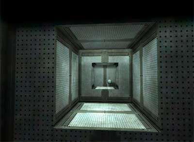
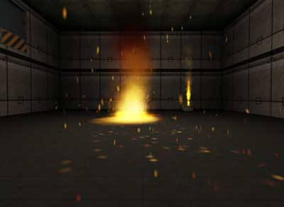
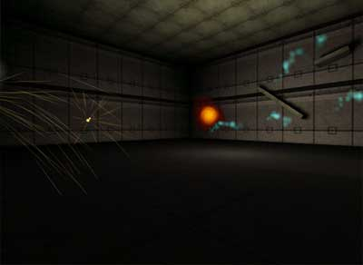
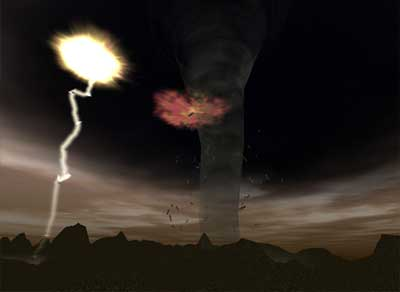
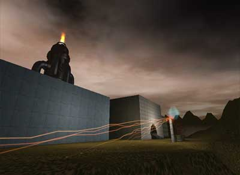
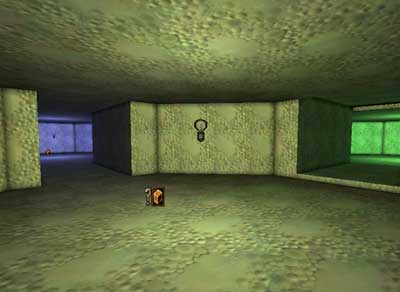

# EPIC Demonstration Maps

*Document Summary: A smattering of maps that cover a range of topics. Matinee, Material, Particles and Sound are all covered. Since these are here more as examples of what is possible rather than tutorials/explanations, these maps are appropriate for novices. Requires some knowledge of where to put Unreal-specific files.**Document Changelog: Last updated by Tom Lin (DemiurgeStudios?), for document summary. Original author was Jason Lentz (DemiurgeStudios?).*

* [EPIC Demonstration Maps](ExampleMapsEPIC.md#epic-demonstration-maps)
  + [Introduction](ExampleMapsEPIC.md#introduction)
  + [CIN Dolly Example Map](ExampleMapsEPIC.md#cin-dolly-example-map)
  + [Materials Example Map](ExampleMapsEPIC.md#materials-example-map)
  + [Particles Example Map](ExampleMapsEPIC.md#particles-example-map)
  + [Sound Example Map](ExampleMapsEPIC.md#sound-example-map)
  + [Downloads](ExampleMapsEPIC.md#downloads)

## Introduction

This document contains the old EPIC Demo Maps updated to the 2110 build. As of yet they are not entirely integrated and there are still a few more maps still to come, but the ones included in the zip file at the bottom of this doc should work fine to demonstrate their intended focus. Be sure to put all the necessary *.ukx*, *.usk*, and *.uax* packages in their appropriate folders as well.

## CIN Dolly Example Map

This map demonstrates some of the things you can do with Matinee. Upon playing the map you will see a brief cinematic where you slowly fly by a sphere, fade to black, start again in a new position and then the camera will track the sphere as it flies by.

For more information on how to use Matinee, see the following docs:

* [MatineeTutorial](../Content%20Creation/Matinee/MatineeTutorial.md)
* [MatineeExample](../Content%20Creation/Matinee/MatineeExample.md)
* [SampleMatineeTips](../Content%20Creation/Matinee/SampleMatineeTips.md)
* [MatineeDemoOpening](MatineeDemoOpening.md)
* [MatineeDemoDropship](MatineeDemoDropship.md)

## Materials Example Map

In this map you can see several examples of how materials can be used in various ways. This map will eventually have Karma Physics integrated back into it, but for now you can use it to see some effects that can be achieved with different materials

For more information on how to use Materials, see the [MaterialTutorial](../Content%20Creation/Lighting%20and%20Textures/MaterialTutorial.md).

## Particles Example Map

In the Particles map you will see a myriad of effects ranging from sweeping laser scans, vented steam, pouring molten fiery stuff, bouncing blue balls electric fuzz, and just general explosions.

Also you can see various outdoor effects such as lighting (both the ground striking variety and the cloud-lighting-up variety), tornados with debris, and rising smoke clouds.

For more information on how to create such effects, see the following docs:

* [ParticleSystems](../Content%20Creation/Effects/ParticleSystems.md)
* [ExampleParticleSystems](../Content%20Creation/Effects/ExampleParticleSystems.md)

## Sound Example Map

This map demonstrates how sounds can be used in a variety of ways including with zones, particle systems, and AmbientSoundActors aplenty.

For more information on how to use sounds, see the [ExampleMapsSounds](ExampleMapsSounds.md) document.

## Downloads

Click the links to download compressed archives of the example maps discussed in this document:

* [epic_demomapfiles.zip](../assets/epic_demomapfiles.zip) - example maps.
* [epic_cindollyexamplemap_rt.zip](../assets/epic_cindollyexamplemap_rt.zip) - runtime version of the CIN\_DollyExampleMap.

The various packages have been divvied up into appropriate subfolders. There are a lot of them, so you might want to back up your original folders to make it easier to remove just the example map Textures and StaticMeshes. You may also get some warnings about missing textures when you open the maps, but as of this writing, the maps still work fine.
