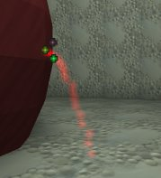
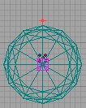
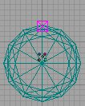

# Expanding Pool Example Map

*Document Summary: A simple demonstration of how to make a projector expand, to simulate pooling water. Requires some knowledge of emitters and projectors. Most of this document is at an intermediate skill level. However, code exists to modify the projector, so to follow this document, programmer aid is required to create a subclass.**Document Changelog: Last updated by Tom Lin (DemiurgeStudios?), for document summary. Original author was Lode Vandevenne ([UdnStaff](https://udn.epicgames.com/Main/UdnStaff)).*

* [Expanding Pool Example Map](ExampleMapsExpandingPool.md#expanding-pool-example-map)
  + [Introduction](ExampleMapsExpandingPool.md#introduction)
  + [The emitter](ExampleMapsExpandingPool.md#the-emitter)
  + [The Projector](ExampleMapsExpandingPool.md#the-projector)

## Introduction

This map for shows an expanding pool: when you walk on a trigger, wine starts flowing out of a barrel, and creates the pool on the ground. The pool is done with a Projector with an expanding DrawScale. There's also an emitter for the wine spouting out of the barrel.To download this map, scroll to the bottom of this document and download the file wine.zip . The map should work under engine build 829 without any external files.Here are step by step instructions on how it's done (I assume you know a little bit about Emitters, Movers and Projectors already):

## The emitter

The emitter is attached to a mover. First the Emitter is hidden away, and when you walk on the trigger, the wine starts flowing out of the barrel and the mover with the attached emitter moves to the barrel. Then, after a while when the barrel is empty, wine stops flowing out of it and the emitter moves away again.The emitter is a SpriteEmitter, with a red texture. The texture is scaled properly (with the StartSizeRange setting) and MaxParticles is set to about 20. Acceleration.Z is set to -950 to make the particles fall down, and StartVelocityRange.Y is set to something between -100 and -120 to make the particles being spouted forwards a little bit.This is how the emitter will look when placed in position:



Add a small mover, and place it somewhere where you can't see it, for example in the center of the barrel. Place the Emitter on the mover, also in the center of the barrel, and make sure you can't see the particles (the emitter has to be invisible until it's triggered to move). In the settings of the mover, set Advanced --> bHidden to True so the mover will be hidden in the game. Then set Key1 of the mover to the location where the emitter will be when the wine starts flowing out of the barrel, and set the mover back to Key0 after that.So here is Key0 of the mover: both mover and emitter are hidden inside the barrel:



And here is Key1 of the mover, outside the barrel (in the game, the emitter is supposed to follow the mover):



To make the Emitter to follow the mover, set in the properties of the Emitter the setting Movement --> AttachTag to the tag of the mover, in this case Mover.Set the InitialState of the mover to TriggerOpenTimed, set MoveTime to 0 and StayOpenTime to the time the wine will keep flowing, in this case 20.Add a trigger somewhere in the map and set its Event to the tag of the mover: Mover. Also set btriggerOnlyOnce to True so you can't make it move a second time again.Now you already have a map where you can walk on a trigger, then a squirt of wine comes out of the barrel for 20 seconds, and then stops again. There's no expanding pool yet.

## The Projector

The Projector has to be one that appears when it's triggered and starts expanding. The default projector can't do this, so it has to be a subclass with its own script, for example a script like this:

```

//=============================================================================
// PoolProjector.
//=============================================================================
class PoolProjector extends Projector;

var() int StartScale;
var() int EndScale;
var() int PoolingTime;
var float time;
var float scale;


function PostBeginPlay()
{
   DetachProjector(True);
   SetDrawScale(StartScale);
}


function Timer()
{
   if (time<PoolingTime)
   {
      DetachProjector(True);
      time=time+0.1;
      scale=(StartScale*(PoolingTime-time)+EndScale*time)/PoolingTime;
      SetDrawScale(scale);

      AttachProjector();
   }
}

function Trigger( actor Other, pawn EventInstigator )
{
   SetTimer(0.1, True);
}
```

Select the Projector in the Actor Class Browser, open Class --> New..., enter Package: MyLevel (if you need this projector only for this map) and Name: PoolProjector, and enter the script. If you can improve this script, please do so.Place the projector above the barrel, so it's center is where the wine will hit the ground, and add a wine pool texture (Make sure UClampMode and VClampMode in the properties of the texture are both set to TC\_Clamp). With DrawScale 1 and FOV 0 the projection should look like a very small pool of wine:


Then look in the settings of the PoolProjector --> PoolProjector: there are StartScale, EndScale and PoolingTime. Set StartScale to the same value as the DrawScale setting in Display. Set EndScale to the size the pool should have at the end, for example 20 means it'll become 20 times as big, and set PoolingTime to the time the pool will keep expanding.Add a second trigger, and set its Event to the Tag of the PoolProjector. Don't use the same Tag as the mover, because the Emitter with his AttachTag will get confused if there's another actor with the same tag as the mover.This should be about it. If you want to improve this example map in any way, feel free to do so.Note: in Build 829, the Projector has bStatic=False in its Default Projector, and automatically also it's subclass PoolProjector. However, in some later builds the Projector may have bStatic=True, so you have to make sure the PoolProjector has bStatic=False in its Default Properties, otherwise Dynamic Projector the effect won't work.Note: possibly, a very realistic fluid physics system may be added to the engine to create much more realistic pools.
