# Karma Colosseum

*Last updated by Chris Linder (DemiurgeStudios?) to update page and map for 2226 build. Original author was Jason Lentz (DemiurgeStudios?).*

* [Karma Colosseum](ExampleMapsKarmaColosseum.md#Karma Colosseum)
  + [Introduction](ExampleMapsKarmaColosseum.md#Introduction)
  + [Simple Primitives](ExampleMapsKarmaColosseum.md#Simple Primitives)
    - [Creating the StaticMesh](ExampleMapsKarmaColosseum.md#Creating the _StaticMesh)
    - [Setting the KParams](ExampleMapsKarmaColosseum.md#Setting the KParams)
    - [Boxes (MCDBX)](ExampleMapsKarmaColosseum.md#Boxes (MCDBX))
      * [Stone Block](ExampleMapsKarmaColosseum.md#Stone Block)
      * [Cardboard Box](ExampleMapsKarmaColosseum.md#Cardboard Box)
      * [Wooden Crate](ExampleMapsKarmaColosseum.md#Wooden Crate)
    - [Balls (MCDSP)](ExampleMapsKarmaColosseum.md#Balls (MCDSP))
      * [Bowling Ball](ExampleMapsKarmaColosseum.md#Bowling Ball)
      * [Beach Ball](ExampleMapsKarmaColosseum.md#Beach Ball)
    - [Complex Shapes (MCDCX and multiple Karma Primitives)](ExampleMapsKarmaColosseum.md#Complex Shapes (MCDCX and multiple Karma Primitives))
      * [Balloon](ExampleMapsKarmaColosseum.md#Balloon)
      * [Boulder](ExampleMapsKarmaColosseum.md#Boulder)
  + [Complex Karma Actors and KConstraints](ExampleMapsKarmaColosseum.md#Complex Karma Actors and KConstraints)
    - [Punching Bag](ExampleMapsKarmaColosseum.md#Punching Bag)
    - [Destructible Columns](ExampleMapsKarmaColosseum.md#Destructible Columns)
    - [Ball and Chain](ExampleMapsKarmaColosseum.md#Ball and Chain)
      * [Ball KarmaParams](ExampleMapsKarmaColosseum.md#Ball _KarmaParams)
      * [Link KarmaParams](ExampleMapsKarmaColosseum.md#Link _KarmaParams)
      * [The Base](ExampleMapsKarmaColosseum.md#The Base)
  + [Tips and Pointers](ExampleMapsKarmaColosseum.md#Tips and Pointers)
    - [Avoid Scaling Karma Actors in Unreal Ed](ExampleMapsKarmaColosseum.md#Avoid Scaling Karma Actors in Unreal Ed)
    - [Pivot Placement of Karma Actors](ExampleMapsKarmaColosseum.md#Pivot Placement of Karma Actors)
    - [Using Cylinder Karma Primitives (MCDCY)](ExampleMapsKarmaColosseum.md#Using Cylinder Karma Primitives (MCDCY))
    - [Karma Collisions Through Geometry](ExampleMapsKarmaColosseum.md#Karma Collisions <em>Through</em> Geometry)
    - [Karma with Movers](ExampleMapsKarmaColosseum.md#Karma with Movers)
  + [Downloads](ExampleMapsKarmaColosseum.md#Downloads)


## Introduction

The Karma Physics engine allows you to integrate more realistic simulations of collisions with your StaticMeshes, but Karma should not be applied to every object in your level. While the calculations for determining reactions are simplified from what's actually happening in reality, they still have an impact on the engine. Karma should be used selectively in your level so as not to overwhelm the Unreal Engine. The example map described below pushes the boundary of what Karma can realistically do within a scene.In this document you will see how to create and use the basic Karma and learn about several tips to getting the most out of Karma. In the first section you will see how to create different simple primitives using the various types of Karma Primitives. The second section demonstrates how to use constraints and how to create more complex effects. The third section outlines various tips and pointers to keep in mind when using Karma. The map and associated packages can be downloaded at the bottom of this page as well as on the main [ExampleMaps](../Content Creation/Techniques/ExampleMaps.md) page.

## Simple Primitives

### Creating the StaticMesh

The process for creating StaticMesh with Karma properties is fairly trivial. You simply need to create simple primitives and give it the proper name in the third party modeling program. This is described in greater detail in the [KarmaReference](../Content Creation/Physics/KarmaReference.md) doc. Once you've imported your ASE and clicked the Karma information has successfully been imported, you will now be ready to place your Karma Actor in the world. With the desired StaticMesh selected in the StaticMesh browser, just right click and in a viewport and select the **"Add Karma Actor"** option.Also one should note that in order for Karma Actors to collide with StaticMeshes without collision hulls, you must set "UseSimpleKarmaCollision" to False in the StaticMesh Browser. This setting is a bit misleading in that if the setting is True, the StaticMesh will attempt to use Karma information that it doesn't have and as a result the StaticMesh will not collide with Karma Actors. The False setting will tell the StaticMesh to collide per triangle and then it will then collide with Karma Actors.

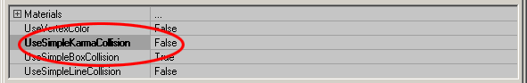

### Setting the KParams

In the properties window of your Karma Actor, expand the Karma tab and all of the sub-tabs within it. These are the values that will determine how this Karma Actor will collide with the world and other Karma objects.

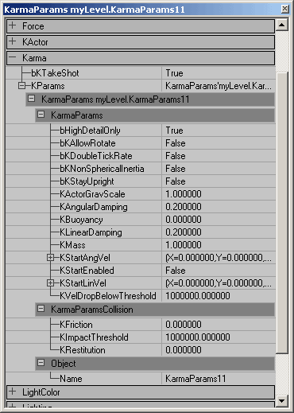

For a detailed description of all the KarmaParams see the [Physics\_Parameters](../Content Creation/Physics/KarmaReference.md#Physics_Parameters_KParams_) sections of the [KarmaReference](../Content Creation/Physics/KarmaReference.md) doc.**NOTE:** Actors will only use Karma if their **bHighDetailOnly** setting is set to **True**. It defaults to False because Karma can cause a substantial performace hit on slower machines and is often not used as an integral part of the game. However, If you are using Karma as an integral part of your game you will want to also change the below setting your uw.ini and default.ini files, otherwise Karma may be toggled off by slower end-user machines.In the .ini files, search for this setting...

```

   [Engine.LevelInfo]
   PhysicsDetailLevel=PDL_Medium
```

And change it to...

```

   [Engine.LevelInfo]
   PhysicsDetailLevel=PDL_High
```

The Karma settings provide approximations of how objects act within the real world. The resultant effects will have much overlap in the various ways you might perceive the behaviors of a given object. If one setting isn't giving you quite the desired effect you want though, try experimenting with some of the other values to achieve your desired behavior. Below are some examples of how these properties might be set for various objects of different shapes and sizes.

### Boxes (MCDBX)

The following three meshes are made with only having one Karma Box (MCDBX) in the ase, but in altering their KarmaParams one can achieve dramatically different effects for each one. For more information on setting up the MCDBX, see the [KarmaReference](../Content Creation/Physics/KarmaReference.md) doc.

#### Stone Block

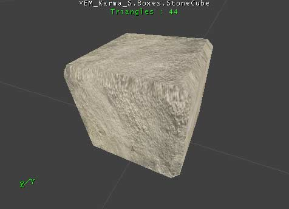

In this level we want this stone block to be a smooth block of solid block of stone. Below is a snap shot of the KarmaParams with the changed ones highlighted for this Karma Actor:

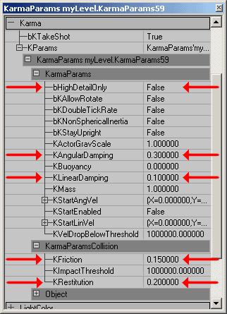

Even though we want the stone block to be heavy, we don't necessarily have to increase its *KMass*. Instead this effect is achieved by reducing the *KLinearDamping* to .1 in effect reducing its air drag causing it to fall faster. The *KAngularDamping* however is increased to .3 to further the illusion that it is difficult to tip the block over due to its weight. To achieve the affect that it can more easily slide across smooth surfaces, its *KFriction* is set to .15. Fortunately, because Terrain is seldom perfectly flat this adds to the illusion making it appear for more difficult to move across Terrain versus smooth BSP. Lastly its *KRestitution* is kept farily low to complete the illusion of it being a fairly dense block of stone. If left at 0, this illusion would be amplified even further.

#### Cardboard Box

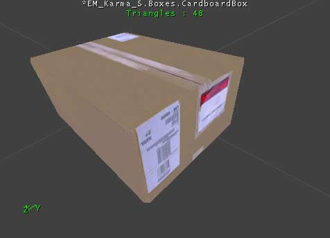

For this box we want it to be generally light (probably packed mostly with packaging peanuts and sealed air). And to be consistent with the nature of cardboard, it should absorb much of impact when colliding and be somewhat slippery when sliding.

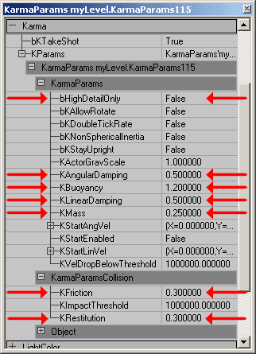

This box should be lighter than the stone block obviously, and it is in fact given a lower *KMass* setting of .25. pushing the *KLinearDamping* and *KAngularDamping* up to .5 also adds to the illusion that it is lighter as it makes it appear as if the air is having a stronger effect in restraining its motion in any direction (linearly or rotationally). This box's *KFriction* and *KRestitution* are also increased to .3 to simulate the general nature of cardboard being mildly slippery and ability to absorb some of the impact. Also note that this Karma Actor has its *KBuoyancy* set to 1.2; this will allow the cardboard box to float to the surface when within a WaterVolume.To add some variety to the cardboard boxes, the masses and damping of the individual boxes could be slightly altered to give the illusion of different contents per box. In this example map though, all of the boxes have the same settings.

#### Wooden Crate

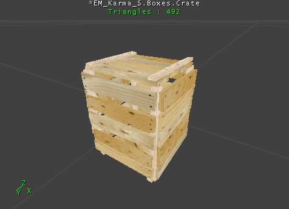

This crate should heavier than the box and slightly bouncier. It should also be less resistant to air drag yet not slide quite as easily on surfaces.

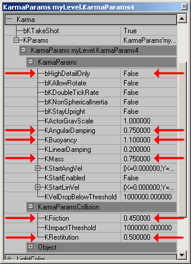

To give a weightier appearance than the cardboard box but still not quite as heavy as the stone block, its *KMass* is set to .75 and its *KLinearDamping* is left at .2. The *KAngularDamping* however is increased to .75 as its rotation would be slowed by the air buffeting against the wooden slats. To simulate the rough texture of the wood slats the *KFriction* is set to .45 and for its *KRestitution* a .5 will simulate the resilience of wood.

### Balls (MCDSP)

The following two balls were created with only having one Karma Sphere (MCDSP), but with changing a few simple properties, they can have radically different behaviors in game. For more information on setting up the MCDSP, see the [KarmaReference](../Content Creation/Physics/KarmaReference.md) doc.

#### Bowling Ball

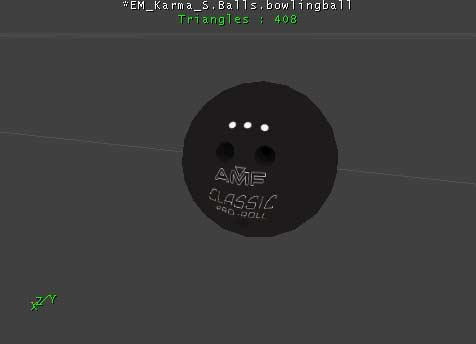

This bowling ball, like the stone block should have a significant weight to it and be a polished smooth surface. As you can see below, not much change is required from the default settings to simulate a bowling ball.


The default *KMass* and Damping (both *Linear* and *Angular*) work well for a bowling ball. The default *KFriction* and *Krestitution* settings however need to be altered. By increasing the *KFriction*, the bowling ball will appear to roll in accordance to the direction it is moving, but if a great enough linear force is applied to it, it is possible to get some back spin on the ball. And unlike the stone block, it is given a *KRestitution* of .75. This will not only allow it to bounce, but it will also make it appear somewhat lighter than the stone block described above.

#### Beach Ball

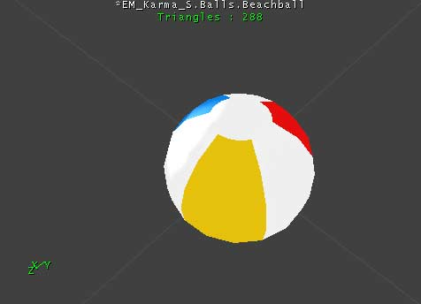

This is basically the opposite of the bowling ball and not surprisingly, the settings for each are quite different. This beach ball is very light and while it may be able to easily be launched at a great speed, it should also slow just as easily due to air friction. It is also highly bouncy and highly buoyant -sometimes even jumping out of the water if it is submerged too deeply.

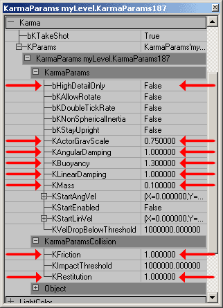

To give the beach ball an extra light feeling, the *KActorGravScale* is reduced to .75 and the *KMass* is set to .25. Altering the *KActorGravScale* can very drastic and sometimes overwhelming effects so be warned that when you change it that you are *really* changing things up. Other ways in which the beach ball is given an airy effect is by setting both its *Linear* and *Angular* Damping to 1. This gives it the very strong resistance to any sort of movement due to air friction. Its *KFriction* is also set at 1 to simulate it gripping plastic surface. To simulate its "bouncyness," the beach ball is given a *KRestitution* of 1. Any higher setting that that would cause it to gain velocity with every impact. And lastly to simulate its behavior in water, it is given a buoyancy of 1.3. This setting is high enough to cause it to realistically jump out of the water if submerged too deeply.

### Complex Shapes (MCDCX and multiple Karma Primitives)

When creating the Karma Primitives in a third party modeling program you are not just limited to simple primitives such as spheres, boxes, and cylinders. You can also make irregular convex shapes (*MCDCX*) or even combine the basic primates to create any shape you desire. Below you will see how you can create more complex shapes such as a balloon and a boulder. For more information on setting up the MCDCX and other Karma Primitives, see the [KarmaReference](../Content Creation/Physics/KarmaReference.md) doc.

#### Balloon

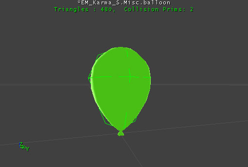

Above you can see the balloon as it appears in game and to the right is an image of the Karma Collision Volumes overlaid on a wireframe of the model. The two green spheres decently fill in the rough shape of the balloon and even though they intersect each other, they will still work. Below you can see the properties for the ballons.

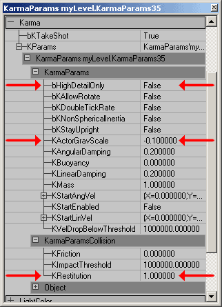

The changes required to make a balloon that floats are fairly minor as you can see. To give the balloon a lighter than air effect the *KActorGraveScale* is set to -0.1. Other than that the only other setting you need to adjust is the *KRestitution* to 1 so as to give it a bounce with every impact.

#### Boulder

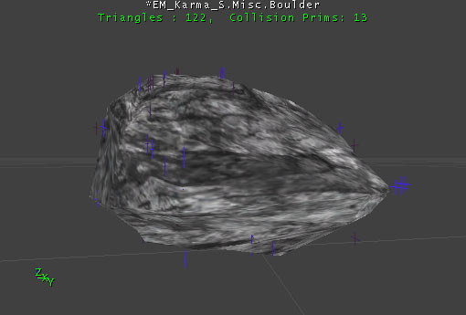

This boulder uses a convex primitive that is a simplified version of the actual boulder geometry. Within Unreal Ed, this Karma Primitive appears as just the vertices (seen above in blue and purple).

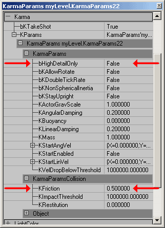

Here you can see that the only setting that to change (other than the *bHighDetailOnly* setting) was the *KFriction*. Because this Karma Actor is as big as it is, it will naturally have a larger mass, and increasing the *KMass* would be multiplying the total mass by that factor potentially creating an extraordinarily heavy object.

## Complex Karma Actors and KConstraints

In this section you will see how to create a punching bag, destructable columns, and a ball and chain using multiple Karma Actors and various KConstraints.

### Punching Bag

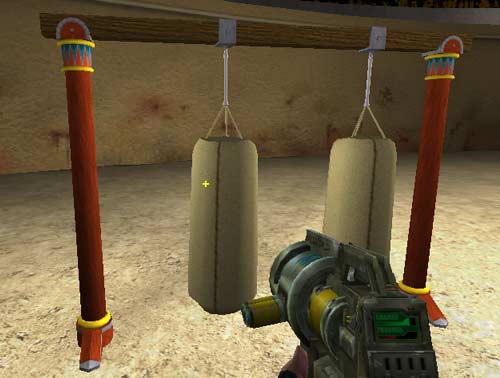

The Punching bag is made up of three Meshes and two KConstraints. The structure does not have any Karma Primitives associate with it as it is not to move from its position. Karma Actors can still collide with it though since it has its setting *UseSimpleKarmaCollision* set to False. The rope mesh uses a simple box primitive and in its KarmaParams it has its *KMass* set to .1 so that it is nearly negligible in comparison to the punching bag itself. The punching bag mesh is a little more complex. It uses a Karma Cylinder primitive for the bag and a box for the three strings that connect it to the larger rope. Not that the Cylinder had to be segmented in order for it to successfully import.

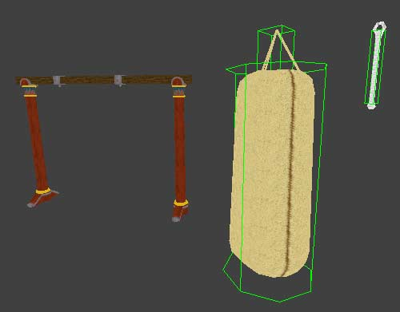

The KarmaParams of the punching bag required a little more tweaking than the ropes. The *KLinearDamping* and *KAngularDamping* both were increased as well as the *KMass* to make it act like a very heavy weight. A small KRestituion\_ of 0.1 was also added to give it a slight springiness.

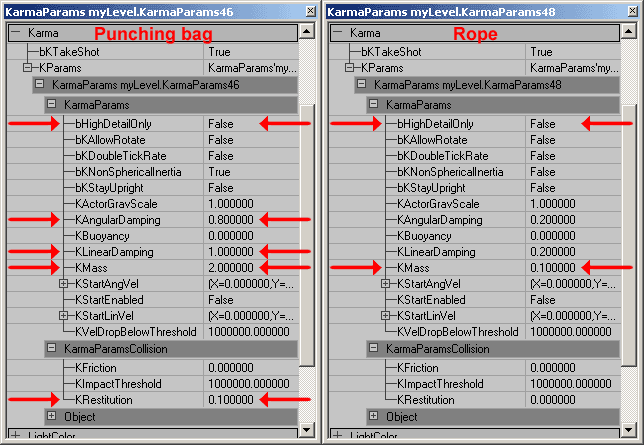

One last setting that was changed in the punching bag is the *bKNonSphericalInertia* setting. In this example map there are two punching bags attached to the structure, one with its *bKNonSphericalInertia* set to True (on the right) the other has it set to False (on the left). The difference is subtle but the one set to True will resist rotation more in the long direction than it will around its vertical axis. In its default setting of False, the punching bag will rotate equally easily in any direction given that the force is applied at an equal distance from the center of mass.

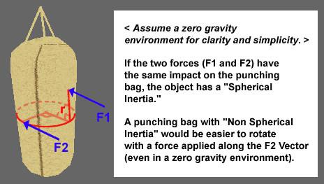

Once the Karma Actors and the punching bag structure are set in place\*, the KConstraints can be added. *(Note that for ease of placement, each mesh was given a common pivot point in space so that it makes sense for the punching bag system as a whole, but not necessarily make sense for each object)*. To place a KConstraint open up the Actor Browser and expand the following tabs **Actor --> KActor --> KConstraint**.

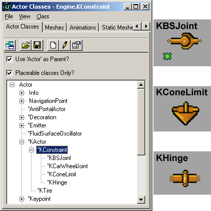

For the punching bag, two KBSJoints (Karma Ball and Socket Joint) are all that is necessary although a KConeLimits could also have been used. One is placed at the top of the rope where it connects to the punching bag structure and the other is placed where the rope meets the punching bag mesh. To assign the appropriate Karma Actors to these KConstraints, open up their property windows. In the first KConstraint, only the *KConstraintActor1* field is required. By leaving the second field empty, the KConstraint will automatically secure itself to the world. For the lower KConstraint, in the *KConstraintActor1* and *2* fields assign the rope and punching bag Karma Actors.

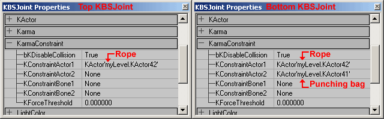

To assign the Karma Actors, just highlight the field, click the "Find" button, and then select your desired Karma Actor in one of the view ports. A perspective viewport is probably the easiest for this, but you should make sure that the Karma Actor is correctly selected. Sometimes this feature will select something other than what you intended.Once you have your KConstraints set up, your punching bag is ready to go!**NOTE: In the 2226 build, the KBSJoints that connect the rope to the structure and punching bag will now "stretch" if the bag is hit with a strong enough force. This causes them to appear unattached, but they slowly come back together when the Karma Actors return to a state of rest. There is no known fix for this at this time.**

### Destructible Columns

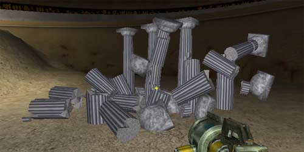

The destructible Columns are actually fairly simple to create, just a little more time consuming. They are comprised of 7 different segments which come together to form a complete column and each one has its own Karma Primitive and must be imported separately as well as have its KarmaParams set separately. (Also, just as with the punching bag, the column segments using Cylindrical Karma Primitives had to have those Karma Primitives segmented to properly import).

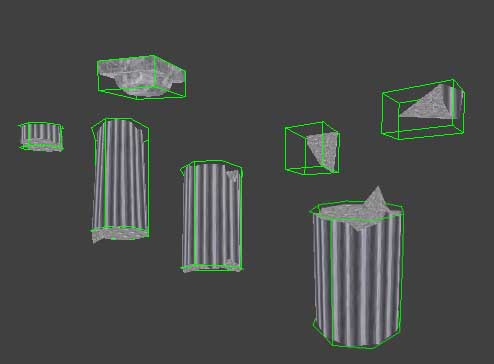

Because Karma takes into account the size of the Karma Primitive in its calculations, the settings for each of the pieces can be made the same. Below you can see the changed fields highlighted to achieve the behavior of solid stone columns.

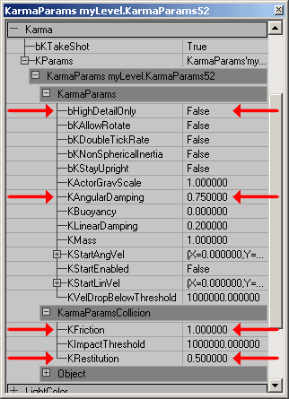

One should note that for ease of placement, just as in the punching bag described above, each column piece was given a common pivot point at the base of column. Also one other special measure taken in the creation of these columns in a third party modeling program is that they were *not* auto smoothed. This helps to hide the seams in the geometry of where the pieces come together.Some problems you may encounter with destructible geometry is that you can achieve somewhat unrealistic effects -such as a beach ball can knock down a solid stone column. There isn't any way to prevent this without changing any code at the moment, so keep in mind that whenever another Karma Actor collides with your destructible geometry, it will become active. Also it could also be possible to activate some sections of your destructible geometry while not activating others (for instance the tops of the columns). Again, there is no out of the box solution for this at the moment, but one way to minimize this effect is to have the Karma Primitives of each segment overlap with the adjoining Karma Primitives. This will however almost always cause all of the Karma Actors to trigger every other piece of your destructible geometry and also cause a slight popping as the Karma Primitives space themselves to no longer intersect.

### Ball and Chain

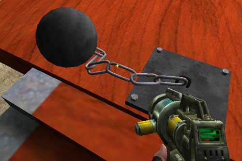

This is the most complex of the Karma objects in this example map. It is made up of three separate meshes: the ball, the link, and the base (each with their own Karma Primitives). Below you can see these pieces distinctly and with their Karma Primitives overlaid on them.

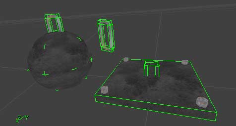

#### Ball KarmaParams

Since we need each of these parts to behave slightly differently, we shouldn't use the same KarmaParams for each piece. For the ball, the *KMass* is set at .5 so that it is not so massive that it cannot move, and its *KFriction* is set to 1 so that it will roll across surfaces and not just slip about.

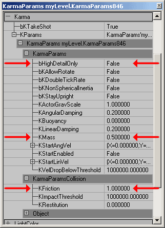

#### Link KarmaParams

For the chain link's the KarmaParams, it is best to set them with the first link and then duplicate that link to create the others, not the other way around. This will save you some time so you won't have to set the KarmaParams for several chain links when they are all the same. Since the mass of the links should be totally negligible in comparison to the ball, they can have their *KMass* set to 0. The other settings changed for the links are the *Damping* settings. These are both increased to 0.8 to prevent `jiggling' or rapid vibrating once they've been activated and the balls has come rest.

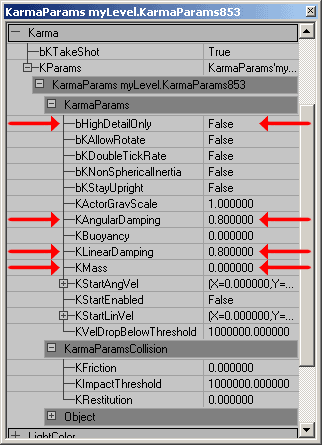

#### The Base

For the 2226 build, the base no longer needs to be a Karma Actor (and in fact should not be). Simply place the base in the level as a StaticMesh and do not assign a KarmaConstrain Actor to be attached to it. For the final chain link, it should have a KBSJoint that only connects to the last chain link with its **KConstraintActor2** field left blank.

## Tips and Pointers

Sometimes Karma can be a bit fussy, but there are work-arounds for many of the issues. This section outlines some of these issues and how you can work around them.

### Avoid Scaling Karma Actors in Unreal Ed

Karma Actors can be scaled in Unreal Ed but if they are not scaled uniformly, they will cease to function properly. Even if scaled uniformly though, they may not act how you might expect them to act. For instance even though you may double a Karma Actor using the *DrawScale* setting its *KMass* will not be doubled and it will weigh the same as the same Karma Actor with a *DisplaySize* of 1 in the game. It will however exhibit inertial values that will be somewhat more consistent with a Karma Actor that is double the size.If possible, it is almost always preferable to alter any scaling issues in the third party modeling program. Scaling the Karma Actors in Unreal Ed may result in unpredictable and inconsistent behaviors.

### Pivot Placement of Karma Actors

First of all, moving a pivot point of a Karma Actor in Unreal Ed should be avoided as it seems to move the Karma Primitive of the object allowing it to possible collide improperly. Also note that for buoyant Karma Actors, the pivot point should be at the center of gravity as this is how it is treated by the Karma EngineOne should also note that the pivot point of a StaticMesh is set as the origin of the model in the third party modeling program. Pivot point data is not stored within the ASE.

### Using Cylinder Karma Primitives (MCDCY)

Karma Cylinders tend to be a bit fussy upon importing into Unreal Ed. If you are trying to use them and you get an error message such as this, all is not necessarily lost:

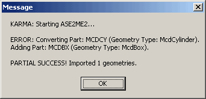

For whatever reason cylinders often need to be subdivided to be properly read by the import process, so just add an additional segment around the height of the Karma Cylinder and try re-importing. For more information on setting up the MCDCY or other Karma Primitives, see the [KarmaReference](../Content Creation/Physics/KarmaReference.md) doc.

### Karma Collisions *Through* Geometry

There are a few different cases when Karma may collide with geometry such that it seems to get stuck and slowly (or instantly) passes through to the other side. Most commonly, this happens when the Karma Actor is moving at very fast speeds it may not detect a collision until the Karma Primitive has already passed through the geometry in which case it will then just slowly sink out of the world. Setting an Karma Actor's *KMass* or *KGraveScale* too high may also cause the Karma Actor to sink out of the world.If a Karma Actor does leave the subtracted space of the world, the engine will experience a hitch as it repeatedly records error messages that detect this occurrence. This hitch is can be amplified if a log is open while you're running your game, as it will be further slowed by all the print statements. This seems to be a bug in the Karma Engine and at the moment there is no fix for it.

### Karma with Movers

To use Karma with Movers you must first have a Mover with a Karma hull. Then set up the Mover as you would any other with the exception of one property. Under the collision properties set bBlockKarma to True.

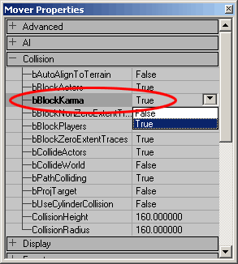

This will allow Karma Actors to react to this Mover, but only activated Karma Actors. Be sure to set the KStartEnabled Karma property to True of any Karma Actors that you want to react to this Mover, otherwise, the Mover will clip right through them as if they weren't there.

## Downloads

Below you can download a compressed archive that contains the content for this example:

* [EM\_KarmaColosseum.zip](../assets/EM_KarmaColosseum.zip) (for Unreal Engine 2 build 2226)
