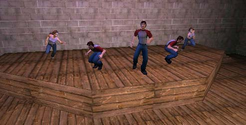
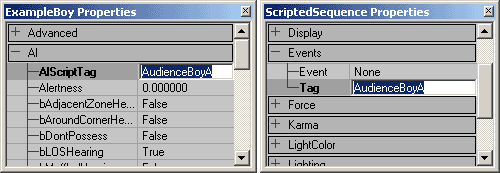
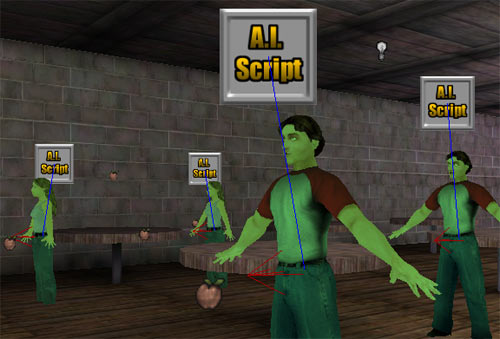
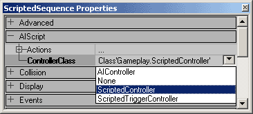
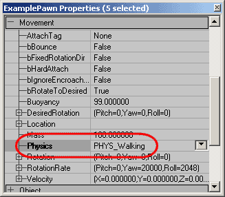
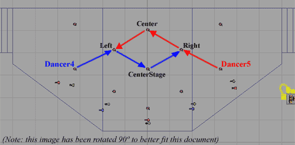
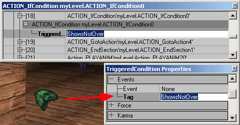
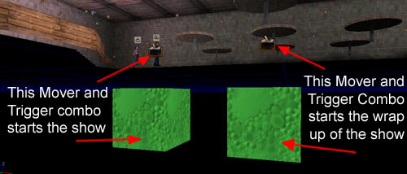
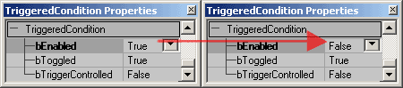

# Scripted Sequences Example Map (Runtime version)

*Document Summary: This example map demonstrates how to set up and use Scripted Sequences in the 2226 Runtime build.**Document Changelog: Last updated by Jason Lentz (DemiurgeStudios?) for creation purposes. Original author: Jason Lentz (DemiurgeStudios?).*

* [Scripted Sequences Example Map (Runtime version)](ExampleMapsScriptedSequencesRT.md#scripted-sequences-example-map-runtime-version))
  + [Introduction](ExampleMapsScriptedSequencesRT.md#introduction)
    - [The Plan](ExampleMapsScriptedSequencesRT.md#the-plan)
  + [Setting up Scripted Sequences](ExampleMapsScriptedSequencesRT.md#setting-up-scripted-sequences)
    - [Setting Physics](ExampleMapsScriptedSequencesRT.md#setting-physics)
    - [Setting up Actions](ExampleMapsScriptedSequencesRT.md#setting-up-actions)
      * [MoveToPoint and Walk](ExampleMapsScriptedSequencesRT.md#movetopoint-and-walk)
      * [SetViewTarget](ExampleMapsScriptedSequencesRT.md#setviewtarget)
      * [Triggering Events](ExampleMapsScriptedSequencesRT.md#triggering-events)
      * [PLAYANIM and WaitForAnimEnd](ExampleMapsScriptedSequencesRT.md#playanim-and-waitforanimend)
      * [IfConditions and TriggeredConditions](ExampleMapsScriptedSequencesRT.md#ifconditions-and-triggeredconditions)
  + [Trouble Shooting and Known Issues](ExampleMapsScriptedSequencesRT.md#trouble-shooting-and-known-issues)
  + [Downloads](ExampleMapsScriptedSequencesRT.md#downloads)

## Introduction

This example map demonstrates how to set up and use Scripted Sequences in the Runtime version of the Unreal Engine and uses the UDN character models. You will first need to download the *[examplepawns.zip](../assets/examplepawns.zip)* from the [MyFirstPawn](MyFirstPawn.md) site in the Technical section. Follow the instructions for setting up the example pawns in the Runtime and then you will be able to view this Example Map.

### The Plan

In this example, there are a series of characters all with their own scripted sequences. In starting the map there is a guy standing right in front of the player start that waits for a few seconds then goes over to join his friends and tells them to walk to the front with him. Behind that first guy is another who is waiting for the player to get close enough before he will advance to heckle the stage. All the way at the stage, there are three guys and two girls that all immediately start taking their places and once ready, they wait for the player to trigger the show.This document doesn't go over how to recreate this scene, but rather goes over the various details about how each of the different parts was set up.At the bottom of the doc you can download the zip file that contains the map file. Don't forget to download and install the *[examplepawns.zip](../assets/examplepawns.zip)* from the [MyFirstPawn](MyFirstPawn.md) document.

## Setting up Scripted Sequences

After you've place a pawn in the level and a Scripted Sequence Actor in the level you will need to link the two. This is done by giving a unique tag to the Scripted Sequence and then entering that tag into the AIScriptTag under the AI tab of the pawn. Here you can see the AIScriptTag of AudienceBoyA is set to match the Tag of the Scripted Sequence.

When you have your pawn selected, you will now see a blue line connecting the pawn to the AIScript.

Before you start adding Actions, you will need to set the proper ControllerClass. Below Actions in the AIScript tab of the Scripted Sequence properties, use the pull down menu to select **ScriptedController.**

Now you are ready to give this Scripted Sequence some Actions!

### Setting Physics

After the Scripted Sequence is correctly link to the pawn, the next thing you will want to set up is Physics type of the pawn. You can set this either under Movement tab or within Scripted Sequence Actions. In this example the dancing pawns have their physics set to Walking under their Movement tab like so:

The pawns in the audience all have their physics set in their Scripted Sequence within the Actions section of their AIScript tab like so:

If a pawn does not have its physics set, it will just float in the air (or wherever it has been placed) until it is activated and then it will fall to the ground and start doing whatever it is supposed to be doing.Note that in the level is appears as that all of the pawns have their feet embedded in the ground, but this is not the case. If you turn on Radii View in the view port you will see the collision center is all above the floor and this is where the pawn will appear when the game loads.

### Setting up Actions

When setting up the Actions within the Scripted Sequence, it is always a good plan to set up and test them incrementally. Scripted Sequences can easily become long and complicated and if something is going awry it is much easier to track down the problem if you've only added one or two new actions. Below are some tips for using some of the actions set up in this example.

#### MoveToPoint and Walk

The MoveToPoint Action can be used with anything that has a tag. Most commonly, just like in this example, it is used with PathNodes though. Below you can see how Dancer4 and Dancer5 switch sides on stage without running into each other.Dancer4 has the following Scripted Sequence Actions:  
Action 21 - MoveToPoint ==> Destination: Left  
Action 22 - MoveToPoint ==> Destination: CenterStage  
Action 23 - MoveToPoint ==> Destination: RightAnd Dancer5 has the following Scripted Sequence Actions:  
Action 21 - MoveToPoint ==> Destination: Right  
Action 22 - MoveToPoint ==> Destination: Center  
Action 23 - MoveToPoint ==> Destination: LeftIn the top down view, their paths look like this:

While using the MoveToPoint action, the pawns will by default run from Destination to Destination. If you want the pawns to walk, then you must precede the MoveToPoint Action with a Walk Action. This is done for the audience members on the left of the room. Each of the three pawns have their Action 6 set to Walk so that once they leave their first table, they will walk to their second.

#### SetViewTarget

The SetViewTarget can be a little tricky to get working sometimes, but is very useful. This command will cause the pawn to focus on any actor with a Tag that matches its ViewTargetTag. If you have this tag improperly set, then when you run the game, the player camera will jump to pawns perspective that has the broken ViewTargetTag. You can also use the log file to track down SetViewTarget problems. Just search for the word broken in the log and it should be relatively easy to track down the problem.Another problem that you may have while setting up SetViewTargets is that if you have a pawn that is using MoveToPoint to travel to the same PathNode that it has its SetViewTarget set to, it may sometimes behave oddly when it arrives at that PathNode. This exact problem was encountered when setting up the Scripted Sequences for the lead dancer, Dancer1.To prevent SetViewTarget Actions from getting confused, extra PathNodes
were added in the audience for the dancers to look at when they move to their PathNodes on stage.One additional thing to watch out for when setting up SetViewTargets is that sometimes they require a WaitForAnimationEnd in order for them to function properly. SetViewTargets can be finicky at times but often it is because something has been set up incorrectly.

#### Triggering Events

Once the dancers are all on stage and ready, they are all given the action WaitForEvent, and Dancer1 sends out a TriggerEvent action that activates a kind of Rube Goldberg style series of events. First a Mover hidden below the room rises pushing at trigger that is attached to it up through the ground where the player can see it. This Trigger, once activated, sends back the event to all the Dancers tell them to start their performance. Included in this performance are Events sent out to a MusicTrigger and TriggerLights about the stage, all of which are once again Triggered by Dancer1.In short, triggering events with Scripted Sequences is just as easy as triggering them with regular triggers. The only thing you need to watch out for when using the TriggerEvent and WaitForEvent is if a TriggerEvent is called before a pawn is listening for it using a WaitForEvent, then that pawn will never be activated. The WaitForEvent must always be called before the TriggerEvent for this combination to work.

#### PLAYANIM and WaitForAnimEnd

These two actions should always be used in pairs if you don't want an animation to loop. If you do want an animation to loop, just set the bLoopAnimation setting to True, and it will do so until interrupted by its next Action. Without the WaitForAnimEnd, a PLAYANIM action may not even start. Or if you have a series of PLAYANIM actions in a row, you will only see the last one animate since

#### IfConditions and TriggeredConditions

In the dancer's Scripted Sequences, IfConditions are used to determine if the Dancers should loop their dance movements or start wrapping up the show. To use an IfCondition you must the following things:

* An IfCondition Action
* An EndSection Action at the end of the Actions within the IfCondition
* A TriggerCondition actor
* Another event call that calls the TriggeredConditionTag in order to switch its condition

All of these actions work together like so. Once the IfCondition is reached, it will look for the TriggeredCondition with the tag that is set to the TriggeredConditionTag in the Scripted Sequence.

If that TriggeredCondition is set to bEnabled = False under the TriggeredCondition tab, the Scripted Sequence will skip to the EndSection Action not doing any of the Actions between the IfCondition and the EndSection. However if the TriggeredCondition is set to True, then it will follow through the all the Actions as if the IfCondition and EndSection were not there at all.In this example, the TriggeredCondition is initially set up to be True, but within the IfCondition is a GotoAction that sends the Scripted Sequence back to Action 7 thus causing the pawn to loop through a series of Actions until the TriggeredCondition is triggered.Below the floor is a second Mover and Trigger combination that is activated when the Dancers begin their show, but delayed for 30 seconds before it pushes its trigger through the floor. This Trigger has its collision radius set so that if the player is in the audience, he/she will activate this Trigger.

This Trigger (the one attached to the Mover on the right in the above picture) calls the event *ShowsNotOver* which causes the TriggeredCondition to toggle and thus the IfCondition in the Scripted Sequence skips to the EndSection allowing the dancers to start wrapping up their performance.

Each dancer must still go through their own sequence of Actions before they get to their own IfCondition though, so one more WaitForEvent was put in so that they wait for Dancer1 to finish his somewhat longer finale and then they all finish in unison.

## Trouble Shooting and Known Issues

If you are using Scripted Sequences for the first time you may find them to be quite finicky, but have patience. Here are some good tips to follow to keep you from falling into the same pitfalls that other before you have run into.**Don't duplicate Scripted Sequences**   
When creating new Scripted Sequences, do NOT copy old ones. Place a new Scripted Sequence from Actors Browser for each Pawn in your level. A copied Scripted Sequence will be a Reference copy that is tied to its original, meaning if you change a setting in one Scripted Sequence, you will most likely be changing it in its copy as well.**Double check your tags and Set the ControllerClass**   
If you don't set up Scripted Sequence properly (for example not setting up AI link or not setting to ScriptedController) AI may behave oddly. If you see the pawns traveling to some seemingly random spot in the map, you've most likely missed linking up an AI or have not set the ControllerClass properly. Another symptom of not having the ControllerClass set is that pawns will Respawn in at start points.**Watch out for SetTargetView errors**   
Sometimes the player camera will jump into one of the Actors controlled by a Scripted Sequence. This is Unreal's way of showing you which script is broken. Since this isn't a very clear way to see, you can usually check the log and it will say which script is broken and also what action in the script is broken**Leave no Actions Blank**   
Blank Actions or improperly set actions will cause a script to break. Delete empty slots when creating them and only add them when you need them.

## Downloads

In the [EM\_ScriptedSequencesRT.zip](../assets/[em_scriptedsequencesrt.zip](../assets/em_scriptedsequencesrt.zip)) file is the map file for this example. Be sure that you have downloaded and installed the *[examplepawns.zip](../assets/examplepawns.zip)* from the [MyFirstPawn](MyFirstPawn.md) page.
