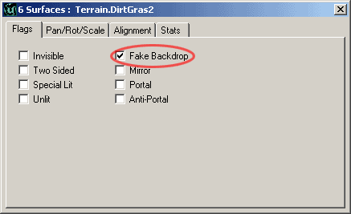
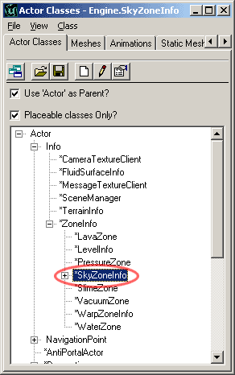
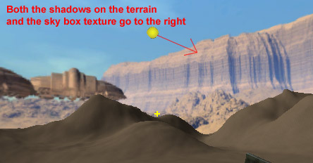
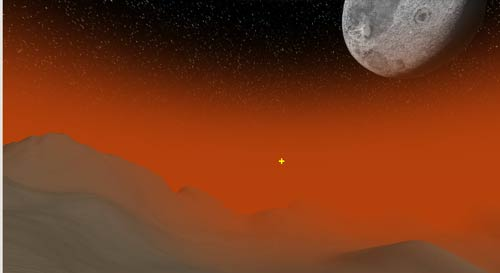
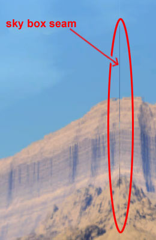
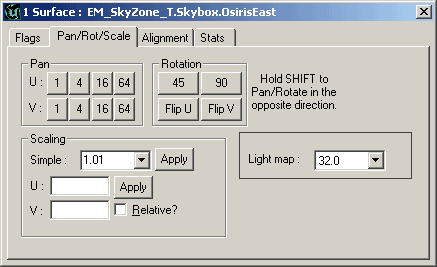
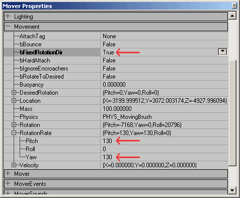

# SkyZones

*Last updated by Jason Lentz (DemiurgeStudios?), for creation purposes. Original author was Jason Lentz (DemiurgeStudios?).*

* [SkyZones](ExampleMapsSkyZones.md#SkyZones)
  + [Introduction](ExampleMapsSkyZones.md#Introduction)
  + [Setting up a basic Sky Box](ExampleMapsSkyZones.md#Setting up a basic Sky Box)
    - [Setting Up Your Level](ExampleMapsSkyZones.md#Setting Up Your Level)
    - [Placing the SkyZoneInfo](ExampleMapsSkyZones.md#Placing the _SkyZoneInfo)
    - [Lighting the SkyZone](ExampleMapsSkyZones.md#Lighting the _SkyZone)
    - [Adding Fog to the SkyZone](ExampleMapsSkyZones.md#Adding Fog to the _SkyZone)
  + [Different Types SkyZones](ExampleMapsSkyZones.md#Different Types _SkyZones)
    - [Sky Boxes](ExampleMapsSkyZones.md#Sky Boxes)
    - [Sky Cylinders](ExampleMapsSkyZones.md#Sky Cylinders)
    - [Sky Spheres](ExampleMapsSkyZones.md#Sky Spheres)
  + [Other Effects](ExampleMapsSkyZones.md#Other Effects)
  + [Downloads](ExampleMapsSkyZones.md#Downloads)

## Introduction

This document describes how to create a variety of different SkyZones including Sky Boxes, Sky Cylinders, and Sky Spheres as well as various effects like geometry in the SkyZone and panning textures. At the bottom of this document you can download the specific examples used in this document.

## Setting up a basic Sky Box

To create a SkyZone, you really only need a BSP zone with all its surfaces set to be Fake Backdrop and another separate zone with a SkyZoneInfo inside it. To create a *high quality* SkyZone, will require quality art and a few additional features available in the Unreal Editor. This section will step you through the process of creating the best SkyBox you can.

### Setting Up Your Level

The first thing you will need to do before you place your SkyZone is to select all of the BSP surfaces that make up the "sky" to your level, or rather, whichever surfaces through which you would like to see the SkyZone. To speed up this process, if you have just one subtracted volume, just click on one surface and then Ctrl + B to select the rest of the surfaces. Once all of the surfaces are selected, open up the Surface Properties window (Surface Properties hot key = F5) and then set them all to be Fake Backdrop.

This will also allow a Sunlight Actor to cast light into the level. Otherwise the outer BSP volume would cast a giant shadow on everything inside of it.

### Placing the SkyZoneInfo

Now you're ready for placing your SkyZone. Find a section of your level that falls outside your subtracted BSP volume and create a separate subtracted BSP volume. It doesn't need to be that large; it just needs to be its own zone and not in any line of sight that would only be blocked by the sky of your level (i.e. through the surfaces you set to be Fake Backdrop). Inside this new zone place a SkyZoneInfo by selecting SkyZoneInfo from the Actor Browser. Be sure you place the SkyZoneInfo at the same height as the horizon line of the sky in the sky box and from the top down view, place it directly in the center.

Now when you run the game, instead of seeing the surfaces you assigned as Fake Backdrop, you will see your Sky zone, and it will move with the player making it appear as if it is infinitely far away. You may still need to light your SkyZone, but this can be done a number of ways.

### Lighting the SkyZone

Since the SkyZone will appear infinitely far away, it can be set to be Unlit from the Surface Properties window (the same window you used to set the Fake Backdrop surfaces earlier). Take notice though, that if you are using a SunLight, be sure that it is facing the same way that the light in the textures of your sky box is facing.

### Adding Fog to the SkyZone

When adding DistanceFog to your level with a SkyZone you will need to make certain adjustments in your SkyZone or else geometry may pop in and out as it is occluded by the Distance Fog. To avoid this you will need to create a region around the horizon of the SkyZone that is the same color as the DistanceFogColor. This can be done in two ways. You can build a gradient from the solid DistanceFogColor within your sky box texture, or you can add a *Fog Ring* to your SkyZone.If you are not using a Fog Ring, make sure all sections that are eyelevel in the SkyZone are the color of the DistanceFogColor. This allows the SkyZone and the DistanceFog to blend into each other gracefully so as to prevent popping as the DistanceFog occludes geometry. In the EM\_SkyZone2.unr you can see an example of the gradient built into a sky cylinder.

The addition of a Fog Ring though, can lend a little more flexibility to a SkyZone. In EM\_SkyZone3.unr, a fog ring has been placed inside a sky sphere which allows the sky sphere to rotate about an odd axis while the fog ring remains steady at horizon level giving the DistanceFog something to dissolve into.

## Different Types SkyZones

Each type of SkyZone has its advantages and disadvantages. Below you will see brief explanations of how to best use each type of SkyZone.

### Sky Boxes

While the box is the simplest in form and can be created without a StaticMesh, is also the most difficult to work with. Aside from just capturing six images to form a perspective illusion from the center, you will also find that there are small seams where each of the edges meets.

Often these seams are just ignored, but they can be minimized in one of two ways, either by using a StaticMesh for the Sky Box or using BSP with a little extra work. It is recommened that you just use a StaticMesh? Sky Box if you can, but if this is not an option, you can follow the below procedure.To correct the seams with BSP, open up the Surface Properties window again and then tweak each of the texture's scale so it's slightly larger than the surface it is on, and if necessary us the Pan U and Pan V buttons to realign the textures.

A mildly quicker way to minimize these seams is to clamp each of the textures in the U and V directions by opening up the properties for each texture although it still can leave a small seam and often requires panning each of the textures slightly in both the U and V directions to avoid horrible stretching.In the attached EM\_SkyZone1.unr, the textures were each set to clamp in the U and V directions and then the sky box surfaces were scaled by 1.01 and then realigned by panning the textures into position.

### Sky Cylinders

Sky cylinders are the most versatile of the sky zone types and work well on their own or in conjunction with another type. When creating a sky cylinder, remove the top and bottom of the sphere and simply use the subtracted BSP SkyZone surfaces to cap your SkyZone.In the EM\_SkyZone2.unr map you can see how a simple cylinder with a gradient texture applied to the top of the subtracted BSP SkyZone surface can create a dynamic sky line. Sky cylinder textures need only wrap in one direction and can also be layered and given panning shaders to simulate moving clouds.

### Sky Spheres

Sky spheres, like sky cylinders, can be used to achieve more complex effects within your SkyZone. In the EM\_SkyZone3.unr map, the sky sphere is set at a tilt and rotating on an off angle using the *bFixedRotationDir* and the *RotationRate* properties under the Movement tab. Note that to have your StaticMesh move, it must be placed in the world as a Mover.

As mentioned above, different sky shapes can be used together, and in this example you can see how a sky cylinder can be used as a fog ring with a sky sphere to allow for a more interesting environment.

## Other Effects

There are many more effects that can be achieved with SkyZones. Other geometry can be added within the SkyZone to give the effect that the player is in suburb of a cloud metropolis with other far off structures, or in a vast deep sea setting that's rich with living sea creatures. Panning shaders can also be used to create the illusion of passing clouds and particle systems can be turned into far off thunder storms (as seen in EM\_SkyZone2.unr).And don't forget that not all of the illusions need be in the SkyZone. The effects are best when layered both in the SkyZone as well as in the level itself. In short, the possibilities are vast, so have fun with them!

## Downloads

Below you can download a compressed archive that contains the content for this example:

* [EM\_SkyZone.zip](../assets/EM_SkyZone.zip) (for Unreal Engine 2 build 2226)
* [EM\_SkyZones\_RT.zip](../assets/EM_SkyZones_RT.zip) (for Unreal Engine 2 Runtime)
