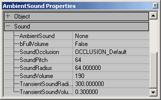
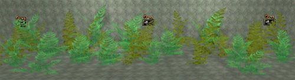
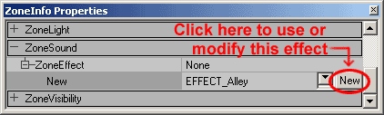
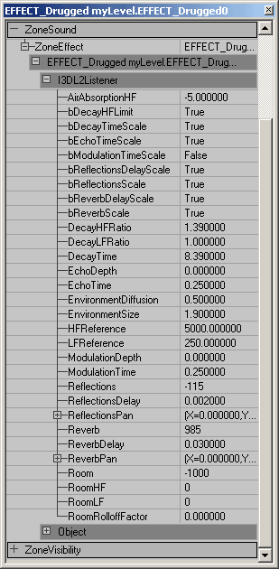
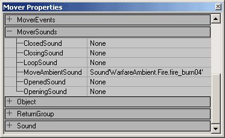

# Sounds Tutorial

*Document Summary: A comprehensive look at how to play sounds in a variety of ways. Good for beginners, but even advanced users may want to look through the properties enumerated in these lists.**Document Changelog: Last updated by Chris Linder (DemiurgeStudios?) to clarify ambient sound settings. Updated by Tom Lin (DemiurgeStudios?), for document summary. Original author was Jason Lentz (DemiurgeStudios?).*

* [Sounds Tutorial](ExampleMapsSounds.md#sounds-tutorial)
  + [Introduction](ExampleMapsSounds.md#introduction)
  + [AmbientSounds](ExampleMapsSounds.md#ambientsounds)
  + [ZoneInfo Sounds](ExampleMapsSounds.md#zoneinfo-sounds)
    - [ZoneEffects](ExampleMapsSounds.md#zoneeffects)
  + [Sounds in StaticMeshes and Movers](ExampleMapsSounds.md#sounds-in-staticmeshes-and-movers)
  + [Triggerable Sounds](ExampleMapsSounds.md#triggerable-sounds)
  + [Downloads](ExampleMapsSounds.md#downloads)

## Introduction

In this document you will learn how to place and use AmbientSounds, ZoneInfo Sounds, sounds associated with actors, and triggerable sounds. This document assumes that you are familiar with the UnrealEd Interface and that you can create or have access to your own raw sound files. For the purposes of creating your own example map, this document assumes that you already have a level, with BSP Zones, StaticMeshes, Movers and Triggers.

## AmbientSounds

To place an AmbientSound, you must open up the Actors Browser and go to Actor --> KeyPoint --> AmbientSound. Then just simply right click in your level to place the AmbientSound actor.

All of the settings for this sound are found in the properties window.

The following is a description of what each setting controls:

| Property | Description |
| --- | --- |
| AmbientSound | From here you will apply the sound you have selected in the Sound Browser to this AmbientSound Actor. This is the ambient looping sound effect of this actor. AmbientSound can be set on any *Actor*; it does not need to be an *AmbientSound* from the Actor Browser. The sound must be mono to be heard in 3D. If the sound is stereo it will not play in 3D. Because the sound is not played in 3D, it will not attenuate with distance nor will there be any stereo separation based on the direction of the sound. The stereo sound will play at full volume when you are inside the *SoundRadius* and will not play at all outside the radius. |
| bFullVolume | If this is set to true, the ambient sound of this actor will ignore the *AmbientVolume* settings in *<your\_game>.ini*. See *SoundVolume* below for more details about volume. |
| SoundOcclusion | *SoundOcclusion* has four settings: OCCLUSION\_Default - behaves like OCCLUSION\_BSP described below; OCCLUSION\_None - sounds will not be occluded at all; OCCLUSION\_BSP - sounds will be occluded by BSP; OCCLUSION\_StaticMeshes - sounds will be occluded by static meshes and BSP. Occlusion works by dropping the radius by 65% when the actor making the sound is occluded based on the settings described above. Because the radius of the sounds is reduced the sound will be quieter. Occlusion does not always take place instantly. The radius change is interpolated over time to make the transition smooth. |
| SoundPitch | *SoundPitch* is a scale clamped between 32 to 128. 64 is the default value which means play the sound at the normal pitch/speed. At 32 the sound is played at half the speed of the original sound, will take twice as long to play, and will sound one octave lower. At 128 the sound will be played at twice the speed, will take half as long to play, and will sound like it is one octave higher. This is ignoring Doppler shift which will additionally raise and lower the pitch of the sound. |
| SoundRadius | The value of *Radius* is 1/100 of the sound's maximum range in Unreal Units. So if you multiply the value of *Radius* by 100 you will get the distance at which you stop hearing the sound. The transition at the edge of the radius is not perfectly smooth. Once you step inside the sound radius you will suddenly be able to hear it. It will be faint but there is still a sharp discernible transition if you look for it. |
| SoundVolume | *SoundVolume* is a scale from 0, which is silent, to 255, which is the volume the sound plays at the sound browser in Unrealed. You cannot make sounds louder, only softer. It is possibly to enter a value greater than 255, but it will only loop the volume values so that a setting of 256=0, 257=1, and so on... *SoundVolume* is scaled by *AmbientVolume* which is a 0.0 to 1.0 multiplier for all ambient sounds. *AmbientVolume* is defined in *<your\_game>.ini*. |
| TransientSoundRadius | *does not affect ambient sounds* |
| TransientSoundVolume | *does not affect ambient sounds* |

In my map, I'll place a few AmbientSound Actors in a forest of ferns using a the sound files *insect\_noise02,* *creature\_amb03,* and *creature\_amb04.* The sounds will fade out into each other as you leave one and approach the others.

## ZoneInfo Sounds

An additional way to add sounds to your map is to add them through a ZoneInfo Actor that you place within your Zone. Just as in the AmbientSound Actor, you can open up the ZoneInfo Properties to assign a sound in the AmbientSound field under the Sound pullout. The Sound tab under the ZoneInfo properties does not affect the entire zone like you might expect. It functions just as an AmbientSound actor does. To create a blanket sound over an area or zone, you will need to assign several sources of sound until you've created a satisfactory blanket of sound actors.

### ZoneEffects

Under the ZoneSound tab though, you can select a ZoneEffect. Using these will act as a filter on any sounds you can hear from that zone. To use a ZoneEffect, select an effect that is similar to the effect you want and then click the "New" button.

**NOTE:** These settings will only work with an EAX 3.0 SoundBlaster Audigy card, and you will need to make sure that Unreal Ed is set to use EAX sound and to use 3DSound (these can be set in your UW.ini file in the System folder).By clicking on "New" you are telling the ZoneInfo to use that setting. There are a myriad of default settings here that include such ZoneEffects as a Hallway, a medium sized room of an ice palace, the effect of driving in a luxury car, everything in between and then some. However, if you cannot find your desired ZoneEffect, you can create your own. Just start with a ZoneEffect that is close to the effect you are looking for and then press the "NEW" button. Three tabs will appear, but you can only change the settings in the middle one "I3DL2Listener." Expand this tab.

Below are descriptions of what each of these settings control:

| Property | Description | Range |
| --- | --- | --- |
| AirAbsorptionHF | You can use this setting to simulate sound transmission through air of different consistency (foggy, dry, smoky, etc.,). The lower the setting, the more absorbent the air is. | [-100.0, 0.0] |
| bDecayHFLimit | If this is True, a high-frequency decay time automatically stays below a limit value that is derived from the setting of the *AirAbsorptionHF* and is independent of the *DecayHFRatio*. It is useful for maintaining natural sounding reverberation decay without risking an unnaturally long decay time at high frequencies. | [True/False] |
| bDecayTimeScale | If this is True, a change in *EnvrionmentSize* causes a proportional change in *DecayTime*. If False, a change in *EnvrionmentSize* will have no effect. | [True/False] |
| bEchoTimeScale | *information to be added later* | [True/False] |
| bModulationTimeScale | *information to be added later* | [True/False] |
| bReflectionsScale | If this is True, a change in *EnvironmentSize* causes a proportional change in *ReflectionsDelay* in effect causing the walls to become more distant as the room is made larger. | [True/False] |
| bReflectionsDelayScale | *information to be added later* | [True/False] |
| bReverbDelayScale | If True, a change in the *EnvrionmentSize* causes a proportional change of the *ReverbDelay*. Otherwise, the *EnvironmentSize* has no effect. | [True/False] |
| bReverbScale | If both this and the *ReflectionDelayScale* are True, an increase in the *EnvrionmentSize* causes an attenuation of *Reflections*. Otherwise, the *EnvironmentSize* has no effect on *Reflections*. | [True/False] |
| DecayHFRatio | The ratio of high-frequency decay time relative to the time set in DecayTime. A setting of 1.0 is neutral: the decay time is equal for all frequencies. Higher settings create more brilliant reverberation with longer decay at high-frequencies and at settings lower than 1.0, the reverberation is more natural. This value will be changed by changes in the *EnvironmentSize* setting. | [0.1, 2.0 seconds] |
| DecayLFRatio | low-frequency to mid-frequency decay time ratio | [0.1, 2.0] |
| DecayTime | reverberation decay time at mid frequencies | [0.1, 20.0 seconds] |
| EchoDepth | echo depth | [] |
| EchoTime | echo time | [] |
| EnvironmentDiffusion | This setting controls the density of echoes. A setting of 1.0 causes echoes to run into each other while a setting of 0.0 causes each successive echo to be separate and distinct. | [0.0, 1.0] |
| EnvironmentSize | This scales the apparent size of the surrounding "room" as expressed in Unreal Units. By changing this setting, a relative adjustment will be factored into the lower-level properties (*Reflections, ReflectionsDelay, Reverb, ReverbDelay*, and *DecayTime*) | [1.0, 100.0 unreal units] |
| HFReference | reference high frequency | [] |
| LFReference | reference low frequency | [] |
| ModulationDepth | modulation depth | [] |
| ModulationTime | modulation time | [] |
| Reflections | the volume of the initial reflections level relative to room effect. To simulate a narrow space, increase this setting. For semi-open environments maintain the default setting and reduce the *Reverb* setting. This value will be changed by changes in the *EnvironmentSize* setting. | [-10,000, 1,000 (hundredths of a dB)] |
| ReflectionsDelay | The delay between the arrival time of the direct path from the source to the first reflection from the source. This value will be changed by changes in the *EnvironmentSize* setting. | [0.0, 0.3 milliseconds] |
| ReflectionsPan | early reflections panning vector | [] |
| Reverb | late reverberation level relative to room effect. This value will be changed by changes in the *EnvironmentSize* setting. | [-10,000, 2,000 (hundredths of a dB)] |
| ReverbDelay | Late reverberation delay time relative to initial reflection. This value will be changed by changes in the *EnvironmentSize* setting. | [0.0, 0.1] |
| ReverbPan | Late reverberation panning vector | [] |
| Room | This is the master volume control for both *Reflections* and *Reverb*. It sets the maximum amount of reflections and reverberation added to the sound mix in the primary sound buffer (the listener). | [-10,000, 0.0 (hundredths of a dB)] |
| RoomHF | this further tweaks the reflected sound by attenuating it at high frequencies. | [-10,000, 0.0 (hundredths of a dB)] |
| RoomLF | this further tweaks the reflected sound by attenuating it at low frequencies. | [-10,000, 0.0 (hundredths of a dB)] |
| RoomRolloffFactor | This is one of two methods available in EAX to attenuate both *Reflections* and *Reverb*. Setting the RoomRolloffFactor to 1.0 specifies that the reflected sound will decay by 6 dB every time the distance doubles. Any other value than 1.0 is equivalent to a scaling factor applied by [(Source Listener Distance) - (Minimum Distance)]. | [0.0, 10.0] |

The effects that each of the ZoneEffects are very subtle, and the exact effect can be hard to distinguish when lots of sounds are being played, but they will effect every sound that can be heard from that zone. In this example map, a "Drugged" ZoneEffect is set in the small room and when comparing a single sound inside and outside that zone (where no ZoneEffect has been applied), the difference is very apparent.

## Sounds in StaticMeshes and Movers

Sounds can also be concealed in StaticMeshes through the same way of setting an AmbientSound Actor's properties, or assigning a Sound in a ZoneInfo. All Actors have the ability to have a sound assigned to them, simple open up the Sound rollout in their properties window and set the sound as desired. Movers have a little more flexibility though as they have their own special rollout called **MoverSounds**.

These are explained in greater detail in the [MoversTutorial](../Content%20Creation/Primitives/MoversTutorial.md), but their names are fairly self explanatory of how they work. These are useful for setting the sounds for doors opening and closing, elevators moving, and any other sound that would be associated with moving geometry.

## Triggerable Sounds

This section to be added later.

## Downloads

Below you can download a compressed archive that contains the content for this example:

* [SoundsDemo.zip](../assets/soundsdemo.zip) (for Unreal Engine 2 build 2226)
* [EM\_SoundsDemo\_RT.zip](../assets/em_soundsdemo_rt.zip) (for Unreal Engine 2 build 2226)

To run this example map just download the appropriate zip file and put the packages in their appropriate folders. Also see the [Epic Sounds ExampleMap](ExampleMapsEPIC.md#sound-example-map) (build 2110).
