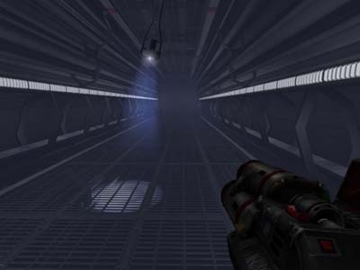
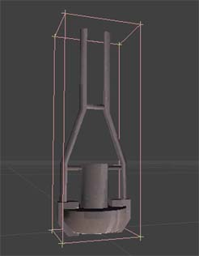
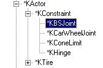
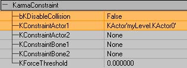
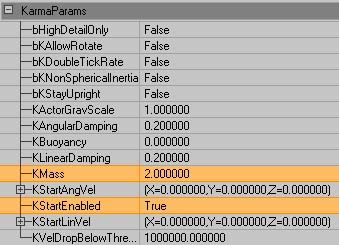
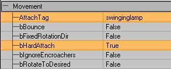
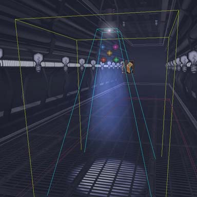
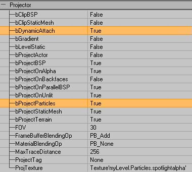
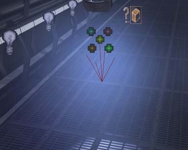
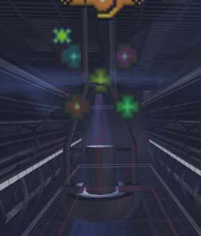

# Swinging Light Fitting

*Document Summary: A detailed look at how to make a high-quality (but expensive) swinging lamp. Assumes knowledge of Karma, projectors and emitters. For intermediate users.**Document Changelog: Last updated by Tom Lin (DemiurgeStudios?), for document summary. Original author was Rob Hale ([UdnStaff](https://udn.epicgames.com/Main/UdnStaff)).*

* [Swinging Light Fitting](ExampleMapsSwingingLamp.md#Swinging Light Fitting)
  + [Introduction](ExampleMapsSwingingLamp.md#Introduction)
  + [Dynamic Projectors](ExampleMapsSwingingLamp.md#Dynamic Projectors)
  + [The light Fitting](ExampleMapsSwingingLamp.md#The light Fitting)
  + [Setting up the Projector](ExampleMapsSwingingLamp.md#Setting up the Projector)
  + [The Emitter](ExampleMapsSwingingLamp.md#The Emitter)
  + [Final Notes](ExampleMapsSwingingLamp.md#Final Notes)
  + [Downloads](ExampleMapsSwingingLamp.md#Downloads)

## Introduction

This map demonstrates how to use Karma, projectors and emitters to create a neato swinging lamp effect. I am assuming the reader is comfortable with using Emitters/projectors already and won't be going into minute detail about setting up these systems.This is an extension of the Lightbeams effect seen in [ExampleMaps](../Content Creation/Techniques/ExampleMaps.md).



## Dynamic Projectors

What makes this effect at all possible is the addition of dynamic projectors in 2107 allowing a projector to be attached to a karma actor and subsequently flung about as much as you please. If you are using the 927 build of Unreal though you may need to create a new subclass of projector with this simple block of code:

```

//=====================================================================
// DynamicProjector.
//=====================================================================

class DynamicProjector extends Projector;

function Tick(float DeltaTime)
{
   DetachProjector();
   AttachProjector();
}

defaultproperties
{
     bStatic=False
}
```

This basically detaches and reattaches the projector every engine tick so it's position is updated appropriatly.There are still some bugs with dynamic projectors though. For example a dynamic projector will always project onto BSP surfaces even if *bProjectBSP* is false.

## The light Fitting

A simple piece of Karma engineering this, a Ball and socket constraint attaches the Kactor (in this case a lamp from UT2003) to the game world. I originally tried this with a Cone Limit constraint so the lamp's range of movement was restricted and it wasn't going to swing through the ceiling. However attaching a cone constraint to the world didn't seem to work and the lamp would just fall to the ground.



Karma Constraints are used all the time in RagDolls and between Karma Actors when they collide. They can also be added by a Level Designer to attach Karma Actors to each other or the world. There are 3 types of Constraint of interest to Level Designers: Ball and Socket Joint, Cone Limits and Hinges. Of these three the Ball and Socket (KBSJoint) is the simplest to setup and use. Select it from your actor browser and add it to the world the same way you would add any other actor.



Position the constraint so the center (not the arrow) is at the point you want your Kactor to move around and open up it's properties window. Expand the **KarmaConstraint** properties and set *bkDisableCollision* to False so that it will collide with the game world (this setting is normally used when attaching two Kactors to each other). *KconstraintActor1* wants to be set to your Kactor (the lamp) and everything else should be left blank. Your Kactor should now be attached to the world at the location of the constraint and will rotate freely around that constraint in all directions.



The mass of the lamp was increased from 1 to 2 to stop it swinging too easily and getting out of control. In this case I also set Karma to activate the lamp on map load rather than when something happens. This gives the lamp a gentle oscilating movement as it swings gently. If all you're wanting is something like that I recommend using an oscilating texture modifier ([MaterialTutorial](../Content Creation/Lighting and Textures/MaterialTutorial.md)) for the projector and a static lamp.



## Setting up the Projector

The projector setup itself is fairly simple (See the [ProjectorsTableOfContents](ProjectorsTableOfContents.md) for more info on seting up projectors) and the only difference between this and a normal static projector is the attached tag in **Movement**. Setting this to the tag of the Kactor (swinginglamp in this case) will cause the projector to swing with the lamp.Setting *bHardAttach* to True in the projectors **Movement** properties makes sure the projector inherits the Kactor's rotation as well as position.NOTE: *bHardAttach* is only available in build 2107 and you may notice some rotation problems on older versions of the engine that don't have it.



It is worth noting at this point that because of the particles (more on them later) it is best to setup the projector as realistically as possible. The screenshot below illustrates this point.



As you can see the drawscale of the projector has been adjusted so it is only as wide as the light emitting part of the lamp with the field of view determining the final size of the projected texture. This is so the "beam" created by the particles appears accuratly. Normally when setting up projectors such steps are rarely needed as the beam itself is not visible.To get the projector to affect particles you need to set *bProjectParticles* to True in the **Projector** properties and *BlockNonZeroExtents* to True in the projectors **Collision** properties (this is the default setting in 2107).



I also added a corona to the projector in the same way I would add one to a normal light (See the [LightingBasics](../Content Creation/Lighting and Textures/LightingBasics.md) for more on Coronas). The reason for this being that coronas added to lights are static and won't swing with the lamp. The only drawback of adding it to the projector is the lack of control over the coronas size compared to a seperate actor.Now you can run the level and shoot the lamp to watch the light projecting all over the walls and floor groovy isn't it?

## The Emitter

This is the stage that makes the effect really come to life and can also cripple your frame rate if you aren't careful so take heed. This technique uses a fairly standard sprite emitter ([EmittersReference](../Content Creation/Effects/EmittersReference.md)) with *bAcceptProjectors* set to True in it's **Rendering** properties. Below are some tips for acheiving good effects without a huge framerate hit.

* Use large flat particles with long lifetimes and slow velocities

* Experiment with different sprite orientations, I find *PTDU\_Up* works quite well but it really depends on your situation.

* Only have particles in the area you want to be affected, it may be a more complete simualtion to fill a room with particles but it'll cost you alot more in framerate.



* The colour of the particles in the example is created with a colorscale and not taken from the projector.

* If you have alot of particles in a room accepting projectors the particles not within a projectors field of view may still show up but alot darker.

* Projectors will affect particles that are above (or behind) it's Field of View.



## Final Notes

* This IS a high detail effect and it isn't recommended for low speced machines or console use as the hit to the framerate is quite high even with optimizations. Use it sparingly.

## Downloads

Below you can download a compressed archive that contains the content for this example:

* [SwingingLight-2107.zip](../assets/SwingingLight-2107.zip) (for Unreal Engine 2 build 2107 - uses some Textures and Meshes from UT2003)
