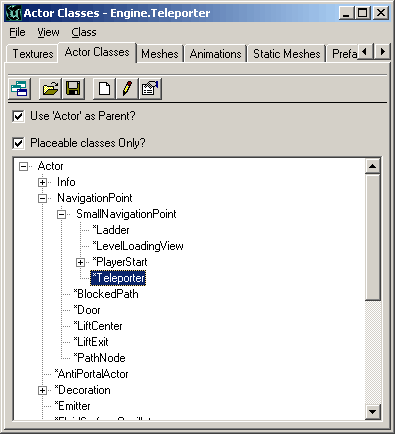
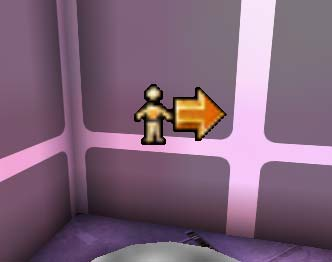
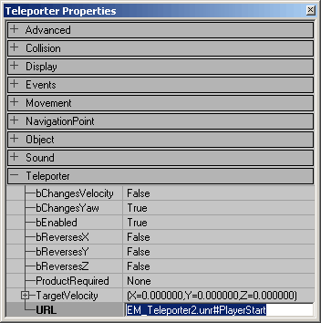
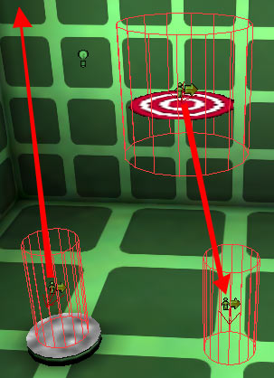
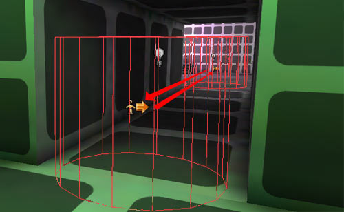
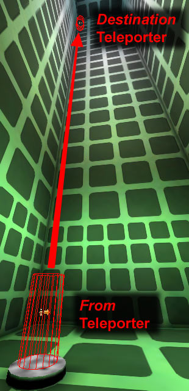
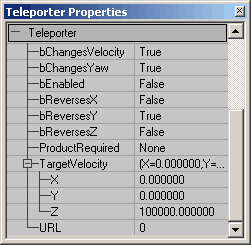

# Teleporters

*Document Summary: A thorough look at how to set up teleporters. Basic level setup ability is required. Intermediate skill level recommended.**Document Changelog: Last updated by Tom Lin (DemiurgeStudios?), for document summary. Original author was Jason Lentz (DemiurgeStudios?)*

* [Teleporters](ExampleMapsTeleporters.md#Teleporters)
  + [Introduction](ExampleMapsTeleporters.md#Introduction)
  + [Teleporting to Another Map](ExampleMapsTeleporters.md#Teleporting to Another Map)
  + [Teleporting Within a Map](ExampleMapsTeleporters.md#Teleporting Within a Map)
    - [One-Way](ExampleMapsTeleporters.md#One-Way)
    - [Two-Way Teleporters](ExampleMapsTeleporters.md#Two-Way Teleporters)
    - [Random](ExampleMapsTeleporters.md#Random)
    - [Teleporting with Velocity and Rotation](ExampleMapsTeleporters.md#Teleporting with Velocity and Rotation)
  + [Downloads](ExampleMapsTeleporters.md#Downloads)

## Introduction

Teleporters are actors that when triggered will load a map and start the player in tha tmap as if the player was starting it for the first time. At the bottom of the document are two example maps that demonstrate how to set up and use Teleporters to shift between different maps. This document assumes that you know the basics of how to use Unreal Ed and can create a basic level.

## Teleporting to Another Map

All you really need to have a functioning Teleporter, is a Teleporter Actor and a map PlayerStart in another (or the same) map to teleport to. To place a Teleporter in your level, open up the Actors Browser and expand the following tabs to navigate to the Teleporter Actor:**Actor --> NavigationPoint --> SmallNavigationPoint --> Teleporter**

Then right click in the level where you want the Teleporter Actor to be. You will see an icon in your level that looks like this:

Next open the Teleporter Actor's properties and enter the name of the map you want to teleport to complete with the .unr file extension and then immediately followed by a "#" and the Actor you wish to start at.

This can either be a PlayerStart or another Teleporter Actor, although if you do use another Teleporter Actor be warned that you will immediately be re-teleported unless its **bEnabled** field is set to False.It is also possible to launch the default web browser using the URL field. Just include **"http://"** at the beginning of the URL field in the Teleporter properties. This would be useful for on line games that need to download content from the web and possibly other online uses as well.

## Teleporting Within a Map

Teleporters have much more functionality when used to teleport within the same level. The following section shows how to use each of these features.

### One-Way

To set up a one-way Teleporter you will need to place two Teleporter Actors in your level. Give the *destination* Teleporter a Tag, and then in the *from* Teleporter, make sure the URL matches that tag. Then you can either leave the *destination* Teleporter's URL field blank and/or set the **bEnabled** field to *False.*

### Two-Way Teleporters

For a two-way Telepoter, you will of course also need to Teleporter Actors in your level, and fill out each of their corresponding URL and Tag fields to match with other Teleporter's Tag and URL fields. In game a Teleporter will only be triggered the after you re-enter the CollisionRadius of that Teleporter, so when you teleport to another Teleporter, you will not be sent into an endless loop of teleporting beyond your control. If you want, you can also set the CollisionRadius under the Collision properties to increase the reach of a Teleporter Actor.In the EM\_Teleporters1.unr map you can see examples of both one way and two way Teleporters. In the hallway to the green room are a pair of two way Teleporters that will take you past the hallway. The Teleporter within the green room leads to a series of one way Teleporters. Play around with the Teleporter Actors in the levels to get a feel for how they work.

### Random

This is the easiest Teleporter to create. Just add one Teleporter that has a Tag that is the same as its URL and then duplicate it and place it in as many spaces as you would like to have a random Teleporter. If you'd like to have just one *from* Teleporter and several *destination* Teleporters just set all of the *destination* Teleporters **bEnabled** field to *\_False.*In the EM\_Teleporters1.unr map there are examples of random Teleporters. There are four rooms in the map, each connected by hallways, but you can enter any of the Teleporters (except for the one next to the "Welcome to Map #2" sign) and the will send you to one of the other Teleporters. Which one? No one knows. It's random!FYI the teleporter next to the sign will send you back to the first map.

### Teleporting with Velocity and Rotation

When using the bChangesVelocity and bChangesYaw fields, you will always be affecting the *destination* Teleporter.In the below map EM\_Teleporter1.unr there is an example of a one way Teleporter that sends the player to a Teleporter position half way up a tall room and from there sends the player further directly upward at a Velocity of 100,000.

**NOTE:** bChangesVelocity only works if you are in the air when you hit source teleporter (for instance if you jump into it instead of walking into it). You will either need to have a programmer fix this in code or construct your levels so that players are always fall into Teleporters in order to take advantage of the bChangesVelocity functionality.Also the *destination* Teleporter has its **bChangeYaw** field set to *True* and the **bReverseY** field is set to *True.* This will cause the player to reverse his direction in the Y plane from when he entered the *from* Teleporter in effect causing the player to face the door as he leaves the *destination* Teleporter (assuming the player enters the Teleporter from the hallway).Below you can see how each of the properties are set for the *destination* Teleporter:

For testing this portion of the map, I've included another one way teleporter that returns your velocity to 0 and places you on the ground at the center of this room. Just aim for the bullseye and you should be fine.

## Downloads

Click the links to download compressed archives of the example maps and content discussed in this document:

* [EM\_Teleporters.zip](rsrc/Two/ExampleMapsTeleporters/EM_Teleporters.zip)
