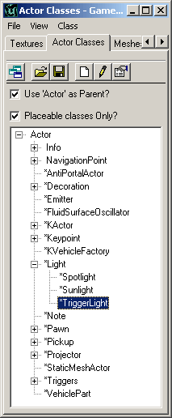
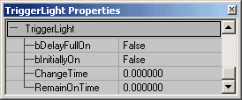

# Triggerable Lights

*Document Summary: An example of how to set up lights that can be triggered in sequence. Requires limited information on triggers and lights. Novice to intermediate level.**Document Changelog: Last updated by Tom Lin (DemiurgeStudios?), for document summary. Original author was Jason Lentz (DemiurgeStudios?).*

* [Triggerable Lights](ExampleMapsTriggerableLighting.md#triggerable-lights)
  + [Introduction](ExampleMapsTriggerableLighting.md#introduction)
  + [Ingredients](ExampleMapsTriggerableLighting.md#ingredients)
  + [Setting up a TriggerLight](ExampleMapsTriggerableLighting.md#setting-up-a-_triggerlight)
  + [TriggerLight Effects](ExampleMapsTriggerableLighting.md#triggerlight-effects)
    - [Running Lights](ExampleMapsTriggerableLighting.md#running-lights)
  + [Downloads](ExampleMapsTriggerableLighting.md#downloads)

## Introduction

This map demonstrates how to create triggerable lights. Below you will see how to create a few simple effects. This document assumes that you know how to create and use Triggers, are familiar with Lights, and that you are familiar with the UnrealEd Interface.

## Ingredients

* A few TriggerLights
* A Trigger for every TriggerLight you wish to activate separately

## Setting up a TriggerLight

To place a TriggerLight, simply open up your Actors Browser and expand the following roll outs: *Actor --> Lights --> TriggerLights.* Then right click in a viewport and select the Add TriggerLight option.

It will look like a regular light actor, except in its properties window you will have a few more options (namely under the TriggerLight rollout).

These fields control the following things:

* **bDelayFullOn** - If this is set to True, the TriggerLight will gradually turn on for the time specified in the ChangeTime field below. Otherwise after the ChangeTime, the TriggerLight will turn on at full strength.
* **bInitiallyOn** - If this is set to True, the TriggerLight will remain on until the light is triggered. If False, it will be initially off.
* **ChangeTime** - This field determines the time the light will wait until it turns on or off after being triggered.
* **RemainOnTime** - Here you can enter a delay time for how long it will take for the light to remain on after it has been triggered off if the state is TriggerPound? (see below).

There is also a non-obvious setting that you will need to set up, so as long as you have the TriggerLight Selected, expand the following rollouts and change this setting:

* **Lighting --> bDynamicLight: True**

If these are not set as such, the TriggerLight will always remain on.Now you will need to add the second part of the TriggerLight, a Trigger. The Trigger is added in the same manner as the TriggerLight is added ( *Actors --> Triggers --> Trigger* ). Once you have the Trigger in the level, set up the corresponding Tag and Event of the TriggerLight and the Trigger respectively.You will also need to set the following properties in these rollouts:

* **Object --> InitialState: OtherTriggerToggles**

* **Trigger --> ReTriggerDelay: .05** *(this prevents the Trigger from being toggled too quickly)*

Now you have a functioning TriggerLight. Run your level and test it out!

## TriggerLight Effects

Some of the more basic effects you can do with TriggerLights flashing red lights as if you've tripped an alarm, spinning hazard lights that can be triggered when in an operator's chair for a vehicle, or a series of running lights triggered to flow in a pattern.

### Running Lights

For this example, set up a new Trigger and TriggerLight pair and once you have the appropriate effect chosen for you TriggerLight, you will be ready to lay them out in your desired path. In this example map, the TriggerLight is set to be a dim blue light with a shorter radius and given the LightType: LT\_Pulse. The bDelayFullOn has been set to False so that the TriggerLights gradually turn on and lead into the next one.Next lay out your first set (some factor of ten would probably be best) TriggerLights by copying your first one and setting them in the path you wish them to follow. It is a good idea to make sure that they are in their own unique group to facilitate selecting them all at once if you wish to change something later.

Now go through each one and set the ChangeTimes for each one incrementally. In this example they are set at .5 second intervals, with the first one starting at 0. Now you can copy and paste this initial set as a group and only have to alter the first digit of the ChangeTime of the following TriggerLights.Once triggered, these TriggerLights will turn on in sequence. When you toggle the trigger, the TriggerLights will then begin to turn off in sequence.

## Downloads

Below you can download a compressed archive that contains the content for this example:

* EM\_TriggerableLights.zip (for Unreal Engine 2 build 2226)
* [EM\_TriggerableLights\_RT.zip](../assets/em_triggerablelights_rt.zip) (for Unreal Engine 2 Runtime)
