# Triggers Example Map

*Document Summary: An example map demonstrating how to use the various types of Triggers.**Document Changelog: Last updated by Jason Lentz (DemiurgeStudios?) for creation purposes. Original Author - Jason Lentz (DemiurgeStudios?)*

* [Triggers Example Map](ExampleMapsTriggers.md#Triggers Example Map)
  + [Introduction](ExampleMapsTriggers.md#Introduction)
  + [Example One: Triggers Map](ExampleMapsTriggers.md#Example One: Triggers Map)
    - [Trigger](ExampleMapsTriggers.md#Trigger)
    - [MaterialTrigger](ExampleMapsTriggers.md#MaterialTrigger)
      * [Setting up the Materials](ExampleMapsTriggers.md#Setting up the Materials)
      * [Setting up the Triggers](ExampleMapsTriggers.md#Setting up the Triggers)
    - [LineOfSightTrigger](ExampleMapsTriggers.md#LineOfSightTrigger)
    - [MusicTrigger](ExampleMapsTriggers.md#MusicTrigger)
    - [Counter](ExampleMapsTriggers.md#Counter)
    - [UseTrigger](ExampleMapsTriggers.md#UseTrigger)
    - [ViewShaker](ExampleMapsTriggers.md#ViewShaker)
  + [Example Two: Triggers Map](ExampleMapsTriggers.md#Example Two: Triggers Map)
    - [TriggerCondition](ExampleMapsTriggers.md#TriggerCondition)
      * [TriggerCondition 1](ExampleMapsTriggers.md#TriggerCondition 1)
      * [TriggerCondition 2](ExampleMapsTriggers.md#TriggerCondition 2)
  + [Downloads](ExampleMapsTriggers.md#Downloads)

## Introduction

Triggers are actors in the level that send out "alerts" letting the game know that something has happened. There is a wide variety of types of Triggers and some Triggers are set up in special ways. This document will step you through the process of setting up each of the various types of Triggers.Note that there are two maps to download. The first map - [EM\_Triggers1.zip](../assets/em_triggers1.zip) - demonstrates the basic triggers you can use and is designed for any 2226 build (such as UDNBuild2226 or [CodeDrop2226](https://udn.epicgames.com/Two/CodeDrop2226)). The second map - [EM\_Triggers2.zip](../assets/em_triggers2.zip) - demonstrates TriggerConditions and will require Epic content from the [CodeDrop2226](https://udn.epicgames.com/Two/CodeDrop2226) build.For more information on Triggers, see the [TriggersTutorial](TriggersTutorial.md).

## Example One: Triggers Map

The [EM\_Triggers1.zip](../assets/em_triggers1.zip) file is a compressed archive that includes all of the triggers that do not require a pawn with some sort of firing weapon.It is designed for any 2226 build (such as UDNBuild2226 or [CodeDrop2226](https://udn.epicgames.com/Two/CodeDrop2226)).

### Trigger

This is the most basic trigger which you will most likely be using for most of your events. It is also required for some of the other Triggers to work (as seen in the next example). While this example map does not focus much on the generic Trigger, it is used several times through out the example map. The special Triggers that still require regular Triggers are the following:

* MaterialTrigger
* MusicTrigger
* Counter
* ViewShaker

### MaterialTrigger

The first Trigger you will find in the map is a MaterialTrigger. Using this type of Trigger will cause a MaterialSwitch material to advance through textures in a predefined array. To use a MaterialTrigger, you will need 5 things:

* the textures to cycle through
* a MaterailSwitch material
* a regular Trigger
* a MaterialTrigger
* geometry to apply the MaterailSwitch material to

#### Setting up the Materials

After gathering the textures you want to cycle through, you will need to add them to a MaterialSwitch material. To create this material open the Texture Browser and select "MaterialSwitch" from the Properties pull down.

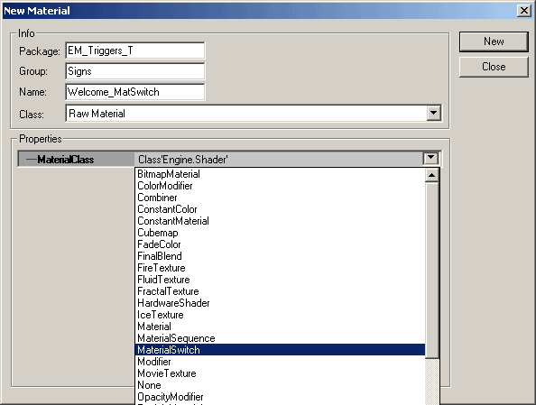

Then in the Properties window of the MaterialSwitch Add as many fields as you have textures your textures to those fields.

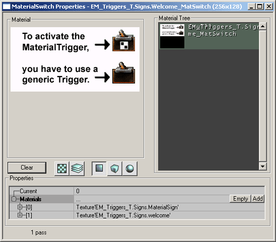

Whichever field number is displayed as "Current" will be the texture that is first shown as the game loads. Now you are ready to set up the triggers.

#### Setting up the Triggers

The generic Trigger is what actually activates the MaterialTrigger. Without it, the MaterialTrigger will not be activated. In this example map, the generic Trigger has the following fields changed from its default:

| [Section](https://udn.epicgames.com/bin/publish/WebHome?webs=Main%2CTwo%2CThree%2CPowered&amp;inclusions=%2A&amp;exclusions=&amp;filter=&amp;inclfilter=%5C%25META%5C%3AFIELD%5C%7Bname%5C%3D%5C%22Documentavailability%5C%22.%2Avalue%5C%3D%5C%22General%20public%5C%22&amp;filterbymeta=yes&amp;skin=static_udn3&amp;restrictedclass=restricted&amp;format=&amp;sortcol=0;table=1;up=0#sorted_table "Sort by this column") | [Property](https://udn.epicgames.com/bin/publish/WebHome?webs=Main%2CTwo%2CThree%2CPowered&amp;inclusions=%2A&amp;exclusions=&amp;filter=&amp;inclfilter=%5C%25META%5C%3AFIELD%5C%7Bname%5C%3D%5C%22Documentavailability%5C%22.%2Avalue%5C%3D%5C%22General%20public%5C%22&amp;filterbymeta=yes&amp;skin=static_udn3&amp;restrictedclass=restricted&amp;format=&amp;sortcol=1;table=1;up=0#sorted_table "Sort by this column") | [Value](https://udn.epicgames.com/bin/publish/WebHome?webs=Main%2CTwo%2CThree%2CPowered&amp;inclusions=%2A&amp;exclusions=&amp;filter=&amp;inclfilter=%5C%25META%5C%3AFIELD%5C%7Bname%5C%3D%5C%22Documentavailability%5C%22.%2Avalue%5C%3D%5C%22General%20public%5C%22&amp;filterbymeta=yes&amp;skin=static_udn3&amp;restrictedclass=restricted&amp;format=&amp;sortcol=2;table=1;up=0#sorted_table "Sort by this column") | [Explanation](https://udn.epicgames.com/bin/publish/WebHome?webs=Main%2CTwo%2CThree%2CPowered&amp;inclusions=%2A&amp;exclusions=&amp;filter=&amp;inclfilter=%5C%25META%5C%3AFIELD%5C%7Bname%5C%3D%5C%22Documentavailability%5C%22.%2Avalue%5C%3D%5C%22General%20public%5C%22&amp;filterbymeta=yes&amp;skin=static_udn3&amp;restrictedclass=restricted&amp;format=&amp;sortcol=3;table=1;up=0#sorted_table "Sort by this column") |
| --- | --- | --- | --- |
| Events | Event | *MaterialTrigger* | This is set to the tag of the MaterialTrigger. |
| Trigger | ReTriggerDelay | *2.0* | This keeps it from activating the trigger too quickly. |

Next you will need to set up the MaterialTrigger. You can find it in the Actors Browser by following Actor --> Triggers --> MaterialTrigger. The only settings you need to be aware of in this Trigger are the ones below:

| [Section](https://udn.epicgames.com/bin/publish/WebHome?webs=Main%2CTwo%2CThree%2CPowered&amp;inclusions=%2A&amp;exclusions=&amp;filter=&amp;inclfilter=%5C%25META%5C%3AFIELD%5C%7Bname%5C%3D%5C%22Documentavailability%5C%22.%2Avalue%5C%3D%5C%22General%20public%5C%22&amp;filterbymeta=yes&amp;skin=static_udn3&amp;restrictedclass=restricted&amp;format=&amp;sortcol=0;table=2;up=0#sorted_table "Sort by this column") | [Property](https://udn.epicgames.com/bin/publish/WebHome?webs=Main%2CTwo%2CThree%2CPowered&amp;inclusions=%2A&amp;exclusions=&amp;filter=&amp;inclfilter=%5C%25META%5C%3AFIELD%5C%7Bname%5C%3D%5C%22Documentavailability%5C%22.%2Avalue%5C%3D%5C%22General%20public%5C%22&amp;filterbymeta=yes&amp;skin=static_udn3&amp;restrictedclass=restricted&amp;format=&amp;sortcol=1;table=2;up=0#sorted_table "Sort by this column") | [Value](https://udn.epicgames.com/bin/publish/WebHome?webs=Main%2CTwo%2CThree%2CPowered&amp;inclusions=%2A&amp;exclusions=&amp;filter=&amp;inclfilter=%5C%25META%5C%3AFIELD%5C%7Bname%5C%3D%5C%22Documentavailability%5C%22.%2Avalue%5C%3D%5C%22General%20public%5C%22&amp;filterbymeta=yes&amp;skin=static_udn3&amp;restrictedclass=restricted&amp;format=&amp;sortcol=2;table=2;up=0#sorted_table "Sort by this column") | [Explanation](https://udn.epicgames.com/bin/publish/WebHome?webs=Main%2CTwo%2CThree%2CPowered&amp;inclusions=%2A&amp;exclusions=&amp;filter=&amp;inclfilter=%5C%25META%5C%3AFIELD%5C%7Bname%5C%3D%5C%22Documentavailability%5C%22.%2Avalue%5C%3D%5C%22General%20public%5C%22&amp;filterbymeta=yes&amp;skin=static_udn3&amp;restrictedclass=restricted&amp;format=&amp;sortcol=3;table=2;up=0#sorted_table "Sort by this column") |
| --- | --- | --- | --- |
| Events | Tag | *MaterialTrigger* | Make sure this matches the Event of the generic Trigger. |
| MaterialTrigger | MaterialsToTrigger | *select your MaterialSwitch* | Select your MaterialSwitch material in the Textures Browser and then hit the "Use" button . |

If you want you can trigger multiple MaterialSwitch materials with the MaterialTrigger, but in this example map, only one MaterialSwitch is used.Now the only thing left is to apply the MaterialSwitch material to the geometry you want it to appear on and you're ready to go!

### LineOfSightTrigger

A LineOfSight Trigger will cause an Event to happen once a *line of sight* can be established between the player and an Actor. Note though that much of the functionality of LineOfSight Triggers appears to be missing. Currently (build 2226) LineOfSight Triggers have the following restraints:

* It only works in single player mode
* It only triggers once
* The "line of sight" only works between the player and the LineOfSight Trigger

In this example map the LineOfSight Trigger is set up to trigger an explosion particle system. All that was needed was the LineOfSight Trigger and the particle system. Here the following properties you will need to set up in the LineOfSight Trigger:

| [Section](https://udn.epicgames.com/bin/publish/WebHome?webs=Main%2CTwo%2CThree%2CPowered&amp;inclusions=%2A&amp;exclusions=&amp;filter=&amp;inclfilter=%5C%25META%5C%3AFIELD%5C%7Bname%5C%3D%5C%22Documentavailability%5C%22.%2Avalue%5C%3D%5C%22General%20public%5C%22&amp;filterbymeta=yes&amp;skin=static_udn3&amp;restrictedclass=restricted&amp;format=&amp;sortcol=0;table=3;up=0#sorted_table "Sort by this column") | [Property](https://udn.epicgames.com/bin/publish/WebHome?webs=Main%2CTwo%2CThree%2CPowered&amp;inclusions=%2A&amp;exclusions=&amp;filter=&amp;inclfilter=%5C%25META%5C%3AFIELD%5C%7Bname%5C%3D%5C%22Documentavailability%5C%22.%2Avalue%5C%3D%5C%22General%20public%5C%22&amp;filterbymeta=yes&amp;skin=static_udn3&amp;restrictedclass=restricted&amp;format=&amp;sortcol=1;table=3;up=0#sorted_table "Sort by this column") | [Value](https://udn.epicgames.com/bin/publish/WebHome?webs=Main%2CTwo%2CThree%2CPowered&amp;inclusions=%2A&amp;exclusions=&amp;filter=&amp;inclfilter=%5C%25META%5C%3AFIELD%5C%7Bname%5C%3D%5C%22Documentavailability%5C%22.%2Avalue%5C%3D%5C%22General%20public%5C%22&amp;filterbymeta=yes&amp;skin=static_udn3&amp;restrictedclass=restricted&amp;format=&amp;sortcol=2;table=3;up=0#sorted_table "Sort by this column") | [Explanation](https://udn.epicgames.com/bin/publish/WebHome?webs=Main%2CTwo%2CThree%2CPowered&amp;inclusions=%2A&amp;exclusions=&amp;filter=&amp;inclfilter=%5C%25META%5C%3AFIELD%5C%7Bname%5C%3D%5C%22Documentavailability%5C%22.%2Avalue%5C%3D%5C%22General%20public%5C%22&amp;filterbymeta=yes&amp;skin=static_udn3&amp;restrictedclass=restricted&amp;format=&amp;sortcol=3;table=3;up=0#sorted_table "Sort by this column") |
| --- | --- | --- | --- |
| Events | Event | *LOSemitter* | This is set to the tag of the particle system that will be triggered. |
| LineOfSightTrigger | MaxViewAngle | *180* | This was increased so that it will be triggered from any viewing angle |
|  | SeenActorTag | *LineOfSightTrigger* | Make sure this is the same as its own Tag (it's the only way I could get it to work). |

In the map, the LineOfSight Trigger is hidden around a corner. When you go down the corridor to the LineOfSight Trigger, the particle system will trigger as soon as you see the LineOfSight Trigger.

### MusicTrigger

The MusicTrigger also must be activated by a generic Trigger. A MusicTrigger has the ability to fade in and out an .ogg file. To set up a MusicTrigger you will need the following:

* a MusicTrigger
* a generic Trigger (or something that calls out an Event)
* an .ogg file located in the Music folder

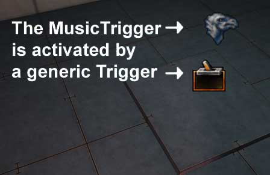

In this example the MusicTrigger is set up to play the StageMusic.ogg file from UT2K3. Once triggered the .ogg file will fade in over two seconds and if triggered again, it will fade out over 5 seconds. The properties for the MusicTrigger are set up like so:

| [Section](https://udn.epicgames.com/bin/publish/WebHome?webs=Main%2CTwo%2CThree%2CPowered&amp;inclusions=%2A&amp;exclusions=&amp;filter=&amp;inclfilter=%5C%25META%5C%3AFIELD%5C%7Bname%5C%3D%5C%22Documentavailability%5C%22.%2Avalue%5C%3D%5C%22General%20public%5C%22&amp;filterbymeta=yes&amp;skin=static_udn3&amp;restrictedclass=restricted&amp;format=&amp;sortcol=0;table=4;up=0#sorted_table "Sort by this column") | [Property](https://udn.epicgames.com/bin/publish/WebHome?webs=Main%2CTwo%2CThree%2CPowered&amp;inclusions=%2A&amp;exclusions=&amp;filter=&amp;inclfilter=%5C%25META%5C%3AFIELD%5C%7Bname%5C%3D%5C%22Documentavailability%5C%22.%2Avalue%5C%3D%5C%22General%20public%5C%22&amp;filterbymeta=yes&amp;skin=static_udn3&amp;restrictedclass=restricted&amp;format=&amp;sortcol=1;table=4;up=0#sorted_table "Sort by this column") | [Value](https://udn.epicgames.com/bin/publish/WebHome?webs=Main%2CTwo%2CThree%2CPowered&amp;inclusions=%2A&amp;exclusions=&amp;filter=&amp;inclfilter=%5C%25META%5C%3AFIELD%5C%7Bname%5C%3D%5C%22Documentavailability%5C%22.%2Avalue%5C%3D%5C%22General%20public%5C%22&amp;filterbymeta=yes&amp;skin=static_udn3&amp;restrictedclass=restricted&amp;format=&amp;sortcol=2;table=4;up=0#sorted_table "Sort by this column") | [Explanation](https://udn.epicgames.com/bin/publish/WebHome?webs=Main%2CTwo%2CThree%2CPowered&amp;inclusions=%2A&amp;exclusions=&amp;filter=&amp;inclfilter=%5C%25META%5C%3AFIELD%5C%7Bname%5C%3D%5C%22Documentavailability%5C%22.%2Avalue%5C%3D%5C%22General%20public%5C%22&amp;filterbymeta=yes&amp;skin=static_udn3&amp;restrictedclass=restricted&amp;format=&amp;sortcol=3;table=4;up=0#sorted_table "Sort by this column") |
| --- | --- | --- | --- |
| Event | Tag | *MusicTrigger* | This is just left at its default setting. Just make sure that it matches the Event of whatever is calling it. |
| MusicTrigger | FadeInTime | *2.0* | The song will fade in over 2 seconds once triggered. |
|  | FadeOutTime | *5.0* | The song will fade in over 5 seconds once triggered. |
|  | Song | *StageMusic* | This is the name of the .ogg file minus the extension. It is important to leave off the extension and also to have this .ogg file located in the Music folder of your game. |

And the generic Trigger is set up like so:

| [Section](https://udn.epicgames.com/bin/publish/WebHome?webs=Main%2CTwo%2CThree%2CPowered&amp;inclusions=%2A&amp;exclusions=&amp;filter=&amp;inclfilter=%5C%25META%5C%3AFIELD%5C%7Bname%5C%3D%5C%22Documentavailability%5C%22.%2Avalue%5C%3D%5C%22General%20public%5C%22&amp;filterbymeta=yes&amp;skin=static_udn3&amp;restrictedclass=restricted&amp;format=&amp;sortcol=0;table=5;up=0#sorted_table "Sort by this column") | [Property](https://udn.epicgames.com/bin/publish/WebHome?webs=Main%2CTwo%2CThree%2CPowered&amp;inclusions=%2A&amp;exclusions=&amp;filter=&amp;inclfilter=%5C%25META%5C%3AFIELD%5C%7Bname%5C%3D%5C%22Documentavailability%5C%22.%2Avalue%5C%3D%5C%22General%20public%5C%22&amp;filterbymeta=yes&amp;skin=static_udn3&amp;restrictedclass=restricted&amp;format=&amp;sortcol=1;table=5;up=0#sorted_table "Sort by this column") | [Value](https://udn.epicgames.com/bin/publish/WebHome?webs=Main%2CTwo%2CThree%2CPowered&amp;inclusions=%2A&amp;exclusions=&amp;filter=&amp;inclfilter=%5C%25META%5C%3AFIELD%5C%7Bname%5C%3D%5C%22Documentavailability%5C%22.%2Avalue%5C%3D%5C%22General%20public%5C%22&amp;filterbymeta=yes&amp;skin=static_udn3&amp;restrictedclass=restricted&amp;format=&amp;sortcol=2;table=5;up=0#sorted_table "Sort by this column") | [Explanation](https://udn.epicgames.com/bin/publish/WebHome?webs=Main%2CTwo%2CThree%2CPowered&amp;inclusions=%2A&amp;exclusions=&amp;filter=&amp;inclfilter=%5C%25META%5C%3AFIELD%5C%7Bname%5C%3D%5C%22Documentavailability%5C%22.%2Avalue%5C%3D%5C%22General%20public%5C%22&amp;filterbymeta=yes&amp;skin=static_udn3&amp;restrictedclass=restricted&amp;format=&amp;sortcol=3;table=5;up=0#sorted_table "Sort by this column") |
| --- | --- | --- | --- |
| Events | Event | *MusicTrigger* | This must match the MusicTrigger's Tag. |
| Trigger | ReTriggerDelay | *5.0* | This is a generous delay that prevents the Trigger from being reactivated too quickly. |

After you have these two Triggers in your level and the .ogg file in your Music folder, the MusicTrigger will be ready to go.

### Counter

The Counter Trigger is another trigger that requires additionally generic Tiggers to activate it. A Counter Trigger will wait until it hears so many other trigger activations until it activates its own event. Here you can see the three generic Triggers that all send out an event to the Counter Trigger

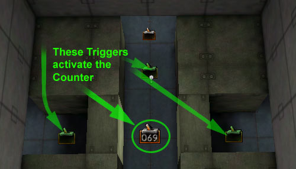

The generic Triggers all have the following properties:

| [Section](https://udn.epicgames.com/bin/publish/WebHome?webs=Main%2CTwo%2CThree%2CPowered&amp;inclusions=%2A&amp;exclusions=&amp;filter=&amp;inclfilter=%5C%25META%5C%3AFIELD%5C%7Bname%5C%3D%5C%22Documentavailability%5C%22.%2Avalue%5C%3D%5C%22General%20public%5C%22&amp;filterbymeta=yes&amp;skin=static_udn3&amp;restrictedclass=restricted&amp;format=&amp;sortcol=0;table=6;up=0#sorted_table "Sort by this column") | [Property](https://udn.epicgames.com/bin/publish/WebHome?webs=Main%2CTwo%2CThree%2CPowered&amp;inclusions=%2A&amp;exclusions=&amp;filter=&amp;inclfilter=%5C%25META%5C%3AFIELD%5C%7Bname%5C%3D%5C%22Documentavailability%5C%22.%2Avalue%5C%3D%5C%22General%20public%5C%22&amp;filterbymeta=yes&amp;skin=static_udn3&amp;restrictedclass=restricted&amp;format=&amp;sortcol=1;table=6;up=0#sorted_table "Sort by this column") | [Value](https://udn.epicgames.com/bin/publish/WebHome?webs=Main%2CTwo%2CThree%2CPowered&amp;inclusions=%2A&amp;exclusions=&amp;filter=&amp;inclfilter=%5C%25META%5C%3AFIELD%5C%7Bname%5C%3D%5C%22Documentavailability%5C%22.%2Avalue%5C%3D%5C%22General%20public%5C%22&amp;filterbymeta=yes&amp;skin=static_udn3&amp;restrictedclass=restricted&amp;format=&amp;sortcol=2;table=6;up=0#sorted_table "Sort by this column") | [Explanation](https://udn.epicgames.com/bin/publish/WebHome?webs=Main%2CTwo%2CThree%2CPowered&amp;inclusions=%2A&amp;exclusions=&amp;filter=&amp;inclfilter=%5C%25META%5C%3AFIELD%5C%7Bname%5C%3D%5C%22Documentavailability%5C%22.%2Avalue%5C%3D%5C%22General%20public%5C%22&amp;filterbymeta=yes&amp;skin=static_udn3&amp;restrictedclass=restricted&amp;format=&amp;sortcol=3;table=6;up=0#sorted_table "Sort by this column") |
| --- | --- | --- | --- |
| Event | Events | *Counter* | This is the tag of the Counter Trigger. |
| Trigger | bTriggerOnlyOnce | *True* | This ensures that you have to hit each of the three triggers. |

The Counter Trigger has is set up like this:

| [Section](https://udn.epicgames.com/bin/publish/WebHome?webs=Main%2CTwo%2CThree%2CPowered&amp;inclusions=%2A&amp;exclusions=&amp;filter=&amp;inclfilter=%5C%25META%5C%3AFIELD%5C%7Bname%5C%3D%5C%22Documentavailability%5C%22.%2Avalue%5C%3D%5C%22General%20public%5C%22&amp;filterbymeta=yes&amp;skin=static_udn3&amp;restrictedclass=restricted&amp;format=&amp;sortcol=0;table=7;up=0#sorted_table "Sort by this column") | [Property](https://udn.epicgames.com/bin/publish/WebHome?webs=Main%2CTwo%2CThree%2CPowered&amp;inclusions=%2A&amp;exclusions=&amp;filter=&amp;inclfilter=%5C%25META%5C%3AFIELD%5C%7Bname%5C%3D%5C%22Documentavailability%5C%22.%2Avalue%5C%3D%5C%22General%20public%5C%22&amp;filterbymeta=yes&amp;skin=static_udn3&amp;restrictedclass=restricted&amp;format=&amp;sortcol=1;table=7;up=0#sorted_table "Sort by this column") | [Value](https://udn.epicgames.com/bin/publish/WebHome?webs=Main%2CTwo%2CThree%2CPowered&amp;inclusions=%2A&amp;exclusions=&amp;filter=&amp;inclfilter=%5C%25META%5C%3AFIELD%5C%7Bname%5C%3D%5C%22Documentavailability%5C%22.%2Avalue%5C%3D%5C%22General%20public%5C%22&amp;filterbymeta=yes&amp;skin=static_udn3&amp;restrictedclass=restricted&amp;format=&amp;sortcol=2;table=7;up=0#sorted_table "Sort by this column") | [Explanation](https://udn.epicgames.com/bin/publish/WebHome?webs=Main%2CTwo%2CThree%2CPowered&amp;inclusions=%2A&amp;exclusions=&amp;filter=&amp;inclfilter=%5C%25META%5C%3AFIELD%5C%7Bname%5C%3D%5C%22Documentavailability%5C%22.%2Avalue%5C%3D%5C%22General%20public%5C%22&amp;filterbymeta=yes&amp;skin=static_udn3&amp;restrictedclass=restricted&amp;format=&amp;sortcol=3;table=7;up=0#sorted_table "Sort by this column") |
| --- | --- | --- | --- |
| Counter | NumToCount | *3* | This is how many times the Counter is listening for other Trigger activations. |
| Events | Event | *Done* | This sends out an event to the large Mover platform that raises the player up. |
|  | Tag | *Counter* | Make sure this matches the tag of whatever event you wish to trigger after all three generic triggers have been activated. |

The Counter Trigger in the example map is located in the middle of the raised platforms. It is activated only after all three generic Triggers are activated (in any order). Here is the path a player must follow to navigate through all the Triggers

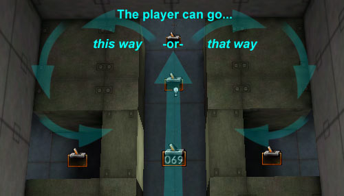

Note that there is a fourth generic Trigger that activates two Movers that rotate in place once to create a loop.

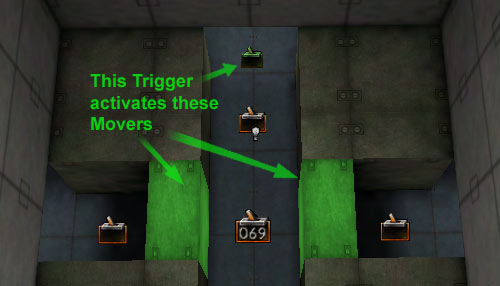

Once all of the Triggers are activated, the Counter Trigger activates a third mover that lifts the player over everything.

### UseTrigger

A UseTrigger is a trigger that allows the player to determine when they want to activate something as long as they are in the collision cylinder of the UseTrigger. In this example map, a UseTrigger is used to activate a Mover causing it to move from one side of the room to the other. All that is need is the UseTrigger and the Mover.

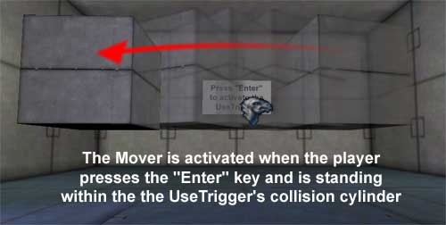

By default the "use" key is assigned to the "Enter" and "f" keys in build 2226. To find out what your "use" key is in your game (or to change it) open up your User.ini file in the game's System folder and search for "=Use".

### ViewShaker

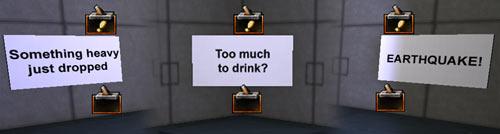

A ViewShaker, once activated by a generic trigger or some other event will cause all player cameras within a specified radius from the ViewShaker to shake. In this example map, three ViewShakers have been set up to show the different ways in which you can use them.The first example demonstrates a ViewShaker that shakes the player's camera as if something heavy has just been dropped. The second slowly rolls and shakes the camera making the player feel very unbalanced. The third simulates a brief yet fierce earthquake. Here is how each of the properties are set up (all of the properties below can be found under the *ViewShaker* property at the bottom of the Properties window of the ViewShaker Actor):Something heavy dropping:

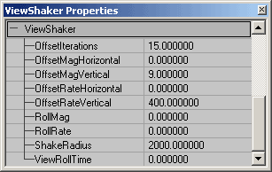

Unbalanced, drunken camera:

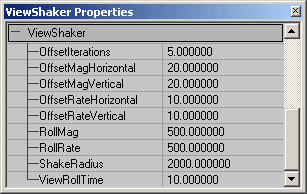

Earthquake:

## Example Two: Triggers Map

The [EM\_Triggers1.zip](../assets/em_triggers2.zip) file is a compressed archive that contains a map which demonstrates TriggerConditions and will require Epic content from the [CodeDrop2226](https://udn.epicgames.com/Two/CodeDrop2226) build.As mentioned above, this map (created by Chris Linder) requires Epic content from the [CodeDrop2226](https://udn.epicgames.com/Two/CodeDrop2226) build.

### TriggerCondition

TriggerConditions allow you to control AI with Triggers. In this example there are two rooms each with a Trigger, TriggerCondition, and an Pawn with an AIScript. The room on the left (in which you start) shows a Pawn that will run back and forth between two points only when a player is standing on the Trigger. The second room on the right has a pawn with a behavior that can be toggled on and off. Here is how these Trigger conditions were set up.

#### TriggerCondition 1

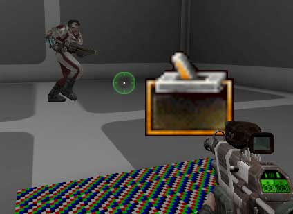

In this room the Pawn will remain stationary until the player stands within the trigger collision. While the player is standing within the trigger collision, the Pawn will run back and forth. The following actors were required to set up this simple scene:

* A Pawn (the WarCOGMedic)
* Two PathNodes for the Pawn to travel between
* An AISCript with a series of AIScript Actions
* A TriggerCondition
* A Trigger

The AIScript is set up as follows:

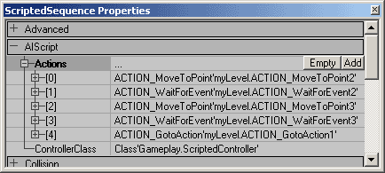

And the TriggerCondition Trigger is set up as follows:

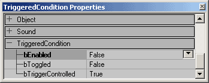

Lastly make sure that you have a regular Trigger to activate the TriggerCondition.

#### TriggerCondition 2

In the second room, the Pawn will continue to run back and forth between the two PathNodes until the player toggles the trigger. When the Trigger is turned on, a TriggerLight is activated and the Pawn will pause and play an animation when it is under that light. The Pawn will continue to run back and forth playing this animation until the Trigger is toggled back, then the TriggerLight will turn off and the Pawn well return to just running back and forth without playing the animation. All that is needed for this is everything listed [above](ExampleMapsTriggers.md#TriggerConditionStuff) and a TriggerLight. Below you can see how the AIScript and TriggerCondition are set up for this example.

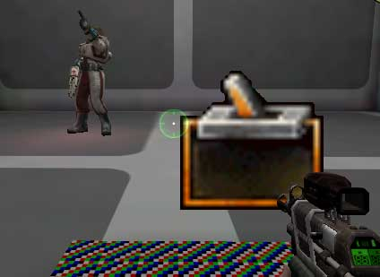

The AIScript is set up as follows:

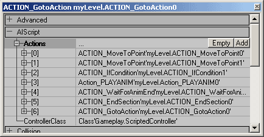

And the TriggerCondition Trigger is set up as follows:

Lastly make sure that you have a regular Trigger to activate the TriggerCondition.

## Downloads

To run the first map you will need to download the [EM\_Triggers1.zip](../assets/em_triggers1.zip) file and extract and put the map and texture package into the appropriate folders of your build. This map is for any 2226 build (such as UDNBuild2226 or [CodeDrop2226](https://udn.epicgames.com/Two/CodeDrop2226)).To run the second map, you will need to download the [EM\_Triggers2.zip](../assets/em_triggers2.zip) file and extract and put the map into the Maps folder of a build that has Epic content from [CodeDrop2226](https://udn.epicgames.com/Two/CodeDrop2226).
