# Warp Zones

*Document Summary: explains how to use warp zones to create worlds that defy conventional space. This is suitable for intermediate skill levels.**Document Changelog: Fixed a broken image tag.*

* [Warp Zones](ExampleMapsWarpZones.md#Warp Zones)
  + [Introduction](ExampleMapsWarpZones.md#Introduction)
  + [WarpZone Basics](ExampleMapsWarpZones.md#WarpZone Basics)
  + [Bigger on the inside](ExampleMapsWarpZones.md#Bigger on the inside)
  + [Infinite Rooms](ExampleMapsWarpZones.md#Infinite Rooms)
  + [Ring Worlds](ExampleMapsWarpZones.md#Ring Worlds)
  + [Warp Zones](ExampleMapsWarpZones.md#Warp Zones)
  + [Downloads](ExampleMapsWarpZones.md#Downloads)
  + [Downloads](ExampleMapsWarpZones.md#Downloads)

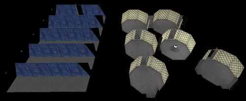

## Introduction

WarpZones can be used to create a variety of effects. This example map document outlines the possible effects and demonstrates how to set them up. The effects include creating rooms that are larger on their inside than their outside, infinite rooms, and creating ring worlds with WarpZones. This document assumes that you are familiar with the Unreal Ed interface, can create basic maps.

## WarpZone Basics

Before you start on creating your WarpZones, you will want to make sure that you follow these guidelines

* **bUseStencil = True** Make sure you have this set option in your *.ini* file set to true. You will need to exit Unreal Ed, go into your system folder open up your *yourgam.ini/ file (in a clean build from UDN, that would be the \_UW.ini* file), search for "UseStencil" and set that value to True. If you don't know which *.ini* file to update, ask a programmer.
* **WarpZone Portal Textures** You will need to create special shaders to assign to the WarpZone Portals. This is described in greater detail [here](MirrorsAndWarpZones.md#Correcting_WarpZone_Portals) .
* **WarpZone Portal Alignment** WarpZones work best when the Zones you are warping between are facing in opposite directions (e.g. WarpZone A faces East and warps to WarpZone B which faces west).
* **SkyZonesInfos** Having a SkyZone in your level can *sometimes* cause artifacts to appear when looking through a WarpZone Portal. Test this early if you intend to use a SkyZone in your level.

For more detailed information, see the [MirrorsAndWarpZones](MirrorsAndWarpZones.md) document.

## Bigger on the inside

The first example demonstrates how to create a room that is bigger on the inside than it is on the outside. The PlayerStart is placed within an octagonal room and at one side is a doorway leading to an outdoor environment.

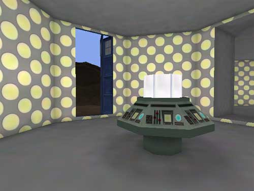

Upon entering and turning around, the player will see that the entire octagonal room with hallways leading off of it is entirely contained within a phone booth.

This effect is accomplished by creating a BSP Zone within the phone booth that warps to a BSP Zone that is on the other side of the doorway to the octagonal room.

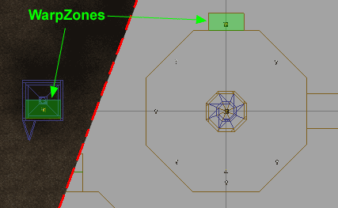

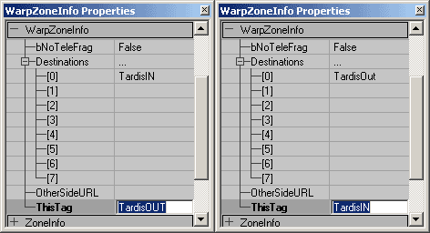Note that there is some popping as the player warps from one Zone to the other. This can be minimized by making the depth of the WarpZone equal to slightly larger that the radius of the player. The center of the collision of the player is what triggers the warping.

## Infinite Rooms

The simplest effect with WarpZones is to create a series of rooms that loop back on themselves.

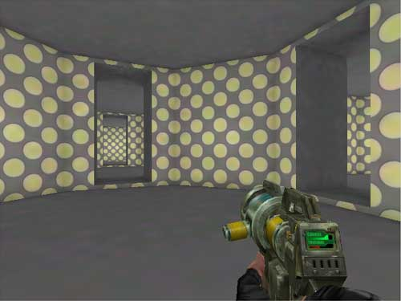

The important thing to note about these WarpZones is that each pair of connecting WarpZones face in opposite directions. If the WarpZones are not oriented in this manner, the WarpZone Portals may become confused and not draw the Zone on the other side correctly.The below image shows how the zones are set up to face each other.

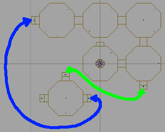

These WarpZones also have the popping problem, but as above this can be minimized by reducing the depth of the WarpZonesm or, due to the layout of these zones, another approach can be used. The popping is caused by the camera seeing into the WarpZone before the Player is warped to the connecting Zone. In this map, the WarpZones are small chambers without any lights, however they don't need to be. They could be a reproduction of the Zone you are warping to. It need not be a full reproduction of the room complete with all of the hallways that may lead off from it, but just enough to give the appearance that the room the camera sees on the other side, is the same as the room that the player is warping to.

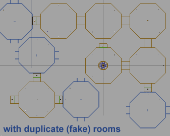

This method requires a little more planning since it will require there to be enough space on the other side of the WarpZone to place the fake room, and in some cases it will not be possible (for instance in creating spaces that are bigger on the inside than on the outside).

## Ring Worlds

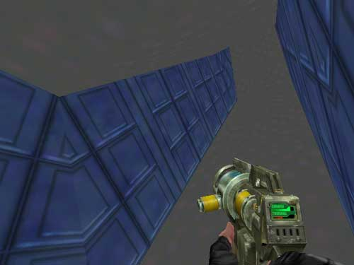

Another effect achievable through the use of WarpZones are "Ring Worlds," or levels that allow you walk on the inside of a ring as if gravity was pulling you towards the ring whether you are on the top side or bottom side of the ring.

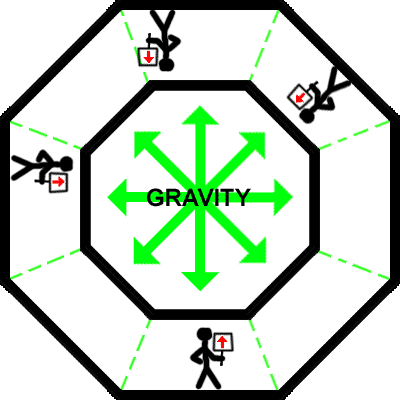

How this effect works is that each section of the ring is a Zone that you use a WarpZone to warp back and forth from. In this example there are 5 sections that make up the ring and they are placed side by side as shown:

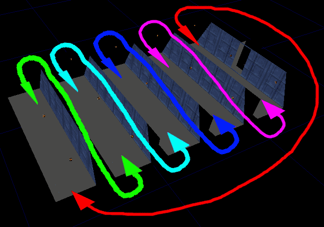

The trick here is that the WarpZone Portals are at an angle:

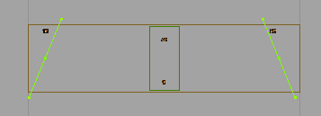

The angel creates the illusion that the next section is on an incline when seen through the WarpZone Portal.And as also described in the above example, the [popping problem](ExampleMapsWarpZones.md#PoppingProblem) can be solved by making the WarpZone leading to next section be identical in appearance to the next section the player would warp to.

## Warp Zones

For more information on WarpZones, see the [MirrorsAndWarpZones](MirrorsAndWarpZones.md) document.

## Downloads

## Downloads

Below you can download a compressed archive that contains the content for this example:

* [EM\_WarpZones.zip](rsrc/Two/ExampleMapsWarpZones/EM_WarpZones.zip) (for Unreal Engine 2 build 2226)
