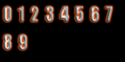
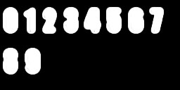
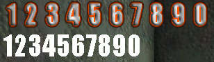

# Font Tutorial

*Last updated by Chris Linder (DemiurgeStudios?), to include "font update" command. Original author was Chris Linder (DemiurgeStudios?).*

* [Font Tutorial](FontTutorial.md#font-tutorial)
  + [Introduction](FontTutorial.md#introduction)
  + [Font Lowdown](FontTutorial.md#font-lowdown)
  + [True Type Fonts](FontTutorial.md#true-type-fonts)
  + [Exporting Fonts](FontTutorial.md#exporting-fonts)
    - [Messing with the Images](FontTutorial.md#messing-with-the-images)
  + [Importing Fonts](FontTutorial.md#importing-fonts)
    - [FontUpdater (licensee only)](FontTutorial.md#fontupdater-licensee-only))
    - ["Font Update" UnrealEd Command](FontTutorial.md#font-update-unrealed-command)
  + [Using Fonts In-Game](FontTutorial.md#using-fonts-in-game)
  + [Example](FontTutorial.md#example)

## Introduction

So you want to put your own fonts in your game, sure we all do. This tutorial will show you how to put True Type fonts in your game as well as how to export and import fonts such that they can be adjusted and tweaked in Photoshop. Working with just True Type fonts with no modification is very easy. Exporting and importing fonts is trickier but there are tools that help you along.

## Font Lowdown

Fonts in Unreal are composed of multiple textures containing the letters of the font broken up into "pages". There is also an abstract *Font* object that you can never examine that stores the information about the font like which images the font uses and how far the letters should be spaced. It is this font object that makes working with fonts very difficult because you can never replace a font image in UnrealEd because it is always in use by this font object. To deal with the image replacement problem you can either use Josh Adam's [FontUpdater](https://udn.epicgames.com/Two/FontUpdater) tool (recommended for licensees) or the "font update" command in UnrealEd.

## True Type Fonts

One of the best ways to import fonts is to put font importing exec commands in a text file and then exec that file from Unrealed. Such a text file might look like these:**```

new truetypefontfactory package=MyFonts name=Arial FontName="Arial" Height=12
new truetypefontfactory package=MyFonts name=ArialBig FontName="Arial" Height=20
obj savepackage package="MyFonts" file="..\textures\ MyFonts.utx"
```**You must supply a package and a name for each font you create. The font importing command can also take many optional parameters only two of which are used above (FoneName and Height). The options are listed below:

| Name | Type | Description | Default |
| --- | --- | --- | --- |
| FontName | string | This is the name of the True Type font used to generate this font. | "MS Sans Serif" |
| Height | int | The height of the characters for this font. Think of this as the True Type font size | 16 |
| Style | int | This is used to set the boldness of the font in an odd sort of way. (500=normal, 600=bold, 700=very bold) | normal |
| Italic | bool | If this set to 1 (true) the font will be italic | 0 |
| Underline | bool | If this set to 1 (true) the font will be underlined. | 0 |
| AntiAlias | bool | If this set to 1 (true) the font will be anti-aliased | 0 |
| DropShadowX / DropShadowY | int | These are used to create a drop shadow for the text. The drop shadow will be black. X and Y specify the offset of the drop shadow from the original text | 0 |
| Chars | string | Normally the font will import the standard 256 characters of the font. If you use this option only the characters that you pass in this string will be part of the font. For example if you wanted a font just for numbers you could pass Chars="1234567890". | uses all 256 characters |
| UnicodeRange | string | This will append Unicode characters to the set of characters this font would normally create. Unicode characters are given in hex in comma separated lists of ranges. If you want on specific character you must give it as a range from itself to itself. For example: **Chars="-" UnicodeRange="061f-061f,0621-063a,0640-0655"** | no Unicode characters |
| Kerning | int | This is used to adjust the space between the characters of the written font (it does not effect the font image). If this is positive there will be more space between characters while if it is negative, there will be less space even to the point of overlap. | 0 |
| ExtendBoxLeft / ExtendBoxRight / ExtendBoxTop / ExtendBoxBottom | int | These will increase the size of the box that is stored for each font letter. This effects the way the font is display not the font image itself. If ExtendBoxRight is large, every time you try to print an `A' you will get an `A' and part of a `B'. ExtendBoxRight and ExtendBoxBottom are useful when combined with XPad and YPad which affect the font image. You might think about using these if you are planning on exporting the font and Photoshopping it in a way that will increase the size of each character. | 0 |
| XPad/YPad | int | These change the spacing of the characters in the texture but not when it is printed. These are most useful when used with ExtendBoxRight and ExtendBoxBottom | 0 |
| Usize/VSize | int | This is the size, in the horizontal and vertical dimensions respectively, of texture to put the font on. If the font doesn't need a texture as large as specified, it will use something smaller. | 256 |
| Path/Wildcard | string | This is a path and filename/wildcard that are combined to make a list of files that will be read and all the characters in the files will be put in the font. (for example: **Path="." WildCard="MyChars.\*"**) This is useful for Unicode so you do not have type in all the codes. Simply make a file that includes the Unicode characters you want (by pasting from the Character Map for example) and save it in "Unicode - Codepage 1200" format. This can be done in Dev Studio by pulling down the arrow next to the save button in the Save-As dialog. This does not affect the standard character set which is included by default. | not used by default |
| Count | int | This is never referenced in code and therefore doesn't do anything | 256 |
| Gamma | float | This is never referenced in code and therefore doesn't do anything | 0.7 |

## Exporting Fonts

By default, you can not export font textures because they are compressed. There are two main ways to deal with this:**1. Change the Code (licensee only)**To export fonts you must change part of the font importer in *TTFontImport.cpp*. The font importer compresses all fonts to DXT5 which means you can not export them. Simply comment out line 495:
**```

Texture->Compress( TEXF_DXT5 );
```**
and recompile. Now follow the font importing instructions [above](FontTutorial.md#true-type-fonts) and the fonts you import will not be compressed so you can export them. Be sure to change the compress line back to normal so you don't accidentally have many uncompressed fonts.**2. Screen Shot the Font**This method is theoretically simple but annoying. You can take a screen shot of the texture browser in UnrealEd when the font image you want is selected. Then crop and process this image in PhotoShop.

### Messing with the Images

Now that you have the font images, you can apply all sorts of effects to the letters and change their appearance in an image editing program. Keep in mind that the font should remain white if you want to change the color of the font with the SetDrawColor(...). Also, do not forget about the alpha channel of the font.

## Importing Fonts

There are two ways to import fonts; you can either use the [FontUpdater](https://udn.epicgames.com/Two/FontUpdater) tool (recommended for licensees) or the "font update" command in UnrealEd.

### FontUpdater (licensee only)

Now you are ready to import the font using the [FontUpdater](https://udn.epicgames.com/Two/FontUpdater). Please refer to this document for full details on installation and use. Once set up, go to a command prompt in your the system directory of your game. Type something along the lines of:**```

ucc fontupdate ..\Textures\MyFonts.utx c:\temp MyFont_PageA.tga
```**You must run this commandlet for each page of the font you wish to import. It is best to not be running the engine or Unrealed. Running this commandlet will overwrite your existing font that you imported.

### "Font Update" UnrealEd Command

First load the texture package that contains the font you want to alter. Even it the package is already open, opening the package ensures that all the fonts and images in this package are loaded.The next step to using "font update" is importing the image you wish to use as a font page. (See [Font Lowdown](FontTutorial.md#font-lowdown) above for more info on font pages.) Import the texture as you normally would. The texture can be put in any package but it is probably best to put it in the package that contains the font already.Now at the **"Command"** text box in UnrealEd type:**`font update font=name_of_font texture=name_of_texture page=font_page_to_replace`**For example: Lets assume the texture package that contained your fonts is *MyFonts\_T*. Also, let's say the font page you wanted to replace is the first page of *MyFont17* and you wanted to replace it with the texture *MyFonts\_T.MyFont17\_PageA\_New*. In this case you would type:**```

font update Font=MyFonts_T.MyFont17 Texture=MyFonts_T.MyFont17_PageA_New Page=0
```**The "font update" command will tell the abstract font object to point to the new texture instead of the old one. Both textures will still exist in the texture package and nothing will appear to have changed, but when you run the game, the font will be using the new texture.

## Using Fonts In-Game

Fonts are used by using variables of type *Font*. You can assign font variables in defaultproperties like so:
**```

SmallFont=Font'Engine.SmallFont'
```**
or in script code like so:
**```

Canvas.Font = font'FunFonts.FunFont';
```**
To assign fonts in script like this without using default properties you must have loaded the package that contains the font with a #exec command at the top of a script file like so:
**```

#exec OBJ LOAD FILE=..\Textures\FunFonts.utx PACKAGE=FunFonts
```**
Another solution would be to use DynamicLoadObject to load the font this this:
**```

Canvas.Font = Font(DynamicLoadObject("FunFonts.FunFont", class'Font'));
```**
Now just draw text to the screen with your fine new font. (See the [CanvasReference](../Technical%20and%20Programming/User%20Interface/CanvasReference.md) if you need help drawing text.)

## Example

This example will show how to make a fancy font for numbers. First we start the font creation process by making the following text file *NumFont.exec* in the system directory.**new truetypefontfactory package=NumFonts name=NumFontBasic fontname="Impact" height=30 antialias=1 Chars="1234567890"new truetypefontfactory package=NumFonts name=NumFont fontname="Impact" height=30 antialias=1 Chars="1234567890" XPad=10 YPad=10 ExtendBoxRight=10 ExtendBoxBottom=10obj savepackage package="NumFonts" file="..\textures\NumFonts.utx"***Note: There should be only 3 lines in this file; the lines are wrapping here because they are long.*The NumFont has an XPad/YPad and an ExtendBoxRight/ ExtendBoxBottom so that when we edit the font in Photoshop and add a glow, the numbers will not overlap. (It turns out 10 was a bit too large, 6 would have been better). Next we open Unrealed and type **"exec NumFont.exec"** in the Command text box or in the log. This will create the font texture package. Now we open the *NumFonts.utx* package in the editor and [export](FontTutorial.md#exporting-fonts) the "NumFont\_PageA.tga" image as a tga file to the c:\temp\Fonts directory. After closing Unrealed and opening the exported file in Photoshop we find both the RGB channel and the Alpha channel look like this:


After messing with the image for a bit the RGB and Alpha channels look like this respectively.



Save the image and now it is time to import the image back into the font. One way to do this is by using the [FontUpdater](https://udn.epicgames.com/Two/FontUpdater) described [above](FontTutorial.md#templink1). In that case you would open a command prompt in your system directory and type the line below. If you are using the "font update" command, see the instructions [above](FontTutorial.md#templink2).**```

C:\UDNBuildDev\System>ucc fontupdate ..\Textures\NumFonts.utx c:\temp\Fonts NumFont_PageA.tga
```**Now the can use the font. The image below show the font in game as well of the basic version of the font to which we did nothing. It is spaced too widely as mentioned above but this simple font illustrated the important points and is good enough for an example.


